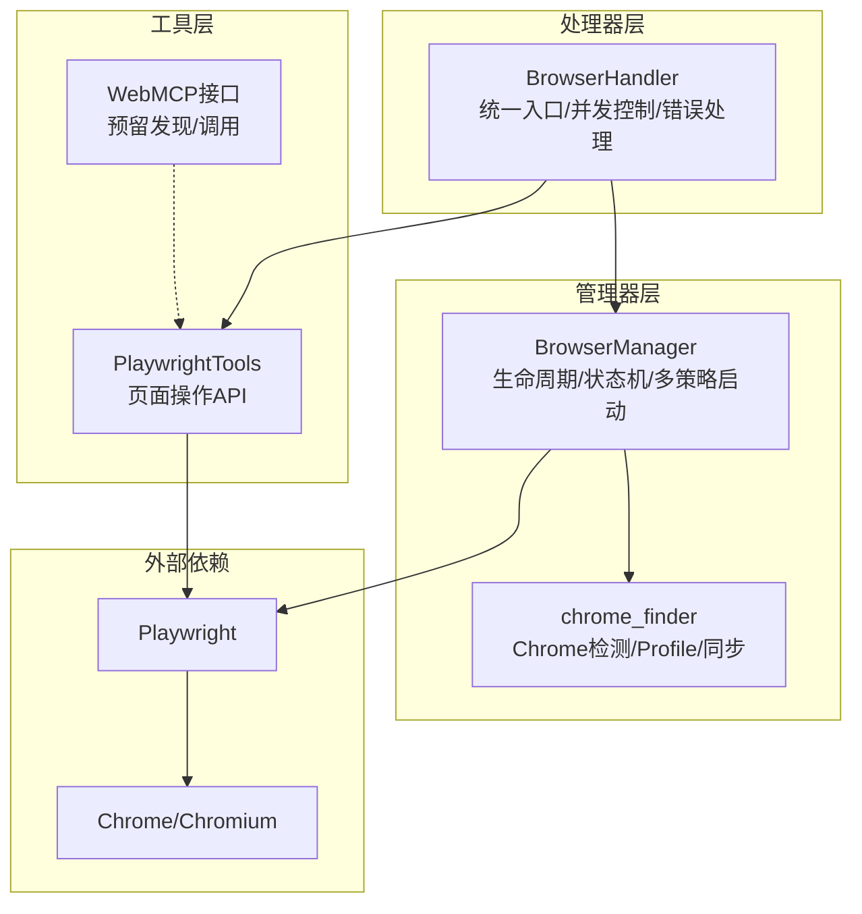
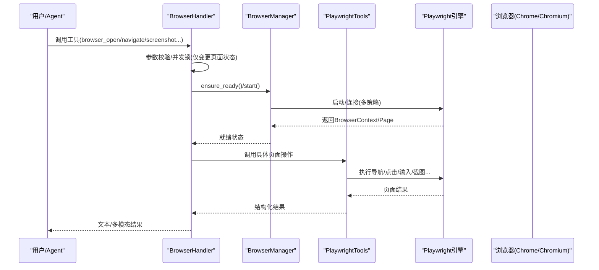
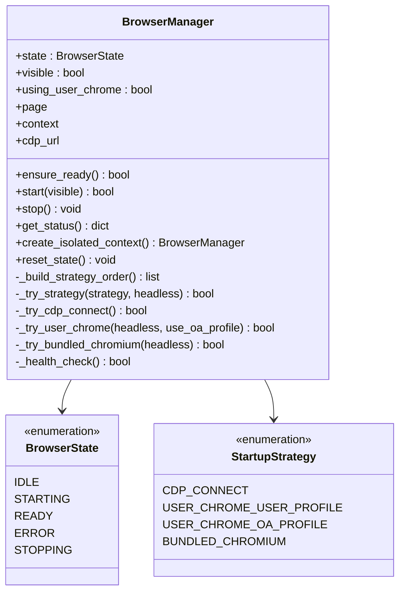
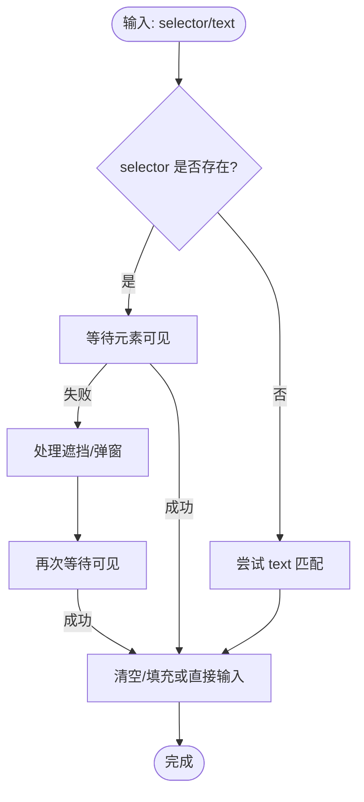
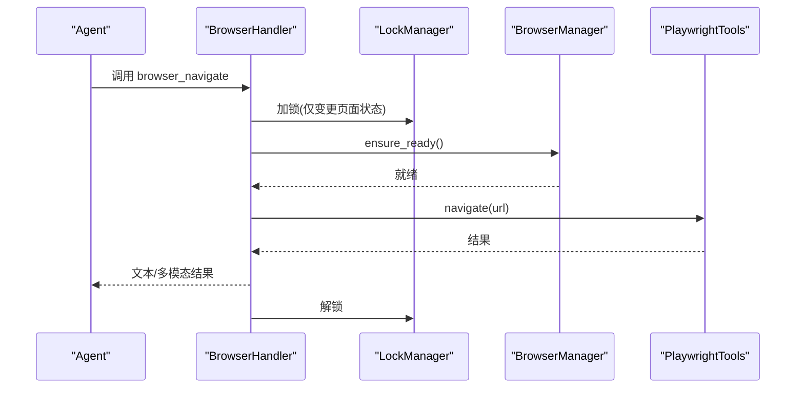
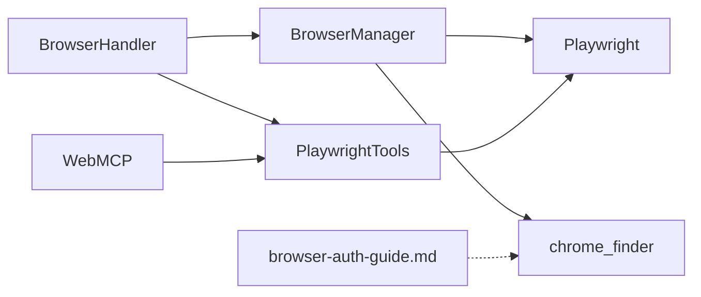

# 浏览器工具

<cite>
**本文引用的文件**
- [manager.py](file://src/synapse/tools/browser/manager.py)
- [playwright_tools.py](file://src/synapse/tools/browser/playwright_tools.py)
- [chrome_finder.py](file://src/synapse/tools/browser/chrome_finder.py)
- [browser.py](file://src/synapse/tools/handlers/browser.py)
- [browser.py](file://src/synapse/tools/definitions/browser.py)
- [browser-auth-guide.md](file://docs/browser-auth-guide.md)
- [webmcp.py](file://src/synapse/tools/browser/webmcp.py)
</cite>

## 目录
1. [简介](#简介)
2. [项目结构](#项目结构)
3. [核心组件](#核心组件)
4. [架构总览](#架构总览)
5. [详细组件分析](#详细组件分析)
6. [依赖关系分析](#依赖关系分析)
7. [性能考量](#性能考量)
8. [故障排查指南](#故障排查指南)
9. [结论](#结论)
10. [附录](#附录)

## 简介
本技术文档围绕浏览器工具体系，系统阐述 WebTool 类（即浏览器自动化能力）的实现原理、Playwright 框架集成方式、网页自动化操作流程，并深入解释页面导航、元素定位、表单填写、截图保存等核心功能的实现机制。文档还覆盖无头浏览器配置、并发控制、会话管理、反爬虫应对策略，提供使用示例、性能调优建议与稳定性保障措施，帮助读者在不同环境下可靠地使用浏览器自动化能力。

## 项目结构
浏览器工具位于 synapse 的 tools/browser 子模块，采用“处理器 + 管理器 + 工具集”的分层设计：
- 处理器层：BrowserHandler 统一接收工具调用，负责并发控制、错误处理与结果封装。
- 管理器层：BrowserManager 负责浏览器生命周期管理（启动、停止、健康检查）、多策略启动与回退、状态机与隔离上下文。
- 工具层：PlaywrightTools 在 BrowserManager 提供的 page 上执行具体页面操作（导航、点击、输入、滚动、等待、执行 JS、截图、标签页管理等）。
- 辅助层：chrome_finder 提供 Chrome 检测、用户配置文件管理与 Cookie 同步；webmcp.py 预留 WebMCP 工具发现与调用接口；definitions/browser.py 定义工具规范与输入输出说明；docs/browser-auth-guide.md 提供登录态保持方案。

图表来源
- [browser.py:57-133](file://src/synapse/tools/handlers/browser.py#L57-L133)
- [manager.py:323-502](file://src/synapse/tools/browser/manager.py#L323-L502)
- [playwright_tools.py:21-40](file://src/synapse/tools/browser/playwright_tools.py#L21-L40)
- [chrome_finder.py:18-87](file://src/synapse/tools/browser/chrome_finder.py#L18-L87)
- [webmcp.py:48-114](file://src/synapse/tools/browser/webmcp.py#L48-L114)

章节来源
- [browser.py:1-625](file://src/synapse/tools/handlers/browser.py#L1-L625)
- [manager.py:1-1016](file://src/synapse/tools/browser/manager.py#L1-L1016)
- [playwright_tools.py:1-509](file://src/synapse/tools/browser/playwright_tools.py#L1-L509)
- [chrome_finder.py:1-225](file://src/synapse/tools/browser/chrome_finder.py#L1-L225)
- [webmcp.py:1-167](file://src/synapse/tools/browser/webmcp.py#L1-L167)

## 核心组件
- BrowserHandler：统一的工具入口，负责参数校验、并发锁、结果封装、多模态返回（截图嵌入图片）、错误恢复与提示。
- BrowserManager：浏览器生命周期管理器，提供状态机、多策略启动（CDP 连接、用户 Chrome、内置 Chromium）、健康检查、隔离上下文、错误恢复与重试。
- PlaywrightTools：在 BrowserManager 提供的 page 上执行具体页面操作，包含导航、点击、输入、滚动、等待、执行 JS、截图、标签页管理等。
- chrome_finder：检测系统 Chrome、管理 Synapse 专用 Profile、同步 Cookie，支持用户 Chrome 与内置 Chromium 的双轨策略。
- WebMCP：预留页面工具发现与调用接口，面向未来标准（W3C navigator.modelContext）。

章节来源
- [browser.py:57-133](file://src/synapse/tools/handlers/browser.py#L57-L133)
- [manager.py:323-502](file://src/synapse/tools/browser/manager.py#L323-L502)
- [playwright_tools.py:21-40](file://src/synapse/tools/browser/playwright_tools.py#L21-L40)
- [chrome_finder.py:18-87](file://src/synapse/tools/browser/chrome_finder.py#L18-L87)
- [webmcp.py:25-46](file://src/synapse/tools/browser/webmcp.py#L25-L46)

## 架构总览
浏览器工具的调用链路如下：
- 用户/Agent 调用工具（如 browser_open、browser_navigate、browser_screenshot 等）。
- BrowserHandler 接收请求，进行参数校验与并发控制（仅对会改变页面状态的操作加锁）。
- BrowserHandler 将请求转发给 BrowserManager 或 PlaywrightTools。
- BrowserManager 确保浏览器处于就绪状态（健康检查或启动），必要时按策略启动（CDP 连接、用户 Chrome、内置 Chromium）。
- PlaywrightTools 在 page 上执行具体操作，返回结构化结果。
- BrowserHandler 对结果进行封装，必要时将截图嵌入多模态内容返回。

图表来源
- [browser.py:99-133](file://src/synapse/tools/handlers/browser.py#L99-L133)
- [manager.py:557-565](file://src/synapse/tools/browser/manager.py#L557-L565)
- [playwright_tools.py:42-84](file://src/synapse/tools/browser/playwright_tools.py#L42-L84)

章节来源
- [browser.py:99-133](file://src/synapse/tools/handlers/browser.py#L99-L133)
- [manager.py:417-502](file://src/synapse/tools/browser/manager.py#L417-L502)
- [playwright_tools.py:42-84](file://src/synapse/tools/browser/playwright_tools.py#L42-L84)

## 详细组件分析

### BrowserManager：浏览器生命周期与多策略启动
- 状态机：IDLE → STARTING → READY → ERROR → STOPPING，支持健康检查与异常恢复。
- 多策略启动顺序：CDP 连接 → 用户 Chrome（默认/OA） → 内置 Chromium，按历史成功策略排序优化。
- 服务器环境检测：在无 GUI 的服务器环境（Windows Server、headless Linux）自动启用无头模式与额外参数。
- 隔离上下文：为并行子 Agent 创建独立 BrowserContext/Page，避免标签页互相干扰。
- 错误处理：检测 driver 管道断裂、Chrome 进程崩溃、profile 被占用等，自动重启或回退策略。
- 启动参数：统一注入 --disable-blink-features=AutomationControlled、--no-sandbox、--disable-dev-shm-usage、--disable-gpu 等，提升兼容性。

图表来源
- [manager.py:238-251](file://src/synapse/tools/browser/manager.py#L238-L251)
- [manager.py:323-502](file://src/synapse/tools/browser/manager.py#L323-L502)

章节来源
- [manager.py:355-502](file://src/synapse/tools/browser/manager.py#L355-L502)
- [manager.py:665-695](file://src/synapse/tools/browser/manager.py#L665-L695)
- [manager.py:830-946](file://src/synapse/tools/browser/manager.py#L830-L946)

### PlaywrightTools：页面操作 API
- 导航 navigate：自动补全协议、等待 domcontentloaded 与 networkidle、延迟与标题获取，失败时检测“浏览器关闭”并重置状态。
- 截图 screenshot：等待网络空闲、提取页面简要文本、自动保存至 data/screenshots、支持多模态嵌入返回。
- 获取内容 get_content：支持 selector 与 format(html/text)，默认返回 body 文本。
- 点击 click：支持 selector 与 text，优先使用 selector，必要时回退 text 匹配。
- 输入 type_text：智能重试（可见性等待、遮挡处理、备用选择器、强制点击、JS 注入），提升鲁棒性。
- 滚动 scroll：支持 up/down 与像素量。
- 等待 wait：等待元素出现或固定毫秒。
- 执行 JS execute_js：在页面上下文执行脚本并返回结果。
- 标签页管理：list_tabs、switch_tab、new_tab，支持复用空白页。
- 遮挡处理：针对常见站点（如百度）移除遮挡层、点击关闭按钮、Esc 与鼠标点击等通用手段。

图表来源
- [playwright_tools.py:179-287](file://src/synapse/tools/browser/playwright_tools.py#L179-L287)
- [playwright_tools.py:429-509](file://src/synapse/tools/browser/playwright_tools.py#L429-L509)

章节来源
- [playwright_tools.py:42-162](file://src/synapse/tools/browser/playwright_tools.py#L42-L162)
- [playwright_tools.py:166-425](file://src/synapse/tools/browser/playwright_tools.py#L166-L425)
- [playwright_tools.py:429-509](file://src/synapse/tools/browser/playwright_tools.py#L429-L509)

### BrowserHandler：并发控制与结果封装
- 并发控制：对会改变页面状态的操作（导航、点击、输入、滚动、执行 JS、新建/切换标签、关闭）加锁，避免多 Agent 并发写入冲突。
- 结果封装：统一返回 success/error/result，browser_get_content 支持 max_length 截断并保存溢出文件。
- 多模态支持：browser_screenshot 在模型支持 vision 时，将截图嵌入多模态内容返回；view_image 支持本地路径与 HTTP(S) URL，自动压缩与 base64 嵌入。
- 错误恢复：捕获“浏览器关闭/目标不存在”等错误，触发 BrowserManager.reset_state() 并提示用户先调用 browser_open。

图表来源
- [browser.py:134-158](file://src/synapse/tools/handlers/browser.py#L134-L158)
- [browser.py:160-230](file://src/synapse/tools/handlers/browser.py#L160-L230)

章节来源
- [browser.py:34-54](file://src/synapse/tools/handlers/browser.py#L34-L54)
- [browser.py:134-230](file://src/synapse/tools/handlers/browser.py#L134-L230)
- [browser.py:358-381](file://src/synapse/tools/handlers/browser.py#L358-L381)

### chrome_finder：Chrome 检测与 Profile 管理
- 检测系统 Chrome：Windows/Linux/macOS 多平台路径扫描，返回可执行路径与用户数据目录。
- Synapse 专用 Profile：独立于用户 Chrome，可在用户 Chrome 运行时使用，避免配置文件冲突。
- Cookie 同步：将用户 Chrome 的 Cookies、Login Data、Preferences 等关键文件同步到 Synapse Profile，保留登录状态。
- DevTools MCP 检测：检测 npx 与 Chrome 可用性，给出 Chrome DevTools MCP 使用建议。

章节来源
- [chrome_finder.py:18-87](file://src/synapse/tools/browser/chrome_finder.py#L18-L87)
- [chrome_finder.py:90-155](file://src/synapse/tools/browser/chrome_finder.py#L90-L155)
- [chrome_finder.py:158-188](file://src/synapse/tools/browser/chrome_finder.py#L158-L188)

### WebMCP：页面工具发现与调用（预留）
- 发现工具：在页面执行 navigator.modelContext API，枚举注册的工具并返回名称、描述与输入模式。
- 调用工具：通过 navigator.modelContext.callTool 调用页面侧注册的结构化工具。
- 适用场景：网站通过 WebMCP 向 AI Agent 暴露结构化工具（如航班搜索），无需 Agent 猜测页面交互。

章节来源
- [webmcp.py:48-114](file://src/synapse/tools/browser/webmcp.py#L48-L114)
- [webmcp.py:117-167](file://src/synapse/tools/browser/webmcp.py#L117-L167)

## 依赖关系分析
- BrowserHandler 依赖 BrowserManager 与 PlaywrightTools，负责并发控制与结果封装。
- BrowserManager 依赖 Playwright 引擎与 chrome_finder，负责启动策略与状态管理。
- PlaywrightTools 依赖 BrowserManager.page，执行具体页面操作。
- WebMCP 依赖页面上下文执行 JS，发现并调用页面侧工具。
- 文档层 browser-auth-guide.md 提供登录态保持方案，指导用户选择 Chrome DevTools MCP 或 mcp-chrome 扩展。

图表来源
- [browser.py:1-625](file://src/synapse/tools/handlers/browser.py#L1-L625)
- [manager.py:1-1016](file://src/synapse/tools/browser/manager.py#L1-L1016)
- [playwright_tools.py:1-509](file://src/synapse/tools/browser/playwright_tools.py#L1-L509)
- [chrome_finder.py:1-225](file://src/synapse/tools/browser/chrome_finder.py#L1-L225)
- [webmcp.py:1-167](file://src/synapse/tools/browser/webmcp.py#L1-L167)
- [browser-auth-guide.md:1-130](file://docs/browser-auth-guide.md#L1-L130)

章节来源
- [browser.py:1-625](file://src/synapse/tools/handlers/browser.py#L1-L625)
- [manager.py:1-1016](file://src/synapse/tools/browser/manager.py#L1-L1016)
- [playwright_tools.py:1-509](file://src/synapse/tools/browser/playwright_tools.py#L1-L509)
- [chrome_finder.py:1-225](file://src/synapse/tools/browser/chrome_finder.py#L1-L225)
- [webmcp.py:1-167](file://src/synapse/tools/browser/webmcp.py#L1-L167)
- [browser-auth-guide.md:1-130](file://docs/browser-auth-guide.md#L1-L130)

## 性能考量
- 启动策略优化：按历史成功策略排序，减少失败重试次数；服务器环境强制无头模式，降低资源消耗。
- 并发控制：仅对会改变页面状态的操作加锁，读取类操作（截图、状态、等待）不阻塞，提升吞吐。
- 超时与等待：导航等待 domcontentloaded 与 networkidle，输入前等待元素可见，避免过早操作。
- 截图优化：等待网络空闲、延迟短暂停顿、自动保存至 data/screenshots，避免频繁 IO。
- 遮挡处理：针对常见站点移除遮挡层与弹窗，减少重试成本。
- 服务器环境：自动注入 --disable-software-rasterizer、--disable-extensions 等参数，提升稳定性。

章节来源
- [manager.py:355-502](file://src/synapse/tools/browser/manager.py#L355-L502)
- [browser.py:34-54](file://src/synapse/tools/handlers/browser.py#L34-L54)
- [playwright_tools.py:42-84](file://src/synapse/tools/browser/playwright_tools.py#L42-L84)
- [playwright_tools.py:86-141](file://src/synapse/tools/browser/playwright_tools.py#L86-L141)

## 故障排查指南
- 浏览器启动失败
  - 检查 Playwright 是否安装：pip install playwright && playwright install chromium。
  - 服务器环境：确认无 GUI，自动启用无头模式；若仍失败，尝试使用用户 Chrome 或内置 Chromium。
  - Chrome 进程冲突：若用户 Chrome 正在运行，可能导致配置文件锁定，建议关闭 Chrome 或改用内置浏览器。
- 浏览器连接断开
  - 若出现“浏览器连接已断开（可能被用户关闭）”，先 reset_state，再调用 browser_open 重新启动。
- 页面元素定位失败
  - 使用 browser_get_content 确认元素是否存在；优先使用 CSS 选择器；必要时使用 text 匹配。
  - 输入失败时，尝试关闭遮挡弹窗、等待元素可见后再输入。
- 截图为空或空白页
  - 确保先调用 browser_navigate 打开页面；避免在 about:blank 上截图。
- 登录态丢失
  - 使用 Chrome DevTools MCP 或 mcp-chrome 扩展连接用户真实 Chrome，保留登录状态与密码管理器。
- 多 Agent 并发冲突
  - 系统已对变更页面状态的操作加锁；若长时间等待，检查是否有 Agent 占用浏览器。

章节来源
- [browser.py:217-230](file://src/synapse/tools/handlers/browser.py#L217-L230)
- [playwright_tools.py:70-84](file://src/synapse/tools/browser/playwright_tools.py#L70-L84)
- [playwright_tools.py:166-177](file://src/synapse/tools/browser/playwright_tools.py#L166-L177)
- [browser-auth-guide.md:1-130](file://docs/browser-auth-guide.md#L1-L130)

## 结论
浏览器工具通过“处理器 + 管理器 + 工具集”的清晰分层，结合 Playwright 的强大页面自动化能力，提供了稳定、可扩展的浏览器自动化解决方案。其多策略启动、健康检查、并发控制与错误恢复机制，使其在复杂环境中具备良好的鲁棒性。配合登录态保持方案与 WebMCP 预留接口，可满足从简单任务到复杂业务场景的自动化需求。

## 附录

### 使用示例（基于工具定义）
- 启动浏览器并检查状态：browser_open(visible=True/False)
- 导航到页面：browser_navigate(url="https://example.com/s?wd=keyword")
- 获取页面内容：browser_get_content(selector=".article-body", format="text/html", max_length=12000)
- 截图保存：browser_screenshot(full_page=False/True, path="data/screenshots/result.png")
- 点击元素：browser_click(selector="button[type='submit']", text="登录")
- 表单输入：browser_type(selector="#search-box", text="关键词", clear=True/False)
- 滚动页面：browser_scroll(direction="down"/"up", amount=500)
- 等待元素：browser_wait(selector=".search-results", timeout=10000)
- 执行 JS：browser_execute_js(script="document.title")
- 标签页管理：browser_list_tabs() / browser_switch_tab(index=0) / browser_new_tab(url="")
- 关闭浏览器：browser_close()

章节来源
- [browser.py:23-751](file://src/synapse/tools/definitions/browser.py#L23-L751)

### 无头浏览器配置与反爬虫应对
- 无头模式：服务器环境自动启用；也可通过 browser_open(visible=False) 手动设置。
- 反爬虫应对：注入 --disable-blink-features=AutomationControlled、--no-sandbox、--disable-dev-shm-usage、--disable-gpu 等参数；针对常见站点移除遮挡层与弹窗；输入时进行可见性等待与智能重试。
- 登录态保持：使用 Chrome DevTools MCP 或 mcp-chrome 扩展连接用户真实 Chrome，保留 Cookie、密码管理器与扩展。

章节来源
- [manager.py:36-50](file://src/synapse/tools/browser/manager.py#L36-L50)
- [playwright_tools.py:429-509](file://src/synapse/tools/browser/playwright_tools.py#L429-L509)
- [browser-auth-guide.md:1-130](file://docs/browser-auth-guide.md#L1-L130)