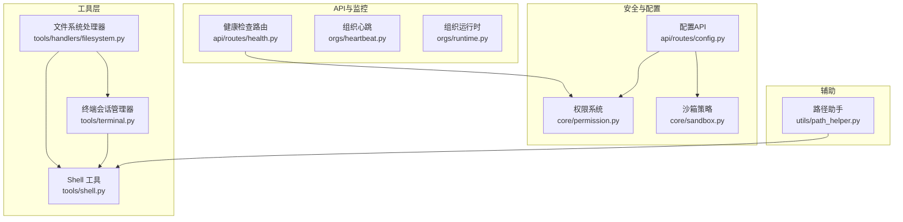
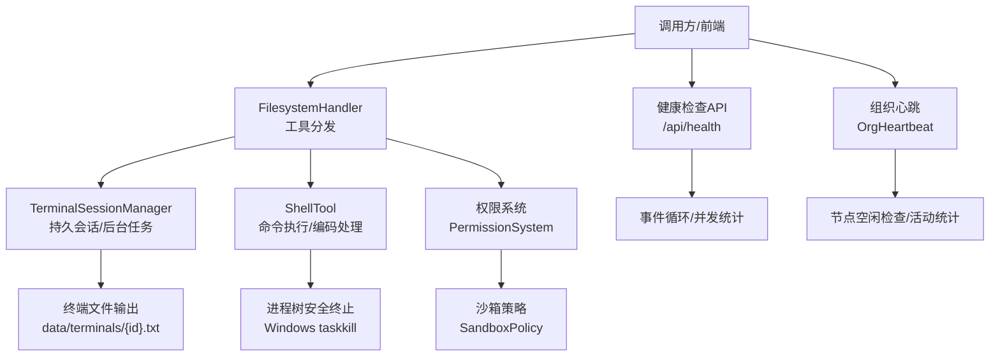
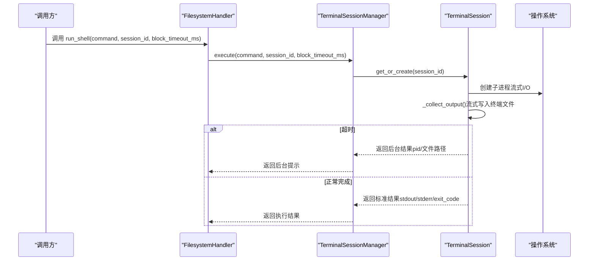
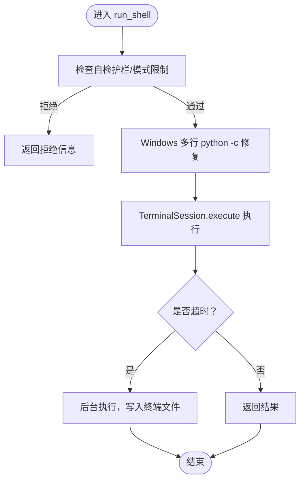
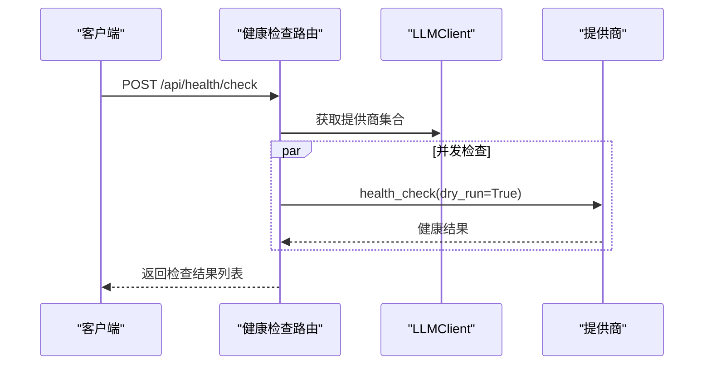
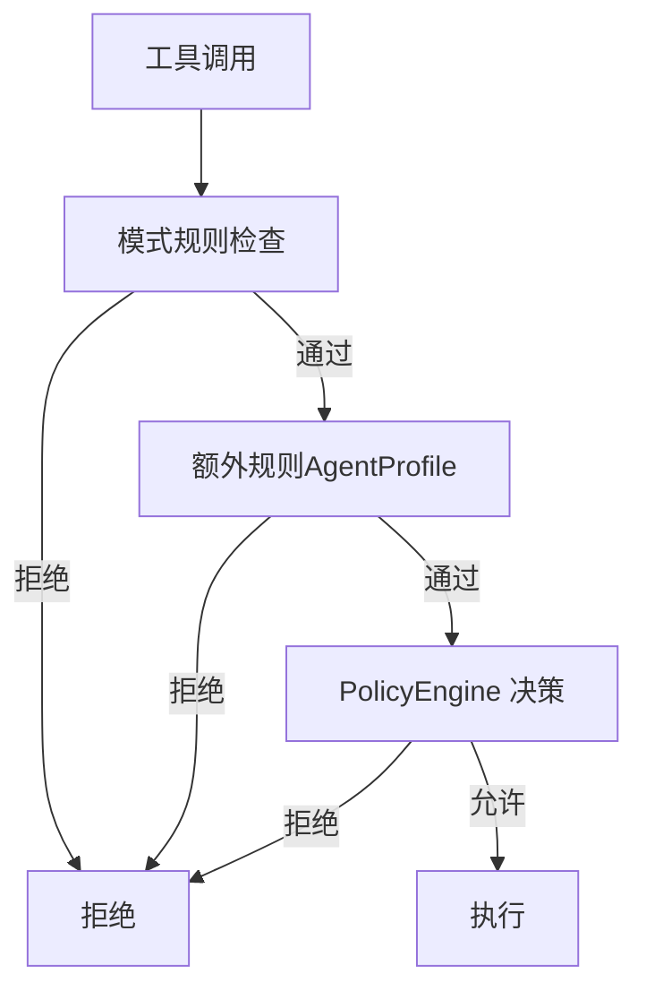
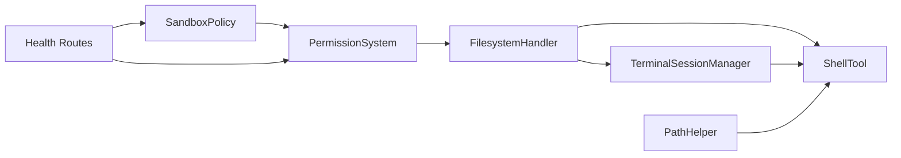

# 系统工具

<cite>
**本文引用的文件**
- [terminal.py](file://src/synapse/tools/terminal.py)
- [filesystem.py](file://src/synapse/tools/handlers/filesystem.py)
- [filesystem定义.py](file://src/synapse/tools/definitions/filesystem.py)
- [shell.py](file://src/synapse/tools/shell.py)
- [健康检查路由.py](file://src/synapse/api/routes/health.py)
- [权限系统.py](file://src/synapse/core/permission.py)
- [沙箱策略.py](file://src/synapse/core/sandbox.py)
- [配置API.py](file://src/synapse/api/routes/config.py)
- [组织心跳.py](file://src/synapse/orgs/heartbeat.py)
- [组织运行时.py](file://src/synapse/orgs/runtime.py)
- [路径助手.py](file://src/synapse/utils/path_helper.py)
</cite>

## 目录
1. [简介](#简介)
2. [项目结构](#项目结构)
3. [核心组件](#核心组件)
4. [架构总览](#架构总览)
5. [详细组件分析](#详细组件分析)
6. [依赖关系分析](#依赖关系分析)
7. [性能考量](#性能考量)
8. [故障排查指南](#故障排查指南)
9. [结论](#结论)
10. [附录](#附录)

## 简介
本技术文档面向系统工具，系统性阐述终端工具的实现原理、系统信息获取与状态监控机制，并深入解析进程管理、系统资源监控、网络状态检测、磁盘空间管理等能力。文档同时覆盖权限控制、安全限制与跨平台兼容性考虑，提供使用示例、监控配置与故障诊断方法，帮助开发者与运维人员高效、安全地使用系统工具。

## 项目结构
系统工具相关代码主要分布在以下模块：
- 终端与进程管理：tools/terminal.py、tools/shell.py
- 文件系统工具：tools/handlers/filesystem.py、tools/definitions/filesystem.py
- 健康检查与状态监控：api/routes/health.py、orgs/heartbeat.py、orgs/runtime.py
- 权限与安全：core/permission.py、core/sandbox.py、api/routes/config.py
- 跨平台支持：utils/path_helper.py

**图表来源**
- [filesystem.py:1-791](file://src/synapse/tools/handlers/filesystem.py#L1-L791)
- [terminal.py:1-351](file://src/synapse/tools/terminal.py#L1-L351)
- [shell.py:1-617](file://src/synapse/tools/shell.py#L1-L617)
- [健康检查路由.py:1-424](file://src/synapse/api/routes/health.py#L1-L424)
- [组织心跳.py:157-189](file://src/synapse/orgs/heartbeat.py#L157-L189)
- [组织运行时.py:2149-2177](file://src/synapse/orgs/runtime.py#L2149-L2177)
- [权限系统.py:1-495](file://src/synapse/core/permission.py#L1-L495)
- [沙箱策略.py:1-128](file://src/synapse/core/sandbox.py#L1-L128)
- [配置API.py:1-800](file://src/synapse/api/routes/config.py#L1-L800)
- [路径助手.py:1-44](file://src/synapse/utils/path_helper.py#L1-L44)

**章节来源**
- [filesystem.py:1-791](file://src/synapse/tools/handlers/filesystem.py#L1-L791)
- [terminal.py:1-351](file://src/synapse/tools/terminal.py#L1-L351)
- [shell.py:1-617](file://src/synapse/tools/shell.py#L1-L617)
- [健康检查路由.py:1-424](file://src/synapse/api/routes/health.py#L1-L424)
- [权限系统.py:1-495](file://src/synapse/core/permission.py#L1-L495)
- [沙箱策略.py:1-128](file://src/synapse/core/sandbox.py#L1-L128)
- [配置API.py:1-800](file://src/synapse/api/routes/config.py#L1-L800)
- [组织心跳.py:157-189](file://src/synapse/orgs/heartbeat.py#L157-L189)
- [组织运行时.py:2149-2177](file://src/synapse/orgs/runtime.py#L2149-L2177)
- [路径助手.py:1-44](file://src/synapse/utils/path_helper.py#L1-L44)

## 核心组件
- 终端会话管理器：提供持久化会话、后台进程支持、输出流式记录与跨平台编码处理。
- 文件系统处理器：封装 run_shell、write_file、read_file、edit_file、list_directory、grep、glob、delete_file 等工具。
- Shell 工具：底层命令执行、PowerShell 编码、UNC 路径安全检查、进程树安全终止。
- 健康检查与监控：HTTP 健康检查、事件循环与并发统计、组织节点健康状态与空闲检查。
- 权限与安全：工具级权限规则、模式限制、沙箱策略、安全配置热更新。
- 跨平台支持：macOS 登录 shell PATH 增强、Windows 编码与 PowerShell 处理。

**章节来源**
- [terminal.py:1-351](file://src/synapse/tools/terminal.py#L1-L351)
- [filesystem.py:1-791](file://src/synapse/tools/handlers/filesystem.py#L1-L791)
- [shell.py:1-617](file://src/synapse/tools/shell.py#L1-L617)
- [健康检查路由.py:1-424](file://src/synapse/api/routes/health.py#L1-L424)
- [权限系统.py:1-495](file://src/synapse/core/permission.py#L1-L495)
- [沙箱策略.py:1-128](file://src/synapse/core/sandbox.py#L1-L128)
- [配置API.py:1-800](file://src/synapse/api/routes/config.py#L1-L800)
- [路径助手.py:1-44](file://src/synapse/utils/path_helper.py#L1-L44)

## 架构总览
系统工具采用“处理器 + 工具 + 安全策略”的分层设计：
- 处理器层：FilesystemHandler 将工具调用映射到具体实现，负责参数校验、策略拦截与输出截断。
- 工具层：TerminalSessionManager 与 ShellTool 提供跨平台命令执行、后台任务与输出流式记录。
- 安全层：PermissionSystem 与 SandboxPolicy 提供工具级权限与命令白/黑名单策略。
- 监控层：Health API、Org Heartbeat 与 Runtime 提供系统健康与节点状态监控。

**图表来源**
- [filesystem.py:109-366](file://src/synapse/tools/handlers/filesystem.py#L109-L366)
- [terminal.py:130-285](file://src/synapse/tools/terminal.py#L130-L285)
- [shell.py:200-235](file://src/synapse/tools/shell.py#L200-L235)
- [健康检查路由.py:128-150](file://src/synapse/api/routes/health.py#L128-L150)
- [组织心跳.py:157-189](file://src/synapse/orgs/heartbeat.py#L157-L189)
- [组织运行时.py:2149-2177](file://src/synapse/orgs/runtime.py#L2149-L2177)
- [权限系统.py:248-331](file://src/synapse/core/permission.py#L248-L331)
- [沙箱策略.py:27-127](file://src/synapse/core/sandbox.py#L27-L127)

## 详细组件分析

### 终端会话管理器（TerminalSessionManager）
- 功能要点
  - 持久化会话：同一 session_id 的命令共享工作目录与环境变量。
  - 后台任务：超过 block_timeout_ms 的命令自动后台执行，输出流式写入 data/terminals/{id}.txt。
  - 跨平台编码：Windows 自动设置 UTF-8 代码页与 PowerShell 命令编码，避免中文乱码。
  - 输出追踪：头部包含 pid/cwd/running_for_ms，结束时追加 exit_code/elapsed_ms。
- 关键流程
  - execute：创建子进程、流式收集 stdout/stderr、定时更新运行时长、超时后转后台。
  - _prepare_command：Windows 平台检测 PowerShell/cmdlet 并进行 Base64 编码。
  - _update_running_time/_write_footer：维护终端文件元信息。
- 使用建议
  - 长任务设置 block_timeout_ms=0 立即后台化。
  - 使用 read_file 读取 data/terminals/{id}.txt 进行轮询监控。
  - 通过 run_shell(command="kill {pid}") 终止挂起进程。

**图表来源**
- [filesystem.py:227-366](file://src/synapse/tools/handlers/filesystem.py#L227-L366)
- [terminal.py:130-285](file://src/synapse/tools/terminal.py#L130-L285)

**章节来源**
- [terminal.py:1-351](file://src/synapse/tools/terminal.py#L1-L351)
- [filesystem.py:227-366](file://src/synapse/tools/handlers/filesystem.py#L227-L366)

### 文件系统工具（FilesystemHandler）
- 工具清单
  - run_shell：持久会话 + 后台支持，Windows 多行 python -c 修复，输出截断与溢出文件。
  - write_file/read_file/edit_file/list_directory/grep/glob/delete_file。
- 安全与策略
  - UNC 路径拦截（防止 NTLM 凭证泄漏）。
  - 自检护栏：deny_shell_patterns、write_roots/read_roots 限制。
  - 模式限制：plan/ask/coordinator 模式下的工具可用性。
- 输出与分页
  - run_shell 输出超过阈值自动截断，溢出文件通过 read_file offset/limit 分页读取。
  - grep 结果超过阈值保存溢出文件，read_file 支持偏移翻页。

**图表来源**
- [filesystem.py:227-366](file://src/synapse/tools/handlers/filesystem.py#L227-L366)
- [权限系统.py:334-380](file://src/synapse/core/permission.py#L334-L380)

**章节来源**
- [filesystem.py:1-791](file://src/synapse/tools/handlers/filesystem.py#L1-L791)
- [filesystem定义.py:1-425](file://src/synapse/tools/definitions/filesystem.py#L1-L425)
- [权限系统.py:1-495](file://src/synapse/core/permission.py#L1-L495)

### Shell 工具（ShellTool）
- 功能要点
  - PowerShell 命令编码：-EncodedCommand + UTF-8 前缀，彻底规避转义问题。
  - UNC 路径安全：检测并拦截 UNC 路径，防止 NTLM 自动认证。
  - 进程树安全终止：Windows 使用 taskkill /T /F 杀死进程树，避免孤儿进程。
  - macOS PATH 增强：通过登录 shell 获取完整 PATH，适配 Homebrew/NVM 等。
- 关键实现
  - _needs_powershell/_wrap_for_powershell：识别并编码 PowerShell 命令。
  - _kill_process_tree：跨平台进程树清理。
  - _decode_output：UTF-8 优先，Windows 回退 OEM 代码页。

**章节来源**
- [shell.py:1-617](file://src/synapse/tools/shell.py#L1-L617)
- [路径助手.py:1-44](file://src/synapse/utils/path_helper.py#L1-L44)

### 健康检查与状态监控
- 健康检查 API
  - GET /api/health：基础存活检查，返回本地 IP、进程信息与版本。
  - POST /api/health/check：并发检查 LLM 提供商健康状态，dry_run 模式避免影响冷却计数。
  - GET /api/health/loop：事件循环延迟与 LLM 并发统计。
  - GET /api/diagnostics：自检报告，包含运行时、pip 可用性与核心模块完整性。
- 组织健康与空闲检查
  - 组织心跳：扫描节点状态、待处理消息与忙碌节点，生成健康检查引导。
  - 空闲检查：基于阈值与忙碌状态判断节点空闲，触发相应动作。

**图表来源**
- [健康检查路由.py:356-387](file://src/synapse/api/routes/health.py#L356-L387)
- [组织心跳.py:157-189](file://src/synapse/orgs/heartbeat.py#L157-L189)
- [组织运行时.py:2149-2177](file://src/synapse/orgs/runtime.py#L2149-L2177)

**章节来源**
- [健康检查路由.py:1-424](file://src/synapse/api/routes/health.py#L1-L424)
- [组织心跳.py:157-189](file://src/synapse/orgs/heartbeat.py#L157-L189)
- [组织运行时.py:2149-2177](file://src/synapse/orgs/runtime.py#L2149-L2177)

### 权限控制与安全限制
- 权限系统
  - 规则格式：(permission, pattern, action) 三元组，evaluate 采用“最后匹配优先”。
  - 模式限制：plan/ask/coordinator 模式对工具可用性进行限制。
  - 工具分类：edit/read 工具映射到对应权限类别，高风险工具前缀统一拦截。
- 沙箱策略
  - 目录限制：受限目录白名单/黑名单，禁止危险命令与模式匹配。
  - 命令白/黑名单：允许/禁止命令列表与正则模式。
  - 网络限制：可配置沙箱内网络访问策略。
- 配置热更新
  - /api/config/security/sandbox：动态更新沙箱配置并重置策略引擎。

**图表来源**
- [权限系统.py:248-331](file://src/synapse/core/permission.py#L248-L331)
- [沙箱策略.py:27-127](file://src/synapse/core/sandbox.py#L27-L127)
- [配置API.py:997-1024](file://src/synapse/api/routes/config.py#L997-L1024)

**章节来源**
- [权限系统.py:1-495](file://src/synapse/core/permission.py#L1-L495)
- [沙箱策略.py:1-128](file://src/synapse/core/sandbox.py#L1-L128)
- [配置API.py:997-1024](file://src/synapse/api/routes/config.py#L997-L1024)

## 依赖关系分析
- 组件耦合
  - FilesystemHandler 依赖 TerminalSessionManager 与 ShellTool，形成“处理器-会话-执行”的链路。
  - TerminalSession 依赖 ShellTool 的命令准备与编码逻辑，实现跨平台兼容。
  - 权限系统与沙箱策略贯穿工具调用链，作为前置安全检查。
- 外部依赖
  - Windows：PowerShell 编码、taskkill 进程树终止、OEM 代码页解码。
  - macOS：登录 shell PATH 增强，避免 PATH 不完整导致工具不可用。
  - API 层：FastAPI 路由提供健康检查与配置更新接口。

**图表来源**
- [filesystem.py:109-366](file://src/synapse/tools/handlers/filesystem.py#L109-L366)
- [terminal.py:130-303](file://src/synapse/tools/terminal.py#L130-L303)
- [shell.py:412-433](file://src/synapse/tools/shell.py#L412-L433)
- [权限系统.py:248-331](file://src/synapse/core/permission.py#L248-L331)
- [沙箱策略.py:27-127](file://src/synapse/core/sandbox.py#L27-L127)
- [健康检查路由.py:128-150](file://src/synapse/api/routes/health.py#L128-L150)
- [路径助手.py:22-44](file://src/synapse/utils/path_helper.py#L22-L44)

**章节来源**
- [filesystem.py:1-791](file://src/synapse/tools/handlers/filesystem.py#L1-L791)
- [terminal.py:1-351](file://src/synapse/tools/terminal.py#L1-L351)
- [shell.py:1-617](file://src/synapse/tools/shell.py#L1-L617)
- [权限系统.py:1-495](file://src/synapse/core/permission.py#L1-L495)
- [沙箱策略.py:1-128](file://src/synapse/core/sandbox.py#L1-L128)
- [健康检查路由.py:1-424](file://src/synapse/api/routes/health.py#L1-L424)
- [路径助手.py:1-44](file://src/synapse/utils/path_helper.py#L1-L44)

## 性能考量
- I/O 与流式处理
  - 终端输出采用流式写入，避免 communicate() 导致的超时数据丢失。
  - 后台任务每 5 秒更新一次 running_for_ms，降低频繁文件写入开销。
- 超时与并发
  - run_shell 支持 block_timeout_ms 控制阻塞等待，长任务应设为 0 立即后台化。
  - 健康检查 API 并发检查提供商，使用 per-endpoint 超时避免阻塞。
- 跨平台优化
  - Windows UTF-8 代码页设置与 PowerShell 编码减少乱码与转义成本。
  - macOS 登录 shell PATH 增强避免重复查找工具导致的延迟。

[本节为通用指导，不直接分析具体文件]

## 故障排查指南
- 终端后台任务未输出
  - 检查 data/terminals/{id}.txt 头部 pid 与 running_for_ms 是否更新。
  - 使用 read_file 读取文件内容，确认是否出现 exit_code/elapsed_ms 尾部。
  - 如需终止：run_shell(command="kill {pid}")。
- Windows 命令乱码或中文路径异常
  - 确认已自动设置 chcp 65001 与 UTF-8 编码。
  - PowerShell 命令使用 -EncodedCommand 方案，避免引号与特殊字符问题。
- UNC 路径被拦截
  - 使用本地路径或映射盘符代替 UNC 路径，避免 NTLM 凭证泄漏。
- 权限被拒绝
  - 检查模式限制（plan/ask/coordinator）与工具权限规则。
  - 更新沙箱配置或调整策略引擎，必要时重置策略引擎。
- 健康检查异常
  - 使用 GET /api/health 查看基础状态与本地 IP。
  - 使用 POST /api/health/check 执行只读检测，查看提供商健康状态与错误信息。
  - 使用 GET /api/health/loop 查看事件循环延迟与 LLM 并发统计。

**章节来源**
- [terminal.py:67-105](file://src/synapse/tools/terminal.py#L67-L105)
- [filesystem.py:339-366](file://src/synapse/tools/handlers/filesystem.py#L339-L366)
- [shell.py:390-400](file://src/synapse/tools/shell.py#L390-L400)
- [权限系统.py:334-380](file://src/synapse/core/permission.py#L334-L380)
- [健康检查路由.py:128-150](file://src/synapse/api/routes/health.py#L128-L150)
- [健康检查路由.py:356-387](file://src/synapse/api/routes/health.py#L356-L387)
- [健康检查路由.py:390-423](file://src/synapse/api/routes/health.py#L390-L423)

## 结论
系统工具通过“持久会话 + 后台任务 + 流式输出”的终端管理机制，结合跨平台编码与安全策略，提供了稳定、可观测、可扩展的系统级能力。文件系统工具在保证安全的前提下，提供丰富的文件操作与内容检索能力；健康检查与组织监控保障系统运行状态的可视化与自动化处置。权限系统与沙箱策略共同构成多层次的安全防线，配合配置热更新实现灵活的策略演进。

[本节为总结性内容，不直接分析具体文件]

## 附录
- 使用示例（路径引用）
  - 执行持久会话命令：[run_shell 调用:227-366](file://src/synapse/tools/handlers/filesystem.py#L227-L366)
  - 读取后台任务输出：[终端文件读取:63-65](file://src/synapse/tools/terminal.py#L63-L65)
  - PowerShell 命令编码：[编码实现:298-313](file://src/synapse/tools/shell.py#L298-L313)
  - UNC 路径拦截：[UNC 检查:82-100](file://src/synapse/tools/shell.py#L82-L100)
  - 权限规则评估：[权限评估:103-123](file://src/synapse/core/permission.py#L103-L123)
  - 沙箱策略判定：[沙箱决策:86-127](file://src/synapse/core/sandbox.py#L86-L127)
  - 健康检查接口：[健康检查:128-150](file://src/synapse/api/routes/health.py#L128-L150)
  - 组织心跳触发：[心跳逻辑:157-189](file://src/synapse/orgs/heartbeat.py#L157-L189)
  - macOS PATH 增强：[路径解析:22-44](file://src/synapse/utils/path_helper.py#L22-L44)

[本节为索引性内容，不直接分析具体文件]