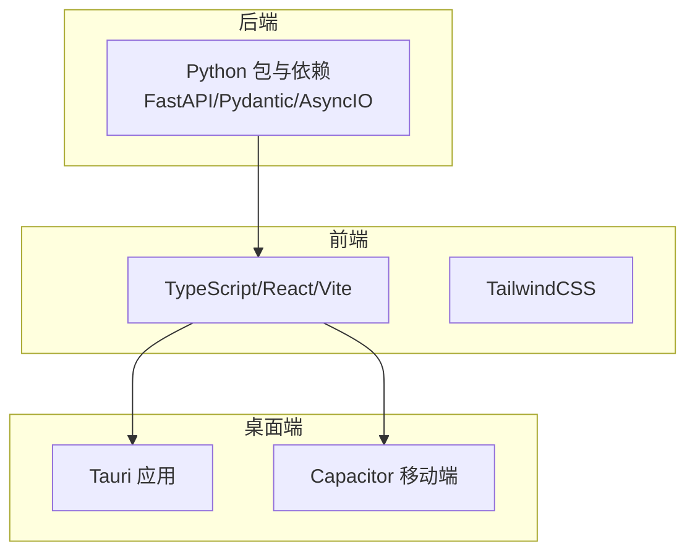
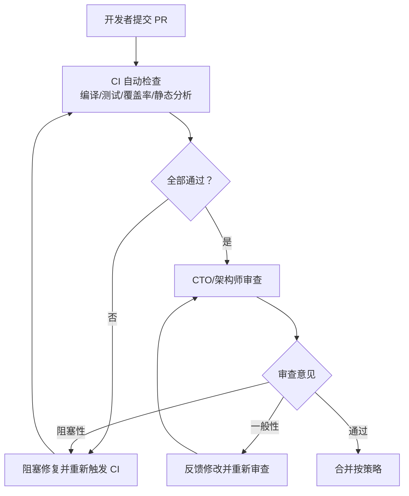
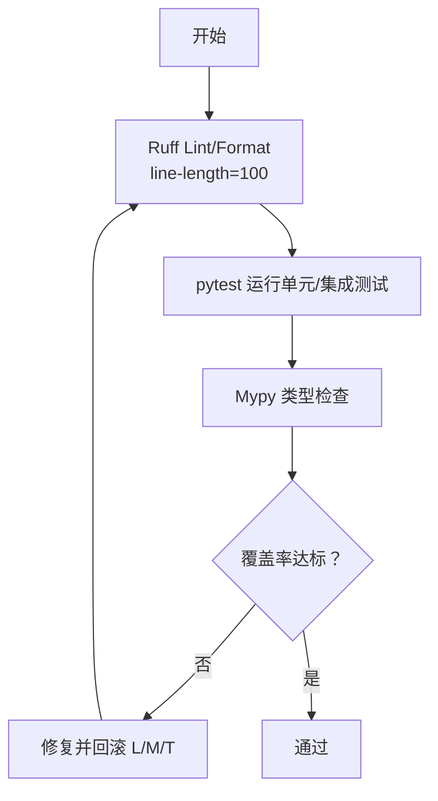
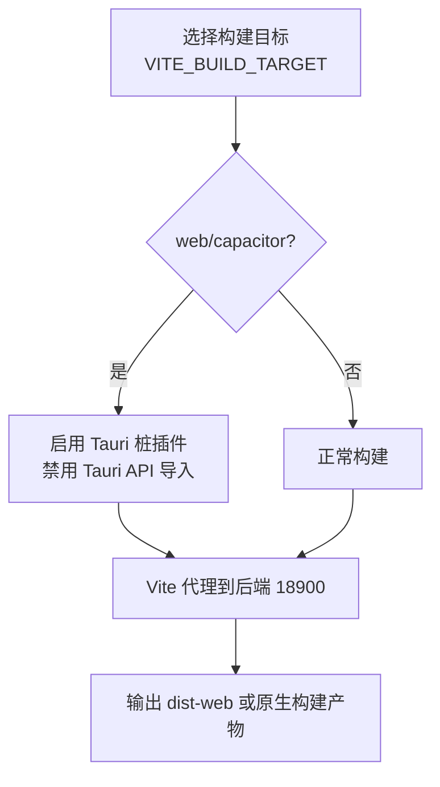
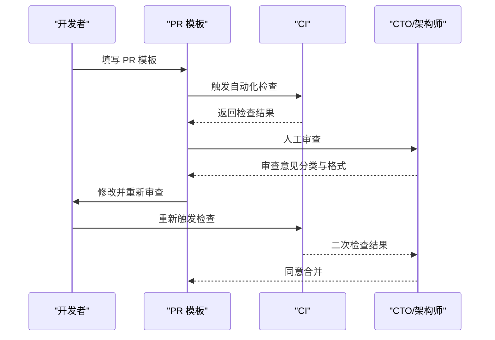
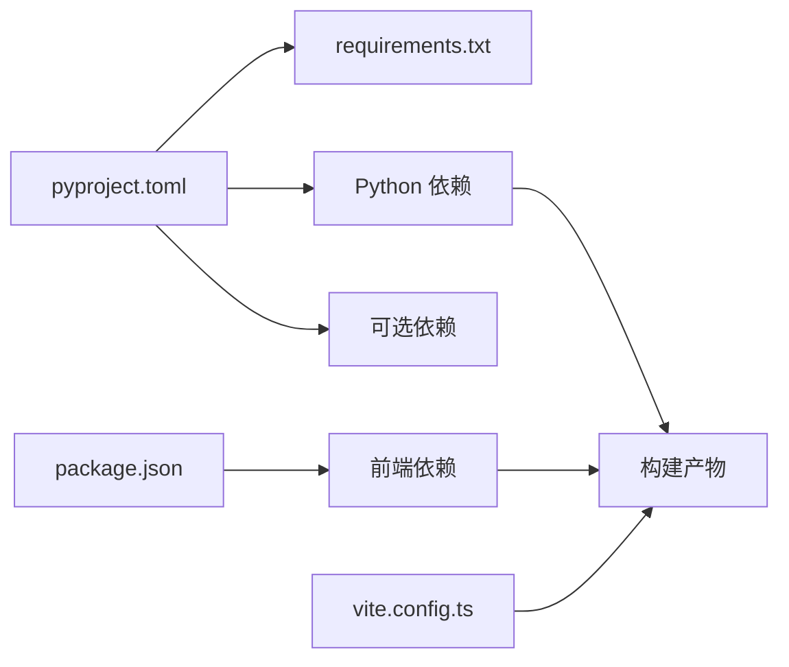

# 代码规范

<cite>
**本文引用的文件**
- [README.md](file://README.md)
- [CODE_OF_CONDUCT.md](file://CODE_OF_CONDUCT.md)
- [.github/PULL_REQUEST_TEMPLATE.md](file://.github/PULL_REQUEST_TEMPLATE.md)
- [pyproject.toml](file://pyproject.toml)
- [requirements.txt](file://requirements.txt)
- [apps/setup-center/package.json](file://apps/setup-center/package.json)
- [apps/setup-center/tsconfig.json](file://apps/setup-center/tsconfig.json)
- [apps/setup-center/vite.config.ts](file://apps/setup-center/vite.config.ts)
- [docs/code-review-process.md](file://docs/code-review-process.md)
- [docs/testing-framework-setup.md](file://docs/testing-framework-setup.md)
- [.github/release-channels.json](file://.github/release-channels.json)
</cite>

## 目录
1. [简介](#简介)
2. [项目结构](#项目结构)
3. [核心组件](#核心组件)
4. [架构总览](#架构总览)
5. [详细组件分析](#详细组件分析)
6. [依赖分析](#依赖分析)
7. [性能考虑](#性能考虑)
8. [故障排查指南](#故障排查指南)
9. [结论](#结论)
10. [附录](#附录)

## 简介
本文件旨在制定全面的代码规范标准文档，覆盖以下方面：
- Python 代码风格与类型检查（PEP8、Ruff、Mypy）
- TypeScript/JavaScript 编码规范与前端工程配置
- 命名约定与注释标准
- 代码格式化工具配置与静态分析工具使用
- 代码审查检查清单与流程
- Git 提交消息规范、分支管理策略与 Pull Request 模板
- 代码质量度量标准与持续集成要求

本规范以仓库现有配置与文档为基础，结合实际工程实践，形成统一、可落地的开发与协作标准。

## 项目结构
本项目采用多语言混合架构：
- 后端服务与核心逻辑：Python（FastAPI、Pydantic、AsyncIO）
- 前端桌面应用与 Web 访问：React + TypeScript（Vite + TailwindCSS）
- 桌面端：Tauri（跨平台原生外壳）
- 移动端：Capacitor（Android/iOS）

**章节来源**
- [README.md: 247-279:247-279](file://README.md#L247-L279)
- [apps/setup-center/package.json: 1-86:1-86](file://apps/setup-center/package.json#L1-L86)

## 核心组件
- Python 工程与依赖管理：通过 pyproject.toml 管理核心与可选依赖；requirements.txt 作为 pip 安装的权威来源
- 前端工程：Vite + React + TypeScript；tsconfig.json 控制严格类型；vite.config.ts 提供构建与代理配置
- 代码质量工具：Ruff（lint/format）、Mypy（类型检查）、pytest（测试框架）
- 代码审查与测试：PR 模板、代码审查流程、测试覆盖率目标与 CI 集成

**章节来源**
- [pyproject.toml: 1-282:1-282](file://pyproject.toml#L1-L282)
- [requirements.txt: 1-105:1-105](file://requirements.txt#L1-L105)
- [apps/setup-center/tsconfig.json: 1-24:1-24](file://apps/setup-center/tsconfig.json#L1-L24)
- [apps/setup-center/vite.config.ts: 1-89:1-89](file://apps/setup-center/vite.config.ts#L1-L89)

## 架构总览
下图展示从开发者提交 PR 到 CI 检查、人工审查、合并的整体流程，以及与质量度量的关系。

**图表来源**
- [.github/PULL_REQUEST_TEMPLATE.md: 1-60:1-60](file://.github/PULL_REQUEST_TEMPLATE.md#L1-L60)
- [docs/code-review-process.md: 19-68:19-68](file://docs/code-review-process.md#L19-L68)

**章节来源**
- [.github/PULL_REQUEST_TEMPLATE.md: 1-60:1-60](file://.github/PULL_REQUEST_TEMPLATE.md#L1-L60)
- [docs/code-review-process.md: 1-149:1-149](file://docs/code-review-process.md#L1-L149)

## 详细组件分析

### Python 代码规范与质量工具
- 风格与格式
  - 使用 Ruff 进行 lint 与格式化，最大行长 100；忽略若干风格噪音规则但保留关键规则集
  - 代码风格遵循 PEP8 基本原则，Ruff 作为统一入口
- 类型检查
  - 使用 Mypy，启用严格模式但允许忽略缺失导入与部分错误，便于渐进式提升
- 依赖与版本
  - Python 版本要求 3.11+；核心依赖集中在 pyproject.toml，requirements.txt 与之保持一致
- 测试与覆盖率
  - pytest 配置位于 pyproject.toml，测试路径 tests；CI 中应确保测试通过与覆盖率达标

**图表来源**
- [pyproject.toml: 234-282:234-282](file://pyproject.toml#L234-L282)

**章节来源**
- [pyproject.toml: 234-282:234-282](file://pyproject.toml#L234-L282)
- [requirements.txt: 1-105:1-105](file://requirements.txt#L1-L105)

### TypeScript/JavaScript 编码规范与前端工程
- 语言与类型
  - TypeScript 严格模式；JSX 使用 react-jsx；模块解析采用 Bundler
- 构建与开发
  - Vite 提供开发服务器与构建；根据环境变量切换构建目标（web/capacitor/tauri）
  - 通过别名 @ 指向 src；远程构建时对 Tauri 插件进行桩替换
- 依赖与脚本
  - package.json 定义开发与运行脚本；生产依赖涵盖 UI、编辑器、图形与状态管理等

**图表来源**
- [apps/setup-center/vite.config.ts: 6-89:6-89](file://apps/setup-center/vite.config.ts#L6-L89)
- [apps/setup-center/tsconfig.json: 1-24:1-24](file://apps/setup-center/tsconfig.json#L1-L24)
- [apps/setup-center/package.json: 1-86:1-86](file://apps/setup-center/package.json#L1-L86)

**章节来源**
- [apps/setup-center/tsconfig.json: 1-24:1-24](file://apps/setup-center/tsconfig.json#L1-L24)
- [apps/setup-center/vite.config.ts: 1-89:1-89](file://apps/setup-center/vite.config.ts#L1-L89)
- [apps/setup-center/package.json: 1-86:1-86](file://apps/setup-center/package.json#L1-L86)

### 命名约定与注释标准
- Python
  - 遵循 PEP8 基本命名；Ruff 规则集包含命名相关规则（如 N），避免不必要的大小写与命名冲突
  - 对外公共 API 与复杂逻辑建议补充注释，保持简洁清晰
- TypeScript/JavaScript
  - 使用语义化命名；组件与工具函数命名清晰；导出与类型定义保持一致
  - 注释用于解释复杂逻辑与边界条件，避免显而易见的注释

**章节来源**
- [pyproject.toml: 238-254:238-254](file://pyproject.toml#L238-L254)
- [apps/setup-center/tsconfig.json: 13](file://apps/setup-center/tsconfig.json#L13)

### 代码格式化与静态分析工具配置
- Python
  - Ruff：lint 与 format；忽略若干风格噪音规则，保留关键规则
  - Mypy：严格模式，忽略缺失导入与部分错误，便于逐步完善
- TypeScript/JavaScript
  - Vite + React 工程；tsconfig 严格模式；无额外格式化工具配置，建议配合 ESLint/Prettier 在本地统一格式

**章节来源**
- [pyproject.toml: 234-277:234-277](file://pyproject.toml#L234-L277)
- [apps/setup-center/tsconfig.json: 13](file://apps/setup-center/tsconfig.json#L13)

### 代码审查检查清单与流程
- 审查流程
  - 开发者提交 PR → CI 自动检查 → CTO/架构师审查 → 反馈修改 → 重新审查 → 合并
- 自动化检查清单（CI）
  - 编译成功、测试通过、覆盖率达标、静态分析无严重问题、依赖安全扫描通过
- 人工审查清单
  - 代码质量、架构规范、测试覆盖、性能与安全、文档与注释
- 审查意见分类与格式
  - BLOCKER/MAJOR/MINOR/QUESTION；给出原因与参考链接
- 合并策略
  - 分支保护、审查人数、合并方式（feature→develop 使用 squash，develop→main 使用 merge commit）

**图表来源**
- [.github/PULL_REQUEST_TEMPLATE.md: 1-60:1-60](file://.github/PULL_REQUEST_TEMPLATE.md#L1-L60)
- [docs/code-review-process.md: 3-68:3-68](file://docs/code-review-process.md#L3-L68)

**章节来源**
- [.github/PULL_REQUEST_TEMPLATE.md: 1-60:1-60](file://.github/PULL_REQUEST_TEMPLATE.md#L1-L60)
- [docs/code-review-process.md: 1-149:1-149](file://docs/code-review-process.md#L1-L149)

### Git 提交消息规范、分支管理策略与 Pull Request 模板
- 提交消息规范
  - 建议采用“类型: 主题”格式，简明描述变更类别与内容；与 PR 模板协同使用
- 分支管理策略
  - feature → develop（squash 合并）；develop → main（保留历史的 merge commit）
  - 分支保护：main/develop 保护，禁止直接推送
- PR 模板
  - 包含变更描述、类型、相关问题、测试检查清单、测试配置、检查清单、截图/附加说明等

**章节来源**
- [docs/code-review-process.md: 113-121:113-121](file://docs/code-review-process.md#L113-L121)
- [.github/PULL_REQUEST_TEMPLATE.md: 1-60:1-60](file://.github/PULL_REQUEST_TEMPLATE.md#L1-L60)

### 代码质量度量标准与持续集成要求
- 覆盖率目标
  - 整体 ≥70%，核心模块 ≥85%
- CI 集成
  - 自动运行测试与覆盖率生成；覆盖率低于阈值时构建失败
- 发布通道
  - release 与 pre-release 版本通道由 release-channels.json 管理

**章节来源**
- [docs/testing-framework-setup.md: 95-101:95-101](file://docs/testing-framework-setup.md#L95-L101)
- [docs/testing-framework-setup.md: 142-149:142-149](file://docs/testing-framework-setup.md#L142-L149)
- [.github/release-channels.json: 1-5:1-5](file://.github/release-channels.json#L1-L5)

## 依赖分析
- Python 依赖
  - 核心：FastAPI、httpx、pydantic、gitpython、playwright、Pillow 等
  - 可选：各 IM 通道与桌面自动化依赖，按需安装
- 前端依赖
  - React、Ant Design、Monaco Editor、Three.js、Excalidraw 等
- 构建与工具
  - Vite、TailwindCSS、TypeScript、Tauri/Capacitor

**图表来源**
- [pyproject.toml: 21-141:21-141](file://pyproject.toml#L21-L141)
- [requirements.txt: 9-105:9-105](file://requirements.txt#L9-L105)
- [apps/setup-center/package.json: 20-84:20-84](file://apps/setup-center/package.json#L20-L84)

**章节来源**
- [pyproject.toml: 21-141:21-141](file://pyproject.toml#L21-L141)
- [requirements.txt: 9-105:9-105](file://requirements.txt#L9-L105)
- [apps/setup-center/package.json: 20-84:20-84](file://apps/setup-center/package.json#L20-L84)

## 性能考虑
- Python
  - 使用异步 I/O（httpx/aiofiles/nest-asyncio）减少阻塞；数据库使用 aiopg/aiosqlite
  - 严格控制资源预算（令牌、成本、时长、迭代次数、工具调用次数）
- 前端
  - 优化依赖预打包（optimizeDeps.include）；远程构建时启用 Tauri 桩插件避免原生 API 导入
  - 合理使用图形库（Three.js、ForceGraph）时注意渲染开销

**章节来源**
- [pyproject.toml: 37-41:37-41](file://pyproject.toml#L37-L41)
- [apps/setup-center/vite.config.ts: 55-63:55-63](file://apps/setup-center/vite.config.ts#L55-L63)

## 故障排查指南
- 本地开发
  - 确认 Python 版本满足要求（3.11+）；安装完整依赖（pip install -e ".[all]"）
  - 前端依赖安装后运行开发脚本；若远程构建，确保代理指向后端 18900
- CI 失败
  - 检查测试是否通过、覆盖率是否达标、静态分析是否报错
  - 若为依赖安全问题，更新依赖并重新提交
- 代码审查被拒
  - 按审查意见分类逐项修复；必要时在评论区提供说明与参考链接

**章节来源**
- [requirements.txt: 3-7:3-7](file://requirements.txt#L3-L7)
- [apps/setup-center/vite.config.ts: 68-84:68-84](file://apps/setup-center/vite.config.ts#L68-L84)
- [docs/code-review-process.md: 122-131:122-131](file://docs/code-review-process.md#L122-L131)

## 结论
本规范以仓库现有配置与流程为基础，明确了 Python 与前端工程的质量标准、审查流程与度量指标。建议团队在日常开发中：
- 严格遵循 Ruff/Mypy 与 TypeScript 严格模式
- 按 PR 模板与审查清单提交高质量变更
- 保持测试覆盖率与静态分析通过率
- 采用统一的分支与合并策略，保障发布质量

## 附录
- 社区行为准则：遵守贡献者公约，营造包容健康的社区氛围
- 发布通道：通过 release-channels.json 管理稳定与预发布版本

**章节来源**
- [CODE_OF_CONDUCT.md: 1-75:1-75](file://CODE_OF_CONDUCT.md#L1-L75)
- [.github/release-channels.json: 1-5:1-5](file://.github/release-channels.json#L1-L5)