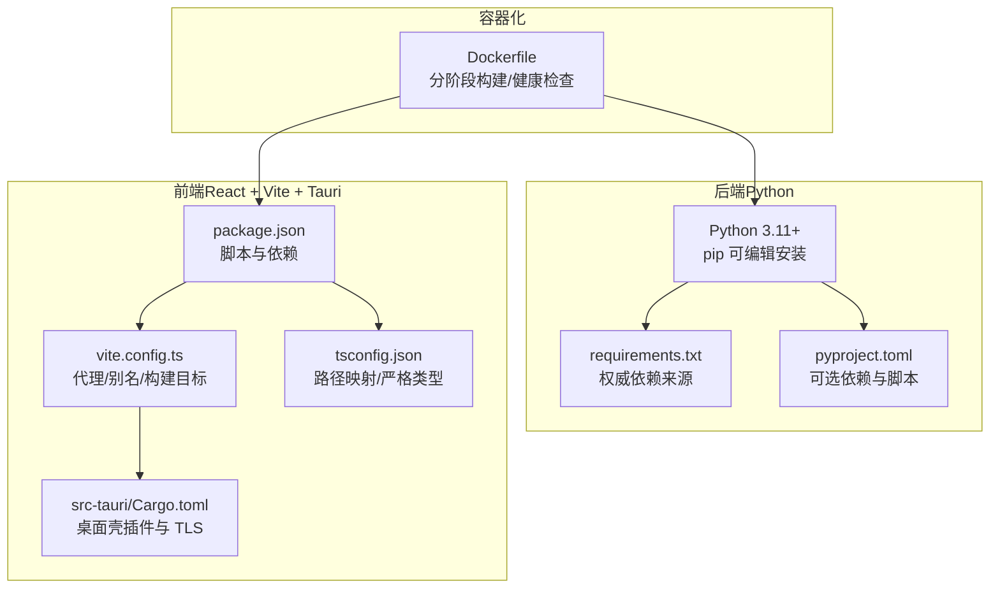
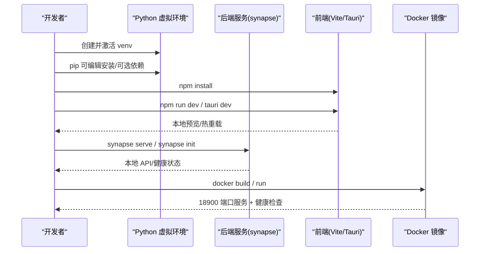
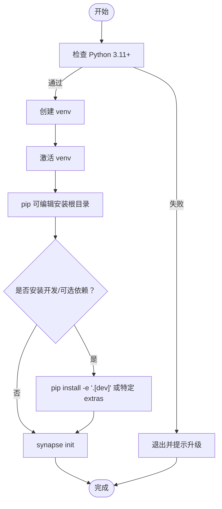
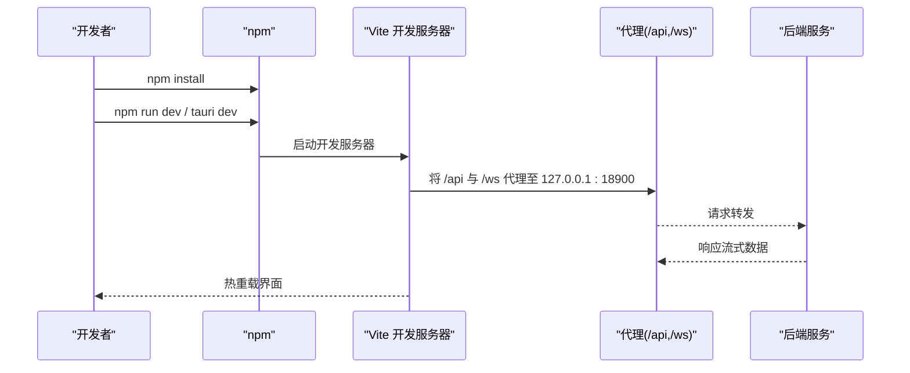
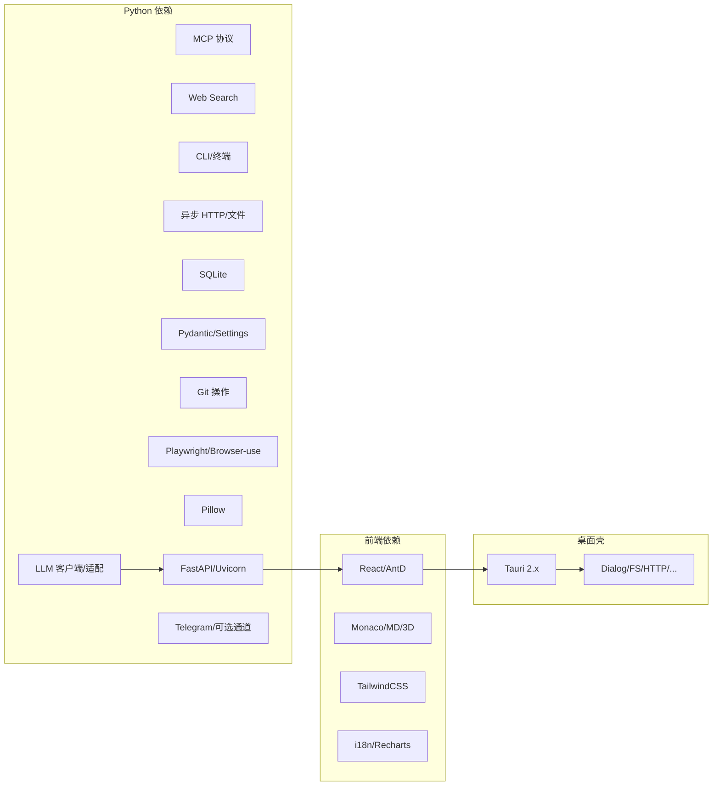

# 开发环境搭建

<cite>
**本文引用的文件**
- [开发环境部署手册](file://docs/development/dev-environment-setup.md)
- [Synapse 项目总览](file://README.md)
- [Python 依赖清单](file://requirements.txt)
- [后端项目配置](file://pyproject.toml)
- [前端包管理](file://apps/setup-center/package.json)
- [桌面壳 Cargo 配置](file://apps/setup-center/src-tauri/Cargo.toml)
- [前端 Vite 配置](file://apps/setup-center/vite.config.ts)
- [前端 TS 配置](file://apps/setup-center/tsconfig.json)
- [Docker 构建文件](file://Dockerfile)
- [一键安装脚本（Linux/macOS）](file://scripts/quickstart.sh)
- [一键安装脚本（Windows PowerShell）](file://scripts/quickstart.ps1)
</cite>

## 目录
1. [简介](#简介)
2. [项目结构](#项目结构)
3. [核心组件](#核心组件)
4. [架构总览](#架构总览)
5. [详细组件分析](#详细组件分析)
6. [依赖关系分析](#依赖关系分析)
7. [性能考虑](#性能考虑)
8. [故障排查指南](#故障排查指南)
9. [结论](#结论)
10. [附录](#附录)

## 简介
本指南面向开发者，提供从零搭建 Synapse 研发环境的完整流程，覆盖后端 Python 3.11+、前端 Node.js/npm、Rust 工具链、虚拟环境、依赖安装、IDE 建议、Docker 容器化、数据库初始化与本地服务启动，并给出常见问题与验证方法。

## 项目结构
- 后端服务与 CLI 基于 Python，通过可编辑安装与可选依赖支持多 IM 通道与桌面自动化能力。
- 前端采用 React + TypeScript + Vite，桌面壳为 Tauri 2.x，支持 Web、桌面与移动端（Capacitor）三种构建目标。
- Dockerfile 提供分阶段构建：前端 Web 资源、Python 包、最终运行时镜像，内置健康检查与默认监听端口。

图表来源
- [后端项目配置:1-282](file://pyproject.toml#L1-L282)
- [Python 依赖清单:1-105](file://requirements.txt#L1-L105)
- [前端包管理:1-86](file://apps/setup-center/package.json#L1-L86)
- [前端 Vite 配置:1-89](file://apps/setup-center/vite.config.ts#L1-L89)
- [前端 TS 配置:1-24](file://apps/setup-center/tsconfig.json#L1-L24)
- [桌面壳 Cargo 配置:1-49](file://apps/setup-center/src-tauri/Cargo.toml#L1-L49)
- [Docker 构建文件:1-54](file://Dockerfile#L1-L54)

章节来源
- [开发环境部署手册:1-148](file://docs/development/dev-environment-setup.md#L1-L148)
- [Synapse 项目总览:1-719](file://README.md#L1-L719)

## 核心组件
- Python 3.11+ 与虚拟环境：使用标准 venv 创建隔离环境，激活后进行可编辑安装与可选依赖安装。
- Node.js 与 npm：前端依赖安装、Vite 开发服务器、Tauri 桌面开发模式。
- Rust 工具链：Tauri 桌面壳构建所需，首次开发构建可能耗时较长。
- 可选依赖：IM 通道（飞书、钉钉、企业微信、OneBot、QQ）、桌面自动化（Windows）等，按需启用。
- Docker：分阶段构建前端 Web 资源与 Python 包，最终运行时镜像暴露 18900 端口并内置健康检查。

章节来源
- [开发环境部署手册:14-148](file://docs/development/dev-environment-setup.md#L14-L148)
- [后端项目配置:1-282](file://pyproject.toml#L1-L282)
- [Python 依赖清单:1-105](file://requirements.txt#L1-L105)
- [前端包管理:1-86](file://apps/setup-center/package.json#L1-L86)
- [Docker 构建文件:1-54](file://Dockerfile#L1-L54)

## 架构总览
下图展示从本地开发到容器运行的整体流程，以及前后端与桌面壳之间的关系。

图表来源
- [开发环境部署手册:14-148](file://docs/development/dev-environment-setup.md#L14-L148)
- [Docker 构建文件:1-54](file://Dockerfile#L1-L54)

## 详细组件分析

### Python 环境与依赖
- Python 版本要求：3.11+，项目元数据与依赖清单均明确要求。
- 虚拟环境：使用标准 venv 创建隔离环境，激活后进行可编辑安装与可选依赖安装。
- 可选依赖：IM 通道（飞书、钉钉、企业微信、OneBot、QQ）、桌面自动化（Windows）等，按需启用。
- 一键安装脚本：提供 Linux/macOS 与 Windows 的一键安装脚本，自动创建 venv、安装包、可选 Playwright 浏览器与初始化向导。

图表来源
- [开发环境部署手册:18-60](file://docs/development/dev-environment-setup.md#L18-L60)
- [后端项目配置:75-151](file://pyproject.toml#L75-L151)
- [Python 依赖清单:1-105](file://requirements.txt#L1-L105)
- [一键安装脚本（Linux/macOS）:90-155](file://scripts/quickstart.sh#L90-L155)
- [一键安装脚本（Windows PowerShell）:39-110](file://scripts/quickstart.ps1#L39-L110)

章节来源
- [开发环境部署手册:14-67](file://docs/development/dev-environment-setup.md#L14-L67)
- [后端项目配置:1-282](file://pyproject.toml#L1-L282)
- [Python 依赖清单:1-105](file://requirements.txt#L1-L105)
- [一键安装脚本（Linux/macOS）:1-222](file://scripts/quickstart.sh#L1-L222)
- [一键安装脚本（Windows PowerShell）:1-150](file://scripts/quickstart.ps1#L1-L150)

### 前端开发（Setup Center）
- 目录与入口：前端位于 apps/setup-center，使用 React + TypeScript + Vite。
- 依赖安装：执行 npm install 安装所有依赖。
- 开发模式：
  - Web 调试：npm run dev，默认端口 5173，支持代理到后端 18900 端口。
  - Tauri 桌面开发：npm run tauri dev，热重载，便于联调后端 API。
- 构建目标：支持 web、tauri、capacitor 三种目标，分别输出 dist-web、桌面壳或移动端资源。
- IDE 建议：TypeScript 严格模式、路径别名、TailwindCSS、React 插件。

图表来源
- [开发环境部署手册:72-126](file://docs/development/dev-environment-setup.md#L72-L126)
- [前端包管理:1-86](file://apps/setup-center/package.json#L1-L86)
- [前端 Vite 配置:64-85](file://apps/setup-center/vite.config.ts#L64-L85)

章节来源
- [开发环境部署手册:72-126](file://docs/development/dev-environment-setup.md#L72-L126)
- [前端包管理:1-86](file://apps/setup-center/package.json#L1-L86)
- [前端 Vite 配置:1-89](file://apps/setup-center/vite.config.ts#L1-L89)
- [前端 TS 配置:1-24](file://apps/setup-center/tsconfig.json#L1-L24)

### Rust 工具链与 Tauri 桌面壳
- Rust 工具链：首次运行 Tauri 桌面开发模式会触发 Rust 编译，耗时较长属正常。
- 桌面壳插件：桌面壳 Cargo 配置包含对话框、剪贴板、文件系统、HTTP、进程、全局快捷键、通知等插件，以及 TLS 与自动启动等平台特性。
- 构建目标：Tauri 默认构建目标为桌面壳；Web 与 Capacitor 目标通过 Vite 环境变量切换。

章节来源
- [开发环境部署手册:100-108](file://docs/development/dev-environment-setup.md#L100-L108)
- [桌面壳 Cargo 配置:1-49](file://apps/setup-center/src-tauri/Cargo.toml#L1-L49)
- [前端 Vite 配置:6-9](file://apps/setup-center/vite.config.ts#L6-L9)

### Docker 容器化
- 分阶段构建：
  - 阶段 1：Node 20 构建前端 Web 资源。
  - 阶段 2：Python 3.11 构建 Python 包，复制前端产物与内置资源。
  - 阶段 3：运行时镜像，安装必要系统依赖，暴露 18900 端口，内置健康检查。
- 运行命令：ENTRYPOINT 为 synapse，CMD 默认监听 0.0.0.0:18900。

章节来源
- [Docker 构建文件:1-54](file://Dockerfile#L1-L54)

### 数据库与初始化
- 数据库：后端使用异步 SQLite（aiosqlite），作为默认存储之一。
- 初始化：首次运行 synapse init 完成数据目录、配置等初始化步骤。

章节来源
- [开发环境部署手册:54-60](file://docs/development/dev-environment-setup.md#L54-L60)
- [后端项目配置:43-43](file://pyproject.toml#L43-L43)

### 本地服务启动步骤
- 后端：在项目根目录执行 synapse serve（或 --dev 开启热重载）。
- 前端：在 apps/setup-center 目录执行 npm run tauri dev（推荐）或 npm run dev。
- 健康检查：Docker 镜像内置健康检查，可通过 curl 访问 /health。

章节来源
- [开发环境部署手册:62-68](file://docs/development/dev-environment-setup.md#L62-L68)
- [Docker 构建文件:49-54](file://Dockerfile#L49-L54)

## 依赖关系分析
- Python 依赖：核心 LLM、MCP、搜索、CLI、异步 HTTP、数据库、数据校验、Git、浏览器自动化、图像处理、FastAPI/Uvicorn、Telegram 等。
- 可选依赖：IM 通道（飞书、钉钉、企业微信、OneBot、QQ）、Windows 桌面自动化等，按需启用。
- 前端依赖：React、Ant Design、Monaco Editor、Three.js、Excalidraw、TailwindCSS 等。
- 桌面壳依赖：Tauri 插件（对话框、剪贴板、文件系统、HTTP、进程、全局快捷键、通知、自动启动、单实例、更新器、Shell、注册表等）。

图表来源
- [后端项目配置:21-73](file://pyproject.toml#L21-L73)
- [Python 依赖清单:10-61](file://requirements.txt#L10-L61)
- [前端包管理:20-74](file://apps/setup-center/package.json#L20-L74)
- [桌面壳 Cargo 配置:13-42](file://apps/setup-center/src-tauri/Cargo.toml#L13-L42)

章节来源
- [后端项目配置:1-282](file://pyproject.toml#L1-L282)
- [Python 依赖清单:1-105](file://requirements.txt#L1-L105)
- [前端包管理:1-86](file://apps/setup-center/package.json#L1-L86)
- [桌面壳 Cargo 配置:1-49](file://apps/setup-center/src-tauri/Cargo.toml#L1-L49)

## 性能考虑
- 首次 Tauri 构建：Rust 编译耗时较长，属正常现象；后续增量构建更快。
- Vite 热重载：仅在前端开发时启用，避免不必要的后端压力。
- Docker 运行时：使用轻量镜像与健康检查，适合容器化部署与 CI/CD。

## 故障排查指南
- 端口占用：若 synapse serve 或 Vite 端口被占用，可在对应配置中修改端口。
- Tauri 首次构建：等待 Rust 编译完成；可关闭其他占用 CPU 的任务。
- Python 找不到：确认已激活 .venv，命令行前缀应显示当前环境。
- 前端连不上后端：确认后端已启动，且前端代理指向正确的后端地址（如 127.0.0.1:18900）。
- Docker 健康检查失败：检查容器日志与端口映射，确保 18900 端口可达。

章节来源
- [开发环境部署手册:140-146](file://docs/development/dev-environment-setup.md#L140-L146)
- [Docker 构建文件:49-54](file://Dockerfile#L49-L54)

## 结论
通过本指南，开发者可以快速完成本地研发环境搭建：Python 虚拟环境与可选依赖、Node.js/npm 前端依赖、Rust 工具链准备、Docker 容器化、数据库初始化与本地服务启动。遇到问题时，可依据故障排查指南定位并解决。

## 附录
- IDE 建议：启用 TypeScript 严格模式、路径别名、TailwindCSS 支持、React 插件；前端使用 VS Code 或 WebStorm。
- 常用命令参考：
  - Python：创建 venv、激活、可编辑安装、安装 dev/extras。
  - Node.js：npm install、npm run dev、npm run tauri dev。
  - Docker：docker build、docker run（映射 18900 端口）。
- 验证方法：访问 http://127.0.0.1:18900/health（Docker）或后端服务健康端点；前端热重载生效。