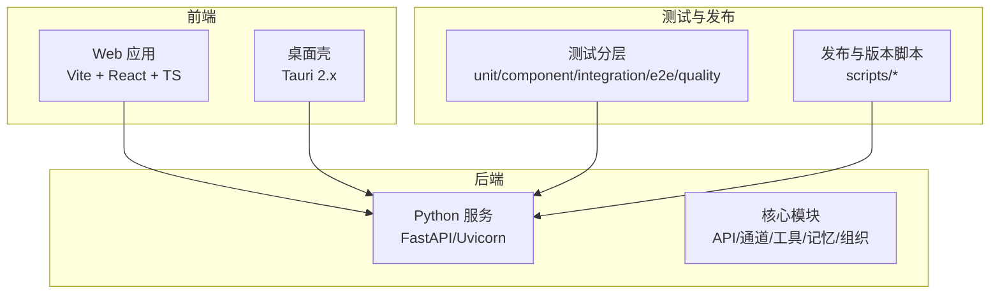
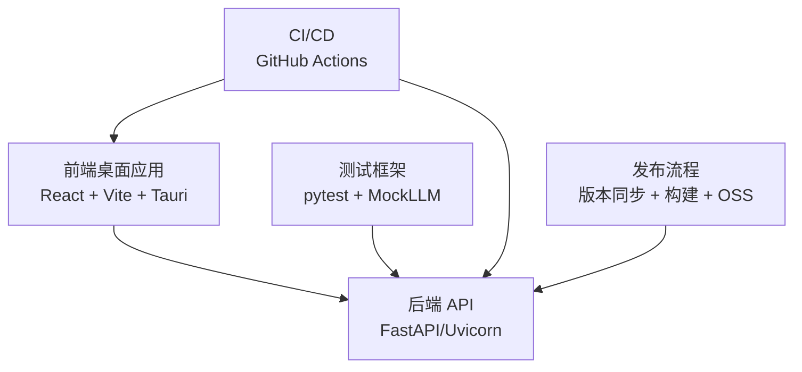
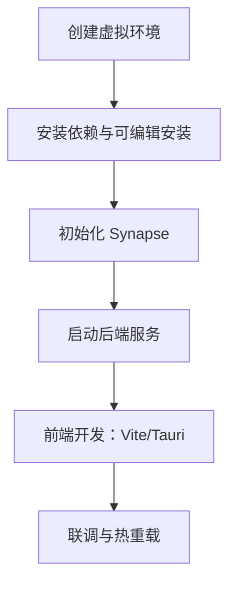
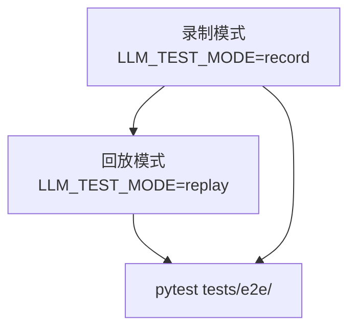
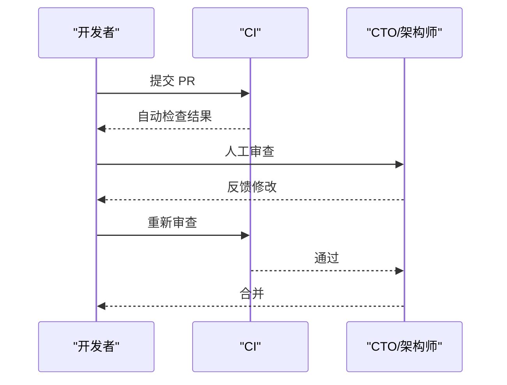
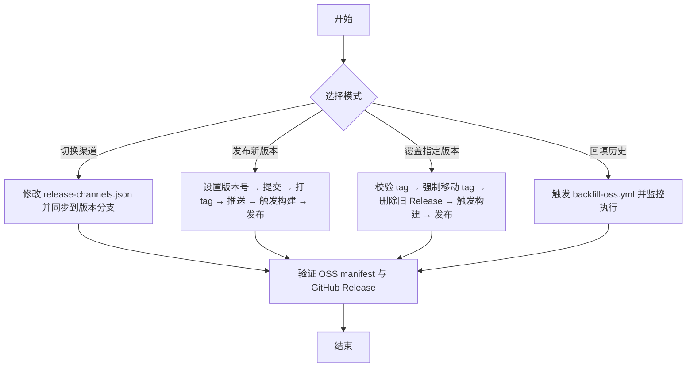
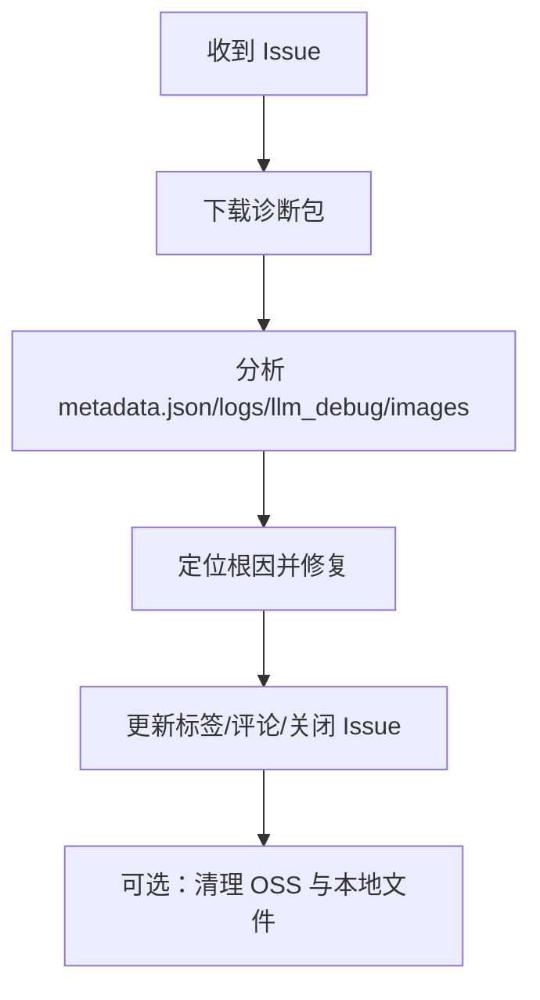
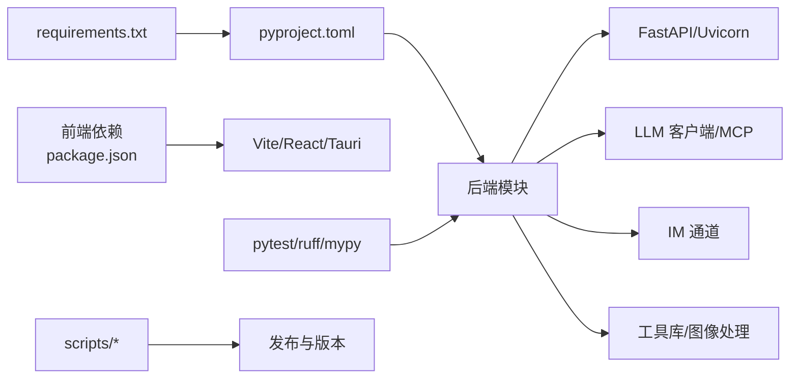

# 开发者指南

<cite>
**本文引用的文件**
- [README.md](file://README.md)
- [开发环境部署手册](file://docs/development/dev-environment-setup.md)
- [测试指南](file://docs/testing.md)
- [自动化测试框架配置指南](file://docs/testing-framework-setup.md)
- [代码审查流程与清单](file://docs/code-review-process.md)
- [Release Playbook — Synapse 发布操作手册](file://docs/release-playbook.md)
- [Pull Request 模板](file://.github/PULL_REQUEST_TEMPLATE.md)
- [用户反馈 Issue 诊断指南](file://docs/feedback-debug-guide.md)
- [llm_debug 抽样复盘：典型失败模式与触发条件](file://docs/llm_debug_failure_modes.md)
- [requirements.txt](file://requirements.txt)
- [pyproject.toml](file://pyproject.toml)
- [scripts/run_tests.py](file://scripts/run_tests.py)
- [src/synapse/__main__.py](file://src/synapse/__main__.py)
- [apps/setup-center/package.json](file://apps/setup-center/package.json)
- [CODE_OF_CONDUCT.md](file://CODE_OF_CONDUCT.md)
</cite>

## 目录
1. [简介](#简介)
2. [项目结构](#项目结构)
3. [核心组件](#核心组件)
4. [架构总览](#架构总览)
5. [详细组件分析](#详细组件分析)
6. [依赖分析](#依赖分析)
7. [性能考虑](#性能考虑)
8. [故障排查指南](#故障排查指南)
9. [结论](#结论)
10. [附录](#附录)

## 简介
本指南面向希望参与 Synapse 开发的工程师，提供从环境搭建、代码规范、测试策略到调试与性能分析、贡献流程与发布管理的完整开发工作流。文档结合仓库内的开发文档与脚本，帮助你在后端 Python 服务、前端桌面应用（Tauri + React）、以及测试与发布流程中高效协作。

## 项目结构
仓库采用多语言混合架构：后端 Python（FastAPI + Uvicorn）、前端桌面应用（React + TypeScript + Vite + Tauri）、以及丰富的测试与发布脚本。核心目录与职责概览如下：
- docs：开发与运维文档（环境、测试、发布、调试）
- src/synapse：后端核心代码（API、通道、工具、记忆、组织等）
- apps/setup-center：前端桌面应用（Tauri + React + TypeScript）
- tests：分层测试（unit/component/integration/e2e/quality/legacy）
- scripts：测试运行、版本管理、发布辅助脚本
- requirements.txt 与 pyproject.toml：后端依赖与可选通道/平台依赖
- apps/setup-center/package.json：前端依赖与构建脚本

**章节来源**
- [README.md: 624-641:624-641](file://README.md#L624-L641)
- [开发环境部署手册: 14-148:14-148](file://docs/development/dev-environment-setup.md#L14-L148)

## 核心组件
- 后端服务：提供 HTTP API、IM 通道适配、工具执行、记忆检索、组织编排等能力
- 前端桌面应用：Tauri + React + TypeScript，支持热重载与桌面端打包
- 测试体系：分层测试（L1-L5），包含 MockLLMClient、录制/回放机制、覆盖率统计
- 发布与版本：统一版本源（VERSION）与多文件同步，GitHub Actions 自动化构建与发布

**章节来源**
- [开发环境部署手册: 14-148:14-148](file://docs/development/dev-environment-setup.md#L14-L148)
- [测试指南: 7-247:7-247](file://docs/testing.md#L7-L247)
- [Release Playbook — Synapse 发布操作手册: 1-350:1-350](file://docs/release-playbook.md#L1-L350)

## 架构总览
后端与前端通过 HTTP API 通信，桌面应用内嵌前端资源并通过 Tauri 桥接到系统能力。测试与发布脚本贯穿开发周期，确保质量与一致性。

**图表来源**
- [开发环境部署手册: 62-108:62-108](file://docs/development/dev-environment-setup.md#L62-L108)
- [测试指南: 165-189:165-189](file://docs/testing.md#L165-L189)
- [Release Playbook — Synapse 发布操作手册: 50-58:50-58](file://docs/release-playbook.md#L50-L58)

**章节来源**
- [开发环境部署手册: 62-108:62-108](file://docs/development/dev-environment-setup.md#L62-L108)
- [测试指南: 165-189:165-189](file://docs/testing.md#L165-L189)
- [Release Playbook — Synapse 发布操作手册: 50-58:50-58](file://docs/release-playbook.md#L50-L58)

## 详细组件分析

### 开发环境搭建
- 后端（根目录）
  - 创建并激活虚拟环境
  - 安装项目与可选开发依赖
  - 初始化 Synapse（首次运行）
  - 启动后端服务（生产态前端）
- 前端（apps/setup-center）
  - 安装依赖
  - 启动 Vite（Web 调试）或 Tauri（桌面开发模式）
  - 生成/更新应用图标
  - 使用 Ctrl+Shift+O 打开前端部署引导
- 联调要点
  - 开发时使用 npm run tauri dev 或 npm run dev，不要用 synapse serve 的静态页面
  - 确认后端端口与前端 API 地址一致

**图表来源**
- [开发环境部署手册: 18-108:18-108](file://docs/development/dev-environment-setup.md#L18-L108)

**章节来源**
- [开发环境部署手册: 14-148:14-148](file://docs/development/dev-environment-setup.md#L14-L148)

### 测试策略与分层
- 分层架构
  - L1 单元测试：纯逻辑，<30s
  - L2 组件测试：Mock LLM，<2min
  - L3 集成测试：Mock LLM，<3min
  - L4 E2E：录制/回放，<15min
  - L5 质量评估：统计通过率与回答质量，<30min
- 核心基础设施
  - MockLLMClient：预设响应、序列响应、调用记录
  - LLMRecorder/ReplayLLMClient：录制真实交互并回放
  - Fixtures：会话、消息、工具定义、端点配置等工厂
- 运行方式
  - 全量运行：pytest tests/
  - 分层运行：pytest tests/{unit,component,integration,e2e,quality}/
  - 带覆盖率：pytest --cov=src/synapse --cov-report=html
- CI 集成
  - 分层 jobs：unit/component/integration/e2e/quality
  - E2E 支持回放（CI 默认）与录制（本地）

**图表来源**
- [测试指南: 180-189:180-189](file://docs/testing.md#L180-L189)

**章节来源**
- [测试指南: 7-247:7-247](file://docs/testing.md#L7-L247)
- [自动化测试框架配置指南: 1-152:1-152](file://docs/testing-framework-setup.md#L1-L152)

### 代码审查流程与清单
- 流程
  - 开发者提交 PR → 自动 CI 检查 → CTO/架构师审查 → 反馈修改 → 重新审查 → 合并
- 角色与时效
  - CTO：核心模块、架构变更、公共组件
  - 架构师：技术选型、设计模式、性能优化
  - 时效：普通 PR 24 小时，紧急修复 4 小时，重大重构 48 小时
- 自动化检查清单（CI）
  - 编译成功、单元测试、覆盖率、Ktlint、Detekt、安全漏洞检查
- 人工审查清单（质量、架构、测试、性能与安全、文档）
- PR 模板与合并策略
  - 模板包含变更描述、关联任务、测试计划、截图、检查清单
  - 分支保护：main/develop 保护；合并方式：feature→develop 擦拭合并，develop→main 保留历史

**图表来源**
- [代码审查流程与清单: 3-149:3-149](file://docs/code-review-process.md#L3-L149)

**章节来源**
- [代码审查流程与清单: 1-149:1-149](file://docs/code-review-process.md#L1-L149)
- [.github/PULL_REQUEST_TEMPLATE.md: 1-60:1-60](file://.github/PULL_REQUEST_TEMPLATE.md#L1-L60)

### 发布流程管理
- 渠道与分支
  - main：开发分支（dev）
  - v{X}.{Y}.x：版本分支（release/pre-release）
- 版本号管理
  - scripts/version.py 为单一版本源，同步到 pyproject.toml、package.json、tauri.conf.json、Cargo.toml、Cargo.lock、_bundled_version.txt、build.gradle
- 工作流
  - release.yml：构建 Desktop 安装包并上传到 GitHub Release（Draft）
  - mobile.yml：构建移动端（Android APK + iOS IPA）
  - publish-release.yml：发布 Release + 生成 manifest + 上传安装包与 manifest 到 OSS
  - backfill-oss.yml：批量回填历史版本 manifest
- 操作模式
  - 切换渠道配置
  - 发布新版本
  - 覆盖指定版本（重新打包已有 tag）
  - 回填历史 manifest 到 OSS

**图表来源**
- [Release Playbook — Synapse 发布操作手册: 67-350:67-350](file://docs/release-playbook.md#L67-L350)

**章节来源**
- [Release Playbook — Synapse 发布操作手册: 1-350:1-350](file://docs/release-playbook.md#L1-L350)

### 调试与问题诊断
- 用户反馈诊断
  - 安装依赖（oss2）、GitHub CLI、配置 OSS 凭证
  - 通过 status:* 标签追踪 Issue 生命周期
  - 下载诊断包（zip + metadata.json）、解压分析（logs/llm_debug/images）
  - 修复后更新标签、评论、关闭 Issue，并可清理 OSS 与本地文件
- llm_debug 失败模式抽样
  - CLI/非 IM 场景误用“发送工具”
  - 重复交付/重复确认刷屏
  - 切模/超时后上下文与工具状态误继承
  - 两段式 Prompt 的“编译器输出污染 user messages”

**图表来源**
- [用户反馈 Issue 诊断指南: 58-268:58-268](file://docs/feedback-debug-guide.md#L58-L268)
- [llm_debug 抽样复盘：典型失败模式与触发条件: 1-85:1-85](file://docs/llm_debug_failure_modes.md#L1-L85)

**章节来源**
- [用户反馈 Issue 诊断指南: 1-268:1-268](file://docs/feedback-debug-guide.md#L1-L268)
- [llm_debug 抽样复盘：典型失败模式与触发条件: 1-85:1-85](file://docs/llm_debug_failure_modes.md#L1-L85)

### 依赖与运行入口
- 后端依赖
  - 核心 LLM（anthropic/openai）、MCP、Web Search（ddgs）、CLI/UI（rich/prompt-toolkit/typer）、异步与 HTTP（httpx/aiofiles/nest-asyncio）、数据库（aiosqlite）、数据验证（pydantic/pydantic-settings）、Git（gitpython）、YAML（pyyaml）、工具库（tenacity/simplejson）、图像处理（Pillow）、HTTP API（fastapi/uvicorn）、IM 通道（python-telegram-bot）、浏览器自动化（playwright）
  - 可选依赖：飞书、钉钉、企业微信、OneBot、QQ、微信个人号、Windows 桌面自动化
- 运行入口
  - python -m synapse 或通过可执行脚本 synapse
  - 前端入口：apps/setup-center/package.json 中的 scripts（dev/build/tauri 等）

**章节来源**
- [requirements.txt: 1-105:1-105](file://requirements.txt#L1-L105)
- [pyproject.toml: 1-282:1-282](file://pyproject.toml#L1-L282)
- [src/synapse/__main__.py: 1-19:1-19](file://src/synapse/__main__.py#L1-L19)
- [apps/setup-center/package.json: 1-86:1-86](file://apps/setup-center/package.json#L1-L86)

## 依赖分析
- 后端依赖关系
  - LLM 客户端（Anthropic/OpenAI）与 MCP 协议
  - Web 搜索与浏览器自动化（Playwright）
  - HTTP API（FastAPI/Uvicorn）与 IM 通道（Telegram/飞书/企业微信/钉钉/OneBot/QQ/微信个人号）
  - 工具库（tenacity、simplejson）与图像处理（Pillow）
- 前端依赖关系
  - React + Ant Design + Tauri 插件生态
  - Monaco Editor、Xterm、3D/可视化库等
- 测试与发布
  - pytest + pytest-asyncio + pytest-cov
  - ruff（lint）+ mypy（类型检查）
  - scripts/version.py 与 GitHub Actions 工作流

**图表来源**
- [requirements.txt: 1-105:1-105](file://requirements.txt#L1-L105)
- [pyproject.toml: 1-282:1-282](file://pyproject.toml#L1-L282)
- [apps/setup-center/package.json: 1-86:1-86](file://apps/setup-center/package.json#L1-L86)

**章节来源**
- [requirements.txt: 1-105:1-105](file://requirements.txt#L1-L105)
- [pyproject.toml: 1-282:1-282](file://pyproject.toml#L1-L282)
- [apps/setup-center/package.json: 1-86:1-86](file://apps/setup-center/package.json#L1-L86)

## 性能考虑
- 测试分层与成本
  - L1/L2/L3 为离线可复现，成本接近 0
  - E2E 回放成本接近 0，录制成本约 $0.5/次
  - 质量评估成本约 $2/次
- 覆盖率目标
  - 整体 ≥70%，核心业务逻辑 ≥85%，ViewModel ≥80%，UseCase ≥90%，Repository ≥75%
- 性能与安全要点
  - 避免主线程 IO 操作、协程作用域使用得当、敏感数据不硬编码、网络请求设置超时、图片加载缓存策略、列表分页/懒加载
- 调试与分析
  - 使用 llm_debug 日志抽样复盘失败模式，识别上下文噪声、重复交付、切模后状态误继承等问题

**章节来源**
- [测试指南: 17-25:17-25](file://docs/testing.md#L17-L25)
- [自动化测试框架配置指南: 95-102:95-102](file://docs/testing-framework-setup.md#L95-L102)
- [代码审查流程与清单: 55-62:55-62](file://docs/code-review-process.md#L55-L62)
- [llm_debug 抽样复盘：典型失败模式与触发条件: 10-75:10-75](file://docs/llm_debug_failure_modes.md#L10-L75)

## 故障排查指南
- 本地测试排障
  - 单文件/单用例运行、打印 stdout/日志、调试模式（LOG_LEVEL=DEBUG）
- 用户反馈诊断
  - 下载诊断包、解压分析、按优先级检查 metadata、logs、llm_debug、images
  - 修复后更新标签、评论、关闭 Issue，并清理 OSS 与本地文件
- 常见问题
  - 端口占用、Tauri 首次构建耗时、Python 未激活、前端连不上后端

**章节来源**
- [测试指南: 232-247:232-247](file://docs/testing.md#L232-L247)
- [用户反馈 Issue 诊断指南: 58-268:58-268](file://docs/feedback-debug-guide.md#L58-L268)
- [开发环境部署手册: 140-148:140-148](file://docs/development/dev-environment-setup.md#L140-L148)

## 结论
本指南提供了从环境搭建、测试策略、代码审查、调试与性能分析到发布流程的完整开发工作流。建议团队在日常开发中遵循分层测试、自动化检查与审查清单，配合统一的版本与发布流程，确保质量与效率的平衡。

## 附录
- 社区与支持
  - Discord、WeChat 群、QQ 群、GitHub Issues/Discussions
- 行为准则
  - 遵循 Contributor Covenant，尊重与包容，建设健康社区

**章节来源**
- [README.md: 643-681:643-681](file://README.md#L643-L681)
- [CODE_OF_CONDUCT.md: 1-75:1-75](file://CODE_OF_CONDUCT.md#L1-L75)