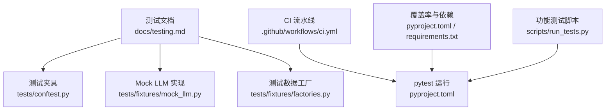
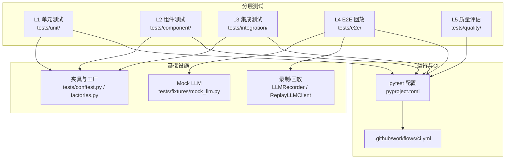
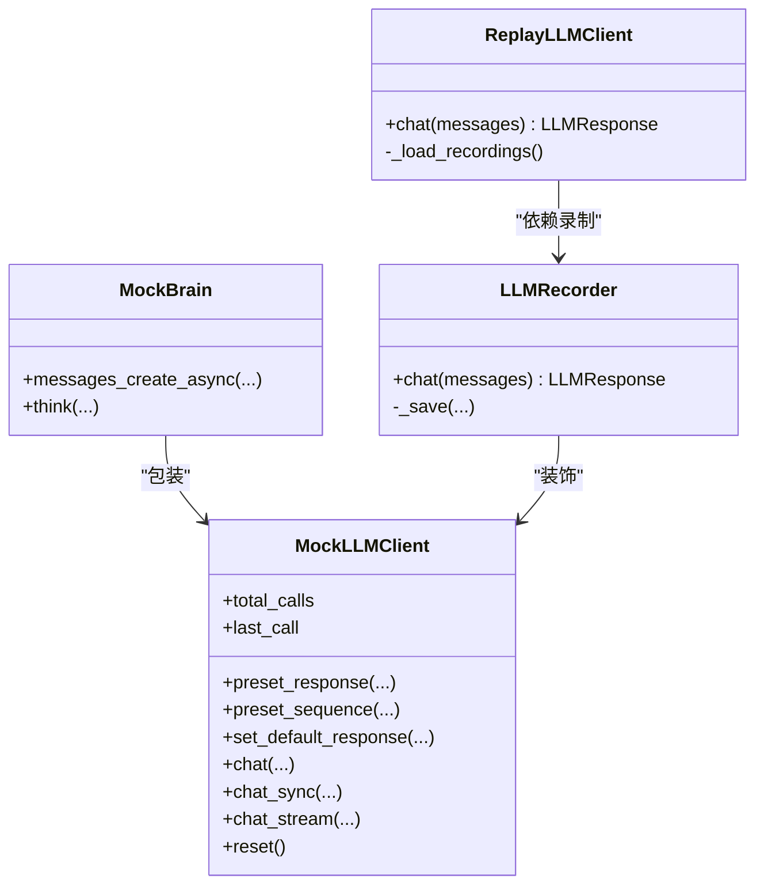
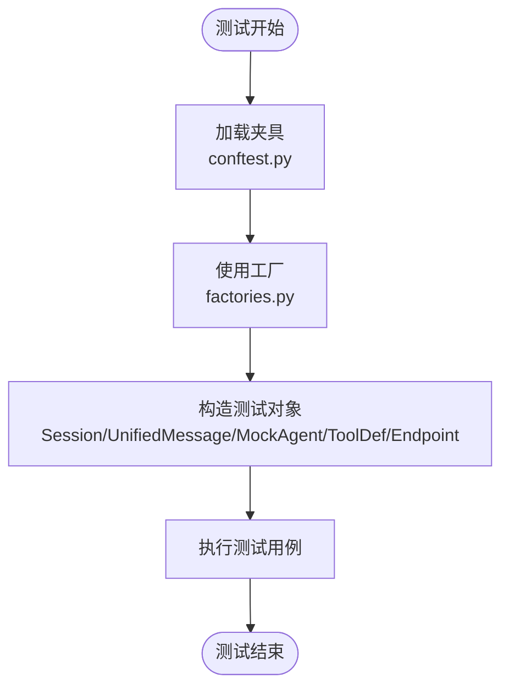
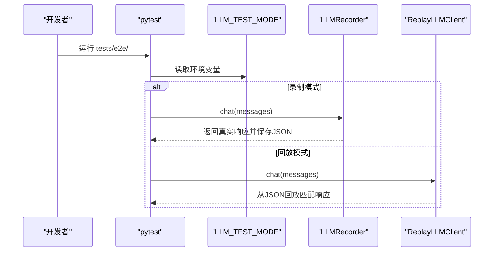
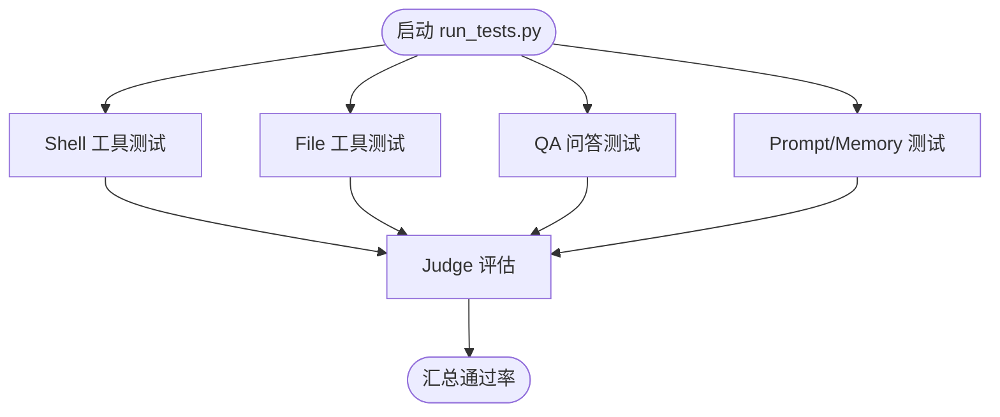
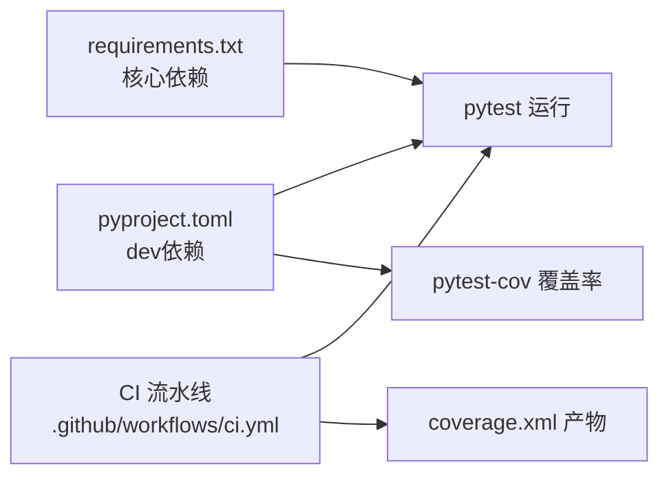

# 测试策略

<cite>
**本文引用的文件**
- [docs/testing.md](file://docs/testing.md)
- [docs/testing-framework-setup.md](file://docs/testing-framework-setup.md)
- [pyproject.toml](file://pyproject.toml)
- [requirements.txt](file://requirements.txt)
- [.github/workflows/ci.yml](file://.github/workflows/ci.yml)
- [tests/conftest.py](file://tests/conftest.py)
- [tests/fixtures/mock_llm.py](file://tests/fixtures/mock_llm.py)
- [tests/fixtures/factories.py](file://tests/fixtures/factories.py)
- [scripts/run_tests.py](file://scripts/run_tests.py)
</cite>

## 目录
1. [引言](#引言)
2. [项目结构](#项目结构)
3. [核心组件](#核心组件)
4. [架构总览](#架构总览)
5. [详细组件分析](#详细组件分析)
6. [依赖分析](#依赖分析)
7. [性能考虑](#性能考虑)
8. [故障排查指南](#故障排查指南)
9. [结论](#结论)
10. [附录](#附录)

## 引言
本文件面向仓库现有测试体系，系统化梳理测试分层、运行方式、覆盖率与CI集成，并给出针对单元测试、集成测试、端到端测试的编写方法、最佳实践与实施指南。同时结合项目中已有的Mock LLM、测试夹具与工厂方法，提供可直接落地的测试策略与排障建议。

## 项目结构
测试相关资源主要分布在以下位置：
- 文档与指南：docs/testing.md、docs/testing-framework-setup.md
- 测试运行与覆盖率：pyproject.toml、requirements.txt
- CI流水线：.github/workflows/ci.yml
- 测试夹具与工厂：tests/conftest.py、tests/fixtures/mock_llm.py、tests/fixtures/factories.py
- 功能性测试脚本：scripts/run_tests.py

**图表来源**
- [docs/testing.md:1-247](file://docs/testing.md#L1-L247)
- [tests/conftest.py:1-96](file://tests/conftest.py#L1-L96)
- [tests/fixtures/mock_llm.py:1-349](file://tests/fixtures/mock_llm.py#L1-L349)
- [tests/fixtures/factories.py:1-152](file://tests/fixtures/factories.py#L1-L152)
- [.github/workflows/ci.yml:1-409](file://.github/workflows/ci.yml#L1-L409)
- [pyproject.toml:278-282](file://pyproject.toml#L278-L282)

**章节来源**
- [docs/testing.md:28-79](file://docs/testing.md#L28-L79)
- [pyproject.toml:278-282](file://pyproject.toml#L278-L282)

## 核心组件
- 测试分层与运行节奏
  - L1单元测试：纯逻辑，<30s，每次提交/PR
  - L2组件测试：Mock LLM，<2min，每次提交/PR
  - L3集成测试：Mock LLM，<3min，每次提交/PR
  - L4 E2E（回放）：回放真实LLM交互，<5min，每次PR/每日
  - L4 E2E（录制）：手动/每周，<15min，用于补充回放
  - L5 质量评估：统计通过率，手动/每周
- 核心基础设施
  - MockLLMClient：可编程LLM模拟，支持预设响应、序列响应、调用日志
  - LLMRecorder/ReplayLLMClient：录制与回放真实LLM交互
  - 测试夹具与工厂：mock_llm_client、mock_brain、test_session、tmp_workspace、test_settings、mock_response_factory；以及create_test_session、create_channel_message、create_mock_agent、create_tool_definition、create_endpoint_config、build_conversation等
- 运行与覆盖率
  - pytest配置：asyncio_mode、testpaths、忽略项
  - 覆盖率：pytest-cov，目标覆盖src/synapse
- CI集成
  - 分层Job：unit_tests → component_tests → integration_tests → e2e_tests → quality_tests → python_test
  - E2E回放模式：LLM_TEST_MODE=replay

**章节来源**
- [docs/testing.md:7-247](file://docs/testing.md#L7-L247)
- [tests/conftest.py:32-96](file://tests/conftest.py#L32-L96)
- [tests/fixtures/mock_llm.py:63-349](file://tests/fixtures/mock_llm.py#L63-L349)
- [tests/fixtures/factories.py:21-152](file://tests/fixtures/factories.py#L21-L152)
- [pyproject.toml:278-282](file://pyproject.toml#L278-L282)

## 架构总览
测试架构围绕“分层+Mock+回放”的策略展开，确保快速反馈与可重复性。

**图表来源**
- [docs/testing.md:7-247](file://docs/testing.md#L7-L247)
- [tests/conftest.py:1-96](file://tests/conftest.py#L1-L96)
- [tests/fixtures/mock_llm.py:1-349](file://tests/fixtures/mock_llm.py#L1-L349)
- [tests/fixtures/factories.py:1-152](file://tests/fixtures/factories.py#L1-L152)
- [pyproject.toml:278-282](file://pyproject.toml#L278-L282)
- [.github/workflows/ci.yml:13-131](file://.github/workflows/ci.yml#L13-L131)

## 详细组件分析

### Mock LLM 与回放机制
- MockLLMClient
  - 支持预设单次/序列响应、默认响应、同步/异步聊天、流式聊天、调用日志
  - 适合组件与集成测试中稳定地驱动被测逻辑
- MockBrain
  - 包装MockLLMClient，满足调用brain接口的场景
- LLMRecorder/ReplayLLMClient
  - 录制真实交互到JSON，按消息哈希回放，确保E2E一致性
  - 回放模式默认开启，保证CI可重复性

**图表来源**
- [tests/fixtures/mock_llm.py:63-349](file://tests/fixtures/mock_llm.py#L63-L349)

**章节来源**
- [docs/testing.md:85-107](file://docs/testing.md#L85-L107)
- [tests/fixtures/mock_llm.py:63-349](file://tests/fixtures/mock_llm.py#L63-L349)

### 测试夹具与工厂
- 夹具
  - mock_llm_client、mock_brain、test_session、tmp_workspace、test_settings、mock_response_factory
- 工厂
  - create_test_session、create_channel_message、create_mock_agent、create_tool_definition、create_endpoint_config、build_conversation

**图表来源**
- [tests/conftest.py:32-96](file://tests/conftest.py#L32-L96)
- [tests/fixtures/factories.py:21-152](file://tests/fixtures/factories.py#L21-L152)

**章节来源**
- [docs/testing.md:108-118](file://docs/testing.md#L108-L118)
- [tests/conftest.py:32-96](file://tests/conftest.py#L32-L96)
- [tests/fixtures/factories.py:21-152](file://tests/fixtures/factories.py#L21-L152)

### E2E 回放与录制流程
- 回放模式（CI默认）
  - LLM_TEST_MODE=replay
  - 使用ReplayLLMClient从recordings目录回放
- 录制模式（本地）
  - LLM_TEST_MODE=record
  - 使用LLMRecorder将真实交互保存为JSON

**图表来源**
- [docs/testing.md:180-188](file://docs/testing.md#L180-L188)
- [tests/fixtures/mock_llm.py:243-349](file://tests/fixtures/mock_llm.py#L243-L349)

**章节来源**
- [docs/testing.md:180-188](file://docs/testing.md#L180-L188)
- [tests/fixtures/mock_llm.py:243-349](file://tests/fixtures/mock_llm.py#L243-L349)

### 功能测试脚本（示例）
- scripts/run_tests.py 展示了如何组织功能性测试（Shell/File/问答/Prompt与Memory），并使用Judge进行结果判定，便于回归与验收。

**图表来源**
- [scripts/run_tests.py:177-212](file://scripts/run_tests.py#L177-L212)

**章节来源**
- [scripts/run_tests.py:1-212](file://scripts/run_tests.py#L1-L212)

## 依赖分析
- 测试运行与覆盖率
  - pytest、pytest-asyncio、pytest-cov在dev可选依赖中定义
  - pytest.ini_options中设置asyncio_mode、testpaths与忽略项
- 依赖一致性
  - requirements.txt与pyproject.toml保持核心依赖一致，确保pip安装与开发环境一致
- CI中的覆盖率
  - python_test Job在ubuntu-latest + Python 3.11上运行pytest并生成coverage.xml，可上传至Codecov

**图表来源**
- [pyproject.toml:144-151](file://pyproject.toml#L144-L151)
- [pyproject.toml:278-282](file://pyproject.toml#L278-L282)
- [.github/workflows/ci.yml:132-169](file://.github/workflows/ci.yml#L132-L169)

**章节来源**
- [pyproject.toml:144-151](file://pyproject.toml#L144-L151)
- [pyproject.toml:278-282](file://pyproject.toml#L278-L282)
- [.github/workflows/ci.yml:132-169](file://.github/workflows/ci.yml#L132-L169)

## 性能考虑
- 测试分层与耗时
  - L1单元测试：<30s；L2组件测试：<2min；L3集成测试：<3min；L4 E2E回放：<5min；L4 E2E录制：<15min；L5质量评估：<30min
- Mock与回放
  - 使用MockLLMClient与ReplayLLMClient避免真实LLM调用，显著降低延迟与成本
- 并行与矩阵
  - CI中python_test采用多OS+多Python版本矩阵，提升兼容性检测效率

**章节来源**
- [docs/testing.md:17-24](file://docs/testing.md#L17-L24)
- [docs/testing.md:170-179](file://docs/testing.md#L170-L179)
- [.github/workflows/ci.yml:134-139](file://.github/workflows/ci.yml#L134-L139)

## 故障排查指南
- 本地运行
  - 运行全部测试：pytest tests/ -v
  - 分层运行：pytest tests/{unit,component,integration,e2e,quality}/ -v
  - 带覆盖率：pytest tests/ -v --cov=src/synapse --cov-report=html
- CI运行
  - 分层Job顺序：unit → component → integration → e2e → quality → python_test
  - E2E回放：LLM_TEST_MODE=replay
- 排错命令
  - 单文件/单用例调试
  - 打印stdout与日志：-s
  - 设置日志级别：LOG_LEVEL=DEBUG

**章节来源**
- [docs/testing.md:121-162](file://docs/testing.md#L121-L162)
- [docs/testing.md:165-247](file://docs/testing.md#L165-L247)
- [.github/workflows/ci.yml:13-131](file://.github/workflows/ci.yml#L13-L131)

## 结论
本测试策略以“分层+Mock+回放”为核心，结合pytest与CI流水线，形成从单元到端到端的完整闭环。通过Mock LLM与录制回放，既保证了测试的确定性与可重复性，又能在E2E层面保留真实交互的验证价值。建议在新增功能时遵循“最低测试要求”，优先补齐单元与组件测试，再补充E2E录制与质量评估，持续提升覆盖率与稳定性。

## 附录

### 测试分层与最低要求对照
- 新增纯逻辑函数：L1单元测试（正常+边界）
- 新增组件/模块：L2组件测试（Mock依赖、验证关键交互）
- 新增API端点：L3集成测试（httpx AsyncClient、请求/响应格式）
- 新增IM适配器：L3集成测试（Mock webhook/消息、消息转换）
- 新增LLM交互行为：L4 E2E（录制一次真实交互，加入回放）
- 修复Bug：先写复现测试（红），再修复使其变绿

**章节来源**
- [docs/testing.md:206-229](file://docs/testing.md#L206-L229)

### 覆盖率目标（参考Android侧配置）
- 整体覆盖率目标：≥70%
- 核心业务逻辑：≥85%
- ViewModel：≥80%
- UseCase：≥90%
- Repository：≥75%

**章节来源**
- [docs/testing-framework-setup.md:95-101](file://docs/testing-framework-setup.md#L95-L101)