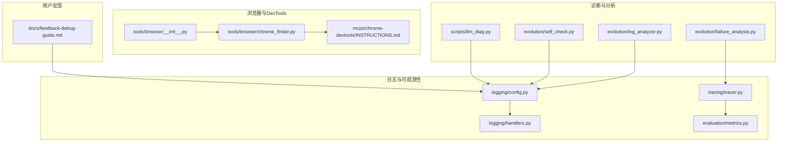
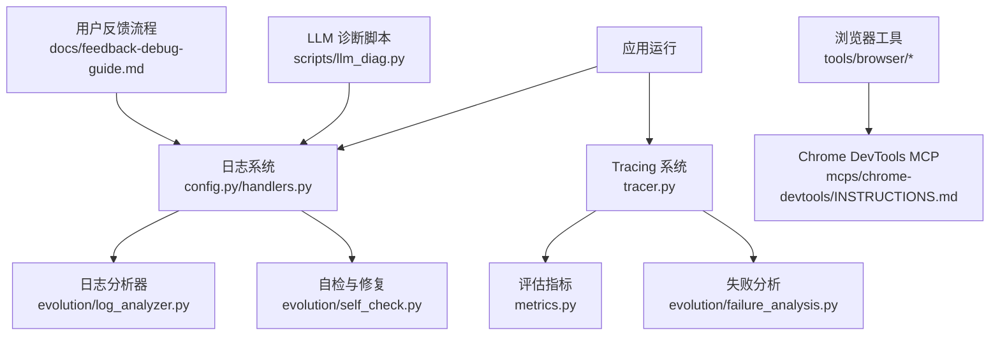
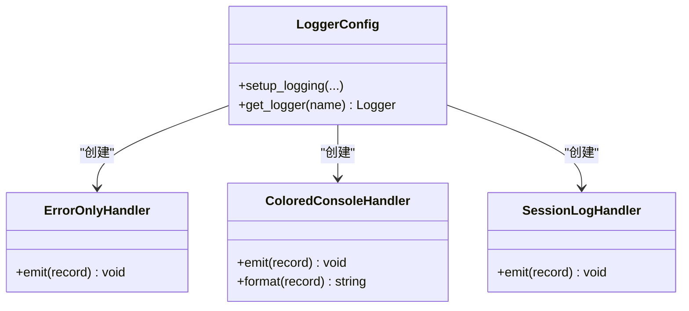
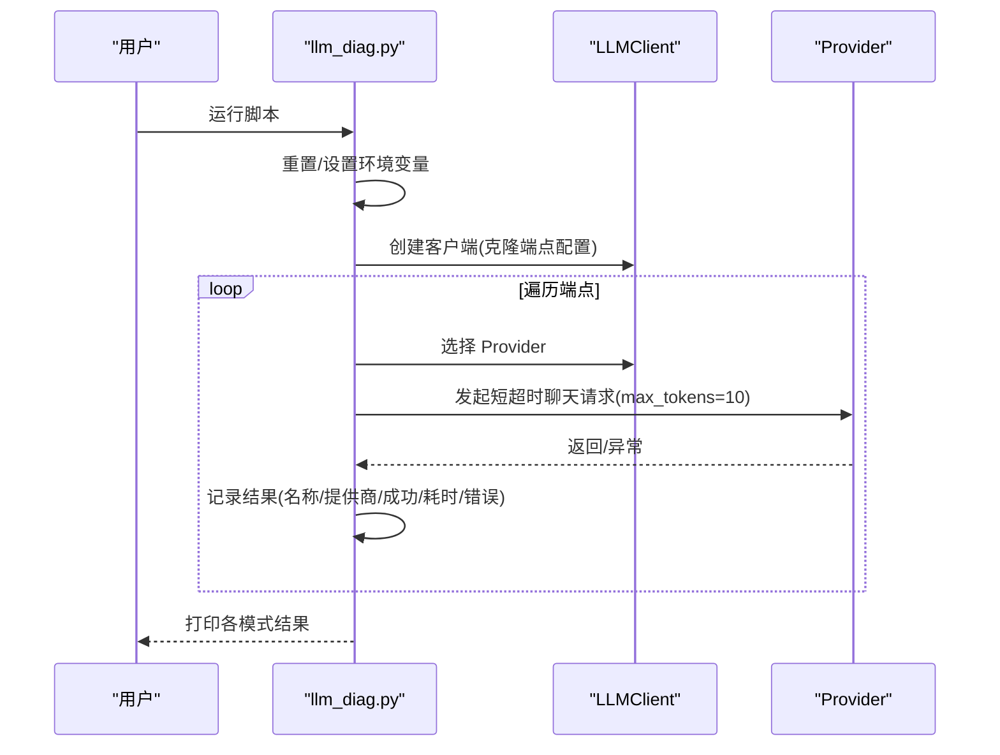
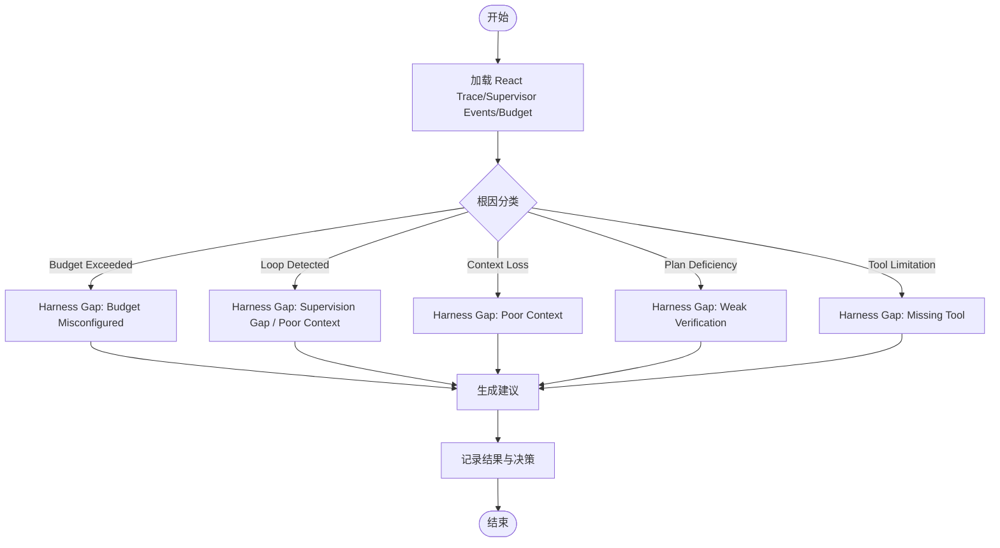
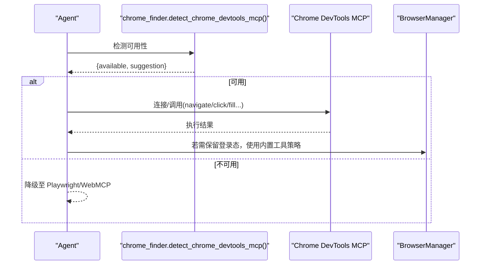
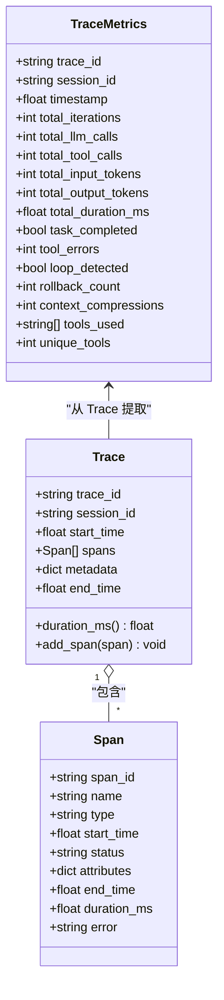
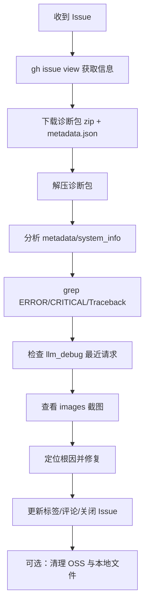
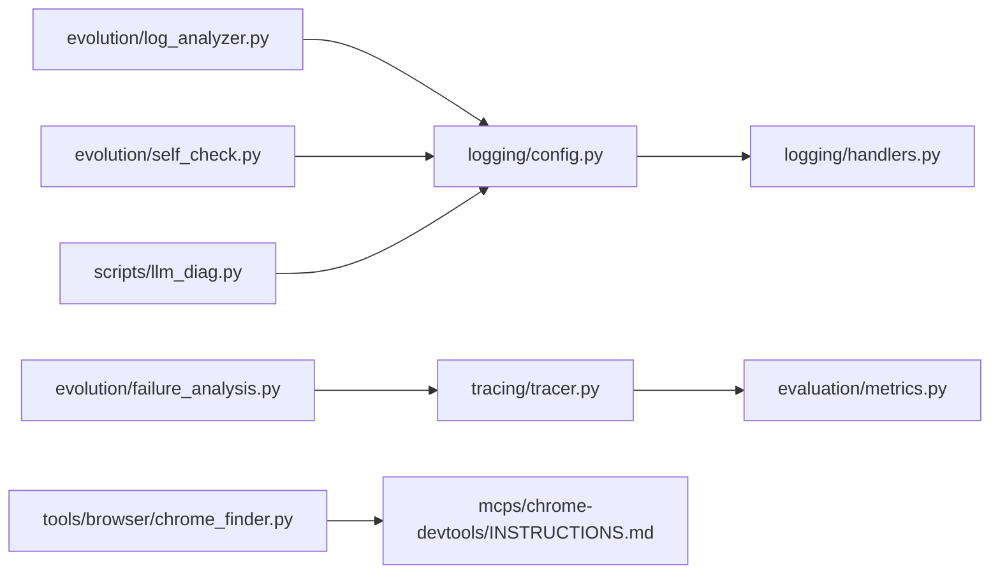

# 调试技巧

<cite>
**本文引用的文件**
- [scripts/llm_diag.py](file://scripts/llm_diag.py)
- [src/synapse/logging/config.py](file://src/synapse/logging/config.py)
- [src/synapse/logging/handlers.py](file://src/synapse/logging/handlers.py)
- [src/synapse/evolution/log_analyzer.py](file://src/synapse/evolution/log_analyzer.py)
- [src/synapse/evolution/failure_analysis.py](file://src/synapse/evolution/failure_analysis.py)
- [src/synapse/evolution/self_check.py](file://src/synapse/evolution/self_check.py)
- [src/synapse/tools/browser/chrome_finder.py](file://src/synapse/tools/browser/chrome_finder.py)
- [src/synapse/tools/browser/__init__.py](file://src/synapse/tools/browser/__init__.py)
- [src/synapse/tracing/tracer.py](file://src/synapse/tracing/tracer.py)
- [src/synapse/evaluation/metrics.py](file://src/synapse/evaluation/metrics.py)
- [docs/feedback-debug-guide.md](file://docs/feedback-debug-guide.md)
- [docs/llm_debug_failure_modes.md](file://docs/llm_debug_failure_modes.md)
- [mcps/chrome-devtools/INSTRUCTIONS.md](file://mcps/chrome-devtools/INSTRUCTIONS.md)
- [scripts/run_tests.py](file://scripts/run_tests.py)
</cite>

## 目录
1. [简介](#简介)
2. [项目结构](#项目结构)
3. [核心组件](#核心组件)
4. [架构总览](#架构总览)
5. [详细组件分析](#详细组件分析)
6. [依赖分析](#依赖分析)
7. [性能考虑](#性能考虑)
8. [故障排查指南](#故障排查指南)
9. [结论](#结论)
10. [附录](#附录)

## 简介
本指南面向开发者与运维人员，系统性梳理本仓库中的调试与诊断能力，覆盖以下主题：
- Python 调试器 pdb 的使用要点与最佳实践
- 日志系统的配置与分析方法
- 性能分析与可观测性（Tracing/指标）
- 浏览器开发者工具与网络请求追踪、内存泄漏检测
- 错误诊断流程、异常处理最佳实践、生产环境问题排查
- 常用调试命令与工具组合示例

## 项目结构
围绕调试与诊断的关键目录与文件：
- 日志与可观测性：logging、tracing、evaluation
- 诊断与分析：evolution（日志分析、失败根因分析、自检）、llm_diag 脚本
- 浏览器与 DevTools：tools/browser、mcps/chrome-devtools
- 用户反馈与诊断包：docs/feedback-debug-guide.md、scripts/feedback.py（调用入口）
- 测试与回归：scripts/run_tests.py

**图示来源**
- [src/synapse/logging/config.py:20-107](file://src/synapse/logging/config.py#L20-L107)
- [src/synapse/logging/handlers.py:19-169](file://src/synapse/logging/handlers.py#L19-L169)
- [src/synapse/tracing/tracer.py:106-132](file://src/synapse/tracing/tracer.py#L106-L132)
- [src/synapse/evaluation/metrics.py:16-81](file://src/synapse/evaluation/metrics.py#L16-L81)
- [scripts/llm_diag.py:93-133](file://scripts/llm_diag.py#L93-L133)
- [src/synapse/evolution/log_analyzer.py:319-380](file://src/synapse/evolution/log_analyzer.py#L319-L380)
- [src/synapse/evolution/failure_analysis.py:120-271](file://src/synapse/evolution/failure_analysis.py#L120-L271)
- [src/synapse/evolution/self_check.py:1452-1485](file://src/synapse/evolution/self_check.py#L1452-L1485)
- [src/synapse/tools/browser/__init__.py:1-29](file://src/synapse/tools/browser/__init__.py#L1-L29)
- [src/synapse/tools/browser/chrome_finder.py:155-193](file://src/synapse/tools/browser/chrome_finder.py#L155-L193)
- [mcps/chrome-devtools/INSTRUCTIONS.md:1-55](file://mcps/chrome-devtools/INSTRUCTIONS.md#L1-L55)
- [docs/feedback-debug-guide.md:1-268](file://docs/feedback-debug-guide.md#L1-L268)

**章节来源**
- [src/synapse/logging/config.py:20-107](file://src/synapse/logging/config.py#L20-L107)
- [src/synapse/logging/handlers.py:19-169](file://src/synapse/logging/handlers.py#L19-L169)
- [src/synapse/tracing/tracer.py:106-132](file://src/synapse/tracing/tracer.py#L106-L132)
- [src/synapse/evaluation/metrics.py:16-81](file://src/synapse/evaluation/metrics.py#L16-L81)
- [scripts/llm_diag.py:93-133](file://scripts/llm_diag.py#L93-L133)
- [src/synapse/evolution/log_analyzer.py:319-380](file://src/synapse/evolution/log_analyzer.py#L319-L380)
- [src/synapse/evolution/failure_analysis.py:120-271](file://src/synapse/evolution/failure_analysis.py#L120-L271)
- [src/synapse/evolution/self_check.py:1452-1485](file://src/synapse/evolution/self_check.py#L1452-L1485)
- [src/synapse/tools/browser/__init__.py:1-29](file://src/synapse/tools/browser/__init__.py#L1-L29)
- [src/synapse/tools/browser/chrome_finder.py:155-193](file://src/synapse/tools/browser/chrome_finder.py#L155-L193)
- [mcps/chrome-devtools/INSTRUCTIONS.md:1-55](file://mcps/chrome-devtools/INSTRUCTIONS.md#L1-L55)
- [docs/feedback-debug-guide.md:1-268](file://docs/feedback-debug-guide.md#L1-L268)

## 核心组件
- 日志系统：集中配置根日志器、彩色控制台输出、按大小/按天轮转、会话级日志缓冲、第三方库降噪。
- 诊断与分析：日志模式识别与摘要、失败根因分类、自检与自动修复、LLM 端点连通性诊断。
- 浏览器与 DevTools：Chrome DevTools MCP 检测与使用、Playwright 工具、WebMCP 接口预留。
- 性能与可观测性：Tracing（Trace/Span）、指标聚合（TraceMetrics）、评估指标。
- 用户反馈与诊断包：标准化诊断包结构、下载/清理/统计、Issue 生命周期标签。

**章节来源**
- [src/synapse/logging/config.py:20-107](file://src/synapse/logging/config.py#L20-L107)
- [src/synapse/logging/handlers.py:19-169](file://src/synapse/logging/handlers.py#L19-L169)
- [src/synapse/evolution/log_analyzer.py:319-380](file://src/synapse/evolution/log_analyzer.py#L319-L380)
- [src/synapse/evolution/failure_analysis.py:120-271](file://src/synapse/evolution/failure_analysis.py#L120-L271)
- [src/synapse/evolution/self_check.py:1452-1485](file://src/synapse/evolution/self_check.py#L1452-L1485)
- [scripts/llm_diag.py:93-133](file://scripts/llm_diag.py#L93-L133)
- [src/synapse/tools/browser/chrome_finder.py:155-193](file://src/synapse/tools/browser/chrome_finder.py#L155-L193)
- [src/synapse/tracing/tracer.py:106-132](file://src/synapse/tracing/tracer.py#L106-L132)
- [src/synapse/evaluation/metrics.py:16-81](file://src/synapse/evaluation/metrics.py#L16-L81)
- [docs/feedback-debug-guide.md:75-117](file://docs/feedback-debug-guide.md#L75-L117)

## 架构总览
调试与诊断能力在系统中的位置与交互如下：

**图示来源**
- [src/synapse/logging/config.py:20-107](file://src/synapse/logging/config.py#L20-L107)
- [src/synapse/logging/handlers.py:19-169](file://src/synapse/logging/handlers.py#L19-L169)
- [src/synapse/tracing/tracer.py:106-132](file://src/synapse/tracing/tracer.py#L106-L132)
- [src/synapse/evaluation/metrics.py:16-81](file://src/synapse/evaluation/metrics.py#L16-L81)
- [src/synapse/evolution/log_analyzer.py:319-380](file://src/synapse/evolution/log_analyzer.py#L319-L380)
- [src/synapse/evolution/failure_analysis.py:120-271](file://src/synapse/evolution/failure_analysis.py#L120-L271)
- [src/synapse/evolution/self_check.py:1452-1485](file://src/synapse/evolution/self_check.py#L1452-L1485)
- [scripts/llm_diag.py:93-133](file://scripts/llm_diag.py#L93-L133)
- [src/synapse/tools/browser/chrome_finder.py:155-193](file://src/synapse/tools/browser/chrome_finder.py#L155-L193)
- [mcps/chrome-devtools/INSTRUCTIONS.md:1-55](file://mcps/chrome-devtools/INSTRUCTIONS.md#L1-L55)
- [docs/feedback-debug-guide.md:75-117](file://docs/feedback-debug-guide.md#L75-L117)

## 详细组件分析

### 日志系统与分析
- 配置能力：根日志器、控制台彩色输出、主日志文件按大小轮转、错误日志按天轮转、会话日志缓冲（供 AI 查询）。
- 处理器特性：ErrorOnlyHandler 只记录 ERROR/CRITICAL；ColoredConsoleHandler 支持颜色与 Unicode 安全输出；SessionLogHandler 将日志写入内存缓冲并按 session_id 分组。
- 日志分析：按组件类型（core/tool/other）分类错误模式，汇总首次/末次出现时间、采样 traceback/message，辅助快速定位。

**图示来源**
- [src/synapse/logging/config.py:20-107](file://src/synapse/logging/config.py#L20-L107)
- [src/synapse/logging/handlers.py:19-169](file://src/synapse/logging/handlers.py#L19-L169)

**章节来源**
- [src/synapse/logging/config.py:20-107](file://src/synapse/logging/config.py#L20-L107)
- [src/synapse/logging/handlers.py:19-169](file://src/synapse/logging/handlers.py#L19-L169)
- [src/synapse/evolution/log_analyzer.py:319-380](file://src/synapse/evolution/log_analyzer.py#L319-L380)

### LLM 端点连通性诊断
- 目标：快速区分代理污染、IPv6 黑洞、端点慢/不可达等问题。
- 方法：在多种网络模式（默认、禁用代理、强制 IPv4、禁用代理+IPv4）下对所有端点进行短超时探测，记录成功/失败与耗时。
- 环境变量：支持通过环境变量调整诊断超时与代理开关。
- 输出：每种模式下的端点探测结果汇总，便于对比分析。

**图示来源**
- [scripts/llm_diag.py:93-133](file://scripts/llm_diag.py#L93-L133)

**章节来源**
- [scripts/llm_diag.py:93-133](file://scripts/llm_diag.py#L93-L133)

### 失败根因分析与自检
- 失败分析：基于退出原因、监督事件、预算摘要、React Trace 等多信号进行根因分类（预算耗尽、循环、上下文丢失、计划缺陷、工具限制等），并识别 Harness 缺口（监督缺失、预算配置不当、Poor Context Engineering 等）。
- 自检与修复：针对权限、文件缺失、超时、连接、缓存等常见错误模式，自动尝试修复并记录修复动作与结果。
- 决策追踪：将分析决策写入 Tracing，便于后续审计与优化。

**图示来源**
- [src/synapse/evolution/failure_analysis.py:120-271](file://src/synapse/evolution/failure_analysis.py#L120-L271)
- [src/synapse/tracing/tracer.py:162-174](file://src/synapse/tracing/tracer.py#L162-L174)

**章节来源**
- [src/synapse/evolution/failure_analysis.py:120-271](file://src/synapse/evolution/failure_analysis.py#L120-L271)
- [src/synapse/evolution/self_check.py:1452-1485](file://src/synapse/evolution/self_check.py#L1452-L1485)
- [src/synapse/tracing/tracer.py:162-174](file://src/synapse/tracing/tracer.py#L162-L174)

### 浏览器与 Chrome DevTools MCP
- 检测：判断 npx 与 Chrome 是否可用，给出可用性与建议。
- 使用：支持 autoConnect（Chrome 144+）与手动端口调试两种方式；提供导航、点击、填写、截图、快照、脚本执行、列出标签页等核心工具。
- 与内置工具的关系：DevTools MCP 适合保留登录态，内置 browser_task 使用 browser-use Agent 进行智能自动化，二者可并存。

**图示来源**
- [src/synapse/tools/browser/chrome_finder.py:155-193](file://src/synapse/tools/browser/chrome_finder.py#L155-L193)
- [mcps/chrome-devtools/INSTRUCTIONS.md:1-55](file://mcps/chrome-devtools/INSTRUCTIONS.md#L1-L55)
- [src/synapse/tools/browser/__init__.py:1-29](file://src/synapse/tools/browser/__init__.py#L1-L29)

**章节来源**
- [src/synapse/tools/browser/chrome_finder.py:155-193](file://src/synapse/tools/browser/chrome_finder.py#L155-L193)
- [mcps/chrome-devtools/INSTRUCTIONS.md:1-55](file://mcps/chrome-devtools/INSTRUCTIONS.md#L1-L55)
- [src/synapse/tools/browser/__init__.py:1-29](file://src/synapse/tools/browser/__init__.py#L1-L29)

### 性能分析与可观测性
- Tracing：Trace（一次完整请求）包含多个 Span（LLM/TOOL/CONTEXT/REASONING 等），支持导出与错误记录。
- 指标：TraceMetrics 聚合迭代次数、LLM/工具调用次数、Token 消耗、工具错误、循环检测、回滚次数、上下文压缩等。
- 评估：结合完成状态与 judge 分数，进行聚合分析与改进建议。

**图示来源**
- [src/synapse/tracing/tracer.py:106-132](file://src/synapse/tracing/tracer.py#L106-L132)
- [src/synapse/evaluation/metrics.py:16-81](file://src/synapse/evaluation/metrics.py#L16-L81)

**章节来源**
- [src/synapse/tracing/tracer.py:106-132](file://src/synapse/tracing/tracer.py#L106-L132)
- [src/synapse/evaluation/metrics.py:16-81](file://src/synapse/evaluation/metrics.py#L16-L81)

### 用户反馈与诊断包流程
- 诊断包结构：metadata.json、logs/synapse.log、logs/error.log、llm_debug/、images/
- 分析优先级：metadata → 错误日志 → LLM 调试记录 → 截图
- Issue 生命周期：status:open/need-info/resolved/wontfix 标签管理、评论模板、关闭与清理 OSS 数据

**图示来源**
- [docs/feedback-debug-guide.md:75-117](file://docs/feedback-debug-guide.md#L75-L117)
- [docs/feedback-debug-guide.md:128-190](file://docs/feedback-debug-guide.md#L128-L190)

**章节来源**
- [docs/feedback-debug-guide.md:75-117](file://docs/feedback-debug-guide.md#L75-L117)
- [docs/feedback-debug-guide.md:128-190](file://docs/feedback-debug-guide.md#L128-L190)

## 依赖分析
- 日志系统依赖：logging、logging.handlers、路径与编码处理。
- Tracing 依赖：Span/Trace 数据结构、导出器注册与异常保护。
- 诊断脚本依赖：LLMClient、Endpoint 配置、异步超时控制。
- 浏览器工具依赖：Chrome 检测、CDP 端口探测、MCP 工具调用。
- 自检与修复依赖：错误模式识别、异步修复流程、决策记录。

**图示来源**
- [src/synapse/logging/config.py:20-107](file://src/synapse/logging/config.py#L20-L107)
- [src/synapse/logging/handlers.py:19-169](file://src/synapse/logging/handlers.py#L19-L169)
- [src/synapse/tracing/tracer.py:106-132](file://src/synapse/tracing/tracer.py#L106-L132)
- [src/synapse/evaluation/metrics.py:16-81](file://src/synapse/evaluation/metrics.py#L16-L81)
- [src/synapse/evolution/log_analyzer.py:319-380](file://src/synapse/evolution/log_analyzer.py#L319-L380)
- [src/synapse/evolution/failure_analysis.py:120-271](file://src/synapse/evolution/failure_analysis.py#L120-L271)
- [src/synapse/evolution/self_check.py:1452-1485](file://src/synapse/evolution/self_check.py#L1452-L1485)
- [scripts/llm_diag.py:93-133](file://scripts/llm_diag.py#L93-L133)
- [src/synapse/tools/browser/chrome_finder.py:155-193](file://src/synapse/tools/browser/chrome_finder.py#L155-L193)
- [mcps/chrome-devtools/INSTRUCTIONS.md:1-55](file://mcps/chrome-devtools/INSTRUCTIONS.md#L1-L55)

**章节来源**
- [src/synapse/logging/config.py:20-107](file://src/synapse/logging/config.py#L20-L107)
- [src/synapse/logging/handlers.py:19-169](file://src/synapse/logging/handlers.py#L19-L169)
- [src/synapse/tracing/tracer.py:106-132](file://src/synapse/tracing/tracer.py#L106-L132)
- [src/synapse/evaluation/metrics.py:16-81](file://src/synapse/evaluation/metrics.py#L16-L81)
- [src/synapse/evolution/log_analyzer.py:319-380](file://src/synapse/evolution/log_analyzer.py#L319-L380)
- [src/synapse/evolution/failure_analysis.py:120-271](file://src/synapse/evolution/failure_analysis.py#L120-L271)
- [src/synapse/evolution/self_check.py:1452-1485](file://src/synapse/evolution/self_check.py#L1452-L1485)
- [scripts/llm_diag.py:93-133](file://scripts/llm_diag.py#L93-L133)
- [src/synapse/tools/browser/chrome_finder.py:155-193](file://src/synapse/tools/browser/chrome_finder.py#L155-L193)
- [mcps/chrome-devtools/INSTRUCTIONS.md:1-55](file://mcps/chrome-devtools/INSTRUCTIONS.md#L1-L55)

## 性能考虑
- 日志级别与第三方库噪音：通过设置 WARNING 级别减少 httpx/httpcore/telegram/urllib3/asyncio 等库的输出，降低 I/O 压力。
- 日志轮转策略：主日志按大小轮转，错误日志按天轮转，避免单文件过大影响 IO。
- Tracing 开销控制：默认禁用全局 tracer，按需启用；导出器异常不影响主流程。
- LLM 诊断超时：脚本对模式整体与单端点分别设置超时，避免长时间阻塞。

**章节来源**
- [src/synapse/logging/config.py:100-107](file://src/synapse/logging/config.py#L100-L107)
- [src/synapse/tracing/tracer.py:480-489](file://src/synapse/tracing/tracer.py#L480-L489)
- [scripts/llm_diag.py:120-128](file://scripts/llm_diag.py#L120-L128)

## 故障排查指南

### Python 调试器 pdb 使用要点
- 在关键路径设置断点，逐步执行，观察变量变化与调用栈。
- 结合日志输出定位异常发生的时间窗口，缩小排查范围。
- 对异步代码，注意协程调度与事件循环状态。

### 日志系统配置与分析
- 启用/调整日志级别与输出目标，确保关键路径都有足够信息。
- 使用会话日志处理器按会话分组查询，便于跨组件关联。
- 对错误日志进行模式识别与统计，快速发现重复性问题。

**章节来源**
- [src/synapse/logging/config.py:20-107](file://src/synapse/logging/config.py#L20-L107)
- [src/synapse/logging/handlers.py:117-169](file://src/synapse/logging/handlers.py#L117-L169)
- [src/synapse/evolution/log_analyzer.py:319-380](file://src/synapse/evolution/log_analyzer.py#L319-L380)

### 性能分析工具使用
- 启用 Tracing，采集 LLM/工具/上下文/推理等 Span，导出并分析耗时分布。
- 使用 TraceMetrics 聚合指标，识别高工具错误、循环检测、上下文压缩频繁等异常模式。
- 结合 LLM 诊断脚本在不同网络模式下对比端点表现。

**章节来源**
- [src/synapse/tracing/tracer.py:106-132](file://src/synapse/tracing/tracer.py#L106-L132)
- [src/synapse/evaluation/metrics.py:16-81](file://src/synapse/evaluation/metrics.py#L16-L81)
- [scripts/llm_diag.py:93-133](file://scripts/llm_diag.py#L93-L133)

### 浏览器开发者工具与网络请求追踪
- 使用 Chrome DevTools MCP 保留登录态，进行导航、点击、填写、截图、脚本执行等操作。
- 对比内置 Playwright 工具与 DevTools MCP 的行为差异，选择合适策略。
- 结合 LLM 调试记录与截图，定位页面交互问题。

**章节来源**
- [mcps/chrome-devtools/INSTRUCTIONS.md:1-55](file://mcps/chrome-devtools/INSTRUCTIONS.md#L1-L55)
- [src/synapse/tools/browser/chrome_finder.py:155-193](file://src/synapse/tools/browser/chrome_finder.py#L155-L193)
- [docs/llm_debug_failure_modes.md:10-30](file://docs/llm_debug_failure_modes.md#L10-L30)

### 内存泄漏检测
- 通过日志与指标观察内存相关错误模式（如缓存损坏），结合自检流程进行清理与修复。
- 对长生命周期组件（浏览器实例、MCP 连接）进行状态复核与重置，避免上下文污染。

**章节来源**
- [src/synapse/evolution/self_check.py:1452-1485](file://src/synapse/evolution/self_check.py#L1452-L1485)
- [src/synapse/evolution/failure_analysis.py:230-261](file://src/synapse/evolution/failure_analysis.py#L230-L261)

### 错误诊断流程与异常处理最佳实践
- 优先检查日志中的 ERROR/CRITICAL 与 Traceback，定位根因。
- 使用失败分析模块对循环、预算、上下文丢失等问题进行分类与建议。
- 对可自动修复的错误模式（权限、文件缺失、超时、连接、缓存）进行自动处理。
- 生产环境：通过用户反馈诊断包进行闭环管理，保持 Issue 标签与状态一致。

**章节来源**
- [src/synapse/evolution/failure_analysis.py:120-271](file://src/synapse/evolution/failure_analysis.py#L120-L271)
- [src/synapse/evolution/self_check.py:1452-1485](file://src/synapse/evolution/self_check.py#L1452-L1485)
- [docs/feedback-debug-guide.md:43-55](file://docs/feedback-debug-guide.md#L43-L55)

### 常用调试命令与工具组合示例
- 启用调试日志：设置日志级别与输出目标，确保关键路径可见。
- 运行 LLM 诊断：在不同网络模式下运行诊断脚本，对比结果。
- 启用 Tracing：在测试或受控环境中开启，导出并分析 Trace。
- 使用浏览器 DevTools MCP：检测可用性后连接，执行页面操作。
- 分析用户反馈诊断包：下载、解压、按优先级分析并修复。

**章节来源**
- [scripts/llm_diag.py:93-133](file://scripts/llm_diag.py#L93-L133)
- [src/synapse/tracing/tracer.py:495-506](file://src/synapse/tracing/tracer.py#L495-L506)
- [src/synapse/tools/browser/chrome_finder.py:155-193](file://src/synapse/tools/browser/chrome_finder.py#L155-L193)
- [docs/feedback-debug-guide.md:75-117](file://docs/feedback-debug-guide.md#L75-L117)

## 结论
本仓库提供了从日志、Tracing、指标到浏览器自动化与用户反馈的完整调试与诊断能力。建议在开发与生产环境中：
- 默认启用日志与 Tracing（受控场景），并合理配置轮转与降噪。
- 使用 LLM 诊断脚本与浏览器 DevTools MCP 快速定位网络与页面交互问题。
- 借助失败分析与自检机制，实现问题的分类、建议与自动修复。
- 建立用户反馈闭环，规范 Issue 标签与状态管理，持续改进系统稳定性与用户体验。

## 附录
- 测试运行脚本：包含 Shell/File/QA/Prompt/Memory 等测试用例，可用于回归与集成验证。

**章节来源**
- [scripts/run_tests.py:177-212](file://scripts/run_tests.py#L177-L212)