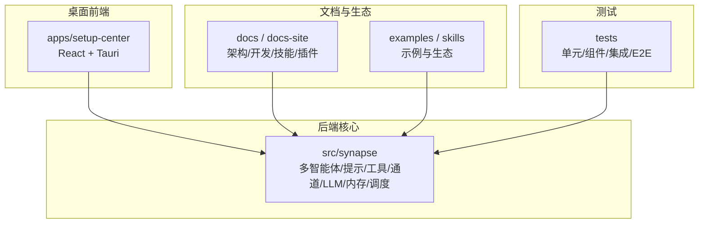
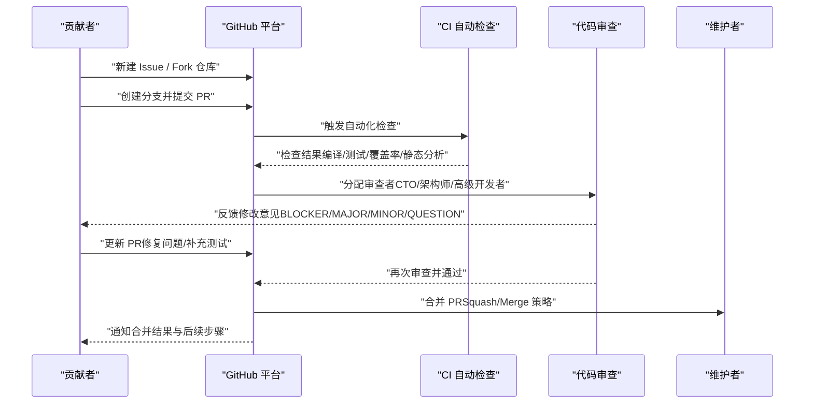
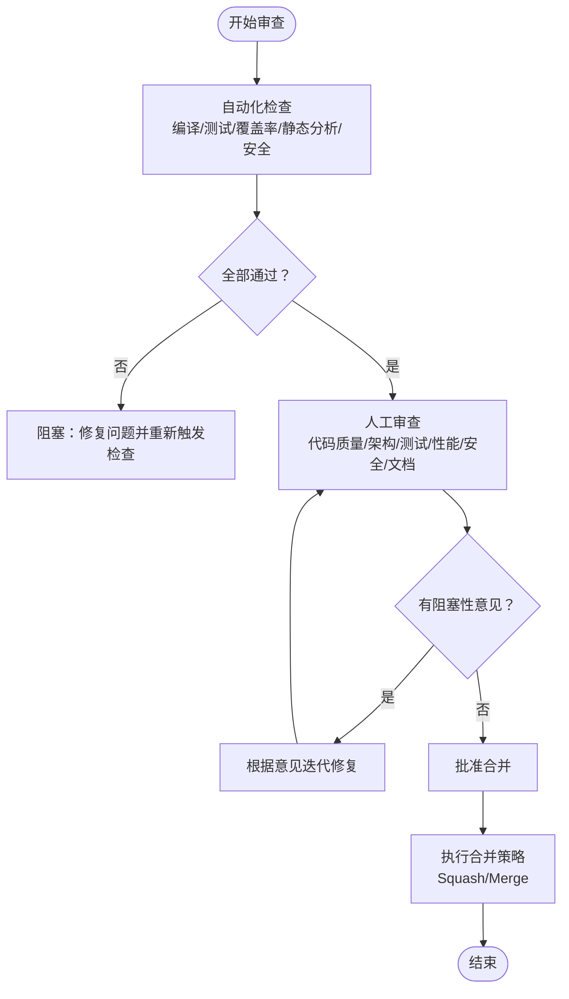
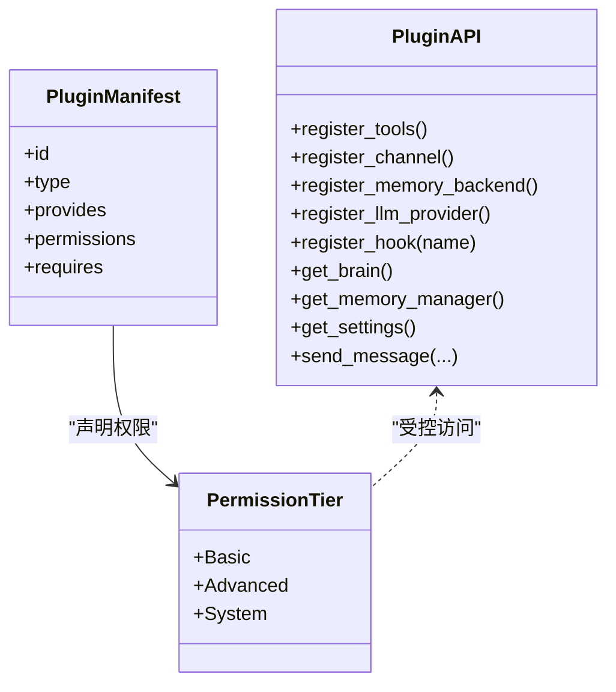
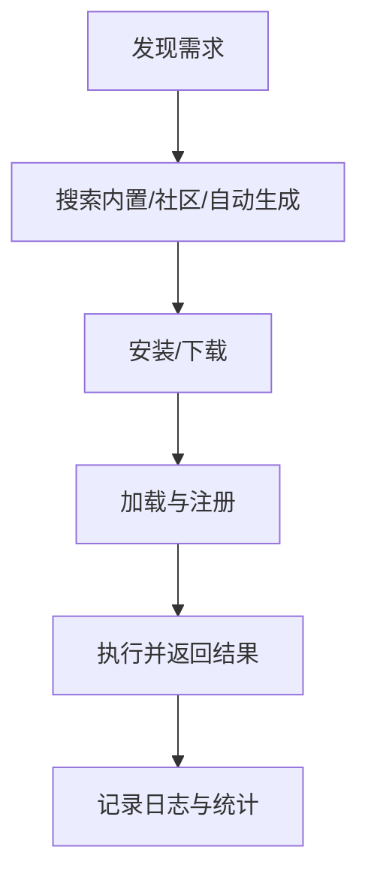
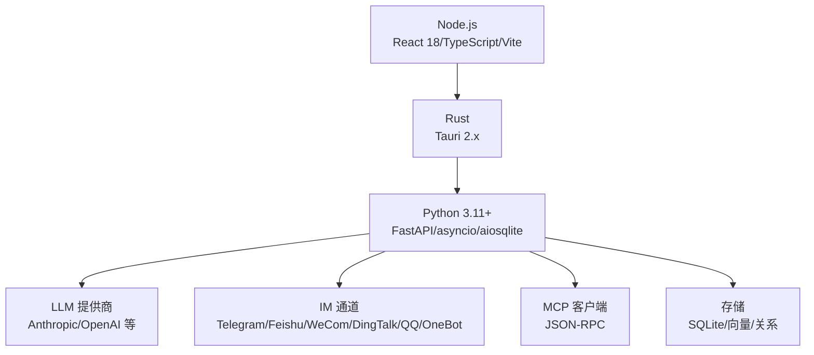

# 贡献指南

<cite>
**本文引用的文件**
- [README.md](file://README.md)
- [CODE_OF_CONDUCT.md](file://CODE_OF_CONDUCT.md)
- [docs/code-review-process.md](file://docs/code-review-process.md)
- [.github/PULL_REQUEST_TEMPLATE.md](file://.github/PULL_REQUEST_TEMPLATE.md)
- [docs/skills.md](file://docs/skills.md)
- [docs/plugin-system-overview.md](file://docs/plugin-system-overview.md)
- [AGENTS.md](file://AGENTS.md)
- [docs/development/dev-environment-setup.md](file://docs/development/dev-environment-setup.md)
- [docs/getting-started.md](file://docs/getting-started.md)
- [CHANGELOG.md](file://CHANGELOG.md)
- [apps/setup-center/AGENTS.md](file://apps/setup-center/AGENTS.md)
- [skills/agent-browser/CONTRIBUTING.md](file://skills/agent-browser/CONTRIBUTING.md)
</cite>

## 目录
1. [简介](#简介)
2. [项目结构](#项目结构)
3. [核心组件](#核心组件)
4. [架构总览](#架构总览)
5. [详细组件分析](#详细组件分析)
6. [依赖分析](#依赖分析)
7. [性能考虑](#性能考虑)
8. [故障排查指南](#故障排查指南)
9. [结论](#结论)
10. [附录](#附录)

## 简介
本指南面向所有希望参与 Synapse 社区建设的贡献者，涵盖从 Issue 提交、Pull Request（PR）创建与审查流程，到插件与技能开发规范、文档贡献要求、社区行为准则、沟通渠道与技术支持方式，以及新贡献者的入门路径与常见贡献场景操作步骤。目标是帮助你以最小成本高效参与项目，获得应有的认可与成长。

## 项目结构
- 后端核心位于 src/synapse，包含多智能体、提示工程、工具系统、通道适配、LLM 客户端、内存与调度等模块。
- 前端桌面应用位于 apps/setup-center，基于 Tauri + React + TypeScript，提供图形化配置中心与 IM 通道管理。
- 文档位于 docs 与 docs-site，涵盖架构、开发环境、技能与插件系统、测试框架等。
- 示例与生态位于 examples 与 skills，展示插件与技能的实现范式。
- 测试位于 tests，覆盖单元、组件、集成与端到端测试。

**图表来源**
- [AGENTS.md:66-86](file://AGENTS.md#L66-L86)
- [apps/setup-center/AGENTS.md:23-37](file://apps/setup-center/AGENTS.md#L23-L37)

**章节来源**
- [AGENTS.md:66-86](file://AGENTS.md#L66-L86)
- [apps/setup-center/AGENTS.md:23-37](file://apps/setup-center/AGENTS.md#L23-L37)

## 核心组件
- 多智能体与组织编排：负责任务分解、代理委派、失败转移与可视化跟踪。
- 提示工程与身份系统：将身份、角色、行为与记忆注入系统提示，形成可控的推理上下文。
- 工具系统与技能：工具提供底层能力，技能以声明式方式引导 LLM 行为；二者共同构成可扩展的能力边界。
- 插件系统：提供 8 类能力（工具、通道、RAG、记忆、LLM、Hook、Skill、MCP），支持三级权限与生命周期钩子。
- 桌面 GUI：提供 IM 通道配置、技能市场、MCP 管理、内存与调度等面板。
- 测试与质量保障：完善的测试分层与覆盖率要求，配合自动化检查清单与审查流程。

**章节来源**
- [AGENTS.md:88-96](file://AGENTS.md#L88-L96)
- [docs/plugin-system-overview.md:145-174](file://docs/plugin-system-overview.md#L145-L174)
- [docs/skills.md:194-205](file://docs/skills.md#L194-L205)

## 架构总览
以下序列图展示了贡献者从提出问题到合并变更的关键流程，涵盖 Issue、PR、审查与合并策略。

**图表来源**
- [.github/PULL_REQUEST_TEMPLATE.md:18-36](file://.github/PULL_REQUEST_TEMPLATE.md#L18-L36)
- [docs/code-review-process.md:3-17](file://docs/code-review-process.md#L3-L17)
- [docs/code-review-process.md:113-121](file://docs/code-review-process.md#L113-L121)

## 详细组件分析

### Issue 提交流程
- 明确问题类型：Bug 报告、功能请求、性能问题、安全问题等。
- 提供充分信息：环境信息、复现步骤、期望与实际结果、日志片段、截图或录屏。
- 关联已有 Issue/PR：避免重复，便于追踪。
- 使用社区沟通渠道：Discord、WeChat 群、GitHub Discussions 获取初步支持后再提交正式 Issue。

**章节来源**
- [README.md:643-681](file://README.md#L643-L681)

### Pull Request 创建与模板
- 使用统一的 PR 模板，填写变更描述、类型标记、关联 Issue、测试清单、自检清单与附加说明。
- 保证本地测试通过：单元/组件/集成/E2E 测试，覆盖率达标。
- 遵循代码风格与静态检查：Ruff、mypy、格式化工具。
- 保持提交原子性：聚焦单一逻辑变更，便于审查与回滚。

**章节来源**
- [.github/PULL_REQUEST_TEMPLATE.md:1-60](file://.github/PULL_REQUEST_TEMPLATE.md#L1-L60)
- [AGENTS.md:53-64](file://AGENTS.md#L53-L64)

### 代码审查流程与清单
- 审查角色与时效：CTO/架构师负责核心/架构变更，高级开发者参与常规模块审查；普通 PR 24 小时、紧急修复 4 小时、重大重构 48 小时。
- 自动化检查：编译、单元测试、覆盖率、静态分析、安全漏洞扫描必须全部通过。
- 人工审查清单：代码质量、架构规范、测试覆盖、性能与安全、文档与注释。
- 意见分类与格式：BLOCKER（必须修复）、MAJOR（强烈建议）、MINOR（可选优化）、QUESTION（讨论澄清）。
- 合并策略：分支保护、审查人数、合并方式（feature→develop Squash；develop→main Merge），合并后自动删除源分支。

**图表来源**
- [docs/code-review-process.md:19-68](file://docs/code-review-process.md#L19-L68)
- [docs/code-review-process.md:113-121](file://docs/code-review-process.md#L113-L121)

**章节来源**
- [docs/code-review-process.md:3-17](file://docs/code-review-process.md#L3-L17)
- [docs/code-review-process.md:19-68](file://docs/code-review-process.md#L19-L68)
- [docs/code-review-process.md:113-121](file://docs/code-review-process.md#L113-L121)

### 插件开发规范
- 选型指南：Skill（仅文本引导）、MCP（强隔离外部工具）、Plugin（全能力扩展，含三级权限与生命周期钩子）。
- 能力矩阵：工具、通道、记忆、LLM、RAG、API 路由、Prompt 注入、Hook、替换内置模块、系统服务访问、代发消息等。
- 权限模型：Basic（安装即有）、Advanced（安装时确认）、System（内置或手动确认）。
- 生命周期：on_load → on_init → 运行 → on_shutdown，支持 enable/disable/install/uninstall。
- Manifest 校验：类型严格、入口路径限制、ID 正则、额外字段允许。
- 配置规范：config_schema.json 声明参数，前端自动渲染表单；支持图标规范与多语言标题/描述。
- Onboard 协议：QR/OAuth/凭据表单，前端自动渲染对应 UI。
- 版本兼容：System Version、Plugin API Version、SDK Version 三层版本管理。

**图表来源**
- [docs/plugin-system-overview.md:71-142](file://docs/plugin-system-overview.md#L71-L142)
- [docs/plugin-system-overview.md:225-354](file://docs/plugin-system-overview.md#L225-L354)

**章节来源**
- [docs/plugin-system-overview.md:178-210](file://docs/plugin-system-overview.md#L178-L210)
- [docs/plugin-system-overview.md:357-391](file://docs/plugin-system-overview.md#L357-L391)

### 技能编写标准
- 结构与元数据：SKILL.md 为主文件，支持 name/description/version/tags/examples/dependencies 等。
- 生命周期：发现 → 安装 → 加载 → 执行；依赖安装与结果返回。
- 最佳实践：专注单一任务、完善错误处理、类型提示、测试用例、示例与文档；避免硬编码密钥。
- 发布规范：GitHub 仓库、synapse-skill 标签、版本发布、README 使用说明。
- 配置：支持独立配置文件与环境变量注入。

**图表来源**
- [docs/skills.md:194-205](file://docs/skills.md#L194-L205)

**章节来源**
- [docs/skills.md:110-172](file://docs/skills.md#L110-L172)
- [docs/skills.md:207-223](file://docs/skills.md#L207-L223)
- [docs/skills.md:245-266](file://docs/skills.md#L245-L266)
- [skills/agent-browser/CONTRIBUTING.md:31-61](file://skills/agent-browser/CONTRIBUTING.md#L31-L61)

### 文档贡献要求
- 文档类型：架构、开发、使用、API、最佳实践等。
- 质量标准：准确、完整、易读、可操作；与代码保持同步更新。
- 更新流程：遵循 PR 流程，提供测试或演示验证，必要时更新示例与截图。
- 版本与发布：CHANGELOG 记录重大变更，README 与站点文档同步更新。

**章节来源**
- [CHANGELOG.md:1-308](file://CHANGELOG.md#L1-L308)
- [README.md:624-641](file://README.md#L624-L641)

### 社区行为准则
- 承诺：营造开放、包容、健康的社区氛围。
- 标准：包容性语言、尊重差异、接受建设性反馈、以社区利益为先、同理心。
- 不当行为：骚扰、侮辱、人身攻击、隐私泄露、其他不当行为。
- 负责人：社区领导者负责澄清与执行标准，并公正处理违规行为。
- 适用范围：社区空间与公开代表社区的场合。
- 举报渠道：社区领导者邮箱 zacon365@gmail.com。

**章节来源**
- [CODE_OF_CONDUCT.md:1-75](file://CODE_OF_CONDUCT.md#L1-L75)

### 沟通渠道与技术支持
- 官方网站与下载：synapse.ai
- 社区：Discord、WeChat 公众号/个人/群、QQ 群
- 讨论与反馈：GitHub Discussions、Issues
- 邮件：zacon365@gmail.com
- 技术支持：README 与文档中的故障排查章节，结合 Issue 模板提供必要信息

**章节来源**
- [README.md:643-681](file://README.md#L643-L681)

### 新贡献者入门指导
- 环境准备：Python 3.11+、Node.js（前端）、Rust（Tauri 桌面壳）、Git。
- 后端开发：创建虚拟环境、安装可编辑依赖、初始化 Synapse、启动后端服务。
- 前端开发：进入 apps/setup-center，安装依赖，启动 Vite/Tauri 开发模式。
- 联调说明：后端 synapse serve，前端 tauri dev，确保 API 地址一致。
- 常见问题：端口占用、首次构建耗时、Python 环境未激活、前后端连通性。

**章节来源**
- [docs/development/dev-environment-setup.md:1-148](file://docs/development/dev-environment-setup.md#L1-L148)
- [docs/getting-started.md:1-184](file://docs/getting-started.md#L1-L184)

### 常见贡献场景操作步骤
- 提交 Bug 报告：在 Issues 中填写模板，附上环境、复现步骤、日志与截图。
- 提交功能建议：在 Discussions 中发起讨论，收集反馈后再提交 Issue。
- 修改文档：在 docs/docs-site 中更新，本地预览后提交 PR。
- 新增技能：在 skills/ 目录下创建 SKILL.md，编写示例与测试，发布到 GitHub。
- 开发插件：按插件系统规范编写 plugin.json、权限与钩子，提供 config_schema.json 与图标。
- 修复与优化：遵循审查流程，补充测试与文档，关注性能与安全。

**章节来源**
- [.github/PULL_REQUEST_TEMPLATE.md:1-60](file://.github/PULL_REQUEST_TEMPLATE.md#L1-L60)
- [docs/code-review-process.md:19-68](file://docs/code-review-process.md#L19-L68)
- [docs/skills.md:110-172](file://docs/skills.md#L110-L172)
- [docs/plugin-system-overview.md:225-354](file://docs/plugin-system-overview.md#L225-L354)

### 贡献认可机制
- 代码贡献：PR 被合并即计入贡献；重大贡献可邀请加入维护团队。
- 文档贡献：及时更新 CHANGELOG 与 README，突出亮点特性。
- 社区贡献：积极回答问题、维护讨论区、分享使用经验与最佳实践。
- 里程碑与版本：CHANGELOG 记录贡献者与变更摘要，版本发布致谢。

**章节来源**
- [CHANGELOG.md:1-308](file://CHANGELOG.md#L1-L308)
- [README.md:685-701](file://README.md#L685-L701)

## 依赖分析
- 后端依赖：FastAPI、asyncio、aiosqlite、Ruff（lint/format）、mypy（类型检查）、pytest（测试）。
- 前端依赖：React 18、TypeScript、Vite 6、Tauri 2.x、i18n、Markdown 渲染。
- 生态依赖：30+ LLM 提供商、IM 通道（Telegram/Feishu/WeCom/DingTalk/QQ/OneBot）、MCP、SQLite/向量存储等。

**图表来源**
- [AGENTS.md:5-12](file://AGENTS.md#L5-L12)
- [apps/setup-center/AGENTS.md:5-12](file://apps/setup-center/AGENTS.md#L5-L12)

**章节来源**
- [AGENTS.md:5-12](file://AGENTS.md#L5-L12)
- [apps/setup-center/AGENTS.md:5-12](file://apps/setup-center/AGENTS.md#L5-L12)

## 性能考虑
- 代码质量：控制函数长度、单一职责、避免重复、合理错误处理与日志。
- 架构规范：MVVM + Clean Architecture 分层、依赖注入、数据流清晰。
- 性能与安全：避免主线程 IO、协程作用域使用得当、敏感数据加密、网络请求超时、图片缓存与列表分页。
- 测试覆盖：新增代码有单元测试，边界与异常场景覆盖，测试命名清晰。

**章节来源**
- [docs/code-review-process.md:32-62](file://docs/code-review-process.md#L32-L62)

## 故障排查指南
- 环境问题：Python 版本不符、虚拟环境未激活、端口占用。
- 网络问题：代理配置、CDN/镜像切换、超时设置。
- 依赖问题：安装顺序、可选特性、开发依赖、文档构建。
- 前后端联调：后端服务启动、前端端口与 API 地址一致性、首次构建耗时。

**章节来源**
- [docs/development/dev-environment-setup.md:140-148](file://docs/development/dev-environment-setup.md#L140-L148)
- [docs/getting-started.md:158-184](file://docs/getting-started.md#L158-L184)

## 结论
通过本指南，你可以系统地理解 Synapse 的贡献流程、开发规范与协作方式。建议从环境搭建与文档贡献入手，逐步深入插件与技能开发，持续关注审查反馈与质量指标，最终成为社区的核心贡献者之一。

## 附录
- 开发环境部署手册：后端与前端联调要点、图标生成、部署引导。
- Getting Started：安装、配置、首次运行与常用命令。
- 插件系统概览：Skill/MCP/Plugin 的定位、能力边界与选型指南。
- 技能系统：结构、生命周期、最佳实践与发布规范。
- 代码审查流程：角色分工、时效要求、自动化与人工检查清单、合并策略。

**章节来源**
- [docs/development/dev-environment-setup.md:1-148](file://docs/development/dev-environment-setup.md#L1-L148)
- [docs/getting-started.md:1-184](file://docs/getting-started.md#L1-L184)
- [docs/plugin-system-overview.md:1-431](file://docs/plugin-system-overview.md#L1-L431)
- [docs/skills.md:1-289](file://docs/skills.md#L1-L289)
- [docs/code-review-process.md:1-149](file://docs/code-review-process.md#L1-L149)