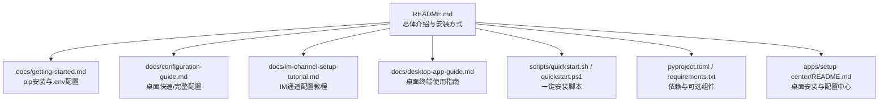
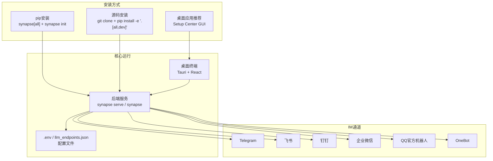
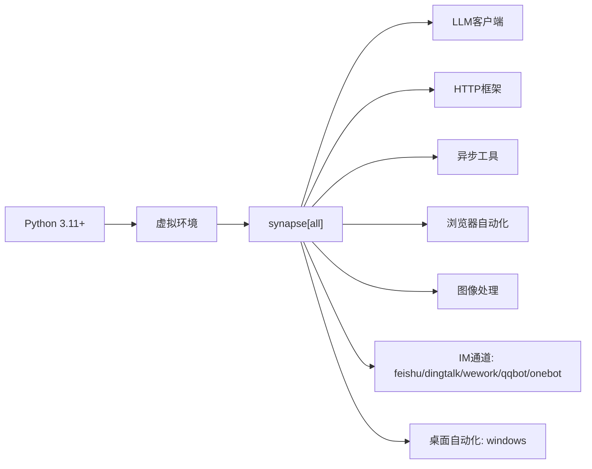

# 快速开始

<cite>
**本文引用的文件**
- [README.md](file://README.md)
- [docs/getting-started.md](file://docs/getting-started.md)
- [docs/im-channel-setup-tutorial.md](file://docs/im-channel-setup-tutorial.md)
- [docs/configuration-guide.md](file://docs/configuration-guide.md)
- [docs/desktop-app-guide.md](file://docs/desktop-app-guide.md)
- [scripts/quickstart.sh](file://scripts/quickstart.sh)
- [scripts/quickstart.ps1](file://scripts/quickstart.ps1)
- [pyproject.toml](file://pyproject.toml)
- [requirements.txt](file://requirements.txt)
- [apps/setup-center/README.md](file://apps/setup-center/README.md)
</cite>

## 目录
1. [简介](#简介)
2. [项目结构](#项目结构)
3. [核心组件](#核心组件)
4. [架构总览](#架构总览)
5. [详细组件分析](#详细组件分析)
6. [依赖关系分析](#依赖关系分析)
7. [性能考虑](#性能考虑)
8. [故障排除指南](#故障排除指南)
9. [结论](#结论)
10. [附录](#附录)

## 简介
本指南面向首次使用者，提供三种“5分钟上手”安装与使用方式：
- 桌面应用（推荐）：零命令行，图形化向导，一键完成环境、端点、IM通道配置与启动。
- pip安装：通过包管理器安装，交互式初始化，适合开发者与进阶用户。
- 源码安装：从仓库克隆，本地开发模式，适合需要定制或贡献的用户。

同时覆盖API密钥配置、首次任务执行、IM通道绑定等核心操作，并提供跨平台（Windows/macOS/Linux）具体步骤与常见问题解决方案。

## 项目结构
围绕“快速开始”，以下文件最为关键：
- README.md：总体介绍、三种安装方式、命令示例与平台特性
- docs/getting-started.md：pip安装与环境准备、.env配置、首次运行与常见问题
- docs/im-channel-setup-tutorial.md：IM通道配置教程（Telegram/飞书/钉钉/企业微信/QQ/OneBot）
- docs/configuration-guide.md：桌面应用“快速配置/完整配置”流程与默认值
- docs/desktop-app-guide.md：桌面终端功能与使用说明
- scripts/quickstart.sh / quickstart.ps1：一键安装脚本（Linux/macOS/Windows）
- pyproject.toml / requirements.txt：依赖清单与可选组件
- apps/setup-center/README.md：桌面安装与配置中心说明

图表来源
- [README.md:64-227](file://README.md#L64-L227)
- [docs/getting-started.md:13-70](file://docs/getting-started.md#L13-L70)
- [docs/configuration-guide.md:1-25](file://docs/configuration-guide.md#L1-L25)
- [docs/im-channel-setup-tutorial.md:77-160](file://docs/im-channel-setup-tutorial.md#L77-L160)
- [docs/desktop-app-guide.md:1-20](file://docs/desktop-app-guide.md#L1-L20)
- [scripts/quickstart.sh:1-50](file://scripts/quickstart.sh#L1-L50)
- [pyproject.toml:1-282](file://pyproject.toml#L1-L282)
- [apps/setup-center/README.md:1-29](file://apps/setup-center/README.md#L1-L29)

章节来源
- [README.md:64-227](file://README.md#L64-L227)

## 核心组件
- 桌面安装与配置中心：提供图形化向导，自动安装Python、创建虚拟环境、写入默认配置、一键启动服务。
- CLI安装与初始化：pip安装后运行交互式初始化，生成.env与端点配置，支持一次性安装所有可选组件。
- 源码安装：克隆仓库、创建虚拟环境、以可编辑模式安装，适合开发调试。
- IM通道：支持Telegram、飞书、钉钉、企业微信、QQ官方机器人、OneBot，提供图形化配置与健康状态监控。
- LLM端点：支持多服务商、多模型、多能力标签，具备自动故障转移与健康检测。

章节来源
- [docs/configuration-guide.md:48-168](file://docs/configuration-guide.md#L48-L168)
- [docs/getting-started.md:13-70](file://docs/getting-started.md#L13-L70)
- [docs/im-channel-setup-tutorial.md:77-160](file://docs/im-channel-setup-tutorial.md#L77-L160)
- [pyproject.toml:75-141](file://pyproject.toml#L75-L141)

## 架构总览
下图展示了三种安装方式与桌面应用的关系，以及关键配置与运行流程。

图表来源
- [README.md:175-227](file://README.md#L175-L227)
- [docs/configuration-guide.md:48-168](file://docs/configuration-guide.md#L48-L168)
- [docs/desktop-app-guide.md:20-53](file://docs/desktop-app-guide.md#L20-L53)
- [docs/im-channel-setup-tutorial.md:21-31](file://docs/im-channel-setup-tutorial.md#L21-L31)

## 详细组件分析

### 方式一：桌面应用（推荐）
- 适用人群：新手、零命令行需求
- 核心优势：图形化向导、自动环境与依赖安装、一键启动、IM通道可视化配置
- 关键步骤
  1) 下载桌面安装包（Windows/macOS/Linux），双击安装
  2) 启动应用，进入“快速配置/完整配置”向导
  3) 填写至少一个LLM端点（API Key/Base URL/模型）
  4) 可选配置IM通道（Telegram/飞书/钉钉/企业微信/QQ/OneBot）
  5) 完成后启动服务，进入聊天与状态面板
- 注意事项
  - 首次启动自动进入配置向导
  - 若网络受限，可选择镜像源或代理
  - IM通道状态可在“系统状态”中查看与重启

章节来源
- [README.md:175-198](file://README.md#L175-L198)
- [docs/configuration-guide.md:48-168](file://docs/configuration-guide.md#L48-L168)
- [docs/desktop-app-guide.md:47-53](file://docs/desktop-app-guide.md#L47-L53)

### 方式二：pip安装
- 适用人群：开发者、需要命令行控制
- 关键步骤
  1) 创建并激活虚拟环境
  2) 安装synapse（推荐安装所有可选组件）
  3) 运行交互式初始化，生成.env与端点配置
  4) 启动后端服务或交互式CLI
- 常用命令
  - 安装：pip install synapse[all]
  - 初始化：synapse init
  - 启动服务：synapse serve
  - 交互式CLI：synapse
- 注意事项
  - Python版本需满足要求
  - 首次运行需配置API Key与端点
  - 可选组件按需安装（IM通道、桌面自动化）

章节来源
- [README.md:200-217](file://README.md#L200-L217)
- [docs/getting-started.md:13-70](file://docs/getting-started.md#L13-L70)
- [pyproject.toml:75-141](file://pyproject.toml#L75-L141)

### 方式三：源码安装
- 适用人群：开发者、需要本地调试或贡献
- 关键步骤
  1) 克隆仓库
  2) 创建并激活虚拟环境
  3) 以可编辑模式安装（含开发依赖）
  4) 运行初始化与服务
- 注意事项
  - 本地开发模式便于热更新与调试
  - 需要安装额外的开发工具链

章节来源
- [README.md:208-217](file://README.md#L208-L217)
- [docs/getting-started.md:61-70](file://docs/getting-started.md#L61-L70)

### API密钥配置
- 位置：工作区根目录的.env文件
- 常见键：LLM提供商API Key、Base URL、模型名称
- 快速方法：桌面“快速配置”自动写入推荐默认值；CLI初始化时交互填写
- 故障排查：确认键名与值存在，网络可达，必要时配置代理

章节来源
- [docs/getting-started.md:72-101](file://docs/getting-started.md#L72-L101)
- [docs/configuration-guide.md:594-682](file://docs/configuration-guide.md#L594-L682)

### 首次任务执行
- 桌面：在聊天面板输入任务，查看Plan模式与工具调用展示
- CLI：synapse run "你的任务"
- 建议：先尝试简单任务（如“计算1到100的质数”），再挑战复杂任务

章节来源
- [docs/getting-started.md:102-140](file://docs/getting-started.md#L102-L140)
- [docs/desktop-app-guide.md:56-146](file://docs/desktop-app-guide.md#L56-L146)

### IM通道绑定
- 支持平台：Telegram、飞书、钉钉、企业微信、QQ官方机器人、OneBot
- 三种配置方式：桌面GUI、CLI向导、手动编辑.env
- 常见问题：代理设置、权限与回调地址、公网IP需求
- 健康检查：桌面“系统状态”查看通道在线/离线/未配置

章节来源
- [docs/im-channel-setup-tutorial.md:77-160](file://docs/im-channel-setup-tutorial.md#L77-L160)
- [docs/desktop-app-guide.md:148-178](file://docs/desktop-app-guide.md#L148-L178)

## 依赖关系分析
- 核心依赖：LLM客户端、HTTP框架、异步工具、数据验证、浏览器自动化、图像处理
- 可选依赖：各IM通道SDK、桌面自动化工具、开发工具
- 一键安装脚本：自动检测Python版本、创建虚拟环境、安装synapse与可选组件、可选安装Playwright浏览器

图表来源
- [pyproject.toml:21-73](file://pyproject.toml#L21-L73)
- [pyproject.toml:75-141](file://pyproject.toml#L75-L141)
- [scripts/quickstart.sh:90-155](file://scripts/quickstart.sh#L90-L155)
- [scripts/quickstart.ps1:39-109](file://scripts/quickstart.ps1#L39-L109)

章节来源
- [pyproject.toml:1-282](file://pyproject.toml#L1-L282)
- [requirements.txt:1-105](file://requirements.txt#L1-L105)
- [scripts/quickstart.sh:90-155](file://scripts/quickstart.sh#L90-L155)
- [scripts/quickstart.ps1:39-109](file://scripts/quickstart.ps1#L39-L109)

## 性能考虑
- 端点健康检测与自动故障转移，降低单点风险
- 多端点优先级调度，提升稳定性
- 桌面自动化与浏览器自动化按需启用，避免不必要的资源消耗
- 日志级别与保留策略可调，平衡可观测性与磁盘占用

章节来源
- [docs/configuration-guide.md:319-329](file://docs/configuration-guide.md#L319-L329)
- [docs/desktop-app-guide.md:226-262](file://docs/desktop-app-guide.md#L226-L262)

## 故障排除指南
- “找不到API Key”
  - 确认.env文件存在且包含相应键值
- “连接超时”
  - 检查网络与代理设置，必要时配置Base URL或代理
- “Python版本错误”
  - 确认Python版本≥3.11
- “IM通道无法连接”
  - 检查代理、权限、回调地址（企业微信需公网IP）
  - 在桌面“系统状态”查看通道健康状态
- “一键安装脚本失败”
  - 确认Python已安装且版本满足要求
  - 使用镜像源参数加速安装

章节来源
- [docs/getting-started.md:158-184](file://docs/getting-started.md#L158-L184)
- [docs/im-channel-setup-tutorial.md:699-752](file://docs/im-channel-setup-tutorial.md#L699-L752)
- [scripts/quickstart.sh:90-109](file://scripts/quickstart.sh#L90-L109)
- [scripts/quickstart.ps1:59-64](file://scripts/quickstart.ps1#L59-L64)

## 结论
通过三种安装方式与配套文档，新用户可在5分钟内完成从安装到开始使用的完整流程。桌面应用适合零命令行用户，pip安装适合开发者，源码安装适合需要定制或贡献的用户。结合LLM端点与IM通道配置，即可快速体验Synapse的多Agent协作与多平台接入能力。

## 附录

### 跨平台安装与使用要点
- Windows
  - 桌面应用：下载.exe安装包，双击安装
  - pip安装：PowerShell运行一键脚本或手动安装
  - 桌面自动化：可选安装windows组件
- macOS
  - 桌面应用：下载.dmg安装包，拖拽安装
  - pip安装：bash运行一键脚本或手动安装
- Linux
  - 桌面应用：下载.deb安装包，按发行版说明安装
  - pip安装：bash运行一键脚本或手动安装

章节来源
- [README.md:231-240](file://README.md#L231-L240)
- [docs/desktop-app-guide.md:20-44](file://docs/desktop-app-guide.md#L20-L44)
- [scripts/quickstart.sh:1-50](file://scripts/quickstart.sh#L1-L50)
- [scripts/quickstart.ps1:1-30](file://scripts/quickstart.ps1#L1-L30)