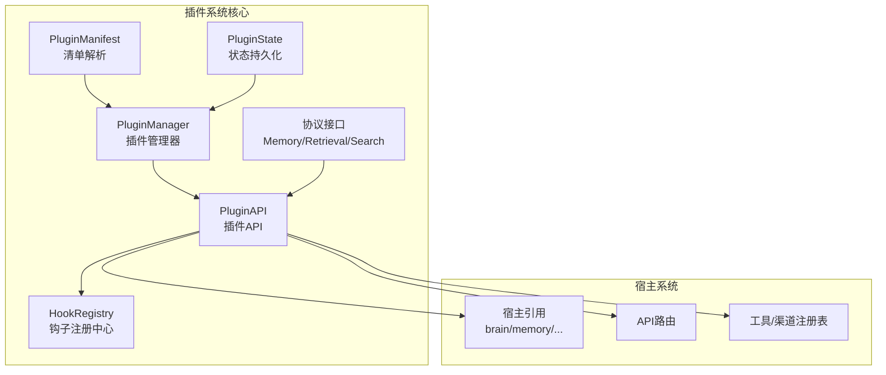
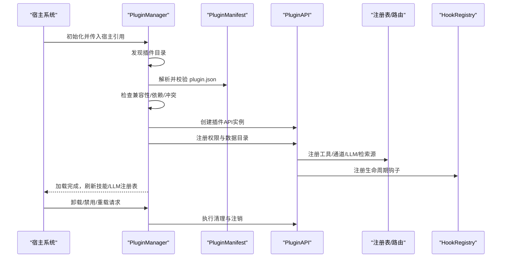
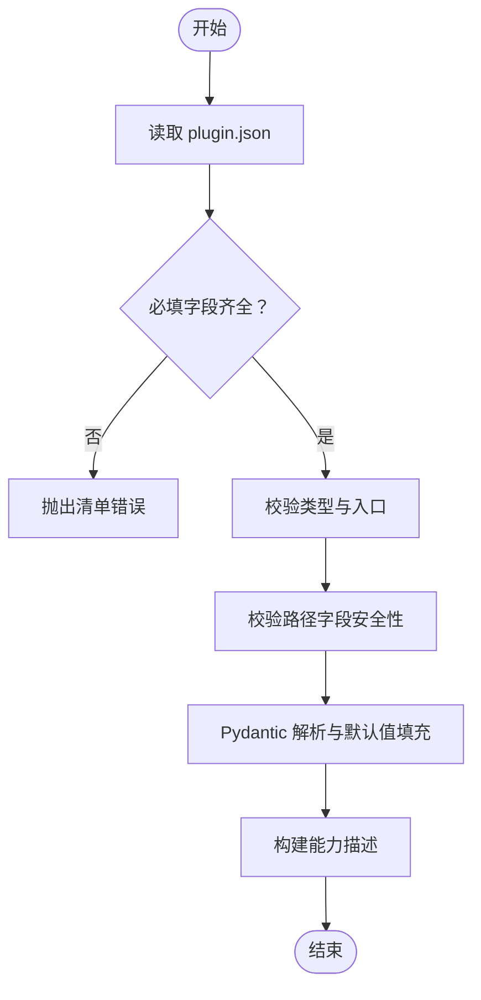
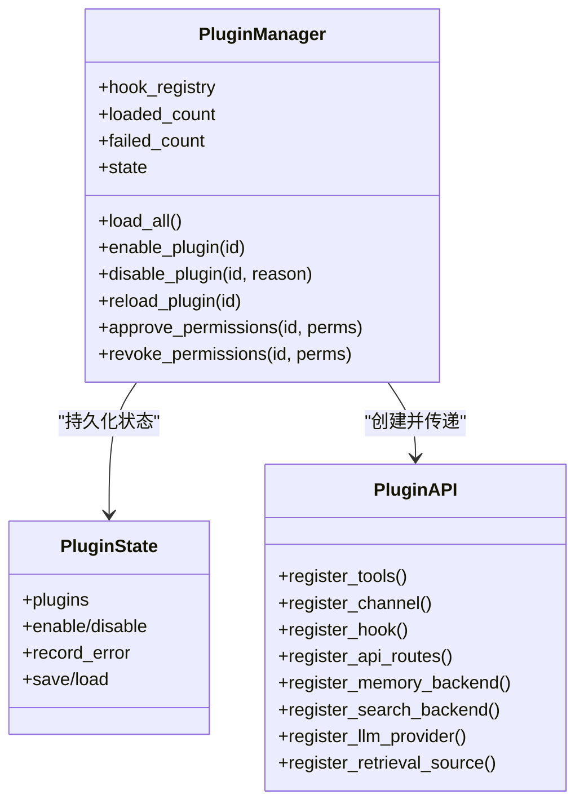
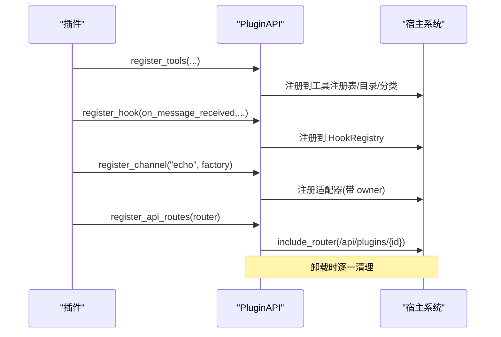
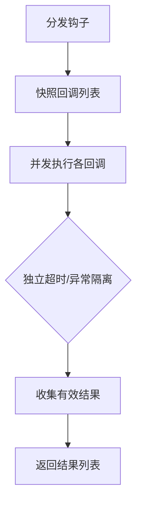
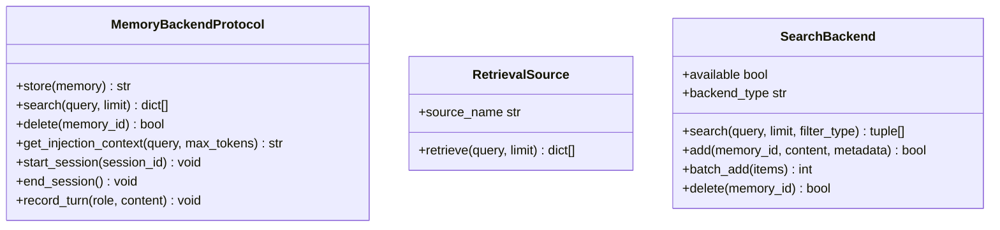
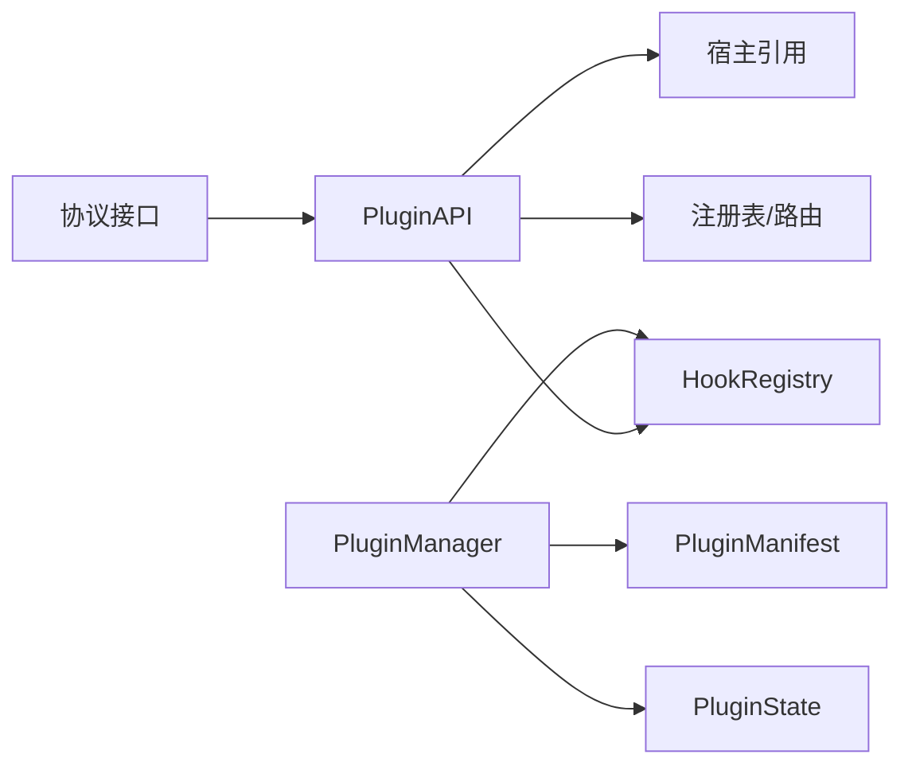

# 插件开发指南

<cite>
**本文档引用的文件**
- [src/synapse/plugins/__init__.py](file://src/synapse/plugins/__init__.py)
- [src/synapse/plugins/manifest.py](file://src/synapse/plugins/manifest.py)
- [src/synapse/plugins/manager.py](file://src/synapse/plugins/manager.py)
- [src/synapse/plugins/api.py](file://src/synapse/plugins/api.py)
- [src/synapse/plugins/hooks.py](file://src/synapse/plugins/hooks.py)
- [src/synapse/plugins/state.py](file://src/synapse/plugins/state.py)
- [src/synapse/plugins/protocols.py](file://src/synapse/plugins/protocols.py)
- [synapse-plugin-sdk/README.md](file://synapse-plugin-sdk/README.md)
- [synapse-plugin-sdk/pyproject.toml](file://synapse-plugin-sdk/pyproject.toml)
- [examples/plugins/hello-tool/plugin.json](file://examples/plugins/hello-tool/plugin.json)
- [examples/plugins/echo-channel/plugin.json](file://examples/plugins/echo-channel/plugin.json)
- [examples/plugins/message-logger/plugin.json](file://examples/plugins/message-logger/plugin.json)
- [examples/plugins/translate-skill/SKILL.md](file://examples/plugins/translate-skill/SKILL.md)
- [examples/plugins/ollama-provider/plugin.json](file://examples/plugins/ollama-provider/plugin.json)
</cite>

## 目录
1. [简介](#简介)
2. [项目结构](#项目结构)
3. [核心组件](#核心组件)
4. [架构总览](#架构总览)
5. [详细组件分析](#详细组件分析)
6. [依赖关系分析](#依赖关系分析)
7. [性能考虑](#性能考虑)
8. [故障排查指南](#故障排查指南)
9. [结论](#结论)
10. [附录](#附录)

## 简介
本指南面向希望在 Synapse 平台上开发插件的开发者，提供从零开始的完整流程：项目结构设计、manifest 配置、代码实现与测试验证；详解插件 SDK 的使用方法、API 接口调用与最佳实践；给出多种类型插件的实际案例（工具、通道、钩子、技能、LLM 提供商等）；并覆盖插件打包、分发与版本管理、调试技巧、性能优化与常见问题解决方案。

## 项目结构
Synapse 插件系统由以下关键模块组成：
- 插件清单解析与校验：负责读取 plugin.json，进行字段校验、权限检查与默认值处理
- 插件管理器：负责发现、加载、卸载、权限审批、错误追踪与状态持久化
- 插件 API：向插件暴露受控能力，按权限隔离访问主机系统
- 钩子注册中心：统一调度 15 类生命周期钩子，支持超时与异常隔离
- 协议接口：内存后端、检索源、搜索后端等抽象协议
- 插件状态：持久化记录启用/禁用、权限授予、错误统计等
- SDK：提供脚手架、装饰器、测试辅助等开发工具

**图表来源**
- [src/synapse/plugins/manager.py:44-781](file://src/synapse/plugins/manager.py#L44-L781)
- [src/synapse/plugins/api.py:60-697](file://src/synapse/plugins/api.py#L60-L697)
- [src/synapse/plugins/hooks.py:53-225](file://src/synapse/plugins/hooks.py#L53-L225)
- [src/synapse/plugins/manifest.py:70-378](file://src/synapse/plugins/manifest.py#L70-L378)
- [src/synapse/plugins/state.py:29-136](file://src/synapse/plugins/state.py#L29-L136)
- [src/synapse/plugins/protocols.py:8-49](file://src/synapse/plugins/protocols.py#L8-L49)

**章节来源**
- [src/synapse/plugins/__init__.py:1-36](file://src/synapse/plugins/__init__.py#L1-L36)

## 核心组件
- 插件清单与权限模型
  - 清单字段严格校验，支持 type、entry、permissions、requires、provides、hooks 等
  - 权限分为基础、高级与系统三级，首次加载仅授予基础权限，其他需用户审批
- 插件管理器
  - 发现与拓扑排序加载，支持循环依赖检测与失败隔离
  - 超时控制、错误累积自动禁用、权限动态审批与撤销
- 插件 API
  - 按权限隔离访问宿主能力，提供日志、配置、工具、钩子、通道、记忆体、搜索、LLM、检索源等注册接口
  - 内置文件日志与清理机制，确保卸载时资源回收
- 钩子系统
  - 15 类生命周期钩子，回调独立超时与异常隔离，支持同步与异步执行
- 协议接口
  - MemoryBackendProtocol、RetrievalSource、SearchBackend 三大协议，便于扩展存储与检索
- 状态持久化
  - 记录启用状态、权限授予、错误计数与时间戳，支持迁移与安全落盘

**章节来源**
- [src/synapse/plugins/manifest.py:70-378](file://src/synapse/plugins/manifest.py#L70-L378)
- [src/synapse/plugins/manager.py:44-781](file://src/synapse/plugins/manager.py#L44-L781)
- [src/synapse/plugins/api.py:60-697](file://src/synapse/plugins/api.py#L60-L697)
- [src/synapse/plugins/hooks.py:53-225](file://src/synapse/plugins/hooks.py#L53-L225)
- [src/synapse/plugins/protocols.py:8-49](file://src/synapse/plugins/protocols.py#L8-L49)
- [src/synapse/plugins/state.py:29-136](file://src/synapse/plugins/state.py#L29-L136)

## 架构总览
下图展示插件从发现到运行、再到卸载的全生命周期，以及与宿主系统的交互路径。

**图表来源**
- [src/synapse/plugins/manager.py:165-247](file://src/synapse/plugins/manager.py#L165-L247)
- [src/synapse/plugins/manifest.py:253-294](file://src/synapse/plugins/manifest.py#L253-L294)
- [src/synapse/plugins/api.py:195-250](file://src/synapse/plugins/api.py#L195-L250)
- [src/synapse/plugins/hooks.py:108-156](file://src/synapse/plugins/hooks.py#L108-L156)

## 详细组件分析

### 组件A：插件清单与权限模型
- 字段与校验
  - 必填字段：id、name、version、type
  - 支持类型：python、mcp、skill
  - 默认入口：根据类型推导
  - 路径安全：禁止绝对路径与路径穿越
- 权限分级
  - 基础权限：工具注册、基本钩子、读写配置、自有数据、日志
  - 高级权限：内存读写、通道注册/发送、消息钩子、检索/搜索注册、路由注册、脑区/向量访问、设置读取、LLM注册
  - 系统权限：全部钩子、替换内存、系统设置写入（保留）
- 能力描述
  - 将清单转换为能力描述，用于平台能力展示与权限策略

**图表来源**
- [src/synapse/plugins/manifest.py:253-294](file://src/synapse/plugins/manifest.py#L253-L294)

**章节来源**
- [src/synapse/plugins/manifest.py:70-378](file://src/synapse/plugins/manifest.py#L70-L378)

### 组件B：插件管理器（生命周期与权限）
- 发现与拓扑排序
  - 基于依赖列表进行拓扑排序，检测环依赖并排除
- 加载与超时
  - 单个插件加载超时控制，失败不影响其他插件
- 兼容性与冲突
  - 检查宿主版本、API 版本、Python 与 SDK 兼容性
  - 冲突检测与缺失依赖跳过
- 权限审批与撤销
  - 初次仅授予基础权限；用户可在前端审批高级/系统权限
- 自动禁用与恢复
  - 错误累积触发自动禁用，启用时尝试自动重载

**图表来源**
- [src/synapse/plugins/manager.py:44-781](file://src/synapse/plugins/manager.py#L44-L781)
- [src/synapse/plugins/state.py:29-136](file://src/synapse/plugins/state.py#L29-L136)
- [src/synapse/plugins/api.py:60-697](file://src/synapse/plugins/api.py#L60-L697)

**章节来源**
- [src/synapse/plugins/manager.py:165-742](file://src/synapse/plugins/manager.py#L165-L742)
- [src/synapse/plugins/state.py:29-136](file://src/synapse/plugins/state.py#L29-L136)

### 组件C：插件 API（能力边界与清理）
- 能力边界
  - 日志：独立文件日志，轮转保存
  - 配置：读写受限于 config.read/write
  - 工具：register_tools，支持 OpenAI/Anthropic 格式归一化
  - 钩子：按类别检查 hooks.basic/message/retrieve/all
  - 通道：register_channel，支持 owner 标记
  - API 路由：register_api_routes，自动前缀 /api/plugins/{id}
  - 记忆体：register_memory_backend（替换模式需 memory.replace）
  - 搜索：register_search_backend
  - LLM：register_llm_provider（双注册：api_type 与 vendor registry）
  - 检索源：register_retrieval_source
  - 宿主访问：按权限返回 brain/memory/vector/settings/gateway 等
- 清理机制
  - 卸载时注销工具、通道、MCP、内存后端、搜索后端、检索源，并移除 LLM 提供者映射

**图表来源**
- [src/synapse/plugins/api.py:195-424](file://src/synapse/plugins/api.py#L195-L424)
- [src/synapse/plugins/hooks.py:64-90](file://src/synapse/plugins/hooks.py#L64-L90)

**章节来源**
- [src/synapse/plugins/api.py:60-697](file://src/synapse/plugins/api.py#L60-L697)

### 组件D：钩子系统（隔离与超时）
- 钩子类型
  - 生命周期：on_init、on_shutdown、on_schedule、on_config_change、on_error
  - 消息：on_message_received、on_message_sending、on_session_start、on_session_end
  - 检索/工具：on_retrieve、on_tool_result、on_prompt_build、on_before_tool_use、on_after_tool_use、on_before_llm_call
- 执行模型
  - 异步并行执行，每个回调独立超时与异常隔离
  - 同步上下文通过线程池执行异步回调，避免阻塞
- 超时与统计
  - 默认超时可按插件清单 hook_timeout 覆盖
  - 统计各钩子注册数量

**图表来源**
- [src/synapse/plugins/hooks.py:108-214](file://src/synapse/plugins/hooks.py#L108-L214)

**章节来源**
- [src/synapse/plugins/hooks.py:53-225](file://src/synapse/plugins/hooks.py#L53-L225)

### 组件E：协议接口（可扩展性）
- MemoryBackendProtocol：存储、检索、删除、注入上下文、会话生命周期与回合记录
- RetrievalSource：外部知识源检索
- SearchBackend：搜索、添加、批量添加、删除、可用性与类型属性

**图表来源**
- [src/synapse/plugins/protocols.py:8-49](file://src/synapse/plugins/protocols.py#L8-L49)

**章节来源**
- [src/synapse/plugins/protocols.py:8-49](file://src/synapse/plugins/protocols.py#L8-L49)

## 依赖关系分析
- 插件管理器依赖清单解析、状态持久化、错误追踪与钩子注册中心
- 插件 API 依赖宿主引用（brain、memory、gateway、mcp_client、tool_registry、skill_loader 等），并通过权限控制访问
- 钩子系统与插件 API 独立，但通过注册中心耦合
- 协议接口为插件扩展提供抽象边界，不直接依赖具体实现

**图表来源**
- [src/synapse/plugins/manager.py:14-21](file://src/synapse/plugins/manager.py#L14-L21)
- [src/synapse/plugins/api.py:17-21](file://src/synapse/plugins/api.py#L17-L21)
- [src/synapse/plugins/hooks.py:11-13](file://src/synapse/plugins/hooks.py#L11-L13)
- [src/synapse/plugins/protocols.py:5-6](file://src/synapse/plugins/protocols.py#L5-L6)

**章节来源**
- [src/synapse/plugins/manager.py:14-21](file://src/synapse/plugins/manager.py#L14-L21)
- [src/synapse/plugins/api.py:17-21](file://src/synapse/plugins/api.py#L17-L21)
- [src/synapse/plugins/hooks.py:11-13](file://src/synapse/plugins/hooks.py#L11-L13)
- [src/synapse/plugins/protocols.py:5-6](file://src/synapse/plugins/protocols.py#L5-L6)

## 性能考虑
- 加载与卸载超时
  - 使用 load_timeout、hook_timeout、retrieve_timeout 控制关键阶段耗时
- 回调隔离
  - 钩子回调独立超时与异常隔离，避免单点故障影响整体
- 并发与同步
  - 异步钩子并行执行；同步上下文通过线程池执行异步回调，防止事件循环阻塞
- 资源回收
  - 卸载时清理工具、通道、MCP、内存后端、搜索后端与检索源，释放句柄与注册项
- I/O 与日志
  - 插件日志采用轮转文件，避免无限增长；配置读写采用原子写入

[本节为通用性能建议，无需特定文件分析]

## 故障排查指南
- 清单错误
  - 缺失必填字段、非法类型、路径穿越或绝对路径、权限未知
- 加载失败
  - 入口文件不存在、插件类未找到、类型不匹配、超时
- 运行期错误
  - 钩子超时、权限不足、宿主引用不可用
- 常见问题
  - 插件被自动禁用：查看错误计数与最近错误；启用后尝试自动重载
  - 权限未生效：确认已审批高级/系统权限；必要时撤销并重新审批
  - 钩子未触发：检查钩子名称是否正确、权限是否满足、超时是否过短
  - 工具/通道未注册：确认已授予对应权限且宿主注册表可用

**章节来源**
- [src/synapse/plugins/manifest.py:208-294](file://src/synapse/plugins/manifest.py#L208-L294)
- [src/synapse/plugins/manager.py:227-243](file://src/synapse/plugins/manager.py#L227-L243)
- [src/synapse/plugins/hooks.py:120-156](file://src/synapse/plugins/hooks.py#L120-L156)

## 结论
Synapse 插件系统以“权限隔离+生命周期管理+协议抽象”为核心，既保证了扩展能力，又确保了宿主稳定性。通过 SDK 可快速生成模板、使用装饰器简化注册、借助测试工具验证行为。遵循本文档的结构设计、清单规范、API 使用与最佳实践，即可高效开发高质量插件。

[本节为总结性内容，无需特定文件分析]

## 附录

### A. 从零开始开发插件（流程）
- 准备环境
  - 安装 SDK：pip install synapse-plugin-sdk
  - 使用脚手架生成项目骨架：python -m synapse_plugin_sdk.scaffold --id <插件ID> --type <类型> --dir ./plugins
- 编写清单
  - 在 plugin.json 中填写 id、name、version、type、entry、permissions、requires、provides、category、tags 等
  - 注意：type 支持 python/mcp/skill；入口文件与路径需符合安全规则
- 实现代码
  - Python 插件：继承 PluginBase，实现 on_load 注册工具/钩子/通道/LLM/检索源等
  - MCP 插件：提供 mcp_config.json，交由宿主托管
  - 技能插件：提供 SKILL.md，声明触发词与提示词
- 测试验证
  - 使用 SDK 测试工具 MockPluginAPI 与 assert_plugin_loads
  - 验证权限审批、钩子回调、工具调用链路
- 打包与分发
  - 将插件目录打包为 zip/tar.gz，包含 plugin.json 与所有资源
  - 在平台商店或私有仓库发布，标注 category 与 tags
- 版本管理
  - 使用语义化版本号；更新 requires 中对 synapse 与 SDK 的版本约束
  - 保持与宿主兼容性检查一致

**章节来源**
- [synapse-plugin-sdk/README.md:17-72](file://synapse-plugin-sdk/README.md#L17-L72)
- [examples/plugins/hello-tool/plugin.json:1-20](file://examples/plugins/hello-tool/plugin.json#L1-L20)
- [examples/plugins/echo-channel/plugin.json:1-20](file://examples/plugins/echo-channel/plugin.json#L1-L20)
- [examples/plugins/message-logger/plugin.json:1-20](file://examples/plugins/message-logger/plugin.json#L1-L20)
- [examples/plugins/translate-skill/SKILL.md:1-16](file://examples/plugins/translate-skill/SKILL.md#L1-L16)
- [examples/plugins/ollama-provider/plugin.json:1-20](file://examples/plugins/ollama-provider/plugin.json#L1-L20)

### B. 插件类型与示例
- 工具插件（Tool）
  - 用途：向 AI 暴露可调用工具
  - 关键 API：api.register_tools
  - 示例清单：hello-tool/plugin.json
- 通道插件（Channel）
  - 用途：接入 IM 通道（如 Echo）
  - 关键 API：api.register_channel、api.register_hook、api.send_message
  - 示例清单：echo-channel/plugin.json
- 钩子插件（Hook）
  - 用途：响应生命周期事件（消息收发、检索、工具调用等）
  - 关键 API：api.register_hook
  - 示例清单：message-logger/plugin.json
- 技能插件（Skill）
  - 用途：通过 SKILL.md 提供提示词与触发词
  - 示例文件：translate-skill/SKILL.md
- LLM 提供商插件（LLM）
  - 用途：注册自定义 LLM 提供商与供应商注册表
  - 关键 API：api.register_llm_provider、api.register_llm_registry
  - 示例清单：ollama-provider/plugin.json

**章节来源**
- [synapse-plugin-sdk/README.md:74-86](file://synapse-plugin-sdk/README.md#L74-L86)
- [examples/plugins/hello-tool/plugin.json:1-20](file://examples/plugins/hello-tool/plugin.json#L1-L20)
- [examples/plugins/echo-channel/plugin.json:1-20](file://examples/plugins/echo-channel/plugin.json#L1-L20)
- [examples/plugins/message-logger/plugin.json:1-20](file://examples/plugins/message-logger/plugin.json#L1-L20)
- [examples/plugins/translate-skill/SKILL.md:1-16](file://examples/plugins/translate-skill/SKILL.md#L1-L16)
- [examples/plugins/ollama-provider/plugin.json:1-20](file://examples/plugins/ollama-provider/plugin.json#L1-L20)

### C. SDK 使用要点
- 装饰器与自动注册
  - 使用 @tool、@hook、@auto_register 简化注册流程
- 手动注册
  - 使用 tool_definition 构造工具定义，再调用 api.register_tools
- 测试
  - 使用 MockPluginAPI 与 assert_plugin_loads 进行单元测试

**章节来源**
- [synapse-plugin-sdk/README.md:29-72](file://synapse-plugin-sdk/README.md#L29-L72)
- [synapse-plugin-sdk/pyproject.toml:1-28](file://synapse-plugin-sdk/pyproject.toml#L1-L28)