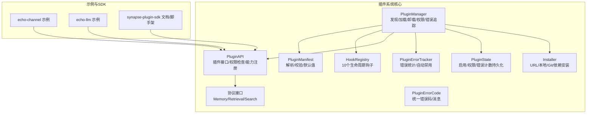
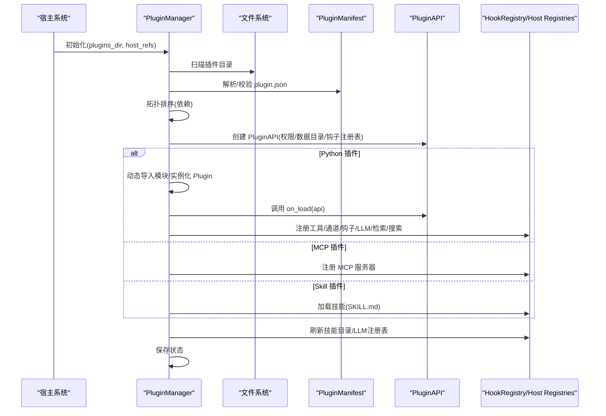
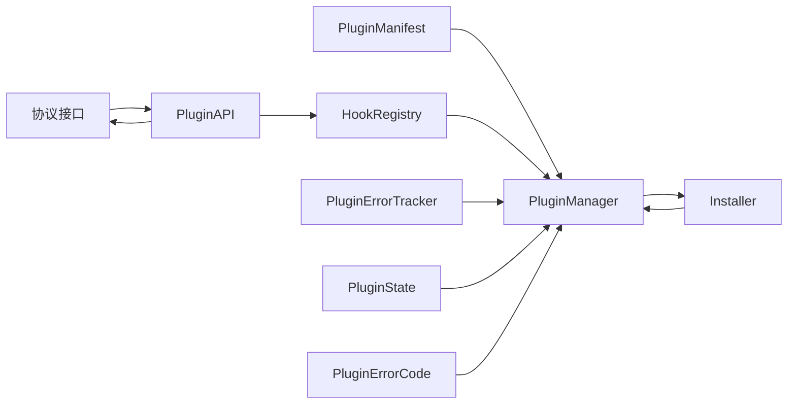

# 插件生态系统

<cite>
**本文引用的文件**
- [src/synapse/plugins/__init__.py](file://src/synapse/plugins/__init__.py)
- [src/synapse/plugins/manager.py](file://src/synapse/plugins/manager.py)
- [src/synapse/plugins/manifest.py](file://src/synapse/plugins/manifest.py)
- [src/synapse/plugins/hooks.py](file://src/synapse/plugins/hooks.py)
- [src/synapse/plugins/api.py](file://src/synapse/plugins/api.py)
- [src/synapse/plugins/protocols.py](file://src/synapse/plugins/protocols.py)
- [src/synapse/plugins/errors.py](file://src/synapse/plugins/errors.py)
- [src/synapse/plugins/sandbox.py](file://src/synapse/plugins/sandbox.py)
- [src/synapse/plugins/state.py](file://src/synapse/plugins/state.py)
- [src/synapse/plugins/installer.py](file://src/synapse/plugins/installer.py)
- [examples/plugins/echo-channel/plugin.json](file://examples/plugins/echo-channel/plugin.json)
- [examples/plugins/echo-channel/plugin.py](file://examples/plugins/echo-channel/plugin.py)
- [examples/plugins/echo-llm/plugin.json](file://examples/plugins/echo-llm/plugin.json)
- [synapse-plugin-sdk/README.md](file://synapse-plugin-sdk/README.md)
</cite>

## 目录
1. [简介](#简介)
2. [项目结构](#项目结构)
3. [核心组件](#核心组件)
4. [架构总览](#架构总览)
5. [详细组件分析](#详细组件分析)
6. [依赖分析](#依赖分析)
7. [性能考虑](#性能考虑)
8. [故障排查指南](#故障排查指南)
9. [结论](#结论)
10. [附录](#附录)

## 简介
本文件面向插件开发者与使用者，系统化阐述 Synapse 插件生态：涵盖 8 种插件类型、三层权限模型、10 个生命周期钩子、插件管理器的发现与加载机制、权限控制与故障隔离策略，并提供开发指南、manifest 配置示例、钩子使用方法、测试与发布流程。

## 项目结构
插件系统位于 src/synapse/plugins 下，围绕“发现—解析—加载—注册—运行—卸载”闭环构建，辅以权限、钩子、协议、沙箱与状态持久化等支撑模块；examples/plugins 提供可直接参考的示例插件。

图表来源
- [src/synapse/plugins/manager.py:44-781](file://src/synapse/plugins/manager.py#L44-L781)
- [src/synapse/plugins/manifest.py:70-378](file://src/synapse/plugins/manifest.py#L70-L378)
- [src/synapse/plugins/hooks.py:53-225](file://src/synapse/plugins/hooks.py#L53-L225)
- [src/synapse/plugins/api.py:60-697](file://src/synapse/plugins/api.py#L60-L697)
- [src/synapse/plugins/protocols.py:8-49](file://src/synapse/plugins/protocols.py#L8-L49)
- [src/synapse/plugins/sandbox.py:20-127](file://src/synapse/plugins/sandbox.py#L20-L127)
- [src/synapse/plugins/state.py:29-136](file://src/synapse/plugins/state.py#L29-L136)
- [src/synapse/plugins/errors.py:9-191](file://src/synapse/plugins/errors.py#L9-L191)
- [src/synapse/plugins/installer.py:1-604](file://src/synapse/plugins/installer.py#L1-L604)
- [examples/plugins/echo-channel/plugin.py:86-109](file://examples/plugins/echo-channel/plugin.py#L86-L109)
- [examples/plugins/echo-llm/plugin.json:1-31](file://examples/plugins/echo-llm/plugin.json#L1-L31)
- [synapse-plugin-sdk/README.md:1-125](file://synapse-plugin-sdk/README.md#L1-L125)

章节来源
- [src/synapse/plugins/__init__.py:1-36](file://src/synapse/plugins/__init__.py#L1-L36)
- [src/synapse/plugins/manager.py:44-781](file://src/synapse/plugins/manager.py#L44-L781)
- [src/synapse/plugins/manifest.py:70-378](file://src/synapse/plugins/manifest.py#L70-L378)
- [src/synapse/plugins/hooks.py:53-225](file://src/synapse/plugins/hooks.py#L53-L225)
- [src/synapse/plugins/api.py:60-697](file://src/synapse/plugins/api.py#L60-L697)
- [src/synapse/plugins/protocols.py:8-49](file://src/synapse/plugins/protocols.py#L8-L49)
- [src/synapse/plugins/sandbox.py:20-127](file://src/synapse/plugins/sandbox.py#L20-L127)
- [src/synapse/plugins/state.py:29-136](file://src/synapse/plugins/state.py#L29-L136)
- [src/synapse/plugins/errors.py:9-191](file://src/synapse/plugins/errors.py#L9-L191)
- [src/synapse/plugins/installer.py:1-604](file://src/synapse/plugins/installer.py#L1-L604)
- [examples/plugins/echo-channel/plugin.json:1-20](file://examples/plugins/echo-channel/plugin.json#L1-L20)
- [examples/plugins/echo-channel/plugin.py:86-109](file://examples/plugins/echo-channel/plugin.py#L86-L109)
- [examples/plugins/echo-llm/plugin.json:1-31](file://examples/plugins/echo-llm/plugin.json#L1-L31)
- [synapse-plugin-sdk/README.md:1-125](file://synapse-plugin-sdk/README.md#L1-L125)

## 核心组件
- 插件管理器：负责扫描目录、解析 manifest、拓扑排序、逐个加载、权限授予、错误追踪与自动禁用、卸载与重载、技能目录刷新、LLM 注册表刷新。
- 清单解析：严格校验字段、默认值推导、路径安全检查、权限集合划分（基础/高级/系统）、能力描述生成。
- 钩子注册表：10 个生命周期钩子，回调独立超时与异常隔离，支持异步/同步分发。
- 插件 API：权限检查前置、能力注册入口（工具、通道、钩子、内存、检索、搜索、LLM、路由、主机访问）、清理回收。
- 协议接口：MemoryBackendProtocol、RetrievalSource、SearchBackend，用于扩展存储与检索能力。
- 沙箱与错误追踪：统一错误记录、时间窗口内连续错误阈值触发自动禁用。
- 状态持久化：启用/禁用、已授予权限、错误计数与最近错误、活跃后端槽位。
- 安装器：支持 URL 下载/解压、Git 克隆、本地目录复制、pip 依赖安装、安全校验与回滚。
- 错误码：统一错误分类与多语言提示，便于前端展示与引导。

章节来源
- [src/synapse/plugins/manager.py:44-781](file://src/synapse/plugins/manager.py#L44-L781)
- [src/synapse/plugins/manifest.py:70-378](file://src/synapse/plugins/manifest.py#L70-L378)
- [src/synapse/plugins/hooks.py:53-225](file://src/synapse/plugins/hooks.py#L53-L225)
- [src/synapse/plugins/api.py:60-697](file://src/synapse/plugins/api.py#L60-L697)
- [src/synapse/plugins/protocols.py:8-49](file://src/synapse/plugins/protocols.py#L8-L49)
- [src/synapse/plugins/sandbox.py:20-127](file://src/synapse/plugins/sandbox.py#L20-L127)
- [src/synapse/plugins/state.py:29-136](file://src/synapse/plugins/state.py#L29-L136)
- [src/synapse/plugins/installer.py:1-604](file://src/synapse/plugins/installer.py#L1-L604)
- [src/synapse/plugins/errors.py:9-191](file://src/synapse/plugins/errors.py#L9-L191)

## 架构总览
插件系统通过“管理器—API—注册表/协议—宿主引用”的协作实现松耦合扩展。加载阶段按依赖拓扑顺序执行，每个插件独立超时与异常隔离；运行期通过钩子链路与能力注册接入系统核心模块；卸载时进行资源回收与状态落盘。

图表来源
- [src/synapse/plugins/manager.py:165-247](file://src/synapse/plugins/manager.py#L165-L247)
- [src/synapse/plugins/manifest.py:253-294](file://src/synapse/plugins/manifest.py#L253-L294)
- [src/synapse/plugins/api.py:60-103](file://src/synapse/plugins/api.py#L60-L103)
- [src/synapse/plugins/hooks.py:108-156](file://src/synapse/plugins/hooks.py#L108-L156)

## 详细组件分析

### 插件类型与能力映射
- 工具类（Tool）：通过 api.register_tools 注册工具定义与处理器，支持 OpenAI/Anthropic 格式转换。
- 通道类（Channel）：通过 api.register_channel 注册 IM 适配器工厂，支持发送文本/媒体。
- RAG 类（RAG）：通过 api.register_retrieval_source 注册外部知识源（如 Obsidian/Notion/本地文件）。
- 内存类（Memory）：通过 api.register_memory_backend 替换内置记忆后端或追加写入。
- LLM 类（LLM）：通过 api.register_llm_provider 与 api.register_llm_registry 注册供应商与厂商注册表。
- 钩子类（Hook）：通过 api.register_hook 注册生命周期钩子回调。
- 技能类（Skill）：通过 manifest.provides.skill 或插件内嵌 SKILL.md 进行声明式注入。
- MCP 类（MCP）：通过 plugin.json 的 entry 指向 mcp_config.json，由管理器注册 MCP 服务器。

章节来源
- [synapse-plugin-sdk/README.md:74-86](file://synapse-plugin-sdk/README.md#L74-L86)
- [src/synapse/plugins/api.py:195-250](file://src/synapse/plugins/api.py#L195-L250)
- [src/synapse/plugins/api.py:316-343](file://src/synapse/plugins/api.py#L316-L343)
- [src/synapse/plugins/api.py:407-424](file://src/synapse/plugins/api.py#L407-L424)
- [src/synapse/plugins/api.py:381-404](file://src/synapse/plugins/api.py#L381-L404)
- [src/synapse/plugins/manager.py:387-413](file://src/synapse/plugins/manager.py#L387-L413)
- [src/synapse/plugins/manifest.py:86-91](file://src/synapse/plugins/manifest.py#L86-L91)

### 生命周期钩子（10个）
- on_init / on_shutdown：插件加载/卸载时触发
- on_message_received / on_message_sending：消息收发前后
- on_retrieve / on_prompt_build / on_tool_result / on_before_tool_use / on_after_tool_use：检索/提示构建/工具调用前后
- on_session_start / on_session_end：会话开始/结束
- on_schedule / on_config_change / on_error：定时任务/配置变更/错误事件

钩子注册与分发采用独立超时与异常隔离，避免单个回调影响整体链路。

章节来源
- [src/synapse/plugins/hooks.py:15-33](file://src/synapse/plugins/hooks.py#L15-L33)
- [src/synapse/plugins/hooks.py:108-156](file://src/synapse/plugins/hooks.py#L108-L156)
- [src/synapse/plugins/hooks.py:158-214](file://src/synapse/plugins/hooks.py#L158-L214)

### 权限模型（三层）
- 基础权限（always granted）：工具注册、基本钩子、读写配置、仅自身数据、日志。
- 高级权限（需批准）：内存读写、通道注册/发送、消息钩子、检索/搜索注册、路由注册、脑/向量访问、设置读取、LLM 注册。
- 系统权限（保留）：全部钩子、替换内存后端、系统配置写入。

权限解析与授予：
- 启动时从 manifest 读取 permissions，合并已批准列表，未批准的高级/系统权限不会自动授予。
- 用户可在 UI 中批准/撤销，管理器更新已授予权限并持久化。

章节来源
- [src/synapse/plugins/manifest.py:29-67](file://src/synapse/plugins/manifest.py#L29-L67)
- [src/synapse/plugins/manager.py:514-570](file://src/synapse/plugins/manager.py#L514-L570)
- [src/synapse/plugins/api.py:119-143](file://src/synapse/plugins/api.py#L119-L143)

### 插件管理器：发现与加载机制
- 发现：扫描 plugins_dir 下含 plugin.json 的子目录。
- 解析：parse_manifest 校验必填字段、路径安全、权限合法性、默认 entry 推导。
- 拓扑排序：基于 manifest.depends 使用 Kanh 算法排序，检测环依赖并排除。
- 版本兼容：check_compatibility 对比系统/SDK/Python 版本要求。
- 加载：按类型分别处理 Python/MCP/Skill，调用 on_load 并注册能力；失败记录到 _failed 并持久化。
- 刷新：技能目录缓存失效、LLM 注册表重载。
- 保存：最终保存状态文件。

章节来源
- [src/synapse/plugins/manager.py:120-164](file://src/synapse/plugins/manager.py#L120-L164)
- [src/synapse/plugins/manager.py:165-247](file://src/synapse/plugins/manager.py#L165-L247)
- [src/synapse/plugins/manager.py:257-299](file://src/synapse/plugins/manager.py#L257-L299)
- [src/synapse/plugins/manager.py:300-445](file://src/synapse/plugins/manager.py#L300-L445)
- [src/synapse/plugins/manager.py:463-474](file://src/synapse/plugins/manager.py#L463-L474)

### 权限控制系统工作原理
- 权限检查前置：所有特权操作均通过 _check_permission 校验，Basic 权限直接放行，否则根据 granted_permissions 决定。
- 拒绝行为：默认记录警告并跳过，必要时可抛出 PluginPermissionError。
- UI 协作：未批准的高级/系统权限会被记录到 pending_permissions，等待用户审批。
- 动态更新：批准/撤销后管理器更新已授予权限并持久化。

章节来源
- [src/synapse/plugins/api.py:119-143](file://src/synapse/plugins/api.py#L119-L143)
- [src/synapse/plugins/manager.py:539-569](file://src/synapse/plugins/manager.py#L539-L569)

### 故障隔离与自动禁用
- 回调隔离：HookRegistry 对每个回调独立超时与异常捕获，失败不影响其他回调。
- 统一错误追踪：PluginErrorTracker 记录错误上下文，5 分钟内超过 10 次错误触发自动禁用。
- 自动禁用回调：触发时卸载插件并清理工具/钩子/通道/MCP 等资源。
- 卸载回收：PluginAPI._cleanup 逐一清理钩子、工具、通道、MCP、后端、注册表项。

章节来源
- [src/synapse/plugins/hooks.py:120-156](file://src/synapse/plugins/hooks.py#L120-L156)
- [src/synapse/plugins/sandbox.py:32-53](file://src/synapse/plugins/sandbox.py#L32-L53)
- [src/synapse/plugins/manager.py:617-647](file://src/synapse/plugins/manager.py#L617-L647)
- [src/synapse/plugins/api.py:482-558](file://src/synapse/plugins/api.py#L482-L558)

### 插件开发指南
- 使用 SDK 脚手架快速生成插件目录与模板，支持 tool/channel/rag/memory/llm/hook/skill/mcp 多种类型。
- 在 on_load 中通过 PluginAPI 注册能力；工具需提供定义与处理器；通道需提供工厂；LLM 需提供供应商类与注册表；RAG 需实现检索源协议；内存需实现内存后端协议；钩子需注册回调；技能通过 SKILL.md 声明。
- manifest 中声明 permissions、requires、provides、entry 等字段；遵循路径安全规则，禁止绝对路径与 “..”。

章节来源
- [synapse-plugin-sdk/README.md:17-73](file://synapse-plugin-sdk/README.md#L17-L73)
- [src/synapse/plugins/api.py:195-250](file://src/synapse/plugins/api.py#L195-L250)
- [src/synapse/plugins/api.py:316-343](file://src/synapse/plugins/api.py#L316-L343)
- [src/synapse/plugins/api.py:407-424](file://src/synapse/plugins/api.py#L407-L424)
- [src/synapse/plugins/api.py:381-404](file://src/synapse/plugins/api.py#L381-L404)
- [src/synapse/plugins/manifest.py:253-294](file://src/synapse/plugins/manifest.py#L253-L294)

### manifest 配置示例
- echo-channel：演示通道与消息钩子注册，声明 permissions、requires、provides。
- echo-llm：演示 LLM 提供商注册，声明 provides.llm_provider 与 api_type/registry。

章节来源
- [examples/plugins/echo-channel/plugin.json:1-20](file://examples/plugins/echo-channel/plugin.json#L1-L20)
- [examples/plugins/echo-llm/plugin.json:1-31](file://examples/plugins/echo-llm/plugin.json#L1-L31)

### 钩子函数使用方法
- 在 on_load 中调用 api.register_hook(hook_name, callback)，管理器自动设置超时。
- 异步/同步回调均可，内部统一隔离执行。
- 常见用途：消息处理、检索前/后、工具调用前后、会话生命周期、定时任务、配置变更、错误上报。

章节来源
- [src/synapse/plugins/hooks.py:108-156](file://src/synapse/plugins/hooks.py#L108-L156)
- [src/synapse/plugins/api.py:253-294](file://src/synapse/plugins/api.py#L253-L294)

### 插件开发案例
- echo-channel：注册通道适配器与消息钩子，收到消息后回发；展示通道注册、消息钩子、发送消息。
- echo-llm：注册 LLM 提供商与厂商注册表，演示 LLM 注册流程。

章节来源
- [examples/plugins/echo-channel/plugin.py:86-109](file://examples/plugins/echo-channel/plugin.py#L86-L109)
- [examples/plugins/echo-llm/plugin.json:22-27](file://examples/plugins/echo-llm/plugin.json#L22-L27)

### 测试策略
- 使用 SDK 的 MockPluginAPI 与断言工具验证插件加载、工具注册、钩子注册等。
- 建议覆盖：权限不足时的行为、超时与异常隔离、卸载清理、冲突与依赖缺失场景。

章节来源
- [synapse-plugin-sdk/README.md:87-96](file://synapse-plugin-sdk/README.md#L87-L96)

### 发布流程
- 本地打包：确保 plugin.json 合法、entry 文件存在、provides/skills 正确。
- 安装器支持：URL 下载/解压、Git 克隆、本地路径复制、pip 依赖安装、安全校验与回滚。
- 审批与启用：用户在 UI 中批准权限后启用插件；管理器自动重载并刷新相关注册表。

章节来源
- [src/synapse/plugins/installer.py:368-454](file://src/synapse/plugins/installer.py#L368-L454)
- [src/synapse/plugins/installer.py:261-365](file://src/synapse/plugins/installer.py#L261-L365)
- [src/synapse/plugins/installer.py:457-513](file://src/synapse/plugins/installer.py#L457-L513)
- [src/synapse/plugins/manager.py:607-616](file://src/synapse/plugins/manager.py#L607-L616)

## 依赖分析
- 插件管理器依赖清单解析、钩子注册表、协议接口、错误追踪与状态持久化。
- 插件 API 依赖权限模型与宿主引用，封装能力注册与清理。
- 安装器依赖清单解析与 pip 子进程，保障安全与回滚。
- 示例插件依赖宿主通道与 LLM 注册表，体现典型集成方式。

图表来源
- [src/synapse/plugins/manager.py:14-20](file://src/synapse/plugins/manager.py#L14-L20)
- [src/synapse/plugins/api.py:12-20](file://src/synapse/plugins/api.py#L12-L20)
- [src/synapse/plugins/installer.py:19-21](file://src/synapse/plugins/installer.py#L19-L21)

章节来源
- [src/synapse/plugins/manager.py:14-20](file://src/synapse/plugins/manager.py#L14-L20)
- [src/synapse/plugins/api.py:12-20](file://src/synapse/plugins/api.py#L12-L20)
- [src/synapse/plugins/installer.py:19-21](file://src/synapse/plugins/installer.py#L19-L21)

## 性能考虑
- 加载超时与卸载超时：避免阻塞宿主；插件应尽量异步化。
- 钩子超时：默认 5 秒，可通过 set_timeout 为特定插件调整。
- 并行分发：HookRegistry.dispatch 并行执行回调，但每个回调独立超时与异常隔离。
- 依赖拓扑：避免循环依赖，减少加载失败与重试成本。
- LLM 注册表刷新：插件加载后统一刷新，避免重复扫描。

章节来源
- [src/synapse/plugins/hooks.py:35-36](file://src/synapse/plugins/hooks.py#L35-L36)
- [src/synapse/plugins/hooks.py:120-156](file://src/synapse/plugins/hooks.py#L120-L156)
- [src/synapse/plugins/manager.py:133-163](file://src/synapse/plugins/manager.py#L133-L163)
- [src/synapse/plugins/manager.py:248-256](file://src/synapse/plugins/manager.py#L248-L256)

## 故障排查指南
- 日志定位：插件日志输出至 data/plugins/{id}/logs/{id}.log，支持滚动与级别。
- 状态查询：通过管理器列出已加载插件、权限状态、失败原因。
- 错误码：使用统一错误码与多语言提示，便于前端展示与用户引导。
- 自动禁用：若连续错误达到阈值，插件将被自动禁用并卸载，需人工启用或修复。
- 卸载清理：确认工具、通道、MCP、后端、注册表项是否被清理。

章节来源
- [src/synapse/plugins/api.py:104-118](file://src/synapse/plugins/api.py#L104-L118)
- [src/synapse/plugins/manager.py:656-758](file://src/synapse/plugins/manager.py#L656-L758)
- [src/synapse/plugins/errors.py:156-181](file://src/synapse/plugins/errors.py#L156-L181)
- [src/synapse/plugins/sandbox.py:32-53](file://src/synapse/plugins/sandbox.py#L32-L53)
- [src/synapse/plugins/api.py:520-558](file://src/synapse/plugins/api.py#L520-L558)

## 结论
Synapse 插件生态以“安全、隔离、可扩展”为核心设计原则：通过三层权限模型与严格的 manifest 校验确保安全边界；通过钩子隔离与错误追踪实现故障隔离与自动恢复；通过统一的安装器与管理器简化开发与运维。开发者可借助 SDK 快速上手，示例插件提供最佳实践参考。

## 附录
- SDK 模块概览：PluginBase/PluginAPI、装饰器、脚手架、测试工具、钩子签名、协议接口、配置模式、类型定义。
- 常用路径：examples/plugins 下包含多种类型示例；synapse-plugin-sdk 提供文档与脚手架命令。

章节来源
- [synapse-plugin-sdk/README.md:111-124](file://synapse-plugin-sdk/README.md#L111-L124)