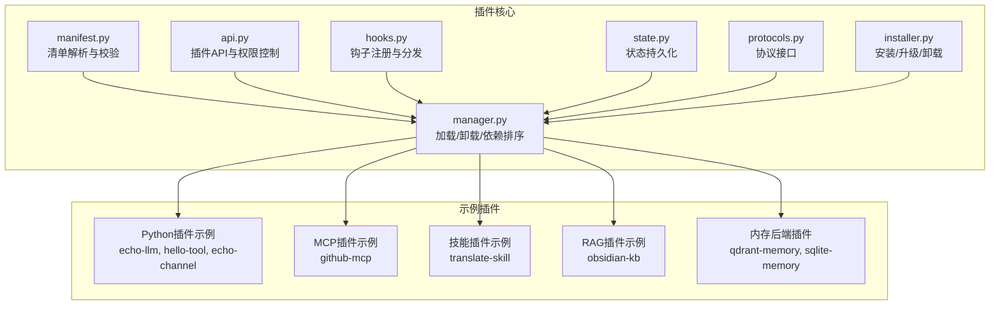
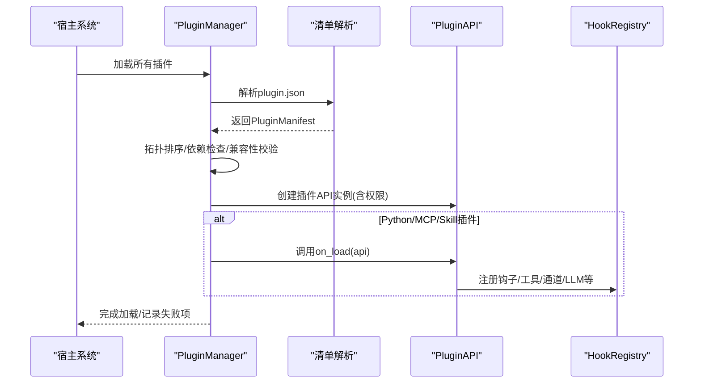
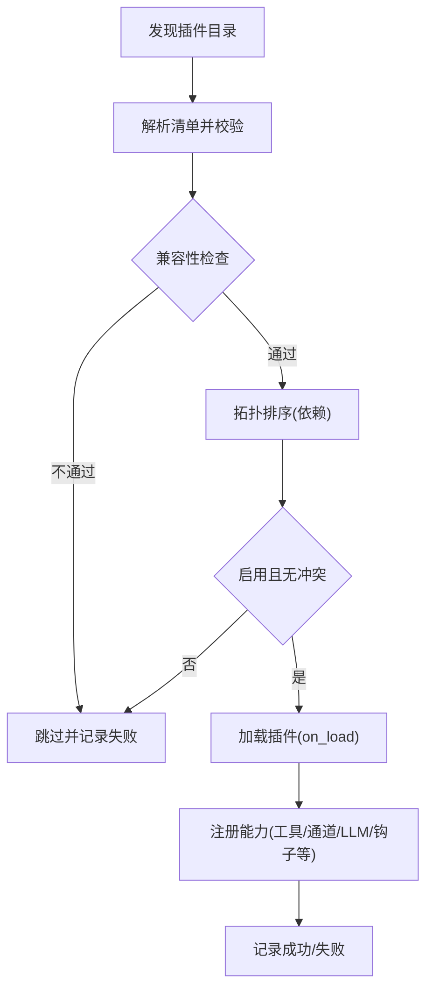

# 插件类型详解

<cite>
**本文引用的文件**
- [src/synapse/plugins/manifest.py](file://src/synapse/plugins/manifest.py)
- [src/synapse/plugins/api.py](file://src/synapse/plugins/api.py)
- [src/synapse/plugins/hooks.py](file://src/synapse/plugins/hooks.py)
- [src/synapse/plugins/manager.py](file://src/synapse/plugins/manager.py)
- [src/synapse/plugins/installer.py](file://src/synapse/plugins/installer.py)
- [src/synapse/plugins/state.py](file://src/synapse/plugins/state.py)
- [src/synapse/plugins/protocols.py](file://src/synapse/plugins/protocols.py)
- [examples/plugins/echo-llm/plugin.py](file://examples/plugins/echo-llm/plugin.py)
- [examples/plugins/github-mcp/mcp_config.json](file://examples/plugins/github-mcp/mcp_config.json)
- [examples/plugins/translate-skill/SKILL.md](file://examples/plugins/translate-skill/SKILL.md)
- [examples/plugins/hello-tool/plugin.py](file://examples/plugins/hello-tool/plugin.py)
- [examples/plugins/echo-channel/plugin.py](file://examples/plugins/echo-channel/plugin.py)
- [examples/plugins/qdrant-memory/plugin.py](file://examples/plugins/qdrant-memory/plugin.py)
- [examples/plugins/sqlite-memory/plugin.py](file://examples/plugins/sqlite-memory/plugin.py)
- [examples/plugins/obsidian-kb/plugin.py](file://examples/plugins/obsidian-kb/plugin.py)
</cite>

## 目录
1. [简介](#简介)
2. [项目结构](#项目结构)
3. [核心组件](#核心组件)
4. [架构总览](#架构总览)
5. [详细组件分析](#详细组件分析)
6. [依赖分析](#依赖分析)
7. [性能考虑](#性能考虑)
8. [故障排查指南](#故障排查指南)
9. [结论](#结论)
10. [附录](#附录)

## 简介
本文件系统性梳理平台支持的8类插件：Python插件、MCP插件、技能插件、工具插件、通道插件、RAG插件、LLM插件、钩子插件。围绕定义、用途、实现方式、manifest配置、入口文件结构、权限需求与使用场景展开，并提供示例路径与最佳实践，帮助开发者在实际项目中做出合适的选择。

## 项目结构
插件体系由“清单解析、API接口、生命周期管理、安装器、状态持久化、钩子注册”等模块构成，示例插件覆盖了各类插件类型的典型用法。

图示来源
- [src/synapse/plugins/manifest.py:1-378](file://src/synapse/plugins/manifest.py#L1-L378)
- [src/synapse/plugins/api.py:1-697](file://src/synapse/plugins/api.py#L1-L697)
- [src/synapse/plugins/hooks.py:1-225](file://src/synapse/plugins/hooks.py#L1-L225)
- [src/synapse/plugins/manager.py:1-781](file://src/synapse/plugins/manager.py#L1-L781)
- [src/synapse/plugins/installer.py:1-604](file://src/synapse/plugins/installer.py#L1-L604)
- [src/synapse/plugins/state.py:1-136](file://src/synapse/plugins/state.py#L1-L136)
- [src/synapse/plugins/protocols.py:1-49](file://src/synapse/plugins/protocols.py#L1-L49)

章节来源
- [src/synapse/plugins/manifest.py:1-378](file://src/synapse/plugins/manifest.py#L1-L378)
- [src/synapse/plugins/api.py:1-697](file://src/synapse/plugins/api.py#L1-L697)
- [src/synapse/plugins/hooks.py:1-225](file://src/synapse/plugins/hooks.py#L1-L225)
- [src/synapse/plugins/manager.py:1-781](file://src/synapse/plugins/manager.py#L1-L781)
- [src/synapse/plugins/installer.py:1-604](file://src/synapse/plugins/installer.py#L1-L604)
- [src/synapse/plugins/state.py:1-136](file://src/synapse/plugins/state.py#L1-L136)
- [src/synapse/plugins/protocols.py:1-49](file://src/synapse/plugins/protocols.py#L1-L49)

## 核心组件
- 清单与权限
  - 清单字段与校验：插件ID、名称、版本、类型、入口、权限列表、依赖与冲突等。
  - 权限等级：基础、高级、系统三档，决定API可用能力。
- 插件API
  - 注册工具、通道、内存后端、检索源、LLM提供方、钩子等；按权限动态启用。
- 钩子系统
  - 15类生命周期钩子，独立超时隔离，支持同步/异步回调。
- 生命周期管理
  - 发现、拓扑排序、兼容性检查、逐个加载、错误追踪与自动禁用、卸载清理。
- 安装器
  - 支持URL下载、本地目录、Git仓库、bundle映射安装，安全解压与pip依赖安装。
- 状态持久化
  - 记录启用状态、已授予权限、错误计数与最近错误时间等。

章节来源
- [src/synapse/plugins/manifest.py:24-67](file://src/synapse/plugins/manifest.py#L24-L67)
- [src/synapse/plugins/api.py:119-144](file://src/synapse/plugins/api.py#L119-L144)
- [src/synapse/plugins/hooks.py:15-33](file://src/synapse/plugins/hooks.py#L15-L33)
- [src/synapse/plugins/manager.py:132-164](file://src/synapse/plugins/manager.py#L132-L164)
- [src/synapse/plugins/installer.py:119-145](file://src/synapse/plugins/installer.py#L119-L145)
- [src/synapse/plugins/state.py:14-38](file://src/synapse/plugins/state.py#L14-L38)

## 架构总览
插件系统通过“清单驱动 + 权限控制 + 钩子扩展”的方式，将外部能力以最小侵入的方式接入平台。

图示来源
- [src/synapse/plugins/manager.py:165-247](file://src/synapse/plugins/manager.py#L165-L247)
- [src/synapse/plugins/manifest.py:253-294](file://src/synapse/plugins/manifest.py#L253-L294)
- [src/synapse/plugins/api.py:60-103](file://src/synapse/plugins/api.py#L60-L103)
- [src/synapse/plugins/hooks.py:53-91](file://src/synapse/plugins/hooks.py#L53-L91)

## 详细组件分析

### Python插件
- 定义与用途
  - 最通用的插件类型，通过导出Plugin类并在on_load中注册工具、通道、LLM、钩子等能力。
- manifest配置要点
  - type: "python"
  - entry: 默认"plugin.py"，可自定义相对路径（禁止..与绝对路径）。
  - permissions: 声明所需权限，系统按等级授予。
- 入口文件结构
  - 导入PluginAPI与PluginBase，实现on_load/on_unload。
- 权限需求
  - 工具注册：tools.register
  - 钩子注册：hooks.basic/hooks.message/hooks.retrieve/hooks.all
  - 通道注册：channel.register
  - LLM注册：llm.register
  - 内存后端：memory.write或memory.replace
  - 检索源：retrieval.register
  - API路由：routes.register
  - 配置读写：config.read/config.write
  - 数据目录：data.own
  - 日志：log
- 使用场景
  - 自定义工具、消息通道适配器、LLM提供方、检索源、内存后端等。
- 示例与最佳实践
  - 示例：工具插件、通道插件、LLM插件均采用此模式。
  - 最佳实践：在on_load中集中注册，在on_unload中清理；严格按需声明权限；避免阻塞式操作；合理设置hook_timeout。

章节来源
- [src/synapse/plugins/manifest.py:25-39](file://src/synapse/plugins/manifest.py#L25-L39)
- [src/synapse/plugins/manifest.py:297-304](file://src/synapse/plugins/manifest.py#L297-L304)
- [src/synapse/plugins/api.py:195-250](file://src/synapse/plugins/api.py#L195-L250)
- [src/synapse/plugins/api.py:253-294](file://src/synapse/plugins/api.py#L253-L294)
- [src/synapse/plugins/api.py:316-343](file://src/synapse/plugins/api.py#L316-L343)
- [src/synapse/plugins/api.py:381-404](file://src/synapse/plugins/api.py#L381-L404)
- [src/synapse/plugins/api.py:407-424](file://src/synapse/plugins/api.py#L407-L424)
- [src/synapse/plugins/api.py:482-558](file://src/synapse/plugins/api.py#L482-L558)
- [examples/plugins/hello-tool/plugin.py:1-40](file://examples/plugins/hello-tool/plugin.py#L1-L40)
- [examples/plugins/echo-channel/plugin.py:1-109](file://examples/plugins/echo-channel/plugin.py#L1-L109)
- [examples/plugins/echo-llm/plugin.py:1-98](file://examples/plugins/echo-llm/plugin.py#L1-L98)

### MCP插件
- 定义与用途
  - 通过外部进程提供MCP服务器，供平台调用其工具/能力。
- manifest配置要点
  - type: "mcp"
  - entry: 默认"mcp_config.json"，描述命令、参数、工作目录、环境变量等。
- 入口文件结构
  - mcp_config.json包含command/args/env/cwd等字段。
- 权限需求
  - 通常无需额外权限，但需确保mcp_client可用。
- 使用场景
  - 外部CLI工具、第三方服务的MCP适配。
- 示例与最佳实践
  - 示例：github-mcp通过npx启动官方GitHub MCP服务器。
  - 最佳实践：明确cwd与env；限制args长度；监控连接状态；处理断连重连。

章节来源
- [src/synapse/plugins/manifest.py:297-304](file://src/synapse/plugins/manifest.py#L297-L304)
- [src/synapse/plugins/manager.py:360-386](file://src/synapse/plugins/manager.py#L360-L386)
- [examples/plugins/github-mcp/mcp_config.json:1-8](file://examples/plugins/github-mcp/mcp_config.json#L1-L8)

### 技能插件
- 定义与用途
  - 将技能定义打包为插件，通过SKILL.md声明技能元数据与触发词，由技能系统加载。
- manifest配置要点
  - type: "skill"
  - entry: 默认"SKILL.md"，也可自定义相对路径。
  - provides.skill: 指向技能文件或目录。
- 入口文件结构
  - SKILL.md采用YAML前言段声明name/description/triggers等。
- 权限需求
  - 仅在加载技能时需要技能系统的访问权。
- 使用场景
  - 快速发布可复用的技能，便于团队共享。
- 示例与最佳实践
  - 示例：translate-skill展示基本技能结构。
  - 最佳实践：保持SKILL.md前言段完整；避免与已有技能名冲突；提供清晰的触发词与描述。

章节来源
- [src/synapse/plugins/manifest.py:297-304](file://src/synapse/plugins/manifest.py#L297-L304)
- [src/synapse/plugins/manager.py:387-413](file://src/synapse/plugins/manager.py#L387-L413)
- [src/synapse/plugins/manifest.py:352-370](file://src/synapse/plugins/manifest.py#L352-L370)
- [examples/plugins/translate-skill/SKILL.md:1-16](file://examples/plugins/translate-skill/SKILL.md#L1-L16)

### 工具插件
- 定义与用途
  - 向平台注册可被LLM调用的函数式工具，提供具体实现。
- manifest配置要点
  - type: "python"
  - entry: "plugin.py"
  - permissions: tools.register
- 入口文件结构
  - 在on_load中定义工具定义数组与处理器，调用api.register_tools。
- 权限需求
  - tools.register
- 使用场景
  - 对接业务系统、查询外部数据、执行特定任务。
- 示例与最佳实践
  - 示例：hello-tool注册一个简单的hello_world工具。
  - 最佳实践：工具定义遵循统一格式；处理器返回结构化结果；避免长耗时阻塞。

章节来源
- [src/synapse/plugins/api.py:195-250](file://src/synapse/plugins/api.py#L195-L250)
- [examples/plugins/hello-tool/plugin.py:1-40](file://examples/plugins/hello-tool/plugin.py#L1-L40)

### 通道插件
- 定义与用途
  - 注册IM/消息通道适配器，实现发送、接收、媒体上传下载等能力。
- manifest配置要点
  - type: "python"
  - entry: "plugin.py"
  - permissions: channel.register/channel.send
- 入口文件结构
  - 实现ChannelAdapter子类，提供工厂方法；在on_load中调用api.register_channel并注册钩子。
- 权限需求
  - channel.register、channel.send
- 使用场景
  - 微信、钉钉、飞书、Telegram等多渠道接入。
- 示例与最佳实践
  - 示例：echo-channel实现回声适配器与消息回显。
  - 最佳实践：区分capabilities；妥善处理媒体资源；保证幂等与去重。

章节来源
- [src/synapse/plugins/api.py:316-343](file://src/synapse/plugins/api.py#L316-L343)
- [src/synapse/plugins/api.py:253-294](file://src/synapse/plugins/api.py#L253-L294)
- [examples/plugins/echo-channel/plugin.py:1-109](file://examples/plugins/echo-channel/plugin.py#L1-L109)

### RAG插件
- 定义与用途
  - 提供检索源，将知识库内容注入到对话上下文中，增强回答质量。
- manifest配置要点
  - type: "python"
  - entry: "plugin.py"
  - permissions: retrieval.register
- 入口文件结构
  - 实现RetrievalSource协议，提供retrieve方法；在on_load中调用api.register_retrieval_source。
- 权限需求
  - retrieval.register
- 使用场景
  - 文档库、知识库、Obsidian、Notion等本地/云端知识源。
- 示例与最佳实践
  - 示例：obsidian-kb实现Vault全文检索与上下文注入。
  - 最佳实践：增量索引、过滤排除、片段截取与去重；在钩子中按需注入。

章节来源
- [src/synapse/plugins/protocols.py:22-28](file://src/synapse/plugins/protocols.py#L22-L28)
- [src/synapse/plugins/api.py:407-424](file://src/synapse/plugins/api.py#L407-L424)
- [examples/plugins/obsidian-kb/plugin.py:342-364](file://examples/plugins/obsidian-kb/plugin.py#L342-L364)
- [examples/plugins/obsidian-kb/plugin.py:488-547](file://examples/plugins/obsidian-kb/plugin.py#L488-L547)

### LLM插件
- 定义与用途
  - 注册自定义LLM提供方与模型清单，扩展平台支持的模型族。
- manifest配置要点
  - type: "python"
  - entry: "plugin.py"
  - permissions: llm.register
- 入口文件结构
  - 实现LLMProvider与ProviderRegistry，分别处理聊天与模型列表；在on_load中调用api.register_llm_provider与api.register_llm_registry。
- 权限需求
  - llm.register
- 使用场景
  - 本地推理、私有模型、第三方API适配。
- 示例与最佳实践
  - 示例：echo-llm提供回声模型与模型清单。
  - 最佳实践：正确计算token用量；支持流式输出；提供默认模型与能力标识。

章节来源
- [src/synapse/plugins/api.py:381-404](file://src/synapse/plugins/api.py#L381-L404)
- [examples/plugins/echo-llm/plugin.py:1-98](file://examples/plugins/echo-llm/plugin.py#L1-L98)

### 钩子插件
- 定义与用途
  - 通过注册钩子在系统关键节点执行自定义逻辑，如消息收发、检索、工具调用前后、会话开始/结束等。
- manifest配置要点
  - type: "python"
  - entry: "plugin.py"
  - permissions: hooks.basic/hooks.message/hooks.retrieve/hooks.all
- 入口文件结构
  - 在on_load中调用api.register_hook注册回调；注意超时与异常隔离。
- 权限需求
  - 根据钩子类别授予对应权限。
- 使用场景
  - 日志审计、消息过滤、上下文增强、行为拦截。
- 示例与最佳实践
  - 示例：echo-channel在收到消息时回显。
  - 最佳实践：为每个钩子设置合理hook_timeout；避免在钩子中做重IO；捕获异常并记录日志。

章节来源
- [src/synapse/plugins/hooks.py:15-33](file://src/synapse/plugins/hooks.py#L15-L33)
- [src/synapse/plugins/hooks.py:108-157](file://src/synapse/plugins/hooks.py#L108-L157)
- [src/synapse/plugins/api.py:253-294](file://src/synapse/plugins/api.py#L253-L294)
- [examples/plugins/echo-channel/plugin.py:93-106](file://examples/plugins/echo-channel/plugin.py#L93-L106)

### 内存后端插件
- 定义与用途
  - 替换或补充平台的记忆存储后端，支持存储、检索、会话记录等。
- manifest配置要点
  - type: "python"
  - entry: "plugin.py"
  - permissions: memory.write或memory.replace
- 入口文件结构
  - 实现MemoryBackendProtocol接口；在on_load中调用api.register_memory_backend。
- 权限需求
  - memory.write或memory.replace
- 使用场景
  - SQLite本地存储、向量数据库集成、云存储对接。
- 示例与最佳实践
  - 示例：sqlite-memory基于SQLite实现全文检索；qdrant-memory为占位实现。
  - 最佳实践：事务一致性、索引优化、会话粒度管理。

章节来源
- [src/synapse/plugins/protocols.py:9-18](file://src/synapse/plugins/protocols.py#L9-L18)
- [src/synapse/plugins/api.py:346-364](file://src/synapse/plugins/api.py#L346-L364)
- [examples/plugins/sqlite-memory/plugin.py:1-147](file://examples/plugins/sqlite-memory/plugin.py#L1-L147)
- [examples/plugins/qdrant-memory/plugin.py:1-75](file://examples/plugins/qdrant-memory/plugin.py#L1-L75)

## 依赖分析
- 类型与入口映射
  - python: 默认entry为plugin.py
  - mcp: 默认entry为mcp_config.json
  - skill: 默认entry为SKILL.md
- 依赖与冲突
  - 通过manifest.depends与conflicts控制加载顺序与互斥关系。
- 错误追踪与自动禁用
  - 基于错误计数与最近错误时间，超过阈值自动禁用插件并清理资源。

图示来源
- [src/synapse/plugins/manager.py:120-247](file://src/synapse/plugins/manager.py#L120-L247)
- [src/synapse/plugins/manifest.py:253-294](file://src/synapse/plugins/manifest.py#L253-L294)

章节来源
- [src/synapse/plugins/manager.py:132-247](file://src/synapse/plugins/manager.py#L132-L247)
- [src/synapse/plugins/state.py:65-70](file://src/synapse/plugins/state.py#L65-L70)

## 性能考虑
- 加载超时与隔离
  - 每个插件独立加载，带超时保护；钩子回调独立超时与异常隔离，避免相互影响。
- 资源清理
  - 卸载时按类型清理工具、通道、MCP、内存后端、检索源、LLM注册表等。
- I/O与并发
  - 钩子与工具尽量避免阻塞；必要时使用线程池或异步任务。
- 存储与检索
  - RAG与内存后端应关注索引策略、缓存与批量操作。

## 故障排查指南
- 清单错误
  - 缺失必填字段、未知权限、路径不安全、entry不存在等。
- 加载失败
  - 版本不兼容、循环依赖、权限不足、入口文件缺失。
- 运行期问题
  - 钩子超时、工具冲突、通道不可用、MCP连接失败。
- 排查步骤
  - 查看插件日志（data/plugins/{id}/logs/）
  - 检查插件状态（plugin_state.json）
  - 使用安装器进度与错误信息定位问题
  - 逐步降低权限或禁用部分能力验证

章节来源
- [src/synapse/plugins/manifest.py:307-377](file://src/synapse/plugins/manifest.py#L307-L377)
- [src/synapse/plugins/manager.py:227-243](file://src/synapse/plugins/manager.py#L227-L243)
- [src/synapse/plugins/installer.py:368-454](file://src/synapse/plugins/installer.py#L368-L454)
- [src/synapse/plugins/state.py:81-102](file://src/synapse/plugins/state.py#L81-L102)

## 结论
八类插件覆盖从“能力注册（工具/通道/LLM/RAG/内存）”到“生命周期扩展（钩子）”再到“外部集成（MCP/技能）”的全场景需求。通过严格的清单校验、权限控制与生命周期管理，平台实现了高扩展性与安全性。建议开发者根据具体场景选择合适类型，遵循最小权限原则与最佳实践，确保稳定与可维护性。

## 附录

### 插件类型对比与适用场景
- Python插件：通用能力接入，适合复杂逻辑与多类能力组合。
- MCP插件：外部进程能力接入，适合CLI/第三方服务。
- 技能插件：技能快速发布与复用，适合标准化流程。
- 工具插件：LLM可调用函数，适合业务工具与查询。
- 通道插件：消息通道适配，适合多IM接入。
- RAG插件：知识检索与上下文注入，适合问答增强。
- LLM插件：模型提供方扩展，适合私有/本地模型。
- 钩子插件：系统级扩展点，适合审计、拦截与增强。

### manifest配置模板（示例路径）
- Python插件模板
  - 参考：[examples/plugins/hello-tool/plugin.py:1-40](file://examples/plugins/hello-tool/plugin.py#L1-L40)
- MCP插件模板
  - 参考：[examples/plugins/github-mcp/mcp_config.json:1-8](file://examples/plugins/github-mcp/mcp_config.json#L1-L8)
- 技能插件模板
  - 参考：[examples/plugins/translate-skill/SKILL.md:1-16](file://examples/plugins/translate-skill/SKILL.md#L1-L16)

### 权限清单（节选）
- 基础权限：tools.register、hooks.basic、config.read、config.write、data.own、log、skill
- 高级权限：memory.read、memory.write、channel.register、channel.send、hooks.message、hooks.retrieve、retrieval.register、search.register、routes.register、brain.access、vector.access、settings.read、llm.register
- 系统权限：hooks.all、memory.replace、system.config.write

章节来源
- [src/synapse/plugins/manifest.py:29-67](file://src/synapse/plugins/manifest.py#L29-L67)