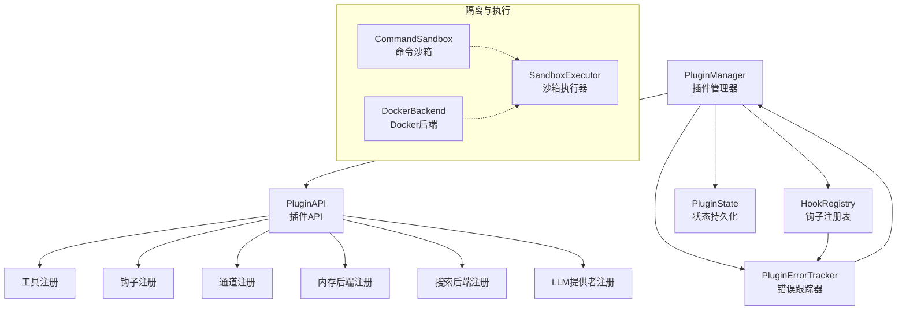
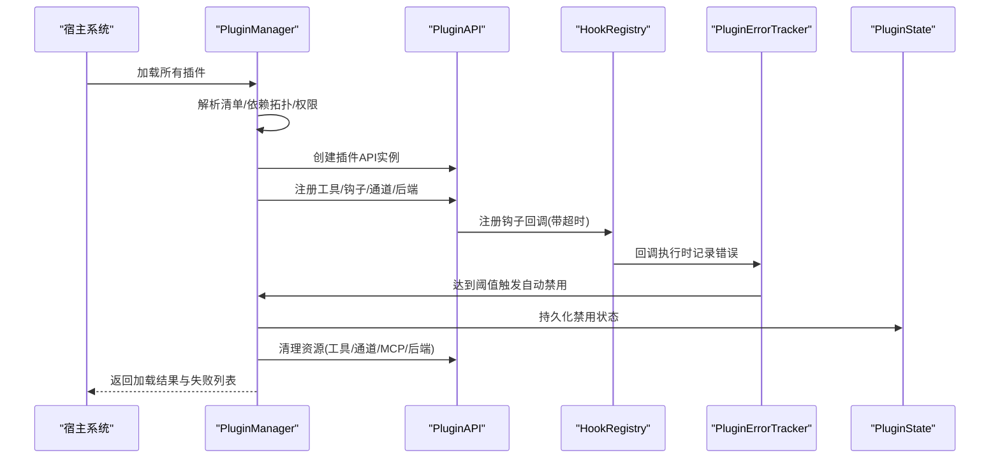
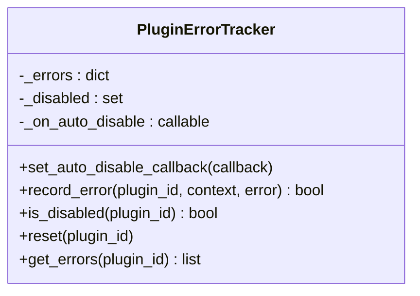
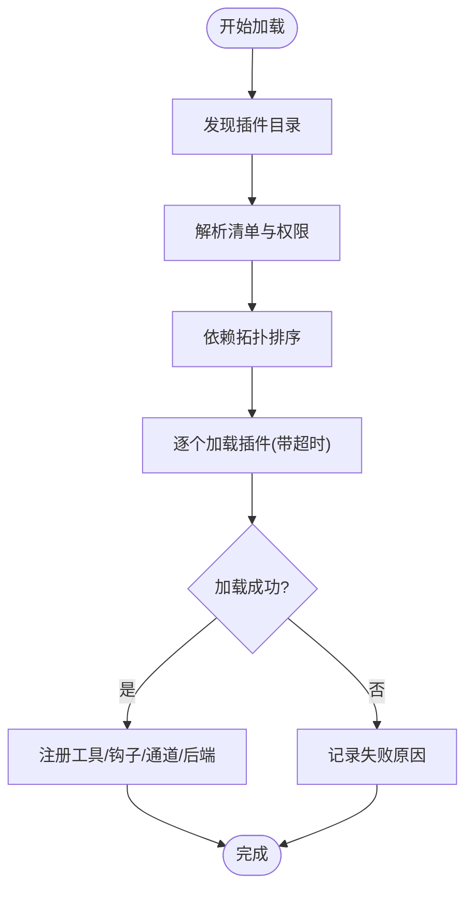
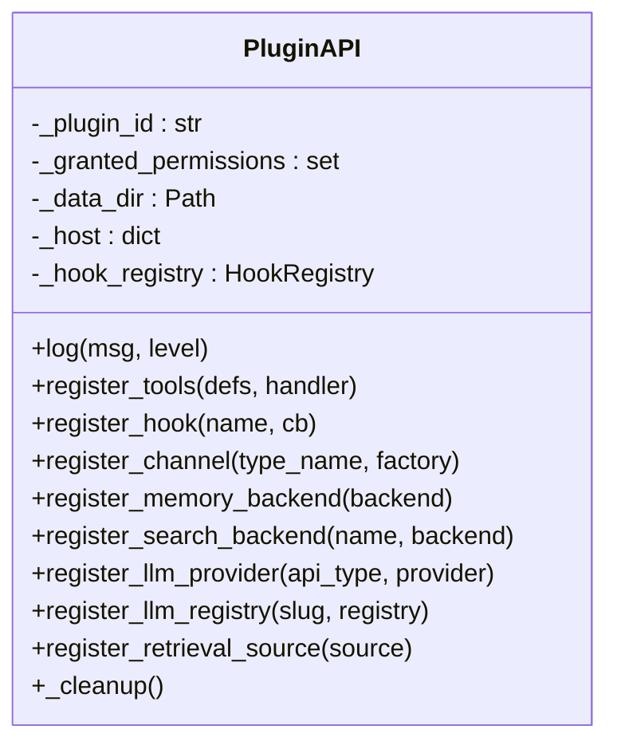
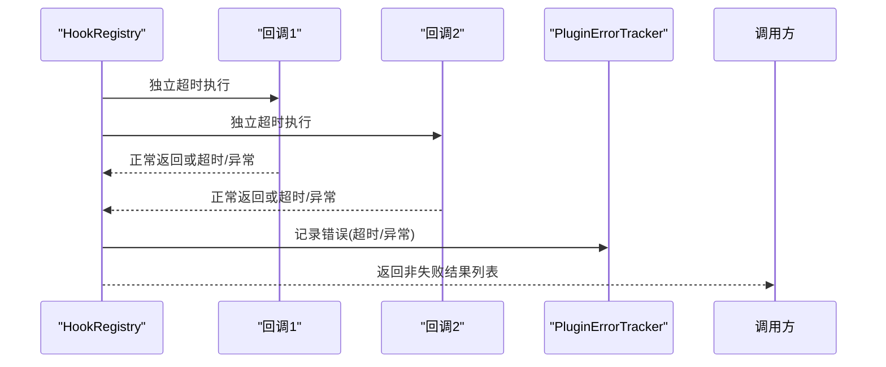
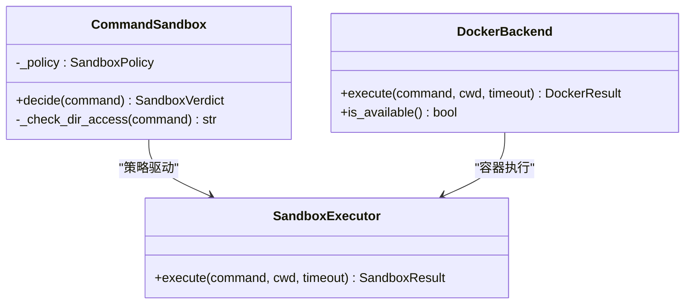
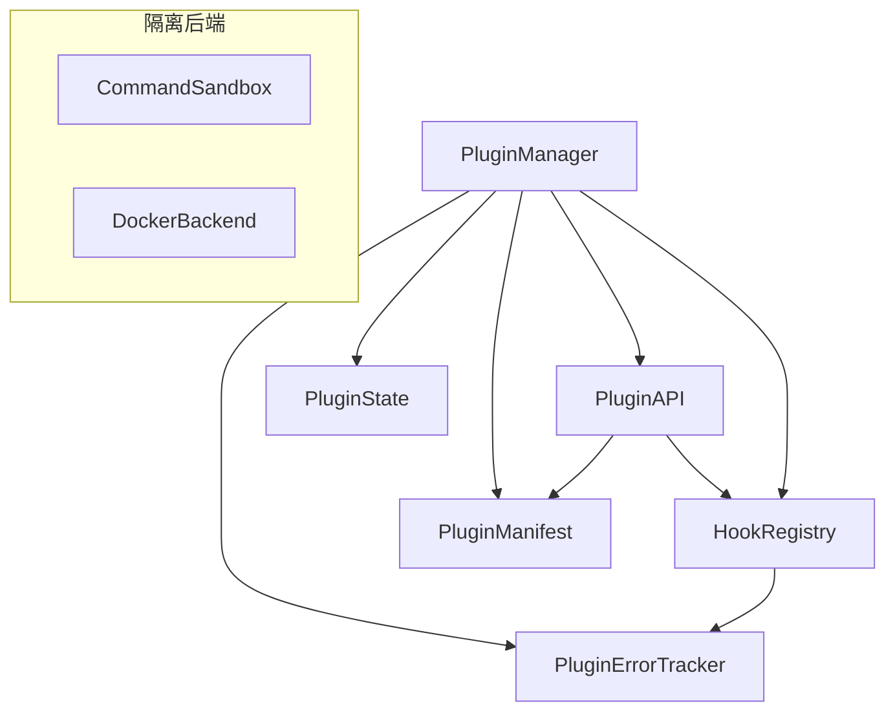

# 故障隔离机制

<cite>
**本文档引用的文件**
- [sandbox.py](file://src/synapse/plugins/sandbox.py)
- [errors.py](file://src/synapse/plugins/errors.py)
- [manager.py](file://src/synapse/plugins/manager.py)
- [state.py](file://src/synapse/plugins/state.py)
- [manifest.py](file://src/synapse/plugins/manifest.py)
- [api.py](file://src/synapse/plugins/api.py)
- [hooks.py](file://src/synapse/plugins/hooks.py)
- [docker_backend.py](file://src/synapse/core/docker_backend.py)
- [sandbox.py](file://src/synapse/core/sandbox.py)
- [policy.py](file://src/synapse/core/policy.py)
- [plugins.py](file://src/synapse/api/routes/plugins.py)
</cite>

## 目录
1. [引言](#引言)
2. [项目结构](#项目结构)
3. [核心组件](#核心组件)
4. [架构总览](#架构总览)
5. [详细组件分析](#详细组件分析)
6. [依赖关系分析](#依赖关系分析)
7. [性能考虑](#性能考虑)
8. [故障排查指南](#故障排查指南)
9. [结论](#结论)
10. [附录](#附录)

## 引言
本文件面向插件故障隔离系统，围绕“六层故障隔离”设计目标，系统性阐述进程隔离、内存隔离、文件系统隔离、网络隔离、错误检测与自动禁用、故障恢复与可观测性的实现原理与实践方法。文档同时覆盖错误跟踪器的聚合与告警机制、配置项、性能影响评估与监控指标，并提供可操作的故障排查方法论与常见场景处理策略。

## 项目结构
插件故障隔离体系由以下关键模块构成：
- 插件生命周期与隔离：插件管理器负责发现、加载、卸载、权限与超时控制；插件API提供受控能力暴露与清理；钩子注册表对回调进行独立超时与异常隔离。
- 错误检测与自愈：错误跟踪器按时间窗口聚合错误，超过阈值自动禁用插件；状态持久化记录启用/禁用与错误统计；错误码与统一响应便于前端展示与引导。
- 进程与资源隔离：核心层提供基于 subprocess 的命令沙箱与 Docker 后端，实现进程数、内存、PID、网络等资源限制与隔离。
- 配置与策略：系统策略支持沙箱开关、后端选择、风险等级、网络域白名单等配置项。

**图表来源**
- [manager.py:44-781](file://src/synapse/plugins/manager.py#L44-L781)
- [api.py:60-697](file://src/synapse/plugins/api.py#L60-L697)
- [hooks.py:53-225](file://src/synapse/plugins/hooks.py#L53-L225)
- [sandbox.py:20-127](file://src/synapse/plugins/sandbox.py#L20-L127)
- [state.py:29-136](file://src/synapse/plugins/state.py#L29-L136)
- [docker_backend.py:50-178](file://src/synapse/core/docker_backend.py#L50-L178)
- [sandbox.py:1-261](file://src/synapse/core/sandbox.py#L1-L261)

**章节来源**
- [manager.py:44-781](file://src/synapse/plugins/manager.py#L44-L781)
- [api.py:60-697](file://src/synapse/plugins/api.py#L60-L697)
- [hooks.py:53-225](file://src/synapse/plugins/hooks.py#L53-L225)
- [sandbox.py:20-127](file://src/synapse/plugins/sandbox.py#L20-L127)
- [state.py:29-136](file://src/synapse/plugins/state.py#L29-L136)
- [docker_backend.py:50-178](file://src/synapse/core/docker_backend.py#L50-L178)
- [sandbox.py:1-261](file://src/synapse/core/sandbox.py#L1-L261)

## 核心组件
- 插件错误跟踪器：按插件维度记录错误，基于时间窗与阈值触发自动禁用，并回调清理资源。
- 插件管理器：负责插件发现、清单解析、依赖拓扑排序、权限解析、加载/卸载超时、失败记录与状态持久化。
- 插件API：以权限为边界暴露能力，提供工具、钩子、通道、内存/搜索后端、LLM提供者注册与清理。
- 钩子注册表：对每个回调独立超时与异常隔离，避免单点故障扩散。
- 状态持久化：记录启用/禁用、权限、错误次数与最近错误，支持跨重启恢复。
- 错误码与统一响应：标准化错误消息与指引，便于前端展示与用户自助排障。
- 进程与资源隔离：命令沙箱与Docker后端提供进程数、内存、PID、网络等限制。

**章节来源**
- [sandbox.py:20-127](file://src/synapse/plugins/sandbox.py#L20-L127)
- [manager.py:44-781](file://src/synapse/plugins/manager.py#L44-L781)
- [api.py:60-697](file://src/synapse/plugins/api.py#L60-L697)
- [hooks.py:53-225](file://src/synapse/plugins/hooks.py#L53-L225)
- [state.py:29-136](file://src/synapse/plugins/state.py#L29-L136)
- [errors.py:9-191](file://src/synapse/plugins/errors.py#L9-L191)
- [docker_backend.py:50-178](file://src/synapse/core/docker_backend.py#L50-L178)
- [sandbox.py:1-261](file://src/synapse/core/sandbox.py#L1-L261)

## 架构总览
下图展示了插件从加载到运行、再到故障隔离与恢复的关键交互：

**图表来源**
- [manager.py:165-247](file://src/synapse/plugins/manager.py#L165-L247)
- [hooks.py:108-157](file://src/synapse/plugins/hooks.py#L108-L157)
- [sandbox.py:32-53](file://src/synapse/plugins/sandbox.py#L32-L53)
- [state.py:60-69](file://src/synapse/plugins/state.py#L60-L69)

**章节来源**
- [manager.py:165-247](file://src/synapse/plugins/manager.py#L165-L247)
- [hooks.py:108-157](file://src/synapse/plugins/hooks.py#L108-L157)
- [sandbox.py:32-53](file://src/synapse/plugins/sandbox.py#L32-L53)
- [state.py:60-69](file://src/synapse/plugins/state.py#L60-L69)

## 详细组件分析

### 组件A：插件错误跟踪器与自动禁用
- 功能要点
  - 按插件维度记录错误，包含时间戳、上下文与错误描述。
  - 基于固定时间窗与错误数量阈值判断是否自动禁用。
  - 提供禁用回调，用于清理工具、钩子、通道、MCP、后端等资源。
  - 支持重置与查询历史错误。
- 六层隔离中的作用
  - 第一层：进程隔离：通过超时包装与异常捕获，避免单个插件阻塞事件循环。
  - 第二层：内存隔离：错误聚合在内存中，不泄漏至宿主其他组件。
  - 第三层：文件系统隔离：错误记录与日志文件分离，不影响宿主数据目录。
  - 第四层：网络隔离：错误不传播到网络栈，仅在本地聚合。
  - 第五层：错误检测：基于时间窗与阈值的聚合检测。
  - 第六层：自动禁用：达到阈值后自动卸载插件并持久化状态。

**图表来源**
- [sandbox.py:20-64](file://src/synapse/plugins/sandbox.py#L20-L64)

**章节来源**
- [sandbox.py:20-127](file://src/synapse/plugins/sandbox.py#L20-L127)

### 组件B：插件管理器与生命周期隔离
- 功能要点
  - 发现与解析插件清单，校验类型、入口、权限与路径安全性。
  - 依赖拓扑排序，避免循环依赖与缺失依赖导致的加载失败。
  - 权限解析：基础权限默认授予，高级/系统权限需审批。
  - 加载/卸载超时控制，失败记录与错误追踪。
  - 自动禁用回调：卸载插件并清理其贡献的技能、工具、钩子、通道、MCP、后端。
  - 状态持久化：启用/禁用、错误计数、最近错误与时间。
- 六层隔离中的作用
  - 进程隔离：每个插件独立加载，失败不阻塞其他插件。
  - 内存隔离：插件实例与API在独立记录中管理，卸载时释放。
  - 文件系统隔离：插件目录与数据目录隔离，权限限制。
  - 网络隔离：加载超时与错误记录，避免网络波动影响宿主。
  - 错误检测：加载失败与超时均被记录并纳入错误统计。
  - 自动禁用：错误累积触发自动禁用，保障系统稳定性。

**图表来源**
- [manager.py:165-247](file://src/synapse/plugins/manager.py#L165-L247)
- [manager.py:257-359](file://src/synapse/plugins/manager.py#L257-L359)

**章节来源**
- [manager.py:165-247](file://src/synapse/plugins/manager.py#L165-L247)
- [manager.py:257-359](file://src/synapse/plugins/manager.py#L257-L359)
- [state.py:65-69](file://src/synapse/plugins/state.py#L65-L69)

### 组件C：插件API与权限边界
- 功能要点
  - 以权限为边界暴露能力：日志、配置读写、工具注册、钩子注册、通道注册、内存/搜索后端、LLM提供者注册。
  - 对特权操作进行权限检查，未授权则跳过并记录警告。
  - 提供清理方法：卸载时移除工具、钩子、通道、MCP、后端与日志句柄。
- 六层隔离中的作用
  - 进程隔离：API作为插件与宿主之间的唯一接口，避免直接访问宿主内部对象。
  - 内存隔离：API持有插件专属日志器与数据目录，避免与其他插件冲突。
  - 文件系统隔离：API限定插件只能访问自身数据目录与受控主机引用。
  - 网络隔离：API不直接暴露网络访问，网络请求应通过宿主受控通道。
  - 错误检测：权限不足时记录警告，便于定位问题。
  - 自动禁用：API清理失败不影响其他插件，且错误会被错误跟踪器记录。

**图表来源**
- [api.py:60-697](file://src/synapse/plugins/api.py#L60-L697)

**章节来源**
- [api.py:60-697](file://src/synapse/plugins/api.py#L60-L697)

### 组件D：钩子注册表与回调隔离
- 功能要点
  - 支持多种生命周期钩子，每个回调独立超时与异常隔离。
  - 并行调度所有回调，失败回调被跳过，不影响其他回调。
  - 同步调度在独立线程中执行异步回调，避免死锁。
  - 与错误跟踪器联动，禁用插件的回调不再执行。
- 六层隔离中的作用
  - 进程隔离：回调在独立任务中执行，异常被捕获。
  - 内存隔离：回调结果集合过滤掉失败项，不污染宿主状态。
  - 文件系统隔离：回调不直接访问文件系统，仅通过API访问受限资源。
  - 网络隔离：回调不直接发起网络请求，网络访问应通过宿主受控通道。
  - 错误检测：超时与异常均被记录。
  - 自动禁用：禁用插件后，其回调不再执行。

**图表来源**
- [hooks.py:108-157](file://src/synapse/plugins/hooks.py#L108-L157)
- [hooks.py:158-214](file://src/synapse/plugins/hooks.py#L158-L214)

**章节来源**
- [hooks.py:53-225](file://src/synapse/plugins/hooks.py#L53-L225)

### 组件E：进程与资源隔离（命令沙箱与Docker后端）
- 功能要点
  - 命令沙箱：命令白名单/黑名单、路径访问限制、危险模式匹配、超时强制终止。
  - Docker后端：容器内执行，丢弃所有Linux capabilities，限制进程数与内存，可选断网，工作区挂载为可写卷。
  - 沙箱执行器：统一执行接口，支持超时与异常处理。
- 六层隔离中的作用
  - 进程隔离：容器或子进程执行，具备更强的进程级隔离。
  - 内存隔离：容器内存限制，防止插件耗尽宿主内存。
  - 文件系统隔离：容器只挂载必要卷，禁止访问宿主敏感目录。
  - 网络隔离：可配置断网或域名白名单，限制网络访问。
  - 错误检测：超时与异常统一返回，便于上层处理。
  - 自动禁用：隔离失败不影响宿主，错误仍可被错误跟踪器记录。

**图表来源**
- [sandbox.py:27-170](file://src/synapse/core/sandbox.py#L27-L170)
- [docker_backend.py:50-178](file://src/synapse/core/docker_backend.py#L50-L178)

**章节来源**
- [sandbox.py:1-261](file://src/synapse/core/sandbox.py#L1-L261)
- [docker_backend.py:50-178](file://src/synapse/core/docker_backend.py#L50-L178)

### 组件F：错误码与统一响应
- 功能要点
  - 定义丰富的插件错误码，覆盖网络、清单、权限、依赖、兼容性、配置、内部错误等。
  - 提供多语言错误消息与引导建议，统一错误响应结构。
- 六层隔离中的作用
  - 进程隔离：错误码与响应结构不泄漏到宿主其他组件。
  - 内存隔离：错误消息与指引在内存中生成，不持久化。
  - 文件系统隔离：错误码与响应不写入文件系统。
  - 网络隔离：错误响应通过API返回，不广播到网络。
  - 错误检测：错误码帮助快速定位问题类别。
  - 自动禁用：错误码可用于前端提示与用户自助处理。

**章节来源**
- [errors.py:9-191](file://src/synapse/plugins/errors.py#L9-L191)

## 依赖关系分析
- 插件管理器依赖错误跟踪器、状态持久化与清单解析；通过插件API暴露能力并注册清理逻辑。
- 钩子注册表依赖错误跟踪器，确保禁用插件的回调不再执行。
- 插件API依赖清单权限模型与宿主引用，提供清理方法。
- 命令沙箱与Docker后端为通用隔离能力，可被其他模块复用。

**图表来源**
- [manager.py:14-20](file://src/synapse/plugins/manager.py#L14-L20)
- [hooks.py:11-11](file://src/synapse/plugins/hooks.py#L11-L11)
- [api.py:12-19](file://src/synapse/plugins/api.py#L12-L19)

**章节来源**
- [manager.py:14-20](file://src/synapse/plugins/manager.py#L14-L20)
- [hooks.py:11-11](file://src/synapse/plugins/hooks.py#L11-L11)
- [api.py:12-19](file://src/synapse/plugins/api.py#L12-L19)

## 性能考虑
- 超时与并发
  - 插件加载/卸载、钩子回调、检索均有超时配置，避免长时间阻塞。
  - 钩子并行调度，但单个回调超时不影响整体性能。
- 资源限制
  - Docker后端限制内存、PID与网络，防止资源滥用。
  - 命令沙箱限制危险命令与路径访问，降低资源消耗风险。
- I/O与日志
  - 插件日志采用轮转文件，避免磁盘膨胀。
  - 插件状态持久化采用原子写入，减少I/O开销。
- 性能影响评估
  - 额外的超时与异常捕获会带来少量CPU与内存开销，但显著提升了系统稳定性。
  - Docker后端在隔离强度与性能之间取得平衡，适合高风险命令执行。

[本节为通用性能讨论，无需特定文件来源]

## 故障排查指南
- 快速定位
  - 查看插件状态与失败列表：通过插件路由获取已加载、失败与自动禁用插件列表。
  - 获取插件日志：通过管理器提供的日志接口查看最近N行日志。
  - 检查错误码与指引：根据错误码查看多语言消息与用户引导。
- 常见场景
  - 加载超时：检查插件入口、依赖与权限；适当提高加载超时。
  - 权限不足：在插件设置中批准所需权限；确认权限解析逻辑。
  - 循环依赖/缺失依赖：修正清单依赖；使用拓扑排序后的顺序加载。
  - 自动禁用：查看错误跟踪器历史；确认是否达到阈值；手动启用并观察。
  - Docker不可用：检查Docker可用性；回退到子进程沙箱。
- 处理策略
  - 临时降级：禁用问题插件，保留系统功能。
  - 渐进恢复：启用插件并观察；若再次超时/报错，进一步缩小问题范围。
  - 用户自助：根据错误码指引进行配置修复或重新安装。

**章节来源**
- [plugins.py:777-817](file://src/synapse/api/routes/plugins.py#L777-L817)
- [manager.py:741-759](file://src/synapse/plugins/manager.py#L741-L759)
- [errors.py:156-182](file://src/synapse/plugins/errors.py#L156-L182)

## 结论
本系统通过“六层故障隔离”设计，在进程、内存、文件系统、网络、错误检测与自动禁用六个维度构建了稳健的插件生态。插件管理器、错误跟踪器、钩子注册表与API共同形成隔离与自愈闭环；命令沙箱与Docker后端提供更强的资源与进程隔离；错误码与统一响应提升可观测性与用户体验。结合完善的配置与监控，系统能够在保证稳定性的同时，支持灵活的插件扩展。

[本节为总结，无需特定文件来源]

## 附录

### 配置选项与策略
- 系统策略（沙箱与自保护）
  - 沙箱开关、后端选择、风险等级、免检命令、网络允许策略等。
- Docker后端
  - 启用开关、镜像、网络模式、内存限制、PID限制、超时、工作区挂载与额外卷。
- 插件清单
  - 加载/钩子/检索超时、权限、入口、依赖、冲突、提供能力等。
- 插件API
  - 权限边界、日志、配置读写、能力注册与清理。

**章节来源**
- [policy.py:682-712](file://src/synapse/core/policy.py#L682-L712)
- [docker_backend.py:29-48](file://src/synapse/core/docker_backend.py#L29-L48)
- [manifest.py:70-101](file://src/synapse/plugins/manifest.py#L70-L101)
- [api.py:69-103](file://src/synapse/plugins/api.py#L69-L103)

### 监控指标与可观测性
- 插件健康度
  - 已加载、失败、禁用、自动禁用插件数量与状态。
- 错误统计
  - 插件错误计数、最近错误与时间、错误码分布。
- 日志
  - 插件日志轮转、最近N行日志导出。
- 资源使用
  - Docker后端执行结果与超时/错误统计。

**章节来源**
- [plugins.py:777-817](file://src/synapse/api/routes/plugins.py#L777-L817)
- [state.py:65-69](file://src/synapse/plugins/state.py#L65-L69)
- [manager.py:741-759](file://src/synapse/plugins/manager.py#L741-L759)
- [docker_backend.py:109-161](file://src/synapse/core/docker_backend.py#L109-L161)