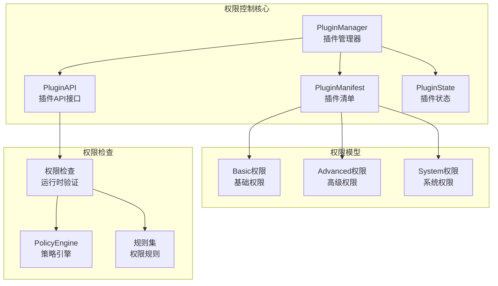
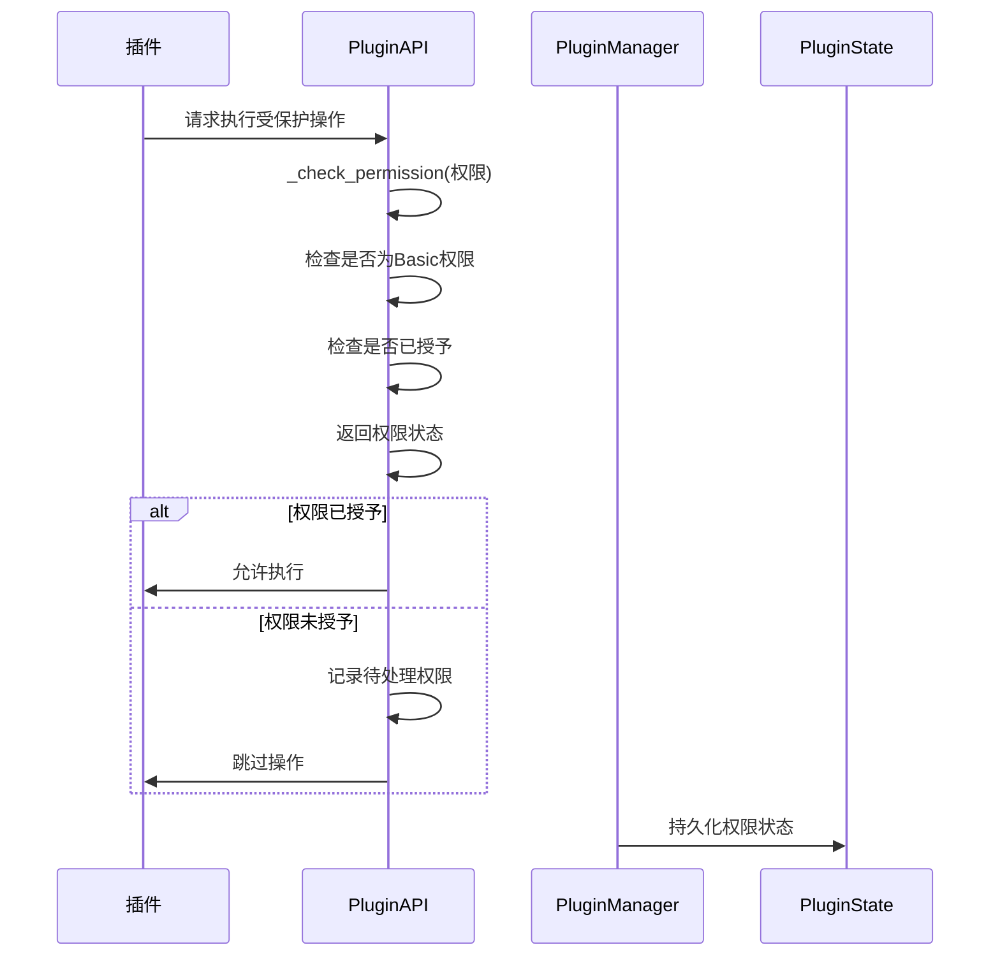
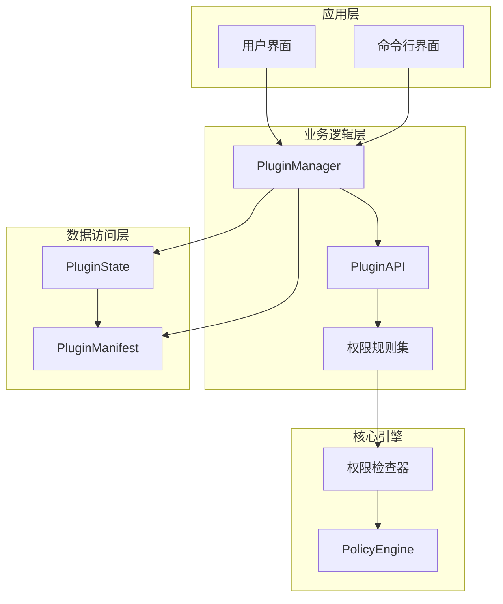
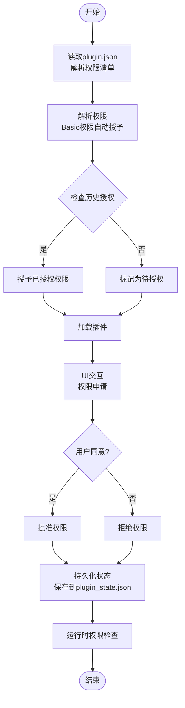
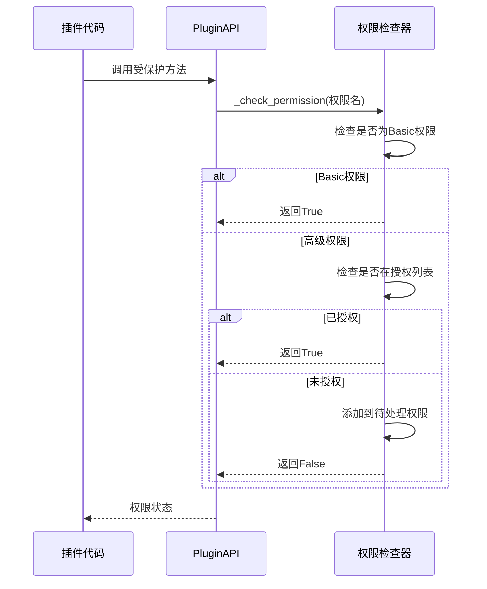
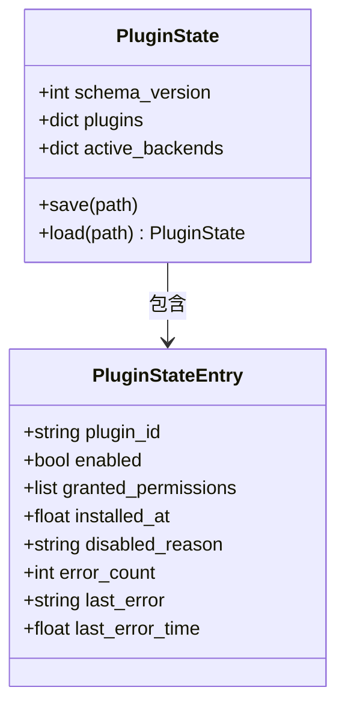
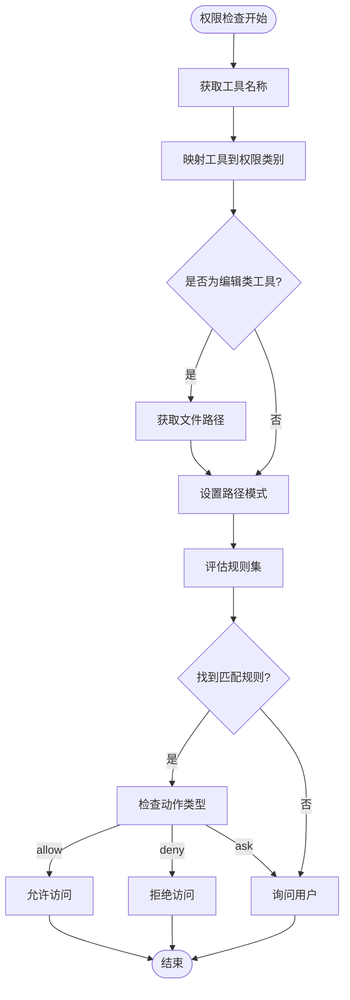
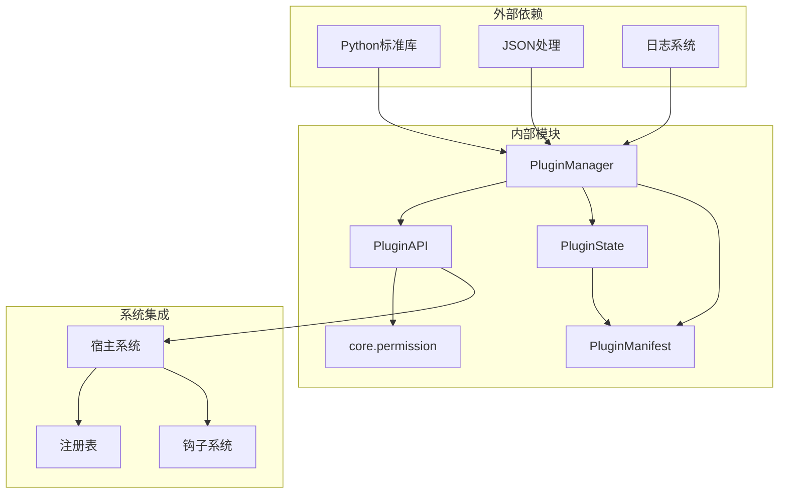

# 权限控制系统

<cite>
**本文档引用的文件**
- [src/synapse/plugins/manager.py](file://src/synapse/plugins/manager.py)
- [src/synapse/plugins/api.py](file://src/synapse/plugins/api.py)
- [src/synapse/plugins/manifest.py](file://src/synapse/plugins/manifest.py)
- [src/synapse/plugins/state.py](file://src/synapse/plugins/state.py)
- [src/synapse/core/permission.py](file://src/synapse/core/permission.py)
- [synapse-plugin-sdk/docs/permissions.md](file://synapse-plugin-sdk/docs/permissions.md)
- [tests/unit/test_plugins/test_api.py](file://tests/unit/test_plugins/test_api.py)
- [tests/unit/test_plugins/test_manager.py](file://tests/unit/test_plugins/test_manager.py)
- [tests/integration/test_plugins/test_lifecycle.py](file://tests/integration/test_plugins/test_lifecycle.py)
</cite>

## 目录
1. [简介](#简介)
2. [项目结构](#项目结构)
3. [核心组件](#核心组件)
4. [架构概览](#架构概览)
5. [详细组件分析](#详细组件分析)
6. [依赖关系分析](#依赖关系分析)
7. [性能考虑](#性能考虑)
8. [故障排除指南](#故障排除指南)
9. [结论](#结论)

## 简介

本文档详细阐述了Synapse插件权限控制系统的设计原理和实现机制。该系统采用三层权限模型（Basic、Advanced、System），通过严格的权限检查、状态管理和UI交互流程，确保插件对系统资源的安全访问。

权限控制系统主要包含以下核心特性：
- 三层权限模型设计，支持细粒度的权限控制
- 动态权限检查机制，在运行时验证插件操作
- 权限状态持久化，支持权限的授予、撤销和恢复
- 完整的UI交互流程，包括权限申请、审批和撤销
- 强大的错误处理和调试能力

## 项目结构

权限控制系统涉及多个关键模块，每个模块承担特定的职责：



**图表来源**
- [src/synapse/plugins/manager.py:44-781](file://src/synapse/plugins/manager.py#L44-L781)
- [src/synapse/plugins/api.py:60-697](file://src/synapse/plugins/api.py#L60-L697)
- [src/synapse/plugins/manifest.py:29-67](file://src/synapse/plugins/manifest.py#L29-L67)

**章节来源**
- [src/synapse/plugins/manager.py:1-781](file://src/synapse/plugins/manager.py#L1-L781)
- [src/synapse/plugins/api.py:1-697](file://src/synapse/plugins/api.py#L1-L697)
- [src/synapse/plugins/manifest.py:1-378](file://src/synapse/plugins/manifest.py#L1-L378)

## 核心组件

### 三层权限模型

权限控制系统采用三层权限模型，每层都有明确的职责和风险级别：

#### Basic权限（基础权限）
- **自动授予**：插件启动时自动获得
- **低风险操作**：日志记录、配置读写、工具注册、基础钩子
- **典型权限**：`log`、`config.read`、`config.write`、`tools.register`、`hooks.basic`、`data.own`

#### Advanced权限（高级权限）
- **用户确认**：需要用户明确同意
- **中等风险操作**：通道注册、记忆读写、检索源、路由、消息发送、宿主服务访问
- **典型权限**：`channel.register`、`channel.send`、`memory.read`、`memory.write`、`brain.access`

#### System权限（系统权限）
- **手动确认**：需要在设置中手动批准
- **高风险操作**：LLM注册、记忆替换、完整钩子访问、系统配置写入
- **典型权限**：`hooks.all`、`memory.replace`、`system.config.write`

**章节来源**
- [src/synapse/plugins/manifest.py:29-67](file://src/synapse/plugins/manifest.py#L29-L67)
- [synapse-plugin-sdk/docs/permissions.md:11-16](file://synapse-plugin-sdk/docs/permissions.md#L11-L16)

### 权限检查机制

权限检查在运行时进行，确保插件只能执行其被授予的操作：



**图表来源**
- [src/synapse/plugins/api.py:119-144](file://src/synapse/plugins/api.py#L119-L144)
- [src/synapse/plugins/manager.py:514-537](file://src/synapse/plugins/manager.py#L514-L537)

**章节来源**
- [src/synapse/plugins/api.py:119-144](file://src/synapse/plugins/api.py#L119-L144)
- [src/synapse/plugins/manager.py:514-556](file://src/synapse/plugins/manager.py#L514-L556)

## 架构概览

权限控制系统采用分层架构设计，确保各组件职责清晰、耦合度低：



**图表来源**
- [src/synapse/plugins/manager.py:44-781](file://src/synapse/plugins/manager.py#L44-L781)
- [src/synapse/plugins/api.py:60-697](file://src/synapse/plugins/api.py#L60-L697)
- [src/synapse/plugins/state.py:29-136](file://src/synapse/plugins/state.py#L29-L136)

### 权限申请、审批、撤销流程



**图表来源**
- [src/synapse/plugins/manager.py:514-556](file://src/synapse/plugins/manager.py#L514-L556)
- [synapse-plugin-sdk/docs/permissions.md:89-109](file://synapse-plugin-sdk/docs/permissions.md#L89-L109)

**章节来源**
- [synapse-plugin-sdk/docs/permissions.md:89-133](file://synapse-plugin-sdk/docs/permissions.md#L89-L133)
- [src/synapse/plugins/manager.py:514-570](file://src/synapse/plugins/manager.py#L514-L570)

## 详细组件分析

### PluginManager组件

PluginManager是权限控制系统的核心协调者，负责插件生命周期管理和权限分配：

#### 主要职责
- **插件发现**：扫描插件目录，识别可用插件
- **权限解析**：根据插件清单和历史状态解析授予权限
- **状态管理**：维护插件启用/禁用状态和权限历史
- **生命周期管理**：加载、卸载插件，处理错误和异常

#### 权限解析算法

```mermaid
algorithm
输入: 插件清单, 历史授权列表
输出: 最终授权列表
1. 初始化授权列表 = Basic权限集合
2. 遍历插件请求的所有权限
3. 如果权限属于Basic权限:
4. 跳过自动授予
5. 否则如果权限在历史授权中:
6. 将权限添加到授权列表
7. 否则:
8. 记录日志：权限未授权
9. 返回授权列表
```

**图表来源**
- [src/synapse/plugins/manager.py:514-537](file://src/synapse/plugins/manager.py#L514-L537)

**章节来源**
- [src/synapse/plugins/manager.py:165-247](file://src/synapse/plugins/manager.py#L165-L247)
- [src/synapse/plugins/manager.py:514-570](file://src/synapse/plugins/manager.py#L514-L570)

### PluginAPI组件

PluginAPI为插件提供受控的系统访问接口，所有敏感操作都必须通过API进行权限检查：

#### 权限检查流程



**图表来源**
- [src/synapse/plugins/api.py:119-144](file://src/synapse/plugins/api.py#L119-L144)

#### 支持的权限操作

| 权限类别 | 支持的方法 | 功能描述 |
|---------|-----------|----------|
| Basic权限 | `log()`, `get_config()`, `set_config()` | 日志记录、配置读写 |
| 工具注册 | `register_tools()` | 注册自定义工具 |
| 钩子注册 | `register_hook()` | 注册生命周期钩子 |
| 高级权限 | `register_channel()`, `send_message()` | 通道注册、消息发送 |
| 系统权限 | `register_memory_backend()` | 内存后端注册 |

**章节来源**
- [src/synapse/plugins/api.py:147-480](file://src/synapse/plugins/api.py#L147-L480)

### PluginState组件

PluginState负责权限状态的持久化存储，确保重启后权限信息不丢失：

#### 状态数据结构



**图表来源**
- [src/synapse/plugins/state.py:14-136](file://src/synapse/plugins/state.py#L14-L136)

**章节来源**
- [src/synapse/plugins/state.py:29-136](file://src/synapse/plugins/state.py#L29-L136)

### 权限规则系统

权限规则系统提供了灵活的权限控制机制，支持基于路径和工具类型的细粒度控制：

#### 规则匹配算法



**图表来源**
- [src/synapse/core/permission.py:103-177](file://src/synapse/core/permission.py#L103-L177)

**章节来源**
- [src/synapse/core/permission.py:103-495](file://src/synapse/core/permission.py#L103-L495)

## 依赖关系分析

权限控制系统各组件之间的依赖关系如下：



**图表来源**
- [src/synapse/plugins/manager.py:1-781](file://src/synapse/plugins/manager.py#L1-L781)
- [src/synapse/plugins/api.py:1-697](file://src/synapse/plugins/api.py#L1-L697)
- [src/synapse/plugins/state.py:1-136](file://src/synapse/plugins/state.py#L1-L136)

### 权限检查执行时机

权限检查在以下关键时机执行：

1. **插件加载阶段**：解析插件清单时进行初始权限检查
2. **API调用阶段**：每次调用受保护的API方法时
3. **钩子执行阶段**：触发各种生命周期钩子时
4. **状态变更阶段**：权限授予、撤销或修改时

**章节来源**
- [src/synapse/plugins/manager.py:257-299](file://src/synapse/plugins/manager.py#L257-L299)
- [src/synapse/plugins/api.py:119-144](file://src/synapse/plugins/api.py#L119-L144)

## 性能考虑

权限控制系统在设计时充分考虑了性能因素：

### 缓存机制
- **权限状态缓存**：已授予的权限在内存中缓存，避免重复计算
- **规则集缓存**：常用的权限规则集在内存中缓存
- **插件状态缓存**：插件的启用/禁用状态和错误计数缓存

### 优化策略
- **异步加载**：插件加载使用异步机制，避免阻塞主线程
- **超时控制**：所有插件操作都有超时限制
- **错误隔离**：单个插件的错误不会影响其他插件的正常运行

### 性能监控
- **加载时间统计**：记录插件加载的耗时
- **权限检查统计**：跟踪权限检查的频率和成功率
- **内存使用监控**：监控权限系统的内存占用

## 故障排除指南

### 常见问题及解决方案

#### 权限不足错误
**症状**：插件尝试执行受保护操作时抛出PluginPermissionError
**原因**：插件缺少必要的权限声明
**解决**：在plugin.json中添加相应的权限，然后重新授权

#### 插件加载失败
**症状**：插件无法加载或启动
**可能原因**：
- 权限检查失败
- 依赖项缺失
- 配置错误

**解决步骤**：
1. 检查插件日志文件
2. 验证plugin.json配置
3. 确认权限声明正确
4. 检查宿主系统依赖

#### 权限状态异常
**症状**：权限状态不一致或丢失
**解决**：
1. 检查plugin_state.json文件完整性
2. 重新授权相关权限
3. 清理损坏的状态文件

**章节来源**
- [tests/unit/test_plugins/test_api.py:227-242](file://tests/unit/test_plugins/test_api.py#L227-L242)
- [tests/integration/test_plugins/test_lifecycle.py:236-280](file://tests/integration/test_plugins/test_lifecycle.py#L236-L280)

### 调试方法

#### 日志分析
- **插件日志**：位于`data/plugins/{plugin_id}/logs/`目录
- **系统日志**：权限相关的警告和错误信息
- **调试输出**：详细的权限检查过程记录

#### 权限验证
- 使用测试用例验证权限检查逻辑
- 检查权限状态的持久化
- 验证权限撤销和恢复功能

**章节来源**
- [src/synapse/plugins/api.py:104-118](file://src/synapse/plugins/api.py#L104-L118)
- [tests/unit/test_plugins/test_manager.py:257-283](file://tests/unit/test_plugins/test_manager.py#L257-L283)

## 结论

Synapse插件权限控制系统通过三层权限模型、严格的权限检查机制和完善的UI交互流程，为插件生态提供了安全可靠的权限管理框架。系统的设计充分考虑了安全性、可扩展性和用户体验，在保证系统安全的同时，为开发者提供了灵活的权限控制能力。

主要优势包括：
- **分层权限模型**：清晰的权限等级划分，降低安全风险
- **动态权限检查**：实时验证插件操作，防止越权访问
- **完整的生命周期管理**：从权限申请到撤销的全流程支持
- **强大的错误处理**：完善的错误捕获和恢复机制
- **优秀的性能表现**：高效的权限检查和状态管理

该系统为构建安全、可靠、易用的插件生态系统奠定了坚实的基础。