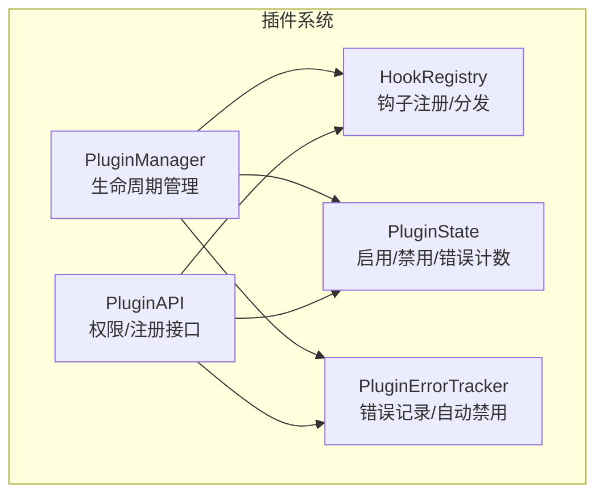
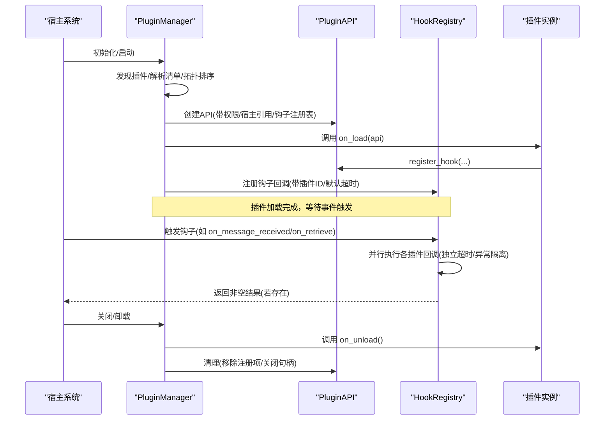
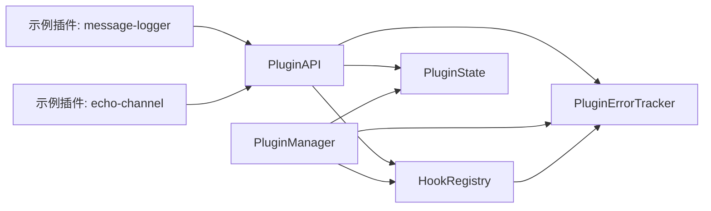
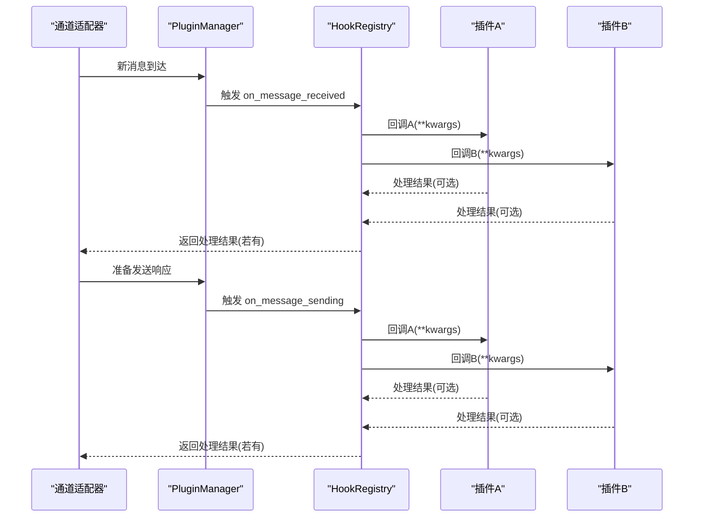

# 生命周期钩子

<cite>
**本文引用的文件列表**
- [hooks.py](file://src/synapse/plugins/hooks.py)
- [api.py](file://src/synapse/plugins/api.py)
- [manager.py](file://src/synapse/plugins/manager.py)
- [state.py](file://src/synapse/plugins/state.py)
- [sandbox.py](file://src/synapse/plugins/sandbox.py)
- [hooks.py](file://synapse-plugin-sdk/src/synapse_plugin_sdk/hooks.py)
- [test_hooks.py](file://tests/unit/test_plugins/test_hooks.py)
- [test_manager.py](file://tests/unit/test_plugins/test_manager.py)
- [echo-channel/plugin.py](file://examples/plugins/echo-channel/plugin.py)
- [message-logger/plugin.py](file://examples/plugins/message-logger/plugin.py)
</cite>

## 目录
1. [简介](#简介)
2. [项目结构](#项目结构)
3. [核心组件](#核心组件)
4. [架构总览](#架构总览)
5. [详细组件分析](#详细组件分析)
6. [依赖关系分析](#依赖关系分析)
7. [性能考量](#性能考量)
8. [故障排查指南](#故障排查指南)
9. [结论](#结论)
10. [附录](#附录)

## 简介
本指南面向插件开发者，系统讲解 Synapse 插件生命周期钩子体系：包含 14 个生命周期钩子（on_init、on_shutdown、on_message_received、on_message_sending、on_retrieve、on_tool_result、on_session_start、on_session_end、on_prompt_build、on_schedule、on_before_tool_use、on_after_tool_use、on_before_llm_call、on_config_change、on_error），覆盖钩子触发时机、参数传递、返回值规范、注册方式、执行顺序、异常与超时隔离、自动禁用策略，以及在资源初始化、清理、状态同步等场景中的实践方法。同时解释钩子与插件生命周期的关系，帮助你构建稳定、可维护的插件行为。

## 项目结构
围绕插件生命周期钩子的关键模块如下：
- 钩子注册与分发：src/synapse/plugins/hooks.py
- 插件 API 与权限控制：src/synapse/plugins/api.py
- 插件管理器与生命周期：src/synapse/plugins/manager.py
- 插件状态持久化：src/synapse/plugins/state.py
- 错误追踪与自动禁用：src/synapse/plugins/sandbox.py
- SDK 文档与钩子签名：synapse-plugin-sdk/src/synapse_plugin_sdk/hooks.py
- 示例插件：examples/plugins/echo-channel/plugin.py、examples/plugins/message-logger/plugin.py
- 单元测试：tests/unit/test_plugins/test_hooks.py、tests/unit/test_plugins/test_manager.py

图表来源
- [manager.py:44-781](file://src/synapse/plugins/manager.py#L44-L781)
- [hooks.py:53-225](file://src/synapse/plugins/hooks.py#L53-L225)
- [api.py:60-697](file://src/synapse/plugins/api.py#L60-L697)
- [state.py:29-136](file://src/synapse/plugins/state.py#L29-L136)
- [sandbox.py:20-127](file://src/synapse/plugins/sandbox.py#L20-L127)

章节来源
- [hooks.py:15-36](file://src/synapse/plugins/hooks.py#L15-L36)
- [api.py:253-294](file://src/synapse/plugins/api.py#L253-L294)
- [manager.py:257-299](file://src/synapse/plugins/manager.py#L257-L299)

## 核心组件
- HookRegistry：负责钩子注册、按名称分组、并发分发、超时与异常隔离、禁用插件跳过、统计信息。
- PluginAPI：向插件暴露受控能力，包括日志、配置读写、工具/通道/内存/检索/LLM 注册、钩子注册、宿主访问等；并进行权限校验。
- PluginManager：负责插件发现、拓扑排序、版本兼容性检查、加载/卸载/启用/禁用、错误记录与自动禁用、状态持久化。
- PluginState：持久化插件启用状态、权限授予、错误计数与最近错误时间。
- PluginErrorTracker：记录错误、滑动窗口统计、达到阈值后自动禁用插件，并回调卸载清理。

章节来源
- [hooks.py:53-225](file://src/synapse/plugins/hooks.py#L53-L225)
- [api.py:60-697](file://src/synapse/plugins/api.py#L60-L697)
- [manager.py:44-781](file://src/synapse/plugins/manager.py#L44-L781)
- [state.py:29-136](file://src/synapse/plugins/state.py#L29-L136)
- [sandbox.py:20-127](file://src/synapse/plugins/sandbox.py#L20-L127)

## 架构总览
下图展示插件生命周期钩子在系统中的位置与交互：

图表来源
- [manager.py:257-299](file://src/synapse/plugins/manager.py#L257-L299)
- [api.py:253-294](file://src/synapse/plugins/api.py#L253-L294)
- [hooks.py:108-156](file://src/synapse/plugins/hooks.py#L108-L156)

## 详细组件分析

### 钩子注册与分发（HookRegistry）
- 支持的钩子名称集合：on_init、on_shutdown、on_message_received、on_message_sending、on_retrieve、on_tool_result、on_session_start、on_session_end、on_prompt_build、on_schedule、on_before_tool_use、on_after_tool_use、on_before_llm_call、on_config_change、on_error。
- 注册：register(hook_name, callback, plugin_id=...)，自动设置回调元数据（插件ID、默认超时）。
- 分发：dispatch(hook_name, **kwargs) 并行执行，每个回调独立超时与异常捕获，失败不阻塞其他回调；返回非空结果列表。
- 同步分发：dispatch_sync(hook_name, **kwargs) 在当前线程串行执行，异步回调在独立线程运行，避免阻塞事件循环。
- 超时设置：set_timeout(hook_name, plugin_id, seconds) 为特定插件回调设置超时。
- 插件注销：unregister_plugin(plugin_id) 移除该插件所有钩子。
- 统计与清空：stats、clear。

章节来源
- [hooks.py:15-36](file://src/synapse/plugins/hooks.py#L15-L36)
- [hooks.py:64-107](file://src/synapse/plugins/hooks.py#L64-L107)
- [hooks.py:108-156](file://src/synapse/plugins/hooks.py#L108-L156)
- [hooks.py:158-214](file://src/synapse/plugins/hooks.py#L158-L214)

### 插件 API 与权限控制（PluginAPI）
- 权限检查：_check_permission(required, raise_on_deny=False)，未授权时记录告警或抛出 PluginPermissionError。
- 日志：log/log_error/log_debug，写入 data/plugins/{id}/logs/。
- 配置：get_config/set_config，读写 data/plugins/{id}/config.json。
- 工具注册：register_tools(definitions, handler)，支持去重与工具目录/目录注册表更新。
- 钩子注册：register_hook(hook_name, callback)，按钩子类型映射到不同权限（hooks.basic、hooks.message、hooks.retrieve、hooks.all）。
- 宿主访问：get_brain/get_memory_manager/get_vector_store/get_settings/send_message 等。
- 清理：_cleanup/_cleanup_tools/_cleanup_channels/_cleanup_mcp 等，卸载时移除注册项。

章节来源
- [api.py:119-144](file://src/synapse/plugins/api.py#L119-L144)
- [api.py:158-192](file://src/synapse/plugins/api.py#L158-L192)
- [api.py:195-250](file://src/synapse/plugins/api.py#L195-L250)
- [api.py:253-294](file://src/synapse/plugins/api.py#L253-L294)
- [api.py:482-558](file://src/synapse/plugins/api.py#L482-L558)

### 插件管理器与生命周期（PluginManager）
- 发现与排序：_discover_plugins/_topological_sort，循环依赖检测与排除。
- 加载：_load_single，创建 PluginAPI，调用插件 on_load，加载技能/工具/通道/MCP 等。
- 卸载：unload_plugin，调用插件 on_unload，清理 API 注册项。
- 启用/禁用：enable_plugin/disable_plugin，重置错误计数并尝试自动重载。
- 自动禁用：_on_plugin_auto_disabled，持久化禁用状态并异步卸载。
- 状态保存：_save_state，持久化插件状态。

章节来源
- [manager.py:165-247](file://src/synapse/plugins/manager.py#L165-L247)
- [manager.py:257-299](file://src/synapse/plugins/manager.py#L257-L299)
- [manager.py:573-601](file://src/synapse/plugins/manager.py#L573-L601)
- [manager.py:602-647](file://src/synapse/plugins/manager.py#L602-L647)

### 错误追踪与自动禁用（PluginErrorTracker）
- 记录错误：record_error(plugin_id, context, error)，滑动窗口内统计错误数量。
- 自动禁用：超过阈值（默认连续错误次数）后标记插件为禁用，并回调卸载清理。
- 查询与重置：is_disabled/get_errors/reset。

章节来源
- [sandbox.py:20-127](file://src/synapse/plugins/sandbox.py#L20-L127)

### 插件状态持久化（PluginState）
- 字段：enabled、granted_permissions、disabled_reason、error_count、last_error、last_error_time。
- 操作：enable/disable、record_error、save/load、迁移兼容。

章节来源
- [state.py:29-136](file://src/synapse/plugins/state.py#L29-L136)

### SDK 钩子常量与签名
- HOOK_NAMES：定义可用钩子集合。
- HOOK_SIGNATURES：每个钩子的描述、参数、权限、返回值与示例。

章节来源
- [hooks.py:15-32](file://synapse-plugin-sdk/src/synapse_plugin_sdk/hooks.py#L15-L32)
- [hooks.py:34-166](file://synapse-plugin-sdk/src/synapse_plugin_sdk/hooks.py#L34-L166)

## 依赖关系分析
- HookRegistry 依赖 PluginErrorTracker 实现错误隔离与自动禁用。
- PluginManager 依赖 HookRegistry、PluginState、PluginErrorTracker 实现生命周期管理与状态持久化。
- PluginAPI 依赖 HookRegistry、PluginState、PluginErrorTracker 提供权限控制与错误上报。
- 示例插件通过 PluginAPI 注册钩子与能力。

图表来源
- [hooks.py:60-63](file://src/synapse/plugins/hooks.py#L60-L63)
- [manager.py:64-67](file://src/synapse/plugins/manager.py#L64-L67)
- [api.py:84-85](file://src/synapse/plugins/api.py#L84-L85)

章节来源
- [hooks.py:60-63](file://src/synapse/plugins/hooks.py#L60-L63)
- [manager.py:64-67](file://src/synapse/plugins/manager.py#L64-L67)
- [api.py:84-85](file://src/synapse/plugins/api.py#L84-L85)

## 性能考量
- 并行分发：HookRegistry 对同一钩子的多个回调采用 asyncio.gather 并行执行，提升吞吐。
- 线程封装：同步回调通过 asyncio.to_thread 包装，避免阻塞事件循环。
- 超时控制：默认超时与按插件设置的超时，防止慢回调拖垮系统。
- 异常隔离：捕获 BaseException，确保单个回调异常不影响其他回调。
- 滑动窗口：PluginErrorTracker 使用固定窗口统计错误，避免长期累积导致误判。

章节来源
- [hooks.py:120-156](file://src/synapse/plugins/hooks.py#L120-L156)
- [hooks.py:175-214](file://src/synapse/plugins/hooks.py#L175-L214)
- [sandbox.py:32-53](file://src/synapse/plugins/sandbox.py#L32-L53)

## 故障排查指南
- 钩子未触发
  - 检查是否已通过 PluginAPI.register_hook 正确注册。
  - 确认钩子名称在允许集合中。
  - 查看插件是否被自动禁用（错误过多）。
- 回调异常
  - 查看宿主日志与插件日志（data/plugins/{id}/logs/）。
  - 使用 PluginErrorTracker.get_errors(plugin_id) 获取最近错误。
- 超时问题
  - 适当提高 set_timeout 或优化回调逻辑。
  - 将耗时任务放入后台任务或外部服务。
- 插件被自动禁用
  - 检查错误计数与最近错误。
  - 通过 enable_plugin 重试加载。
- 卸载失败
  - 确认 on_unload 是否抛出异常。
  - 检查 API 清理流程是否完整。

章节来源
- [hooks.py:135-153](file://src/synapse/plugins/hooks.py#L135-L153)
- [sandbox.py:32-53](file://src/synapse/plugins/sandbox.py#L32-L53)
- [manager.py:602-647](file://src/synapse/plugins/manager.py#L602-L647)
- [api.py:482-558](file://src/synapse/plugins/api.py#L482-L558)

## 结论
Synapse 的插件生命周期钩子体系通过 HookRegistry 提供高可靠、高隔离的回调执行模型，结合 PluginAPI 的权限控制与 PluginManager 的生命周期管理，使插件能够在不破坏宿主稳定性的情况下扩展能力。遵循本文的注册方式、参数约定、异常处理与性能建议，可以构建健壮且可维护的插件系统。

## 附录

### 钩子清单与规范
- 钩子名称集合：on_init、on_shutdown、on_message_received、on_message_sending、on_retrieve、on_tool_result、on_session_start、on_session_end、on_prompt_build、on_schedule、on_before_tool_use、on_after_tool_use、on_before_llm_call、on_config_change、on_error。
- 参数与权限
  - on_init/on_shutdown/on_schedule/on_config_change/on_error：基础权限（hooks.basic）。
  - on_message_received/on_message_sending/on_session_start/on_session_end：消息权限（hooks.message）。
  - on_retrieve/on_tool_result/on_prompt_build/on_before_tool_use/on_after_tool_use：检索权限（hooks.retrieve）。
- 返回值
  - 通用：忽略返回值（None）。
  - on_prompt_build：可返回字符串以追加到系统提示词末尾。
- 注册方式
  - 通过 PluginAPI.register_hook(hook_name, callback) 注册，SDK 提供签名与示例。
- 执行顺序
  - 并行分发，不保证回调执行顺序；回调内部应避免共享状态竞争。
- 超时与异常
  - 默认超时；可通过 set_timeout(hook_name, plugin_id, seconds) 设置。
  - 异常被捕获并记录，不影响其他回调；错误过多会触发自动禁用。

章节来源
- [hooks.py:15-36](file://src/synapse/plugins/hooks.py#L15-L36)
- [hooks.py:258-284](file://src/synapse/plugins/api.py#L258-L284)
- [hooks.py:34-166](file://synapse-plugin-sdk/src/synapse_plugin_sdk/hooks.py#L34-L166)

### 典型使用场景与实现示例
- 资源初始化
  - 在 on_load 中通过 PluginAPI.register_* 注册工具/通道/LLM 提供者/检索源等。
  - 示例：echo-channel 插件在 on_load 中注册通道与 on_message_received 钩子。
- 状态同步
  - 使用 on_session_start/on_session_end 监听会话生命周期，维护会话上下文。
- 消息拦截与处理
  - 使用 on_message_received/on_message_sending 记录或修改消息内容。
  - 示例：message-logger 插件记录收发消息到 JSON Lines 文件。
- 工具链观测
  - 使用 on_before_tool_use/on_after_tool_use/on_tool_result 观测工具调用结果与耗时。
- 配置变更
  - 使用 on_config_change 响应配置更新，动态调整行为。
- 清理与卸载
  - 在 on_unload 中释放资源，或依赖 PluginManager 的自动清理。

章节来源
- [echo-channel/plugin.py:86-109](file://examples/plugins/echo-channel/plugin.py#L86-L109)
- [message-logger/plugin.py:45-86](file://examples/plugins/message-logger/plugin.py#L45-L86)
- [manager.py:573-601](file://src/synapse/plugins/manager.py#L573-L601)

### 钩子触发序列图（示例：消息收发）

图表来源
- [hooks.py:108-156](file://src/synapse/plugins/hooks.py#L108-L156)
- [api.py:253-294](file://src/synapse/plugins/api.py#L253-L294)