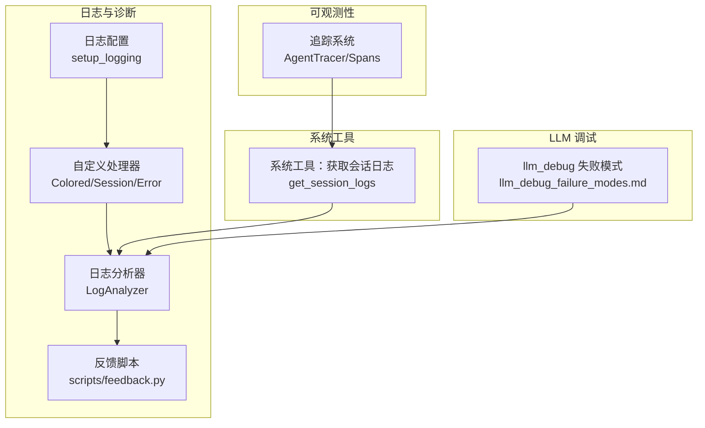
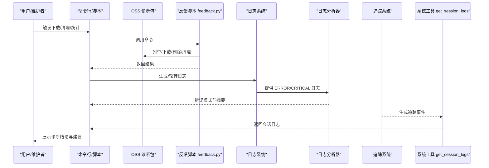
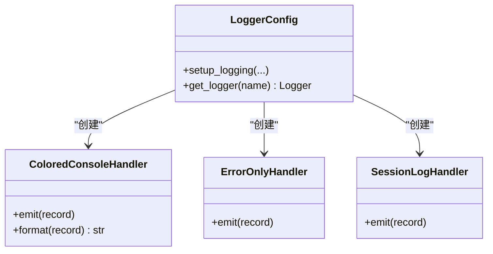
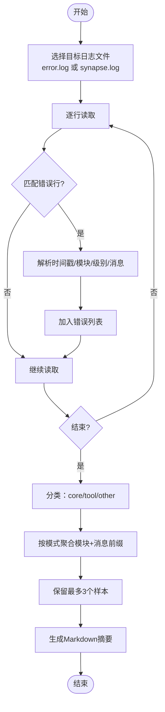
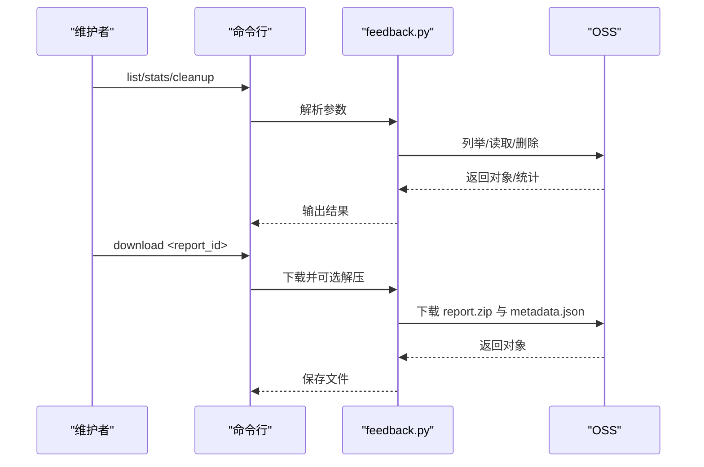
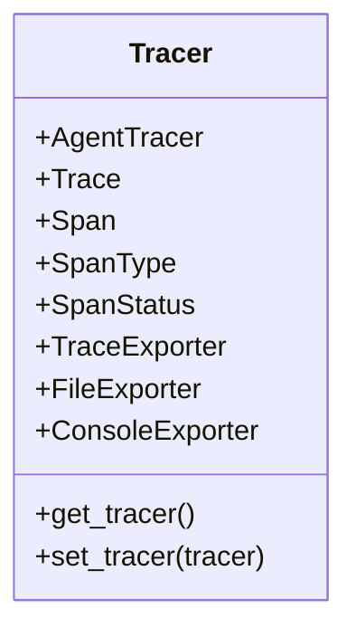
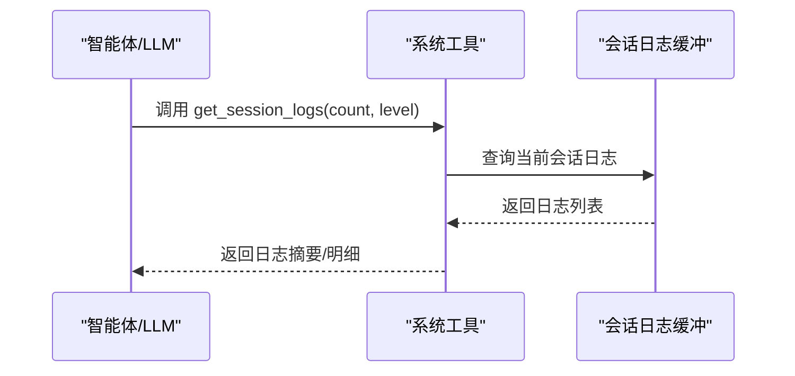
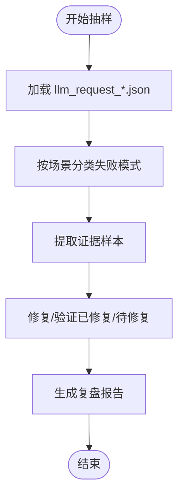
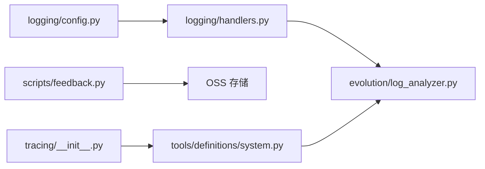

# 故障排除和常见问题

<cite>
**本文引用的文件**   
- [README.md](file://README.md)
- [feedback-debug-guide.md](file://docs/feedback-debug-guide.md)
- [llm_debug_failure_modes.md](file://docs/llm_debug_failure_modes.md)
- [errors.py](file://src/synapse/core/errors.py)
- [config.py](file://src/synapse/logging/config.py)
- [handlers.py](file://src/synapse/logging/handlers.py)
- [log_analyzer.py](file://src/synapse/evolution/log_analyzer.py)
- [feedback.py](file://scripts/feedback.py)
- [__init__.py](file://src/synapse/tracing/__init__.py)
- [system.py](file://src/synapse/tools/definitions/system.py)
</cite>

## 目录
1. [简介](#简介)
2. [项目结构](#项目结构)
3. [核心组件](#核心组件)
4. [架构总览](#架构总览)
5. [详细组件分析](#详细组件分析)
6. [依赖关系分析](#依赖关系分析)
7. [性能考量](#性能考量)
8. [故障排除指南](#故障排除指南)
9. [结论](#结论)
10. [附录](#附录)

## 简介
本文件面向使用者与维护者，提供系统性的故障排除与常见问题解决方案。内容涵盖：
- 常见问题的诊断方法与步骤
- 错误代码与错误类型的含义解释
- 性能问题的定位技巧
- 日志分析方法、调试工具使用与系统可观测性指标
- 典型故障案例、解决步骤与预防措施
- 紧急情况处理流程与用户自助排障指引

## 项目结构
围绕故障排除的关键子系统包括：日志系统、错误与异常、可观测性追踪、反馈收集与诊断包、LLM 调试抽样复盘、以及系统工具（如获取会话日志）。

图示来源
- [config.py:20-107](file://src/synapse/logging/config.py#L20-L107)
- [handlers.py:19-169](file://src/synapse/logging/handlers.py#L19-L169)
- [log_analyzer.py:66-421](file://src/synapse/evolution/log_analyzer.py#L66-L421)
- [feedback.py:105-353](file://scripts/feedback.py#L105-L353)
- [__init__.py:1-32](file://src/synapse/tracing/__init__.py#L1-L32)
- [system.py:159-196](file://src/synapse/tools/definitions/system.py#L159-L196)
- [llm_debug_failure_modes.md:1-85](file://docs/llm_debug_failure_modes.md#L1-L85)

章节来源
- [README.md:1-719](file://README.md#L1-L719)

## 核心组件
- 日志系统：提供根日志器配置、文件与控制台输出、错误日志专用轮转、会话日志缓存处理器，便于按会话维度检索与分析。
- 错误与异常：定义用户取消等核心异常类型，便于在任务中断、工具执行失败等场景进行结构化处理。
- 日志分析器：仅提取 ERROR/CRITICAL 级别日志，支持关键词检索、错误模式分类与摘要生成，辅助自动化诊断与修复建议。
- 反馈与诊断包：通过 OSS 存储与脚本化管理，支持下载、解压、分析、清理与统计，形成闭环的用户反馈处理流程。
- 可观测性追踪：提供结构化追踪能力，覆盖 LLM 调用、工具执行、记忆操作、上下文压缩与推理循环，支持多种导出器。
- 系统工具：提供获取当前会话系统日志的能力，便于在命令失败、无预期效果或需要理解先前操作结果时进行定位。
- LLM 调试抽样复盘：基于真实请求日志，归类可复现的失败模式，验证 Prompt/工具/网关协议与切模隔离的有效性。

章节来源
- [config.py:20-107](file://src/synapse/logging/config.py#L20-L107)
- [handlers.py:19-169](file://src/synapse/logging/handlers.py#L19-L169)
- [errors.py:6-21](file://src/synapse/core/errors.py#L6-L21)
- [log_analyzer.py:66-421](file://src/synapse/evolution/log_analyzer.py#L66-L421)
- [feedback.py:105-353](file://scripts/feedback.py#L105-L353)
- [__init__.py:1-32](file://src/synapse/tracing/__init__.py#L1-L32)
- [system.py:159-196](file://src/synapse/tools/definitions/system.py#L159-L196)
- [llm_debug_failure_modes.md:1-85](file://docs/llm_debug_failure_modes.md#L1-L85)

## 架构总览
下图展示了故障排除相关组件之间的交互关系与数据流：

图示来源
- [feedback.py:105-353](file://scripts/feedback.py#L105-L353)
- [config.py:20-107](file://src/synapse/logging/config.py#L20-L107)
- [handlers.py:117-169](file://src/synapse/logging/handlers.py#L117-L169)
- [log_analyzer.py:66-421](file://src/synapse/evolution/log_analyzer.py#L66-L421)
- [__init__.py:1-32](file://src/synapse/tracing/__init__.py#L1-L32)
- [system.py:159-196](file://src/synapse/tools/definitions/system.py#L159-L196)

## 详细组件分析

### 日志系统与处理器
- 根日志器配置：支持控制台与文件输出，文件按大小轮转，错误日志按天轮转，会话日志处理器按会话维度缓存。
- 自定义处理器：
  - 彩色控制台处理器：按级别着色输出，兼容 Windows 终端颜色与编码。
  - 错误仅记录处理器：仅输出 ERROR/CRITICAL 级别，便于聚焦问题。
  - 会话日志处理器：将日志写入内存缓冲，按 session_id 分组，供 AI 查询当前会话日志。
- 日志格式与第三方库抑制：减少无关库噪音，提升可读性。

图示来源
- [config.py:20-107](file://src/synapse/logging/config.py#L20-L107)
- [handlers.py:19-169](file://src/synapse/logging/handlers.py#L19-L169)

章节来源
- [config.py:20-107](file://src/synapse/logging/config.py#L20-L107)
- [handlers.py:19-169](file://src/synapse/logging/handlers.py#L19-L169)

### 日志分析器（LogAnalyzer）
- 仅提取 ERROR/CRITICAL 级别日志，逐行扫描，避免全量加载。
- 支持关键词检索，按需获取上下文。
- 错误分类：区分核心组件与工具组件，工具组件可尝试自动修复。
- 错误模式聚合：按模块名+消息前缀聚类，保留最多 3 个样本，生成 Markdown 摘要，便于 LLM 分析。

图示来源
- [log_analyzer.py:105-200](file://src/synapse/evolution/log_analyzer.py#L105-L200)
- [log_analyzer.py:253-360](file://src/synapse/evolution/log_analyzer.py#L253-L360)

章节来源
- [log_analyzer.py:66-421](file://src/synapse/evolution/log_analyzer.py#L66-L421)

### 反馈与诊断包管理（scripts/feedback.py）
- 列表：按天/类型筛选 OSS 中的诊断包。
- 下载：支持自动解压与元数据保存。
- 删除：按 report_id 删除对应前缀下的所有对象。
- 清理：批量删除超过 N 天的旧诊断包。
- 统计：按类型与状态统计近 N 天的反馈数据。

图示来源
- [feedback.py:105-353](file://scripts/feedback.py#L105-L353)

章节来源
- [feedback.py:105-353](file://scripts/feedback.py#L105-L353)

### 可观测性追踪（AgentTracer）
- 覆盖 LLM 调用、工具执行、记忆操作、上下文压缩、推理循环等关键环节。
- 支持导出器：文件 JSON、控制台、OpenTelemetry（可选）。
- 与系统工具结合：通过 get_session_logs 获取会话日志，结合追踪事件进行交叉验证。

图示来源
- [__init__.py:1-32](file://src/synapse/tracing/__init__.py#L1-L32)

章节来源
- [__init__.py:1-32](file://src/synapse/tracing/__init__.py#L1-L32)

### 系统工具：获取会话日志（get_session_logs）
- 作用：在命令失败、遇到错误、或需要了解先前操作结果时，调用该工具查看日志。
- 输出：包含命令详情、错误信息、系统状态等，便于快速定位问题。

图示来源
- [system.py:159-196](file://src/synapse/tools/definitions/system.py#L159-L196)

章节来源
- [system.py:159-196](file://src/synapse/tools/definitions/system.py#L159-L196)

### LLM 调试抽样复盘（llm_debug）
- 基于真实请求日志，归类可复现的失败模式，验证 Prompt/工具/网关协议与切模隔离是否生效。
- 典型模式：CLI/非 IM 场景误用“发送工具”、重复交付/确认刷屏、切模/超时后上下文与工具状态误继承、两段式 Prompt 的“编译器输出污染 user messages”。

图示来源
- [llm_debug_failure_modes.md:1-85](file://docs/llm_debug_failure_modes.md#L1-L85)

章节来源
- [llm_debug_failure_modes.md:1-85](file://docs/llm_debug_failure_modes.md#L1-L85)

## 依赖关系分析
- 日志系统依赖：logging 标准库、RotatingFileHandler/TimedRotatingFileHandler、自定义处理器。
- 日志分析器依赖：正则表达式、datetime、Pathlib，按 ERROR/CRITICAL 过滤与模式聚合。
- 反馈脚本依赖：oss2 SDK、UTC 时间、路径操作。
- 可观测性追踪依赖：导出器接口抽象，支持多种输出。
- 系统工具依赖：会话日志缓冲与系统状态查询。

图示来源
- [config.py:20-107](file://src/synapse/logging/config.py#L20-L107)
- [handlers.py:19-169](file://src/synapse/logging/handlers.py#L19-L169)
- [log_analyzer.py:66-421](file://src/synapse/evolution/log_analyzer.py#L66-L421)
- [feedback.py:105-353](file://scripts/feedback.py#L105-L353)
- [__init__.py:1-32](file://src/synapse/tracing/__init__.py#L1-L32)
- [system.py:159-196](file://src/synapse/tools/definitions/system.py#L159-L196)

章节来源
- [config.py:20-107](file://src/synapse/logging/config.py#L20-L107)
- [handlers.py:19-169](file://src/synapse/logging/handlers.py#L19-L169)
- [log_analyzer.py:66-421](file://src/synapse/evolution/log_analyzer.py#L66-L421)
- [feedback.py:105-353](file://scripts/feedback.py#L105-L353)
- [__init__.py:1-32](file://src/synapse/tracing/__init__.py#L1-L32)
- [system.py:159-196](file://src/synapse/tools/definitions/system.py#L159-L196)

## 性能考量
- 日志轮转与容量控制：按大小轮转主日志、按天轮转错误日志，避免磁盘占用过大。
- 日志级别与第三方库噪音：降低 httpx/telegram/urllib3 等库日志级别，减少干扰。
- 会话日志缓冲：按会话维度缓存，避免全量日志带来的内存压力。
- LLM 调试抽样：仅对近期请求进行抽样，降低分析成本。
- 可观测性导出：支持文件与控制台导出，必要时再启用 OTEL 导出器以减少开销。

章节来源
- [config.py:64-106](file://src/synapse/logging/config.py#L64-L106)
- [handlers.py:117-169](file://src/synapse/logging/handlers.py#L117-L169)
- [llm_debug_failure_modes.md:7-8](file://docs/llm_debug_failure_modes.md#L7-L8)

## 故障排除指南

### 一、常见问题与诊断方法
- 会话日志不足或为空
  - 现象：调用 get_session_logs 返回空或少量日志。
  - 诊断：确认是否正确传入 session_id；检查会话日志处理器是否启用；查看 error.log 是否有 ERROR 级别日志。
  - 工具：get_session_logs(count, level=ERROR) 快速定位。
- 命令执行失败但无预期效果
  - 现象：工具返回错误码或无反馈。
  - 诊断：调用 get_session_logs 查看命令详情与错误信息；结合追踪事件确认工具执行状态。
- 重复交付/重复确认刷屏
  - 现象：模型不断宣称“已完成/已发送”，但无可验证回执。
  - 诊断：检查 deliver_artifacts 回执字段与会话内去重逻辑；确认 TaskVerify 以回执为准。
- 切模/超时后工具状态误继承
  - 现象：新模型继续沿用旧工具上下文，导致工具链断裂。
  - 诊断：确认是否在切模后注入 tool-state revalidation barrier；检查 conversation_id 重置逻辑。

章节来源
- [system.py:159-196](file://src/synapse/tools/definitions/system.py#L159-L196)
- [log_analyzer.py:105-200](file://src/synapse/evolution/log_analyzer.py#L105-L200)
- [llm_debug_failure_modes.md:33-75](file://docs/llm_debug_failure_modes.md#L33-L75)

### 二、错误代码与错误类型含义
- 用户取消（UserCancelledError）
  - 触发：用户发送停止指令（如“停止”、“stop”、“取消”）。
  - 影响：中断 LLM 调用或工具执行，携带 reason 与 source（llm_call/tool_exec）。
- 工具错误（ToolError）
  - 分类：超时（TIMEOUT）、资源未找到（RESOURCE_NOT_FOUND）、权限（PERMISSION）、校验（VALIDATION）、瞬时错误（TRANSIENT）、依赖（DEPENDENCY）、速率限制（RATE_LIMIT）、其他（PERMANENT）。
  - 建议：根据 error_type 与 retry_suggestion 进行重试或替代工具。
- 插件错误（PluginError）
  - 分类：安装包异常（ZIP_BOMB/ZIP_INVALID）、配置无效（CONFIG_INVALID）、无效 ID（INVALID_ID）、管理器不可用（MANAGER_UNAVAILABLE）、内部错误（INTERNAL_ERROR）。
  - 建议：依据 guidance 提示重置配置、更换安装源或等待系统启动。

章节来源
- [errors.py:6-21](file://src/synapse/core/errors.py#L6-L21)
- [tools/errors.py:107-154](file://src/synapse/tools/errors.py#L107-L154)
- [plugins/errors.py:116-190](file://src/synapse/plugins/errors.py#L116-L190)

### 三、性能问题定位技巧
- 使用日志分析器按 ERROR/CRITICAL 过滤，快速识别高频错误模式。
- 结合 get_session_logs 与追踪事件，定位工具执行耗时与失败节点。
- 通过 llm_debug 抽样复盘，识别切模/超时后的状态继承问题与上下文污染。
- 控制日志级别与第三方库噪音，减少 I/O 压力。

章节来源
- [log_analyzer.py:105-200](file://src/synapse/evolution/log_analyzer.py#L105-L200)
- [system.py:159-196](file://src/synapse/tools/definitions/system.py#L159-L196)
- [llm_debug_failure_modes.md:5-8](file://docs/llm_debug_failure_modes.md#L5-L8)

### 四、日志分析方法
- 步骤
  1) 确认日志文件：优先 error.log（仅 ERROR/CRITICAL），其次 synapse.log。
  2) 使用 LogAnalyzer.extract_errors_only 或 search_by_keyword 获取上下文。
  3) 生成错误摘要，按核心组件与工具组件分类，识别可自动修复项。
- 关键点
  - 时间线：按时间戳排序，关注首次/最后出现时间。
  - Traceback：保留前几行关键堆栈，便于快速定位。
  - 模式聚合：去除动态内容后聚类，识别重复模式。

章节来源
- [log_analyzer.py:105-200](file://src/synapse/evolution/log_analyzer.py#L105-L200)
- [log_analyzer.py:253-360](file://src/synapse/evolution/log_analyzer.py#L253-L360)

### 五、调试工具使用
- get_session_logs：在命令失败、无预期效果或需要理解先前操作结果时调用，返回命令详情、错误信息与系统状态。
- 反馈脚本 feedback.py：下载/清理/统计诊断包，支持自动解压与批量清理过期数据。
- 日志分析器：仅提取 ERROR/CRITICAL，支持关键词检索与错误模式分类。

章节来源
- [system.py:159-196](file://src/synapse/tools/definitions/system.py#L159-L196)
- [feedback.py:105-353](file://scripts/feedback.py#L105-L353)
- [log_analyzer.py:105-200](file://src/synapse/evolution/log_analyzer.py#L105-L200)

### 六、系统监控指标
- 日志级别与文件轮转：ERROR/CRITICAL 与按天轮转的 error.log，有助于快速定位严重问题。
- 会话日志缓冲：按 session_id 分组，便于跨模块交叉验证。
- 追踪事件：覆盖 LLM 调用、工具执行、记忆操作、上下文压缩与推理循环，便于端到端性能分析。
- LLM 调试：基于真实请求日志的抽样复盘，验证切模/超时后的稳定性与一致性。

章节来源
- [config.py:64-106](file://src/synapse/logging/config.py#L64-L106)
- [handlers.py:117-169](file://src/synapse/logging/handlers.py#L117-L169)
- [__init__.py:1-32](file://src/synapse/tracing/__init__.py#L1-L32)
- [llm_debug_failure_modes.md:7-8](file://docs/llm_debug_failure_modes.md#L7-L8)

### 七、典型故障案例与解决步骤
- 案例1：CLI 场景下“发送工具”未实际交付
  - 现象：模型仍尝试使用 IM 发送能力，但 CLI 不会交付附件，导致用户反馈“未收到文件”。
  - 证据：llm_request_* 中 system_prompt 包含 CLI 规则与用户反馈。
  - 解决：Prompt 侧不再提示 send_to_chat；IM 附件交付统一为 deliver_artifacts。
- 案例2：重复交付/重复确认刷屏
  - 现象：模型宣称“已完成/已发送”，但无 deliver_artifacts 回执。
  - 证据：get_session_logs 中多次执行 send_to_chat。
  - 解决：deliver_artifacts 增加回执字段与会话内去重；TaskVerify 以回执为准。
- 案例3：切模/超时后上下文与工具状态误继承
  - 现象：新模型沿用旧工具上下文，导致工具链断裂。
  - 证据：get_session_logs 中包含 Model switched 记录。
  - 解决：在切模/故障转移后重置 messages/计数器并注入 tool-state revalidation barrier。
- 案例4：两段式 Prompt 的“编译器输出污染 user messages”
  - 现象：编译器输出被当作 user message 注入，导致消息膨胀与重复约束。
  - 解决：编译器输出仅做短摘要，注入到 system/developer 的 TaskDefinition 并复用为 memory query。

章节来源
- [llm_debug_failure_modes.md:10-75](file://docs/llm_debug_failure_modes.md#L10-L75)

### 八、预防措施
- Prompt 设计：避免在 CLI 场景提示 IM 发送能力；统一交付工具与回执字段。
- 工具设计：为 deliver_artifacts 增加 per-session 去重键；在切模/超时后注入状态复核屏障。
- 日志规范：仅在 ERROR/CRITICAL 级别输出关键堆栈；使用会话日志缓冲按会话维度检索。
- 自动化：利用日志分析器与 llm_debug 抽样，建立可复现的失败模式库，推动自动修复。

章节来源
- [llm_debug_failure_modes.md:27-75](file://docs/llm_debug_failure_modes.md#L27-L75)
- [log_analyzer.py:253-360](file://src/synapse/evolution/log_analyzer.py#L253-L360)

### 九、紧急情况处理流程
- 快速定位：使用 get_session_logs(level=ERROR) 获取错误日志；结合追踪事件定位失败节点。
- 降级与恢复：在切模/超时场景，确保注入 tool-state revalidation barrier；必要时回退至稳定端点。
- 诊断包：通过 feedback.py 下载诊断包，按 metadata.json 与 logs/llm_debug/images 分析根因。
- 清理与统计：定期清理过期诊断包（cleanup --days 90），统计反馈趋势（stats --days 30）。

章节来源
- [system.py:159-196](file://src/synapse/tools/definitions/system.py#L159-L196)
- [feedback.py:211-258](file://scripts/feedback.py#L211-L258)
- [llm_debug_failure_modes.md:58-75](file://docs/llm_debug_failure_modes.md#L58-L75)

### 十、用户自助排障指引
- 在命令失败或无预期效果时，调用 get_session_logs 并按 level 过滤 ERROR，查看错误信息与系统状态。
- 若涉及 IM 交付问题，确认 deliver_artifacts 回执是否存在；若无回执，按 INCOMPLETE 处理。
- 若怀疑切模/超时导致状态异常，重新执行相关工具前先进行状态复核（如 browser_status/list_mcp_servers/desktop_window）。
- 若问题持续，准备诊断包并通过反馈渠道提交，以便进一步分析。

章节来源
- [system.py:159-196](file://src/synapse/tools/definitions/system.py#L159-L196)
- [llm_debug_failure_modes.md:58-75](file://docs/llm_debug_failure_modes.md#L58-L75)

## 结论
通过完善的日志系统、可观测性追踪、系统工具与反馈管理机制，本项目提供了从问题发现、定位到修复与预防的完整闭环。建议在日常运维中：
- 优先使用 get_session_logs 与追踪事件进行快速定位；
- 借助日志分析器与 llm_debug 抽样复盘，沉淀失败模式；
- 严格执行切模/超时后的状态复核与回执验证；
- 定期清理诊断包与统计反馈趋势，持续改进系统稳定性。

## 附录
- 反馈与诊断包管理命令参考
  - 列表：python scripts/feedback.py list [--days N] [--type bug|feature]
  - 下载：python scripts/feedback.py download <report_id> [--output DIR] [--extract]
  - 删除：python scripts/feedback.py delete <report_id> [--yes]
  - 清理：python scripts/feedback.py cleanup --days N [--yes]
  - 统计：python scripts/feedback.py stats [--days N]

章节来源
- [feedback.py:311-353](file://scripts/feedback.py#L311-L353)