# 安全审计与监控

<cite>
**本文引用的文件**
- [audit_logger.py](file://src/synapse/core/audit_logger.py)
- [policy.py](file://src/synapse/core/policy.py)
- [config.py](file://src/synapse/logging/config.py)
- [handlers.py](file://src/synapse/logging/handlers.py)
- [event_store.py](file://src/synapse/orgs/event_store.py)
- [notifier.py](file://src/synapse/orgs/notifier.py)
- [heartbeat.py](file://src/synapse/orgs/heartbeat.py)
- [events.py](file://src/synapse/events.py)
- [streamEvents.ts](file://apps/setup-center/src/streamEvents.ts)
- [websocket.ts](file://apps/setup-center/src/platform/websocket.ts)
- [config.py](file://src/synapse/api/routes/config.py)
- [test_security.py](file://tests/unit/test_security.py)
</cite>

## 目录
1. [简介](#简介)
2. [项目结构](#项目结构)
3. [核心组件](#核心组件)
4. [架构总览](#架构总览)
5. [详细组件分析](#详细组件分析)
6. [依赖关系分析](#依赖关系分析)
7. [性能考量](#性能考量)
8. [故障排查指南](#故障排查指南)
9. [结论](#结论)
10. [附录](#附录)

## 简介
本文件面向安全运营与运维团队，系统性梳理 Synapse 安全审计与监控体系，覆盖审计日志生成机制（操作记录、访问日志、安全事件追踪）、监控指标体系（性能、安全、业务）、实时监控告警与事件响应流程，并提供配置示例、监控仪表板与告警规则建议、日志分析与容量规划思路。

## 项目结构
围绕“审计与监控”的关键代码分布在以下模块：
- 审计与策略：src/synapse/core/audit_logger.py、src/synapse/core/policy.py
- 日志系统：src/synapse/logging/config.py、src/synapse/logging/handlers.py
- 组织事件与报告：src/synapse/orgs/event_store.py、src/synapse/orgs/notifier.py、src/synapse/orgs/heartbeat.py
- 实时事件协议：src/synapse/events.py、apps/setup-center/src/streamEvents.ts、apps/setup-center/src/platform/websocket.ts
- 安全配置接口：src/synapse/api/routes/config.py
- 测试与验证：tests/unit/test_security.py

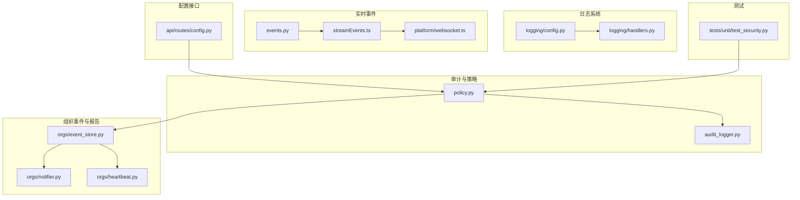

**图表来源**
- [audit_logger.py:1-111](file://src/synapse/core/audit_logger.py#L1-L111)
- [policy.py:1-800](file://src/synapse/core/policy.py#L1-L800)
- [config.py:1-121](file://src/synapse/logging/config.py#L1-L121)
- [handlers.py:1-169](file://src/synapse/logging/handlers.py#L1-L169)
- [event_store.py:1-288](file://src/synapse/orgs/event_store.py#L1-L288)
- [notifier.py:1-201](file://src/synapse/orgs/notifier.py#L1-L201)
- [heartbeat.py:1-455](file://src/synapse/orgs/heartbeat.py#L1-L455)
- [events.py:1-48](file://src/synapse/events.py#L1-L48)
- [streamEvents.ts:1-57](file://apps/setup-center/src/streamEvents.ts#L1-L57)
- [websocket.ts:37-98](file://apps/setup-center/src/platform/websocket.ts#L37-L98)
- [config.py:853-890](file://src/synapse/api/routes/config.py#L853-L890)
- [test_security.py:381-713](file://tests/unit/test_security.py#L381-L713)

**章节来源**
- [audit_logger.py:1-111](file://src/synapse/core/audit_logger.py#L1-L111)
- [policy.py:1-800](file://src/synapse/core/policy.py#L1-L800)
- [config.py:1-121](file://src/synapse/logging/config.py#L1-L121)
- [handlers.py:1-169](file://src/synapse/logging/handlers.py#L1-L169)
- [event_store.py:1-288](file://src/synapse/orgs/event_store.py#L1-L288)
- [notifier.py:1-201](file://src/synapse/orgs/notifier.py#L1-L201)
- [heartbeat.py:1-455](file://src/synapse/orgs/heartbeat.py#L1-L455)
- [events.py:1-48](file://src/synapse/events.py#L1-L48)
- [streamEvents.ts:1-57](file://apps/setup-center/src/streamEvents.ts#L1-L57)
- [websocket.ts:37-98](file://apps/setup-center/src/platform/websocket.ts#L37-L98)
- [config.py:853-890](file://src/synapse/api/routes/config.py#L853-L890)
- [test_security.py:381-713](file://tests/unit/test_security.py#L381-L713)

## 核心组件
- 审计日志（AuditLogger）：以 JSONL 追加写入策略决策与敏感参数脱敏后的记录，确保进程崩溃不丢日志。
- 策略引擎（PolicyEngine）：六层安全防护的决策核心，贯穿工具执行前的权限判定、确认门、自保护与沙箱联动，并触发审计记录。
- 日志系统（Logging）：统一日志配置，支持控制台彩色输出、主日志文件按大小轮转、错误日志按天轮转、会话日志缓冲。
- 组织事件存储（OrgEventStore）：事件溯源与审计日志生成，支持按天分文件、查询过滤、审计报告与统计。
- 通知与告警（OrgNotifier）：IM 通道推送、审批解析、Webhook 输出，支撑事件响应闭环。
- 心跳与周报（OrgHeartbeat）：自适应心跳间隔、晨会/周报生成，驱动组织治理与状态审视。
- 实时事件协议（SSE/WS）：前后端一致的事件类型定义与 WebSocket 连接，用于实时监控与告警展示。
- 安全配置接口（API）：读写安全策略配置，保障配置变更可追溯与防覆盖。

**章节来源**
- [audit_logger.py:54-111](file://src/synapse/core/audit_logger.py#L54-L111)
- [policy.py:526-800](file://src/synapse/core/policy.py#L526-L800)
- [config.py:20-107](file://src/synapse/logging/config.py#L20-L107)
- [handlers.py:19-169](file://src/synapse/logging/handlers.py#L19-L169)
- [event_store.py:21-288](file://src/synapse/orgs/event_store.py#L21-L288)
- [notifier.py:31-201](file://src/synapse/orgs/notifier.py#L31-L201)
- [heartbeat.py:24-455](file://src/synapse/orgs/heartbeat.py#L24-L455)
- [events.py:16-48](file://src/synapse/events.py#L16-L48)
- [websocket.ts:37-98](file://apps/setup-center/src/platform/websocket.ts#L37-L98)
- [config.py:853-890](file://src/synapse/api/routes/config.py#L853-L890)

## 架构总览
下图展示从策略决策到审计、日志、事件存储与实时通知的整体链路。

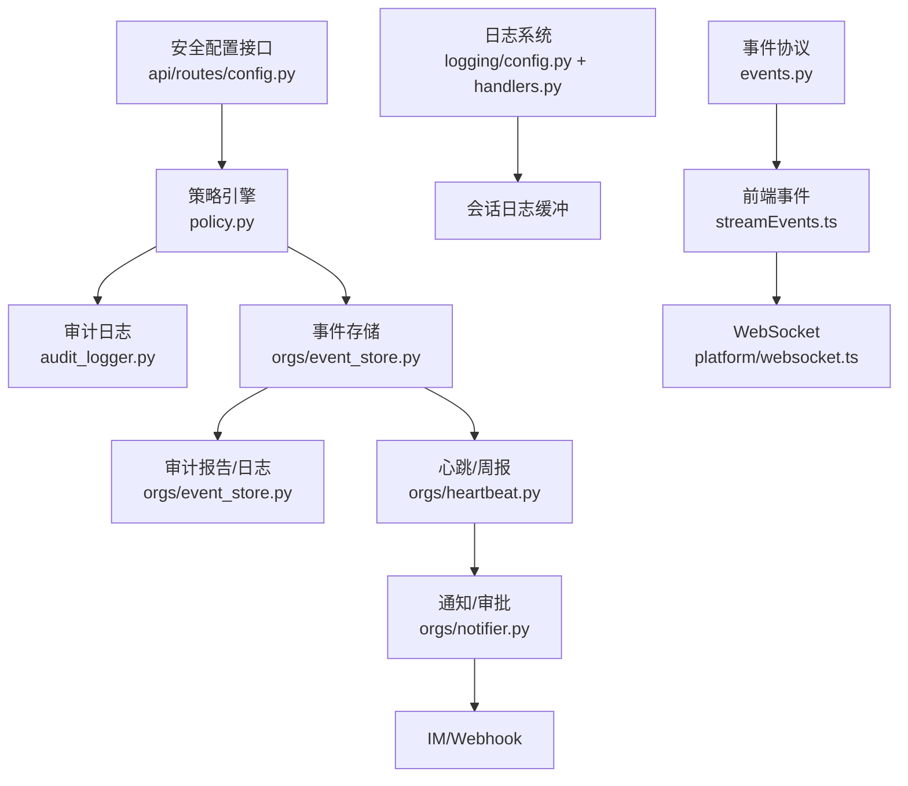

**图表来源**
- [policy.py:526-800](file://src/synapse/core/policy.py#L526-L800)
- [audit_logger.py:54-111](file://src/synapse/core/audit_logger.py#L54-L111)
- [event_store.py:21-288](file://src/synapse/orgs/event_store.py#L21-L288)
- [heartbeat.py:24-455](file://src/synapse/orgs/heartbeat.py#L24-L455)
- [notifier.py:31-201](file://src/synapse/orgs/notifier.py#L31-L201)
- [config.py:20-107](file://src/synapse/logging/config.py#L20-L107)
- [handlers.py:19-169](file://src/synapse/logging/handlers.py#L19-L169)
- [events.py:16-48](file://src/synapse/events.py#L16-L48)
- [streamEvents.ts:1-57](file://apps/setup-center/src/streamEvents.ts#L1-L57)
- [websocket.ts:37-98](file://apps/setup-center/src/platform/websocket.ts#L37-L98)
- [config.py:853-890](file://src/synapse/api/routes/config.py#L853-L890)

## 详细组件分析

### 审计日志生成机制
- 记录字段：时间戳、工具名、决策、原因、策略名、参数预览（含敏感信息脱敏）、元数据。
- 脱敏策略：对常见敏感键进行正则替换，限制预览长度，避免泄露凭证等。
- 写入策略：追加写入 JSONL 文件，失败时记录警告日志，保证不因 IO 异常影响主流程。
- 审计入口：策略引擎在每次判定后调用审计记录；自保护配置可控制审计文件路径。

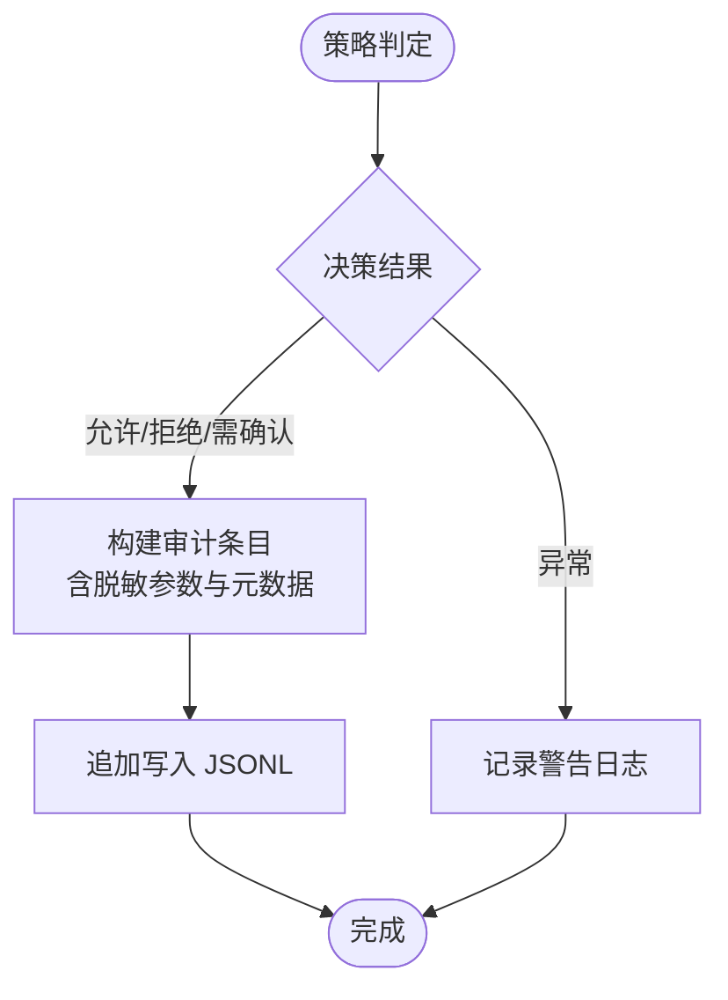

**图表来源**
- [audit_logger.py:61-95](file://src/synapse/core/audit_logger.py#L61-L95)
- [policy.py:759-800](file://src/synapse/core/policy.py#L759-L800)

**章节来源**
- [audit_logger.py:36-95](file://src/synapse/core/audit_logger.py#L36-L95)
- [policy.py:759-800](file://src/synapse/core/policy.py#L759-L800)

### 监控指标体系
- 性能指标
  - 事件存储吞吐：事件写入速率、查询延迟、文件大小与轮转频率。
  - 日志系统：日志写入延迟、错误日志量、会话日志缓冲命中率。
  - 心跳与周报：心跳间隔自适应、任务积压、节点空闲率。
- 安全指标
  - 策略拒绝率、确认门超时比例、死亡开关触发次数、沙箱执行次数。
  - 敏感命令拦截数、高危模式匹配数、白名单命中率。
- 业务指标
  - 任务完成/失败数、消息发送量、组织活跃度、最近错误列表。

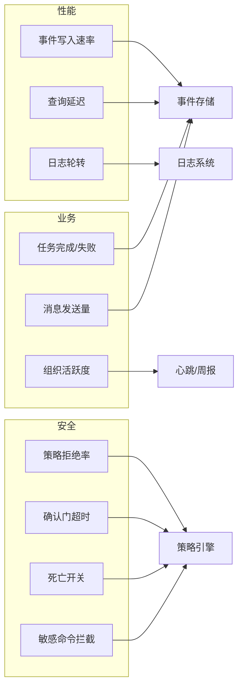

**图表来源**
- [event_store.py:200-243](file://src/synapse/orgs/event_store.py#L200-L243)
- [heartbeat.py:57-72](file://src/synapse/orgs/heartbeat.py#L57-L72)
- [config.py:68-91](file://src/synapse/logging/config.py#L68-L91)
- [policy.py:526-800](file://src/synapse/core/policy.py#L526-L800)

**章节来源**
- [event_store.py:200-243](file://src/synapse/orgs/event_store.py#L200-L243)
- [heartbeat.py:57-72](file://src/synapse/orgs/heartbeat.py#L57-L72)
- [config.py:68-91](file://src/synapse/logging/config.py#L68-L91)
- [policy.py:526-800](file://src/synapse/core/policy.py#L526-L800)

### 实时监控告警与事件响应
- 实时事件协议：后端定义事件类型枚举，前端保持同步，SSE/WS 推送至前端。
- WebSocket 连接：自动重连、心跳 ping、事件分发与错误处理。
- 通知与审批：IM 通道推送、自然语言审批解析、Webhook 输出，形成闭环。
- 心跳与周报：自适应心跳、晨会/周报生成，驱动组织治理与状态审视。

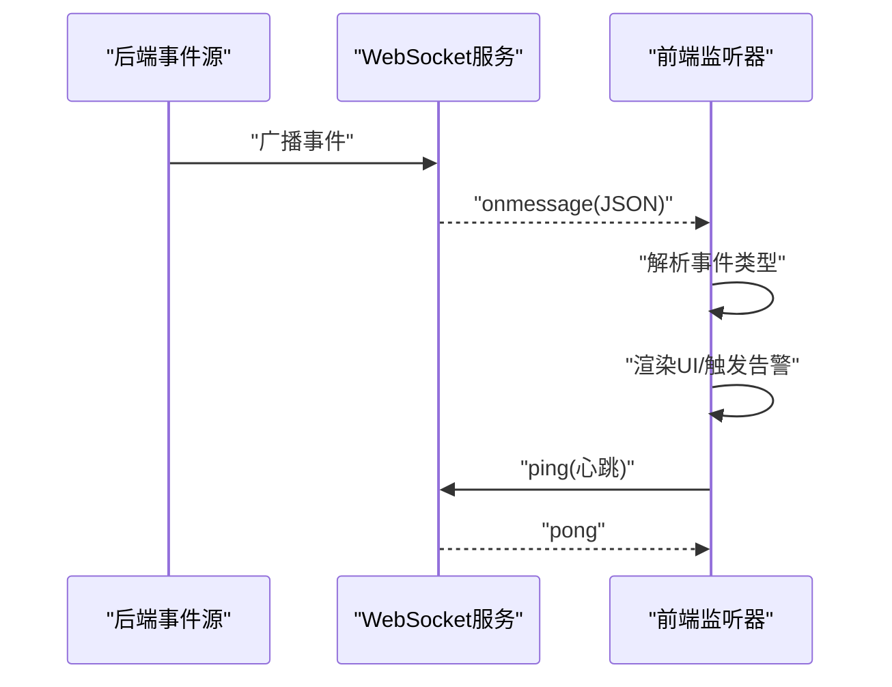

**图表来源**
- [events.py:16-48](file://src/synapse/events.py#L16-L48)
- [streamEvents.ts:10-57](file://apps/setup-center/src/streamEvents.ts#L10-L57)
- [websocket.ts:67-92](file://apps/setup-center/src/platform/websocket.ts#L67-L92)

**章节来源**
- [events.py:16-48](file://src/synapse/events.py#L16-L48)
- [streamEvents.ts:10-57](file://apps/setup-center/src/streamEvents.ts#L10-L57)
- [websocket.ts:67-92](file://apps/setup-center/src/platform/websocket.ts#L67-L92)

### 安全事件追踪与审计报告
- 事件溯源：事件按天分文件存储，支持多维过滤查询。
- 审计日志：筛选重要事件类型，生成人类可读审计报告与统计摘要。
- 报告维度：事件类型分布、节点活跃度、每日活动、近期错误列表。

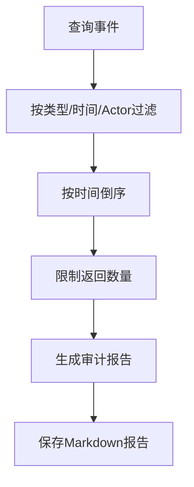

**图表来源**
- [event_store.py:70-124](file://src/synapse/orgs/event_store.py#L70-L124)
- [event_store.py:148-195](file://src/synapse/orgs/event_store.py#L148-L195)
- [event_store.py:201-287](file://src/synapse/orgs/event_store.py#L201-L287)

**章节来源**
- [event_store.py:70-124](file://src/synapse/orgs/event_store.py#L70-L124)
- [event_store.py:148-195](file://src/synapse/orgs/event_store.py#L148-L195)
- [event_store.py:201-287](file://src/synapse/orgs/event_store.py#L201-L287)

### 日志系统与会话日志
- 统一配置：根日志器、控制台处理器（彩色输出）、主日志文件（大小轮转）、错误日志（按天轮转）、会话日志缓冲。
- 会话日志：按 session_id 分组缓存，供 AI 查询当前会话日志，简化格式仅保留消息内容。

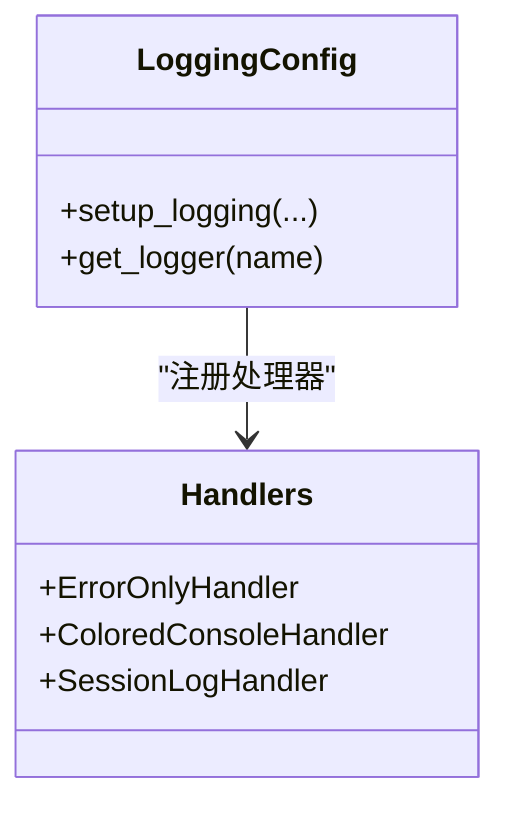

**图表来源**
- [config.py:20-107](file://src/synapse/logging/config.py#L20-L107)
- [handlers.py:19-169](file://src/synapse/logging/handlers.py#L19-L169)

**章节来源**
- [config.py:20-107](file://src/synapse/logging/config.py#L20-L107)
- [handlers.py:19-169](file://src/synapse/logging/handlers.py#L19-L169)

### 安全策略引擎与自保护
- 六层安全防护：区域矩阵、危险命令模式、工具策略、范围策略、确认门、自保护。
- 自保护：死亡开关阈值与倍数、受保护目录、审计文件路径、只读模式。
- 审计联动：每次策略判定均记录审计，便于回溯与分析。

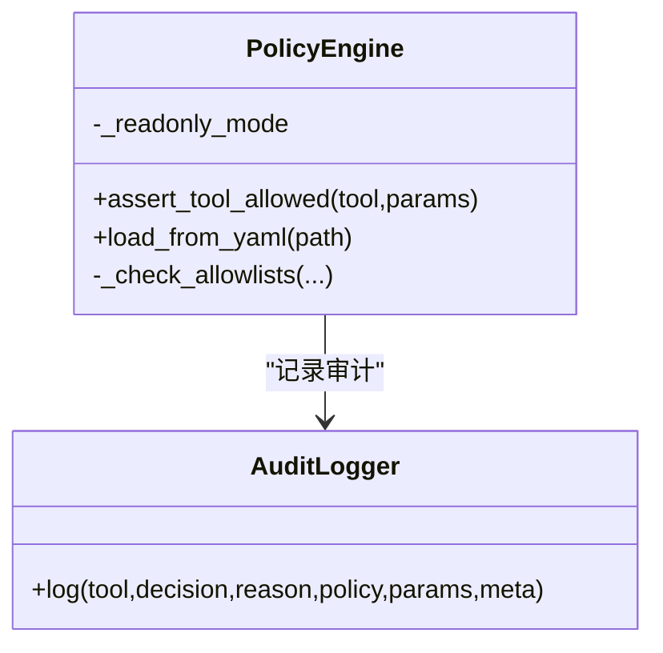

**图表来源**
- [policy.py:526-800](file://src/synapse/core/policy.py#L526-L800)
- [audit_logger.py:54-111](file://src/synapse/core/audit_logger.py#L54-L111)

**章节来源**
- [policy.py:526-800](file://src/synapse/core/policy.py#L526-L800)
- [audit_logger.py:54-111](file://src/synapse/core/audit_logger.py#L54-L111)

### 通知与审批解析
- 通道适配：飞书、钉钉、企业微信、通用 Webhook。
- 审批解析：自然语言模式匹配编号与决策，支持模糊语义。
- 事件格式：统一字段包含组织、标题、正文、优先级、审批编号等。

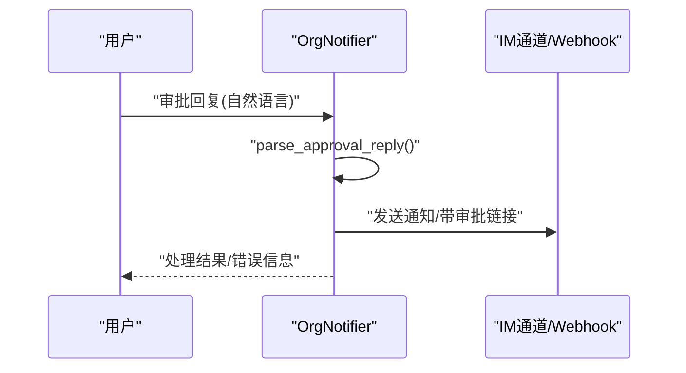

**图表来源**
- [notifier.py:71-121](file://src/synapse/orgs/notifier.py#L71-L121)
- [notifier.py:157-200](file://src/synapse/orgs/notifier.py#L157-L200)

**章节来源**
- [notifier.py:71-121](file://src/synapse/orgs/notifier.py#L71-L121)
- [notifier.py:157-200](file://src/synapse/orgs/notifier.py#L157-L200)

### 心跳与周报
- 自适应心跳：根据最近活动动态调整间隔，降低空闲时负载。
- 晨会/周报：里程碑或定时触发，汇总节点状态与黑板摘要，生成纪要并广播。

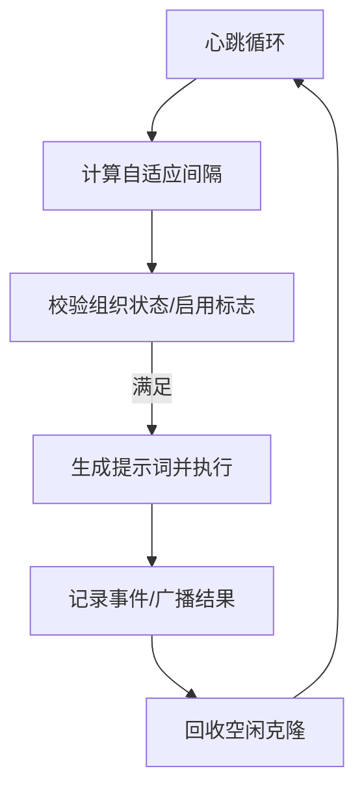

**图表来源**
- [heartbeat.py:120-143](file://src/synapse/orgs/heartbeat.py#L120-L143)
- [heartbeat.py:144-279](file://src/synapse/orgs/heartbeat.py#L144-L279)
- [heartbeat.py:316-364](file://src/synapse/orgs/heartbeat.py#L316-L364)
- [heartbeat.py:366-454](file://src/synapse/orgs/heartbeat.py#L366-L454)

**章节来源**
- [heartbeat.py:120-143](file://src/synapse/orgs/heartbeat.py#L120-L143)
- [heartbeat.py:144-279](file://src/synapse/orgs/heartbeat.py#L144-L279)
- [heartbeat.py:316-364](file://src/synapse/orgs/heartbeat.py#L316-L364)
- [heartbeat.py:366-454](file://src/synapse/orgs/heartbeat.py#L366-L454)

## 依赖关系分析
- 组件耦合
  - 策略引擎与审计日志：强耦合（每条判定必经审计）。
  - 事件存储与通知：弱耦合（事件驱动通知，非直接依赖）。
  - 日志系统与会话日志：弱耦合（会话日志作为缓冲，不影响主日志流）。
- 外部依赖
  - IM 通道与 Webhook：HTTP 客户端异步调用。
  - 文件系统：事件与审计日志的 JSONL 存储。
  - 前端 WebSocket：事件订阅与实时展示。

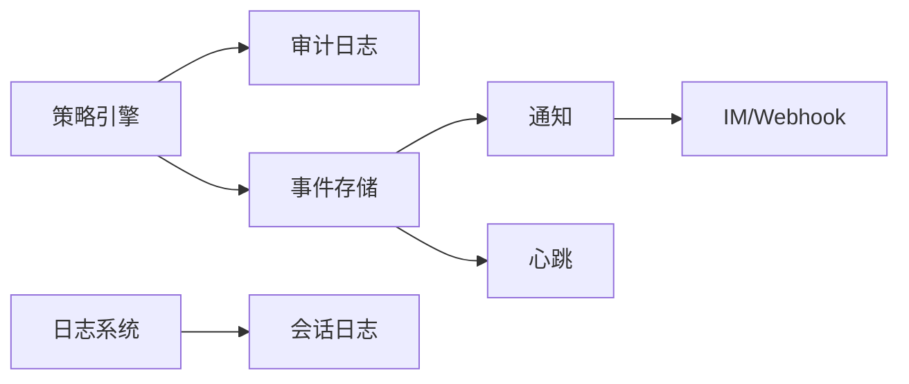

**图表来源**
- [policy.py:526-800](file://src/synapse/core/policy.py#L526-L800)
- [audit_logger.py:54-111](file://src/synapse/core/audit_logger.py#L54-L111)
- [event_store.py:21-288](file://src/synapse/orgs/event_store.py#L21-L288)
- [notifier.py:31-201](file://src/synapse/orgs/notifier.py#L31-L201)
- [heartbeat.py:24-455](file://src/synapse/orgs/heartbeat.py#L24-L455)
- [config.py:20-107](file://src/synapse/logging/config.py#L20-L107)
- [handlers.py:19-169](file://src/synapse/logging/handlers.py#L19-L169)

**章节来源**
- [policy.py:526-800](file://src/synapse/core/policy.py#L526-L800)
- [audit_logger.py:54-111](file://src/synapse/core/audit_logger.py#L54-L111)
- [event_store.py:21-288](file://src/synapse/orgs/event_store.py#L21-L288)
- [notifier.py:31-201](file://src/synapse/orgs/notifier.py#L31-L201)
- [heartbeat.py:24-455](file://src/synapse/orgs/heartbeat.py#L24-L455)
- [config.py:20-107](file://src/synapse/logging/config.py#L20-L107)
- [handlers.py:19-169](file://src/synapse/logging/handlers.py#L19-L169)

## 性能考量
- 事件与审计写入：采用 JSONL 追加写入，减少随机 IO；建议合理设置轮转大小与备份数量，避免单文件过大。
- 日志轮转：主日志按大小轮转、错误日志按天轮转，降低磁盘压力；控制台彩色输出在 Windows 上做 UTF-8 包装，避免编码异常中断。
- 心跳自适应：空闲期延长间隔，高峰期缩短间隔，平衡治理成本与及时性。
- 会话日志缓冲：内存缓存按 session_id 分组，避免频繁 IO；注意缓冲上限与清理策略。

[本节为通用指导，无需特定文件引用]

## 故障排查指南
- 审计日志写入失败
  - 现象：策略判定后出现警告日志。
  - 排查：检查审计文件路径权限、磁盘空间、文件损坏。
  - 参考：审计日志写入异常处理与回退。
- 策略配置读取/写入异常
  - 现象：安全配置接口返回错误或写入被拒绝。
  - 排查：确认 POLICIES.yaml 可读性、写入前备份逻辑、路径权限。
  - 参考：配置读写与拒绝覆盖逻辑。
- IM 通知失败
  - 现象：审批通知未送达或 Webhook 返回非 200。
  - 排查：检查通道配置、网络连通性、超时设置、回调格式。
  - 参考：通知适配器与错误处理。
- 心跳/周报未触发
  - 现象：组织状态未更新或未生成报告。
  - 排查：确认心跳启用标志、cron 表达式、节点状态、任务积压。
  - 参考：心跳循环与触发条件。

**章节来源**
- [audit_logger.py:80-84](file://src/synapse/core/audit_logger.py#L80-L84)
- [config.py:856-873](file://src/synapse/api/routes/config.py#L856-L873)
- [notifier.py:157-200](file://src/synapse/orgs/notifier.py#L157-L200)
- [heartbeat.py:120-143](file://src/synapse/orgs/heartbeat.py#L120-L143)

## 结论
Synapse 的安全审计与监控体系以策略引擎为核心，结合事件溯源、审计日志、日志系统与实时通知，形成“决策—记录—存储—展示—响应”的闭环。通过合理的指标体系与告警规则，可实现对性能、安全与业务的全面观测与治理。

[本节为总结性内容，无需特定文件引用]

## 附录

### 审计配置示例（策略与自保护）
- 开启/关闭安全策略、区域矩阵、确认门模式、沙箱配置、用户白名单、自保护目录与审计路径。
- 建议：生产环境默认启用安全策略与自保护，严格限制受保护目录与审计路径，开启确认门并设置合理超时与 TTL。

**章节来源**
- [policy.py:381-394](file://src/synapse/core/policy.py#L381-L394)
- [policy.py:342-354](file://src/synapse/core/policy.py#L342-L354)
- [config.py:876-890](file://src/synapse/api/routes/config.py#L876-L890)
- [test_security.py:381-462](file://tests/unit/test_security.py#L381-L462)

### 监控仪表板与告警规则建议
- 仪表板建议
  - 审计与安全：策略拒绝率、确认门超时、敏感命令拦截、死亡开关触发。
  - 业务健康：任务完成/失败、消息发送量、节点活跃度、每日事件趋势。
  - 性能：事件写入速率、查询延迟、日志轮转频率、心跳间隔。
- 告警规则
  - 策略拒绝率短期突增（如 5 分钟内 > X%）。
  - 确认门超时比例持续高于 Y%。
  - 敏感命令拦截数在 Z 分钟内超过阈值。
  - 心跳间隔异常（长时间未触发或过于频繁）。
  - 错误日志量激增或错误类型集中。

[本节为通用指导，无需特定文件引用]

### 日志分析与容量规划
- 日志分析
  - 审计与事件：按天聚合、识别高危模式与异常路径、定位失败任务与错误堆栈。
  - 会话日志：按会话检索，辅助排障与用户行为分析。
- 容量规划
  - 事件与审计：估算 JSONL 文件增长速率，设定轮转大小与备份天数。
  - 日志：根据峰值写入量与保留周期，规划磁盘与索引策略。
  - 心跳与周报：评估 LLM 调用成本与并发，优化自适应间隔与缓存。

[本节为通用指导，无需特定文件引用]