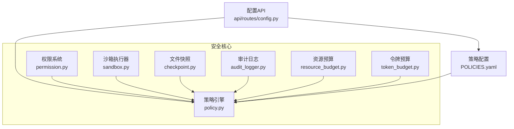
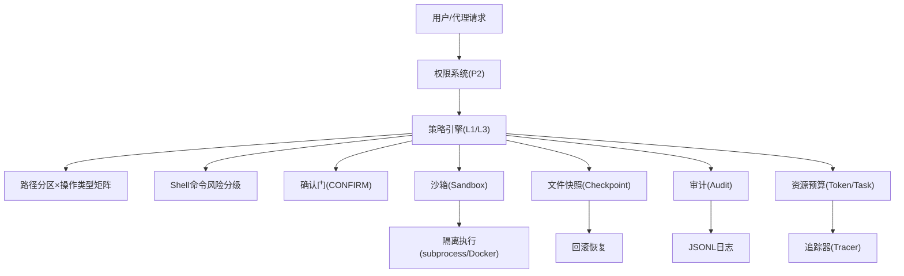
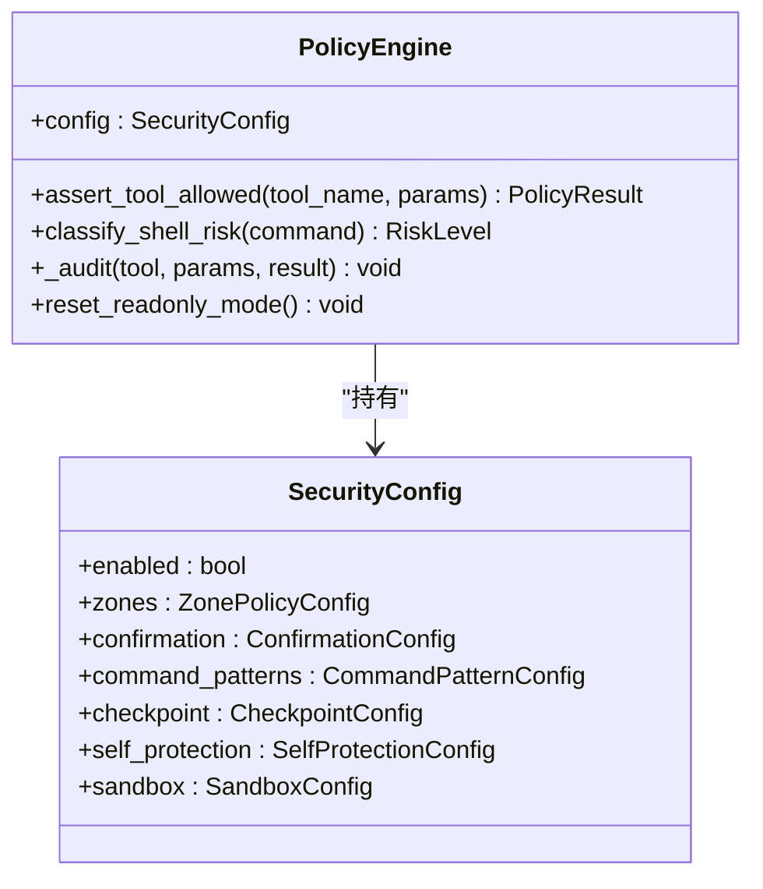
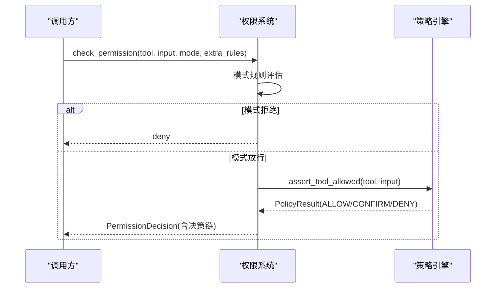
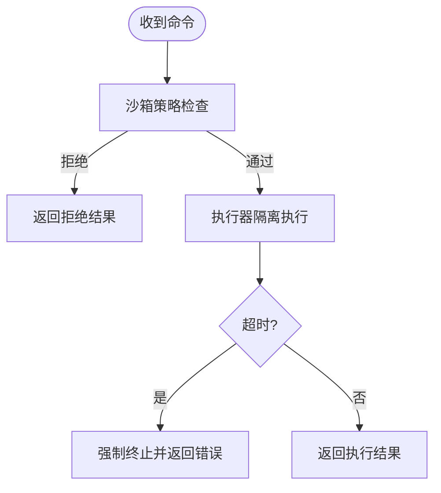
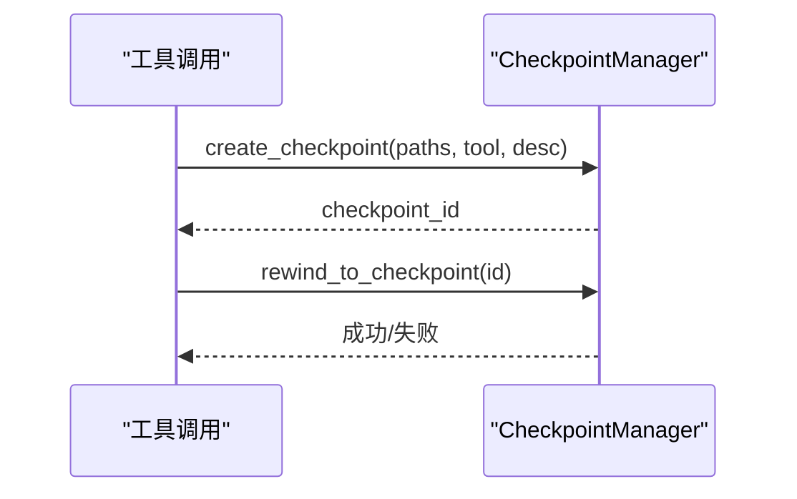
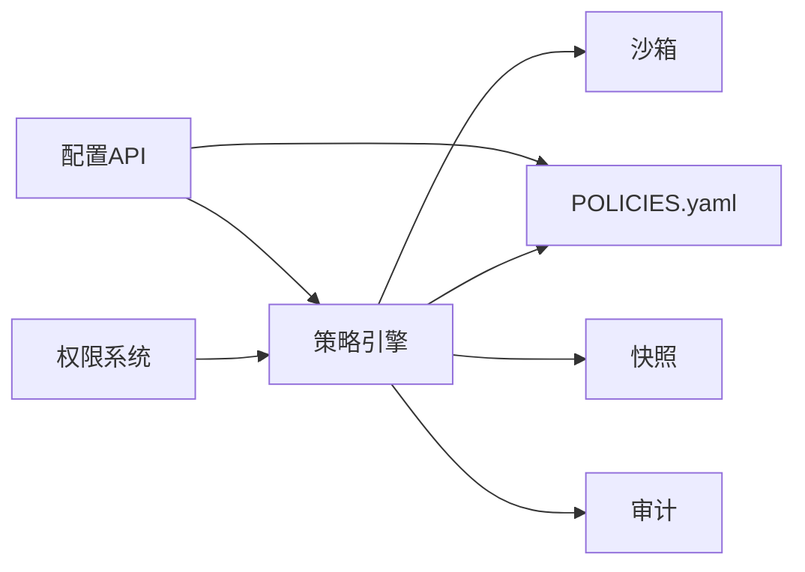

# 安全架构

<cite>
**本文档引用的文件**
- [src/synapse/core/policy.py](file://src/synapse/core/policy.py)
- [src/synapse/core/sandbox.py](file://src/synapse/core/sandbox.py)
- [src/synapse/core/permission.py](file://src/synapse/core/permission.py)
- [src/synapse/core/checkpoint.py](file://src/synapse/core/checkpoint.py)
- [src/synapse/core/audit_logger.py](file://src/synapse/core/audit_logger.py)
- [src/synapse/core/resource_budget.py](file://src/synapse/core/resource_budget.py)
- [src/synapse/core/token_budget.py](file://src/synapse/core/token_budget.py)
- [src/synapse/api/routes/config.py](file://src/synapse/api/routes/config.py)
- [identity/POLICIES.yaml](file://identity/POLICIES.yaml)
- [tests/unit/test_security.py](file://tests/unit/test_security.py)
</cite>

## 目录
1. [引言](#引言)
2. [项目结构](#项目结构)
3. [核心组件](#核心组件)
4. [架构总览](#架构总览)
5. [详细组件分析](#详细组件分析)
6. [依赖分析](#依赖分析)
7. [性能考虑](#性能考虑)
8. [故障排查指南](#故障排查指南)
9. [结论](#结论)
10. [附录](#附录)

## 引言
本文件面向安全管理员与合规人员，系统性阐述 Synapse 的六层安全防护体系与运行机制，覆盖路径分区管理、确认门机制、命令拦截、文件快照、自我保护与操作系统级沙箱；并给出策略制定原则、实施机制、监控方式、权限控制模型、资源预算管理、访问控制机制、威胁建模与攻击向量分析、安全配置指南、最佳实践、应急响应流程、安全审计与日志记录以及合规要点。

## 项目结构
围绕安全相关的关键代码与配置，主要分布在以下模块：
- 策略引擎与安全配置：src/synapse/core/policy.py
- 沙箱与命令执行：src/synapse/core/sandbox.py
- 权限与访问控制：src/synapse/core/permission.py
- 文件快照与回滚：src/synapse/core/checkpoint.py
- 审计日志：src/synapse/core/audit_logger.py
- 资源预算与令牌预算：src/synapse/core/resource_budget.py、src/synapse/core/token_budget.py
- 安全配置 API：src/synapse/api/routes/config.py
- 默认安全策略：identity/POLICIES.yaml
- 安全单元测试：tests/unit/test_security.py

图表来源
- [src/synapse/core/policy.py](file://src/synapse/core/policy.py)
- [src/synapse/core/permission.py](file://src/synapse/core/permission.py)
- [src/synapse/core/sandbox.py](file://src/synapse/core/sandbox.py)
- [src/synapse/core/checkpoint.py](file://src/synapse/core/checkpoint.py)
- [src/synapse/core/audit_logger.py](file://src/synapse/core/audit_logger.py)
- [src/synapse/core/resource_budget.py](file://src/synapse/core/resource_budget.py)
- [src/synapse/core/token_budget.py](file://src/synapse/core/token_budget.py)
- [src/synapse/api/routes/config.py](file://src/synapse/api/routes/config.py)
- [identity/POLICIES.yaml](file://identity/POLICIES.yaml)

章节来源
- [src/synapse/core/policy.py](file://src/synapse/core/policy.py)
- [src/synapse/core/permission.py](file://src/synapse/core/permission.py)
- [src/synapse/core/sandbox.py](file://src/synapse/core/sandbox.py)
- [src/synapse/core/checkpoint.py](file://src/synapse/core/checkpoint.py)
- [src/synapse/core/audit_logger.py](file://src/synapse/core/audit_logger.py)
- [src/synapse/core/resource_budget.py](file://src/synapse/core/resource_budget.py)
- [src/synapse/core/token_budget.py](file://src/synapse/core/token_budget.py)
- [src/synapse/api/routes/config.py](file://src/synapse/api/routes/config.py)
- [identity/POLICIES.yaml](file://identity/POLICIES.yaml)

## 核心组件
- 策略引擎（PolicyEngine）：集中式决策层，实现六层安全体系的 L1（路径分区×操作类型矩阵）与 L3（Shell 命令风险分级）等核心逻辑，并负责审计记录与“死亡开关”只读模式。
- 权限系统（Permission）：在工具链路中叠加模式规则与策略引擎决策，提供 fail-closed/fail-open 的鲁棒性，支持额外规则集（如 AgentProfile.permission_rules）。
- 沙箱（Sandbox）：命令执行前的策略检查与隔离执行器，支持超时、路径白/黑名单、命令白/黑名单与危险模式匹配，提供 subprocess 后端与扩展为 Docker/seatbelt/landlock 的能力。
- 文件快照（Checkpoint）：在可控区文件修改前自动创建快照，支持按 ID 回滚，保留最近 N 份，保障可恢复性。
- 审计日志（AuditLogger）：持久化 JSONL 审计记录，支持敏感信息脱敏与尾部读取，确保事件可追溯。
- 资源预算（ResourceBudget/TokenBudget）：任务级与令牌级预算控制，多维阈值分级（警告/降级/暂停），与追踪器联动记录决策轨迹。

章节来源
- [src/synapse/core/policy.py](file://src/synapse/core/policy.py)
- [src/synapse/core/permission.py](file://src/synapse/core/permission.py)
- [src/synapse/core/sandbox.py](file://src/synapse/core/sandbox.py)
- [src/synapse/core/checkpoint.py](file://src/synapse/core/checkpoint.py)
- [src/synapse/core/audit_logger.py](file://src/synapse/core/audit_logger.py)
- [src/synapse/core/resource_budget.py](file://src/synapse/core/resource_budget.py)
- [src/synapse/core/token_budget.py](file://src/synapse/core/token_budget.py)

## 架构总览
六层安全防护体系（L1–L6）在工具执行前贯穿检查，形成“策略引擎 + 多层防护 + 审计”的闭环。

图表来源
- [src/synapse/core/policy.py](file://src/synapse/core/policy.py)
- [src/synapse/core/permission.py](file://src/synapse/core/permission.py)
- [src/synapse/core/sandbox.py](file://src/synapse/core/sandbox.py)
- [src/synapse/core/checkpoint.py](file://src/synapse/core/checkpoint.py)
- [src/synapse/core/audit_logger.py](file://src/synapse/core/audit_logger.py)
- [src/synapse/core/resource_budget.py](file://src/synapse/core/resource_budget.py)
- [src/synapse/core/token_budget.py](file://src/synapse/core/token_budget.py)

## 详细组件分析

### 策略引擎（L1 路径分区 × 操作类型矩阵；L3 Shell 命令风险分级）
- 路径分区与操作类型矩阵：将文件路径映射到工作区/受控区/受保护区/禁止访问区，并结合读取/创建/编辑/覆盖/删除/批量删除等操作类型，给出允许/确认/拒绝的决策。
- Shell 命令风险分级：基于平台与自定义模式匹配，将命令分为危急/高危/中危/低危等级，决定是否需要确认门或直接拒绝。
- 自我保护与死亡开关：累计拒绝达到阈值后进入只读模式，阻止非只读操作；同时记录审计日志。
- 确认门：支持三种模式（谨慎/智能/放任），带超时与缓存 TTL，UI 可确认或拒绝。
- 沙箱豁免：对特定风险级别启用沙箱，支持网络域白名单与豁免命令。
- YAML 加载：支持新旧两种格式，兼容历史配置。

图表来源
- [src/synapse/core/policy.py](file://src/synapse/core/policy.py)

章节来源
- [src/synapse/core/policy.py](file://src/synapse/core/policy.py)
- [identity/POLICIES.yaml](file://identity/POLICIES.yaml)

### 权限系统（P2 统一权限决策）
- 模式规则：在不同模式（计划/问答/协调）下对工具可用性施加约束，优先于策略引擎。
- 额外规则集：支持来自 AgentProfile 的权限规则，先于策略引擎评估。
- 策略引擎集成：在模式放行后调用策略引擎，若策略引擎不可用，高风险工具 fail-closed，安全读路径 fail-open。
- 工具分类：将工具映射到“编辑/读取/其他”，针对编辑类工具提取路径进行路径级检查。

图表来源
- [src/synapse/core/permission.py](file://src/synapse/core/permission.py)
- [src/synapse/core/policy.py](file://src/synapse/core/policy.py)

章节来源
- [src/synapse/core/permission.py](file://src/synapse/core/permission.py)

### 沙箱（P1-1 命令执行隔离；P1-6 中危命令确认）
- 策略检查：黑名单命令/模式、受保护目录、命令白名单、路径越权等。
- 执行器：基于 subprocess 的基础隔离，支持超时强制终止；未来可扩展为 Docker/seatbelt/landlock。
- 中危命令：命中中危模式但不在沙箱风险级别内时，仍需确认门。

图表来源
- [src/synapse/core/sandbox.py](file://src/synapse/core/sandbox.py)

章节来源
- [src/synapse/core/sandbox.py](file://src/synapse/core/sandbox.py)

### 文件快照（L4 快照与回滚）
- 创建：在可控区文件修改前备份，记录原始哈希与大小，生成唯一 ID。
- 回滚：按 ID 恢复文件，支持新增文件删除回滚。
- 限额：超过上限自动清理最旧快照。

图表来源
- [src/synapse/core/checkpoint.py](file://src/synapse/core/checkpoint.py)

章节来源
- [src/synapse/core/checkpoint.py](file://src/synapse/core/checkpoint.py)

### 审计日志（L5 持久化审计）
- 记录字段：时间戳、工具名、决策、原因、策略名、参数预览（敏感信息脱敏）、元数据。
- 尾部读取：支持读取最近 N 条记录用于监控与取证。
- 全局单例：根据策略引擎配置初始化审计路径。

章节来源
- [src/synapse/core/audit_logger.py](file://src/synapse/core/audit_logger.py)

### 资源预算（L6 任务级与令牌级预算）
- 任务级预算：token、成本、时长、迭代次数、工具调用次数，支持分级动作（警告/降级/暂停）。
- 令牌预算：从用户消息解析预算指令，动态注入警告提示。
- 决策轨迹：与追踪器联动记录预算检查决策。

章节来源
- [src/synapse/core/resource_budget.py](file://src/synapse/core/resource_budget.py)
- [src/synapse/core/token_budget.py](file://src/synapse/core/token_budget.py)

## 依赖分析
- 权限系统依赖策略引擎进行最终决策，且在策略引擎不可用时具备 fail-closed/fail-open 的容错。
- 策略引擎依赖配置文件（POLICIES.yaml）加载安全策略，支持新旧格式兼容。
- 沙箱与文件快照在策略引擎决策后执行，作为 L1/L3 的补充防护。
- 审计日志贯穿所有决策路径，保证可追溯性。
- 配置 API 提供运行时调整安全模式、确认门、沙箱与快照等能力，并触发策略引擎重置。

图表来源
- [src/synapse/core/permission.py](file://src/synapse/core/permission.py)
- [src/synapse/core/policy.py](file://src/synapse/core/policy.py)
- [src/synapse/api/routes/config.py](file://src/synapse/api/routes/config.py)
- [identity/POLICIES.yaml](file://identity/POLICIES.yaml)

章节来源
- [src/synapse/core/permission.py](file://src/synapse/core/permission.py)
- [src/synapse/core/policy.py](file://src/synapse/core/policy.py)
- [src/synapse/api/routes/config.py](file://src/synapse/api/routes/config.py)
- [identity/POLICIES.yaml](file://identity/POLICIES.yaml)

## 性能考虑
- 策略匹配与正则匹配：命令风险分级采用多组平台与自定义模式，建议合理配置自定义模式与排除项，避免过多正则导致性能下降。
- 超时与并发：沙箱执行器设置最大执行时间，避免长时间阻塞；确认门缓存与会话白名单减少重复确认开销。
- 审计写入：JSONL 追加写入，建议定期轮转与压缩，避免日志过大影响 IO。
- 预算检查频率：资源预算在推理循环中检查，应平衡检查频率与性能，避免过度开销。

## 故障排查指南
- 策略引擎不可用：权限系统对高风险工具将拒绝，安全读路径将放行。检查策略引擎初始化与配置文件加载。
- 沙箱拒绝：检查命令是否命中黑名单/模式、是否访问受保护目录、是否在白名单之外。
- 确认门超时：检查前端模式与超时设置，必要时延长 TTL 或调整模式。
- 死亡开关：连续拒绝触发只读模式，需通过 API 重置。
- 审计缺失：检查审计路径是否存在、权限是否正确、进程是否异常退出。
- 快照回滚失败：检查目标文件是否存在、权限是否足够、快照 ID 是否有效。

章节来源
- [src/synapse/core/permission.py](file://src/synapse/core/permission.py)
- [src/synapse/core/sandbox.py](file://src/synapse/core/sandbox.py)
- [src/synapse/core/audit_logger.py](file://src/synapse/core/audit_logger.py)
- [src/synapse/api/routes/config.py](file://src/synapse/api/routes/config.py)

## 结论
Synapse 的六层安全体系通过“策略引擎 + 多层防护 + 审计”的设计，在工具执行前形成闭环控制，既满足高风险场景下的严格限制，又提供灵活的模式与预算管理，兼顾安全性与可用性。建议在生产环境中结合平台特性完善沙箱后端、强化审计与监控，并持续优化策略与阈值以适应业务变化。

## 附录

### 安全策略制定原则
- 最小权限：仅授予完成任务所需的最小权限集合。
- 分层防护：多层策略相互补充，上层拒绝不可被下层放行绕过。
- 可审计：所有关键决策均记录审计日志，保留证据链。
- 可恢复：对高风险操作启用文件快照，支持回滚。
- 可观察：预算与阈值可视化，便于运营监控与告警。

### 实施机制与监控
- 配置 API：提供运行时调整安全模式、确认门、沙箱与快照的能力，并触发策略引擎重置。
- 审计 API：提供最近审计条目的读取接口，便于实时监控。
- 快照 API：列出与回滚快照，支持运维快速恢复。

章节来源
- [src/synapse/api/routes/config.py](file://src/synapse/api/routes/config.py)
- [src/synapse/core/audit_logger.py](file://src/synapse/core/audit_logger.py)
- [src/synapse/core/checkpoint.py](file://src/synapse/core/checkpoint.py)

### 权限控制模型
- 模式规则：计划/问答/协调模式对工具可用性施加约束。
- 额外规则集：支持按路径粒度的允许/拒绝策略。
- 策略引擎：统一决策，fail-closed/fail-open 容错。

章节来源
- [src/synapse/core/permission.py](file://src/synapse/core/permission.py)

### 资源预算管理
- 任务级预算：token、成本、时长、迭代次数、工具调用次数，支持分级动作。
- 令牌预算：从用户消息解析预算指令，动态注入警告提示。

章节来源
- [src/synapse/core/resource_budget.py](file://src/synapse/core/resource_budget.py)
- [src/synapse/core/token_budget.py](file://src/synapse/core/token_budget.py)

### 访问控制机制
- 路径分区：工作区/受控区/受保护区/禁止访问区，结合操作类型矩阵。
- Shell 命令拦截：危急/高危/中危/低危分级，结合确认门与沙箱。
- 模式控制：不同模式下工具可用性差异。

章节来源
- [src/synapse/core/policy.py](file://src/synapse/core/policy.py)
- [src/synapse/core/permission.py](file://src/synapse/core/permission.py)

### 安全威胁模型与防护措施
- 威胁类型：路径越权、命令注入、破坏性操作、资源滥用、策略绕过。
- 防护措施：路径分区矩阵、命令模式匹配、确认门、沙箱隔离、文件快照、审计日志、死亡开关只读模式、预算限制。

章节来源
- [src/synapse/core/policy.py](file://src/synapse/core/policy.py)
- [src/synapse/core/sandbox.py](file://src/synapse/core/sandbox.py)
- [src/synapse/core/checkpoint.py](file://src/synapse/core/checkpoint.py)
- [src/synapse/core/audit_logger.py](file://src/synapse/core/audit_logger.py)

### 安全配置指南
- 默认策略：参考 POLICIES.yaml 的 zones/confirmation/command_patterns/checkpoint/self_protection/sandbox/user_allowlist 字段。
- 运行时调整：通过配置 API 更新确认门模式、沙箱配置、快照参数等。
- 策略重载：更新配置后触发策略引擎重置，确保新策略生效。

章节来源
- [identity/POLICIES.yaml](file://identity/POLICIES.yaml)
- [src/synapse/api/routes/config.py](file://src/synapse/api/routes/config.py)
- [src/synapse/core/policy.py](file://src/synapse/core/policy.py)

### 最佳实践
- 明确分区：将工作产物置于工作区，系统目录置于受保护区/禁止访问区。
- 启用确认门：在高风险模式下使用智能/谨慎模式，避免放任。
- 限制沙箱风险级别：仅对高危命令启用沙箱，避免过度隔离影响效率。
- 开启文件快照：对可控区写操作开启快照，保留合理数量以便回滚。
- 审计留存：定期轮转与备份审计日志，满足合规要求。
- 预算预警：设置合理的预算阈值与动作，提前发现异常消耗。

### 应急响应流程
- 触发死亡开关：连续拒绝达到阈值后进入只读模式，立即通过 API 重置。
- 审计取证：通过审计 API 获取最近决策记录，定位问题根因。
- 快照回滚：对受影响文件执行回滚，恢复到最近安全版本。
- 策略调整：临时收紧确认门或沙箱策略，降低风险暴露面。

章节来源
- [src/synapse/api/routes/config.py](file://src/synapse/api/routes/config.py)
- [src/synapse/core/audit_logger.py](file://src/synapse/core/audit_logger.py)
- [src/synapse/core/checkpoint.py](file://src/synapse/core/checkpoint.py)
- [src/synapse/core/policy.py](file://src/synapse/core/policy.py)

### 安全审计与合规
- 审计字段：工具名、决策、原因、策略名、参数预览（敏感信息脱敏）、元数据、时间戳。
- 日志保留：建议按周期归档与压缩，满足法规要求。
- 合规要求：审计日志不可篡改，应具备完整性校验与访问控制。

章节来源
- [src/synapse/core/audit_logger.py](file://src/synapse/core/audit_logger.py)

### 测试与验证
- 单元测试覆盖：包含六层安全体系的 L1 路径分区、L3 命令拦截、L4 快照回滚、L5 审计日志、策略引擎 YAML 加载等关键场景。

章节来源
- [tests/unit/test_security.py](file://tests/unit/test_security.py)