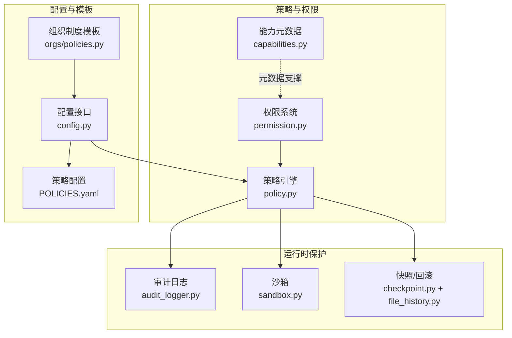
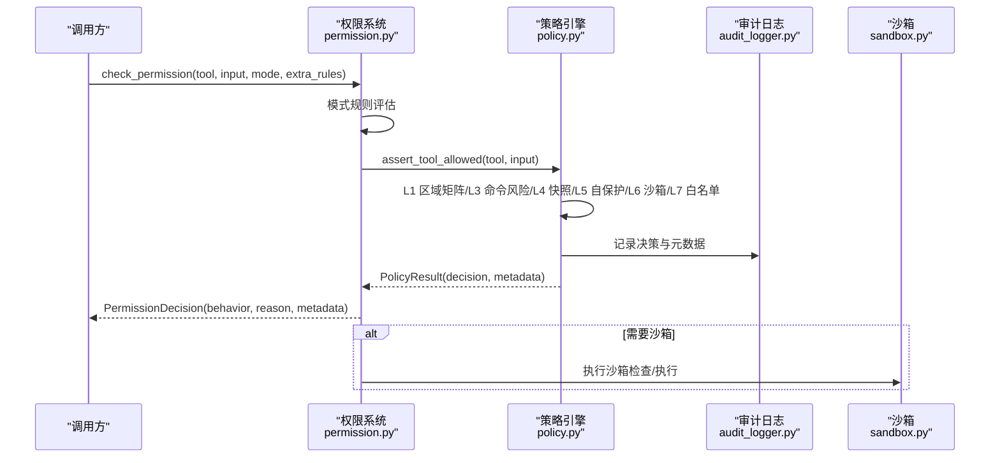
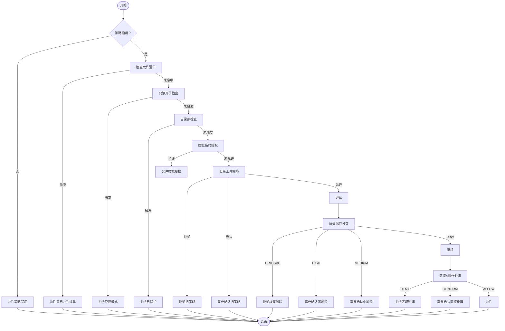
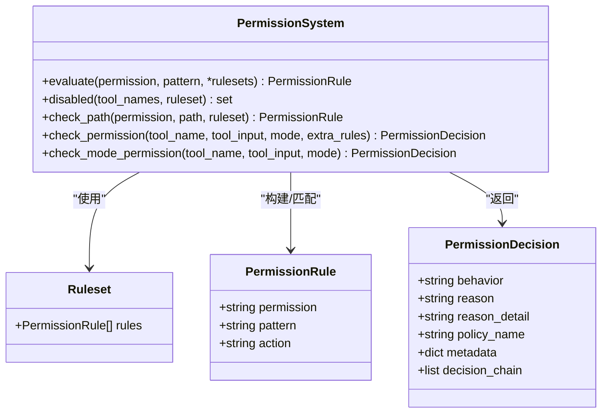
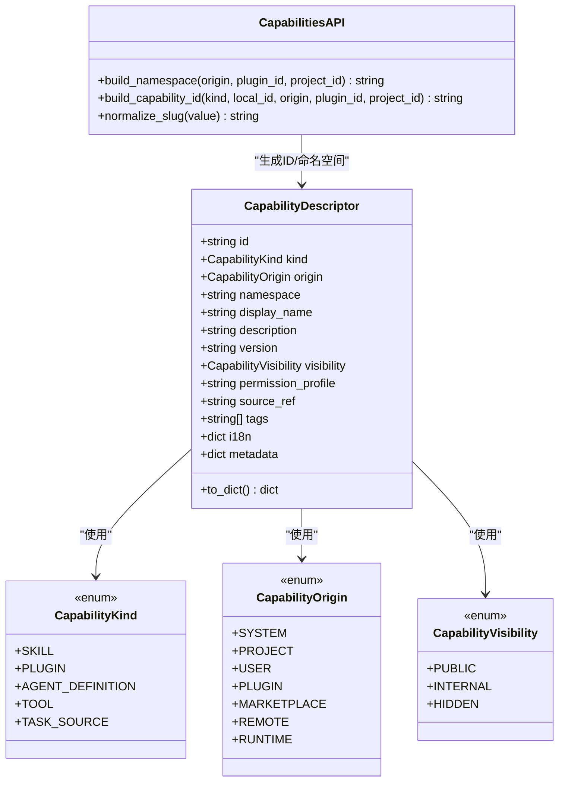
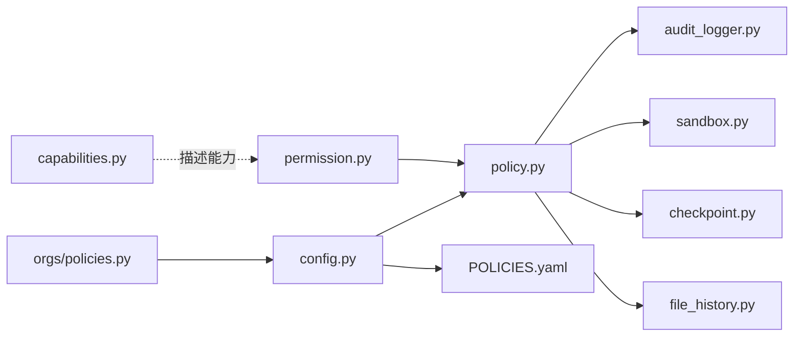

# 安全策略管理

<cite>
**本文引用的文件**
- [policy.py](file://src/synapse/core/policy.py)
- [permission.py](file://src/synapse/core/permission.py)
- [capabilities.py](file://src/synapse/core/capabilities.py)
- [audit_logger.py](file://src/synapse/core/audit_logger.py)
- [sandbox.py](file://src/synapse/core/sandbox.py)
- [checkpoint.py](file://src/synapse/core/checkpoint.py)
- [file_history.py](file://src/synapse/core/file_history.py)
- [POLICIES.yaml](file://identity/POLICIES.yaml)
- [config.py](file://src/synapse/api/routes/config.py)
- [policies.py](file://src/synapse/orgs/policies.py)
- [test_security.py](file://tests/unit/test_security.py)
</cite>

## 目录
1. [简介](#简介)
2. [项目结构](#项目结构)
3. [核心组件](#核心组件)
4. [架构总览](#架构总览)
5. [详细组件分析](#详细组件分析)
6. [依赖分析](#依赖分析)
7. [性能考量](#性能考量)
8. [故障排查指南](#故障排查指南)
9. [结论](#结论)
10. [附录](#附录)

## 简介
本文件为 Synapse 安全策略管理系统提供全面的技术文档，面向安全管理员与合规工程师，涵盖安全策略制定原则、实施机制、动态更新流程、能力管理（Capabilities）系统、策略评估引擎、规则匹配算法与决策逻辑，并提供配置示例、策略模板与最佳实践指南，以及审计、合规与风险评估方法。

## 项目结构
围绕安全策略管理的关键模块分布如下：
- 策略引擎与决策：src/synapse/core/policy.py
- 权限统一入口与规则集：src/synapse/core/permission.py
- 能力元数据与命名空间：src/synapse/core/capabilities.py
- 审计日志与自保护：src/synapse/core/audit_logger.py
- 沙箱与命令执行：src/synapse/core/sandbox.py
- 快照与回滚：src/synapse/core/checkpoint.py、src/synapse/core/file_history.py
- 策略配置与模板：identity/POLICIES.yaml、src/synapse/orgs/policies.py
- 配置读写接口：src/synapse/api/routes/config.py
- 单元测试与行为验证：tests/unit/test_security.py

图表来源
- [policy.py](file://src/synapse/core/policy.py)
- [permission.py](file://src/synapse/core/permission.py)
- [capabilities.py](file://src/synapse/core/capabilities.py)
- [audit_logger.py](file://src/synapse/core/audit_logger.py)
- [sandbox.py](file://src/synapse/core/sandbox.py)
- [checkpoint.py](file://src/synapse/core/checkpoint.py)
- [file_history.py](file://src/synapse/core/file_history.py)
- [POLICIES.yaml](file://identity/POLICIES.yaml)
- [config.py](file://src/synapse/api/routes/config.py)
- [policies.py](file://src/synapse/orgs/policies.py)

章节来源
- [policy.py](file://src/synapse/core/policy.py)
- [permission.py](file://src/synapse/core/permission.py)
- [capabilities.py](file://src/synapse/core/capabilities.py)
- [audit_logger.py](file://src/synapse/core/audit_logger.py)
- [sandbox.py](file://src/synapse/core/sandbox.py)
- [checkpoint.py](file://src/synapse/core/checkpoint.py)
- [file_history.py](file://src/synapse/core/file_history.py)
- [POLICIES.yaml](file://identity/POLICIES.yaml)
- [config.py](file://src/synapse/api/routes/config.py)
- [policies.py](file://src/synapse/orgs/policies.py)

## 核心组件
- 策略引擎（PolicyEngine）：实现六层安全防护（L1 区域矩阵、L3 命令风险分类、L4 快照、L5 自保护、L6 沙箱、L7 用户白名单）的统一决策核心，支持从 YAML 加载配置、动态更新与审计记录。
- 权限系统（Permission）：提供规则集（Ruleset）与评估（evaluate）机制，支持模式规则（计划/问答/协调）、额外规则（AgentProfile.permission_rules）与策略引擎集成。
- 能力元数据（Capabilities）：标准化能力标识、来源、命名空间与可见性，支撑权限与UI描述的一致性。
- 审计日志（AuditLogger）：持久化策略决策，屏蔽敏感字段，支持只读模式下的审计路径。
- 沙箱（Sandbox）：命令执行前的白/黑名单与模式匹配检查，结合超时与隔离后端。
- 快照与回滚（Checkpoint/History）：可控区文件修改前自动快照，支持按消息回滚与清理。
- 配置与模板（POLICIES.yaml、API路由、组织制度模板）：提供策略配置读写接口与组织制度模板安装。

章节来源
- [policy.py](file://src/synapse/core/policy.py)
- [permission.py](file://src/synapse/core/permission.py)
- [capabilities.py](file://src/synapse/core/capabilities.py)
- [audit_logger.py](file://src/synapse/core/audit_logger.py)
- [sandbox.py](file://src/synapse/core/sandbox.py)
- [checkpoint.py](file://src/synapse/core/checkpoint.py)
- [file_history.py](file://src/synapse/core/file_history.py)
- [POLICIES.yaml](file://identity/POLICIES.yaml)
- [config.py](file://src/synapse/api/routes/config.py)
- [policies.py](file://src/synapse/orgs/policies.py)

## 架构总览
策略管理采用“分层防护 + 统一决策 + 可观测”的设计：
- 分层防护：L1（区域×操作矩阵）、L3（命令风险分级）、L4（快照）、L5（自保护/只读开关）、L6（沙箱）、L7（用户白名单）。
- 统一决策：权限系统先评估模式与额外规则，再委托策略引擎进行最终判定。
- 可观测：审计日志记录决策、原因与元数据；自保护触发只读模式；快照支持回滚。

图表来源
- [permission.py](file://src/synapse/core/permission.py)
- [policy.py](file://src/synapse/core/policy.py)
- [audit_logger.py](file://src/synapse/core/audit_logger.py)
- [sandbox.py](file://src/synapse/core/sandbox.py)

## 详细组件分析

### 策略引擎（PolicyEngine）
- 决策流程：禁用检查 → 允许清单 → 只读开关 → 自保护 → 技能临时授权 → 旧版工具策略 → 命令风险 → 区域矩阵 → 允许。
- 关键特性：
  - 区域矩阵：Workspace/Controlled/Protected/Forbidden × 读/创建/编辑/覆盖/删除/递归删除。
  - 命令风险：CRITICAL/HIGH/MEDIUM/LOW 四级分类，结合确认模式与沙箱需求。
  - 自保护：禁止对关键目录执行高危命令或删除操作，触发只读模式。
  - 快照：可控区覆盖写入前标记需要快照。
  - 用户白名单：持久化白名单条目，支持命令与工具维度。
  - YAML 配置：支持新格式（六层）与旧格式（向后兼容）。
- 审计：所有决策均写入审计日志，含时间戳、工具名、决策、原因与元数据。

图表来源
- [policy.py](file://src/synapse/core/policy.py)

章节来源
- [policy.py](file://src/synapse/core/policy.py)
- [test_security.py](file://tests/unit/test_security.py)

### 权限系统（Permission）
- 规则模型：PermissionRule(permission, pattern, action)，支持 findLast 语义的规则匹配。
- 模式规则：计划/问答/协调三种模式分别预设工具可用范围。
- 统一入口：check_permission 先评估模式与额外规则，再调用策略引擎；若策略引擎不可用，根据工具类型决定 fail-closed 或 fail-open。
- 工具映射：将工具映射到“edit”、“read”或工具名类别，用于规则匹配。

图表来源
- [permission.py](file://src/synapse/core/permission.py)

章节来源
- [permission.py](file://src/synapse/core/permission.py)

### 能力管理（Capabilities）
- 描述符：CapabilityDescriptor 提供统一的能力标识、来源、命名空间、可见性与元数据。
- 命名空间：支持 system/project/user/plugin/marketplace/remote/runtime 等来源，插件/项目来源会规范化为 plugin:<id> 或 project:<id>。
- 应用场景：用于权限与UI层对能力的统一描述与展示。

图表来源
- [capabilities.py](file://src/synapse/core/capabilities.py)

章节来源
- [capabilities.py](file://src/synapse/core/capabilities.py)

### 审计与自保护
- 审计日志：JSONL 追加写入，屏蔽敏感键，支持自定义路径。
- 自保护：当连续拒绝或累计拒绝达到阈值时触发只读模式，阻止非只读操作。
- 死亡开关：只读模式不可被技能授权绕过，确保系统安全。

章节来源
- [audit_logger.py](file://src/synapse/core/audit_logger.py)
- [policy.py](file://src/synapse/core/policy.py)

### 沙箱与命令执行
- 命令沙箱：基于白/黑名单与正则模式检查，限制目录访问与网络，设置最大执行时间。
- 执行器：异步执行命令，超时强制终止，返回标准输出、错误与返回码。
- 风险联动：策略引擎在高/中风险命令时可要求沙箱执行。

章节来源
- [sandbox.py](file://src/synapse/core/sandbox.py)
- [policy.py](file://src/synapse/core/policy.py)

### 快照与回滚
- 快照管理：在可控区覆盖写入前记录原始文件哈希与备份路径，保留最近N份快照。
- 回滚机制：按消息ID定位快照，恢复文件并清理备份；失败时记录警告。

章节来源
- [checkpoint.py](file://src/synapse/core/checkpoint.py)
- [file_history.py](file://src/synapse/core/file_history.py)

### 策略配置与模板
- YAML 配置：支持 zones、confirmation、command_patterns、checkpoint、self_protection、sandbox、user_allowlist 等六层配置。
- API 接口：提供读取与更新安全配置的 REST 接口，更新后可重置策略引擎。
- 组织制度模板：提供默认制度模板（沟通规范、任务管理、代码审查、部署流程等），支持安装与索引生成。

章节来源
- [POLICIES.yaml](file://identity/POLICIES.yaml)
- [config.py](file://src/synapse/api/routes/config.py)
- [policies.py](file://src/synapse/orgs/policies.py)

## 依赖分析
- 权限系统依赖策略引擎进行最终决策；策略引擎依赖审计日志、沙箱与快照模块。
- 配置接口驱动策略引擎的配置加载与重置；组织制度模板服务于合规与制度管理。
- 能力元数据为权限与UI层提供统一描述，降低耦合。

图表来源
- [permission.py](file://src/synapse/core/permission.py)
- [policy.py](file://src/synapse/core/policy.py)
- [audit_logger.py](file://src/synapse/core/audit_logger.py)
- [sandbox.py](file://src/synapse/core/sandbox.py)
- [checkpoint.py](file://src/synapse/core/checkpoint.py)
- [file_history.py](file://src/synapse/core/file_history.py)
- [config.py](file://src/synapse/api/routes/config.py)
- [POLICIES.yaml](file://identity/POLICIES.yaml)
- [policies.py](file://src/synapse/orgs/policies.py)
- [capabilities.py](file://src/synapse/core/capabilities.py)

章节来源
- [permission.py](file://src/synapse/core/permission.py)
- [policy.py](file://src/synapse/core/policy.py)
- [audit_logger.py](file://src/synapse/core/audit_logger.py)
- [sandbox.py](file://src/synapse/core/sandbox.py)
- [checkpoint.py](file://src/synapse/core/checkpoint.py)
- [file_history.py](file://src/synapse/core/file_history.py)
- [config.py](file://src/synapse/api/routes/config.py)
- [POLICIES.yaml](file://identity/POLICIES.yaml)
- [policies.py](file://src/synapse/orgs/policies.py)
- [capabilities.py](file://src/synapse/core/capabilities.py)

## 性能考量
- 规则评估：evaluate 采用线性查找并以最后匹配规则为准，复杂度 O(N)；建议合理组织规则顺序以提升命中效率。
- 路径匹配：使用 fnmatch 与大小写不敏感匹配，注意 glob 模式的数量与层级深度。
- 正则匹配：命令风险分类使用多组正则，建议定期审查与去重，避免重复匹配开销。
- 沙箱执行：超时控制与子进程通信为异步，注意并发执行时的资源占用。
- 审计写入：JSONL 追加写入，建议在高并发场景下考虑缓冲与落盘策略。

## 故障排查指南
- 策略引擎不可用：fail-closed（高风险工具）或 fail-open（安全读路径）策略，检查日志与错误链路。
- 只读模式：连续/累计拒绝达到阈值触发，需人工干预解除；检查自保护配置与拒绝历史。
- 命令被拦截：确认命令是否命中 blocked_commands 或高危模式；必要时调整 confirmation 模式或加入允许清单。
- 审计缺失：检查审计路径与文件权限，确认 JSONL 写入成功。
- 配置更新失败：确认 POLICIES.yaml 可读取且格式正确，API 写入返回状态。

章节来源
- [permission.py](file://src/synapse/core/permission.py)
- [policy.py](file://src/synapse/core/policy.py)
- [audit_logger.py](file://src/synapse/core/audit_logger.py)
- [config.py](file://src/synapse/api/routes/config.py)

## 结论
Synapse 安全策略管理系统通过“分层防护 + 统一决策 + 可观测”的架构，提供了从区域矩阵、命令风险、快照回滚、自保护到沙箱与白名单的全栈安全能力。权限系统与策略引擎协同工作，既保证了灵活性，又确保了安全性与可审计性。建议在生产环境中结合组织制度模板与持续审计，形成闭环的合规与风险管理流程。

## 附录

### 安全策略制定原则
- 最小权限：默认拒绝，仅在明确授权时放行。
- 分层防护：多层策略叠加，确保单一漏洞不导致整体失效。
- 可观测性：所有决策均记录审计日志，支持追溯与分析。
- 可恢复性：可控区修改前自动快照，支持回滚。
- 可配置性：通过 YAML 与 API 实现策略动态更新。

### 实施机制与动态更新流程
- 配置加载：策略引擎从 identity/POLICIES.yaml 加载六层配置，支持新旧格式。
- 动态更新：API 提供读取与更新接口，更新后可重置策略引擎。
- 规则评估：权限系统先评估模式与额外规则，再委托策略引擎。
- 决策执行：策略引擎按层决策，记录审计日志，必要时触发沙箱或快照。

章节来源
- [POLICIES.yaml](file://identity/POLICIES.yaml)
- [config.py](file://src/synapse/api/routes/config.py)
- [permission.py](file://src/synapse/core/permission.py)
- [policy.py](file://src/synapse/core/policy.py)

### 能力管理（Capabilities）系统
- 能力声明：通过 CapabilityDescriptor 统一描述能力来源、命名空间与可见性。
- 权限控制：结合权限规则与能力元数据，实现细粒度的权限与UI描述一致性。
- 命名空间：支持插件/项目来源的规范化命名空间，便于权限与审计追踪。

章节来源
- [capabilities.py](file://src/synapse/core/capabilities.py)

### 策略评估引擎、规则匹配与决策逻辑
- 规则匹配：evaluate 采用 findLast 语义，最后匹配规则生效。
- 决策链：权限系统与策略引擎均记录决策链，便于审计与溯源。
- 模式规则：计划/问答/协调模式限制工具可用范围，避免误操作。

章节来源
- [permission.py](file://src/synapse/core/permission.py)
- [policy.py](file://src/synapse/core/policy.py)

### 安全策略配置示例与模板
- 策略配置示例：zones、confirmation、command_patterns、checkpoint、self_protection、sandbox、user_allowlist。
- 组织制度模板：沟通规范、任务管理、代码审查、部署流程等，支持安装与索引生成。

章节来源
- [POLICIES.yaml](file://identity/POLICIES.yaml)
- [policies.py](file://src/synapse/orgs/policies.py)

### 审计、合规与风险评估
- 审计：JSONL 记录决策、原因与元数据，屏蔽敏感信息。
- 合规：结合组织制度模板与策略配置，形成合规基线。
- 风险评估：命令风险分级与确认模式，支持 yolo/smart/cautious 三种模式。

章节来源
- [audit_logger.py](file://src/synapse/core/audit_logger.py)
- [policies.py](file://src/synapse/orgs/policies.py)
- [policy.py](file://src/synapse/core/policy.py)