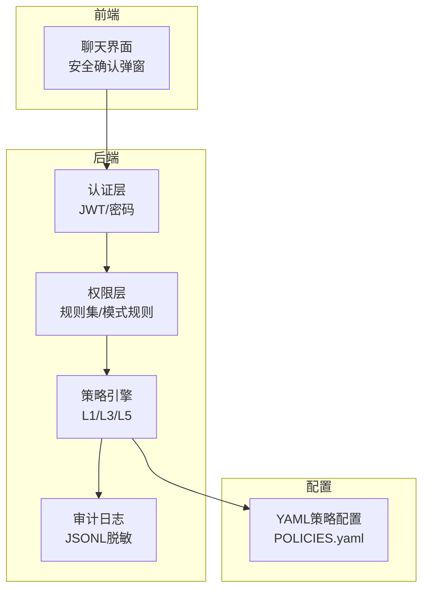
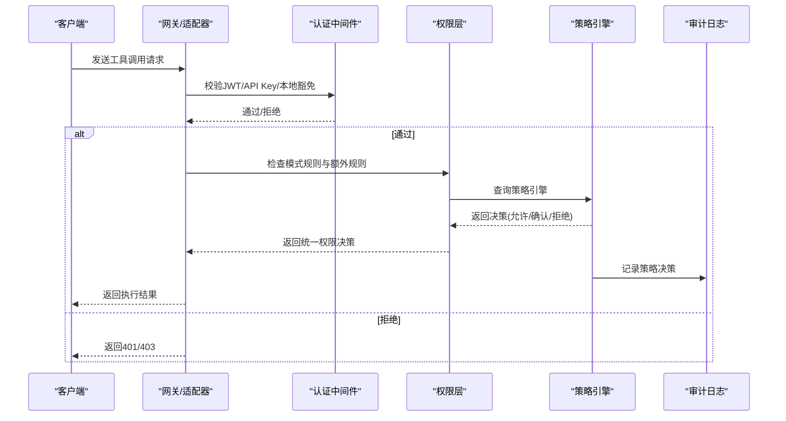
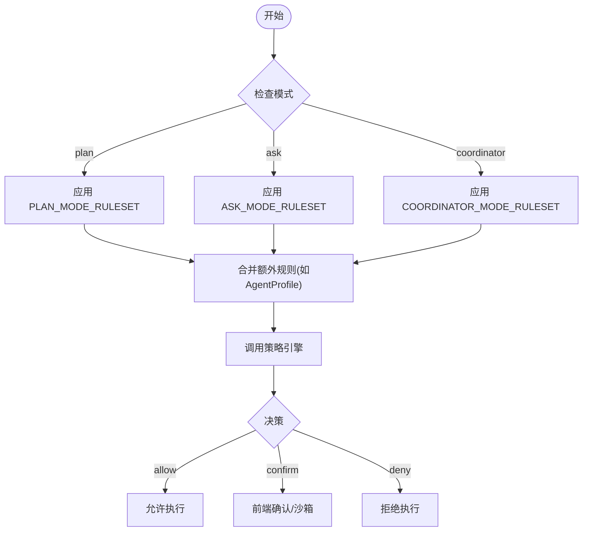
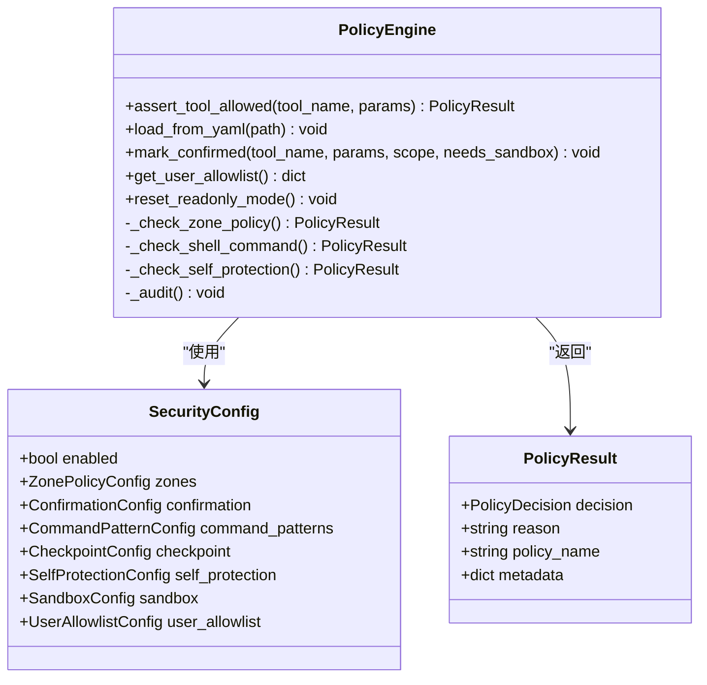
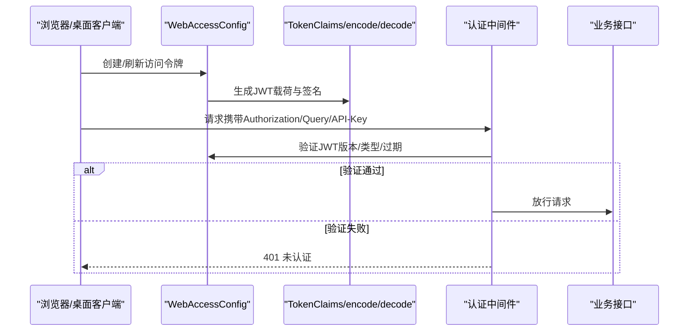
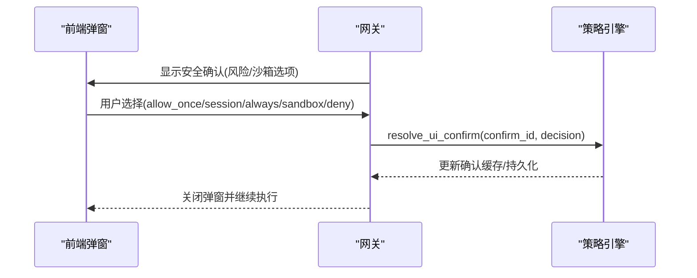
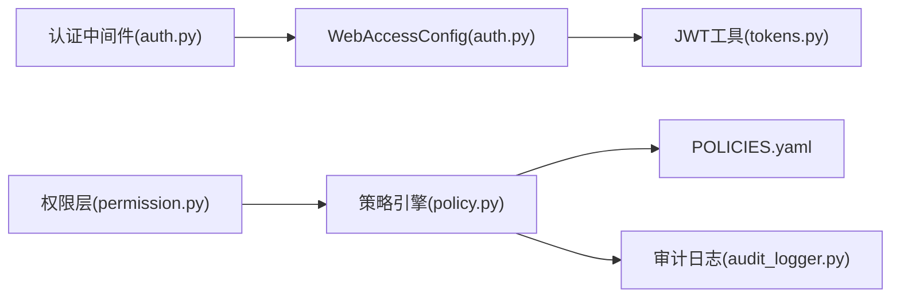

# 权限控制系统

<cite>
**本文档引用的文件**
- [permission.py](file://src/synapse/core/permission.py)
- [policy.py](file://src/synapse/core/policy.py)
- [auth.py](file://src/synapse/api/auth.py)
- [tokens.py](file://src/synapse/core/auth/tokens.py)
- [audit_logger.py](file://src/synapse/core/audit_logger.py)
- [POLICIES.yaml](file://identity/POLICIES.yaml)
- [permissions.md](file://synapse-plugin-sdk/docs/permissions.md)
- [gateway.py](file://src/synapse/channels/gateway.py)
- [SecurityConfirmModal.tsx](file://apps/setup-center/src/views/chat/components/SecurityConfirmModal.tsx)
- [auth.ts](file://apps/setup-center/src/platform/auth.ts)
</cite>

## 目录
1. [简介](#简介)
2. [项目结构](#项目结构)
3. [核心组件](#核心组件)
4. [架构总览](#架构总览)
5. [详细组件分析](#详细组件分析)
6. [依赖关系分析](#依赖关系分析)
7. [性能考虑](#性能考虑)
8. [故障排除指南](#故障排除指南)
9. [结论](#结论)
10. [附录](#附录)

## 简介
本文件为 Synapse 权限控制系统提供全面的技术文档，涵盖三层权限模型（Basic、Advanced、System）、令牌管理与身份验证流程、授权决策过程、权限检查机制、访问控制列表与资源保护策略，并提供配置示例、角色定义指南与安全最佳实践。文档同时讨论权限审计、日志记录与违规检测，面向系统管理员与安全开发人员。

## 项目结构
Synapse 权限控制由多层协同实现：
- 核心权限层：基于规则集的工具级权限与模式规则（plan/ask/agent/coordinator）
- 策略引擎层：六层安全防护（L1 区域矩阵、L3 Shell 风险分类、L5 自保护等）
- 令牌与认证层：单密码模式的 JWT 令牌与中间件
- 审计与日志层：策略决策持久化审计与敏感信息脱敏
- 插件权限模型：三级权限（Basic/Advanced/System）与权限清单

**图表来源**
- [permission.py:248-380](file://src/synapse/core/permission.py#L248-L380)
- [policy.py:526-854](file://src/synapse/core/policy.py#L526-L854)
- [auth.py:328-380](file://src/synapse/api/auth.py#L328-L380)
- [audit_logger.py:54-110](file://src/synapse/core/audit_logger.py#L54-L110)
- [POLICIES.yaml:1-81](file://identity/POLICIES.yaml#L1-L81)

**章节来源**
- [permission.py:1-495](file://src/synapse/core/permission.py#L1-L495)
- [policy.py:1-1569](file://src/synapse/core/policy.py#L1-L1569)
- [auth.py:1-380](file://src/synapse/api/auth.py#L1-L380)
- [audit_logger.py:1-111](file://src/synapse/core/audit_logger.py#L1-L111)
- [POLICIES.yaml:1-81](file://identity/POLICIES.yaml#L1-L81)

## 核心组件
- 权限层（Permission Layer）
  - 规则集与匹配：支持通配符匹配、最后一条规则生效
  - 模式规则：plan/ask/coordinator 模式下的工具可见性与可用性控制
  - 工具映射：编辑类工具映射到 edit 分类，读取类工具映射到 read 分类
- 策略引擎（Policy Engine）
  - 六层安全防护：L1 区域矩阵、L3 Shell 风险分类、L5 自保护、确认门、沙箱、快照
  - 决策链：ZonePolicy → RiskClassification → SelfProtection → ToolPolicy → Allow
  - 允许列表：持久化/会话/TTL 三层缓存
- 认证与令牌（Auth & Tokens）
  - 单密码模式：本地免认证，远程请求需 JWT 或 API Key
  - JWT Claims：subject、iat、exp、jti、type、ver、scope
  - 中间件：基于路径豁免、本地回环、代理头信任
- 审计与日志（Audit Logger）
  - JSONL 追加写入，进程崩溃不丢失
  - 敏感信息脱敏（api_key/password/token 等关键字掩码）

**章节来源**
- [permission.py:57-124](file://src/synapse/core/permission.py#L57-L124)
- [policy.py:36-110](file://src/synapse/core/policy.py#L36-L110)
- [auth.py:91-250](file://src/synapse/api/auth.py#L91-L250)
- [tokens.py:53-77](file://src/synapse/core/auth/tokens.py#L53-L77)
- [audit_logger.py:54-110](file://src/synapse/core/audit_logger.py#L54-L110)

## 架构总览
权限控制采用分层设计，前端通过安全确认弹窗与后端交互，后端在工具执行前进行模式规则与策略引擎双重校验，并记录审计日志。

**图表来源**
- [auth.py:328-380](file://src/synapse/api/auth.py#L328-L380)
- [permission.py:248-331](file://src/synapse/core/permission.py#L248-L331)
- [policy.py:759-854](file://src/synapse/core/policy.py#L759-L854)
- [audit_logger.py:1485-1517](file://src/synapse/core/audit_logger.py#L1485-L1517)

## 详细组件分析

### 权限模型与规则集
- 三层权限模型（插件侧）
  - Basic：安装即有，日志、配置读写、工具注册、基础钩子
  - Advanced：通道、记忆读写、检索源、路由、消息发送、宿主服务访问、消息/检索钩子
  - System：LLM 注册、记忆替换、全钩子、系统配置写入
- 工具分类与规则匹配
  - 编辑类工具映射到 edit 分类，读取类工具映射到 read 分类
  - 支持通配符匹配与“最后一条规则生效”语义
- 模式规则集
  - plan：限制编辑范围至 data/plans/*.md，允许计划相关工具
  - ask：仅允许读取与搜索，禁止写入与命令执行
  - coordinator：仅允许委派与任务管理相关工具

**图表来源**
- [permission.py:334-380](file://src/synapse/core/permission.py#L334-L380)
- [permission.py:248-331](file://src/synapse/core/permission.py#L248-L331)

**章节来源**
- [permissions.md:1-30](file://synapse-plugin-sdk/docs/permissions.md#L1-L30)
- [permission.py:383-495](file://src/synapse/core/permission.py#L383-L495)

### 策略引擎与六层安全防护
- L1 区域矩阵（Zone × OpType）
  - 四区：workspace/controlled/protected/forbidden
  - 操作类型：read/create/edit/overwrite/delete/recursive_delete
  - 控制策略：不同区域对不同操作采取 ALLOW/CONFIRM/DENY
- L3 Shell 命令风险分类
  - 危险模式：critical/high/medium/low
  - 平台特定模式匹配（Windows/macOS/Linux）
  - 可配置黑名单与排除模式
- L5 自保护
  - 防止对 Agent 关键目录的高危操作
  - 死亡开关：连续/累计拒绝触发只读模式
- 确认门与允许列表
  - TTL/会话/持久化三层确认缓存
  - 支持沙箱标记与网络白名单
- 快照与恢复
  - 受控区写入前生成快照，支持回滚

**图表来源**
- [policy.py:526-854](file://src/synapse/core/policy.py#L526-L854)
- [policy.py:278-394](file://src/synapse/core/policy.py#L278-L394)

**章节来源**
- [policy.py:77-110](file://src/synapse/core/policy.py#L77-L110)
- [policy.py:116-214](file://src/synapse/core/policy.py#L116-L214)
- [policy.py:1101-1137](file://src/synapse/core/policy.py#L1101-L1137)
- [policy.py:1182-1217](file://src/synapse/core/policy.py#L1182-L1217)
- [policy.py:1219-1404](file://src/synapse/core/policy.py#L1219-L1404)

### 令牌管理与身份验证流程
- 单密码模式
  - 本地请求（127.0.0.1）免认证
  - 远程请求需 JWT 或 X-API-Key
- JWT 令牌
  - Claims：subject、iat、exp、jti、type、ver、scope
  - 加密算法：HS256
  - 版本号：token_version，密码变更时递增
- 中间件
  - 路径豁免：健康检查、登录/刷新等
  - 本地回环与代理头信任
  - 支持查询参数 token 与 X-API-Key

**图表来源**
- [auth.py:91-250](file://src/synapse/api/auth.py#L91-L250)
- [tokens.py:26-51](file://src/synapse/core/auth/tokens.py#L26-L51)
- [auth.ts:124-146](file://apps/setup-center/src/platform/auth.ts#L124-L146)

**章节来源**
- [auth.py:38-49](file://src/synapse/api/auth.py#L38-L49)
- [auth.py:328-380](file://src/synapse/api/auth.py#L328-L380)
- [tokens.py:53-77](file://src/synapse/core/auth/tokens.py#L53-L77)
- [auth.ts:1-146](file://apps/setup-center/src/platform/auth.ts#L1-L146)

### 授权决策过程与前端确认
- 前端安全确认弹窗
  - 支持“允许一次/会话/始终/沙箱/拒绝”
  - 风险等级提示与倒计时
- 网关事件处理
  - 发送安全确认事件，等待用户中断队列回复
  - 解析用户选择并调用策略引擎确认接口

**图表来源**
- [SecurityConfirmModal.tsx:164-200](file://apps/setup-center/src/views/chat/components/SecurityConfirmModal.tsx#L164-L200)
- [gateway.py:4563-4597](file://src/synapse/channels/gateway.py#L4563-L4597)
- [policy.py:1448-1481](file://src/synapse/core/policy.py#L1448-L1481)

**章节来源**
- [SecurityConfirmModal.tsx:164-200](file://apps/setup-center/src/views/chat/components/SecurityConfirmModal.tsx#L164-L200)
- [gateway.py:4563-4597](file://src/synapse/channels/gateway.py#L4563-L4597)
- [policy.py:1406-1481](file://src/synapse/core/policy.py#L1406-L1481)

### 权限检查机制与资源保护策略
- 路径级权限检查
  - 写入前调用 check_path，依据规则 action（allow/deny/ask）决定放行
- 区域矩阵保护
  - 受保护/禁止区域严格限制读写与删除
  - 受控区写入前生成快照
- Shell 命令风险控制
  - 危险命令直接拒绝，高风险需要确认，中风险根据模式自动处理
- 自保护与死亡开关
  - 防止对 Agent 关键目录的破坏性操作
  - 连续/累计拒绝触发只读模式

**章节来源**
- [permission.py:164-177](file://src/synapse/core/permission.py#L164-L177)
- [policy.py:886-972](file://src/synapse/core/policy.py#L886-L972)
- [policy.py:1101-1137](file://src/synapse/core/policy.py#L1101-L1137)
- [policy.py:1182-1217](file://src/synapse/core/policy.py#L1182-L1217)

### 访问控制列表与策略配置
- YAML 配置项
  - zones：工作区/受控区/受保护区/禁止区路径与默认区域
  - confirmation：确认门模式（cautious/smart/yolo）、超时与默认策略
  - command_patterns：命令模式黑名单、自定义高危/临界模式、排除模式
  - checkpoint：快照开关、最大数量与目录
  - self_protection：关键目录保护、审计路径、死亡开关阈值
  - sandbox：沙箱开关、风险等级、网络白名单
  - user_allowlist：持久化允许列表（命令/工具）
- 默认配置
  - 工作区默认为当前工作目录
  - 受保护区默认包含系统关键路径
  - 禁止区默认包含敏感目录与文件

**章节来源**
- [POLICIES.yaml:1-81](file://identity/POLICIES.yaml#L1-L81)
- [policy.py:564-591](file://src/synapse/core/policy.py#L564-L591)

## 依赖关系分析
- 权限层依赖策略引擎进行最终决策，并收集决策链路用于审计
- 策略引擎依赖 YAML 配置文件加载安全策略
- 认证中间件依赖 WebAccessConfig 进行 JWT 验证与路径豁免判断
- 审计日志依赖策略引擎提供的元数据与策略名称

**图表来源**
- [auth.py:328-380](file://src/synapse/api/auth.py#L328-L380)
- [tokens.py:26-51](file://src/synapse/core/auth/tokens.py#L26-L51)
- [permission.py:294-331](file://src/synapse/core/permission.py#L294-L331)
- [policy.py:595-622](file://src/synapse/core/policy.py#L595-L622)
- [audit_logger.py:1505-1517](file://src/synapse/core/audit_logger.py#L1505-L1517)

**章节来源**
- [auth.py:328-380](file://src/synapse/api/auth.py#L328-L380)
- [permission.py:294-331](file://src/synapse/core/permission.py#L294-L331)
- [policy.py:595-622](file://src/synapse/core/policy.py#L595-L622)
- [audit_logger.py:1505-1517](file://src/synapse/core/audit_logger.py#L1505-L1517)

## 性能考虑
- 规则匹配复杂度
  - 规则集合并与线性扫描，时间复杂度 O(N)，其中 N 为规则总数
  - 通配符匹配使用 fnmatch，建议合理组织规则以减少匹配开销
- 策略引擎缓存
  - TTL/会话/持久化三层允许列表缓存，降低重复确认成本
  - 快照与沙箱启用需权衡磁盘与 CPU 开销
- 审计日志
  - JSONL 追加写入，建议定期轮转与压缩，避免单文件过大

[本节为通用性能建议，无需具体文件分析]

## 故障排除指南
- 认证失败
  - 检查本地回环与代理头信任设置
  - 确认 JWT 类型与版本号匹配
  - 核对 X-API-Key 与密码哈希一致性
- 策略引擎不可用
  - 权限层在策略引擎异常时遵循 fail-closed/fail-open 策略
  - 高风险工具在不可用时默认拒绝，安全读路径默认放行
- 审计日志缺失
  - 检查审计路径与文件权限
  - 确认策略引擎审计回调是否抛出异常
- 死亡开关触发
  - 连续/累计拒绝达到阈值后进入只读模式
  - 手动重置只读模式后恢复正常

**章节来源**
- [auth.py:328-380](file://src/synapse/api/auth.py#L328-L380)
- [permission.py:314-331](file://src/synapse/core/permission.py#L314-L331)
- [audit_logger.py:80-84](file://src/synapse/core/audit_logger.py#L80-L84)
- [policy.py:1182-1217](file://src/synapse/core/policy.py#L1182-L1217)

## 结论
Synapse 权限控制系统通过“规则集 + 策略引擎”的双层设计，在工具执行前进行严格的安全校验，并结合前端确认与审计日志形成闭环。三层权限模型（Basic/Advanced/System）满足插件生态的差异化需求；六层安全防护（L1/L3/L5）覆盖路径、命令与自保护场景；令牌与认证机制保障远程访问安全。建议管理员结合业务场景优化 YAML 配置，合理使用确认门与允许列表，并定期审查审计日志以发现潜在风险。

[本节为总结性内容，无需具体文件分析]

## 附录

### 权限配置示例（YAML）
- 工作区/受控区/受保护区/禁止区路径
- 确认门模式与超时
- Shell 命令黑名单与自定义模式
- 沙箱与网络白名单
- 自保护关键目录与审计路径

**章节来源**
- [POLICIES.yaml:1-81](file://identity/POLICIES.yaml#L1-L81)

### 角色定义指南
- Basic：仅具备日志与配置读写能力，适合只读或最小权限插件
- Advanced：允许通道、记忆与消息钩子，适合需要与系统交互的插件
- System：最高权限，仅在严格审核与必要场景下授予

**章节来源**
- [permissions.md:11-15](file://synapse-plugin-sdk/docs/permissions.md#L11-L15)

### 安全最佳实践
- 最小权限原则：插件仅申请 Basic/Advanced，避免 System
- 审计优先：开启自保护与审计日志，定期巡检
- 确认门策略：生产环境建议 smart 模式，谨慎使用 yolo
- 密码与令牌：定期轮换 token_version，避免明文存储
- 快照与回滚：受控区写入务必启用快照，保留历史版本

[本节为通用最佳实践，无需具体文件分析]