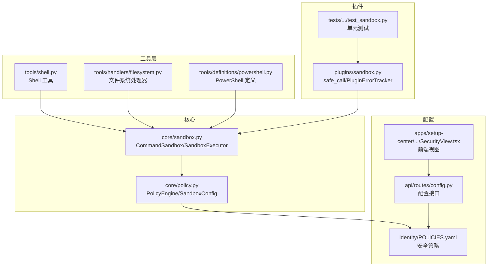
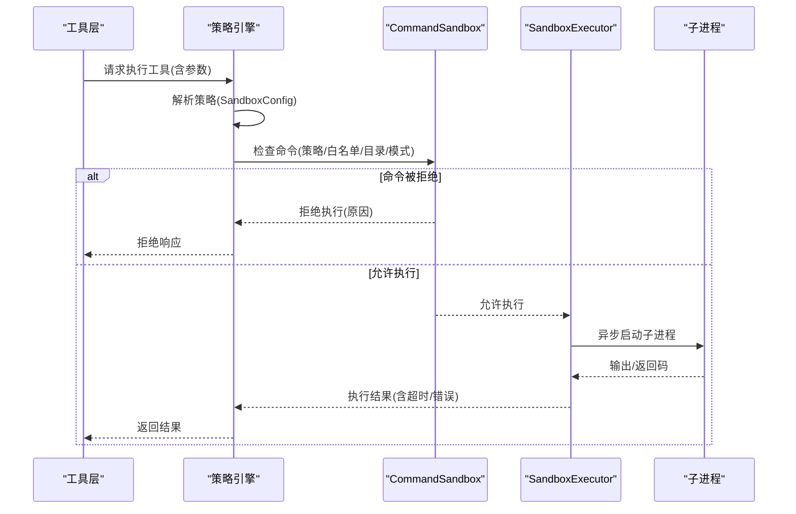
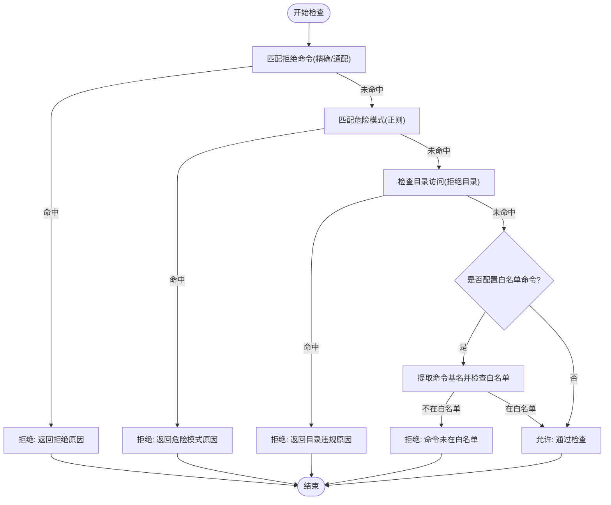
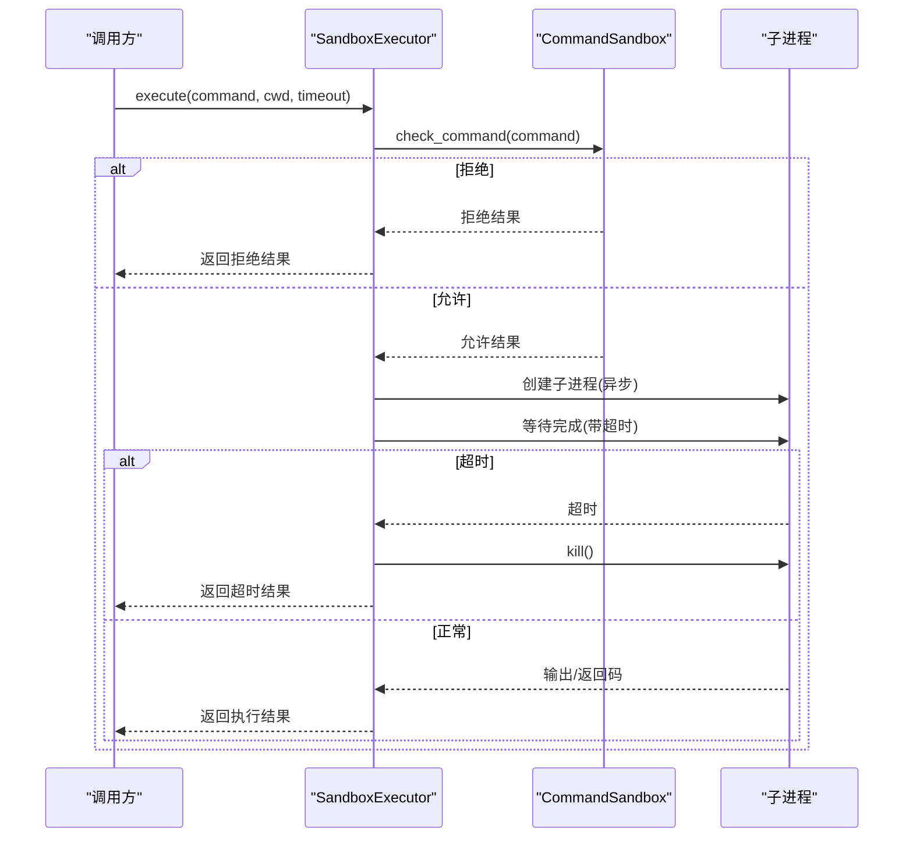
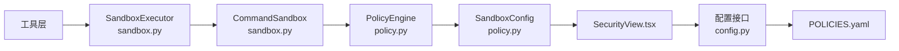

# 沙箱执行系统

<cite>
**本文档引用的文件**
- [sandbox.py](file://src/synapse/core/sandbox.py)
- [policy.py](file://src/synapse/core/policy.py)
- [POLICIES.yaml](file://identity/POLICIES.yaml)
- [config.py](file://src/synapse/api/routes/config.py)
- [SecurityView.tsx](file://apps/setup-center/src/views/SecurityView.tsx)
- [test_sandbox.py](file://tests/unit/test_plugins/test_sandbox.py)
- [shell.py](file://src/synapse/tools/shell.py)
- [filesystem.py](file://src/synapse/tools/handlers/filesystem.py)
- [powershell.py](file://src/synapse/tools/definitions/powershell.py)
</cite>

## 目录
1. [简介](#简介)
2. [项目结构](#项目结构)
3. [核心组件](#核心组件)
4. [架构总览](#架构总览)
5. [详细组件分析](#详细组件分析)
6. [依赖关系分析](#依赖关系分析)
7. [性能考虑](#性能考虑)
8. [故障排除指南](#故障排除指南)
9. [结论](#结论)
10. [附录](#附录)

## 简介
本文件为 Synapse 沙箱执行系统的详细技术文档，聚焦于命令沙箱 CommandSandbox 的策略定义、命令检查机制与执行流程；同时解析 SandboxExecutor 执行器的异步命令执行、超时控制与错误处理。文档还提供沙箱配置示例、安全策略制定指南与性能优化建议，帮助开发者与安全工程师高效、安全地使用 Synapse 的沙箱能力。

## 项目结构
围绕沙箱功能的相关代码主要分布在以下模块：
- 核心沙箱与执行器：src/synapse/core/sandbox.py
- 策略引擎与配置：src/synapse/core/policy.py
- 安全策略配置文件：identity/POLICIES.yaml
- 配置接口与前端视图：src/synapse/api/routes/config.py、apps/setup-center/src/views/SecurityView.tsx
- 插件沙箱包装器：src/synapse/plugins/sandbox.py
- 工具层命令执行：src/synapse/tools/shell.py、src/synapse/tools/handlers/filesystem.py、src/synapse/tools/definitions/powershell.py
- 单元测试：tests/unit/test_plugins/test_sandbox.py

图表来源
- [sandbox.py:1-262](file://src/synapse/core/sandbox.py#L1-L262)
- [policy.py:356-555](file://src/synapse/core/policy.py#L356-L555)
- [POLICIES.yaml:1-81](file://identity/POLICIES.yaml#L1-L81)
- [config.py:983-1024](file://src/synapse/api/routes/config.py#L983-L1024)
- [SecurityView.tsx:511-556](file://apps/setup-center/src/views/SecurityView.tsx#L511-L556)
- [shell.py:1-170](file://src/synapse/tools/shell.py#L1-L170)
- [filesystem.py:227-325](file://src/synapse/tools/handlers/filesystem.py#L227-L325)
- [powershell.py:1-36](file://src/synapse/tools/definitions/powershell.py#L1-L36)
- [test_sandbox.py:1-175](file://tests/unit/test_plugins/test_sandbox.py#L1-L175)

章节来源
- [sandbox.py:1-262](file://src/synapse/core/sandbox.py#L1-L262)
- [policy.py:356-555](file://src/synapse/core/policy.py#L356-L555)
- [POLICIES.yaml:1-81](file://identity/POLICIES.yaml#L1-L81)
- [config.py:983-1024](file://src/synapse/api/routes/config.py#L983-L1024)
- [SecurityView.tsx:511-556](file://apps/setup-center/src/views/SecurityView.tsx#L511-L556)

## 核心组件
- CommandSandbox：负责命令执行前的安全检查，包括拒绝列表、危险模式匹配、目录访问限制与白名单命令检查。
- SandboxExecutor：基于 asyncio/subprocess 的异步执行器，负责超时控制、进程终止与错误封装。
- SandboxPolicy：策略配置对象，包含允许/拒绝目录、允许/拒绝命令、命令模式匹配、最大执行时间、网络开关与可写目录等。
- SandboxConfig：策略引擎中的沙箱配置对象，与 PolicyEngine 协同工作，决定是否进入沙箱执行以及网络策略。
- 插件沙箱包装器：提供 safe_call/safe_call_sync 与 PluginErrorTracker，用于插件侧的超时与异常隔离。

章节来源
- [sandbox.py:27-128](file://src/synapse/core/sandbox.py#L27-L128)
- [sandbox.py:186-262](file://src/synapse/core/sandbox.py#L186-L262)
- [policy.py:356-366](file://src/synapse/core/policy.py#L356-L366)
- [policy.py:526-555](file://src/synapse/core/policy.py#L526-L555)

## 架构总览
下图展示了从工具调用到沙箱执行的整体流程，以及策略引擎对沙箱配置的影响。

图表来源
- [policy.py:526-555](file://src/synapse/core/policy.py#L526-L555)
- [sandbox.py:90-128](file://src/synapse/core/sandbox.py#L90-L128)
- [sandbox.py:195-262](file://src/synapse/core/sandbox.py#L195-L262)

## 详细组件分析

### CommandSandbox 命令沙箱
CommandSandbox 在执行前进行多层检查：
- 拒绝命令精确匹配与通配符匹配
- 危险命令正则模式匹配
- 目录访问检查（拒绝目录前缀）
- 白名单命令检查（若配置了 allowed_commands）

图表来源
- [sandbox.py:90-128](file://src/synapse/core/sandbox.py#L90-L128)
- [sandbox.py:163-168](file://src/synapse/core/sandbox.py#L163-L168)

章节来源
- [sandbox.py:72-128](file://src/synapse/core/sandbox.py#L72-L128)

### SandboxExecutor 执行器
SandboxExecutor 提供异步执行能力，包含：
- 命令预检：调用 CommandSandbox.check_command
- 超时控制：取传入 timeout 与策略 max_execution_time 的较小值
- 子进程执行：使用 asyncio.subprocess 启动 shell 命令
- 错误处理：超时、异常捕获与结果封装

图表来源
- [sandbox.py:195-262](file://src/synapse/core/sandbox.py#L195-L262)

章节来源
- [sandbox.py:186-262](file://src/synapse/core/sandbox.py#L186-L262)

### SandboxPolicy 策略配置
SandboxPolicy 定义了沙箱的检查规则与执行约束：
- allowed_dirs：允许访问的目录列表，默认包含项目根目录
- denied_dirs：拒绝访问的目录列表（如系统敏感路径、用户私密目录）
- allowed_commands：白名单命令列表（若设置，则仅允许白名单内的命令）
- denied_commands：拒绝命令列表（支持通配符）
- denied_command_patterns：危险命令正则模式列表
- max_execution_time：最大执行时间（秒）
- allow_network：是否允许网络访问
- writable_dirs：可写目录列表

章节来源
- [sandbox.py:27-61](file://src/synapse/core/sandbox.py#L27-L61)

### SandboxConfig 策略引擎配置
SandboxConfig 是策略引擎中的沙箱配置对象，用于控制：
- enabled：是否启用沙箱
- backend：沙箱后端（如 auto）
- sandbox_risk_levels：触发沙箱的风险等级集合（如 HIGH/MEDIUM）
- exempt_commands：豁免命令列表（不经过沙箱）
- network_allow_in_sandbox：沙箱内是否允许网络
- network_allowed_domains：沙箱内允许访问的域名列表

章节来源
- [policy.py:356-366](file://src/synapse/core/policy.py#L356-L366)
- [POLICIES.yaml:69-78](file://identity/POLICIES.yaml#L69-L78)

### 插件沙箱包装器（safe_call/safe_call_sync）
插件沙箱提供超时与异常隔离能力：
- safe_call：异步调用包装，支持超时与异常捕获，返回默认值而非抛出异常
- safe_call_sync：同步调用包装，同样提供异常捕获与默认返回
- PluginErrorTracker：记录插件错误并在阈值达到时自动禁用插件

章节来源
- [plugins/sandbox.py:66-127](file://src/synapse/plugins/sandbox.py#L66-L127)
- [test_sandbox.py:1-175](file://tests/unit/test_plugins/test_sandbox.py#L1-L175)

## 依赖关系分析
- CommandSandbox 依赖 SandboxPolicy 进行规则判断，并在初始化时确保 allowed_dirs/writable_dirs 有默认值。
- SandboxExecutor 依赖 CommandSandbox 进行预检，并在执行阶段使用 asyncio.subprocess 控制进程生命周期。
- 策略引擎 PolicyEngine 读取 SandboxConfig 决定是否需要沙箱执行，并与前端配置接口联动。
- 前端 SecurityView.tsx 与配置接口共同维护沙箱配置项（启用、后端、风险等级、豁免命令、网络策略）。
- 工具层（Shell/PowerShell/文件系统）最终调用 SandboxExecutor 执行命令。

图表来源
- [policy.py:356-555](file://src/synapse/core/policy.py#L356-L555)
- [config.py:983-1024](file://src/synapse/api/routes/config.py#L983-L1024)
- [SecurityView.tsx:511-556](file://apps/setup-center/src/views/SecurityView.tsx#L511-L556)
- [POLICIES.yaml:69-78](file://identity/POLICIES.yaml#L69-L78)
- [sandbox.py:186-262](file://src/synapse/core/sandbox.py#L186-L262)

章节来源
- [policy.py:526-555](file://src/synapse/core/policy.py#L526-L555)
- [config.py:983-1024](file://src/synapse/api/routes/config.py#L983-L1024)
- [SecurityView.tsx:511-556](file://apps/setup-center/src/views/SecurityView.tsx#L511-L556)
- [sandbox.py:186-262](file://src/synapse/core/sandbox.py#L186-L262)

## 性能考虑
- 超时控制：SandboxExecutor 会取传入 timeout 与策略 max_execution_time 的较小值，避免过长执行阻塞。
- 异步执行：使用 asyncio.subprocess 非阻塞等待，提升并发能力。
- 结果解码：输出按 UTF-8 解码并替换不可解码字节，保证稳定性。
- 插件侧隔离：safe_call/safe_call_sync 将异常与超时转化为默认返回，避免单个插件拖垮整体。
- 建议：
  - 合理设置 max_execution_time，结合任务性质调整。
  - 对高风险命令优先采用沙箱执行，降低系统影响面。
  - 使用白名单命令减少不必要的检查开销。

## 故障排除指南
- 命令被拒绝
  - 检查 denied_commands 与 denied_command_patterns 是否匹配
  - 确认命令是否在 allowed_commands 白名单中（若配置）
  - 检查目录是否位于 denied_dirs
- 超时
  - 提升 timeout 或调整策略 max_execution_time
  - 检查命令本身是否陷入死循环或外部依赖阻塞
- 异常
  - 查看返回的 stderr 与 backend 标识
  - 使用 safe_call 包装插件调用，避免异常传播
- 配置问题
  - 通过配置接口读取/更新沙箱配置
  - 确认前端 SecurityView 中的选项与后端配置一致

章节来源
- [sandbox.py:195-262](file://src/synapse/core/sandbox.py#L195-L262)
- [plugins/sandbox.py:66-127](file://src/synapse/plugins/sandbox.py#L66-L127)
- [config.py:983-1024](file://src/synapse/api/routes/config.py#L983-L1024)

## 结论
Synapse 的沙箱执行系统通过 CommandSandbox 的严格策略检查与 SandboxExecutor 的异步执行控制，提供了可控、可观测且可扩展的命令执行能力。结合策略引擎的 SandboxConfig 与前端配置界面，用户可以灵活地定义沙箱策略、风险等级与网络访问规则。插件沙箱包装器进一步增强了系统的鲁棒性。建议在生产环境中优先采用沙箱执行高风险命令，并根据业务需求持续优化策略配置与性能参数。

## 附录

### 沙箱配置示例
- 策略文件（POLICIES.yaml）片段
  - 启用沙箱、设置后端为 auto、默认仅对 HIGH 风险命令启用沙箱
  - 允许访问的网络域为空，表示默认不允许网络
  - 豁免命令列表为空，表示不跳过任何命令

章节来源
- [POLICIES.yaml:69-78](file://identity/POLICIES.yaml#L69-L78)

### 安全策略制定指南
- 目录访问
  - 将 denied_dirs 设置为系统关键目录与用户私密目录
  - 仅在必要时将 writable_dirs 扩展到特定目录
- 命令白名单
  - 若业务允许，尽量启用 allowed_commands 并明确列出允许的命令
- 危险模式
  - 结合 denied_command_patterns 与策略引擎的危险模式库，覆盖常见高危命令
- 风险等级
  - 通过 sandbox_risk_levels 选择 HIGH/MEDIUM 等级，决定哪些命令进入沙箱
- 网络访问
  - 默认关闭沙箱内网络访问，仅在确有需要时配置 allowed_domains

章节来源
- [sandbox.py:27-61](file://src/synapse/core/sandbox.py#L27-L61)
- [policy.py:356-366](file://src/synapse/core/policy.py#L356-L366)
- [POLICIES.yaml:69-78](file://identity/POLICIES.yaml#L69-L78)

### 使用示例与集成点
- 工具层命令执行
  - Shell 工具与 PowerShell 工具最终可能通过 SandboxExecutor 执行
  - 文件系统处理器在执行 shell 命令时遵循策略与日志规范
- 插件侧调用
  - 使用 safe_call 包装异步任务，设置合理超时与默认返回
  - 使用 safe_call_sync 包装同步任务，避免异常扩散

章节来源
- [shell.py:1-170](file://src/synapse/tools/shell.py#L1-L170)
- [filesystem.py:227-325](file://src/synapse/tools/handlers/filesystem.py#L227-L325)
- [powershell.py:1-36](file://src/synapse/tools/definitions/powershell.py#L1-L36)
- [plugins/sandbox.py:66-127](file://src/synapse/plugins/sandbox.py#L66-L127)