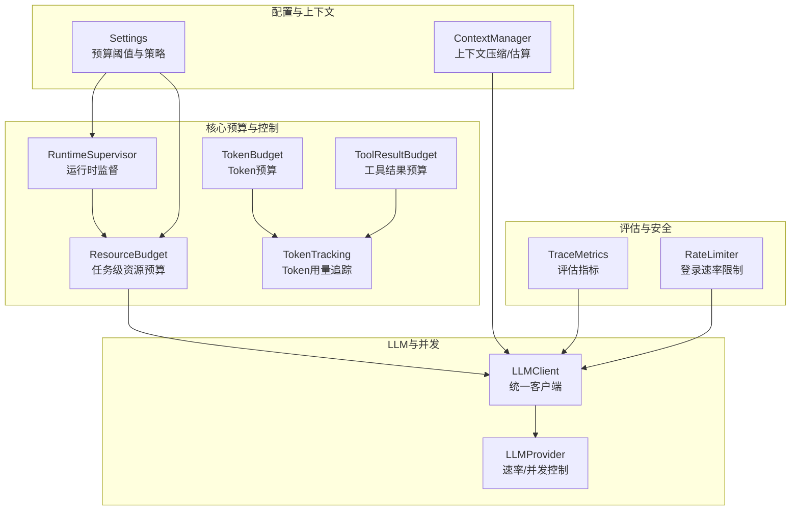
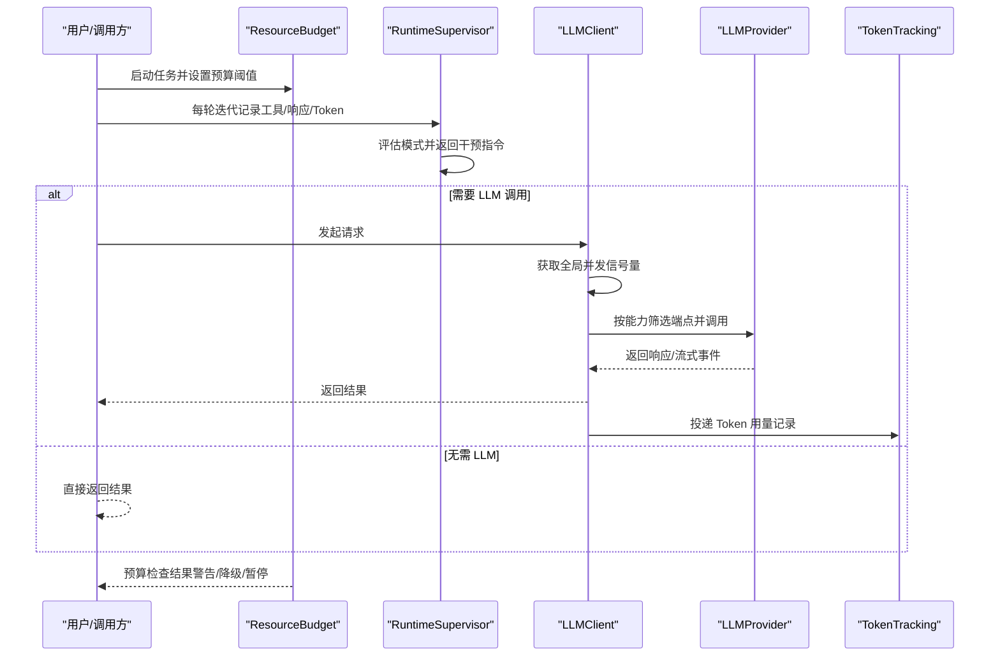
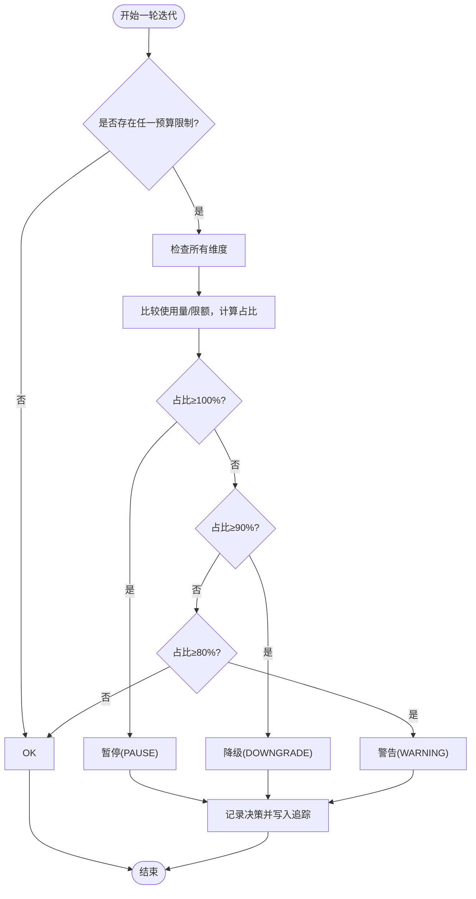
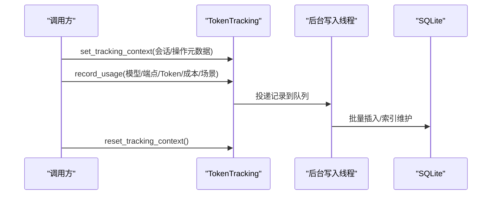
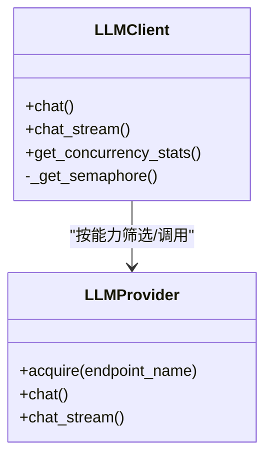
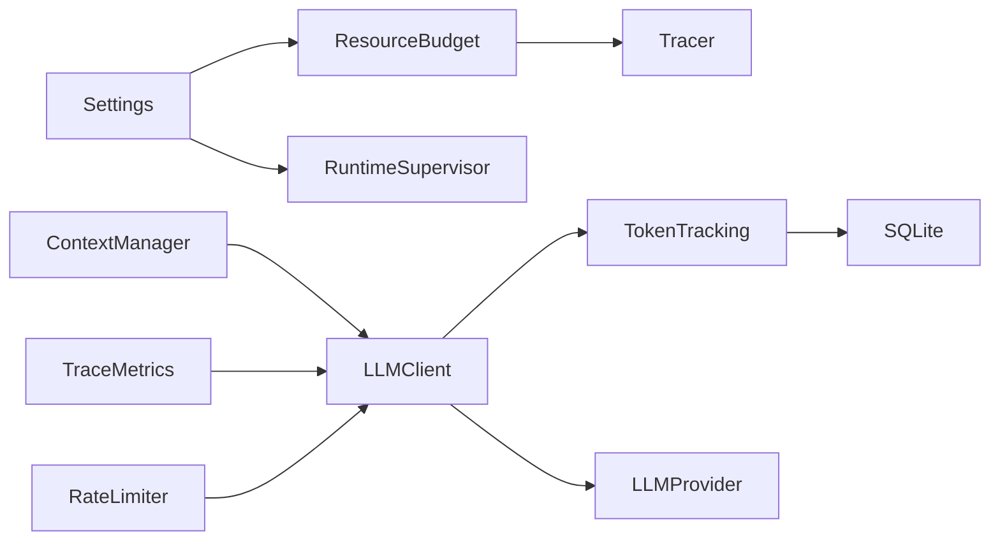

# 资源预算管理

<cite>
**本文档引用的文件**
- [resource_budget.py](file://src/synapse/core/resource_budget.py)
- [token_budget.py](file://src/synapse/core/token_budget.py)
- [token_tracking.py](file://src/synapse/core/token_tracking.py)
- [tool_result_budget.py](file://src/synapse/core/tool_result_budget.py)
- [supervisor.py](file://src/synapse/core/supervisor.py)
- [client.py](file://src/synapse/llm/client.py)
- [base.py](file://src/synapse/llm/providers/base.py)
- [config.py](file://src/synapse/config.py)
- [context_manager.py](file://src/synapse/core/context_manager.py)
- [metrics.py](file://src/synapse/evaluation/metrics.py)
- [rate_limiter.py](file://auth_api/rate_limiter.py)
</cite>

## 目录
1. [简介](#简介)
2. [项目结构](#项目结构)
3. [核心组件](#核心组件)
4. [架构总览](#架构总览)
5. [组件详解](#组件详解)
6. [依赖关系分析](#依赖关系分析)
7. [性能考量](#性能考量)
8. [故障排查指南](#故障排查指南)
9. [结论](#结论)
10. [附录](#附录)

## 简介
本文件面向系统运维与性能工程师，系统化阐述 Synapse 资源预算管理的设计与实现，涵盖任务级资源预算（CPU时间、内存使用、磁盘空间、网络带宽）与 Token 预算体系，解释请求频率限制、并发连接控制与资源消耗跟踪机制，分析预算分配策略、动态调整与超限处理流程，并提供资源配置示例、性能监控指标与容量规划建议。

## 项目结构
围绕资源预算与控制的相关模块主要分布在 core、llm、evaluation 与 auth_api 目录：
- 任务级资源预算与 Token 预算：core/resource_budget.py、core/token_budget.py、core/token_tracking.py、core/tool_result_budget.py
- 运行时监督与干预：core/supervisor.py
- LLM 并发与速率控制：llm/client.py、llm/providers/base.py
- 配置与阈值：config.py
- 上下文压缩与资源估算：core/context_manager.py
- 评估指标：evaluation/metrics.py
- 登录速率限制：auth_api/rate_limiter.py

图表来源
- [resource_budget.py:91-362](file://src/synapse/core/resource_budget.py#L91-L362)
- [token_budget.py:19-98](file://src/synapse/core/token_budget.py#L19-L98)
- [token_tracking.py:77-225](file://src/synapse/core/token_tracking.py#L77-L225)
- [tool_result_budget.py:22-116](file://src/synapse/core/tool_result_budget.py#L22-L116)
- [supervisor.py:115-685](file://src/synapse/core/supervisor.py#L115-L685)
- [client.py:146-800](file://src/synapse/llm/client.py#L146-L800)
- [base.py:46-75](file://src/synapse/llm/providers/base.py#L46-L75)
- [config.py:539-554](file://src/synapse/config.py#L539-L554)
- [context_manager.py:37-800](file://src/synapse/core/context_manager.py#L37-L800)
- [metrics.py:16-81](file://src/synapse/evaluation/metrics.py#L16-L81)
- [rate_limiter.py:13-94](file://auth_api/rate_limiter.py#L13-L94)

章节来源
- [resource_budget.py:1-362](file://src/synapse/core/resource_budget.py#L1-L362)
- [token_budget.py:1-98](file://src/synapse/core/token_budget.py#L1-L98)
- [token_tracking.py:1-225](file://src/synapse/core/token_tracking.py#L1-L225)
- [tool_result_budget.py:1-116](file://src/synapse/core/tool_result_budget.py#L1-L116)
- [supervisor.py:1-685](file://src/synapse/core/supervisor.py#L1-L685)
- [client.py:146-800](file://src/synapse/llm/client.py#L146-L800)
- [base.py:46-75](file://src/synapse/llm/providers/base.py#L46-L75)
- [config.py:539-554](file://src/synapse/config.py#L539-L554)
- [context_manager.py:37-800](file://src/synapse/core/context_manager.py#L37-L800)
- [metrics.py:1-81](file://src/synapse/evaluation/metrics.py#L1-L81)
- [rate_limiter.py:1-94](file://auth_api/rate_limiter.py#L1-L94)

## 核心组件
- 任务级资源预算 ResourceBudget：按 token、成本、时长、迭代次数、工具调用次数等维度进行预算检查与分级处置（警告/降级/暂停）。
- Token 预算 TokenBudget：面向单次会话的 Token 预算解析与预警注入（Claude Code 风格）。
- Token 用量追踪 TokenTracking：基于 contextvars 与后台写入线程的非阻塞记录，支持 SQLite 落盘与索引。
- 工具结果预算 ToolResultBudget：对超长工具结果进行截断与落盘，保障上下文窗口与传输稳定。
- 运行时监督 RuntimeSupervisor：检测工具抖动、编辑抖动、推理死循环、Token 异常、计划偏离等模式并分级干预。
- LLMClient 并发与速率控制：全局并发信号量、端点配额（RPM）、冷静期与降级策略。
- 配置 Settings：集中定义任务预算阈值（token/cost/duration/iterations/tool_calls）与上下文压缩策略。
- 上下文压缩 ContextManager：动态上下文窗口计算、消息分组、LLM 分块摘要压缩与硬截断保底。
- 评估指标 TraceMetrics：从 Tracing 数据中提取迭代、工具调用、Token 消耗、上下文压缩等指标。
- 登录速率限制 RateLimiter：防暴力破解的登录接口速率限制中间件。

章节来源
- [resource_budget.py:91-362](file://src/synapse/core/resource_budget.py#L91-L362)
- [token_budget.py:19-98](file://src/synapse/core/token_budget.py#L19-L98)
- [token_tracking.py:77-225](file://src/synapse/core/token_tracking.py#L77-L225)
- [tool_result_budget.py:22-116](file://src/synapse/core/tool_result_budget.py#L22-L116)
- [supervisor.py:115-685](file://src/synapse/core/supervisor.py#L115-L685)
- [client.py:146-800](file://src/synapse/llm/client.py#L146-L800)
- [config.py:539-554](file://src/synapse/config.py#L539-L554)
- [context_manager.py:37-800](file://src/synapse/core/context_manager.py#L37-L800)
- [metrics.py:16-81](file://src/synapse/evaluation/metrics.py#L16-L81)
- [rate_limiter.py:13-94](file://auth_api/rate_limiter.py#L13-L94)

## 架构总览
资源预算管理贯穿请求生命周期：配置层设定阈值与策略；执行层在每轮迭代检查任务级预算与 Token 预算；LLM 层通过并发与速率控制保障网络带宽与端点稳定性；上下文层通过压缩与估算维持内存使用；监督层在异常时进行分级干预；追踪层记录 Token 用量与性能指标；评估层汇总指标指导容量规划。

图表来源
- [resource_budget.py:192-229](file://src/synapse/core/resource_budget.py#L192-L229)
- [supervisor.py:237-331](file://src/synapse/core/supervisor.py#L237-L331)
- [client.py:351-408](file://src/synapse/llm/client.py#L351-L408)
- [token_tracking.py:77-112](file://src/synapse/core/token_tracking.py#L77-L112)

## 组件详解

### 任务级资源预算 ResourceBudget
- 预算维度：max_tokens、max_cost_usd、max_duration_seconds、max_iterations、max_tool_calls。
- 预算策略：80% 警告、90% 降级、100% 暂停；支持父子预算继承与子任务按比例分配。
- 检查流程：每轮迭代调用 check()，综合各维度返回最严重状态；记录决策到追踪系统。
- 摘要与诊断：提供 get_summary() 输出累计用量与限额，便于运维审计。

图表来源
- [resource_budget.py:192-345](file://src/synapse/core/resource_budget.py#L192-L345)

章节来源
- [resource_budget.py:91-362](file://src/synapse/core/resource_budget.py#L91-L362)

### Token 预算 TokenBudget 与 Token 用量追踪 TokenTracking
- TokenBudget：支持从用户消息解析预算指令（+500k/+1m/+100000），80% 预算时注入系统提示，超限时给出终止提示。
- TokenTracking：通过 contextvars 传递会话与操作元数据，后台线程批量写入 SQLite，支持索引与迁移，记录输入/输出/缓存/上下文/成本等字段。

图表来源
- [token_tracking.py:43-112](file://src/synapse/core/token_tracking.py#L43-L112)
- [token_tracking.py:145-225](file://src/synapse/core/token_tracking.py#L145-L225)

章节来源
- [token_budget.py:19-98](file://src/synapse/core/token_budget.py#L19-L98)
- [token_tracking.py:1-225](file://src/synapse/core/token_tracking.py#L1-L225)

### 工具结果预算 ToolResultBudget
- 截断策略：默认最大字符数限制，超限结果落盘并返回引用路径；对 JSON 结果进行智能截断（数组按元素、对象按值）。
- 适用场景：避免超长工具结果撑爆上下文或网络带宽。

章节来源
- [tool_result_budget.py:22-116](file://src/synapse/core/tool_result_budget.py#L22-L116)

### 运行时监督 RuntimeSupervisor
- 检测模式：工具抖动、编辑抖动、推理死循环、Token 异常、计划偏离、签名重复、极端迭代、空转循环等。
- 干预等级：Nudge、StrategySwitch、ModelSwitch、Escalate、Terminate；不直接修改状态，由调用方执行。
- 事件记录：记录 SupervisionEvent 并写入追踪系统，支持摘要统计。

章节来源
- [supervisor.py:115-685](file://src/synapse/core/supervisor.py#L115-L685)

### LLM 并发与速率控制
- 并发控制：全局信号量限制同时在飞请求数，统计 in-flight 数量，避免并发风暴。
- 端点配额：按 RPM（每分钟）令牌桶控制，超限等待冷却；支持冷静期与错误分类提示。
- 降级策略：thinking 软降级、等待冷静期、强制重试、兜底全端点尝试。

图表来源
- [client.py:146-188](file://src/synapse/llm/client.py#L146-L188)
- [client.py:351-408](file://src/synapse/llm/client.py#L351-L408)
- [base.py:46-75](file://src/synapse/llm/providers/base.py#L46-L75)

章节来源
- [client.py:146-800](file://src/synapse/llm/client.py#L146-L800)
- [base.py:46-75](file://src/synapse/llm/providers/base.py#L46-L75)

### 配置与上下文压缩
- 配置 Settings：集中定义任务预算阈值（task_budget_tokens/cost/duration/iterations/tool_calls），以及上下文压缩阈值、边界压缩比例、工具压缩阈值等。
- 上下文压缩 ContextManager：动态计算可用上下文预算，按工具交互组分组，LLM 分块摘要压缩，递归压缩与硬截断保底；支持上下文边界感知压缩。

章节来源
- [config.py:539-554](file://src/synapse/config.py#L539-L554)
- [context_manager.py:85-503](file://src/synapse/core/context_manager.py#L85-L503)

### 评估指标与容量规划
- TraceMetrics：从 Tracing 提取迭代、LLM/工具调用次数、Token 输入/输出、上下文压缩次数、工具错误、循环检测、回滚次数等指标。
- 容量规划建议：结合并发统计、预算使用率、上下文压缩触发频率与成本，评估端点配额、并发上限与上下文窗口的平衡。

章节来源
- [metrics.py:16-81](file://src/synapse/evaluation/metrics.py#L16-L81)
- [client.py:183-188](file://src/synapse/llm/client.py#L183-L188)

### 登录速率限制 RateLimiter
- 针对登录接口的内存型速率限制，支持时间窗口与最大请求数配置，返回 Retry-After 与 429 状态码。

章节来源
- [rate_limiter.py:13-94](file://auth_api/rate_limiter.py#L13-L94)

## 依赖关系分析
- ResourceBudget 依赖配置（Settings）与追踪（Tracer）；与 Supervisor 协作进行分级干预。
- TokenTracking 与 LLMClient/Provider 解耦，通过后台线程异步写入数据库。
- ToolResultBudget 与 ContextManager 协作，保障上下文窗口稳定。
- LLMClient 依赖 Provider 的速率控制与健康检查，实现端点亲和与降级策略。
- Metrics 依赖 Tracing 与 LLMClient 的并发统计，形成闭环监控。

图表来源
- [config.py:539-554](file://src/synapse/config.py#L539-L554)
- [resource_budget.py:214-227](file://src/synapse/core/resource_budget.py#L214-L227)
- [token_tracking.py:145-225](file://src/synapse/core/token_tracking.py#L145-L225)
- [client.py:146-800](file://src/synapse/llm/client.py#L146-L800)
- [context_manager.py:37-800](file://src/synapse/core/context_manager.py#L37-L800)
- [metrics.py:16-81](file://src/synapse/evaluation/metrics.py#L16-L81)
- [rate_limiter.py:13-94](file://auth_api/rate_limiter.py#L13-L94)

章节来源
- [config.py:539-554](file://src/synapse/config.py#L539-L554)
- [resource_budget.py:214-227](file://src/synapse/core/resource_budget.py#L214-L227)
- [token_tracking.py:145-225](file://src/synapse/core/token_tracking.py#L145-L225)
- [client.py:146-800](file://src/synapse/llm/client.py#L146-L800)
- [context_manager.py:37-800](file://src/synapse/core/context_manager.py#L37-L800)
- [metrics.py:16-81](file://src/synapse/evaluation/metrics.py#L16-L81)
- [rate_limiter.py:13-94](file://auth_api/rate_limiter.py#L13-L94)

## 性能考量
- 并发与背压：通过全局信号量限制在飞请求数，避免 event loop 被打爆；结合端点配额与冷静期缓解瞬时压力。
- 上下文窗口：动态预算与分块摘要压缩，减少 Token 消耗与传输开销；边界感知压缩降低无关历史影响。
- 工具结果：超长结果截断与落盘，避免内存与网络拥塞。
- 监控与可观测：Token 用量追踪、并发统计、预算检查决策与监督事件记录，支撑性能分析与容量规划。

## 故障排查指南
- 预算耗尽（PAUSE）：检查 ResourceBudget 配置与使用率，确认是否需要放宽阈值或优化任务策略。
- 预算接近（DOWNGRADE/WARNING）：关注 TokenBudget 预算注入提示与 Supervisor 的 Nudge/StrategySwitch 干预，评估任务结构与工具调用模式。
- 并发过高：查看 LLMClient 并发统计，适当降低并发上限或增加端点配额。
- 上下文溢出：检查 ContextManager 的压缩触发频率与比率，优化工具结果压缩阈值与上下文边界标记。
- 登录频繁失败：确认 RateLimiter 的窗口与阈值，避免误伤合法请求。

章节来源
- [resource_budget.py:192-345](file://src/synapse/core/resource_budget.py#L192-L345)
- [supervisor.py:237-331](file://src/synapse/core/supervisor.py#L237-L331)
- [client.py:183-188](file://src/synapse/llm/client.py#L183-L188)
- [context_manager.py:391-503](file://src/synapse/core/context_manager.py#L391-L503)
- [rate_limiter.py:13-94](file://auth_api/rate_limiter.py#L13-L94)

## 结论
Synapse 的资源预算管理通过任务级预算、Token 预算、并发与速率控制、上下文压缩与监督干预形成闭环，既保障系统稳定性，又为性能优化与容量规划提供数据支撑。运维与性能工程师可据此建立阈值基线、监控关键指标并动态调整策略，实现资源的高效利用与弹性扩展。

## 附录

### 预算配置示例（来自 Settings）
- 任务预算阈值：task_budget_tokens、task_budget_cost、task_budget_duration、task_budget_iterations、task_budget_tool_calls
- 上下文压缩：context_compression_threshold、context_compression_ratio、context_boundary_compression_ratio、context_min_recent_turns、context_enable_tool_compression、context_large_tool_threshold

章节来源
- [config.py:539-554](file://src/synapse/config.py#L539-L554)