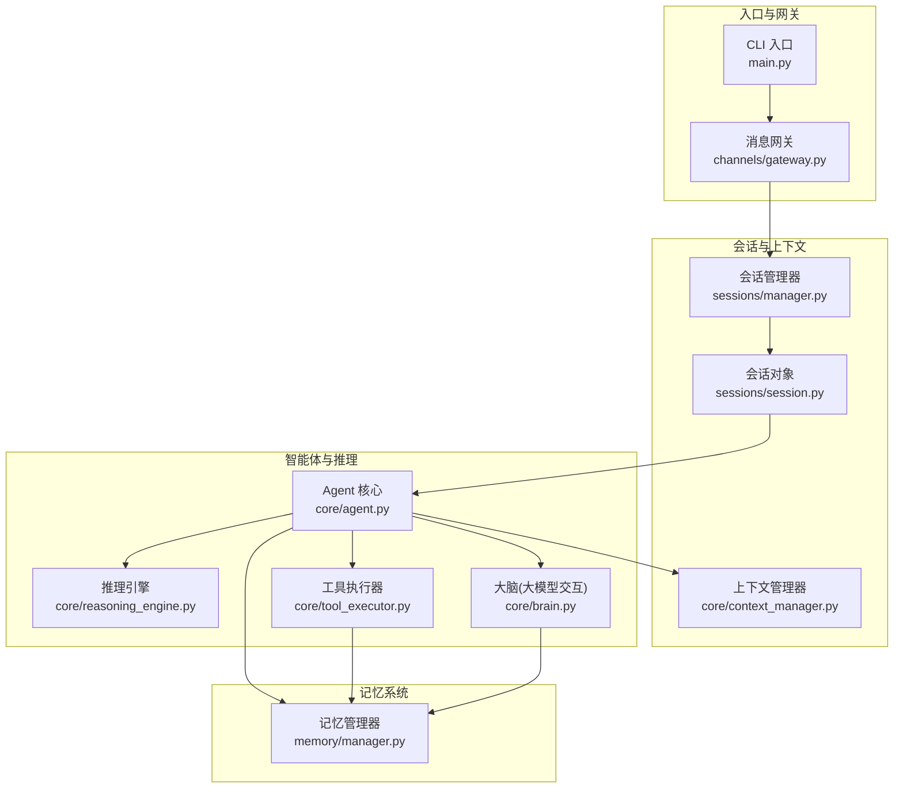
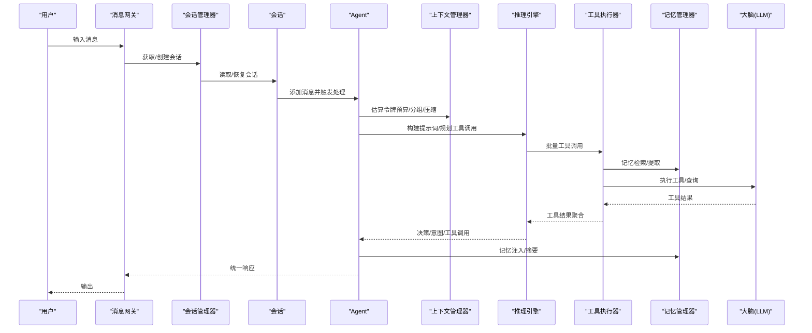
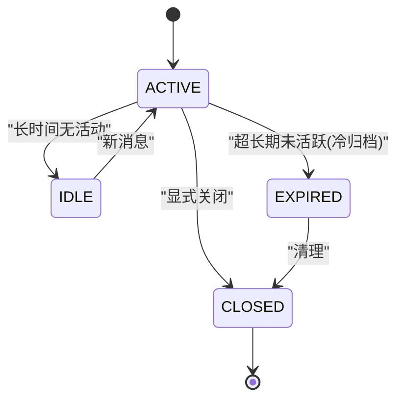
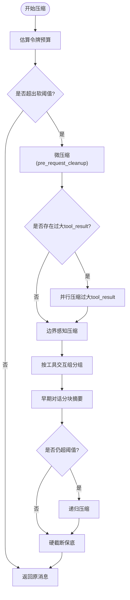
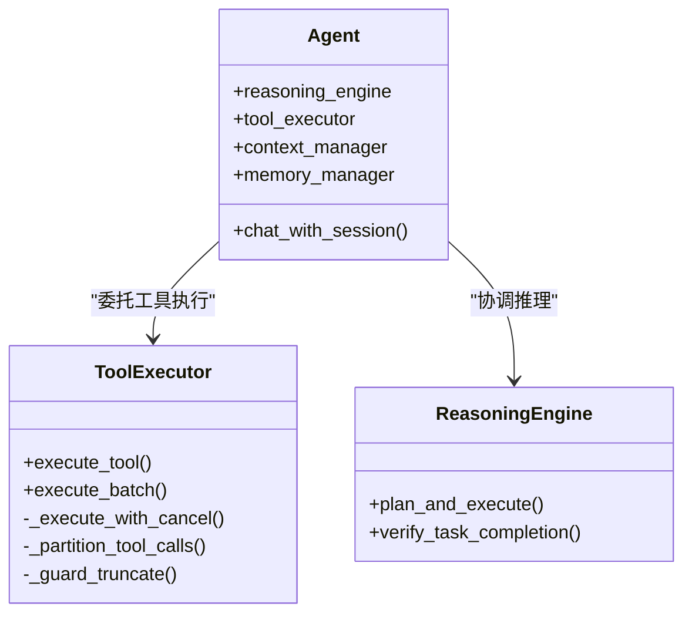
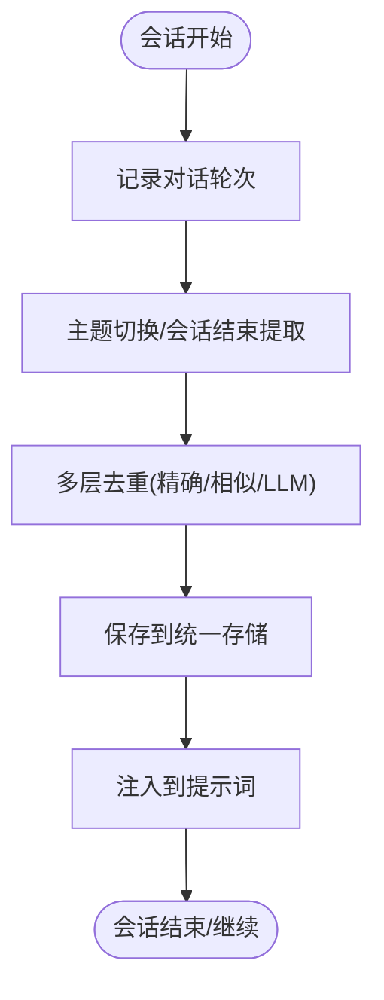
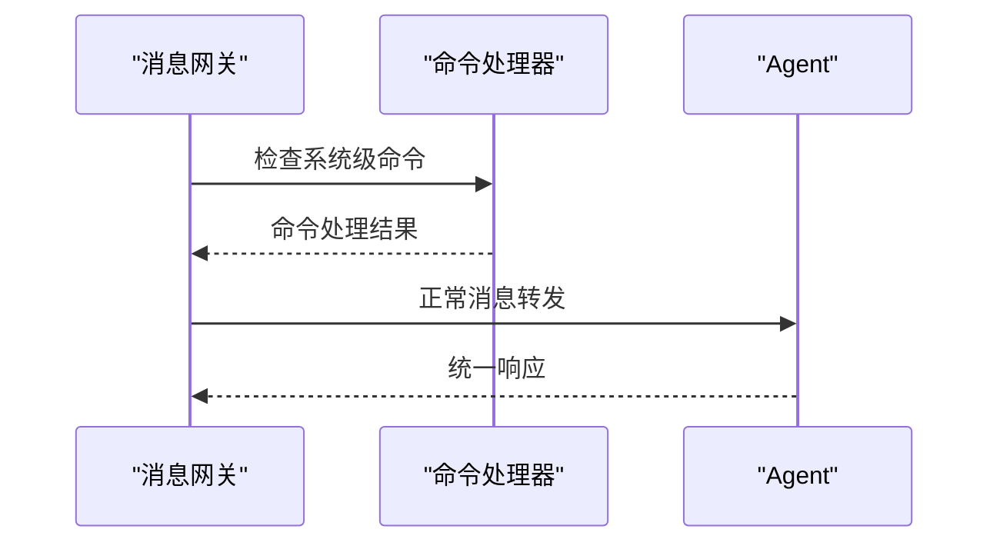
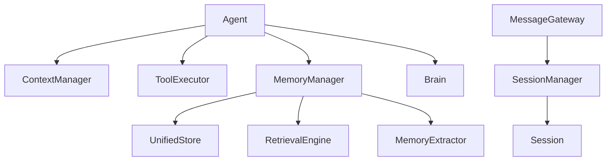

# 数据流分析

<cite>
**本文档引用的文件**
- [main.py](file://src/synapse/main.py)
- [context_manager.py](file://src/synapse/core/context_manager.py)
- [session.py](file://src/synapse/sessions/session.py)
- [gateway.py](file://src/synapse/channels/gateway.py)
- [tool_executor.py](file://src/synapse/core/tool_executor.py)
- [manager.py](file://src/synapse/memory/manager.py)
- [agent.py](file://src/synapse/core/agent.py)
- [manager.py](file://src/synapse/sessions/manager.py)
- [brain.py](file://src/synapse/core/brain.py)
</cite>

## 目录
1. [简介](#简介)
2. [项目结构](#项目结构)
3. [核心组件](#核心组件)
4. [架构概览](#架构概览)
5. [详细组件分析](#详细组件分析)
6. [依赖分析](#依赖分析)
7. [性能考虑](#性能考虑)
8. [故障排查指南](#故障排查指南)
9. [结论](#结论)

## 简介
本文件对 Synapse 的数据流进行全面分析，覆盖从用户输入到最终响应的完整路径，包括消息解析、上下文构建、智能体决策、工具执行、结果聚合等环节。重点阐述会话管理、上下文管理与状态跟踪机制，以及数据在不同组件间的流转方式、缓存策略与持久化方案。文档包含数据流图、状态转换图与处理流程图，并提供监控与调试方法，面向性能调优与问题排查。

## 项目结构
Synapse 采用模块化设计，围绕 Agent 核心协调器组织各子系统：
- 会话管理：Session/SessionManager 负责会话生命周期与持久化
- 上下文管理：ContextManager 负责上下文压缩与令牌预算
- 智能体：Agent 协调推理、工具执行与记忆检索
- 记忆系统：MemoryManager 提供统一存储与检索
- 通道网关：MessageGateway 统一接入 IM/CLI 等输入
- LLM 交互：Brain/LLMClient 提供统一的大模型调用入口

图表来源
- [main.py](file://src/synapse/main.py)
- [gateway.py](file://src/synapse/channels/gateway.py)
- [manager.py](file://src/synapse/sessions/manager.py)
- [session.py](file://src/synapse/sessions/session.py)
- [context_manager.py](file://src/synapse/core/context_manager.py)
- [agent.py](file://src/synapse/core/agent.py)
- [tool_executor.py](file://src/synapse/core/tool_executor.py)
- [brain.py](file://src/synapse/core/brain.py)
- [manager.py](file://src/synapse/memory/manager.py)

章节来源
- [main.py](file://src/synapse/main.py)
- [gateway.py](file://src/synapse/channels/gateway.py)
- [manager.py](file://src/synapse/sessions/manager.py)
- [session.py](file://src/synapse/sessions/session.py)
- [context_manager.py](file://src/synapse/core/context_manager.py)
- [agent.py](file://src/synapse/core/agent.py)
- [tool_executor.py](file://src/synapse/core/tool_executor.py)
- [brain.py](file://src/synapse/core/brain.py)
- [manager.py](file://src/synapse/memory/manager.py)

## 核心组件
- 会话管理器(SessionManager)：维护活跃会话、周期清理、持久化与回填
- 会话(Session)：承载消息历史、变量、任务状态与话题边界
- 上下文管理器(ContextManager)：令牌预算估算、消息分组、压缩与边界感知
- Agent：协调推理、工具执行、记忆检索与响应处理
- 工具执行器(ToolExecutor)：工具调用、权限校验、并发控制与截断守卫
- 记忆管理器(MemoryManager)：统一存储、提取、检索与去重
- 消息网关(MessageGateway)：通道接入、命令拦截、中断机制与媒体预处理
- 大脑(Brain)：统一 LLM 调用、能力分流、故障切换与令牌用量记录

章节来源
- [manager.py](file://src/synapse/sessions/manager.py)
- [session.py](file://src/synapse/sessions/session.py)
- [context_manager.py](file://src/synapse/core/context_manager.py)
- [agent.py](file://src/synapse/core/agent.py)
- [tool_executor.py](file://src/synapse/core/tool_executor.py)
- [manager.py](file://src/synapse/memory/manager.py)
- [gateway.py](file://src/synapse/channels/gateway.py)
- [brain.py](file://src/synapse/core/brain.py)

## 架构概览
Synapse 的数据流从入口进入，经由消息网关统一接入，映射到会话上下文，随后由 Agent 协调上下文压缩、推理规划、工具执行与记忆检索，最终通过响应处理器生成统一输出。关键特性包括：
- 会话隔离与持久化：基于 session_key 的多会话并行与原子落盘
- 上下文压缩：按工具交互组与边界标记进行分层压缩
- 工具执行：权限校验、并发控制与超时保护
- 记忆注入：三路注入(Scratchpad/Core/动态)与去重策略
- 模型切换与命令拦截：系统级命令不经过大模型处理

图表来源
- [gateway.py](file://src/synapse/channels/gateway.py)
- [manager.py](file://src/synapse/sessions/manager.py)
- [session.py](file://src/synapse/sessions/session.py)
- [agent.py](file://src/synapse/core/agent.py)
- [context_manager.py](file://src/synapse/core/context_manager.py)
- [tool_executor.py](file://src/synapse/core/tool_executor.py)
- [manager.py](file://src/synapse/memory/manager.py)
- [brain.py](file://src/synapse/core/brain.py)

## 详细组件分析

### 会话管理与状态跟踪
- 会话键：channel:chat_id:user_id[:thread_id]，支持话题级隔离
- 生命周期：ACTIVE/IDLE/EXPIRED/CLOSED，定期清理与原子持久化
- 历史截断：保留最近消息，对丢弃内容生成简要摘要，优先保留用户规则
- 回填机制：崩溃恢复时从 SQLite 回填 turns，避免上下文丢失

图表来源
- [session.py](file://src/synapse/sessions/session.py)
- [manager.py](file://src/synapse/sessions/manager.py)

章节来源
- [session.py](file://src/synapse/sessions/session.py)
- [manager.py](file://src/synapse/sessions/manager.py)

### 上下文管理与压缩策略
- 令牌预算：按端点上下文窗口与输出预算动态计算
- 消息分组：保证 tool_calls/tool_result 配对不被拆散
- 压缩层级：微压缩(pre_request_cleanup) → 自动压缩(compress_if_needed) → 响应式压缩(reactive_compact)
- 边界感知：话题切换时对边界前旧话题进行更激进摘要
- 硬截断保底：超过阈值时进行硬截断，确保不超过预算

图表来源
- [context_manager.py](file://src/synapse/core/context_manager.py)

章节来源
- [context_manager.py](file://src/synapse/core/context_manager.py)

### 智能体决策与工具执行
- 工具发现与延迟加载：按意图与上下文窗口动态加载工具
- 权限校验：支持 confirm/deny/fail-closed 策略
- 并发控制：浏览器/桌面/MCP 互斥锁，工具并行安全分区
- 超时与中断：工具硬超时、取消事件与跳过事件三路竞速
- 截断守卫：通用结果截断与溢出文件保存

图表来源
- [tool_executor.py](file://src/synapse/core/tool_executor.py)
- [agent.py](file://src/synapse/core/agent.py)

章节来源
- [tool_executor.py](file://src/synapse/core/tool_executor.py)
- [agent.py](file://src/synapse/core/agent.py)

### 记忆系统与注入策略
- 统一存储：SQLite + 搜索后端，双写 JSONL 与关系化存储
- 提取与去重：基于 subject+predicate 与语义相似度的多层去重
- 注入策略：Scratchpad + Core Memory + 动态记忆三路注入
- 会话终结：生成 Episode、用户画像与任务经验提取，建立 turns 与 memories 的双向链接

图表来源
- [manager.py](file://src/synapse/memory/manager.py)

章节来源
- [manager.py](file://src/synapse/memory/manager.py)

### 消息网关与命令拦截
- 统一入口：IM/CLI 通道接入，媒体预处理与中断机制
- 命令拦截：模型切换、思考模式、终极重启等系统级命令不经过大模型
- 会话级配置：思维链推送、思考深度等会话级覆盖

图表来源
- [gateway.py](file://src/synapse/channels/gateway.py)

章节来源
- [gateway.py](file://src/synapse/channels/gateway.py)

## 依赖分析
- 组件耦合
  - Agent 依赖 ContextManager、ToolExecutor、MemoryManager、Brain
  - SessionManager 依赖 Session，负责持久化与清理
  - MessageGateway 依赖 SessionManager 与适配器
  - MemoryManager 依赖 UnifiedStore、RetrievalEngine、Extractor
- 外部依赖
  - LLMClient 提供统一调用与能力分流
  - SQLite/FTS5 作为权威存储与全文检索后端
  - 并发与异步：事件循环、信号量与锁保障线程安全

图表来源
- [agent.py](file://src/synapse/core/agent.py)
- [context_manager.py](file://src/synapse/core/context_manager.py)
- [tool_executor.py](file://src/synapse/core/tool_executor.py)
- [manager.py](file://src/synapse/memory/manager.py)
- [manager.py](file://src/synapse/sessions/manager.py)
- [session.py](file://src/synapse/sessions/session.py)
- [gateway.py](file://src/synapse/channels/gateway.py)
- [brain.py](file://src/synapse/core/brain.py)

章节来源
- [agent.py](file://src/synapse/core/agent.py)
- [manager.py](file://src/synapse/memory/manager.py)
- [manager.py](file://src/synapse/sessions/manager.py)
- [session.py](file://src/synapse/sessions/session.py)
- [gateway.py](file://src/synapse/channels/gateway.py)
- [brain.py](file://src/synapse/core/brain.py)

## 性能考虑
- 上下文压缩
  - 启用工具结果压缩与边界感知，降低令牌占用
  - 会话历史截断时优先保留用户规则，减少重复信息
- 工具执行
  - 并行安全分区与互斥锁避免状态冲突
  - 工具硬超时与取消事件竞速，防止阻塞
- 存储与检索
  - 统一存储与双写策略提升可靠性
  - 去重策略减少冗余存储与检索开销
- 并发控制
  - 事件循环与信号量限制并发，避免资源争用
  - 会话持久化采用原子写入，降低 I/O 风险

## 故障排查指南
- 会话恢复
  - 使用回填机制从 SQLite 恢复 turns，检查 turn_loader 回调
  - 检查 sessions.json 与 .bak 文件完整性
- 上下文压缩
  - 观察压缩比例与阈值设置，必要时调整压缩比率
  - 检查边界标记是否正确，避免过度压缩
- 工具执行
  - 查看工具执行日志与截断标记，定位超长输出
  - 检查权限策略与确认流程，避免阻塞
- 记忆检索
  - 检查去重策略与相似度阈值，避免误判
  - 关注 LLM 去重判断失败时的降级处理
- LLM 调用
  - 查看端点健康状态与故障切换日志
  - 检查令牌用量与成本统计，识别异常峰值

章节来源
- [manager.py](file://src/synapse/sessions/manager.py)
- [context_manager.py](file://src/synapse/core/context_manager.py)
- [tool_executor.py](file://src/synapse/core/tool_executor.py)
- [manager.py](file://src/synapse/memory/manager.py)
- [brain.py](file://src/synapse/core/brain.py)

## 结论
Synapse 的数据流以会话为中心，通过消息网关统一接入，Agent 协调上下文压缩、推理规划、工具执行与记忆检索，形成闭环的数据处理链路。系统在并发控制、缓存策略与持久化方面具备完善的机制，能够支撑多通道、多会话的复杂场景。通过合理的配置与监控，可进一步优化性能与稳定性，满足生产环境的高可用需求。