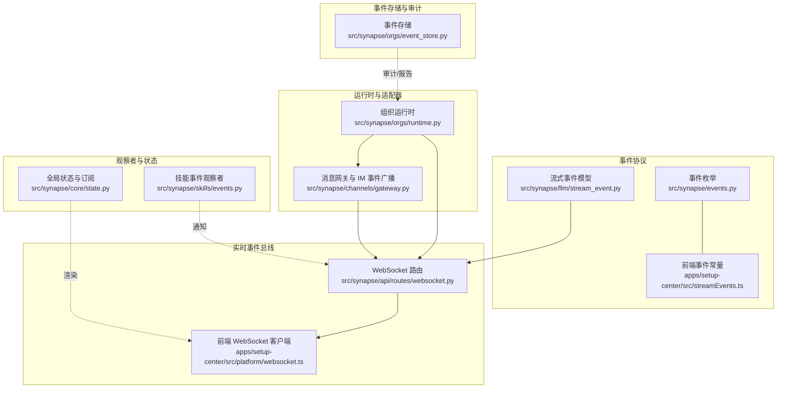
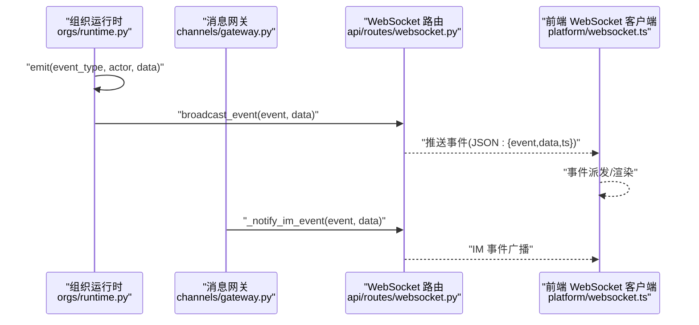
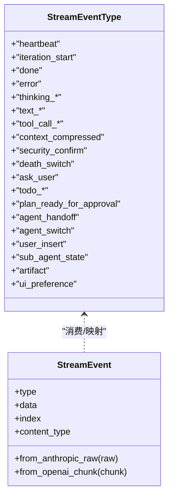
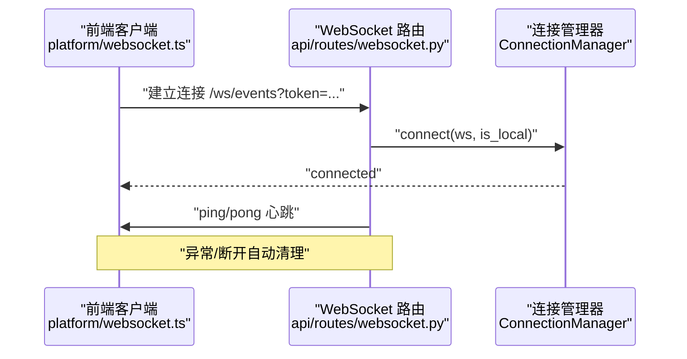
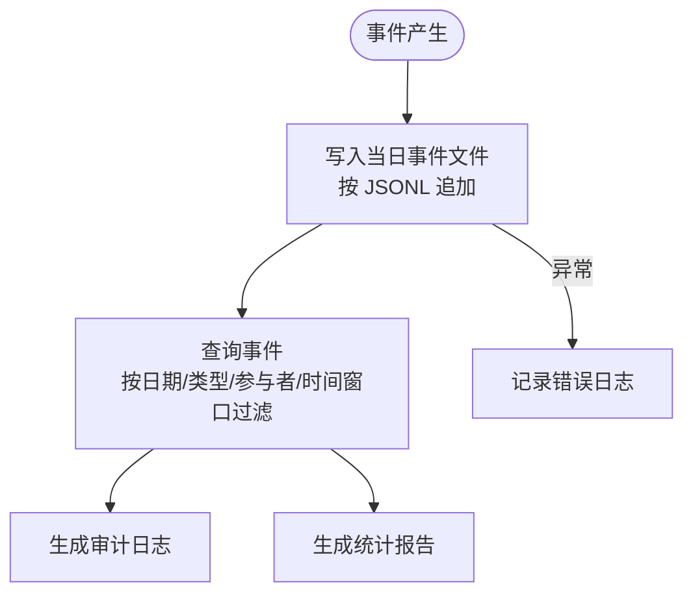
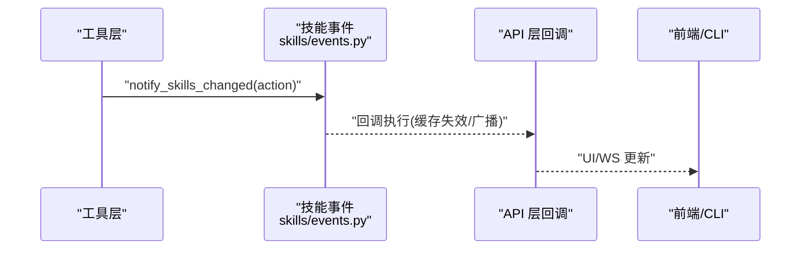
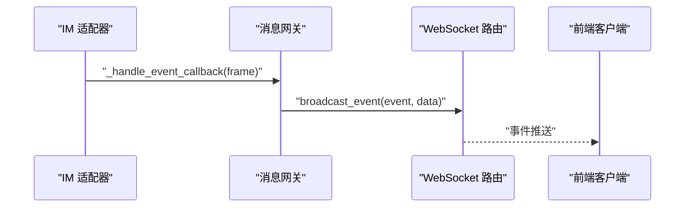
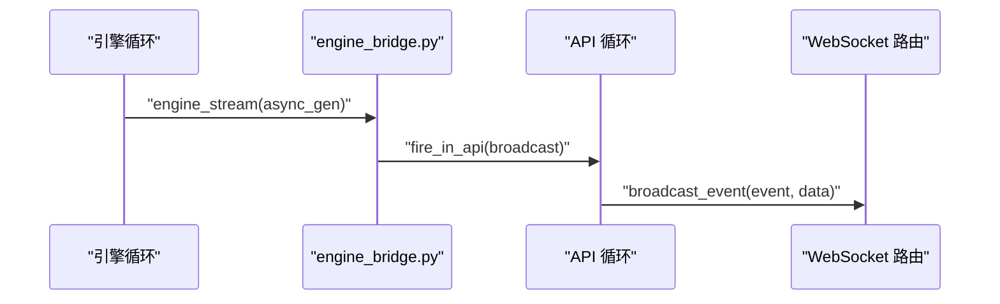
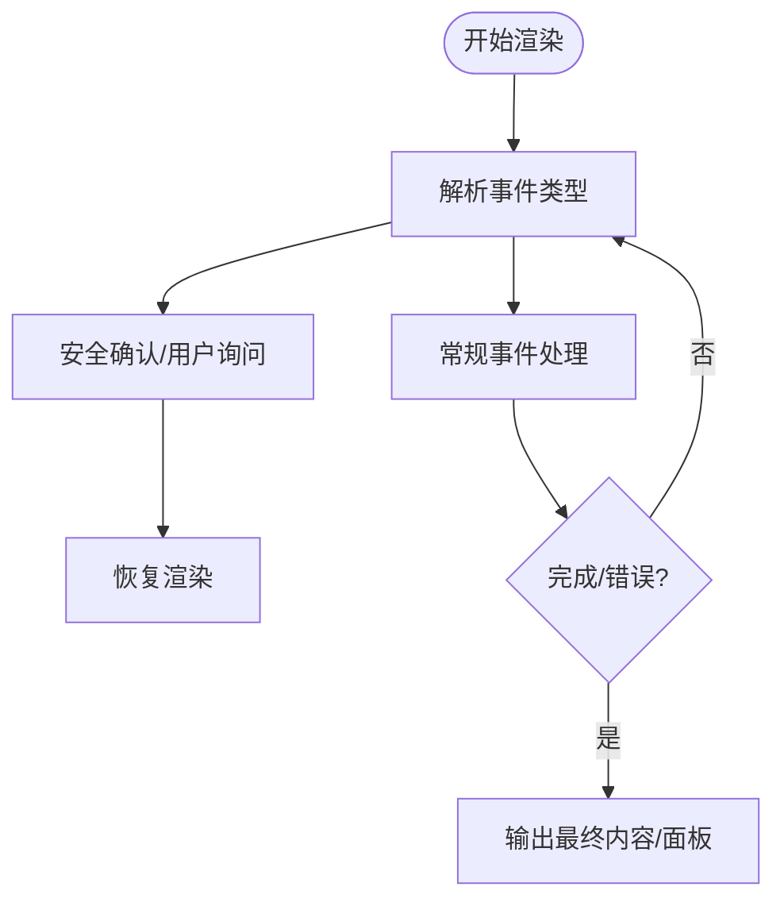
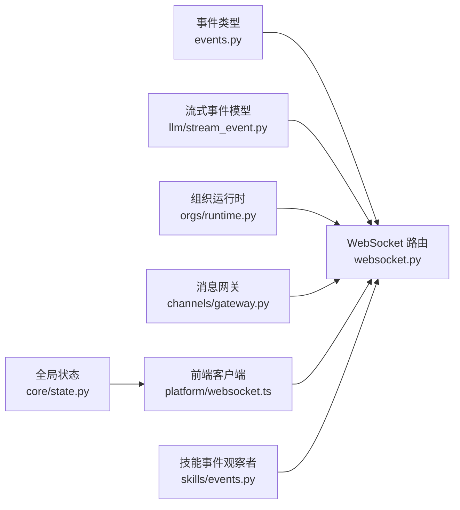

# 事件驱动架构

<cite>
**本文引用的文件**
- [src/synapse/events.py](file://src/synapse/events.py)
- [apps/setup-center/src/streamEvents.ts](file://apps/setup-center/src/streamEvents.ts)
- [src/synapse/llm/stream_event.py](file://src/synapse/llm/stream_event.py)
- [src/synapse/api/routes/websocket.py](file://src/synapse/api/routes/websocket.py)
- [apps/setup-center/src/platform/websocket.ts](file://apps/setup-center/src/platform/websocket.ts)
- [src/synapse/orgs/event_store.py](file://src/synapse/orgs/event_store.py)
- [src/synapse/skills/events.py](file://src/synapse/skills/events.py)
- [src/synapse/core/state.py](file://src/synapse/core/state.py)
- [src/synapse/channels/gateway.py](file://src/synapse/channels/gateway.py)
- [src/synapse/orgs/runtime.py](file://src/synapse/orgs/runtime.py)
- [src/synapse/cli/stream_renderer.py](file://src/synapse/cli/stream_renderer.py)
- [src/synapse/core/engine_bridge.py](file://src/synapse/core/engine_bridge.py)
- [tests/orgs/test_event_store.py](file://tests/orgs/test_event_store.py)
- [tests/orgs/test_llm_task_execution.py](file://tests/orgs/test_llm_task_execution.py)
</cite>

## 目录
1. [简介](#简介)
2. [项目结构](#项目结构)
3. [核心组件](#核心组件)
4. [架构总览](#架构总览)
5. [详细组件分析](#详细组件分析)
6. [依赖分析](#依赖分析)
7. [性能考量](#性能考量)
8. [故障排查指南](#故障排查指南)
9. [结论](#结论)
10. [附录](#附录)

## 简介
本文件系统化阐述 Synapse 的事件驱动架构，重点说明事件总线如何实现组件间的松耦合通信，涵盖事件定义、发布、订阅与处理机制；解释异步事件处理如何支撑高并发与响应式编程；并通过具体代码路径展示事件生命周期管理、错误处理与性能优化策略。同时分析事件风暴、事件溯源与事件一致性等高级主题，并总结设计原则与实现模式，帮助不同经验水平的读者循序渐进地理解与实践。

## 项目结构
围绕事件驱动，本项目的关键模块包括：
- 事件协议与标准化：统一流式事件类型与前端/后端一致性
- WebSocket 实时事件总线：连接管理、广播与跨循环安全广播
- 事件存储与审计：事件溯源、审计日志与报告生成
- 技能层事件：基于观察者模式的技能集变更通知
- 全局状态与渲染：状态订阅与 CLI/前端事件渲染
- 组织运行时：组织生命周期、心跳、调度与事件广播
- 通道适配器：IM 事件回调与消息网关

图表来源
- [src/synapse/events.py:1-119](file://src/synapse/events.py#L1-L119)
- [apps/setup-center/src/streamEvents.ts:1-57](file://apps/setup-center/src/streamEvents.ts#L1-L57)
- [src/synapse/llm/stream_event.py:1-198](file://src/synapse/llm/stream_event.py#L1-L198)
- [src/synapse/api/routes/websocket.py:1-196](file://src/synapse/api/routes/websocket.py#L1-L196)
- [apps/setup-center/src/platform/websocket.ts:37-98](file://apps/setup-center/src/platform/websocket.ts#L37-L98)
- [src/synapse/orgs/event_store.py:1-288](file://src/synapse/orgs/event_store.py#L1-L288)
- [src/synapse/skills/events.py:1-81](file://src/synapse/skills/events.py#L1-L81)
- [src/synapse/core/state.py:1-101](file://src/synapse/core/state.py#L1-L101)
- [src/synapse/channels/gateway.py:1-800](file://src/synapse/channels/gateway.py#L1-L800)
- [src/synapse/orgs/runtime.py:1-200](file://src/synapse/orgs/runtime.py#L1-L200)

章节来源
- [src/synapse/events.py:1-119](file://src/synapse/events.py#L1-L119)
- [apps/setup-center/src/streamEvents.ts:1-57](file://apps/setup-center/src/streamEvents.ts#L1-L57)
- [src/synapse/llm/stream_event.py:1-198](file://src/synapse/llm/stream_event.py#L1-L198)
- [src/synapse/api/routes/websocket.py:1-196](file://src/synapse/api/routes/websocket.py#L1-L196)
- [apps/setup-center/src/platform/websocket.ts:37-98](file://apps/setup-center/src/platform/websocket.ts#L37-L98)
- [src/synapse/orgs/event_store.py:1-288](file://src/synapse/orgs/event_store.py#L1-L288)
- [src/synapse/skills/events.py:1-81](file://src/synapse/skills/events.py#L1-L81)
- [src/synapse/core/state.py:1-101](file://src/synapse/core/state.py#L1-L101)
- [src/synapse/channels/gateway.py:1-800](file://src/synapse/channels/gateway.py#L1-L800)
- [src/synapse/orgs/runtime.py:1-200](file://src/synapse/orgs/runtime.py#L1-L200)

## 核心组件
- 事件类型与协议标准化
  - 后端事件类型枚举与前端事件常量保持同步，确保跨层一致性与可追踪性。
  - 统一流式事件模型，屏蔽不同 LLM 提供商输出差异，保证上层消费的一致性。
- WebSocket 实时事件总线
  - FastAPI WebSocket 路由负责连接接入、鉴权、保活与广播；提供跨事件循环的安全广播接口。
  - 前端 WebSocket 客户端负责连接、重连、心跳与事件派发。
- 事件存储与审计
  - 组织级事件存储采用追加日志形式，按日期分片，支持查询、审计与报告生成。
- 观察者与状态
  - 技能事件观察者通过注册回调实现工具层与 API 层的解耦。
  - 全局状态存储提供不可变状态更新与订阅通知，支撑 UI 与 CLI 渲染。
- 运行时与适配器
  - 组织运行时负责生命周期、心跳、调度与事件广播；消息网关负责 IM 事件回调与 WS 广播。

章节来源
- [src/synapse/events.py:16-119](file://src/synapse/events.py#L16-L119)
- [apps/setup-center/src/streamEvents.ts:10-57](file://apps/setup-center/src/streamEvents.ts#L10-L57)
- [src/synapse/llm/stream_event.py:27-198](file://src/synapse/llm/stream_event.py#L27-L198)
- [src/synapse/api/routes/websocket.py:26-196](file://src/synapse/api/routes/websocket.py#L26-L196)
- [apps/setup-center/src/platform/websocket.ts:50-98](file://apps/setup-center/src/platform/websocket.ts#L50-L98)
- [src/synapse/orgs/event_store.py:21-288](file://src/synapse/orgs/event_store.py#L21-L288)
- [src/synapse/skills/events.py:23-81](file://src/synapse/skills/events.py#L23-L81)
- [src/synapse/core/state.py:22-101](file://src/synapse/core/state.py#L22-L101)
- [src/synapse/channels/gateway.py:35-43](file://src/synapse/channels/gateway.py#L35-L43)
- [src/synapse/orgs/runtime.py:81-200](file://src/synapse/orgs/runtime.py#L81-L200)

## 架构总览
下图展示了事件驱动在系统中的流转：事件产生（运行时/适配器）→事件存储（审计/报告）→WebSocket 广播（API 层）→前端客户端接收与渲染。

图表来源
- [src/synapse/orgs/runtime.py:81-200](file://src/synapse/orgs/runtime.py#L81-L200)
- [src/synapse/channels/gateway.py:35-43](file://src/synapse/channels/gateway.py#L35-L43)
- [src/synapse/api/routes/websocket.py:177-196](file://src/synapse/api/routes/websocket.py#L177-L196)
- [apps/setup-center/src/platform/websocket.ts:67-83](file://apps/setup-center/src/platform/websocket.ts#L67-L83)

## 详细组件分析

### 事件类型与协议标准化
- 后端事件类型枚举覆盖生命周期、推理、文本输出、工具执行、上下文管理、安全交互、任务与计划、代理编排与 UI 增强等类别，确保事件语义清晰且可扩展。
- 前端事件常量与后端保持同步，保障 UI 侧事件消费一致性。
- 流式事件模型统一 Anthropic/OpenAI 等提供商的输出格式，向上层提供稳定的事件流。

图表来源
- [src/synapse/events.py:16-63](file://src/synapse/events.py#L16-L63)
- [apps/setup-center/src/streamEvents.ts:10-54](file://apps/setup-center/src/streamEvents.ts#L10-L54)
- [src/synapse/llm/stream_event.py:27-198](file://src/synapse/llm/stream_event.py#L27-L198)

章节来源
- [src/synapse/events.py:16-119](file://src/synapse/events.py#L16-L119)
- [apps/setup-center/src/streamEvents.ts:10-57](file://apps/setup-center/src/streamEvents.ts#L10-L57)
- [src/synapse/llm/stream_event.py:27-198](file://src/synapse/llm/stream_event.py#L27-L198)

### WebSocket 实时事件总线
- 连接管理：维护活动连接列表，支持并发广播与异常清理。
- 鉴权：本地直连豁免，代理转发需令牌校验。
- 广播：跨事件循环安全广播，避免阻塞与竞态。
- 前端：自动重连、心跳保活、事件派发与错误日志。

图表来源
- [apps/setup-center/src/platform/websocket.ts:50-98](file://apps/setup-center/src/platform/websocket.ts#L50-L98)
- [src/synapse/api/routes/websocket.py:26-196](file://src/synapse/api/routes/websocket.py#L26-L196)

章节来源
- [apps/setup-center/src/platform/websocket.ts:37-98](file://apps/setup-center/src/platform/websocket.ts#L37-L98)
- [src/synapse/api/routes/websocket.py:26-196](file://src/synapse/api/routes/websocket.py#L26-L196)

### 事件存储与审计（事件溯源）
- 追加日志：按日期分片存储，写入失败记录日志。
- 查询：支持类型、参与者、时间窗口、链路/任务过滤，按时间倒序返回。
- 审计与报告：重要事件集合生成审计日志与统计报告，便于合规与运营分析。

图表来源
- [src/synapse/orgs/event_store.py:42-124](file://src/synapse/orgs/event_store.py#L42-L124)
- [src/synapse/orgs/event_store.py:148-288](file://src/synapse/orgs/event_store.py#L148-L288)

章节来源
- [src/synapse/orgs/event_store.py:21-288](file://src/synapse/orgs/event_store.py#L21-L288)
- [tests/orgs/test_event_store.py:43-73](file://tests/orgs/test_event_store.py#L43-L73)
- [tests/orgs/test_llm_task_execution.py:175-205](file://tests/orgs/test_llm_task_execution.py#L175-L205)

### 观察者与状态（技能事件）
- 观察者模式：工具层通过通知函数触发回调，API 层注册缓存失效/广播回调，保持双向解耦。
- 全局状态：不可变状态更新与订阅通知，支持 UI/CLI 渲染与交互。

图表来源
- [src/synapse/skills/events.py:66-81](file://src/synapse/skills/events.py#L66-L81)
- [src/synapse/core/state.py:22-71](file://src/synapse/core/state.py#L22-L71)

章节来源
- [src/synapse/skills/events.py:23-81](file://src/synapse/skills/events.py#L23-L81)
- [src/synapse/core/state.py:22-101](file://src/synapse/core/state.py#L22-L101)

### 组织运行时与消息网关
- 运行时：组织生命周期、心跳、调度、并发控制与事件广播。
- 网关：IM 事件回调标准化，统一广播至 WebSocket 客户端。

图表来源
- [src/synapse/channels/gateway.py:35-43](file://src/synapse/channels/gateway.py#L35-L43)
- [src/synapse/api/routes/websocket.py:177-196](file://src/synapse/api/routes/websocket.py#L177-L196)
- [apps/setup-center/src/platform/websocket.ts:67-83](file://apps/setup-center/src/platform/websocket.ts#L67-L83)

章节来源
- [src/synapse/channels/gateway.py:35-43](file://src/synapse/channels/gateway.py#L35-L43)
- [src/synapse/orgs/runtime.py:81-200](file://src/synapse/orgs/runtime.py#L81-L200)

### 异步事件处理与跨循环安全
- 引擎桥接：在引擎循环与 API 循环之间安全传递事件流，避免循环不一致导致的阻塞。
- 广播桥接：跨循环广播通过“在 API 循环中执行”的方式保证连接安全。

图表来源
- [src/synapse/core/engine_bridge.py:122-160](file://src/synapse/core/engine_bridge.py#L122-L160)
- [src/synapse/api/routes/websocket.py:177-196](file://src/synapse/api/routes/websocket.py#L177-L196)

章节来源
- [src/synapse/core/engine_bridge.py:122-160](file://src/synapse/core/engine_bridge.py#L122-L160)
- [src/synapse/api/routes/websocket.py:177-196](file://src/synapse/api/routes/websocket.py#L177-L196)

### 事件生命周期管理与渲染
- CLI 渲染：根据事件类型进行交互式处理（如安全确认、用户询问），并在流结束后输出最终内容。
- 前端渲染：WebSocket 接收事件并派发到 UI，结合全局状态与事件常量实现响应式更新。

图表来源
- [src/synapse/cli/stream_renderer.py:51-95](file://src/synapse/cli/stream_renderer.py#L51-L95)
- [apps/setup-center/src/platform/websocket.ts:67-83](file://apps/setup-center/src/platform/websocket.ts#L67-L83)

章节来源
- [src/synapse/cli/stream_renderer.py:51-95](file://src/synapse/cli/stream_renderer.py#L51-L95)
- [apps/setup-center/src/platform/websocket.ts:67-83](file://apps/setup-center/src/platform/websocket.ts#L67-L83)

## 依赖分析
- 松耦合设计
  - 事件类型前后端同步，避免硬编码字符串传播。
  - 观察者模式隔离工具层与 API 层，降低直接依赖。
  - WebSocket 广播通过桥接函数实现跨循环安全调用。
- 关键依赖链
  - 运行时 → 事件存储/审计 → WebSocket 广播 → 前端渲染
  - 适配器 → 消息网关 → WebSocket 广播 → 前端渲染
  - 技能事件 → API 回调 → WebSocket 广播 → 前端渲染

图表来源
- [src/synapse/events.py:16-119](file://src/synapse/events.py#L16-L119)
- [src/synapse/llm/stream_event.py:27-198](file://src/synapse/llm/stream_event.py#L27-L198)
- [src/synapse/api/routes/websocket.py:26-196](file://src/synapse/api/routes/websocket.py#L26-L196)
- [src/synapse/orgs/runtime.py:81-200](file://src/synapse/orgs/runtime.py#L81-L200)
- [src/synapse/channels/gateway.py:35-43](file://src/synapse/channels/gateway.py#L35-L43)
- [apps/setup-center/src/platform/websocket.ts:50-98](file://apps/setup-center/src/platform/websocket.ts#L50-L98)
- [src/synapse/skills/events.py:66-81](file://src/synapse/skills/events.py#L66-L81)
- [src/synapse/core/state.py:22-101](file://src/synapse/core/state.py#L22-L101)

章节来源
- [src/synapse/events.py:16-119](file://src/synapse/events.py#L16-L119)
- [src/synapse/api/routes/websocket.py:26-196](file://src/synapse/api/routes/websocket.py#L26-L196)
- [src/synapse/orgs/runtime.py:81-200](file://src/synapse/orgs/runtime.py#L81-L200)
- [src/synapse/channels/gateway.py:35-43](file://src/synapse/channels/gateway.py#L35-L43)
- [apps/setup-center/src/platform/websocket.ts:50-98](file://apps/setup-center/src/platform/websocket.ts#L50-L98)
- [src/synapse/skills/events.py:66-81](file://src/synapse/skills/events.py#L66-L81)
- [src/synapse/core/state.py:22-101](file://src/synapse/core/state.py#L22-L101)

## 性能考量
- 并发与限流
  - 组织级并发信号量限制同时激活节点数，避免资源争用。
  - WebSocket 广播使用并发 gather，失败连接自动剔除，减少广播开销。
- 存储与查询
  - 事件按日分片，查询按文件倒序遍历，限制返回条数，兼顾实时性与性能。
- 流式桥接
  - 引擎与 API 循环间通过队列与线程安全读取，避免阻塞，提高吞吐。
- 心跳与保活
  - 服务端/客户端心跳维持长连接，降低断线重连成本。

章节来源
- [src/synapse/orgs/runtime.py:141-147](file://src/synapse/orgs/runtime.py#L141-L147)
- [src/synapse/api/routes/websocket.py:46-96](file://src/synapse/api/routes/websocket.py#L46-L96)
- [src/synapse/orgs/event_store.py:70-124](file://src/synapse/orgs/event_store.py#L70-L124)
- [src/synapse/core/engine_bridge.py:122-160](file://src/synapse/core/engine_bridge.py#L122-L160)

## 故障排查指南
- WebSocket 连接失败
  - 检查鉴权参数与本地豁免逻辑，确认代理转发场景下的令牌有效性。
  - 关注连接管理器对异常连接的清理行为。
- 事件未到达前端
  - 核对广播桥接函数是否在正确的事件循环中执行。
  - 检查前端心跳与事件派发逻辑，定位 JSON 解析与 handler 错误。
- 事件存储写入失败
  - 查看事件存储写入异常日志，确认磁盘权限与路径存在性。
  - 使用查询接口验证事件是否落盘成功。
- 事件完整性与审计
  - 单元测试验证事件包含时间戳、事件类型与执行者字段。
  - 审计日志筛选重要事件类型，核对最近 N 天事件覆盖范围。

章节来源
- [src/synapse/api/routes/websocket.py:114-132](file://src/synapse/api/routes/websocket.py#L114-L132)
- [apps/setup-center/src/platform/websocket.ts:67-83](file://apps/setup-center/src/platform/websocket.ts#L67-L83)
- [src/synapse/orgs/event_store.py:62-68](file://src/synapse/orgs/event_store.py#L62-L68)
- [tests/orgs/test_llm_task_execution.py:175-205](file://tests/orgs/test_llm_task_execution.py#L175-L205)
- [tests/orgs/test_event_store.py:65-73](file://tests/orgs/test_event_store.py#L65-L73)

## 结论
Synapse 的事件驱动架构通过“协议标准化 + 实时总线 + 事件存储 + 观察者模式 + 全局状态”的组合，实现了组件间的松耦合与高内聚。异步事件处理与跨循环安全桥接提升了系统的并发能力与稳定性；事件溯源与审计增强了可观测性与可追溯性。该架构既满足实时响应需求，又为扩展与演进提供了清晰边界与良好实践。

## 附录
- 设计原则
  - 事件语义明确、类型统一、前后端同步
  - 广播解耦、跨循环安全、连接健壮
  - 追加日志、可审计、可报告
  - 不可变状态、订阅通知、响应式渲染
- 实现模式
  - 观察者模式用于跨层通知
  - 状态存储用于 UI/CLI 响应式更新
  - 引擎桥接用于循环间事件流安全传递
  - 事件存储用于审计与报告生成