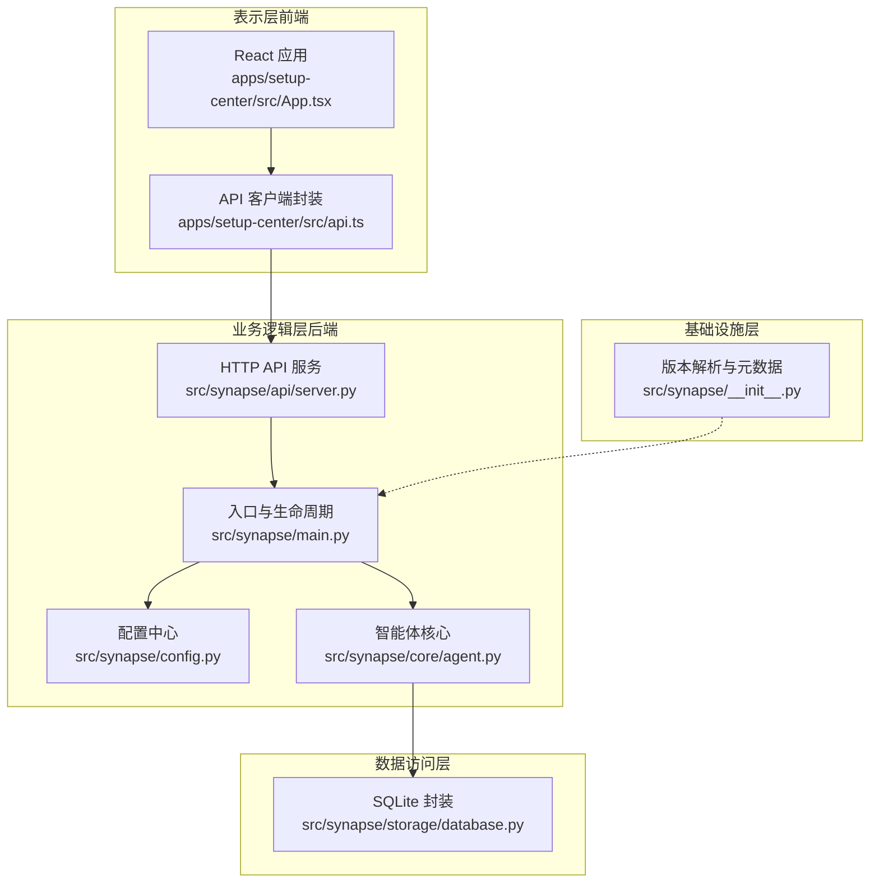
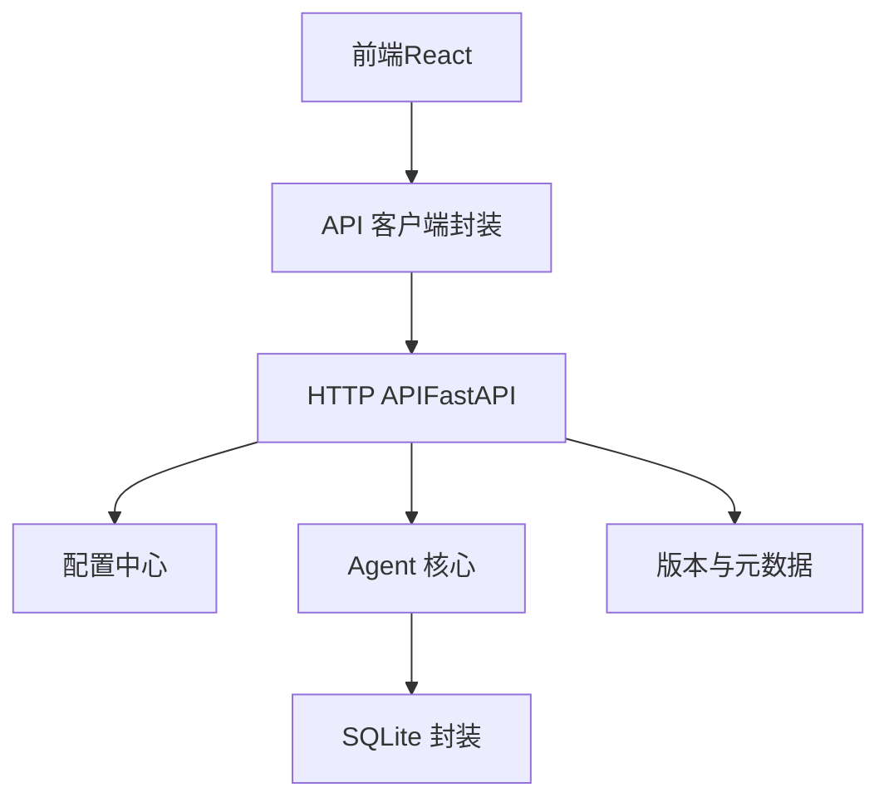
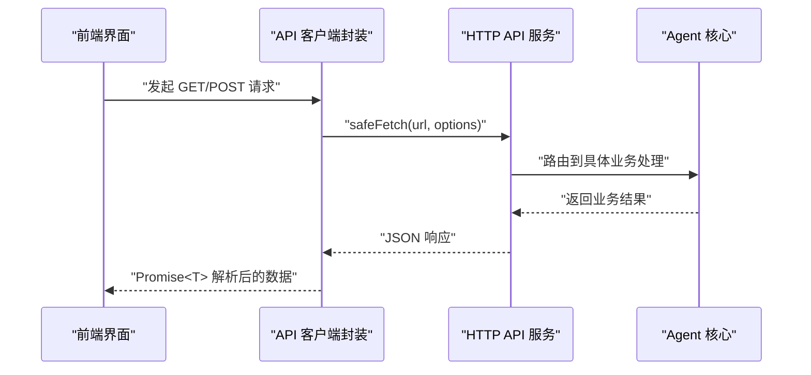
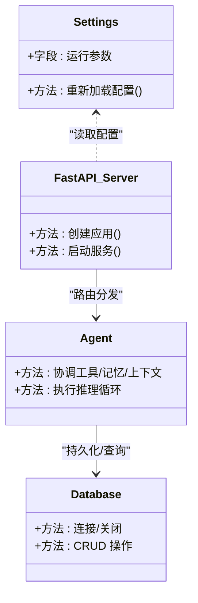
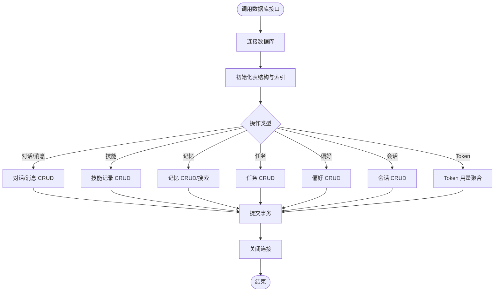
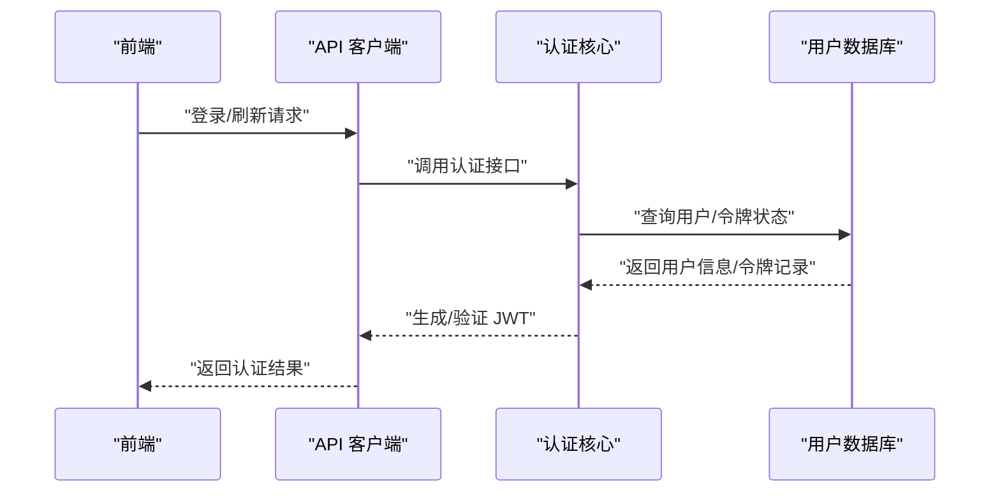
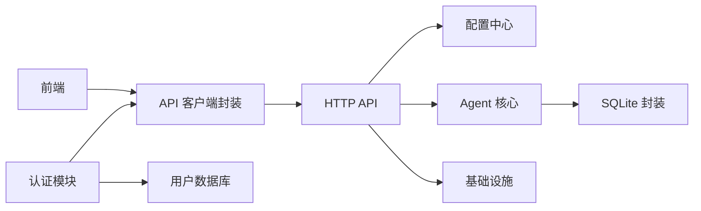

# 分层架构

<cite>
**本文档引用的文件**
- [src/synapse/__init__.py](file://src/synapse/__init__.py)
- [src/synapse/main.py](file://src/synapse/main.py)
- [src/synapse/config.py](file://src/synapse/config.py)
- [src/synapse/api/server.py](file://src/synapse/api/server.py)
- [src/synapse/core/agent.py](file://src/synapse/core/agent.py)
- [src/synapse/storage/database.py](file://src/synapse/storage/database.py)
- [apps/setup-center/src/App.tsx](file://apps/setup-center/src/App.tsx)
- [apps/setup-center/src/api.ts](file://apps/setup-center/src/api.ts)
- [auth_api/auth_core.py](file://auth_api/auth_core.py)
- [auth_api/user_db.py](file://auth_api/user_db.py)
</cite>

## 目录
1. [简介](#简介)
2. [项目结构](#项目结构)
3. [核心组件](#核心组件)
4. [架构总览](#架构总览)
5. [详细组件分析](#详细组件分析)
6. [依赖分析](#依赖分析)
7. [性能考虑](#性能考虑)
8. [故障排查指南](#故障排查指南)
9. [结论](#结论)
10. [附录](#附录)

## 简介
本文件系统化阐述 Synapse 的四层架构设计：表示层、业务逻辑层、数据访问层与基础设施层。围绕职责边界、接口契约与依赖关系展开，解释分层如何实现关注点分离、提升可维护性与支持模块化开发，并结合代码示例展示层间交互模式。同时给出技术权衡（性能、复杂度、测试策略）、最佳实践与常见反模式，帮助不同经验水平的读者建立清晰的认知框架。

## 项目结构
Synapse 采用“前后端分离 + 后端服务内嵌”的混合形态：
- 前端（表示层）：基于 React/Vite 的桌面/Web 管理界面，位于 apps/setup-center。
- 后端（业务逻辑层/基础设施层）：Python 后端服务，提供 HTTP API、IM 通道、会话管理、Agent 协调等能力，位于 src/synapse。
- 数据访问层：SQLite 封装与模型定义，位于 src/synapse/storage。
- 认证与用户数据：独立的认证服务与用户数据库，位于 auth_api。

图表来源
- [src/synapse/main.py:1-800](file://src/synapse/main.py#L1-L800)
- [src/synapse/config.py:1-800](file://src/synapse/config.py#L1-L800)
- [src/synapse/core/agent.py:1-800](file://src/synapse/core/agent.py#L1-L800)
- [src/synapse/api/server.py:1-712](file://src/synapse/api/server.py#L1-L712)
- [src/synapse/storage/database.py:1-800](file://src/synapse/storage/database.py#L1-L800)
- [src/synapse/__init__.py:1-80](file://src/synapse/__init__.py#L1-L80)
- [apps/setup-center/src/App.tsx:1-800](file://apps/setup-center/src/App.tsx#L1-L800)
- [apps/setup-center/src/api.ts:1-51](file://apps/setup-center/src/api.ts#L1-L51)

章节来源
- [src/synapse/main.py:1-800](file://src/synapse/main.py#L1-L800)
- [src/synapse/config.py:1-800](file://src/synapse/config.py#L1-L800)
- [src/synapse/core/agent.py:1-800](file://src/synapse/core/agent.py#L1-L800)
- [src/synapse/api/server.py:1-712](file://src/synapse/api/server.py#L1-L712)
- [src/synapse/storage/database.py:1-800](file://src/synapse/storage/database.py#L1-L800)
- [src/synapse/__init__.py:1-80](file://src/synapse/__init__.py#L1-L80)
- [apps/setup-center/src/App.tsx:1-800](file://apps/setup-center/src/App.tsx#L1-L800)
- [apps/setup-center/src/api.ts:1-51](file://apps/setup-center/src/api.ts#L1-L51)

## 核心组件
- 表示层（前端）：负责用户交互、路由与状态管理，通过统一的 API 客户端封装与后端通信。
- 业务逻辑层（后端）：包含配置中心、Agent 核心、HTTP API 服务与生命周期管理。
- 数据访问层：提供 SQLite 封装、表结构与常用 CRUD 操作。
- 基础设施层：版本解析、元数据与运行时环境初始化。

章节来源
- [apps/setup-center/src/App.tsx:1-800](file://apps/setup-center/src/App.tsx#L1-L800)
- [apps/setup-center/src/api.ts:1-51](file://apps/setup-center/src/api.ts#L1-L51)
- [src/synapse/config.py:1-800](file://src/synapse/config.py#L1-L800)
- [src/synapse/core/agent.py:1-800](file://src/synapse/core/agent.py#L1-L800)
- [src/synapse/api/server.py:1-712](file://src/synapse/api/server.py#L1-L712)
- [src/synapse/storage/database.py:1-800](file://src/synapse/storage/database.py#L1-L800)
- [src/synapse/__init__.py:1-80](file://src/synapse/__init__.py#L1-L80)

## 架构总览
Synapse 的分层架构以“后端服务内嵌 + 前端管理界面”为主，后端通过 FastAPI 提供 HTTP API，前端通过统一的 API 客户端进行调用。业务逻辑层以 Agent 为核心，协调工具、记忆与上下文管理；数据访问层抽象 SQLite；基础设施层提供版本与运行时信息。

图表来源
- [apps/setup-center/src/App.tsx:1-800](file://apps/setup-center/src/App.tsx#L1-L800)
- [apps/setup-center/src/api.ts:1-51](file://apps/setup-center/src/api.ts#L1-L51)
- [src/synapse/api/server.py:1-712](file://src/synapse/api/server.py#L1-L712)
- [src/synapse/config.py:1-800](file://src/synapse/config.py#L1-L800)
- [src/synapse/core/agent.py:1-800](file://src/synapse/core/agent.py#L1-L800)
- [src/synapse/storage/database.py:1-800](file://src/synapse/storage/database.py#L1-L800)
- [src/synapse/__init__.py:1-80](file://src/synapse/__init__.py#L1-L80)

## 详细组件分析

### 表示层（前端）
- 职责边界：UI 展示、路由、状态管理、认证门禁与与后端的 HTTP 通信。
- 关键接口：
  - 统一的 API 客户端封装（GET/POST/RAW），屏蔽重复的请求头与序列化逻辑。
  - 前端路由与视图懒加载，降低首屏体积。
  - 本地/远程模式切换与回退策略（后端未运行时走本地 Tauri 操作）。
- 交互模式：前端通过 API 客户端发起请求，后端返回 JSON；错误与超时通过封装统一处理。

图表来源
- [apps/setup-center/src/App.tsx:1-800](file://apps/setup-center/src/App.tsx#L1-L800)
- [apps/setup-center/src/api.ts:1-51](file://apps/setup-center/src/api.ts#L1-L51)
- [src/synapse/api/server.py:1-712](file://src/synapse/api/server.py#L1-L712)
- [src/synapse/core/agent.py:1-800](file://src/synapse/core/agent.py#L1-L800)

章节来源
- [apps/setup-center/src/App.tsx:1-800](file://apps/setup-center/src/App.tsx#L1-L800)
- [apps/setup-center/src/api.ts:1-51](file://apps/setup-center/src/api.ts#L1-L51)

### 业务逻辑层（后端）
- 职责边界：配置管理、Agent 协调、工具执行、记忆与上下文管理、会话与组织编排。
- 关键接口：
  - 配置中心（Settings）：集中管理运行参数与环境变量。
  - Agent 核心（Agent）：协调工具、记忆、上下文与推理引擎。
  - HTTP API 服务（FastAPI）：提供认证、对话、模型、技能、文件、会话、定时任务等路由。
  - 生命周期管理（main.py）：服务启动、依赖注入、IM 通道与会话管理初始化。
- 交互模式：HTTP 路由将请求分发到 Agent 或子系统；Agent 内部通过工具执行器与记忆管理器完成具体任务。

图表来源
- [src/synapse/config.py:1-800](file://src/synapse/config.py#L1-L800)
- [src/synapse/core/agent.py:1-800](file://src/synapse/core/agent.py#L1-L800)
- [src/synapse/api/server.py:1-712](file://src/synapse/api/server.py#L1-L712)
- [src/synapse/storage/database.py:1-800](file://src/synapse/storage/database.py#L1-L800)

章节来源
- [src/synapse/config.py:1-800](file://src/synapse/config.py#L1-L800)
- [src/synapse/core/agent.py:1-800](file://src/synapse/core/agent.py#L1-L800)
- [src/synapse/api/server.py:1-712](file://src/synapse/api/server.py#L1-L712)
- [src/synapse/main.py:1-800](file://src/synapse/main.py#L1-L800)

### 数据访问层
- 职责边界：抽象 SQLite 访问，提供表结构、索引与常用 CRUD 操作。
- 关键接口：
  - 连接/关闭数据库。
  - 对话、消息、技能、记忆、任务、偏好、会话、Token 用量等表的读写。
  - 聚合查询（按端点、按会话、按场景、时间线）。
- 交互模式：业务逻辑层通过封装的数据库类进行读写，避免直接操作 SQL。

图表来源
- [src/synapse/storage/database.py:1-800](file://src/synapse/storage/database.py#L1-L800)

章节来源
- [src/synapse/storage/database.py:1-800](file://src/synapse/storage/database.py#L1-L800)

### 基础设施层
- 职责边界：版本解析、元数据与运行时环境初始化。
- 关键接口：
  - 版本号与 Git 短哈希解析，支持打包与开发模式。
  - 运行时环境注入与模块路径管理（用于 IM 通道依赖自动安装）。
- 交互模式：在服务启动时被调用，为其他层提供版本信息与运行时上下文。

章节来源
- [src/synapse/__init__.py:1-80](file://src/synapse/__init__.py#L1-L80)
- [src/synapse/main.py:1-800](file://src/synapse/main.py#L1-L800)

### 认证与用户数据（独立模块）
- 职责边界：JWT 生成/验证、密码加密、刷新令牌管理与用户数据存储。
- 关键接口：
  - JWT 生成/解码、密码哈希与校验。
  - 用户表与刷新令牌表的 CRUD 与索引。
- 交互模式：前端通过 API 客户端调用后端认证接口，后端使用认证核心模块与用户数据库完成鉴权与会话管理。

图表来源
- [apps/setup-center/src/api.ts:1-51](file://apps/setup-center/src/api.ts#L1-L51)
- [auth_api/auth_core.py:1-86](file://auth_api/auth_core.py#L1-L86)
- [auth_api/user_db.py:1-140](file://auth_api/user_db.py#L1-L140)

章节来源
- [auth_api/auth_core.py:1-86](file://auth_api/auth_core.py#L1-L86)
- [auth_api/user_db.py:1-140](file://auth_api/user_db.py#L1-L140)

## 依赖分析
- 表示层依赖业务逻辑层提供的 HTTP API；通过统一的 API 客户端封装降低耦合。
- 业务逻辑层依赖配置中心与数据访问层；Agent 核心进一步依赖工具执行器与记忆管理器。
- 数据访问层依赖 SQLite；提供稳定的 CRUD 与聚合接口。
- 基础设施层为业务层提供版本与运行时信息。
- 认证与用户数据模块独立部署，通过 HTTP 与业务层交互。

图表来源
- [apps/setup-center/src/App.tsx:1-800](file://apps/setup-center/src/App.tsx#L1-L800)
- [apps/setup-center/src/api.ts:1-51](file://apps/setup-center/src/api.ts#L1-L51)
- [src/synapse/api/server.py:1-712](file://src/synapse/api/server.py#L1-L712)
- [src/synapse/config.py:1-800](file://src/synapse/config.py#L1-L800)
- [src/synapse/core/agent.py:1-800](file://src/synapse/core/agent.py#L1-L800)
- [src/synapse/storage/database.py:1-800](file://src/synapse/storage/database.py#L1-L800)
- [src/synapse/__init__.py:1-80](file://src/synapse/__init__.py#L1-L80)
- [auth_api/auth_core.py:1-86](file://auth_api/auth_core.py#L1-L86)
- [auth_api/user_db.py:1-140](file://auth_api/user_db.py#L1-L140)

章节来源
- [src/synapse/api/server.py:1-712](file://src/synapse/api/server.py#L1-L712)
- [src/synapse/core/agent.py:1-800](file://src/synapse/core/agent.py#L1-L800)
- [src/synapse/storage/database.py:1-800](file://src/synapse/storage/database.py#L1-L800)
- [src/synapse/config.py:1-800](file://src/synapse/config.py#L1-L800)
- [src/synapse/__init__.py:1-80](file://src/synapse/__init__.py#L1-L80)
- [apps/setup-center/src/App.tsx:1-800](file://apps/setup-center/src/App.tsx#L1-L800)
- [apps/setup-center/src/api.ts:1-51](file://apps/setup-center/src/api.ts#L1-L51)
- [auth_api/auth_core.py:1-86](file://auth_api/auth_core.py#L1-L86)
- [auth_api/user_db.py:1-140](file://auth_api/user_db.py#L1-L140)

## 性能考虑
- 双事件循环架构：HTTP API 服务在独立线程/事件循环中运行，避免阻塞主引擎循环，保证 LLM 与工具执行的响应性。
- 工具并行与互斥：通过信号量与锁控制工具并发与互斥，平衡吞吐与状态一致性。
- 上下文压缩与延迟加载：根据上下文窗口动态裁剪工具集，减少 Schema 传输与解析开销。
- SQLite 聚合查询：针对 Token 用量等高频统计场景提供聚合接口，减少多次往返。
- IM 通道依赖自动安装：离线优先、镜像回退与逐个安装策略，提升安装成功率与稳定性。

章节来源
- [src/synapse/api/server.py:559-712](file://src/synapse/api/server.py#L559-L712)
- [src/synapse/core/agent.py:1-800](file://src/synapse/core/agent.py#L1-L800)
- [src/synapse/storage/database.py:595-800](file://src/synapse/storage/database.py#L595-L800)
- [src/synapse/main.py:214-522](file://src/synapse/main.py#L214-L522)

## 故障排查指南
- 前端无法连接后端：检查 API 基址与数据模式（本地/远程），确认后端健康状态与端口占用。
- HTTP API 启动失败：查看端口占用与 TIME_WAIT 等竞态，确认双事件循环初始化与线程状态。
- 认证失败：检查 JWT 生成/解码流程、刷新令牌状态与用户数据库一致性。
- 数据库异常：确认连接状态、表结构与索引是否存在，关注迁移脚本与事务提交。
- IM 通道依赖安装失败：检查镜像源、离线 wheels 与逐个安装回退策略。

章节来源
- [apps/setup-center/src/App.tsx:1-800](file://apps/setup-center/src/App.tsx#L1-L800)
- [apps/setup-center/src/api.ts:1-51](file://apps/setup-center/src/api.ts#L1-L51)
- [src/synapse/api/server.py:559-712](file://src/synapse/api/server.py#L559-L712)
- [auth_api/auth_core.py:1-86](file://auth_api/auth_core.py#L1-L86)
- [auth_api/user_db.py:1-140](file://auth_api/user_db.py#L1-L140)
- [src/synapse/storage/database.py:1-800](file://src/synapse/storage/database.py#L1-L800)
- [src/synapse/main.py:214-522](file://src/synapse/main.py#L214-L522)

## 结论
Synapse 的四层架构通过清晰的职责划分与稳定的接口契约，实现了关注点分离与模块化开发。前端与后端通过统一的 API 客户端封装解耦，后端以 Agent 为核心协调工具与记忆，数据访问层提供可扩展的持久化能力，基础设施层保障版本与运行时信息。在性能方面，双事件循环、工具并发与上下文压缩等策略有效提升了系统响应性与吞吐。建议在新增功能时严格遵循分层边界，优先通过配置中心与路由扩展，避免层间耦合与复杂度蔓延。

## 附录
- 最佳实践
  - 保持层间依赖单向流动，避免循环依赖。
  - 将配置集中在配置中心，避免散落的魔法数字。
  - 使用统一的 API 客户端封装，减少重复代码与错误。
  - 对高频统计与查询提供聚合接口，降低数据库压力。
- 常见反模式
  - 在表示层直接调用业务逻辑层内部组件。
  - 在业务逻辑层直接操作数据库，绕过封装。
  - 将配置分散在多处，导致难以维护与调试。
  - 在前端进行复杂的业务逻辑判断，增加 UI 复杂度。