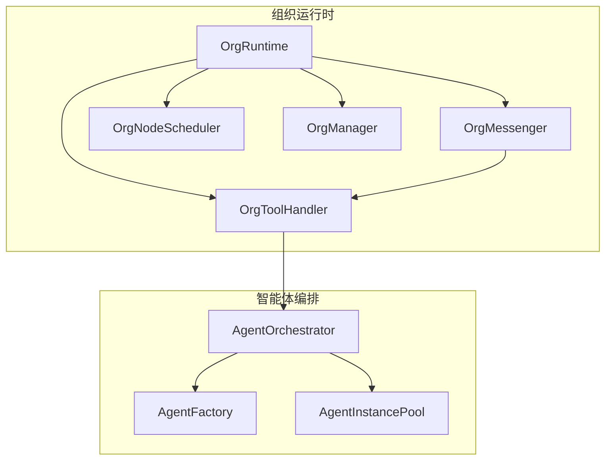
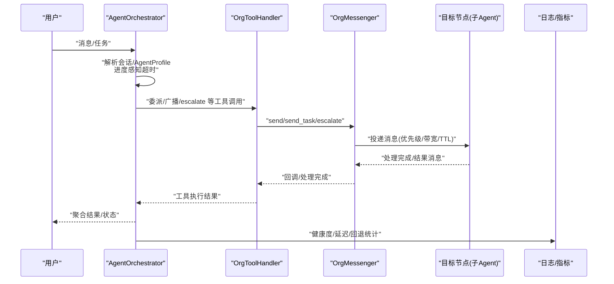
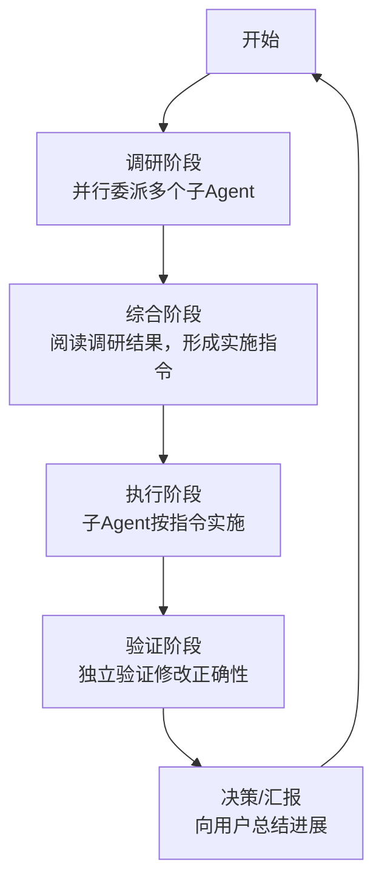
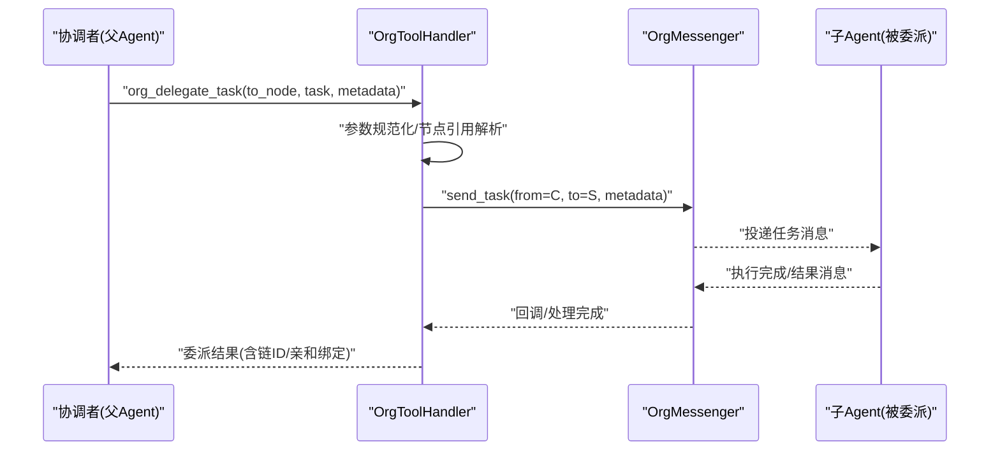
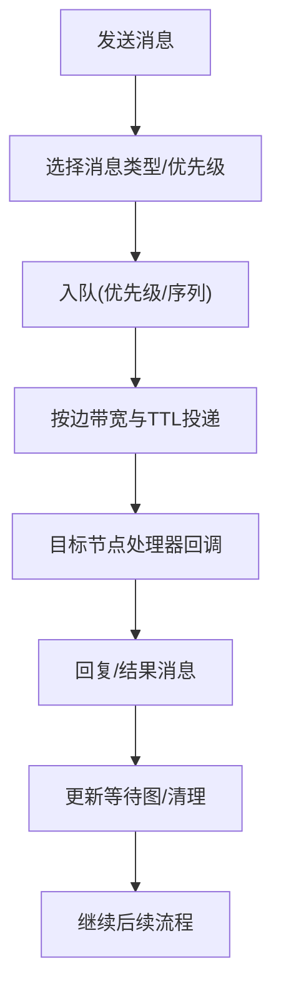
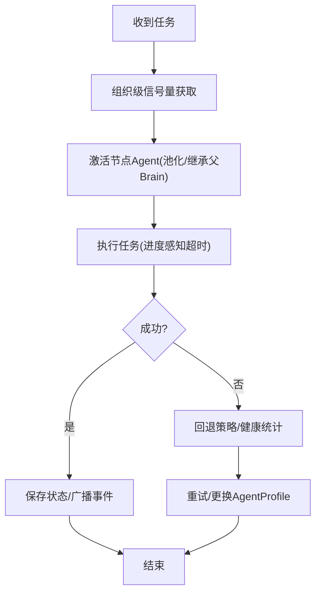
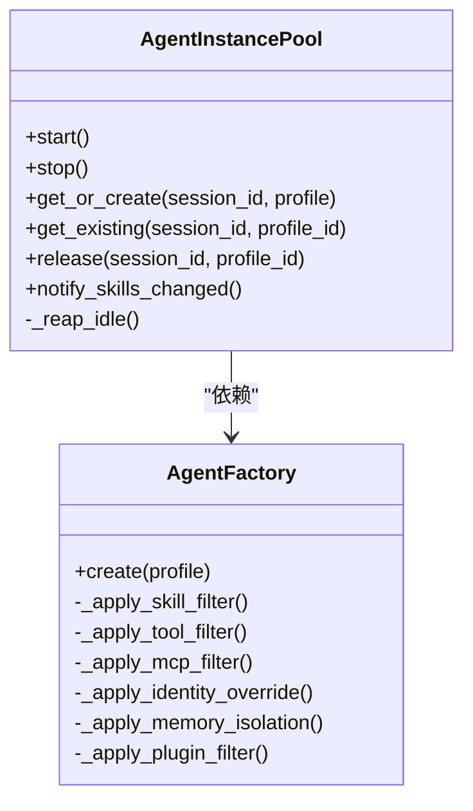
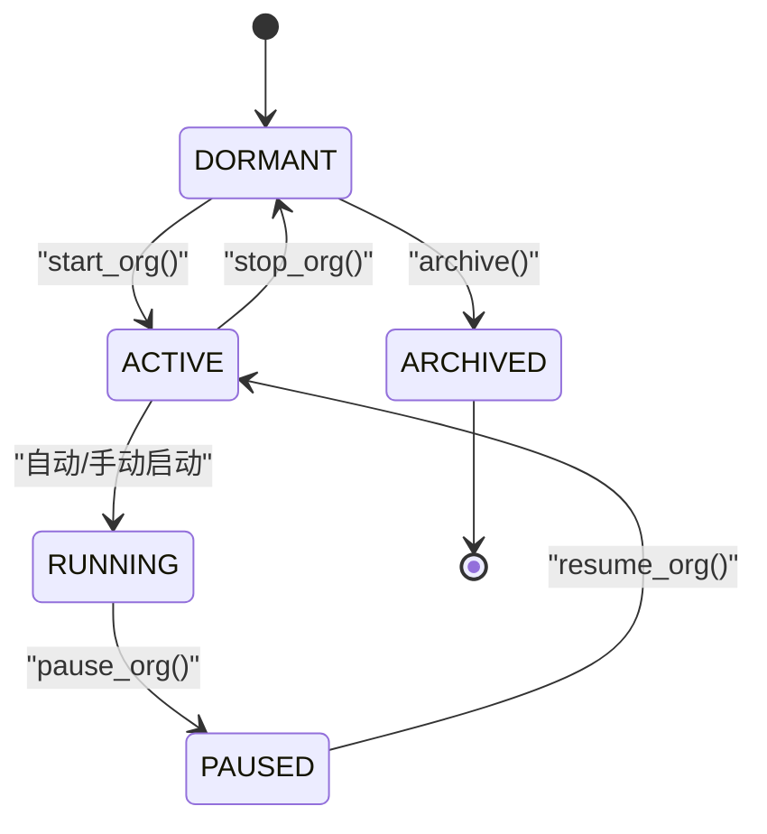
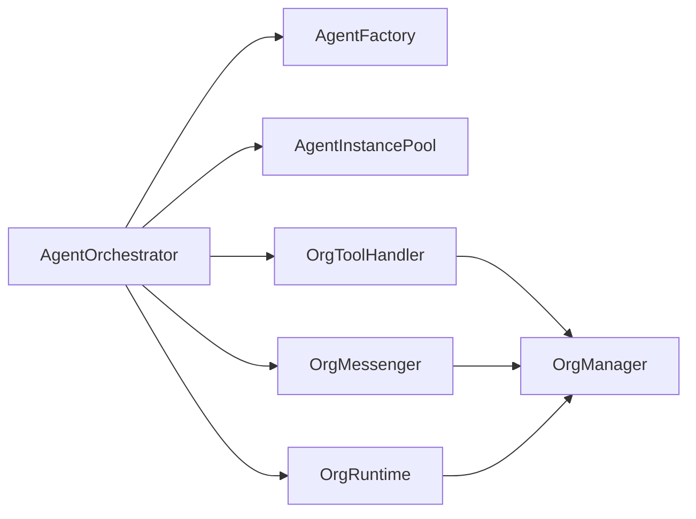

# 多智能体协作模式

<cite>
**本文引用的文件**
- [factory.py](file://src/synapse/agents/factory.py)
- [orchestrator.py](file://src/synapse/agents/orchestrator.py)
- [runtime.py](file://src/synapse/orgs/runtime.py)
- [messenger.py](file://src/synapse/orgs/messenger.py)
- [tool_handler.py](file://src/synapse/orgs/tool_handler.py)
- [node_scheduler.py](file://src/synapse/orgs/node_scheduler.py)
- [manager.py](file://src/synapse/orgs/manager.py)
- [coordinator_prompt.py](file://src/synapse/agents/coordinator_prompt.py)
- [builder.py](file://src/synapse/prompt/builder.py)
- [agent.py](file://src/synapse/tools/definitions/agent.py)
- [README_CN.md](file://README_CN.md)
</cite>

## 目录
1. [简介](#简介)
2. [项目结构](#项目结构)
3. [核心组件](#核心组件)
4. [架构总览](#架构总览)
5. [详细组件分析](#详细组件分析)
6. [依赖关系分析](#依赖关系分析)
7. [性能考量](#性能考量)
8. [故障排查指南](#故障排查指南)
9. [结论](#结论)
10. [附录](#附录)

## 简介
本文件系统化阐述 Synapse 多智能体协作模式，围绕协调者模式、委派模式、协商模式与竞争模式四大协作范式，结合智能体工厂、实例池与生命周期管理、通信协议与任务分配算法、冲突解决机制，给出代码级映射与可视化流程，帮助不同经验层次的读者快速掌握系统设计与实践要点。

## 项目结构
- 多智能体协作由“组织运行时”驱动，组织内的节点（Agent）通过“消息路由器”进行通信，任务通过“工具处理器”落地执行，并由“节点调度器”保障周期性任务的稳定运行。
- 协调器模式与委派模式由“AgentOrchestrator”与“AgentFactory/AgentInstancePool”共同支撑，前者负责消息路由、超时与回退，后者负责实例创建、过滤与复用。
- “OrgMessenger”提供优先级队列、带宽控制、死锁检测与 TTL 过期，保证消息可靠与公平。
- “OrgToolHandler”提供组织级工具（如委派、广播、escalate 等）的统一入口与参数规范化。
- “OrgRuntime”负责组织生命周期、并发控制、心跳与定时任务启动，以及与前端的事件广播。

图表来源
- [runtime.py:81-140](file://src/synapse/orgs/runtime.py#L81-L140)
- [messenger.py:135-160](file://src/synapse/orgs/messenger.py#L135-L160)
- [tool_handler.py:36-41](file://src/synapse/orgs/tool_handler.py#L36-L41)
- [node_scheduler.py:35-42](file://src/synapse/orgs/node_scheduler.py#L35-L42)
- [manager.py:29-40](file://src/synapse/orgs/manager.py#L29-L40)
- [orchestrator.py:194-227](file://src/synapse/agents/orchestrator.py#L194-L227)
- [factory.py:116-208](file://src/synapse/agents/factory.py#L116-L208)

章节来源
- [runtime.py:81-140](file://src/synapse/orgs/runtime.py#L81-L140)
- [manager.py:29-40](file://src/synapse/orgs/manager.py#L29-L40)

## 核心组件
- AgentOrchestrator：多智能体协调中枢，负责消息路由、委派深度控制、进度感知超时、健康度统计与回退策略触发。
- AgentFactory/AgentInstancePool：智能体工厂与实例池，按配置过滤技能/工具/MCP/插件，注入身份与记忆隔离，支持 per-session + per-profile 的实例缓存与空闲回收。
- OrgMessenger：组织内消息路由器，提供优先级队列、带宽限制、死锁检测与 TTL 过期，支持任务亲和绑定与广播。
- OrgToolHandler：组织工具统一入口，负责参数规范化、节点引用解析、委派/广播/escalate 等工具的执行与结果记录。
- OrgRuntime：组织生命周期与并发控制，负责启动/停止/暂停/恢复组织，节点状态机与事件广播，以及 watchdog/idle/probe 循环。
- OrgNodeScheduler：节点级定时任务调度，支持 cron/间隔/一次性，具备异常时自动降频与恢复的智能调频。
- OrgManager：组织持久化管理，负责组织 CRUD、模板管理、节点日程存储与运行态状态保存。

章节来源
- [orchestrator.py:194-227](file://src/synapse/agents/orchestrator.py#L194-L227)
- [factory.py:116-208](file://src/synapse/agents/factory.py#L116-L208)
- [messenger.py:135-160](file://src/synapse/orgs/messenger.py#L135-L160)
- [tool_handler.py:36-41](file://src/synapse/orgs/tool_handler.py#L36-L41)
- [runtime.py:81-140](file://src/synapse/orgs/runtime.py#L81-L140)
- [node_scheduler.py:35-42](file://src/synapse/orgs/node_scheduler.py#L35-L42)
- [manager.py:29-40](file://src/synapse/orgs/manager.py#L29-L40)

## 架构总览
下图展示多智能体协作的端到端路径：用户消息经由 AgentOrchestrator 进入，按会话与 AgentProfile 解析目标 Agent；若需要委派，则通过 OrgToolHandler 的 org_delegate_task 将任务下发至 OrgMessenger；消息在节点邮箱中排队，按优先级与带宽策略投递；节点执行完成后通过结果消息回传，Orchestrator 更新状态并进行健康统计与日志记录。

图表来源
- [orchestrator.py:369-567](file://src/synapse/agents/orchestrator.py#L369-L567)
- [tool_handler.py:383-403](file://src/synapse/orgs/tool_handler.py#L383-L403)
- [messenger.py:301-363](file://src/synapse/orgs/messenger.py#L301-L363)

章节来源
- [orchestrator.py:369-567](file://src/synapse/agents/orchestrator.py#L369-L567)
- [tool_handler.py:383-403](file://src/synapse/orgs/tool_handler.py#L383-L403)
- [messenger.py:301-363](file://src/synapse/orgs/messenger.py#L301-L363)

## 详细组件分析

### 协调者模式（Coordinator Mode）
- 设计要点：协调者负责指挥 Worker Agent 进行调研、实施与验证，综合结果向用户汇报；对简单问答或用户明确要求亲自处理的任务，协调者直接响应。
- 并行能力：鼓励在调研阶段并行启动多个任务，避免串行化可同时进行的工作；对写入类任务在同一组文件上限制并发。
- 通信协议：协调者通过 delegate_to_agent、delegate_parallel、send_agent_message、task_stop 等工具与子 Agent 交互；子 Agent 完成后以结构化结果回传，便于后续决策。

图表来源
- [coordinator_prompt.py:22-71](file://src/synapse/agents/coordinator_prompt.py#L22-L71)
- [builder.py:375-407](file://src/synapse/prompt/builder.py#L375-L407)

章节来源
- [coordinator_prompt.py:22-71](file://src/synapse/agents/coordinator_prompt.py#L22-L71)
- [builder.py:375-407](file://src/synapse/prompt/builder.py#L375-L407)

### 委派模式（Delegation Mode）
- 委派工具：org_delegate_task 支持将任务委派给指定节点，支持任务链 ID、截止日期、亲和绑定等元数据；校验层级合法性（仅直系下级）。
- 亲和绑定：同一任务链在首次委派后绑定到特定节点，后续跟进消息自动路由到该节点，减少跨节点沟通成本。
- 参数规范化：工具处理器对 LLM 提供的参数进行类型强制与别名解析，确保一致性与可执行性。

图表来源
- [tool_handler.py:473-602](file://src/synapse/orgs/tool_handler.py#L473-L602)
- [messenger.py:364-382](file://src/synapse/orgs/messenger.py#L364-L382)

章节来源
- [tool_handler.py:473-602](file://src/synapse/orgs/tool_handler.py#L473-L602)
- [messenger.py:364-382](file://src/synapse/orgs/messenger.py#L364-L382)

### 协商模式（Negotiation Mode）
- 通信协议：通过 org_send_message 与 org_reply_message 实现节点间的消息发送与回复；支持消息类型（问题/答案/部门广播/全组织广播）与优先级。
- 广播策略：支持部门广播与全组织广播，顶层节点具备全组织广播权限；广播消息触发对应节点处理器回调。
- 死锁检测：消息路由器维护等待图，若检测到循环等待则移除关键边以打破死锁，保障系统可用性。

图表来源
- [tool_handler.py:408-472](file://src/synapse/orgs/tool_handler.py#L408-L472)
- [messenger.py:301-363](file://src/synapse/orgs/messenger.py#L301-L363)
- [messenger.py:518-560](file://src/synapse/orgs/messenger.py#L518-L560)

章节来源
- [tool_handler.py:408-472](file://src/synapse/orgs/tool_handler.py#L408-L472)
- [messenger.py:301-363](file://src/synapse/orgs/messenger.py#L301-L363)
- [messenger.py:518-560](file://src/synapse/orgs/messenger.py#L518-L560)

### 竞争模式（Competition Mode）
- 并发控制：组织级并发信号量限制同时激活的节点数量；节点级会话信号量串行化同一会话内的消息，避免竞态。
- 超时与回退：AgentOrchestrator 使用进度感知超时（基于 ReAct 迭代计数与任务状态变化）与硬超时双重保障；失败时触发回退策略与健康统计。
- 任务链跟踪：通过链 ID 跟踪任务链的委派深度与状态，防止越级与无限委派。

图表来源
- [runtime.py:706-800](file://src/synapse/orgs/runtime.py#L706-L800)
- [orchestrator.py:572-762](file://src/synapse/agents/orchestrator.py#L572-L762)

章节来源
- [runtime.py:706-800](file://src/synapse/orgs/runtime.py#L706-L800)
- [orchestrator.py:572-762](file://src/synapse/agents/orchestrator.py#L572-L762)

### 智能体工厂与实例池
- 工厂过滤：按 SkillsMode/ToolsMode/MCPMode/PluginsMode 过滤技能、工具、MCP 与插件，支持 INCLUSIVE/EXCLUSIVE 模式与“基础设施工具”保留集。
- 身份与记忆隔离：支持自定义身份覆盖与独立记忆实例，可选继承全局记忆；工具目录重建与系统提示词刷新。
- 实例池：按 session_id::profile_id 维持 per-session + per-profile 实例；空闲回收与全局技能变更通知触发重建；支持父 Brain 继承以共享上下文。

图表来源
- [factory.py:116-208](file://src/synapse/agents/factory.py#L116-L208)
- [factory.py:474-754](file://src/synapse/agents/factory.py#L474-L754)

章节来源
- [factory.py:116-208](file://src/synapse/agents/factory.py#L116-L208)
- [factory.py:474-754](file://src/synapse/agents/factory.py#L474-L754)

### 生命周期与组织管理
- 生命周期：组织支持 DORMANT/ACTIVE/RUNNING/PAUSED/ARCHIVED 状态机；启动/停止/暂停/恢复/删除/重置等操作均有幂等与回滚保障。
- 节点调度：节点级定时任务支持一次性、cron 与固定间隔，具备异常时自动降频与恢复的智能调频。
- 事件与广播：运行时维护事件存储，支持 WebSocket 广播节点状态、任务完成、消息与升级等事件。

图表来源
- [runtime.py:231-246](file://src/synapse/orgs/runtime.py#L231-L246)
- [node_scheduler.py:108-168](file://src/synapse/orgs/node_scheduler.py#L108-L168)

章节来源
- [runtime.py:231-246](file://src/synapse/orgs/runtime.py#L231-L246)
- [node_scheduler.py:108-168](file://src/synapse/orgs/node_scheduler.py#L108-L168)

## 依赖关系分析
- 组件耦合：AgentOrchestrator 依赖 AgentFactory/AgentInstancePool 提供实例与过滤能力；依赖 OrgToolHandler 执行组织工具；依赖 OrgMessenger 进行消息投递与亲和绑定；依赖 OrgRuntime 进行组织生命周期与并发控制。
- 外部依赖：消息路由器依赖组织图结构（节点/边/层级）进行边带宽与等待图计算；工具处理器依赖组织模型（节点状态、任务链）进行合法性校验。
- 循环依赖规避：消息路由器与工具处理器通过回调与事件解耦；运行时通过事件存储与广播避免直接循环引用。

图表来源
- [orchestrator.py:250-279](file://src/synapse/agents/orchestrator.py#L250-L279)
- [tool_handler.py:39-41](file://src/synapse/orgs/tool_handler.py#L39-L41)
- [messenger.py:138-142](file://src/synapse/orgs/messenger.py#L138-L142)
- [runtime.py:84-107](file://src/synapse/orgs/runtime.py#L84-L107)
- [manager.py:32-40](file://src/synapse/orgs/manager.py#L32-L40)

章节来源
- [orchestrator.py:250-279](file://src/synapse/agents/orchestrator.py#L250-L279)
- [tool_handler.py:39-41](file://src/synapse/orgs/tool_handler.py#L39-L41)
- [messenger.py:138-142](file://src/synapse/orgs/messenger.py#L138-L142)
- [runtime.py:84-107](file://src/synapse/orgs/runtime.py#L84-L107)
- [manager.py:32-40](file://src/synapse/orgs/manager.py#L32-L40)

## 性能考量
- 并行与并发：协调者模式鼓励并行调研；组织级与节点级信号量限制并发，避免资源争用；实例池空闲回收降低内存占用。
- 超时与回退：进度感知超时避免无效等待；回退策略与健康统计提升系统鲁棒性；日志轮转与指标采集辅助性能监控。
- 带宽与公平：边带宽限制与优先级队列保障消息公平投递；TTL 过期清理僵尸消息，降低系统负担。
- 任务链与亲和：任务链 ID 与亲和绑定减少跨节点通信与上下文切换成本，提高执行效率。

## 故障排查指南
- 委派失败：检查目标节点是否为直系下级、节点状态是否冻结/离线；确认任务链 ID 与亲和绑定是否生效。
- 消息堆积：查看节点邮箱 pending 数与冻结缓冲区大小；检查边带宽限制与 TTL 设置；启用死锁检测并观察等待图。
- 超时与回退：关注 Orchestrator 日志中的 dispatch_timeout/dispatch_error；检查 profile 的 timeout_seconds/max_turns 配置；查看健康统计与回退提示。
- 组织状态异常：核对状态机转换是否符合预期；检查运行时事件存储与 WebSocket 广播；必要时执行 reset/delete 操作恢复。

章节来源
- [tool_handler.py:519-533](file://src/synapse/orgs/tool_handler.py#L519-L533)
- [messenger.py:204-271](file://src/synapse/orgs/messenger.py#L204-L271)
- [orchestrator.py:487-567](file://src/synapse/agents/orchestrator.py#L487-L567)
- [runtime.py:231-246](file://src/synapse/orgs/runtime.py#L231-L246)

## 结论
Synapse 的多智能体协作以“组织运行时”为核心，通过“消息路由器”“工具处理器”“协调中枢”“实例池”等模块协同，实现了从任务委派、并行执行到冲突解决与生命周期管理的闭环。协调者模式强调并行与综合，委派模式强调专业化与亲和绑定，协商模式强调公平与死锁规避，竞争模式强调并发与超时控制。配合完善的性能与可观测性策略，系统在复杂场景下仍能保持高吞吐、低延迟与强韧性。

## 附录
- 设计原则与最佳实践
  - 优先使用委派模式，将同类任务委派给最合适的 Agent；异类任务才分配给不同专业 Agent。
  - 并行启动调研任务，避免串行化可同时进行的工作；写入类任务在同一组文件上串行化。
  - 合理设置超时与回退策略，避免长时间无进展导致资源浪费。
  - 使用任务链 ID 与亲和绑定，减少跨节点通信与上下文切换。
- 参考资料
  - [README_CN.md:262-287](file://README_CN.md#L262-L287)

章节来源
- [agent.py:161-190](file://src/synapse/tools/definitions/agent.py#L161-L190)
- [README_CN.md:262-287](file://README_CN.md#L262-L287)