# 安全防护模式

<cite>
**本文档引用的文件**
- [policy.py](file://src/synapse/core/policy.py)
- [sandbox.py](file://src/synapse/core/sandbox.py)
- [checkpoint.py](file://src/synapse/core/checkpoint.py)
- [audit_logger.py](file://src/synapse/core/audit_logger.py)
- [permission.py](file://src/synapse/core/permission.py)
- [resource_budget.py](file://src/synapse/core/resource_budget.py)
- [config.py](file://src/synapse/api/routes/config.py)
- [test_security.py](file://tests/unit/test_security.py)
- [SecurityView.tsx](file://apps/setup-center/src/views/SecurityView.tsx)
</cite>

## 目录
1. [简介](#简介)
2. [项目结构](#项目结构)
3. [核心组件](#核心组件)
4. [架构总览](#架构总览)
5. [详细组件分析](#详细组件分析)
6. [依赖关系分析](#依赖关系分析)
7. [性能考量](#性能考量)
8. [故障排查指南](#故障排查指南)
9. [结论](#结论)
10. [附录](#附录)

## 简介
本文件系统性阐述 Synapse 的六层安全防护体系与安全模式设计，涵盖路径分区管理、确认门、命令拦截、文件快照、资源预算、进程隔离与权限控制等机制。文档通过代码级分析、流程图与序列图，解释策略实施、威胁检测与异常处理，并讨论安全与性能、易用性的平衡点，提供面向不同经验水平开发者的理解层次与最佳实践。

## 项目结构
围绕安全防护的关键模块分布如下：
- 策略引擎与权限：policy.py、permission.py
- 沙箱与命令拦截：sandbox.py
- 文件快照与回滚：checkpoint.py
- 审计日志：audit_logger.py
- 资源预算：resource_budget.py
- 配置与API：config.py
- 测试与前端界面：test_security.py、SecurityView.tsx

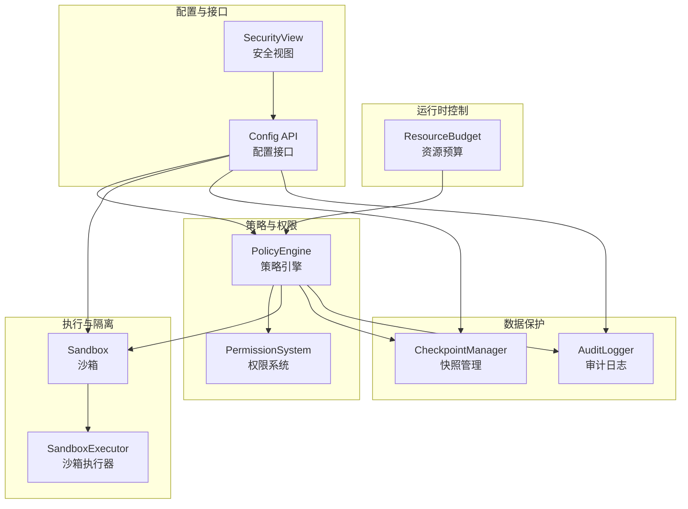

**图表来源**
- [policy.py:526-800](file://src/synapse/core/policy.py#L526-L800)
- [permission.py:248-332](file://src/synapse/core/permission.py#L248-L332)
- [sandbox.py:186-262](file://src/synapse/core/sandbox.py#L186-L262)
- [checkpoint.py:48-90](file://src/synapse/core/checkpoint.py#L48-L90)
- [audit_logger.py:54-111](file://src/synapse/core/audit_logger.py#L54-L111)
- [resource_budget.py:91-230](file://src/synapse/core/resource_budget.py#L91-L230)
- [config.py:997-1024](file://src/synapse/api/routes/config.py#L997-L1024)
- [SecurityView.tsx:511-533](file://apps/setup-center/src/views/SecurityView.tsx#L511-L533)

**章节来源**
- [policy.py:1-1569](file://src/synapse/core/policy.py#L1-L1569)
- [sandbox.py:1-262](file://src/synapse/core/sandbox.py#L1-L262)
- [checkpoint.py:1-258](file://src/synapse/core/checkpoint.py#L1-L258)
- [audit_logger.py:1-111](file://src/synapse/core/audit_logger.py#L1-L111)
- [permission.py:1-495](file://src/synapse/core/permission.py#L1-L495)
- [resource_budget.py:1-363](file://src/synapse/core/resource_budget.py#L1-L363)
- [config.py:990-1189](file://src/synapse/api/routes/config.py#L990-L1189)
- [test_security.py:1-724](file://tests/unit/test_security.py#L1-L724)
- [SecurityView.tsx:511-533](file://apps/setup-center/src/views/SecurityView.tsx#L511-L533)

## 核心组件
- 策略引擎（PolicyEngine）：实现六层安全体系的 L1/L3 决策核心，负责区域判定、风险分类、确认门、自保护与审计联动。
- 沙箱（Sandbox/SandboxExecutor）：基于规则的命令检查与受限执行，支持超时与目录访问控制。
- 文件快照（CheckpointManager）：在可控区修改前自动创建快照，支持回滚与清单管理。
- 审计日志（AuditLogger）：持久化策略决策，脱敏敏感信息，保障不可否认性。
- 权限系统（PermissionSystem）：基于模式规则与策略引擎的统一权限检查，fail-closed/fail-open 策略。
- 资源预算（ResourceBudget）：令牌、成本、时长、迭代、工具调用等多维预算控制与分级响应。
- 配置与API：提供安全模式、沙箱、确认门、审计、快照等配置的读写与重载能力。

**章节来源**
- [policy.py:526-800](file://src/synapse/core/policy.py#L526-L800)
- [sandbox.py:72-198](file://src/synapse/core/sandbox.py#L72-L198)
- [checkpoint.py:48-258](file://src/synapse/core/checkpoint.py#L48-L258)
- [audit_logger.py:54-111](file://src/synapse/core/audit_logger.py#L54-L111)
- [permission.py:248-332](file://src/synapse/core/permission.py#L248-L332)
- [resource_budget.py:91-230](file://src/synapse/core/resource_budget.py#L91-L230)
- [config.py:997-1024](file://src/synapse/api/routes/config.py#L997-L1024)

## 架构总览
六层安全防护体系（L1-L6）在工具执行前进行多层校验与控制：
- L1：四区（workspace/controlled/protected/forbidden）+ 操作类型矩阵
- L3：跨平台危险命令模式匹配与风险分级
- L4：文件快照与回滚
- L5：自保护（死亡开关）、审计日志
- L6：确认门（UI/会话/TTL）
- L7：沙箱与资源预算

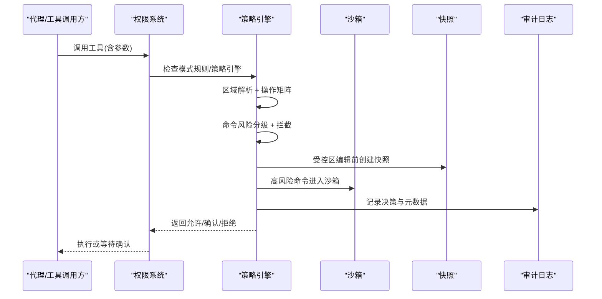

**图表来源**
- [permission.py:248-332](file://src/synapse/core/permission.py#L248-L332)
- [policy.py:759-1090](file://src/synapse/core/policy.py#L759-L1090)
- [checkpoint.py:102-177](file://src/synapse/core/checkpoint.py#L102-L177)
- [sandbox.py:186-262](file://src/synapse/core/sandbox.py#L186-L262)
- [audit_logger.py:54-111](file://src/synapse/core/audit_logger.py#L54-L111)

## 详细组件分析

### 路径分区管理模式（L1）
- 四区定义与默认路径：工作区（workspace）、受控区（controlled）、保护区（protected）、禁止区（forbidden），默认受保护与禁止路径按平台差异配置。
- 操作类型矩阵：针对读取、创建、编辑、覆盖、删除、递归删除在各区域的允许/确认/拒绝策略。
- 区域解析：规范化路径后匹配四区，未匹配默认受保护；支持通配符与前缀匹配。

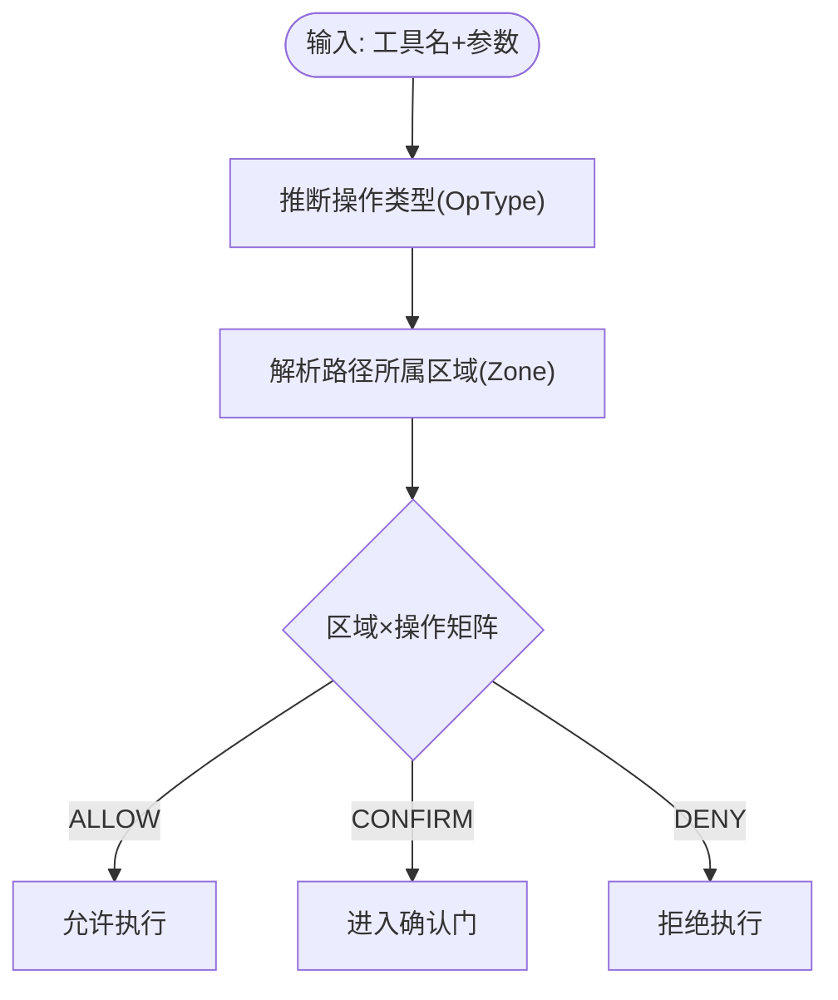

**图表来源**
- [policy.py:434-494](file://src/synapse/core/policy.py#L434-L494)
- [policy.py:77-110](file://src/synapse/core/policy.py#L77-L110)

**章节来源**
- [policy.py:217-261](file://src/synapse/core/policy.py#L217-L261)
- [policy.py:434-494](file://src/synapse/core/policy.py#L434-L494)
- [policy.py:77-110](file://src/synapse/core/policy.py#L77-L110)
- [test_security.py:80-160](file://tests/unit/test_security.py#L80-L160)

### 确认门模式（L6）
- 支持三种安全模式：谨慎（cautious）、智能（smart）、放任（yolo/trust）。
- 确认门超时与默认策略、TTL 缓存、会话白名单、持久化用户白名单。
- UI 确认回调与决策缓存，支持一次性、会话级豁免。

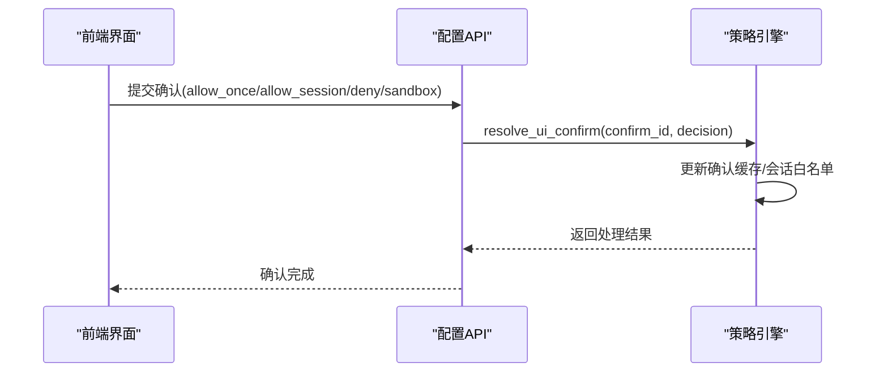

**图表来源**
- [config.py:1115-1132](file://src/synapse/api/routes/config.py#L1115-L1132)
- [policy.py:540-548](file://src/synapse/core/policy.py#L540-L548)

**章节来源**
- [config.py:1027-1073](file://src/synapse/api/routes/config.py#L1027-L1073)
- [policy.py:291-300](file://src/synapse/core/policy.py#L291-L300)
- [policy.py:540-548](file://src/synapse/core/policy.py#L540-L548)
- [test_security.py:597-633](file://tests/unit/test_security.py#L597-L633)

### 命令拦截模式（L3）
- 跨平台危险命令模式匹配：通用、Windows、Linux/macOS 三类正则模式，支持自定义与排除。
- 直接阻断命令：如 regedit、bcdedit 等。
- 风险分级：极高（CRITICAL）、高（HIGH）、中（MEDIUM）、低（LOW），不同级别对应自动拒绝、确认或允许。

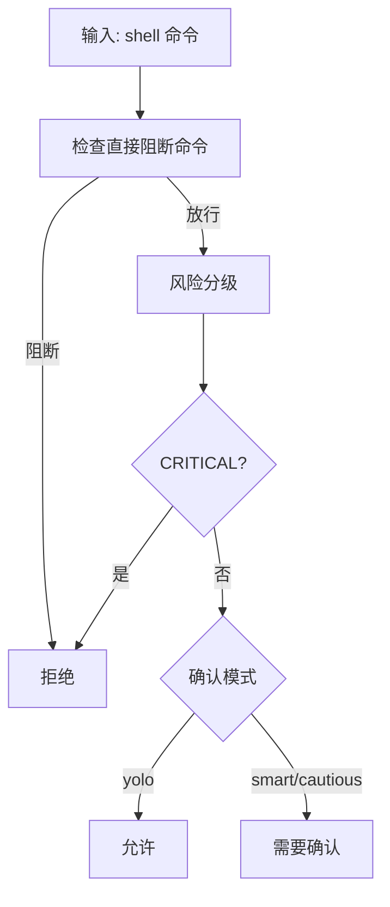

**图表来源**
- [policy.py:116-214](file://src/synapse/core/policy.py#L116-L214)
- [policy.py:1042-1090](file://src/synapse/core/policy.py#L1042-L1090)

**章节来源**
- [policy.py:116-214](file://src/synapse/core/policy.py#L116-L214)
- [policy.py:1042-1090](file://src/synapse/core/policy.py#L1042-L1090)
- [test_security.py:166-230](file://tests/unit/test_security.py#L166-L230)

### 文件快照模式（L4）
- 受控区编辑前自动创建快照，记录原始文件哈希、备份路径与存在性。
- 支持回滚到指定快照 ID，清理超出上限的旧快照。
- 快照清单与统计接口，便于运维审计。

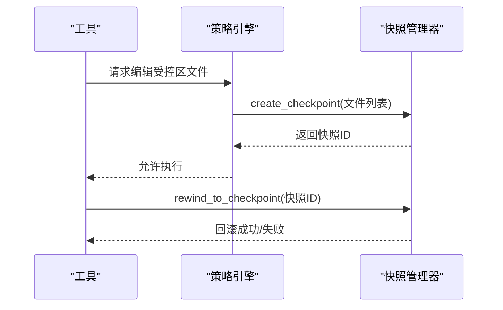

**图表来源**
- [checkpoint.py:102-177](file://src/synapse/core/checkpoint.py#L102-L177)
- [checkpoint.py:179-215](file://src/synapse/core/checkpoint.py#L179-L215)

**章节来源**
- [checkpoint.py:48-258](file://src/synapse/core/checkpoint.py#L48-L258)
- [test_security.py:288-353](file://tests/unit/test_security.py#L288-L353)

### 自保护与审计（L5）
- 自保护：对受保护目录（如 data/、src/）的删除操作直接拒绝；连续拒绝触发只读模式（死亡开关），只读模式下仅允许读取。
- 审计日志：JSONL 追加写入，记录工具名、决策、原因、策略与元数据；对敏感字段进行脱敏。

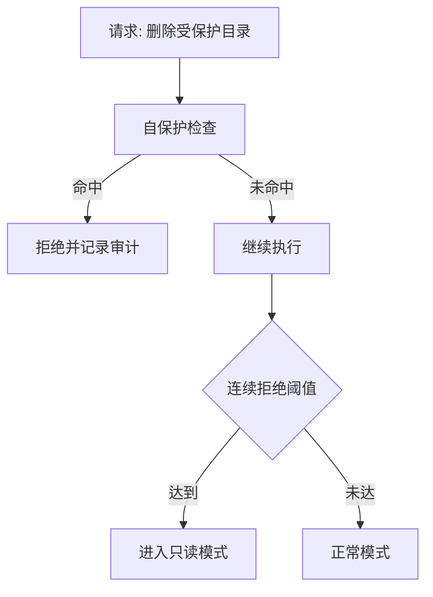

**图表来源**
- [policy.py:800-840](file://src/synapse/core/policy.py#L800-L840)
- [audit_logger.py:54-111](file://src/synapse/core/audit_logger.py#L54-L111)

**章节来源**
- [policy.py:343-354](file://src/synapse/core/policy.py#L343-L354)
- [policy.py:800-840](file://src/synapse/core/policy.py#L800-L840)
- [audit_logger.py:54-111](file://src/synapse/core/audit_logger.py#L54-L111)
- [test_security.py:236-282](file://tests/unit/test_security.py#L236-L282)

### 进程隔离模式（沙箱）
- 规则检查：黑名单命令、黑名单正则、目录访问限制、白名单命令。
- 执行器：基于 subprocess 的轻量隔离，支持超时强制终止与错误处理。
- 风险驱动：根据风险级别决定是否进入沙箱执行。

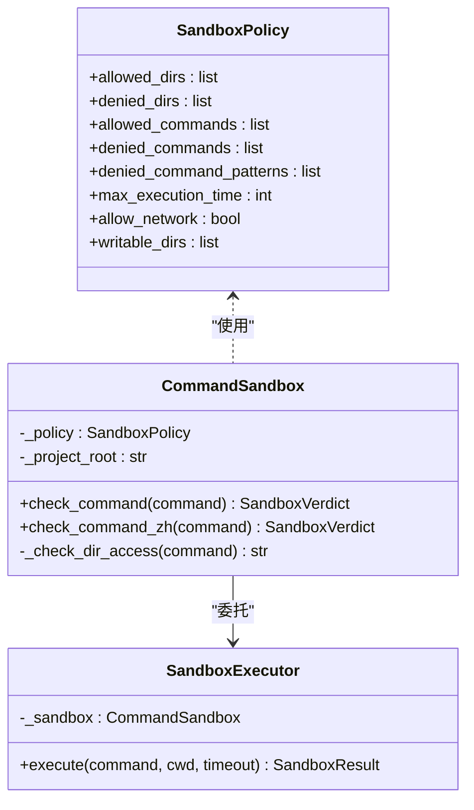

**图表来源**
- [sandbox.py:27-61](file://src/synapse/core/sandbox.py#L27-L61)
- [sandbox.py:72-198](file://src/synapse/core/sandbox.py#L72-L198)
- [sandbox.py:186-262](file://src/synapse/core/sandbox.py#L186-L262)

**章节来源**
- [sandbox.py:27-198](file://src/synapse/core/sandbox.py#L27-L198)
- [sandbox.py:186-262](file://src/synapse/core/sandbox.py#L186-L262)
- [policy.py:1045-1049](file://src/synapse/core/policy.py#L1045-L1049)

### 权限控制模式（P2）
- 模式规则：plan/ask/coordinator 三种模式下的工具可用性限制。
- 统一权限检查：先模式规则，再策略引擎，最后额外规则；fail-closed/fail-open 行为。
- 路径级检查：在文件写入前进行路径级权限校验。

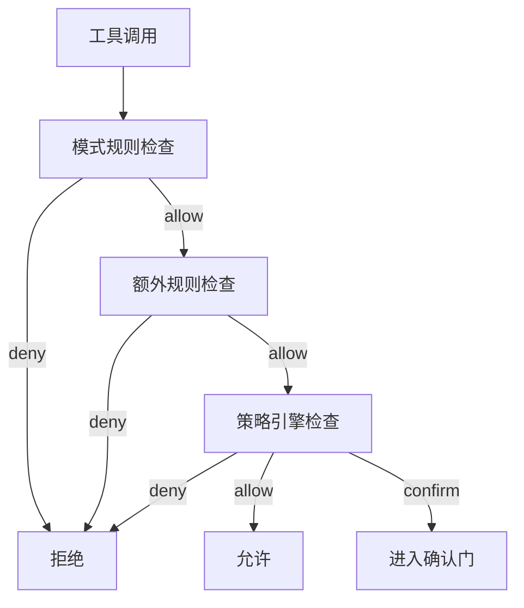

**图表来源**
- [permission.py:248-332](file://src/synapse/core/permission.py#L248-L332)
- [permission.py:334-380](file://src/synapse/core/permission.py#L334-L380)

**章节来源**
- [permission.py:248-332](file://src/synapse/core/permission.py#L248-L332)
- [permission.py:334-380](file://src/synapse/core/permission.py#L334-L380)

### 资源预算控制模式（P1-5）
- 多维预算：token、成本、时长、迭代、工具调用次数。
- 分级策略：预警（80%）、降级（90%）、暂停（100%），支持子预算分配。
- 决策追踪：预算检查结果记录到追踪器。

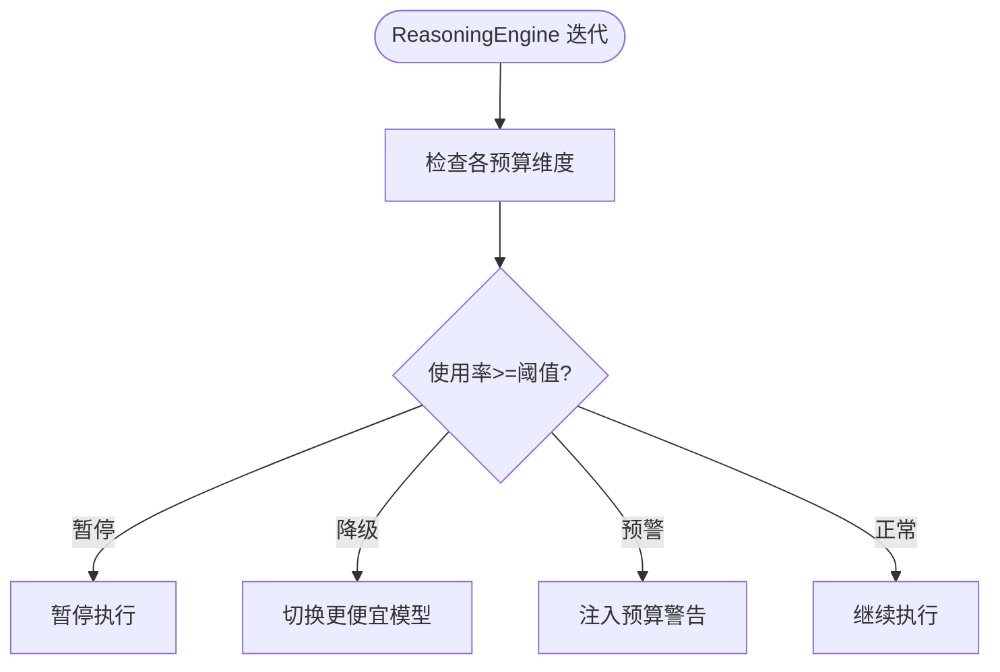

**图表来源**
- [resource_budget.py:192-345](file://src/synapse/core/resource_budget.py#L192-L345)

**章节来源**
- [resource_budget.py:50-345](file://src/synapse/core/resource_budget.py#L50-L345)

### 配置与前端集成
- 配置API：支持沙箱、确认门、审计、快照等配置的读取与更新，更新后重载策略引擎。
- 前端安全视图：提供沙箱后端、风险等级、豁免命令等配置项，支持多选与交互。

**章节来源**
- [config.py:997-1024](file://src/synapse/api/routes/config.py#L997-L1024)
- [config.py:1027-1073](file://src/synapse/api/routes/config.py#L1027-L1073)
- [config.py:1076-1113](file://src/synapse/api/routes/config.py#L1076-L1113)
- [SecurityView.tsx:511-533](file://apps/setup-center/src/views/SecurityView.tsx#L511-L533)

## 依赖关系分析
- 策略引擎依赖：权限系统（统一入口）、沙箱（风险驱动）、快照（受控区保护）、审计（持久化记录）。
- 执行链路：权限系统前置过滤，策略引擎二次决策，沙箱/快照/审计按需介入。
- 配置耦合：配置API与策略引擎、沙箱、快照、审计之间存在运行时重载与状态同步。

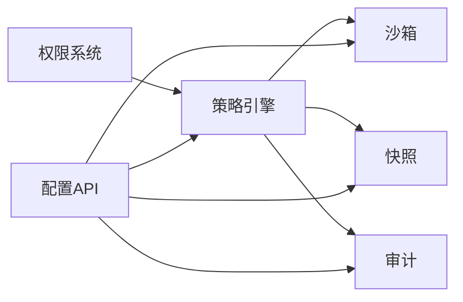

**图表来源**
- [permission.py:248-332](file://src/synapse/core/permission.py#L248-L332)
- [policy.py:759-1090](file://src/synapse/core/policy.py#L759-L1090)
- [config.py:997-1024](file://src/synapse/api/routes/config.py#L997-L1024)

**章节来源**
- [permission.py:248-332](file://src/synapse/core/permission.py#L248-L332)
- [policy.py:759-1090](file://src/synapse/core/policy.py#L759-L1090)
- [config.py:997-1024](file://src/synapse/api/routes/config.py#L997-L1024)

## 性能考量
- 规则匹配复杂度：路径匹配采用规范化与通配符/前缀匹配，风险模式使用正则，建议合理配置模式数量与排除列表。
- I/O 成本：快照创建涉及文件复制与哈希计算，建议限制快照数量与并发创建。
- 执行器开销：沙箱执行器基于 subprocess，超时与错误处理增加少量开销，建议结合风险级别动态启用。
- 预算检查频率：每轮迭代检查预算，建议在高频工具调用场景中合并记录以减少日志写入。

[本节为通用指导，无需特定文件引用]

## 故障排查指南
- 策略配置问题：通过配置API读取/写入安全配置，更新后重载策略引擎；检查 YAML 加载新旧格式兼容性。
- 确认门异常：检查 UI 确认回调是否正确写入缓存，确认 ID 是否存在；查看确认 TTL 与会话白名单状态。
- 沙箱执行失败：检查命令是否命中黑名单/正则，目录访问是否受限，超时时间是否过短。
- 快照回滚失败：确认快照ID有效，目标文件是否存在，权限是否足够。
- 审计日志缺失：检查审计路径与权限，确认 JSONL 写入异常。

**章节来源**
- [config.py:997-1024](file://src/synapse/api/routes/config.py#L997-L1024)
- [config.py:1115-1132](file://src/synapse/api/routes/config.py#L1115-L1132)
- [sandbox.py:186-262](file://src/synapse/core/sandbox.py#L186-L262)
- [checkpoint.py:179-215](file://src/synapse/core/checkpoint.py#L179-L215)
- [audit_logger.py:54-111](file://src/synapse/core/audit_logger.py#L54-L111)

## 结论
Synapse 的六层安全防护体系通过“区域+风险+确认+自保护+快照+沙箱+预算”的组合拳，在保证安全性的同时兼顾易用性与性能。策略引擎作为中枢，将权限系统、沙箱、快照与审计有机整合；配置API与前端界面提供灵活的运行时调整能力。实践中应结合业务场景选择合适的安全模式与风险阈值，持续优化规则与阈值，实现安全与效率的最佳平衡。

[本节为总结性内容，无需特定文件引用]

## 附录
- 安全威胁模型与攻击向量：跨平台危险命令（格式化、rm -rf、mkfs等）、系统目录访问、网络下载执行、高成本/长时间任务滥用。
- 防护策略：区域隔离、命令模式匹配、确认门、自保护与只读模式、文件快照回滚、沙箱执行、资源预算分级。
- 最佳实践：最小权限原则、分层防御、规则定期评审、审计留痕、配置版本化、前端可视化与可恢复性。

[本节为概念性内容，无需特定文件引用]