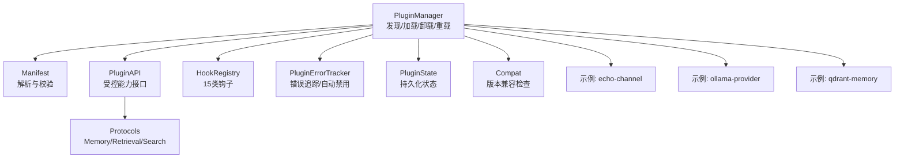
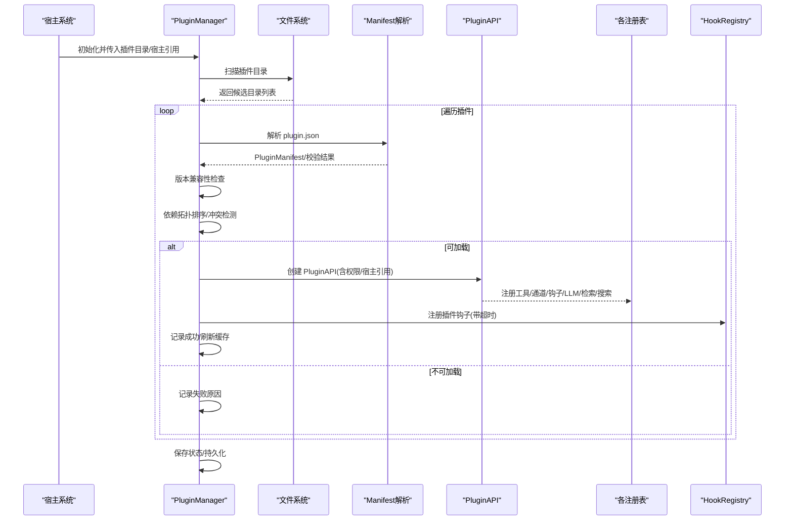
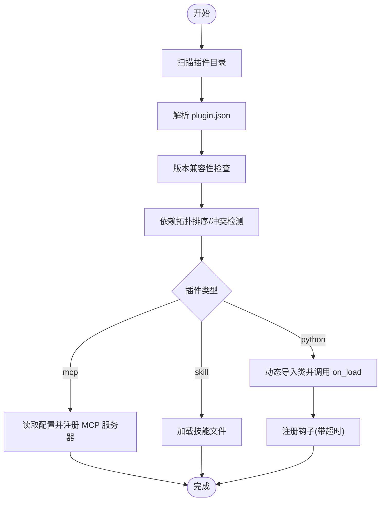
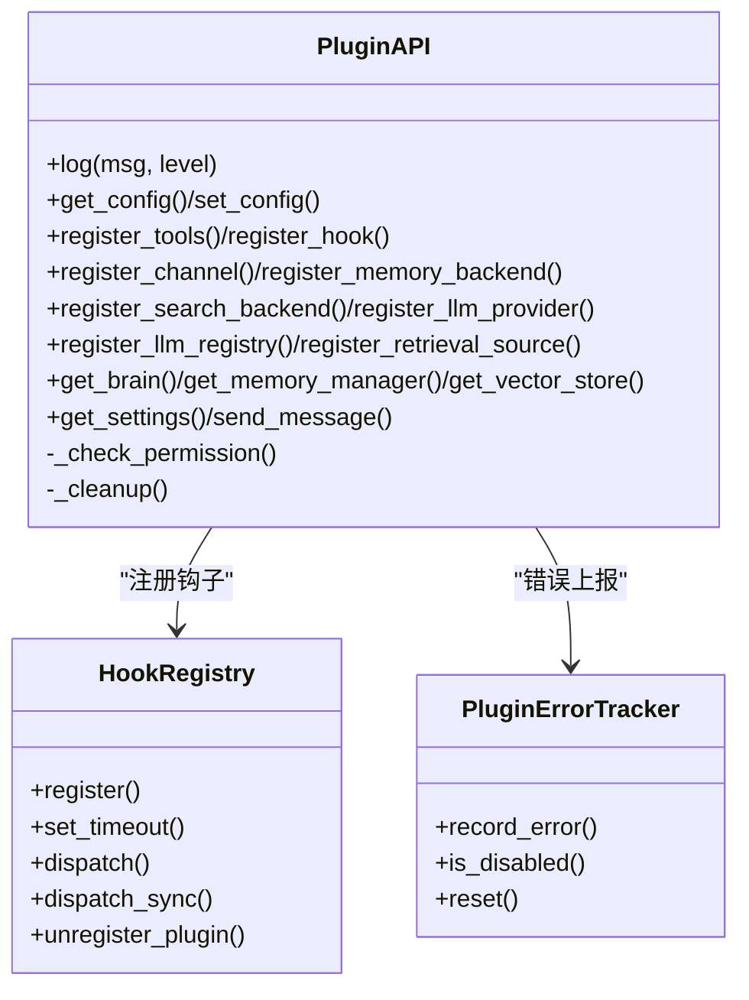
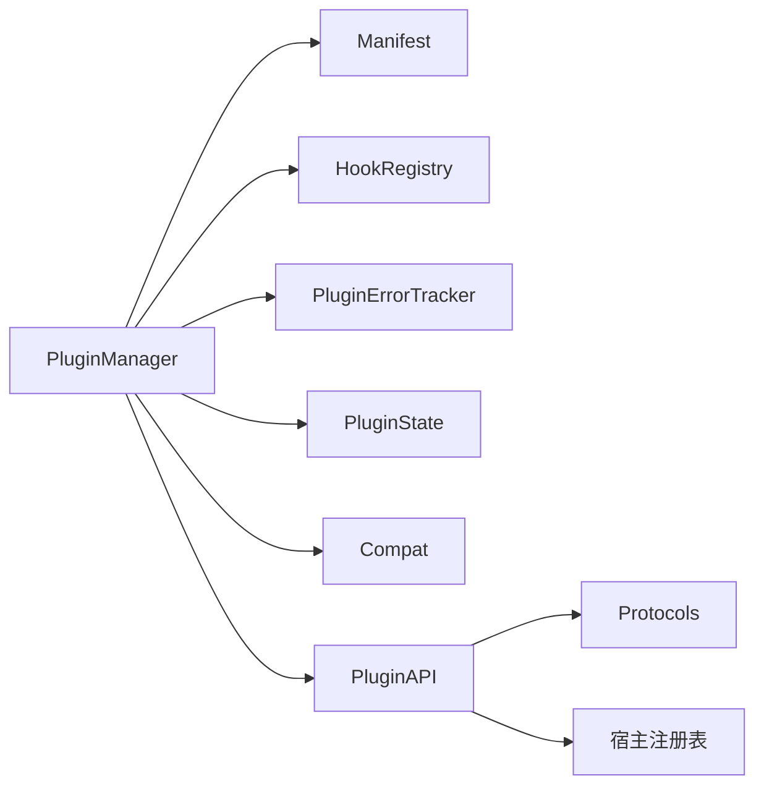

# 插件化架构

<cite>
**本文引用的文件**
- [src/synapse/plugins/__init__.py](file://src/synapse/plugins/__init__.py)
- [src/synapse/plugins/manager.py](file://src/synapse/plugins/manager.py)
- [src/synapse/plugins/manifest.py](file://src/synapse/plugins/manifest.py)
- [src/synapse/plugins/api.py](file://src/synapse/plugins/api.py)
- [src/synapse/plugins/hooks.py](file://src/synapse/plugins/hooks.py)
- [src/synapse/plugins/sandbox.py](file://src/synapse/plugins/sandbox.py)
- [src/synapse/plugins/state.py](file://src/synapse/plugins/state.py)
- [src/synapse/plugins/compat.py](file://src/synapse/plugins/compat.py)
- [src/synapse/plugins/protocols.py](file://src/synapse/plugins/protocols.py)
- [examples/plugins/echo-channel/plugin.py](file://examples/plugins/echo-channel/plugin.py)
- [examples/plugins/ollama-provider/plugin.py](file://examples/plugins/ollama-provider/plugin.py)
- [examples/plugins/qdrant-memory/plugin.py](file://examples/plugins/qdrant-memory/plugin.py)
- [examples/plugins/translate-skill/SKILL.md](file://examples/plugins/translate-skill/SKILL.md)
</cite>

## 目录
1. [引言](#引言)
2. [项目结构](#项目结构)
3. [核心组件](#核心组件)
4. [架构总览](#架构总览)
5. [详细组件分析](#详细组件分析)
6. [依赖分析](#依赖分析)
7. [性能考虑](#性能考虑)
8. [故障排查指南](#故障排查指南)
9. [结论](#结论)
10. [附录](#附录)

## 引言
本文件系统性阐述 Synapse 的插件化架构，围绕统一的插件系统设计与实现，解释插件的生命周期、权限控制与安全隔离、版本兼容与依赖管理，并结合具体示例展示工具插件、通道插件、RAG 插件、记忆插件、LLM 插件、钩子插件、技能插件与 MCP 插件的架构设计与落地方式。文档同时提供面向不同经验水平开发者的理解路径：从高层概念到代码级细节，再到最佳实践与排错建议。

## 项目结构
Synapse 插件系统位于 src/synapse/plugins 下，核心由以下模块组成：
- 管理器：负责插件发现、加载、卸载、重载、状态持久化与错误追踪
- 清单解析：解析并校验 plugin.json，定义插件元数据、权限、依赖与入口
- API 与基类：向插件暴露受控能力接口，限制越权访问
- 钩子系统：提供 15 类生命周期钩子，支持超时与异常隔离
- 沙箱与错误追踪：对回调执行进行超时与异常隔离，统计错误并自动禁用
- 状态持久化：记录启用/禁用、权限授予、错误计数等
- 兼容性检查：校验系统版本、API 版本、SDK 版本与 Python 版本
- 协议接口：定义可插拔的记忆后端、检索源与搜索后端协议

图表来源
- [src/synapse/plugins/manager.py:44-781](file://src/synapse/plugins/manager.py#L44-L781)
- [src/synapse/plugins/manifest.py:70-378](file://src/synapse/plugins/manifest.py#L70-L378)
- [src/synapse/plugins/api.py:60-697](file://src/synapse/plugins/api.py#L60-L697)
- [src/synapse/plugins/hooks.py:53-225](file://src/synapse/plugins/hooks.py#L53-L225)
- [src/synapse/plugins/sandbox.py:20-127](file://src/synapse/plugins/sandbox.py#L20-L127)
- [src/synapse/plugins/state.py:29-136](file://src/synapse/plugins/state.py#L29-L136)
- [src/synapse/plugins/compat.py:36-192](file://src/synapse/plugins/compat.py#L36-L192)
- [src/synapse/plugins/protocols.py:8-49](file://src/synapse/plugins/protocols.py#L8-L49)

章节来源
- [src/synapse/plugins/__init__.py:1-36](file://src/synapse/plugins/__init__.py#L1-L36)

## 核心组件
- 插件清单与权限模型
  - 清单字段覆盖 id、name、version、type、entry、permissions、requires、provides、conflicts、depends 等；内置基础、高级与系统三档权限集合，最大权限等级用于 UI 展示与审批流程
  - 路径字段严格校验，防止路径穿越与绝对路径
- 插件 API 与基类
  - PluginAPI 将宿主能力以“受控代理”的形式暴露，所有特权操作均需授权；提供日志、配置读写、工具注册、钩子注册、通道注册、内存后端注册、检索源注册、搜索后端注册、LLM 提供商/注册表注册、主机对象访问与清理等
  - PluginBase 为 Python 插件基类，要求实现 on_load/on_unload
- 钩子系统
  - 支持 15 类钩子（初始化、消息收发、检索、工具使用前后、会话开始/结束、计划任务、配置变更、错误等），每个回调独立超时与异常隔离
- 沙箱与错误追踪
  - 对回调执行进行超时与异常捕获；在窗口时间内累计错误达到阈值自动禁用插件，触发清理流程
- 状态持久化
  - 记录启用/禁用、已授予权限、安装时间、最近错误与计数，支持保存/加载与迁移
- 兼容性检查
  - 校验系统版本、插件 API 主版本、SDK 版本与 Python 版本，不满足则拒绝加载或发出警告
- 协议接口
  - MemoryBackendProtocol、RetrievalSource、SearchBackend 为可插拔扩展点，允许替换或增强记忆、检索与搜索能力

章节来源
- [src/synapse/plugins/manifest.py:70-206](file://src/synapse/plugins/manifest.py#L70-L206)
- [src/synapse/plugins/api.py:60-697](file://src/synapse/plugins/api.py#L60-L697)
- [src/synapse/plugins/hooks.py:53-225](file://src/synapse/plugins/hooks.py#L53-L225)
- [src/synapse/plugins/sandbox.py:20-127](file://src/synapse/plugins/sandbox.py#L20-L127)
- [src/synapse/plugins/state.py:29-136](file://src/synapse/plugins/state.py#L29-L136)
- [src/synapse/plugins/compat.py:36-192](file://src/synapse/plugins/compat.py#L36-L192)
- [src/synapse/plugins/protocols.py:8-49](file://src/synapse/plugins/protocols.py#L8-L49)

## 架构总览
下图展示了插件系统的关键交互：PluginManager 发现并加载插件，解析清单与权限，通过 PluginAPI 注册能力，借助 HookRegistry 分发事件，使用 PluginErrorTracker 进行错误隔离与自动禁用，最终持久化状态并通知相关注册表更新。

图表来源
- [src/synapse/plugins/manager.py:165-247](file://src/synapse/plugins/manager.py#L165-L247)
- [src/synapse/plugins/manifest.py:253-294](file://src/synapse/plugins/manifest.py#L253-L294)
- [src/synapse/plugins/api.py:195-250](file://src/synapse/plugins/api.py#L195-L250)
- [src/synapse/plugins/hooks.py:108-157](file://src/synapse/plugins/hooks.py#L108-L157)

## 详细组件分析

### 插件生命周期与管理
- 发现与解析
  - 扫描插件目录，定位包含 plugin.json 的目录；解析清单并进行路径与字段校验
- 加载与权限
  - 按依赖拓扑顺序加载；逐项校验系统/API/SDK/Python 兼容性；根据已授予权限决定是否授予新权限
- 注册能力
  - 依据插件类型（python/mcp/skill）分别调用对应加载逻辑：Python 插件动态导入类并调用 on_load；MCP 插件读取配置并注册服务器；技能插件加载本地技能文件
- 钩子与清理
  - 注册钩子并设置超时；卸载时按类型清理工具、通道、MCP、内存后端、搜索后端与检索源
- 重载与状态
  - 支持在授权变更后重载；持久化状态并记录错误

图表来源
- [src/synapse/plugins/manager.py:120-247](file://src/synapse/plugins/manager.py#L120-L247)
- [src/synapse/plugins/manifest.py:253-294](file://src/synapse/plugins/manifest.py#L253-L294)

章节来源
- [src/synapse/plugins/manager.py:165-742](file://src/synapse/plugins/manager.py#L165-L742)

### 权限控制与安全隔离
- 权限分层
  - 基础权限：工具注册、钩子基础、配置读写、数据目录、日志、技能
  - 高级权限：内存读写、通道注册/发送、消息钩子、检索注册、搜索注册、路由注册、脑访问、向量访问、设置读取、LLM 注册
  - 系统权限：全部钩子、内存替换、系统配置写入（保留）
- 授权策略
  - 启动时仅授予基础权限；高级/系统权限需用户审批；新请求的高级权限若未批准则延迟生效，等待重载
- 安全隔离
  - PluginAPI 对特权方法进行权限检查；钩子回调独立超时与异常隔离；错误累积触发自动禁用；卸载时清理所有注册资源

图表来源
- [src/synapse/plugins/api.py:60-697](file://src/synapse/plugins/api.py#L60-L697)
- [src/synapse/plugins/hooks.py:53-225](file://src/synapse/plugins/hooks.py#L53-L225)
- [src/synapse/plugins/sandbox.py:20-127](file://src/synapse/plugins/sandbox.py#L20-L127)

章节来源
- [src/synapse/plugins/api.py:119-144](file://src/synapse/plugins/api.py#L119-L144)
- [src/synapse/plugins/sandbox.py:32-53](file://src/synapse/plugins/sandbox.py#L32-L53)

### 版本管理与兼容性
- 系统版本：要求运行系统版本满足最低版本
- 插件 API 版本：按主版本兼容（~N），次版本不高于当前 API 版本
- SDK 版本：建议安装指定 SDK，否则仅警告
- Python 版本：要求运行环境满足最低版本

章节来源
- [src/synapse/plugins/compat.py:36-192](file://src/synapse/plugins/compat.py#L36-L192)

### 插件类型与架构设计

#### 工具插件（Tools）
- 设计要点
  - 通过 PluginAPI.register_tools 注册工具定义与处理器；内部将 OpenAI/Anthropic 格式归一化；避免与现有工具同名冲突
- 生命周期
  - on_load 中注册；卸载时从工具注册表、工具定义列表与工具目录中移除
- 示例参考
  - 参考示例插件中的工具注册与钩子使用

章节来源
- [src/synapse/plugins/api.py:195-250](file://src/synapse/plugins/api.py#L195-L250)
- [src/synapse/plugins/api.py:559-593](file://src/synapse/plugins/api.py#L559-L593)

#### 通道插件（Channels）
- 设计要点
  - 实现通道适配器工厂并通过 PluginAPI.register_channel 注册；可配合钩子 on_message_received/on_message_sending 实现消息处理
- 示例参考
  - echo-channel 插件演示了适配器类与消息回显逻辑

章节来源
- [examples/plugins/echo-channel/plugin.py:17-109](file://examples/plugins/echo-channel/plugin.py#L17-L109)
- [src/synapse/plugins/api.py:316-343](file://src/synapse/plugins/api.py#L316-L343)

#### RAG 插件（Retrieval）
- 设计要点
  - 通过 PluginAPI.register_retrieval_source 注册外部检索源；检索源需实现检索接口
- 示例参考
  - 可参考检索源协议与注册流程

章节来源
- [src/synapse/plugins/api.py:407-424](file://src/synapse/plugins/api.py#L407-L424)
- [src/synapse/plugins/protocols.py:22-28](file://src/synapse/plugins/protocols.py#L22-L28)

#### 记忆插件（Memory）
- 设计要点
  - 通过 PluginAPI.register_memory_backend 注册内存后端；支持替换内置后端或追加后端
- 示例参考
  - qdrant-memory 插件演示了 MemoryBackendProtocol 的实现与注册

章节来源
- [examples/plugins/qdrant-memory/plugin.py:13-75](file://examples/plugins/qdrant-memory/plugin.py#L13-L75)
- [src/synapse/plugins/api.py:346-364](file://src/synapse/plugins/api.py#L346-L364)
- [src/synapse/plugins/protocols.py:9-18](file://src/synapse/plugins/protocols.py#L9-L18)

#### LLM 插件（LLM Providers/Registries）
- 设计要点
  - 通过 PluginAPI.register_llm_provider 注册提供商类；通过 register_llm_registry 注册厂商注册表；可读取配置并动态构造
- 示例参考
  - ollama-provider 插件演示了提供商与注册表的实现与注册

章节来源
- [examples/plugins/ollama-provider/plugin.py:13-97](file://examples/plugins/ollama-provider/plugin.py#L13-L97)
- [src/synapse/plugins/api.py:381-404](file://src/synapse/plugins/api.py#L381-L404)

#### 钩子插件（Hooks）
- 设计要点
  - 通过 PluginAPI.register_hook 注册钩子；每个钩子可设置独立超时；支持同步与异步回调
- 生命周期
  - on_load 注册；卸载时从 HookRegistry 移除

章节来源
- [src/synapse/plugins/hooks.py:108-157](file://src/synapse/plugins/hooks.py#L108-L157)
- [src/synapse/plugins/api.py:253-294](file://src/synapse/plugins/api.py#L253-L294)

#### 技能插件（Skills）
- 设计要点
  - 通过 PluginAPI 或插件管理器加载技能文件；技能目录下通常包含 SKILL.md 与脚本；可标记技能来源归属插件
- 示例参考
  - translate-skill 插件演示了技能定义与触发词

章节来源
- [examples/plugins/translate-skill/SKILL.md:1-16](file://examples/plugins/translate-skill/SKILL.md#L1-L16)
- [src/synapse/plugins/manager.py:387-413](file://src/synapse/plugins/manager.py#L387-L413)
- [src/synapse/plugins/manager.py:414-445](file://src/synapse/plugins/manager.py#L414-L445)

#### MCP 插件（MCP Servers）
- 设计要点
  - 通过 PluginAPI 或插件管理器加载 MCP 配置；将服务器注册到宿主 MCP 客户端
- 生命周期
  - on_load 时注册；卸载时断开并移除

章节来源
- [src/synapse/plugins/manager.py:360-386](file://src/synapse/plugins/manager.py#L360-L386)
- [src/synapse/plugins/api.py:610-635](file://src/synapse/plugins/api.py#L610-L635)

### 代码级示例路径（不含代码内容）
- 工具插件注册与去注册
  - [src/synapse/plugins/api.py:195-250](file://src/synapse/plugins/api.py#L195-L250)
  - [src/synapse/plugins/api.py:559-593](file://src/synapse/plugins/api.py#L559-L593)
- 通道插件注册与消息处理
  - [examples/plugins/echo-channel/plugin.py:86-109](file://examples/plugins/echo-channel/plugin.py#L86-L109)
  - [src/synapse/plugins/api.py:316-343](file://src/synapse/plugins/api.py#L316-L343)
- 记忆插件注册
  - [examples/plugins/qdrant-memory/plugin.py:68-75](file://examples/plugins/qdrant-memory/plugin.py#L68-L75)
  - [src/synapse/plugins/api.py:346-364](file://src/synapse/plugins/api.py#L346-L364)
- LLM 插件注册
  - [examples/plugins/ollama-provider/plugin.py:88-97](file://examples/plugins/ollama-provider/plugin.py#L88-L97)
  - [src/synapse/plugins/api.py:381-404](file://src/synapse/plugins/api.py#L381-L404)
- 钩子插件注册与分发
  - [src/synapse/plugins/hooks.py:108-157](file://src/synapse/plugins/hooks.py#L108-L157)
  - [src/synapse/plugins/api.py:253-294](file://src/synapse/plugins/api.py#L253-L294)
- 技能插件加载
  - [src/synapse/plugins/manager.py:387-413](file://src/synapse/plugins/manager.py#L387-L413)
  - [src/synapse/plugins/manager.py:414-445](file://src/synapse/plugins/manager.py#L414-L445)
- MCP 插件注册
  - [src/synapse/plugins/manager.py:360-386](file://src/synapse/plugins/manager.py#L360-L386)
  - [src/synapse/plugins/api.py:610-635](file://src/synapse/plugins/api.py#L610-L635)

## 依赖分析
- 组件耦合
  - PluginManager 与 Manifest、HookRegistry、PluginErrorTracker、PluginState、Compat 紧密耦合；与宿主引用通过白名单过滤传递
  - PluginAPI 作为门面，隔离插件与宿主内部实现细节
- 外部依赖
  - LLM 注册表与工具目录等由宿主维护；插件通过 API 间接影响这些注册表
- 循环依赖
  - 未见循环依赖迹象；各模块职责清晰，通过接口与回调解耦

图表来源
- [src/synapse/plugins/manager.py:44-781](file://src/synapse/plugins/manager.py#L44-L781)
- [src/synapse/plugins/api.py:60-697](file://src/synapse/plugins/api.py#L60-L697)

章节来源
- [src/synapse/plugins/manager.py:72-79](file://src/synapse/plugins/manager.py#L72-L79)
- [src/synapse/plugins/api.py:69-98](file://src/synapse/plugins/api.py#L69-L98)

## 性能考虑
- 并行加载与超时
  - 插件加载采用独立超时，避免相互阻塞；钩子回调并发执行并独立超时
- 依赖拓扑排序
  - 使用拓扑排序确保依赖顺序加载，减少运行期查找成本
- 缓存与失效
  - 技能目录在插件加载技能后主动失效缓存，保证一致性
- 日志与 IO
  - 插件日志落盘，采用轮转策略，避免无限增长

## 故障排查指南
- 常见问题
  - 插件未加载：检查 plugin.json 是否存在、字段是否合法、权限是否被授予、依赖是否满足、是否存在循环依赖
  - 权限不足：确认权限列表与 UI 授权状态；必要时重新授权并重载
  - 钩子超时/异常：查看钩子回调日志与错误追踪统计；适当提高 hook_timeout
  - 自动禁用：查看错误追踪统计与禁用原因；修复后手动启用并重载
- 定位手段
  - 查看插件日志文件（data/plugins/{id}/logs/{id}.log）
  - 使用 PluginManager.list_failed/list_loaded 获取状态
  - 使用 get_plugin_logs 获取最近日志

章节来源
- [src/synapse/plugins/manager.py:741-758](file://src/synapse/plugins/manager.py#L741-L758)
- [src/synapse/plugins/sandbox.py:32-53](file://src/synapse/plugins/sandbox.py#L32-L53)
- [src/synapse/plugins/state.py:65-70](file://src/synapse/plugins/state.py#L65-L70)

## 结论
Synapse 的插件化架构以“受控 API + 权限分层 + 钩子隔离 + 错误追踪 + 状态持久化”为核心，既保证了扩展性与模块化，又确保了安全性与稳定性。通过统一的清单与兼容性检查，插件生态得以健康演进；通过协议接口与注册表，记忆、检索、搜索与 LLM 等关键能力可被灵活替换与增强。建议开发者遵循最小权限原则、严格的错误隔离与可观测性实践，构建高质量插件。

## 附录

### 插件类型一览与职责
- 工具插件：注册工具定义与处理器，参与推理与执行链
- 通道插件：注册消息通道适配器，实现多平台消息收发
- RAG 插件：注册外部检索源，扩展知识获取渠道
- 记忆插件：注册内存后端，替换或增强记忆存储与检索
- LLM 插件：注册 LLM 提供商与厂商注册表，接入新的模型与服务
- 钩子插件：注册生命周期钩子，参与消息、检索、工具与会话等关键流程
- 技能插件：加载技能定义与脚本，扩展智能体行为
- MCP 插件：注册 MCP 服务器，扩展工具与能力的远程调用

### 最佳实践与设计模式
- 最小权限原则：仅声明所需权限，逐步提升授权
- 回调隔离：为长耗时或不稳定回调设置合理超时
- 明确的错误处理：在插件内捕获并上报错误，避免抛出未处理异常
- 清晰的日志：使用 PluginAPI.log 记录关键事件与错误
- 版本兼容：在 plugin.json 中声明最低系统版本与 API 版本
- 依赖管理：使用 depends/conflicts 明确插件间依赖与互斥关系
- 可观测性：利用插件日志与错误追踪，持续监控插件健康度