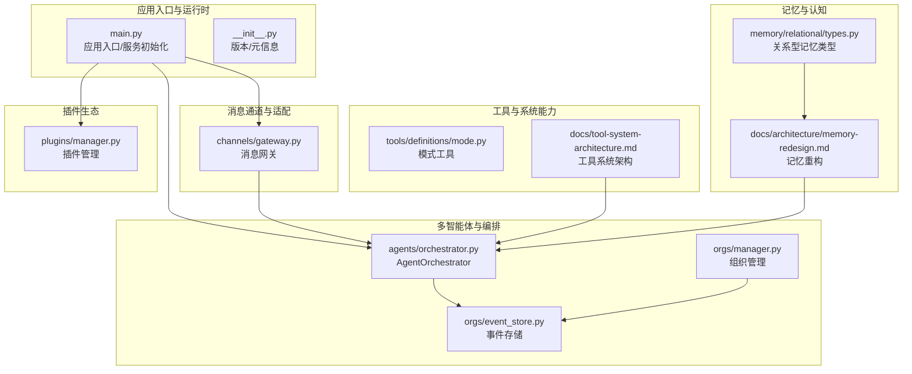
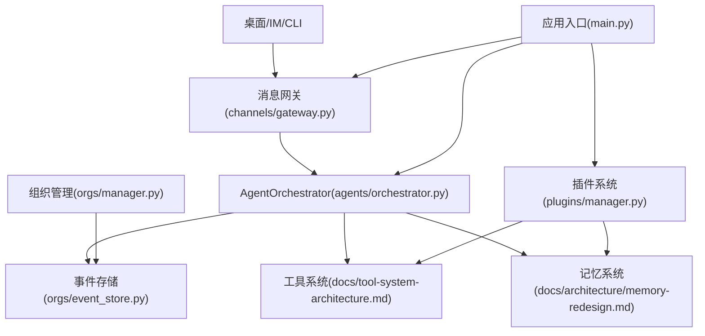
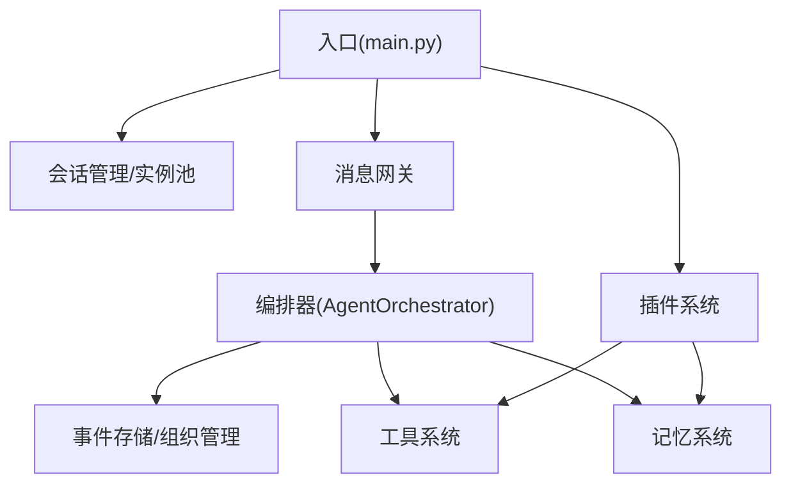
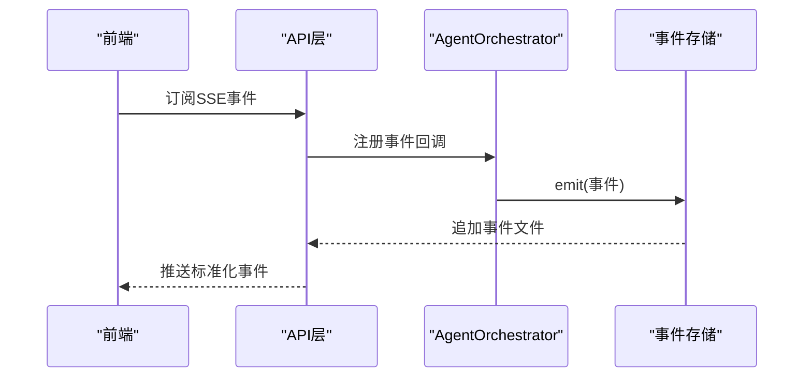
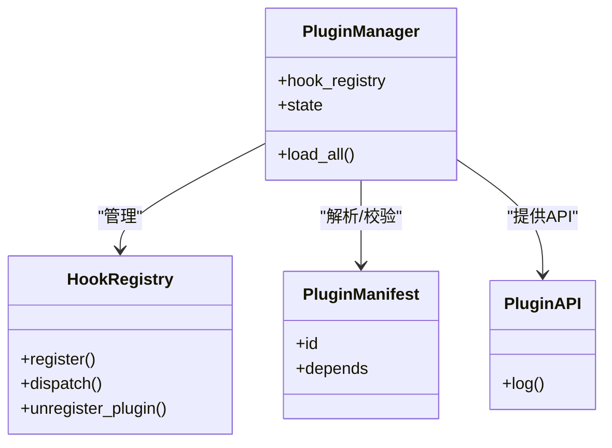
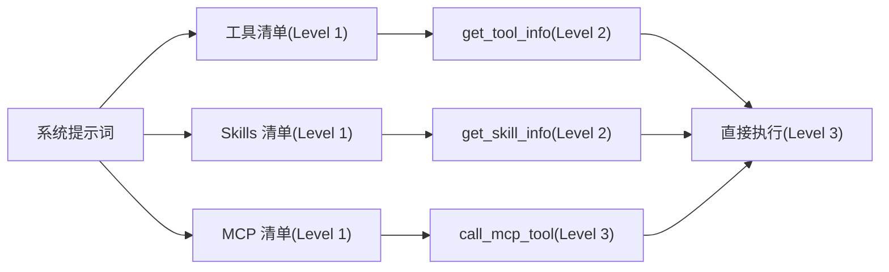
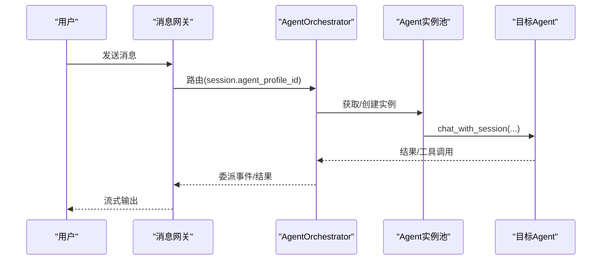
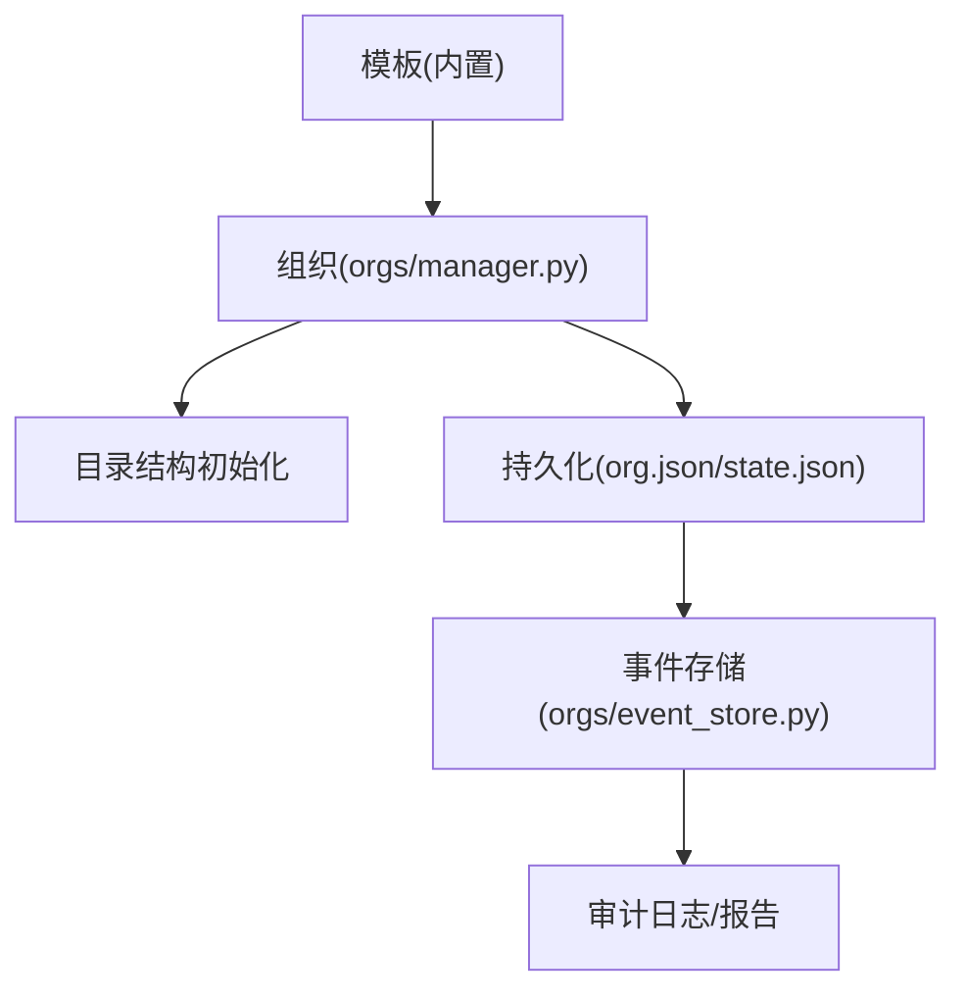
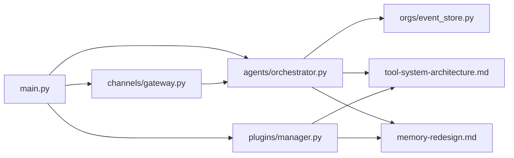

# 架构模式

<cite>
**本文引用的文件**
- [src/synapse/__init__.py](file://src/synapse/__init__.py)
- [src/synapse/main.py](file://src/synapse/main.py)
- [src/synapse/events.py](file://src/synapse/events.py)
- [src/synapse/agents/orchestrator.py](file://src/synapse/agents/orchestrator.py)
- [src/synapse/plugins/manager.py](file://src/synapse/plugins/manager.py)
- [src/synapse/orgs/manager.py](file://src/synapse/orgs/manager.py)
- [src/synapse/orgs/event_store.py](file://src/synapse/orgs/event_store.py)
- [src/synapse/channels/gateway.py](file://src/synapse/channels/gateway.py)
- [docs/multi-agent-architecture.md](file://docs/multi-agent-architecture.md)
- [docs/architecture/memory-redesign.md](file://docs/architecture/memory-redesign.md)
- [docs/tool-system-architecture.md](file://docs/tool-system-architecture.md)
- [docs/plans/2026-03-26-rd-center-synapse-term-migration.md](file://docs/plans/2026-03-26-rd-center-synapse-term-migration.md)
- [src/synapse/memory/relational/types.py](file://src/synapse/memory/relational/types.py)
- [src/synapse/tools/definitions/mode.py](file://src/synapse/tools/definitions/mode.py)
- [tests/e2e/report-ai-fulltest-20260402-v3.md](file://tests/e2e/report-ai-fulltest-20260402-v3.md)
- [tests/e2e/report-scheduler-feature-test-20260403.md](file://tests/e2e/report-scheduler-feature-test-20260403.md)
</cite>

## 目录
1. [简介](#简介)
2. [项目结构](#项目结构)
3. [核心组件](#核心组件)
4. [架构总览](#架构总览)
5. [详细组件分析](#详细组件分析)
6. [依赖分析](#依赖分析)
7. [性能考虑](#性能考虑)
8. [故障排查指南](#故障排查指南)
9. [结论](#结论)
10. [附录](#附录)

## 简介
本文件系统化阐述 Synapse 的架构模式与实现，聚焦四大设计主线：分层架构、事件驱动架构、插件化架构与模块化设计。文档同时覆盖多智能体协作中的协调模式、组织编排中的角色分配模式、插件系统中的扩展模式，并结合实际代码路径与测试报告进行技术权衡与演进分析，帮助不同经验层次的读者快速理解与落地。

## 项目结构
Synapse 采用“核心引擎 + 通道适配 + 组织编排 + 记忆系统 + 工具系统 + 插件生态”的分层组织方式，核心入口与运行时控制集中在主模块，消息通道与适配器负责多端接入，组织与事件系统支撑编排与审计，记忆系统提供认知增强，工具系统统一披露与执行，插件系统提供扩展能力。

图表来源
- [src/synapse/main.py:1-200](file://src/synapse/main.py#L1-L200)
- [src/synapse/channels/gateway.py:1-200](file://src/synapse/channels/gateway.py#L1-L200)
- [src/synapse/agents/orchestrator.py:1-200](file://src/synapse/agents/orchestrator.py#L1-L200)
- [src/synapse/orgs/manager.py:1-200](file://src/synapse/orgs/manager.py#L1-L200)
- [src/synapse/orgs/event_store.py:1-200](file://src/synapse/orgs/event_store.py#L1-L200)
- [src/synapse/plugins/manager.py:1-200](file://src/synapse/plugins/manager.py#L1-L200)
- [src/synapse/tools/definitions/mode.py:1-32](file://src/synapse/tools/definitions/mode.py#L1-L32)
- [docs/tool-system-architecture.md:1-313](file://docs/tool-system-architecture.md#L1-L313)
- [docs/architecture/memory-redesign.md:1-220](file://docs/architecture/memory-redesign.md#L1-L220)
- [src/synapse/memory/relational/types.py:1-56](file://src/synapse/memory/relational/types.py#L1-L56)

章节来源
- [src/synapse/main.py:1-200](file://src/synapse/main.py#L1-L200)
- [src/synapse/__init__.py:1-80](file://src/synapse/__init__.py#L1-L80)

## 核心组件
- 应用入口与运行时：负责日志、追踪、组件初始化、IM 通道依赖安装与消息网关启动。
- 消息网关：统一消息路由、会话集成、媒体预处理、命令拦截与中断机制。
- 多智能体编排：AgentOrchestrator 负责消息路由、委派管理、健康监控与事件通知。
- 组织编排与事件：组织管理器负责持久化与模板，事件存储提供审计与报告。
- 工具系统：统一的三级披露（清单/定义/执行），支持系统工具、Skills 与 MCP。
- 记忆系统：三层记忆模型（语义/情节/工作记忆草稿本），多后端检索与生命周期管理。
- 插件系统：插件发现、拓扑排序、兼容性校验、钩子注册与错误隔离。

章节来源
- [src/synapse/main.py:641-661](file://src/synapse/main.py#L641-L661)
- [src/synapse/channels/gateway.py:1-200](file://src/synapse/channels/gateway.py#L1-L200)
- [src/synapse/agents/orchestrator.py:194-200](file://src/synapse/agents/orchestrator.py#L194-L200)
- [src/synapse/orgs/manager.py:29-40](file://src/synapse/orgs/manager.py#L29-L40)
- [src/synapse/orgs/event_store.py:21-68](file://src/synapse/orgs/event_store.py#L21-L68)
- [docs/tool-system-architecture.md:1-313](file://docs/tool-system-architecture.md#L1-L313)
- [docs/architecture/memory-redesign.md:133-220](file://docs/architecture/memory-redesign.md#L133-L220)
- [src/synapse/plugins/manager.py:44-52](file://src/synapse/plugins/manager.py#L44-L52)

## 架构总览
Synapse 采用“入口/运行时”“消息通道”“编排/组织”“工具/记忆/插件”分层，配合事件驱动与插件化扩展，形成可演进、可治理、可观测的智能体基础设施。

图表来源
- [src/synapse/main.py:641-661](file://src/synapse/main.py#L641-L661)
- [src/synapse/channels/gateway.py:1-200](file://src/synapse/channels/gateway.py#L1-L200)
- [src/synapse/agents/orchestrator.py:194-200](file://src/synapse/agents/orchestrator.py#L194-L200)
- [src/synapse/orgs/event_store.py:21-68](file://src/synapse/orgs/event_store.py#L21-L68)
- [src/synapse/orgs/manager.py:29-40](file://src/synapse/orgs/manager.py#L29-L40)
- [docs/tool-system-architecture.md:1-313](file://docs/tool-system-architecture.md#L1-L313)
- [docs/architecture/memory-redesign.md:133-220](file://docs/architecture/memory-redesign.md#L133-L220)
- [src/synapse/plugins/manager.py:44-52](file://src/synapse/plugins/manager.py#L44-L52)

## 详细组件分析

### 分层架构：入口/运行时、通道、编排、工具/记忆/插件
- 入口与运行时：集中初始化日志、追踪、会话管理、桌面实例池、多智能体编排器与消息网关，幂等安全，支持热重载与依赖自动安装。
- 通道层：消息网关统一路由、命令拦截、媒体处理、中断机制，支持多 Bot 实例与会话隔离。
- 编排层：AgentOrchestrator 负责路由、委派、健康度量、SSE 事件与超时/失败处理。
- 工具/记忆/插件：工具系统统一披露与执行；记忆系统三层模型与多后端检索；插件系统拓扑加载与错误隔离。

图表来源
- [src/synapse/main.py:641-661](file://src/synapse/main.py#L641-L661)
- [src/synapse/channels/gateway.py:1-200](file://src/synapse/channels/gateway.py#L1-L200)
- [src/synapse/agents/orchestrator.py:194-200](file://src/synapse/agents/orchestrator.py#L194-L200)
- [docs/tool-system-architecture.md:1-313](file://docs/tool-system-architecture.md#L1-L313)
- [docs/architecture/memory-redesign.md:133-220](file://docs/architecture/memory-redesign.md#L133-L220)
- [src/synapse/plugins/manager.py:44-52](file://src/synapse/plugins/manager.py#L44-L52)

章节来源
- [src/synapse/main.py:641-661](file://src/synapse/main.py#L641-L661)
- [src/synapse/channels/gateway.py:1-200](file://src/synapse/channels/gateway.py#L1-L200)
- [src/synapse/agents/orchestrator.py:194-200](file://src/synapse/agents/orchestrator.py#L194-L200)

### 事件驱动架构：事件流、协议标准化与前端同步
- 事件协议：统一的流事件类型与标准化转换，确保前后端一致性。
- 事件存储：按日事件文件、查询过滤、审计日志与报告生成，支持状态重建与合规审计。
- 事件溯源：组织事件流记录状态变更，支持任务链与节点状态恢复。

图表来源
- [src/synapse/events.py:16-119](file://src/synapse/events.py#L16-L119)
- [src/synapse/orgs/event_store.py:42-68](file://src/synapse/orgs/event_store.py#L42-L68)
- [src/synapse/agents/orchestrator.py:194-200](file://src/synapse/agents/orchestrator.py#L194-L200)

章节来源
- [src/synapse/events.py:16-119](file://src/synapse/events.py#L16-L119)
- [src/synapse/orgs/event_store.py:21-124](file://src/synapse/orgs/event_store.py#L21-L124)

### 插件化架构：发现、加载、钩子与错误隔离
- 发现与排序：按依赖拓扑排序，环依赖检测与排除。
- 兼容性与状态：版本/SDK/API 兼容性检查，插件状态持久化与自动禁用。
- 钩子注册：统一钩子注册与分发，异常隔离与超时控制。
- MCP 插件：MCP 服务器配置注入到工具系统。

图表来源
- [src/synapse/plugins/manager.py:44-200](file://src/synapse/plugins/manager.py#L44-L200)

章节来源
- [src/synapse/plugins/manager.py:44-200](file://src/synapse/plugins/manager.py#L44-L200)

### 模块化设计：工具系统统一披露与执行
- 三级披露：清单（简述）、定义（详参）、执行（直接调用）。
- 规范遵循：Skills 遵循 Agent Skills 规范，MCP 遵循 MCP 规范。
- 执行流程：工具/技能/MCP 分类执行，统一入口与参数归一。

图表来源
- [docs/tool-system-architecture.md:196-237](file://docs/tool-system-architecture.md#L196-L237)
- [docs/tool-system-architecture.md:279-298](file://docs/tool-system-architecture.md#L279-L298)

章节来源
- [docs/tool-system-architecture.md:1-313](file://docs/tool-system-architecture.md#L1-L313)

### 多智能体协作：协调模式与委派链路
- 协调器：基于会话选择 Agent，委派深度限制，超时/失败自动降级，健康度量与 SSE 通知。
- 委派链路：支持链式委派与动态 Agent 创建，安全上限与生命周期约束。
- 模式切换：通过工具化模式切换，引导合适的协作模式。

图表来源
- [docs/multi-agent-architecture.md:89-101](file://docs/multi-agent-architecture.md#L89-L101)
- [src/synapse/agents/orchestrator.py:194-200](file://src/synapse/agents/orchestrator.py#L194-L200)

章节来源
- [docs/multi-agent-architecture.md:1-303](file://docs/multi-agent-architecture.md#L1-L303)
- [src/synapse/agents/orchestrator.py:194-200](file://src/synapse/agents/orchestrator.py#L194-L200)

### 组织编排：角色分配与事件驱动
- 组织管理：CRUD、模板、持久化目录结构与缓存。
- 事件存储：按日事件文件、查询过滤、审计日志与报告生成。
- 模板与角色：内置模板定义角色、目标、背景与工具集，支持层级关系与协作。

图表来源
- [src/synapse/orgs/manager.py:29-40](file://src/synapse/orgs/manager.py#L29-L40)
- [src/synapse/orgs/event_store.py:21-68](file://src/synapse/orgs/event_store.py#L21-L68)

章节来源
- [src/synapse/orgs/manager.py:29-200](file://src/synapse/orgs/manager.py#L29-L200)
- [src/synapse/orgs/event_store.py:21-200](file://src/synapse/orgs/event_store.py#L21-L200)

### 记忆系统：三层模型与多后端检索
- 三层记忆：语义记忆（实体-属性结构）、情节记忆（完整交互故事）、工作记忆草稿本（跨会话思维空间）。
- 检索与生命周期：多路召回 + 重排序、去重合并、衰减与归档、批量整合与更新。
- 存储与后端：SQLite 主存储 + FTS5 默认全文检索，可选 ChromaDB/API Embedding 后端。

图表来源
- [docs/architecture/memory-redesign.md:564-646](file://docs/architecture/memory-redesign.md#L564-L646)
- [docs/architecture/memory-redesign.md:648-700](file://docs/architecture/memory-redesign.md#L648-L700)
- [docs/architecture/memory-redesign.md:759-800](file://docs/architecture/memory-redesign.md#L759-L800)

章节来源
- [docs/architecture/memory-redesign.md:1-800](file://docs/architecture/memory-redesign.md#L1-L800)
- [src/synapse/memory/relational/types.py:11-50](file://src/synapse/memory/relational/types.py#L11-L50)

### 桌面研发中心（SynapseTerm）迁移：模块化与打包
- 合并目标：在 Setup Center 增加“研发中心”，按工单组织 TAB，合并终端与相关资源。
- 平台范围：首版仅 Windows；默认工作区路径按工单隔离。
- 资源与打包：迁移二进制与脚本到统一资源目录，接入现有打包与构建流程。

章节来源
- [docs/plans/2026-03-26-rd-center-synapse-term-migration.md:1-262](file://docs/plans/2026-03-26-rd-center-synapse-term-migration.md#L1-L262)

## 依赖分析
- 组件耦合：消息网关与编排器强耦合（路由与委派），事件存储与组织管理弱耦合（通过事件流）。
- 外部依赖：IM 通道依赖自动安装与隔离，MCP 服务器通过插件注入，工具系统与记忆系统通过插件扩展。
- 循环依赖：插件系统通过拓扑排序与环检测避免加载期循环依赖。

图表来源
- [src/synapse/main.py:641-661](file://src/synapse/main.py#L641-L661)
- [src/synapse/channels/gateway.py:1-200](file://src/synapse/channels/gateway.py#L1-L200)
- [src/synapse/agents/orchestrator.py:194-200](file://src/synapse/agents/orchestrator.py#L194-L200)
- [src/synapse/orgs/event_store.py:21-68](file://src/synapse/orgs/event_store.py#L21-L68)
- [docs/tool-system-architecture.md:1-313](file://docs/tool-system-architecture.md#L1-L313)
- [docs/architecture/memory-redesign.md:133-220](file://docs/architecture/memory-redesign.md#L133-L220)
- [src/synapse/plugins/manager.py:44-52](file://src/synapse/plugins/manager.py#L44-L52)

章节来源
- [src/synapse/plugins/manager.py:132-163](file://src/synapse/plugins/manager.py#L132-L163)

## 性能考虑
- 通信与并发：多智能体使用进程内 asyncio.Queue 通信，降低跨进程开销；实例池空闲回收与后台清理降低资源占用。
- 检索与存储：记忆系统默认 FTS5 全文检索零依赖，可选 ChromaDB/API 后端；批量整合与去重算法优化（O(n log n)）。
- 事件与日志：事件按日文件存储，限制文件大小与保留策略；日志分级与追踪导出按需开启。
- 工具与模式：工具三级披露减少初始 token 消耗；模式切换工具引导合适模式，避免无效执行。

## 故障排查指南
- 委派死循环：系统检测到委派循环时会阻止并提示，根因通常来自系统提示词强制工具调用与 supervisor 的交互策略冲突。
- 依赖安装失败：IM 通道依赖自动安装失败时，检查镜像源与 Python 运行时探测，必要时使用“一键修复”。
- 事件与审计：事件文件读写失败不影响主流程，审计日志与报告生成可单独排查。
- 插件错误：插件加载失败不会阻塞宿主，错误累积触发自动禁用，检查插件兼容性与钩子实现。

章节来源
- [tests/e2e/report-ai-fulltest-20260402-v3.md:114-135](file://tests/e2e/report-ai-fulltest-20260402-v3.md#L114-L135)
- [src/synapse/main.py:214-522](file://src/synapse/main.py#L214-L522)
- [src/synapse/orgs/event_store.py:62-68](file://src/synapse/orgs/event_store.py#L62-L68)
- [src/synapse/plugins/manager.py:44-52](file://src/synapse/plugins/manager.py#L44-L52)

## 结论
Synapse 通过分层架构、事件驱动、插件化与模块化设计，构建了可扩展、可观测、可治理的智能体基础设施。多智能体协作与组织编排在事件驱动与工具系统支撑下实现高效协同；记忆系统提供认知增强；插件系统保障生态扩展。未来可在模式切换策略、事件溯源与审计、工具与记忆的深度融合等方面持续演进。

## 附录
- 架构演进：从旧的 ZMQ Master-Worker 架构迁移到基于 asyncio 的轻量编排器；记忆系统从碎片化 facts 向三层模型演进。
- 未来方向：强化事件驱动的可观测性与治理能力，深化工具与记忆的联合推理，完善插件生态与 MCP 生态的互通。

章节来源
- [docs/multi-agent-architecture.md:276-284](file://docs/multi-agent-architecture.md#L276-L284)
- [docs/architecture/memory-redesign.md:1-220](file://docs/architecture/memory-redesign.md#L1-L220)
- [tests/e2e/report-scheduler-feature-test-20260403.md:39-71](file://tests/e2e/report-scheduler-feature-test-20260403.md#L39-L71)