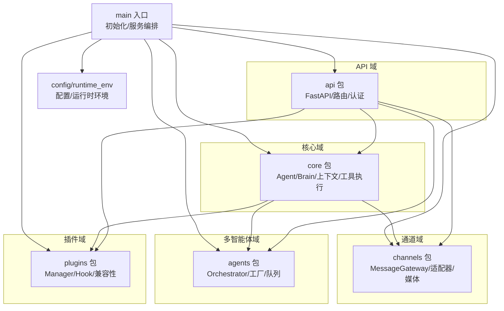
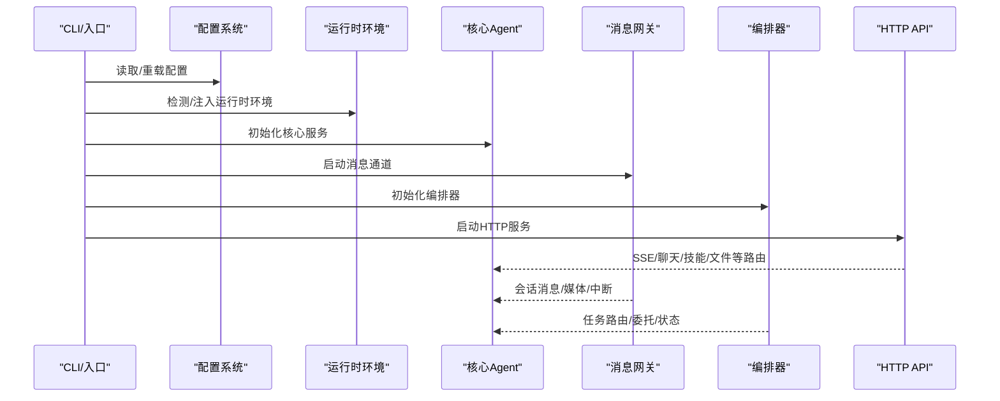
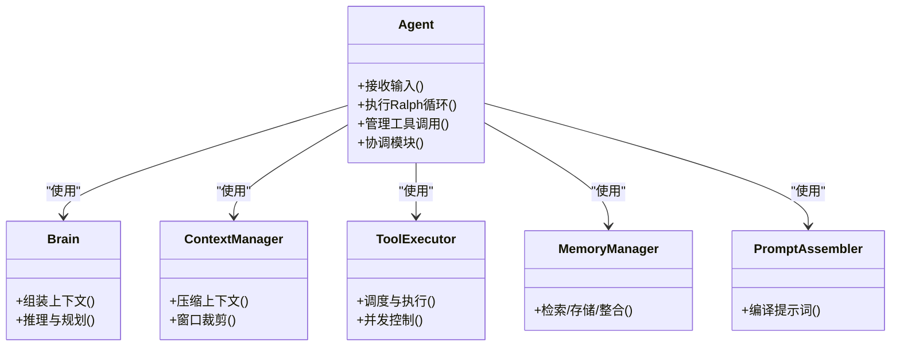
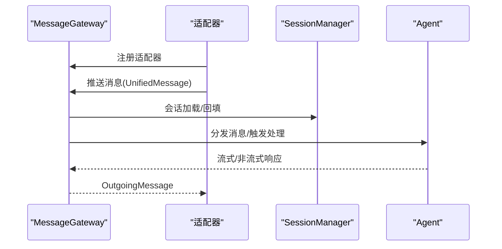
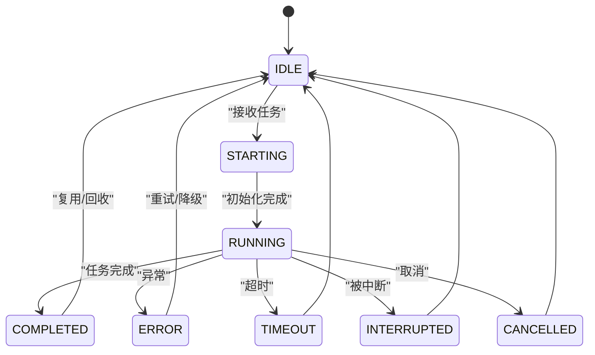
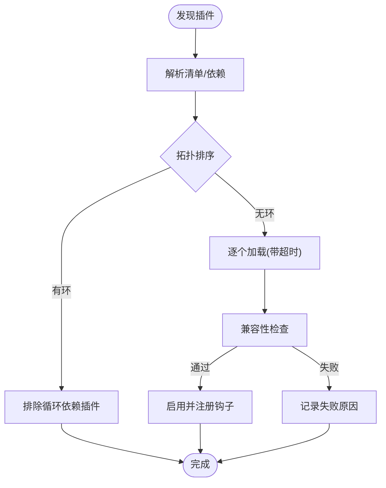
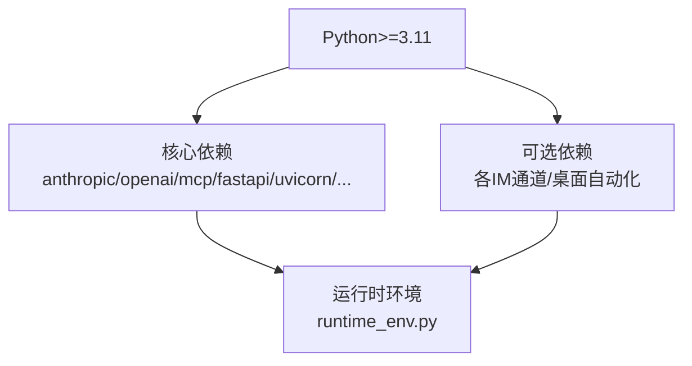

# 模块化设计

<cite>
**本文档引用的文件**
- [src/synapse/__init__.py](file://src/synapse/__init__.py)
- [src/synapse/main.py](file://src/synapse/main.py)
- [src/synapse/config.py](file://src/synapse/config.py)
- [src/synapse/runtime_env.py](file://src/synapse/runtime_env.py)
- [src/synapse/core/__init__.py](file://src/synapse/core/__init__.py)
- [src/synapse/core/agent.py](file://src/synapse/core/agent.py)
- [src/synapse/channels/__init__.py](file://src/synapse/channels/__init__.py)
- [src/synapse/channels/gateway.py](file://src/synapse/channels/gateway.py)
- [src/synapse/agents/__init__.py](file://src/synapse/agents/__init__.py)
- [src/synapse/agents/orchestrator.py](file://src/synapse/agents/orchestrator.py)
- [src/synapse/plugins/__init__.py](file://src/synapse/plugins/__init__.py)
- [src/synapse/plugins/manager.py](file://src/synapse/plugins/manager.py)
- [src/synapse/api/__init__.py](file://src/synapse/api/__init__.py)
- [src/synapse/api/server.py](file://src/synapse/api/server.py)
- [pyproject.toml](file://pyproject.toml)
</cite>

## 目录
1. [引言](#引言)
2. [项目结构](#项目结构)
3. [核心组件](#核心组件)
4. [架构总览](#架构总览)
5. [详细组件分析](#详细组件分析)
6. [依赖分析](#依赖分析)
7. [性能考量](#性能考量)
8. [故障排查指南](#故障排查指南)
9. [结论](#结论)
10. [附录](#附录)

## 引言
本文件围绕 Synapse 的模块化设计展开，系统阐述模块化理念、边界划分、接口定义、依赖管理、模块间通信与数据传递、状态同步，并结合具体代码路径给出可复用的设计模式与最佳实践。文档同时讨论模块化带来的可读性、可测试性与可维护性的提升，以及循环依赖、版本兼容与性能影响等挑战，并提供指导原则与重构策略，面向不同经验水平的读者提供分层次的理解路径。

## 项目结构
Synapse 采用“包内分层 + 功能域划分”的模块化组织方式：
- 核心域：core（Agent、Brain、上下文、工具执行、记忆、提示词组装等）
- 通道域：channels（消息网关、适配器、媒体处理、群响应策略等）
- 多智能体域：agents（编排器、工厂、任务队列、锁管理等）
- 插件域：plugins（插件系统、钩子、兼容性、沙箱等）
- API 域：api（FastAPI 服务、路由、认证、静态资源挂载等）
- 配置与运行时：config、runtime_env、__init__（版本解析、运行时环境、懒加载）

图表来源
- [src/synapse/main.py](file://src/synapse/main.py)
- [src/synapse/config.py](file://src/synapse/config.py)
- [src/synapse/runtime_env.py](file://src/synapse/runtime_env.py)
- [src/synapse/core/agent.py](file://src/synapse/core/agent.py)
- [src/synapse/channels/gateway.py](file://src/synapse/channels/gateway.py)
- [src/synapse/agents/orchestrator.py](file://src/synapse/agents/orchestrator.py)
- [src/synapse/plugins/manager.py](file://src/synapse/plugins/manager.py)
- [src/synapse/api/server.py](file://src/synapse/api/server.py)

章节来源
- [src/synapse/main.py](file://src/synapse/main.py)
- [src/synapse/config.py](file://src/synapse/config.py)
- [src/synapse/runtime_env.py](file://src/synapse/runtime_env.py)

## 核心组件
- 版本与元信息：通过模块入口解析版本与 Git 哈希，提供统一的版本字符串接口，便于构建与发布追踪。
- 配置系统：集中式 Settings 模型，支持 .env 加载、校验、运行时重载与持久化键集合，保障配置一致性与可观测性。
- 运行时环境：统一 PyInstaller 打包与常规环境差异，提供 Python 可执行文件发现、pip 安装、模块路径注入、SSL 证书修正等能力。
- 核心 Agent：协调记忆、技能、工具、提示词、上下文压缩、Ralph 循环等，是模块间数据与控制流的中枢。
- 消息网关：统一消息入口/出口、会话集成、媒体预处理、中断机制、系统命令拦截，支撑多通道接入。
- 多智能体编排：AgentOrchestrator 负责任务路由、委托、健康度与状态机管理，支持多 Agent 模式。
- 插件系统：PluginManager 负责插件发现、拓扑排序、兼容性检查、生命周期管理与错误隔离。
- HTTP API：FastAPI 服务，集成路由、认证、CORS、静态资源挂载与健康检查。

章节来源
- [src/synapse/__init__.py](file://src/synapse/__init__.py)
- [src/synapse/config.py](file://src/synapse/config.py)
- [src/synapse/runtime_env.py](file://src/synapse/runtime_env.py)
- [src/synapse/core/agent.py](file://src/synapse/core/agent.py)
- [src/synapse/channels/gateway.py](file://src/synapse/channels/gateway.py)
- [src/synapse/agents/orchestrator.py](file://src/synapse/agents/orchestrator.py)
- [src/synapse/plugins/manager.py](file://src/synapse/plugins/manager.py)
- [src/synapse/api/server.py](file://src/synapse/api/server.py)

## 架构总览
Synapse 的模块化架构强调“弱耦合、高内聚、可替换、可观测”。模块边界通过清晰的职责划分与接口契约实现，依赖通过延迟导入、懒加载与运行时注入降低启动成本与循环依赖风险。模块间通信主要通过：
- 事件/钩子：插件系统的 HookRegistry 提供扩展点
- 会话与上下文：SessionManager 与 ContextManager 统一状态与数据
- 网关与适配器：MessageGateway 作为通道适配器的统一入口
- 编排与任务：AgentOrchestrator 作为多 Agent 的协调中枢

图表来源
- [src/synapse/main.py](file://src/synapse/main.py)
- [src/synapse/config.py](file://src/synapse/config.py)
- [src/synapse/runtime_env.py](file://src/synapse/runtime_env.py)
- [src/synapse/core/agent.py](file://src/synapse/core/agent.py)
- [src/synapse/channels/gateway.py](file://src/synapse/channels/gateway.py)
- [src/synapse/agents/orchestrator.py](file://src/synapse/agents/orchestrator.py)
- [src/synapse/api/server.py](file://src/synapse/api/server.py)

## 详细组件分析

### 核心模块（core）
- 设计要点
  - 懒加载与延迟导入：通过 core/__init__.py 的延迟导入机制避免全栈加载，降低启动时依赖链长度。
  - 统一上下文与状态：Agent、AgentState、ContextManager、TokenTracking 等共同构成上下文与状态管理基础。
  - 工具执行管线：SystemHandlerRegistry 与各类工具处理器形成可扩展的工具执行框架。
  - 记忆与提示词：MemoryManager、PromptAssembler、SkillManager 等模块协同实现知识与意图处理。
- 代码示例路径
  - [核心 Agent 类](file://src/synapse/core/agent.py)
  - [核心包导出与懒加载](file://src/synapse/core/__init__.py)

图表来源
- [src/synapse/core/agent.py](file://src/synapse/core/agent.py)
- [src/synapse/core/__init__.py](file://src/synapse/core/__init__.py)

章节来源
- [src/synapse/core/agent.py](file://src/synapse/core/agent.py)
- [src/synapse/core/__init__.py](file://src/synapse/core/__init__.py)

### 通道模块（channels）
- 设计要点
  - 统一消息类型与网关：MessageGateway 聚合并路由来自不同适配器的消息，集成会话管理与媒体处理。
  - 适配器注册与热重载：通过集中式注册表与动态注册/注销能力，支持运行时热插拔。
  - 中断与系统命令：支持在工具调用间隙插入新消息，拦截系统级命令（如模型切换）。
- 代码示例路径
  - [通道包导出](file://src/synapse/channels/__init__.py)
  - [消息网关](file://src/synapse/channels/gateway.py)

图表来源
- [src/synapse/channels/gateway.py](file://src/synapse/channels/gateway.py)
- [src/synapse/channels/__init__.py](file://src/synapse/channels/__init__.py)

章节来源
- [src/synapse/channels/__init__.py](file://src/synapse/channels/__init__.py)
- [src/synapse/channels/gateway.py](file://src/synapse/channels/gateway.py)

### 多智能体编排（agents）
- 设计要点
  - 状态机与生命周期：SubAgentStatus 定义标准状态，约束流转，便于可观测与治理。
  - 邮箱与队列：AgentMailbox 提供异步消息队列，TaskQueue 支持优先级与深度限制。
  - 委托与健康：DelegationRequest/Result 结构化委托结果，AgentHealth 提供健康指标。
- 代码示例路径
  - [编排器](file://src/synapse/agents/orchestrator.py)
  - [编排器包导出](file://src/synapse/agents/__init__.py)

图表来源
- [src/synapse/agents/orchestrator.py](file://src/synapse/agents/orchestrator.py)

章节来源
- [src/synapse/agents/orchestrator.py](file://src/synapse/agents/orchestrator.py)
- [src/synapse/agents/__init__.py](file://src/synapse/agents/__init__.py)

### 插件系统（plugins）
- 设计要点
  - 生命周期与错误隔离：PluginManager 独立加载、超时控制、错误聚合与自动禁用，保证宿主系统稳健启动。
  - 拓扑排序与循环依赖检测：基于 Kahn 算法进行依赖排序，检测并排除循环依赖。
  - 兼容性检查：版本、API、Python 与 SDK 兼容性校验。
- 代码示例路径
  - [插件包导出](file://src/synapse/plugins/__init__.py)
  - [插件管理器](file://src/synapse/plugins/manager.py)

图表来源
- [src/synapse/plugins/manager.py](file://src/synapse/plugins/manager.py)
- [src/synapse/plugins/__init__.py](file://src/synapse/plugins/__init__.py)

章节来源
- [src/synapse/plugins/__init__.py](file://src/synapse/plugins/__init__.py)
- [src/synapse/plugins/manager.py](file://src/synapse/plugins/manager.py)

### HTTP API（api）
- 设计要点
  - 路由组织：按功能域拆分路由模块，统一挂载到 FastAPI 应用。
  - 认证与中间件：WebAccessConfig 与认证中间件，CORS 支持，访问日志。
  - 静态资源：Web 前端与用户文档的打包与挂载，版本化部署。
- 代码示例路径
  - [API 包导出](file://src/synapse/api/__init__.py)
  - [API 服务器](file://src/synapse/api/server.py)

章节来源
- [src/synapse/api/__init__.py](file://src/synapse/api/__init__.py)
- [src/synapse/api/server.py](file://src/synapse/api/server.py)

## 依赖分析
- 语言与版本
  - Python >= 3.11，通过 pyproject.toml 指定
- 核心依赖
  - LLM 与协议：anthropic、openai、mcp
  - Web 与 CLI：fastapi、uvicorn、typer、rich、prompt-toolkit
  - 异步与网络：httpx、aiofiles、nest-asyncio
  - 数据库与配置：aiosqlite、pydantic、pydantic-settings、pyyaml
  - 工具与浏览器：playwright、Pillow
- 可选依赖（通道与平台）
  - 飞书：lark-oapi、qrcode
  - 钉钉：dingtalk-stream
  - 企业微信：aiohttp、pycryptodome、websockets、cryptography
  - OneBot：websockets
  - QQ：websockets、aiohttp、pilk
  - 微信：pycryptodome
  - Windows 自动化：mss、pyautogui、pywinauto、pyperclip、psutil
- 依赖管理策略
  - 通过 optional-dependencies 与 extras 控制通道依赖按需安装
  - 运行时环境检测与模块路径注入，避免外部环境污染

图表来源
- [pyproject.toml](file://pyproject.toml)
- [src/synapse/runtime_env.py](file://src/synapse/runtime_env.py)

章节来源
- [pyproject.toml](file://pyproject.toml)
- [src/synapse/runtime_env.py](file://src/synapse/runtime_env.py)

## 性能考量
- 启动与加载
  - 懒加载与延迟导入显著降低冷启动时的模块加载压力，核心模块按需引入。
  - 运行时环境注入与模块路径追加避免重复扫描，减少 IO 开销。
- 并发与吞吐
  - 工具并行执行与中断检查粒度可控，平衡吞吐与一致性。
  - 多 Agent 编排采用异步队列与状态机，避免阻塞与资源争用。
- 上下文与内存
  - 上下文压缩与边界压缩策略，结合阈值与比例参数，控制内存占用与计算成本。
  - 记忆检索后端可选（FTS5/Chroma/API），按场景权衡性能与准确性。
- I/O 与网络
  - 通道依赖镜像源回退与离线 wheels 优先策略，提升安装与依赖可用性。
  - API 层 CORS、静态资源与 MIME 类型优化，改善前端体验。

## 故障排查指南
- 配置与环境
  - 使用 Settings.reload() 重新加载 .env，关注返回的变更字段列表，定位配置漂移。
  - 运行时环境异常：检查 Python 可执行文件发现、SSL 证书修正与模块路径注入日志。
- 通道与依赖
  - IM 通道依赖自动安装失败：查看镜像源回退日志与逐个安装策略，确认网络与权限。
  - 适配器注册/注销失败：检查运行时状态与热重载流程，确认网关状态。
- 插件系统
  - 插件加载超时/循环依赖：查看拓扑排序与循环依赖排除日志，定位依赖图问题。
  - 兼容性失败：核对版本、API、Python 与 SDK 要求，按警告/错误提示修复。
- API 与前端
  - 端口占用与静态资源：确认端口可用性、静态文件挂载路径与 MIME 类型修正。

章节来源
- [src/synapse/config.py](file://src/synapse/config.py)
- [src/synapse/runtime_env.py](file://src/synapse/runtime_env.py)
- [src/synapse/main.py](file://src/synapse/main.py)
- [src/synapse/plugins/manager.py](file://src/synapse/plugins/manager.py)
- [src/synapse/api/server.py](file://src/synapse/api/server.py)

## 结论
Synapse 的模块化设计通过清晰的职责边界、稳定的接口契约、灵活的运行时注入与可观测的生命周期管理，实现了高内聚、低耦合与强扩展性。核心模块围绕 Agent 协调，通道模块统一消息与媒体，编排模块管理多 Agent，插件系统提供生态扩展，API 模块承载对外服务。在实践中，建议坚持“按需加载、延迟导入、运行时注入”的原则，配合严格的版本与兼容性检查，持续优化上下文压缩与工具并行策略，以获得更好的性能与稳定性。

## 附录
- 指导原则
  - 单一职责：每个模块聚焦一个核心领域
  - 明确边界：通过类型与协议约束接口
  - 可替换性：依赖抽象而非具体实现
  - 可观测性：日志、追踪与健康指标
  - 可测试性：依赖注入与钩子，便于单元与集成测试
- 重构策略
  - 识别循环依赖：使用依赖图与拓扑排序，拆分或引入适配器
  - 引入钩子与事件：替代紧耦合调用，增强扩展点
  - 抽象公共协议：统一数据结构与错误类型
  - 渐进式迁移：通过兼容层与双轨并行，降低风险