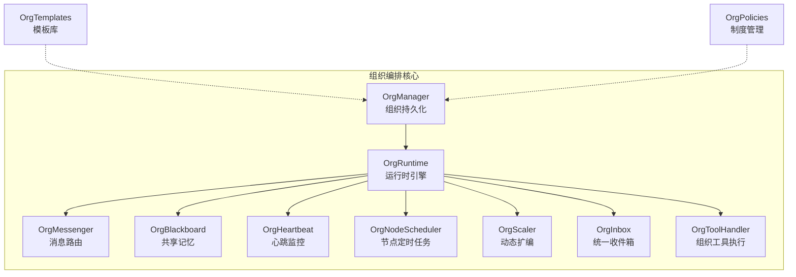
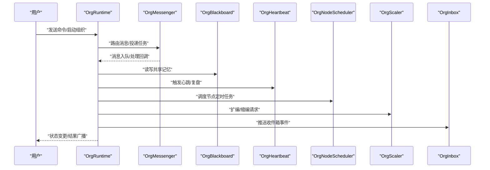
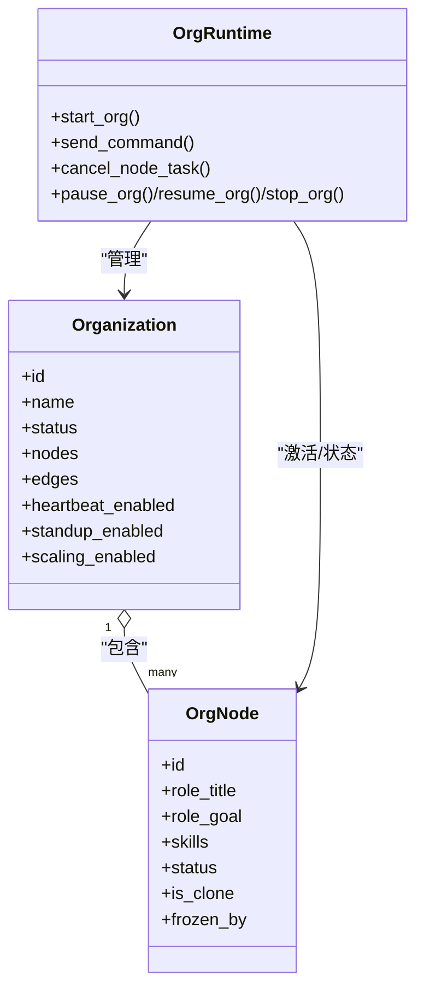
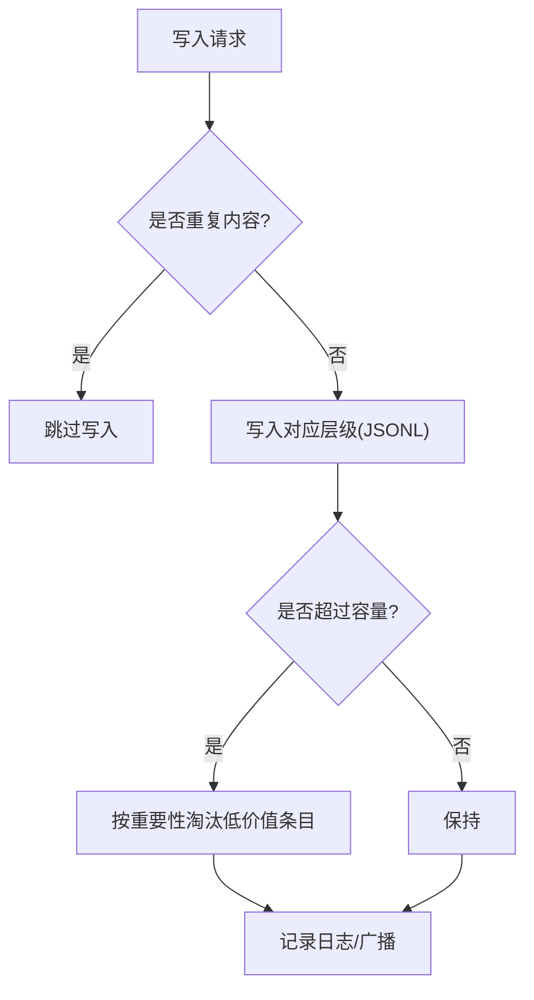
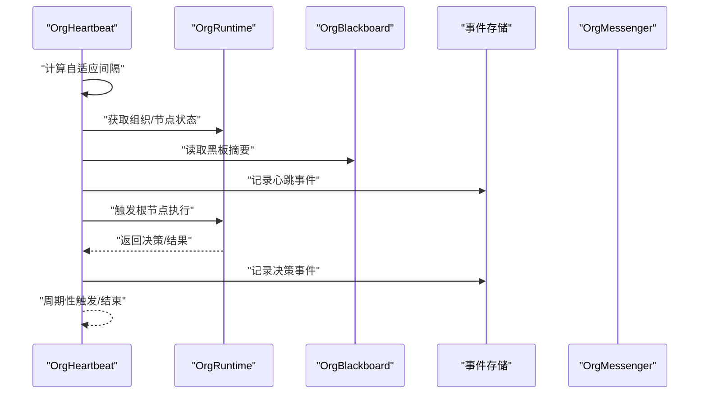
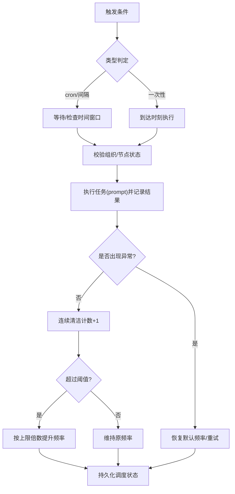
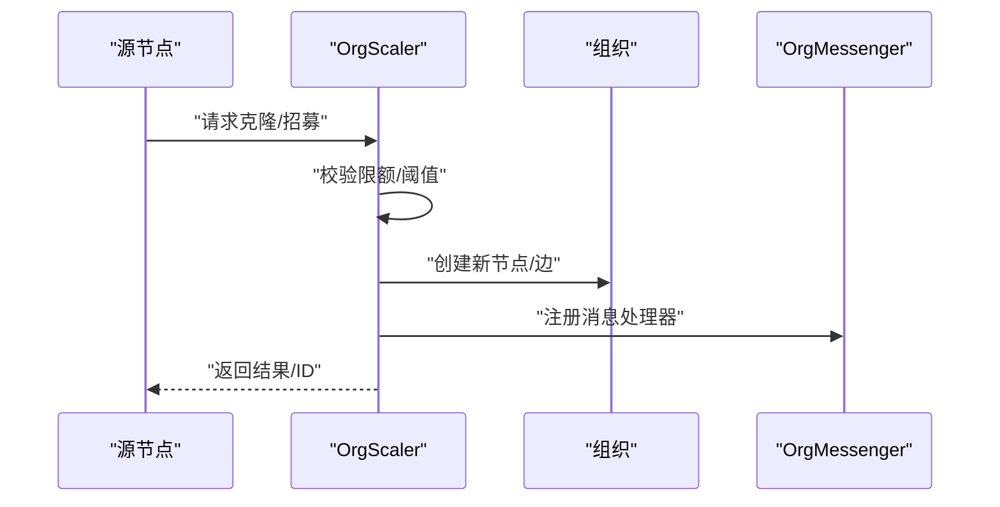
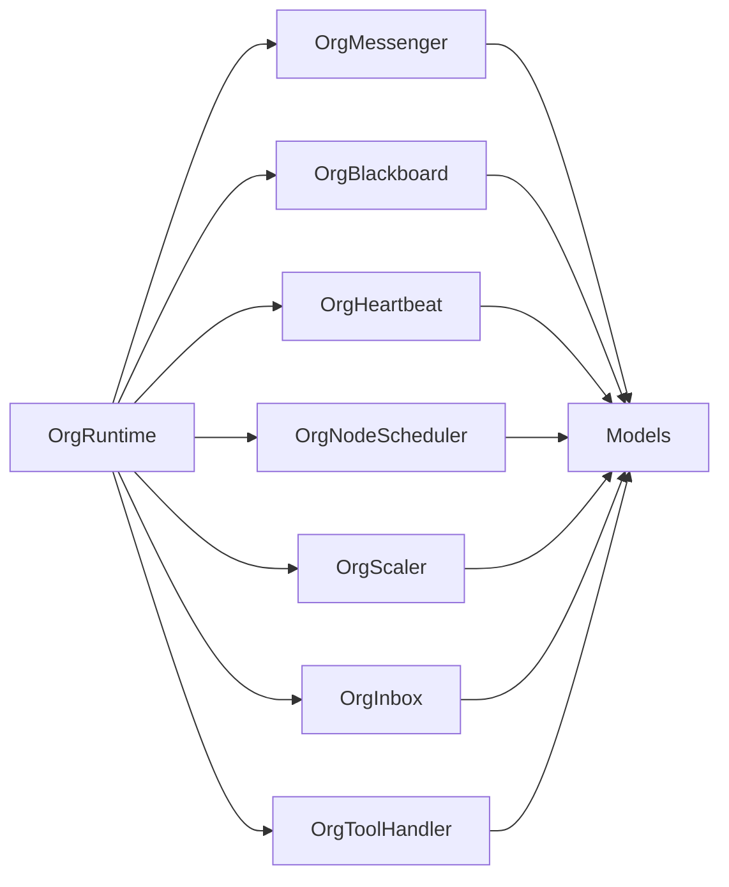

# 组织编排模式

<cite>
**本文引用的文件**
- [src/synapse/orgs/__init__.py](file://src/synapse/orgs/__init__.py)
- [src/synapse/orgs/models.py](file://src/synapse/orgs/models.py)
- [src/synapse/orgs/runtime.py](file://src/synapse/orgs/runtime.py)
- [src/synapse/orgs/manager.py](file://src/synapse/orgs/manager.py)
- [src/synapse/orgs/blackboard.py](file://src/synapse/orgs/blackboard.py)
- [src/synapse/orgs/heartbeat.py](file://src/synapse/orgs/heartbeat.py)
- [src/synapse/orgs/node_scheduler.py](file://src/synapse/orgs/node_scheduler.py)
- [src/synapse/orgs/scaler.py](file://src/synapse/orgs/scaler.py)
- [src/synapse/orgs/policies.py](file://src/synapse/orgs/policies.py)
- [src/synapse/orgs/messenger.py](file://src/synapse/orgs/messenger.py)
- [src/synapse/orgs/inbox.py](file://src/synapse/orgs/inbox.py)
- [src/synapse/orgs/tool_handler.py](file://src/synapse/orgs/tool_handler.py)
- [src/synapse/orgs/templates.py](file://src/synapse/orgs/templates.py)
</cite>

## 目录
1. [简介](#简介)
2. [项目结构](#项目结构)
3. [核心组件](#核心组件)
4. [架构总览](#架构总览)
5. [详细组件分析](#详细组件分析)
6. [依赖分析](#依赖分析)
7. [性能考量](#性能考量)
8. [故障排查指南](#故障排查指南)
9. [结论](#结论)
10. [附录](#附录)

## 简介
本文件系统性阐述 Synapse 组织编排模式，围绕“角色模式”“黑板共享内存模式”“心跳监控模式”“任务调度模式”“节点调度模式”“资源分配模式”展开，结合源码路径定位与可视化图示，帮助不同经验层次的读者快速理解并实践组织系统的构建、角色职责划分与任务执行流程。

## 项目结构
组织编排模块位于 src/synapse/orgs 下，采用按功能域分层的组织方式：
- 数据模型与枚举：models.py
- 生命周期与运行时：runtime.py、manager.py
- 协同通信与消息：messenger.py、inbox.py、tool_handler.py
- 记忆与知识：blackboard.py、policies.py
- 监控与治理：heartbeat.py、node_scheduler.py、scaler.py、templates.py

图表来源
- [src/synapse/orgs/manager.py](file://src/synapse/orgs/manager.py)
- [src/synapse/orgs/runtime.py](file://src/synapse/orgs/runtime.py)
- [src/synapse/orgs/messenger.py](file://src/synapse/orgs/messenger.py)
- [src/synapse/orgs/blackboard.py](file://src/synapse/orgs/blackboard.py)
- [src/synapse/orgs/heartbeat.py](file://src/synapse/orgs/heartbeat.py)
- [src/synapse/orgs/node_scheduler.py](file://src/synapse/orgs/node_scheduler.py)
- [src/synapse/orgs/scaler.py](file://src/synapse/orgs/scaler.py)
- [src/synapse/orgs/inbox.py](file://src/synapse/orgs/inbox.py)
- [src/synapse/orgs/tool_handler.py](file://src/synapse/orgs/tool_handler.py)
- [src/synapse/orgs/templates.py](file://src/synapse/orgs/templates.py)
- [src/synapse/orgs/policies.py](file://src/synapse/orgs/policies.py)

章节来源
- [src/synapse/orgs/__init__.py](file://src/synapse/orgs/__init__.py)
- [src/synapse/orgs/models.py](file://src/synapse/orgs/models.py)

## 核心组件
- 组织数据模型：定义组织、节点、边、消息、内存条目、项目任务等核心实体与枚举，支撑编排的结构化表达。
- 组织运行时：负责组织生命周期、节点激活、任务执行、并发控制、事件广播与状态持久化。
- 消息系统：提供节点间异步消息投递、优先级队列、带宽限制、死锁检测与 TTL 管理。
- 黑板系统：组织/部门/节点三级共享记忆，支持读写、容量淘汰、查询与摘要注入。
- 心跳与晨会：周期性健康检查与自动复盘，支持自适应节律与报告生成。
- 节点调度：基于 cron/间隔/一次性三种模式的节点级定时任务，具备智能调频。
- 动态扩编：支持克隆、招募、裁撤与审批链，防止失控扩编。
- 统一收件箱：聚合事件、审批与通知，支持优先级排序与实时订阅。
- 组织工具：org_* 工具集，覆盖消息、广播、委派、升级、组织认知与记忆读写。

章节来源
- [src/synapse/orgs/models.py](file://src/synapse/orgs/models.py)
- [src/synapse/orgs/runtime.py](file://src/synapse/orgs/runtime.py)
- [src/synapse/orgs/messenger.py](file://src/synapse/orgs/messenger.py)
- [src/synapse/orgs/blackboard.py](file://src/synapse/orgs/blackboard.py)
- [src/synapse/orgs/heartbeat.py](file://src/synapse/orgs/heartbeat.py)
- [src/synapse/orgs/node_scheduler.py](file://src/synapse/orgs/node_scheduler.py)
- [src/synapse/orgs/scaler.py](file://src/synapse/orgs/scaler.py)
- [src/synapse/orgs/inbox.py](file://src/synapse/orgs/inbox.py)
- [src/synapse/orgs/tool_handler.py](file://src/synapse/orgs/tool_handler.py)

## 架构总览
组织编排以“运行时引擎”为中心，围绕消息、记忆、调度、监控与治理五大子系统协同工作，形成闭环的组织生命周期管理。

图表来源
- [src/synapse/orgs/runtime.py](file://src/synapse/orgs/runtime.py)
- [src/synapse/orgs/messenger.py](file://src/synapse/orgs/messenger.py)
- [src/synapse/orgs/blackboard.py](file://src/synapse/orgs/blackboard.py)
- [src/synapse/orgs/heartbeat.py](file://src/synapse/orgs/heartbeat.py)
- [src/synapse/orgs/node_scheduler.py](file://src/synapse/orgs/node_scheduler.py)
- [src/synapse/orgs/scaler.py](file://src/synapse/orgs/scaler.py)
- [src/synapse/orgs/inbox.py](file://src/synapse/orgs/inbox.py)

## 详细组件分析

### 角色模式与组织运行时
- 角色模式：通过 OrgNode 描述角色标题、目标、背景、技能、代理来源、外设工具等，支持克隆与冻结等状态管理。
- 运行时引擎：负责组织状态机转换、节点并发激活、任务执行、事件广播与 WS 推送、健康检查与看门狗。

图表来源
- [src/synapse/orgs/models.py](file://src/synapse/orgs/models.py)
- [src/synapse/orgs/runtime.py](file://src/synapse/orgs/runtime.py)

章节来源
- [src/synapse/orgs/models.py](file://src/synapse/orgs/models.py)
- [src/synapse/orgs/runtime.py](file://src/synapse/orgs/runtime.py)

### 黑板共享内存模式
- 三层记忆：组织级（黑板）、部门级、节点私有，分别对应不同的读写边界与容量限制。
- 写入去重、重要性排序、TTL 过期与容量淘汰，保证知识新鲜度与稳定性。
- 支持摘要注入到提示词，辅助上下文增强。

图表来源
- [src/synapse/orgs/blackboard.py](file://src/synapse/orgs/blackboard.py)

章节来源
- [src/synapse/orgs/blackboard.py](file://src/synapse/orgs/blackboard.py)

### 心跳监控模式
- 周期性健康检查：根据活跃度自适应调整心跳间隔；支持“经营复盘”与“健康检查”两种模式。
- 晨会/周报：基于事件与黑板摘要生成会议纪要，并落盘保存。
- 看门狗：检测卡顿与静默，必要时回收克隆节点。

图表来源
- [src/synapse/orgs/heartbeat.py](file://src/synapse/orgs/heartbeat.py)
- [src/synapse/orgs/runtime.py](file://src/synapse/orgs/runtime.py)
- [src/synapse/orgs/blackboard.py](file://src/synapse/orgs/blackboard.py)

章节来源
- [src/synapse/orgs/heartbeat.py](file://src/synapse/orgs/heartbeat.py)

### 任务调度模式与节点调度模式
- 任务调度：通过消息系统实现跨节点的任务委派、结果回传与链式跟踪。
- 节点调度：支持 cron/间隔/一次性三种模式，具备“连续清洁自动降频、异常立即恢复”的智能调频策略。

图表来源
- [src/synapse/orgs/node_scheduler.py](file://src/synapse/orgs/node_scheduler.py)

章节来源
- [src/synapse/orgs/node_scheduler.py](file://src/synapse/orgs/node_scheduler.py)

### 资源分配模式与动态扩编
- 请求与审批：支持克隆/招募两类扩编请求，可配置自动审批或人工审批。
- 防失控：限制最大节点数、克隆上限与克隆阈值，避免资源滥用。
- 裁撤与回收：对空闲克隆节点进行回收，将记忆归档至部门空间。

图表来源
- [src/synapse/orgs/scaler.py](file://src/synapse/orgs/scaler.py)
- [src/synapse/orgs/messenger.py](file://src/synapse/orgs/messenger.py)

章节来源
- [src/synapse/orgs/scaler.py](file://src/synapse/orgs/scaler.py)

### 组织管理器与模板
- 组织管理器：负责组织的创建、读取、更新、删除、模板安装与状态持久化。
- 模板系统：内置创业公司、软件团队、内容运营三类模板，支持策略模板映射与头像自动填充。

章节来源
- [src/synapse/orgs/manager.py](file://src/synapse/orgs/manager.py)
- [src/synapse/orgs/templates.py](file://src/synapse/orgs/templates.py)

### 统一收件箱与通知
- 聚合各类事件（任务完成、进度变更、审批请求），支持优先级排序与内联审批。
- 实时订阅：通过队列监听消息变化，便于前端或外部系统实时推送。

章节来源
- [src/synapse/orgs/inbox.py](file://src/synapse/orgs/inbox.py)

### 组织工具与角色协作
- 消息与广播：支持点对点消息、部门/全组织广播、回复与升级。
- 委派与协作：严格校验层级与亲缘关系，绑定任务链亲和性，联动项目任务追踪。
- 组织认知：提供组织架构查询、节点状态查询、黑板读写等工具。

章节来源
- [src/synapse/orgs/tool_handler.py](file://src/synapse/orgs/tool_handler.py)
- [src/synapse/orgs/messenger.py](file://src/synapse/orgs/messenger.py)

## 依赖分析
- 组件耦合：运行时引擎聚合多个子系统，消息、记忆、调度、扩编、收件箱均通过运行时进行协调。
- 外部依赖：事件存储、通信日志、项目任务存储等通过运行时统一访问，避免模块间直接耦合。
- 循环依赖：模块间通过接口与运行时中转，未见循环导入迹象。

图表来源
- [src/synapse/orgs/runtime.py](file://src/synapse/orgs/runtime.py)
- [src/synapse/orgs/models.py](file://src/synapse/orgs/models.py)

章节来源
- [src/synapse/orgs/runtime.py](file://src/synapse/orgs/runtime.py)
- [src/synapse/orgs/models.py](file://src/synapse/orgs/models.py)

## 性能考量
- 并发控制：组织级与节点级并发信号量限制，避免资源争用导致的抖动。
- 智能调度：节点调度器在连续清洁时自动降频，异常时快速恢复，降低无效负载。
- 缓存与淘汰：黑板按重要性与 TTL 淘汰，减少磁盘与内存压力。
- 事件与日志：事件存储与通信日志采用流式写入，避免大对象阻塞。

## 故障排查指南
- 心跳未触发：检查组织状态、根节点忙闲状态与心跳开关；查看心跳日志与事件存储。
- 消息堆积：检查节点邮箱 pending 数、带宽限制与死锁检测；必要时清理冻结缓冲区。
- 任务委派失败：核对层级关系、亲和性绑定与任务链深度限制；查看项目任务状态。
- 扩编受限：确认最大节点数、克隆阈值与审批策略；检查克隆上限与父节点关系。
- 收件箱未达：确认订阅队列、优先级排序与未读计数；检查审批副作用执行。

章节来源
- [src/synapse/orgs/heartbeat.py](file://src/synapse/orgs/heartbeat.py)
- [src/synapse/orgs/messenger.py](file://src/synapse/orgs/messenger.py)
- [src/synapse/orgs/tool_handler.py](file://src/synapse/orgs/tool_handler.py)
- [src/synapse/orgs/scaler.py](file://src/synapse/orgs/scaler.py)
- [src/synapse/orgs/inbox.py](file://src/synapse/orgs/inbox.py)

## 结论
Synapse 的组织编排以“运行时引擎”为核心，通过“角色模式”“黑板共享内存”“心跳监控”“任务调度”“节点调度”“资源分配”六大机制，实现了专业化分工、协同效率与管理透明度的统一。模板与制度体系进一步降低了组织搭建与治理门槛，适合从初创团队到复杂项目的多场景落地。

## 附录
- 设计原则
  - 分层解耦：运行时作为中枢，子系统职责单一。
  - 可观测性：事件存储、通信日志、心跳报告与收件箱聚合。
  - 可扩展性：模板与工具扩展点，支持策略与流程定制。
  - 安全与可控：扩编审批、带宽限制、TTL 与看门狗。
- 扩展策略
  - 新增组织工具：在工具处理器中新增 handle_* 方法，遵循参数归一化与类型强制。
  - 自定义模板：在模板库中添加 JSON 模板，映射策略模板与头像。
  - 审批流程：在收件箱中扩展审批选项与副作用执行逻辑。
  - 监控增强：在心跳与节点调度中增加指标采集与告警通道。