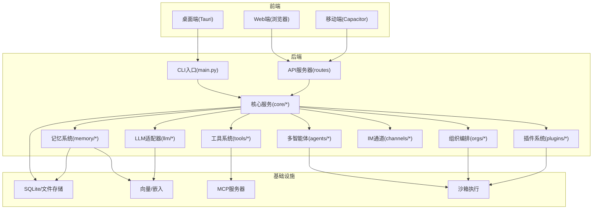
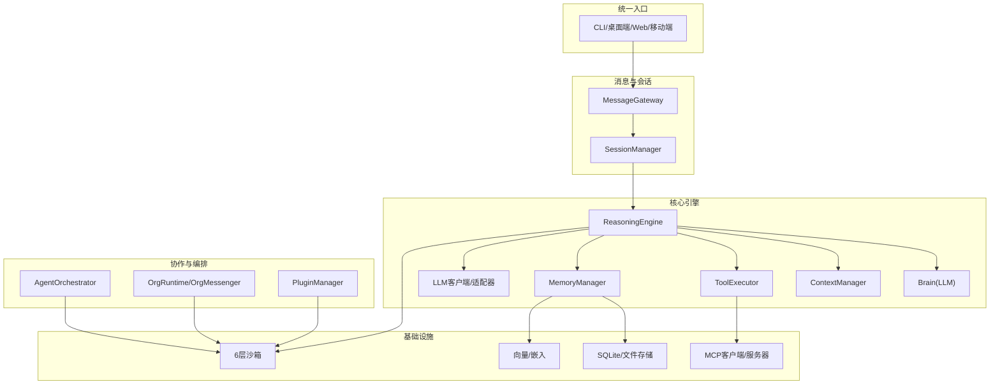
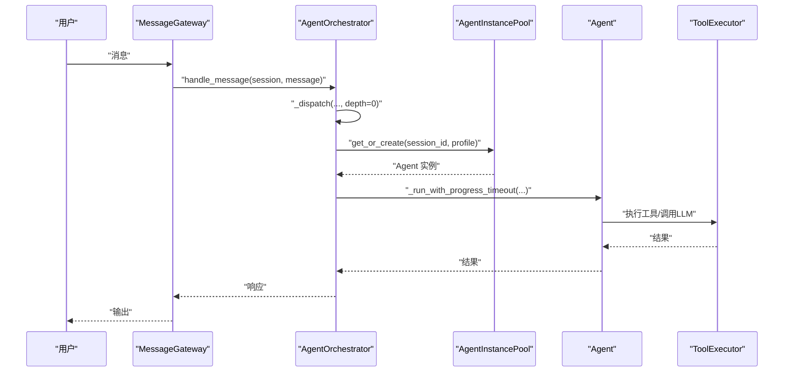
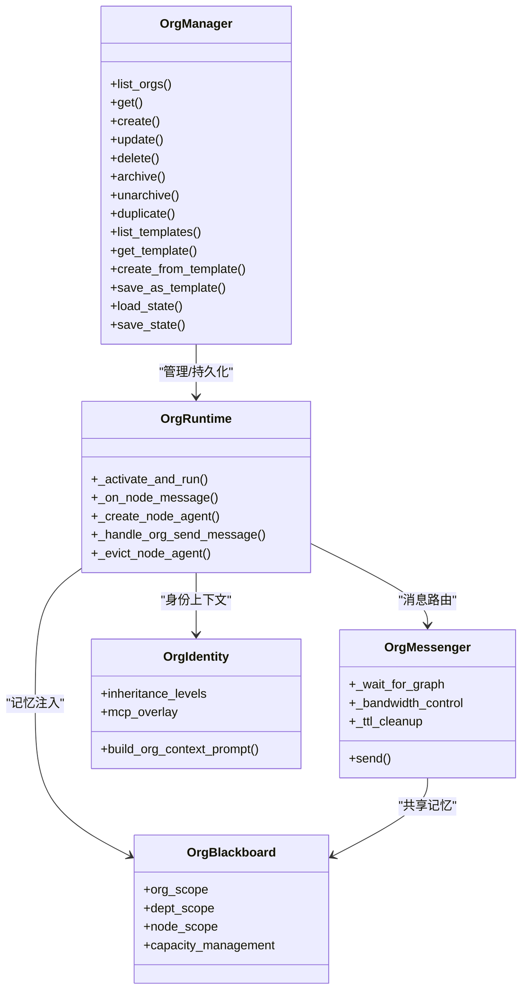
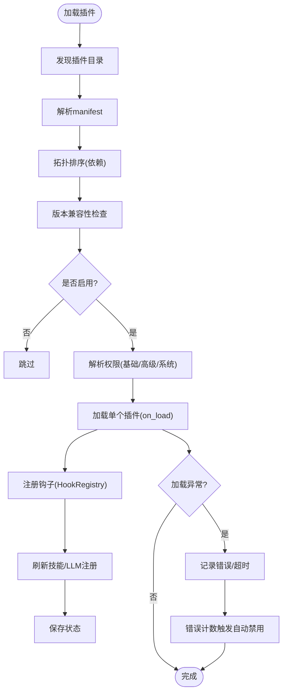
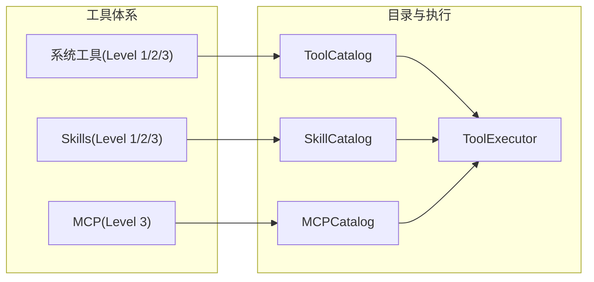
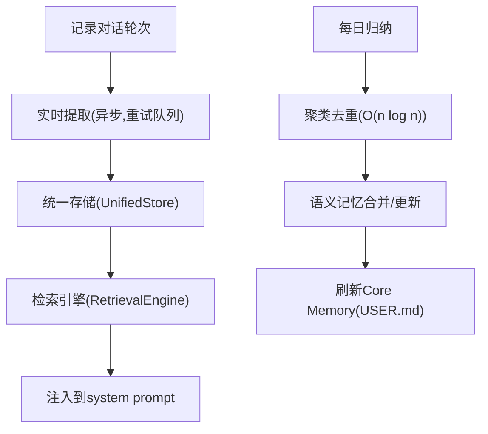
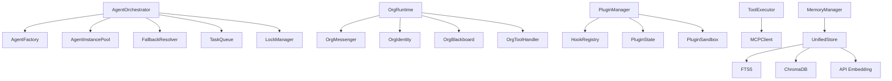

# 核心架构

<cite>
**本文档引用的文件**
- [README.md](file://README.md)
- [src/synapse/__init__.py](file://src/synapse/__init__.py)
- [src/synapse/main.py](file://src/synapse/main.py)
- [src/synapse/agents/orchestrator.py](file://src/synapse/agents/orchestrator.py)
- [src/synapse/orgs/manager.py](file://src/synapse/orgs/manager.py)
- [src/synapse/plugins/manager.py](file://src/synapse/plugins/manager.py)
- [docs/multi-agent-architecture.md](file://docs/multi-agent-architecture.md)
- [docs/agent-org-technical-design.md](file://docs/agent-org-technical-design.md)
- [docs/tool-system-architecture.md](file://docs/tool-system-architecture.md)
- [docs/skills.md](file://docs/skills.md)
- [docs/deploy.md](file://docs/deploy.md)
- [docs/architecture/memory-redesign.md](file://docs/architecture/memory-redesign.md)
</cite>

## 目录
1. [引言](#引言)
2. [项目结构](#项目结构)
3. [核心组件](#核心组件)
4. [架构总览](#架构总览)
5. [详细组件分析](#详细组件分析)
6. [依赖关系分析](#依赖关系分析)
7. [性能考量](#性能考量)
8. [故障排查指南](#故障排查指南)
9. [结论](#结论)
10. [附录](#附录)

## 引言
本文件面向 Synapse 的系统架构与核心设计，聚焦高层设计、架构模式与组件边界，解释技术决策、权衡与约束，并覆盖基础设施要求、可扩展性与部署拓扑。文档还涵盖多智能体协作架构、组织编排引擎、插件系统架构等关键设计模式，以及安全、可观测性与灾难恢复等横切关注点。

## 项目结构
Synapse 采用模块化分层设计，核心代码位于 src/synapse，文档位于 docs，示例与插件位于 examples 与 plugins，桌面端与移动端分别通过 Tauri 与 Capacitor 提供 GUI 与移动体验。系统通过 CLI、IM 通道与桌面端形成统一入口，后端以 Python 为核心，结合 LLM、工具系统、记忆系统与组织编排引擎协同工作。

图表来源
- [src/synapse/main.py](file://src/synapse/main.py)
- [src/synapse/agents/orchestrator.py](file://src/synapse/agents/orchestrator.py)
- [src/synapse/orgs/manager.py](file://src/synapse/orgs/manager.py)
- [src/synapse/plugins/manager.py](file://src/synapse/plugins/manager.py)
- [docs/tool-system-architecture.md](file://docs/tool-system-architecture.md)
- [docs/architecture/memory-redesign.md](file://docs/architecture/memory-redesign.md)

章节来源
- [README.md](file://README.md)
- [src/synapse/main.py](file://src/synapse/main.py)

## 核心组件
- CLI 与入口：统一 CLI 入口，负责日志初始化、追踪系统、IM 通道依赖自动安装、会话管理与多 Agent 模式初始化。
- 核心服务：会话管理、ReasoningEngine、Brain、上下文管理、资源预算、策略与安全策略、工具执行器、观察与追踪。
- 多智能体：AgentOrchestrator、AgentFactory、AgentInstancePool、FallbackResolver、TaskQueue、LockManager。
- 组织编排：OrgManager、OrgRuntime、OrgMessenger、OrgBlackboard、OrgIdentity、OrgPolicies、OrgInbox、OrgNotifier、OrgHeartbeat、OrgNodeScheduler、OrgScaler。
- 插件系统：PluginManager、HookRegistry、PluginSandbox、权限模型与生命周期钩子。
- 工具系统：ToolCatalog、SkillCatalog、MCPCatalog、工具执行与 MCP 客户端。
- 记忆系统：UnifiedStore、RetrievalEngine、LifecycleManager、FTS5/ChromaDB/API Embedding 后端。
- 通道与安全：MessageGateway、IM 适配器、6 层沙箱、策略引擎、资源预算与运行时监督。

章节来源
- [src/synapse/main.py](file://src/synapse/main.py)
- [src/synapse/agents/orchestrator.py](file://src/synapse/agents/orchestrator.py)
- [src/synapse/orgs/manager.py](file://src/synapse/orgs/manager.py)
- [src/synapse/plugins/manager.py](file://src/synapse/plugins/manager.py)
- [docs/tool-system-architecture.md](file://docs/tool-system-architecture.md)
- [docs/architecture/memory-redesign.md](file://docs/architecture/memory-redesign.md)

## 架构总览
Synapse 采用“统一入口 + 模块化内核”的架构。CLI/桌面端/Web/移动端通过统一的会话与消息网关接入后端核心。核心内核以“ReasoningEngine + Brain + ContextManager + ToolExecutor + Memory + LLM + Channels + Plugins”为骨干，向上提供多智能体协作与组织编排能力，向下提供工具与 MCP 扩展、记忆检索与安全沙箱。

图表来源
- [src/synapse/main.py](file://src/synapse/main.py)
- [src/synapse/agents/orchestrator.py](file://src/synapse/agents/orchestrator.py)
- [src/synapse/orgs/manager.py](file://src/synapse/orgs/manager.py)
- [src/synapse/plugins/manager.py](file://src/synapse/plugins/manager.py)
- [docs/tool-system-architecture.md](file://docs/tool-system-architecture.md)
- [docs/architecture/memory-redesign.md](file://docs/architecture/memory-redesign.md)

## 详细组件分析

### 多智能体协作架构
- AgentOrchestrator：集中协调器，负责消息路由、委派管理、超时/失败/取消、健康监控与进度感知超时。
- AgentFactory + AgentInstancePool：按会话实例化 Agent，支持池化与空闲回收。
- FallbackResolver：按健康度与失败阈值进行降级策略。
- TaskQueue：优先级任务队列，支持并发限制与取消。
- LockManager：细粒度资源锁，防止并发冲突。
- 多 Agent 模式与 IM 多 Bot：支持同一通道类型创建多个 Bot，每个 Bot 绑定不同 Agent，会话隔离。

图表来源
- [src/synapse/agents/orchestrator.py](file://src/synapse/agents/orchestrator.py)
- [docs/multi-agent-architecture.md](file://docs/multi-agent-architecture.md)

章节来源
- [src/synapse/agents/orchestrator.py](file://src/synapse/agents/orchestrator.py)
- [docs/multi-agent-architecture.md](file://docs/multi-agent-architecture.md)

### 组织编排引擎（AgentOrg）
- OrgManager：组织 CRUD、持久化与模板管理，目录结构初始化。
- OrgRuntime：节点 Agent 生命周期（懒激活 + LRU 缓存）、工具注入、外部工具授权与动态申请、消息路由与带宽控制、死锁检测、超时控制。
- OrgMessenger：基于优先队列的消息路由、边带宽控制、TTL 过期、等待图死锁检测。
- OrgBlackboard：三级共享记忆（组织/部门/节点），容量管理与淘汰策略。
- OrgIdentity：四级身份继承（全局 SOUL/AGENT + 节点 SOUL/AGENT + ROLE.md），MCP 叠加继承。
- OrgPolicies：两级制度（组织/部门），自动索引与审计。
- OrgInbox + OrgNotifier：跨组织全局收件箱、IM 审批回调与内联审批。
- OrgHeartbeat + OrgNodeScheduler + OrgScaler：心跳/晨会/周报、节点定时任务、动态扩编与防失控。

图表来源
- [src/synapse/orgs/manager.py](file://src/synapse/orgs/manager.py)
- [docs/agent-org-technical-design.md](file://docs/agent-org-technical-design.md)

章节来源
- [src/synapse/orgs/manager.py](file://src/synapse/orgs/manager.py)
- [docs/agent-org-technical-design.md](file://docs/agent-org-technical-design.md)

### 插件系统架构
- PluginManager：插件发现、依赖拓扑排序、版本兼容性校验、权限授予与撤销、生命周期钩子、自动故障隔离与自动禁用。
- HookRegistry：10 个生命周期钩子（初始化、消息接收、工具结果、提示构建、检索、会话开始/结束、定时、关机等）。
- PluginSandbox：自动故障隔离，错误计数超过阈值触发自动禁用。
- 插件类型：Tool/Channel/RAG/Memory/LLM/Hook/Skill/MCP，支持 Python 与 MCP 插件。

图表来源
- [src/synapse/plugins/manager.py](file://src/synapse/plugins/manager.py)
- [docs/tool-system-architecture.md](file://docs/tool-system-architecture.md)

章节来源
- [src/synapse/plugins/manager.py](file://src/synapse/plugins/manager.py)
- [docs/tool-system-architecture.md](file://docs/tool-system-architecture.md)

### 工具系统与技能系统
- 工具系统：系统工具（渐进式披露）、Skills（渐进式披露）、MCP（全量暴露），统一目录与执行流程。
- 技能系统：模块化能力扩展，支持本地/远程/动态生成，遵循 Agent Skills 规范，提供安装、运行、测试与发布流程。

图表来源
- [docs/tool-system-architecture.md](file://docs/tool-system-architecture.md)
- [docs/skills.md](file://docs/skills.md)

章节来源
- [docs/tool-system-architecture.md](file://docs/tool-system-architecture.md)
- [docs/skills.md](file://docs/skills.md)

### 记忆系统重构
- 三层记忆模型：语义记忆（实体-属性结构 + 更新机制）、情节记忆（完整交互故事 + 工具调用链）、工作记忆草稿本（跨会话思维空间）。
- 统一存储层：SQLite 主存储 + FTS5 默认全文检索 + 可选 ChromaDB/API Embedding。
- 检索引擎：多路召回 + 重排序（相关性×时效×重要性×访问频率），上下文感知。
- 生命周期管理：实时提取（含重试队列）+ 批量整合（每日归纳）+ 衰减与归档。

图表来源
- [docs/architecture/memory-redesign.md](file://docs/architecture/memory-redesign.md)

章节来源
- [docs/architecture/memory-redesign.md](file://docs/architecture/memory-redesign.md)

## 依赖关系分析
- 组件耦合与内聚：核心服务（ReasoningEngine/Brain/Context/ToolExecutor/Memory/LLM/Channels/Plugins）高度内聚，面向多智能体与组织编排提供统一能力；工具与 MCP 通过目录与客户端解耦；记忆系统通过统一存储与检索引擎解耦。
- 直接与间接依赖：AgentOrchestrator 依赖 AgentFactory/Pool/Fallback/TaskQueue/LockManager；OrgRuntime 依赖 OrgMessenger/OrgToolHandler/OrgIdentity/OrgBlackboard；PluginManager 依赖 HookRegistry/Manifest/State/Sandbox。
- 外部依赖与集成：IM 通道（Telegram/飞书/企业微信/钉钉/QQ/OneBot）、MCP 客户端、向量/嵌入服务、操作系统沙箱（bubblewrap/seatbelt/MIC）。

图表来源
- [src/synapse/agents/orchestrator.py](file://src/synapse/agents/orchestrator.py)
- [src/synapse/orgs/manager.py](file://src/synapse/orgs/manager.py)
- [src/synapse/plugins/manager.py](file://src/synapse/plugins/manager.py)
- [docs/tool-system-architecture.md](file://docs/tool-system-architecture.md)
- [docs/architecture/memory-redesign.md](file://docs/architecture/memory-redesign.md)

章节来源
- [src/synapse/agents/orchestrator.py](file://src/synapse/agents/orchestrator.py)
- [src/synapse/orgs/manager.py](file://src/synapse/orgs/manager.py)
- [src/synapse/plugins/manager.py](file://src/synapse/plugins/manager.py)
- [docs/tool-system-architecture.md](file://docs/tool-system-architecture.md)
- [docs/architecture/memory-redesign.md](file://docs/architecture/memory-redesign.md)

## 性能考量
- 多智能体：实例池化与空闲回收、深度限制与超时控制、进度感知超时避免无效占用、优先级任务队列与并发限制。
- 组织编排：节点懒激活 + LRU 缓存、消息优先队列与带宽控制、TTL 过期清理、死锁检测与环检测。
- 记忆系统：FTS5 默认检索零外部依赖、可选 ChromaDB/API Embedding 降级回退、批量整合与去重优化（O(n log n)）。
- 工具与 MCP：目录式发现与按需加载、权限与依赖拓扑排序、超时与自动禁用保障稳定性。
- 安全与沙箱：6 层防御（路径分区/确认门/命令拦截/文件快照/自保护/OS 级沙箱）与资源预算控制。

## 故障排查指南
- 版本与打包：版本解析与回退策略，开发/打包模式差异，确保版本字符串正确。
- IM 通道依赖：自动安装缺失依赖（Telegram 核心依赖内置，其他通道按需安装），镜像源多源回退，逐个安装兜底。
- 多智能体：健康度统计与失败阈值、委派深度限制、超时与取消处理、SSE 委派事件前端联动。
- 组织编排：等待图死锁检测、节点超时/TTL、动态扩编上限、事件审计与重启恢复。
- 插件系统：兼容性检查、权限授予/撤销、超时与自动禁用、日志查看与失败原因。
- 记忆系统：实时提取重试队列、批量归纳、FTS5/ChromaDB/API Embedding 降级策略。
- 安全与沙箱：危险命令拦截、确认门、文件快照回滚、资源预算与运行时监督。

章节来源
- [src/synapse/__init__.py](file://src/synapse/__init__.py)
- [src/synapse/main.py](file://src/synapse/main.py)
- [src/synapse/agents/orchestrator.py](file://src/synapse/agents/orchestrator.py)
- [src/synapse/orgs/manager.py](file://src/synapse/orgs/manager.py)
- [src/synapse/plugins/manager.py](file://src/synapse/plugins/manager.py)
- [docs/architecture/memory-redesign.md](file://docs/architecture/memory-redesign.md)

## 结论
Synapse 通过“统一入口 + 模块化内核”的架构，将多智能体协作、组织编排、插件系统、工具与 MCP、记忆检索与安全沙箱有机整合。系统在可扩展性、安全性与用户体验之间取得平衡：以模块化与渐进式披露降低初始成本，以统一存储与检索引擎提升长期价值，以 6 层沙箱与资源预算保障运行安全。多智能体与组织编排双轨并行，既满足个人高效助理需求，也支撑企业级 AI 公司的自主运营。

## 附录

### 基础设施与部署要求
- 硬件：CPU 2 核+、内存 4 GB+、磁盘 20 GB+、稳定网络。
- 软件：Python 3.11+、pip、Git、Node.js（可选，MCP 服务器）、Playwright（可选，浏览器自动化）。
- 操作系统：Windows 10/11、Ubuntu 20.04/22.04/24.04、Debian 11/12、CentOS 8/9 Stream、macOS 12+。
- 部署：PyPI 安装、一键脚本、源码安装；支持 systemd、Docker、nohup 后台运行；生产环境建议容器化与反向代理。

章节来源
- [docs/deploy.md](file://docs/deploy.md)

### 技术栈与第三方依赖
- Python 核心：Typer、Rich、asyncio、importlib、subprocess、logging、json、sqlite3。
- IM 通道：Telegram、飞书、企业微信、钉钉、QQ 官方机器人、OneBot（按需安装 extras）。
- LLM：Anthropic、OpenAI、通义千问、Kimi、DeepSeek、OpenRouter、MiniMax、SiliconFlow 等多供应商支持。
- 工具与 MCP：Playwright、ChromaDB、FTS5、API Embedding。
- 桌面端：Tauri 2.x + React + TypeScript；移动端：Capacitor。

章节来源
- [README.md](file://README.md)
- [docs/deploy.md](file://docs/deploy.md)