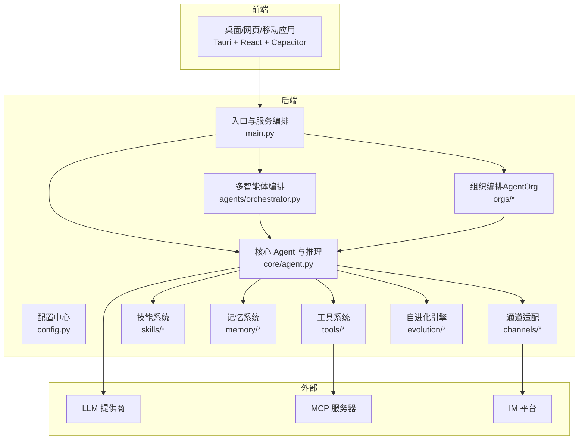
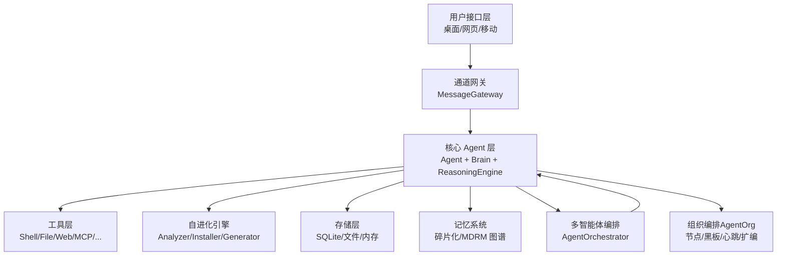
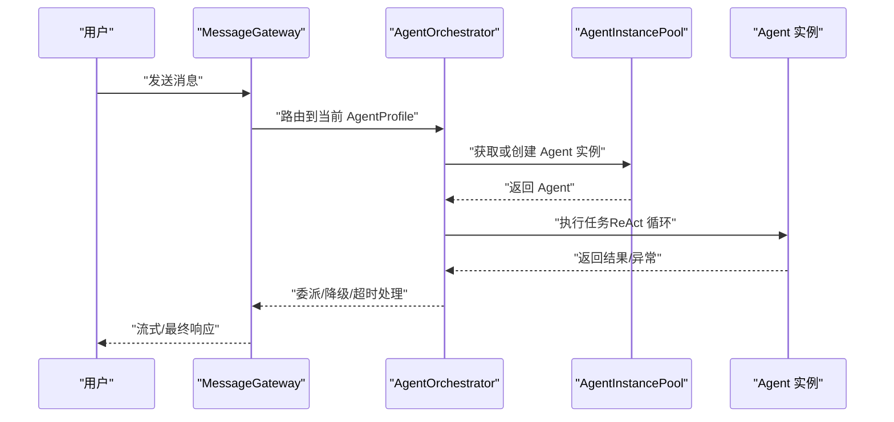
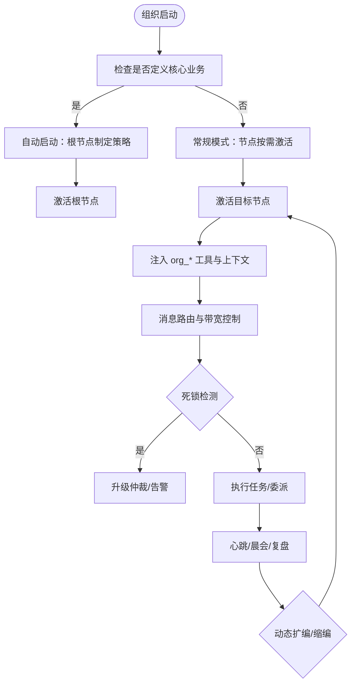
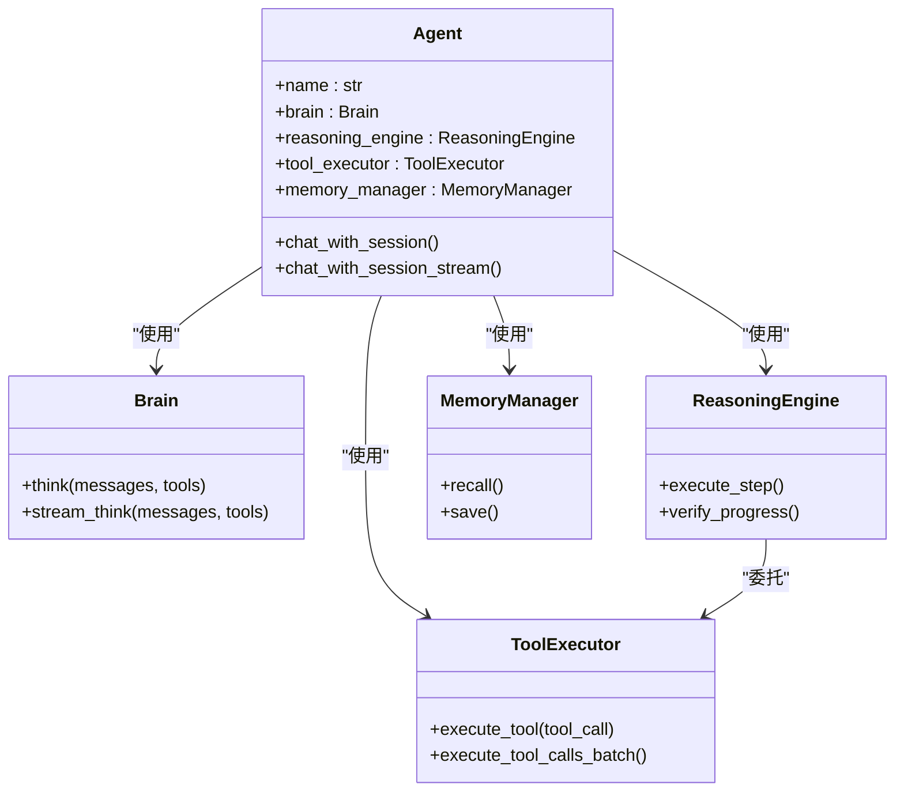
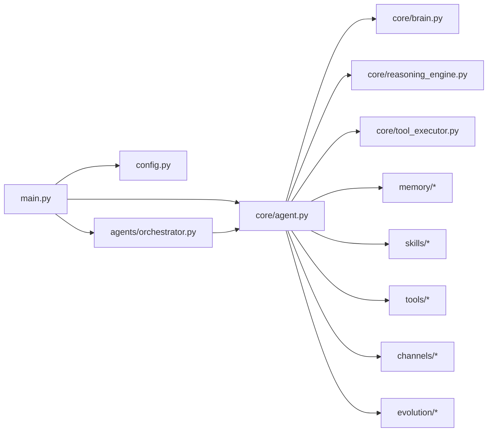

# 系统概述

<cite>
**本文引用的文件**
- [README.md](file://README.md)
- [架构.md](file://docs/architecture.md)
- [多智能体架构.md](file://docs/multi-agent-architecture.md)
- [AgentOrg 技术设计.md](file://docs/agent-org-technical-design.md)
- [配置.md](file://docs/configuration.md)
- [src/synapse/main.py](file://src/synapse/main.py)
- [src/synapse/config.py](file://src/synapse/config.py)
- [src/synapse/core/agent.py](file://src/synapse/core/agent.py)
- [src/synapse/agents/orchestrator.py](file://src/synapse/agents/orchestrator.py)
</cite>

## 目录
1. [引言](#引言)
2. [项目结构](#项目结构)
3. [核心组件](#核心组件)
4. [架构总览](#架构总览)
5. [详细组件分析](#详细组件分析)
6. [依赖分析](#依赖分析)
7. [性能考虑](#性能考虑)
8. [故障排查指南](#故障排查指南)
9. [结论](#结论)
10. [附录](#附录)

## 引言
Synapse 是一个“不只是聊天，而是真正完成任务”的全能自进化 AI Agent 平台。其核心价值主张包括：
- 多智能体协作与组织编排：将 AI 聚合为“AI 公司”，实现跨角色、跨任务的协同与自治运营。
- 自我进化能力：通过日志分析、根因诊断与技能生成，持续增强自身能力。
- 全平台接入：桌面、Web、移动端一体化体验，支持多 IM 平台即时绑定与消息流转。
- 模块化与分层架构：清晰的层次划分与插件化扩展，便于二次开发与定制。

系统设计理念强调“永不放弃”的任务执行哲学（Ralph Wiggum 模式）、两阶段提示词编译、ReAct 推理闭环、工具与安全沙箱的深度集成，以及双模式记忆系统（碎片化与关系型图谱）。

## 项目结构
Synapse 采用模块化与分层架构，核心目录与职责如下：
- src/synapse：后端核心代码，包含 Agent、工具、技能、通道、记忆、调度、会话、配置等子系统。
- docs：官方文档，涵盖架构、配置、多智能体与组织编排设计、MCP 集成等。
- apps/setup-center：桌面端（Tauri + React）与移动端（Capacitor）前端应用。
- skills、plugins、examples：技能与插件生态示例，支持快速扩展。
- mcps：MCP 服务器示例集合，便于外部服务对接。

图表来源
- [架构.md:15-62](file://docs/architecture.md#L15-L62)
- [src/synapse/main.py:66-114](file://src/synapse/main.py#L66-L114)
- [src/synapse/core/agent.py:241-664](file://src/synapse/core/agent.py#L241-L664)
- [src/synapse/agents/orchestrator.py:194-244](file://src/synapse/agents/orchestrator.py#L194-L244)

章节来源
- [README.md:47-62](file://README.md#L47-L62)
- [架构.md:1-62](file://docs/architecture.md#L1-L62)

## 核心组件
- 入口与服务编排：Typer CLI 与服务模式，统一初始化日志、追踪、会话管理、多智能体编排与 IM 通道。
- 配置中心：集中管理 LLM、工具、通道、日志、追踪、UI 偏好、Docker 执行后端等配置。
- 核心 Agent：两阶段提示词编译、Brain（LLM 交互）、Ralph 循环（永不放弃）、ReasoningEngine（推理与工具执行）、MemoryManager（记忆）、Persona/Proactive/Sticker（体验增强）。
- 多智能体编排：AgentOrchestrator 负责消息路由、委派、健康监控、超时与降级。
- 组织编排（AgentOrg）：可视化构建组织结构，节点间消息路由、黑板共享、心跳/晨会、动态扩编、事件溯源与报告。
- 工具与技能：系统工具目录与技能目录，支持渐进式披露与动态加载。
- 记忆系统：碎片化记忆与 MDRM 关系型图谱双模式，支持自动切换与 3D 可视化。
- 自进化引擎：分析器、安装器、技能生成器，实现能力自举与修复。

章节来源
- [src/synapse/main.py:66-114](file://src/synapse/main.py#L66-L114)
- [src/synapse/config.py:17-120](file://src/synapse/config.py#L17-L120)
- [src/synapse/core/agent.py:241-664](file://src/synapse/core/agent.py#L241-L664)
- [src/synapse/agents/orchestrator.py:194-244](file://src/synapse/agents/orchestrator.py#L194-L244)
- [架构.md:64-134](file://docs/architecture.md#L64-L134)

## 架构总览
Synapse 的总体架构分为用户接口层、通道网关、核心 Agent 层、工具层、自进化层与存储层。系统通过两阶段提示词编译与 ReAct 推理闭环，结合工具与安全沙箱，确保任务在多平台与多角色协作下可靠完成。

图表来源
- [架构.md:15-62](file://docs/architecture.md#L15-L62)
- [src/synapse/core/agent.py:241-664](file://src/synapse/core/agent.py#L241-L664)
- [src/synapse/agents/orchestrator.py:194-244](file://src/synapse/agents/orchestrator.py#L194-L244)

章节来源
- [架构.md:1-62](file://docs/architecture.md#L1-L62)

## 详细组件分析

### 多智能体协作（AgentOrchestrator）
- 设计原则：运行时开关、渐进增强、轻量通信（进程内队列）、安全沙箱。
- 核心职责：消息路由、委派管理（深度限制）、超时/失败/取消、健康监控、SSE 通知。
- 关键流程：handle_message → _dispatch → _run_with_progress_timeout → _call_agent，支持进度感知超时与降级策略。

图表来源
- [多智能体架构.md:89-101](file://docs/multi-agent-architecture.md#L89-L101)
- [src/synapse/agents/orchestrator.py:369-401](file://src/synapse/agents/orchestrator.py#L369-L401)
- [src/synapse/agents/orchestrator.py:572-762](file://src/synapse/agents/orchestrator.py#L572-L762)

章节来源
- [多智能体架构.md:1-48](file://docs/multi-agent-architecture.md#L1-L48)
- [src/synapse/agents/orchestrator.py:194-244](file://src/synapse/agents/orchestrator.py#L194-L244)

### 组织编排（AgentOrg）
- 设计目标：在现有自由派发多智能体模式之上，新增“持久化、层级化”的编排范式，支持可视化组织结构与节点自治。
- 核心子系统：运行时（生命周期/心跳/扩编）、消息路由（黑板/带宽控制/死锁检测）、工具注入（org_* 前缀工具拦截）、身份继承（四级）、事件溯源与报告。
- 关键流程：节点激活 → 工具注入 → 消息路由 → 死锁检测 → 超时控制 → 自动启动（核心业务）。

图表来源
- [AgentOrg 技术设计.md:304-338](file://docs/agent-org-technical-design.md#L304-L338)
- [AgentOrg 技术设计.md:190-228](file://docs/agent-org-technical-design.md#L190-L228)
- [AgentOrg 技术设计.md:214-222](file://docs/agent-org-technical-design.md#L214-L222)

章节来源
- [AgentOrg 技术设计.md:1-71](file://docs/agent-org-technical-design.md#L1-L71)

### 核心 Agent 与推理引擎
- 两阶段提示词编译：第一阶段将用户请求结构化为 YAML 任务定义，第二阶段交由 Brain 与 ReasoningEngine 执行。
- ReAct 推理闭环：Think → Act → Observe，支持流式输出、工具调用、令牌追踪与失败自愈。
- 工具与技能：系统工具目录与技能目录，支持渐进式披露、意图提示、上下文窗口适配与并行执行。

图表来源
- [src/synapse/core/agent.py:241-664](file://src/synapse/core/agent.py#L241-L664)
- [架构.md:117-134](file://docs/architecture.md#L117-L134)

章节来源
- [src/synapse/core/agent.py:241-664](file://src/synapse/core/agent.py#L241-L664)
- [架构.md:77-134](file://docs/architecture.md#L77-L134)

### 记忆系统（双模式）
- 模式一（碎片化）：工作记忆、核心记忆、动态检索，支持多路径召回（语义/全文/时间/附件）。
- 模式二（MDRM 关系型图谱）：时间线、因果链、实体关系、动作依赖、上下文归属，支持多跳图遍历与 3D 可视化。
- 智能切换：根据查询特征自动路由到合适模式，AI 驱动抽取与双轨写入。

章节来源
- [README.md:517-551](file://README.md#L517-L551)

### 自进化引擎
- 分析器：分析错误日志与失败原因，确定所需能力缺口。
- 安装器：从 PyPI/GitHub 安装依赖或技能。
- 生成器：AI 动态生成新技能，补齐能力短板。
- 日常自检：04:00 自检、根因分析、自动修复与报告推送。

章节来源
- [README.md:571-581](file://README.md#L571-L581)

## 依赖分析
- 组件耦合与内聚：核心 Agent 与推理引擎高度内聚，通过 ToolExecutor 与 MemoryManager 与其他模块解耦；多智能体编排与组织编排作为上层协调模块，依赖核心 Agent 的稳定接口。
- 直接与间接依赖：Agent 依赖 Brain、ReasoningEngine、ToolExecutor、MemoryManager；Orchestrator 依赖 AgentInstancePool 与 ProfileStore；AgentOrg 依赖 Orchestrator 与工具拦截机制。
- 外部依赖与集成点：IM 通道适配器（Telegram/飞书/企业微信/钉钉/QQ/OneBot）、MCP 客户端、Docker 执行后端、LLM 提供商（Anthropic/OpenAI/DeepSeek 等）。
- 接口契约与实现细节：MessageGateway 统一消息路由；AgentOrchestrator 通过 AgentInstancePool 管理实例；AgentOrg 通过拦截式工具调用实现 org_* 命名空间隔离。

图表来源
- [src/synapse/main.py:66-114](file://src/synapse/main.py#L66-L114)
- [src/synapse/core/agent.py:241-664](file://src/synapse/core/agent.py#L241-L664)
- [src/synapse/agents/orchestrator.py:194-244](file://src/synapse/agents/orchestrator.py#L194-L244)

章节来源
- [src/synapse/main.py:66-114](file://src/synapse/main.py#L66-L114)
- [src/synapse/core/agent.py:241-664](file://src/synapse/core/agent.py#L241-L664)
- [src/synapse/agents/orchestrator.py:194-244](file://src/synapse/agents/orchestrator.py#L194-L244)

## 性能考虑
- 异步优先：全链路异步 I/O，避免阻塞；工具执行采用信号量与互斥锁控制状态型工具并发。
- 流式响应：支持流式输出与媒体预处理（语音转文字、图片编码），降低端到端延迟。
- 缓存与压缩：频繁数据缓存、上下文压缩（目标比例、软限阈值、跨话题边界压缩），减少 LLM 输入负担。
- 批处理与并行：单轮工具调用可并行执行（受配置与工具互斥约束），提升吞吐。
- 资源预算与超时：令牌/成本/时长/迭代/工具调用预算，以及进度感知超时与硬上限，防止资源滥用。

章节来源
- [架构.md:294-310](file://docs/architecture.md#L294-L310)
- [src/synapse/core/agent.py:600-620](file://src/synapse/core/agent.py#L600-L620)

## 故障排查指南
- 启动与依赖安装：IM 通道依赖自动检测与安装，支持离线 wheels 与多镜像源回退；Python 运行时探测与修复提示。
- 配置校验：提供配置验证与显示命令，建议在生产环境启用日志与资源限制。
- 通道与适配器：检查 Bot 凭证、代理设置、回调端口与主机绑定；支持热重载注册/注销适配器。
- 多智能体与组织编排：查看委派日志（delegation_logs）、健康指标、死锁检测与超时原因；核对节点工具授权与外部工具类目。
- 自进化与修复：关注自检报告与失败根因分析，确认安装器是否成功拉取依赖或生成技能。

章节来源
- [src/synapse/main.py:214-522](file://src/synapse/main.py#L214-L522)
- [配置.md:291-312](file://docs/configuration.md#L291-L312)

## 结论
Synapse 以“永不放弃”的任务执行哲学为核心，通过模块化与分层架构，实现了从单智能体到多智能体再到组织级编排的演进。其双模式记忆、自进化引擎与多平台接入能力，使其既能满足初学者的零门槛使用，也能为有经验的开发者提供强大的扩展性与可定制性。建议在生产环境中结合资源预算、日志与追踪配置，确保系统稳定与可观测性。

## 附录
- 系统启动流程（简述）
  1) 初始化日志与追踪
  2) 加载配置与运行时状态
  3) 启动会话管理器与桌面 Agent 实例池
  4) 初始化多智能体编排器（可选）
  5) 启动 IM 通道适配器（按需自动安装依赖）
  6) 进入交互模式或服务模式

- 核心配置选项（节选）
  - LLM 与模型切换：API Key、默认模型、最大输出 token、上下文窗口与压缩策略
  - 多智能体与组织编排：multi_agent_enabled、coordinator_mode_enabled、im_bots
  - 工具与安全：工具并行、强制工具调用、确认提示、Docker 执行后端
  - 记忆与追踪：memory_mode、MDRM 参数、追踪导出
  - UI 与通知：主题、语言、桌面通知、表情包

章节来源
- [src/synapse/main.py:66-114](file://src/synapse/main.py#L66-L114)
- [src/synapse/config.py:17-560](file://src/synapse/config.py#L17-L560)
- [配置.md:1-312](file://docs/configuration.md#L1-L312)