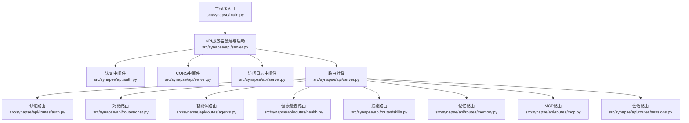
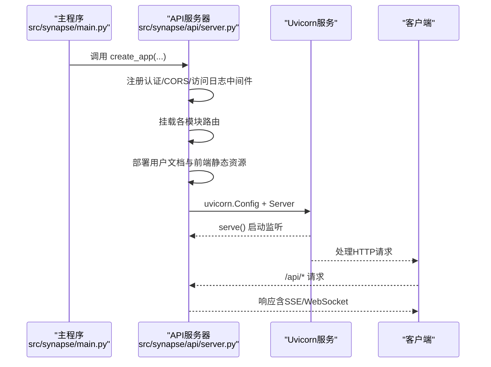
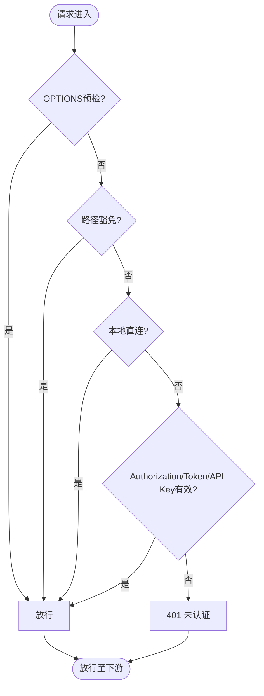
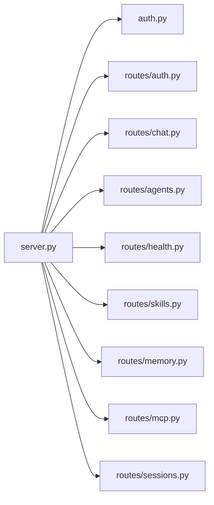

# API交互

<cite>
**本文引用的文件**
- [src/synapse/api/server.py](file://src/synapse/api/server.py)
- [src/synapse/api/auth.py](file://src/synapse/api/auth.py)
- [src/synapse/api/schemas.py](file://src/synapse/api/schemas.py)
- [src/synapse/api/__init__.py](file://src/synapse/api/__init__.py)
- [src/synapse/main.py](file://src/synapse/main.py)
- [src/synapse/api/routes/auth.py](file://src/synapse/api/routes/auth.py)
- [src/synapse/api/routes/chat.py](file://src/synapse/api/routes/chat.py)
- [src/synapse/api/routes/agents.py](file://src/synapse/api/routes/agents.py)
- [src/synapse/api/routes/health.py](file://src/synapse/api/routes/health.py)
- [src/synapse/api/routes/skills.py](file://src/synapse/api/routes/skills.py)
- [src/synapse/api/routes/memory.py](file://src/synapse/api/routes/memory.py)
- [src/synapse/api/routes/mcp.py](file://src/synapse/api/routes/mcp.py)
- [src/synapse/api/routes/sessions.py](file://src/synapse/api/routes/sessions.py)
</cite>

## 目录
1. [简介](#简介)
2. [项目结构](#项目结构)
3. [核心组件](#核心组件)
4. [架构总览](#架构总览)
5. [详细组件分析](#详细组件分析)
6. [依赖分析](#依赖分析)
7. [性能考虑](#性能考虑)
8. [故障排查指南](#故障排查指南)
9. [结论](#结论)
10. [附录](#附录)

## 简介
本文件面向Synapse的HTTP API交互，系统性阐述基于FastAPI的API服务器架构、路由组织、中间件机制与启动流程；并结合认证、会话、智能体、模型、配置、技能、MCP、记忆、文件、身份、定时任务、即时通讯、Hub、工作区、健康检查、统计、日志、反馈、WebSocket等模块的路由设计进行深入解析。文档还涵盖版本控制、错误处理策略、性能优化与最佳实践，并提供可直接定位实现位置的“章节来源”与“图表来源”。

## 项目结构
- API模块位于src/synapse/api，包含：
  - 服务器入口与启动：server.py
  - 认证与鉴权：auth.py
  - 请求/响应模型：schemas.py
  - 路由集合：src/synapse/api/routes 下按功能划分
- 主程序入口与服务生命周期：src/synapse/main.py

图表来源
- [src/synapse/api/server.py:210-556](file://src/synapse/api/server.py#L210-L556)
- [src/synapse/api/auth.py:328-380](file://src/synapse/api/auth.py#L328-L380)
- [src/synapse/api/routes/auth.py:29-257](file://src/synapse/api/routes/auth.py#L29-L257)
- [src/synapse/api/routes/chat.py:26-200](file://src/synapse/api/routes/chat.py#L26-L200)
- [src/synapse/api/routes/agents.py:12-200](file://src/synapse/api/routes/agents.py#L12-L200)
- [src/synapse/api/routes/health.py:20-200](file://src/synapse/api/routes/health.py#L20-L200)
- [src/synapse/api/routes/skills.py:80-200](file://src/synapse/api/routes/skills.py#L80-L200)
- [src/synapse/api/routes/memory.py:22-200](file://src/synapse/api/routes/memory.py#L22-L200)
- [src/synapse/api/routes/mcp.py:71-200](file://src/synapse/api/routes/mcp.py#L71-L200)
- [src/synapse/api/routes/sessions.py:17-200](file://src/synapse/api/routes/sessions.py#L17-L200)

章节来源
- [src/synapse/api/__init__.py:1-11](file://src/synapse/api/__init__.py#L1-L11)
- [src/synapse/api/server.py:210-556](file://src/synapse/api/server.py#L210-L556)

## 核心组件
- FastAPI应用工厂：create_app，负责中间件注册、路由挂载、静态资源与文档部署、启动/关闭钩子。
- 认证中间件：WebAccessConfig与create_auth_middleware，支持密码直连、Bearer Token、Cookie刷新、本地豁免与代理信任。
- CORS中间件：灵活配置允许来源、方法与头，兼容移动端Capacitor。
- 访问日志中间件：对/api前缀请求进行入站/出站日志记录，排除高频健康检查与日志查询。
- 双循环事件循环：引擎循环与API循环分离，提升高负载下API响应性。

章节来源
- [src/synapse/api/server.py:210-556](file://src/synapse/api/server.py#L210-L556)
- [src/synapse/api/auth.py:328-380](file://src/synapse/api/auth.py#L328-L380)

## 架构总览
下图展示API服务器从创建到启动的关键步骤，以及与主程序的协作关系。

图表来源
- [src/synapse/api/server.py:559-707](file://src/synapse/api/server.py#L559-L707)
- [src/synapse/main.py:641-661](file://src/synapse/main.py#L641-L661)

## 详细组件分析

### FastAPI应用创建与中间件
- 中间件顺序与职责
  - 认证中间件：在CORS之前注册，确保所有响应（包括401）携带正确CORS头。
  - CORS中间件：支持显式origins或正则匹配，自动加入Capacitor移动来源。
  - 访问日志中间件：仅对/api路径记录，排除健康检查与日志查询。
- 路由组织
  - 分模块挂载：认证、对话、智能体、模型、配置、技能、MCP、记忆、会话、文件、身份、定时任务、即时通讯、Hub、工作区、健康检查、统计、日志、反馈、WebSocket、组织编排等。
- 静态资源与文档
  - 前端静态文件与SPA回退、用户文档版本化部署、/docs与/redoc。
- 启动/关闭钩子
  - startup：组织运行时启动、端点健康检查、编译器健康检查。
  - shutdown：组织运行时优雅关闭。

章节来源
- [src/synapse/api/server.py:210-556](file://src/synapse/api/server.py#L210-L556)

### 认证与鉴权
- 单密码+JWT方案：数据存储于data/web_access.json，包含jwt_secret、数据epoch、token版本、密码哈希与提示。
- 支持的认证方式
  - 本地直连豁免（127.0.0.1，不含代理转发）
  - Bearer Token（访问令牌）
  - 查询参数token（图片/Audio标签）
  - X-API-Key（程序化访问）
- 登录限流：每IP分钟级滑动窗口限制登录尝试。
- 密码变更与会话失效广播：远程变更时断开所有远端会话。

图表来源
- [src/synapse/api/auth.py:328-380](file://src/synapse/api/auth.py#L328-L380)

章节来源
- [src/synapse/api/auth.py:38-49](file://src/synapse/api/auth.py#L38-L49)
- [src/synapse/api/auth.py:294-319](file://src/synapse/api/auth.py#L294-L319)
- [src/synapse/api/auth.py:328-380](file://src/synapse/api/auth.py#L328-L380)
- [src/synapse/api/routes/auth.py:86-119](file://src/synapse/api/routes/auth.py#L86-L119)

### CORS配置
- 动态来源：支持CORS_ORIGINS环境变量，逗号分隔；未配置时使用正则匹配任意来源。
- 移动端兼容：自动加入Capacitor来源（http://localhost、capacitor://localhost）。
- 凭据与方法/头：允许凭据、通配方法与头，满足前端跨域需求。

章节来源
- [src/synapse/api/server.py:295-311](file://src/synapse/api/server.py#L295-L311)

### 访问日志记录
- 仅记录/api前缀请求，排除高频健康检查与日志查询。
- 入站/出站各一条，包含方法、路径、状态码与耗时。

章节来源
- [src/synapse/api/server.py:313-346](file://src/synapse/api/server.py#L313-L346)

### API路由组织与模块详解

#### 认证模块
- 路由：登录、刷新、登出、检查、改密、密码提示。
- 登录：JSON/Form解析、限流、生成访问/刷新令牌、设置HttpOnly Cookie。
- 刷新：校验刷新Cookie，签发新令牌。
- 登出：清除刷新Cookie。
- 检查：区分本地、Token、刷新Cookie三种认证方式。
- 改密：本地无需旧密码，远程需要校验；变更后断开远端会话。

章节来源
- [src/synapse/api/routes/auth.py:86-257](file://src/synapse/api/routes/auth.py#L86-L257)

#### 对话模块（SSE）
- 路由：POST /api/chat（SSE流）、清理会话、命令列表。
- 会话上下文：共享Agent流水线，支持多设备忙锁协调、工具确认缓存清理。
- 事件广播：WebSocket广播聊天事件。

章节来源
- [src/synapse/api/routes/chat.py:29-200](file://src/synapse/api/routes/chat.py#L29-L200)

#### 智能体模块
- 路由：机器人增删改查、凭据掩码/还原、配置变更触发会话与池失效。
- 机器人类型校验、IM通道类型集合、凭据安全处理。

章节来源
- [src/synapse/api/routes/agents.py:18-31](file://src/synapse/api/routes/agents.py#L18-L31)
- [src/synapse/api/routes/agents.py:184-200](file://src/synapse/api/routes/agents.py#L184-L200)

#### 健康检查模块
- 路由：GET /api/health（基础健康）、POST /api/health/check（只读检测）。
- IP评分与虚拟网卡过滤，缓存LAN IP以降低开销。
- 端点健康检查：dry_run模式避免影响运行中状态。

章节来源
- [src/synapse/api/routes/health.py:128-200](file://src/synapse/api/routes/health.py#L128-L200)

#### 技能模块
- 路由：技能列表、配置、市场、外部白名单、Catalog重建、池通知。
- 外部技能白名单：skills.json中的external_allowlist，影响加载与Catalog。
- Catalog重建：按需修剪外部技能并重建索引。

章节来源
- [src/synapse/api/routes/skills.py:85-168](file://src/synapse/api/routes/skills.py#L85-L168)

#### 记忆模块
- 路由：创建、列表、统计、LLM审查任务（单实例、无持久化）。
- 存储：SemanticMemory，支持类型、标签、重要度评分、时间戳。
- 生命周期：LifecycleManager封装提取、身份目录等。

章节来源
- [src/synapse/api/routes/memory.py:119-200](file://src/synapse/api/routes/memory.py#L119-L200)

#### MCP模块
- 路由：列出服务器、连接/断开、工具清单、配置Schema状态。
- 工作区集成：工作区路径存在即标记来源为workspace，支持移除。
- Schema状态：读取最近env值，判断必填字段是否完备。

章节来源
- [src/synapse/api/routes/mcp.py:123-200](file://src/synapse/api/routes/mcp.py#L123-L200)

#### 会话模块
- 路由：会话列表、历史拉取、删除、标题生成。
- 历史清洗：隐藏系统截断摘要、清理执行摘要标记。
- 事件广播：会话生命周期事件通过WebSocket广播。

章节来源
- [src/synapse/api/routes/sessions.py:36-200](file://src/synapse/api/routes/sessions.py#L36-L200)

### 数据模型与错误响应
- 统一响应结构：success_response/error_response，便于前端一致性处理。
- 请求模型：ChatRequest、AttachmentInfo、ChatAnswerRequest、ChatControlRequest、HealthCheckRequest、HealthResult、ModelInfo、SkillInfoResponse等。

章节来源
- [src/synapse/api/schemas.py:9-124](file://src/synapse/api/schemas.py#L9-L124)

### API版本控制
- OpenAPI版本：来自版本字符串，用于Swagger/ReDoc展示。
- Token版本：web_access.json中的token_version，变更密码时递增，强制远端会话失效。

章节来源
- [src/synapse/api/server.py:257-258](file://src/synapse/api/server.py#L257-L258)
- [src/synapse/api/auth.py:179-180](file://src/synapse/api/auth.py#L179-L180)
- [src/synapse/api/auth.py:207-210](file://src/synapse/api/auth.py#L207-L210)

### 错误处理策略
- 请求验证：统一422响应，扁平化错误详情，避免原始对象泄露。
- 登录限流：超过阈值返回429。
- 未认证：401，携带标准JSON响应。
- 会话管理：503表示服务组件不可用，404表示会话不存在。

章节来源
- [src/synapse/api/server.py:261-274](file://src/synapse/api/server.py#L261-L274)
- [src/synapse/api/routes/auth.py:92-96](file://src/synapse/api/routes/auth.py#L92-L96)

## 依赖分析
- 组件耦合
  - server.py对auth.py强依赖（认证中间件），对各路由模块弱依赖（include_router）。
  - 路由模块对核心业务组件（会话、记忆、技能、MCP等）通过app.state注入访问。
- 外部依赖
  - FastAPI、Uvicorn、Starlette中间件栈。
  - 静态文件与文档部署依赖。

图表来源
- [src/synapse/api/server.py:31-74](file://src/synapse/api/server.py#L31-L74)

章节来源
- [src/synapse/api/server.py:31-74](file://src/synapse/api/server.py#L31-L74)

## 性能考虑
- 双循环架构：API循环独立于引擎循环，避免LLM密集任务阻塞HTTP响应。
- 端口预检与等待：启动前检测端口占用并等待释放，减少TIME_WAIT竞态。
- 静态资源与文档：预打包静态文件与版本化文档，减少I/O与路径查找。
- 访问日志：仅记录/api路径，避免高频健康检查与日志查询产生噪声。
- 登录限流：防止暴力破解，降低认证压力。

章节来源
- [src/synapse/api/server.py:559-707](file://src/synapse/api/server.py#L559-L707)
- [src/synapse/api/server.py:83-104](file://src/synapse/api/server.py#L83-L104)
- [src/synapse/api/auth.py:263-283](file://src/synapse/api/auth.py#L263-L283)

## 故障排查指南
- 无法启动或端口被占用
  - 观察启动日志与端口等待逻辑，确认端口释放后再试。
- 认证失败
  - 检查Authorization头、查询参数token、X-API-Key；确认本地直连豁免与TRUST_PROXY配置。
  - 登录频繁失败：检查限流状态。
- 跨域问题
  - 设置CORS_ORIGINS或使用正则匹配；确保包含Capacitor来源。
- 健康检查异常
  - 查看端点健康检查结果与冷却状态；必要时检查代理配置提示。
- 会话/记忆/技能异常
  - 确认SessionManager、MemoryStore、SkillLoader可用；关注路由返回的503/404。

章节来源
- [src/synapse/api/server.py:588-597](file://src/synapse/api/server.py#L588-L597)
- [src/synapse/api/auth.py:294-319](file://src/synapse/api/auth.py#L294-L319)
- [src/synapse/api/routes/health.py:166-200](file://src/synapse/api/routes/health.py#L166-L200)
- [src/synapse/api/routes/sessions.py:187-200](file://src/synapse/api/routes/sessions.py#L187-L200)
- [src/synapse/api/routes/memory.py:122-144](file://src/synapse/api/routes/memory.py#L122-L144)
- [src/synapse/api/routes/skills.py:133-167](file://src/synapse/api/routes/skills.py#L133-L167)

## 结论
Synapse的HTTP API采用清晰的模块化路由与中间件体系，结合双循环架构、严格的认证与CORS策略、完善的访问日志与健康检查，实现了高可用、易扩展的API交互层。通过统一的数据模型与错误响应、版本化文档与静态资源部署，前端与插件生态得以稳定对接。建议在生产环境中合理配置CORS与代理信任、开启必要的访问日志与健康监控，并定期评估端点健康与性能瓶颈。

## 附录
- API版本：OpenAPI版本来自应用版本字符串。
- 静态资源：/web（前端SPA）、/user-docs（用户文档）、/api/avatars（头像）。
- 关闭接口：POST /api/shutdown（仅本地允许）。

章节来源
- [src/synapse/api/server.py:257-258](file://src/synapse/api/server.py#L257-L258)
- [src/synapse/api/server.py:441-461](file://src/synapse/api/server.py#L441-L461)
- [src/synapse/api/server.py:465-491](file://src/synapse/api/server.py#L465-L491)