# 事件流

<cite>
**本文引用的文件**
- [事件类型定义 events.py](file://src/synapse/events.py)
- [流式事件累加器 stream_accumulator.py](file://src/synapse/core/stream_accumulator.py)
- [流式呈现器 stream_presenter.py](file://src/synapse/channels/stream_presenter.py)
- [组织事件存储 event_store.py](file://src/synapse/orgs/event_store.py)
- [后端钩子系统 hooks.py](file://src/synapse/plugins/hooks.py)
- [宿主钩子系统 hooks.py](file://src/synapse/core/hooks.py)
- [插件管理器 manager.py](file://src/synapse/plugins/manager.py)
- [重试与退避策略 retry.py](file://src/synapse/llm/retry.py)
- [引擎桥接 engine_bridge.py](file://src/synapse/core/engine_bridge.py)
- [前端事件类型定义 streamEvents.ts](file://apps/setup-center/src/streamEvents.ts)
- [WeCom 流式适配器 wework_ws.py](file://src/synapse/channels/adapters/wework_ws.py)
</cite>

## 目录
1. [简介](#简介)
2. [项目结构](#项目结构)
3. [核心组件](#核心组件)
4. [架构总览](#架构总览)
5. [详细组件分析](#详细组件分析)
6. [依赖关系分析](#依赖关系分析)
7. [性能考量](#性能考量)
8. [故障排查指南](#故障排查指南)
9. [结论](#结论)
10. [附录](#附录)

## 简介
本文件系统性阐述 Synapse 事件流体系：事件驱动架构的设计原则、消息传播机制、事件类型与处理器、钩子系统的生命周期与回调隔离、流式事件累加器的数据聚合与合并策略、异步处理与错误传播及重试机制、事件序列化与传输持久化，以及扩展接口与性能优化建议。文档同时面向系统集成与插件开发者，提供实践指导。

## 项目结构
Synapse 将事件流贯穿于多个层次：
- 事件类型与协议归一化：后端定义事件类型枚举与前端同步类型定义
- 流式事件累加器：统一 Anthropic/OpenAI 事件格式，构建高层 SSE 事件与决策对象
- 流式呈现器：抽象 IM 平台的流式反馈，统一 start/update/finalize 生命周期
- 钩子系统：插件与宿主的生命周期钩子，支持回调隔离与超时保护
- 事件存储：组织级事件溯源与审计日志
- 传输与持久化：适配器负责分块传输与持久化写入
- 引擎桥接：跨事件循环的流式桥接
- 重试与退避：指数退避、Retry-After 解析、529/429 区分与回退策略

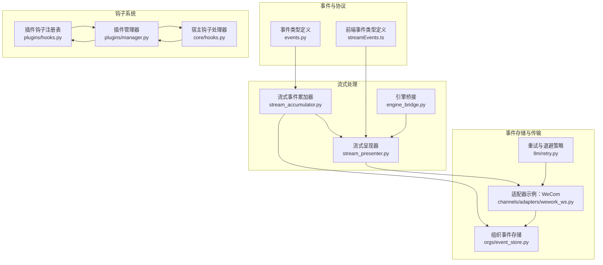

图表来源
- [事件类型定义 events.py:16-64](file://src/synapse/events.py#L16-L64)
- [流式事件累加器 stream_accumulator.py:22-104](file://src/synapse/core/stream_accumulator.py#L22-L104)
- [流式呈现器 stream_presenter.py:26-144](file://src/synapse/channels/stream_presenter.py#L26-L144)
- [组织事件存储 event_store.py:21-68](file://src/synapse/orgs/event_store.py#L21-L68)
- [后端钩子系统 hooks.py:53-224](file://src/synapse/plugins/hooks.py#L53-L224)
- [宿主钩子系统 hooks.py:24-274](file://src/synapse/core/hooks.py#L24-L274)
- [插件管理器 manager.py:44-117](file://src/synapse/plugins/manager.py#L44-L117)
- [重试与退避策略 retry.py:201-274](file://src/synapse/llm/retry.py#L201-L274)
- [引擎桥接 engine_bridge.py:122-160](file://src/synapse/core/engine_bridge.py#L122-L160)
- [前端事件类型定义 streamEvents.ts:10-54](file://apps/setup-center/src/streamEvents.ts#L10-L54)
- [WeCom 流式适配器 wework_ws.py:1329-1353](file://src/synapse/channels/adapters/wework_ws.py#L1329-L1353)

章节来源
- [事件类型定义 events.py:16-119](file://src/synapse/events.py#L16-L119)
- [前端事件类型定义 streamEvents.ts:10-58](file://apps/setup-center/src/streamEvents.ts#L10-L58)

## 核心组件
- 事件类型与协议归一化：后端与前端共享事件类型枚举，确保协议版本一致与字段别名稳定
- 流式事件累加器：兼容 Anthropic 原始 SSE 与 OpenAI 归一化事件，即时产出 text_delta/thinking_delta，流结束时构建 Decision
- 流式呈现器：抽象 IM 平台差异，统一生命周期与节流控制
- 钩子系统：插件与宿主双轨钩子，回调隔离与超时保护，错误追踪与自动禁用
- 事件存储：按日分文件的不可变事件流，支持查询、审计与报告生成
- 传输与持久化：适配器负责分块传输、Keep-Alive、持久化写入
- 引擎桥接：跨事件循环的流式桥接，保证 API 与引擎间通信安全
- 重试与退避：指数退避、Retry-After 优先、429/529 区分、持久模式心跳

章节来源
- [流式事件累加器 stream_accumulator.py:22-392](file://src/synapse/core/stream_accumulator.py#L22-L392)
- [流式呈现器 stream_presenter.py:26-177](file://src/synapse/channels/stream_presenter.py#L26-L177)
- [后端钩子系统 hooks.py:53-224](file://src/synapse/plugins/hooks.py#L53-L224)
- [宿主钩子系统 hooks.py:24-274](file://src/synapse/core/hooks.py#L24-L274)
- [组织事件存储 event_store.py:21-288](file://src/synapse/orgs/event_store.py#L21-L288)
- [重试与退避策略 retry.py:201-274](file://src/synapse/llm/retry.py#L201-L274)
- [引擎桥接 engine_bridge.py:122-160](file://src/synapse/core/engine_bridge.py#L122-L160)

## 架构总览
事件流从 LLM 提供商的原始流开始，经由累加器归一化为高层 SSE 事件，再由呈现器统一输出到各 IM 平台；同时，事件被持久化到组织事件存储中，供审计与报告使用。插件与宿主通过钩子系统参与生命周期事件，具备超时与异常隔离能力。

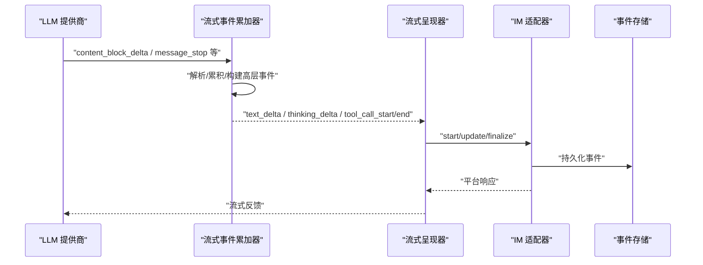

图表来源
- [流式事件累加器 stream_accumulator.py:50-86](file://src/synapse/core/stream_accumulator.py#L50-L86)
- [流式呈现器 stream_presenter.py:85-130](file://src/synapse/channels/stream_presenter.py#L85-L130)
- [组织事件存储 event_store.py:42-68](file://src/synapse/orgs/event_store.py#L42-L68)

## 详细组件分析

### 事件类型与协议归一化
- 后端定义了完整的事件类型枚举，并在归一化函数中设置协议版本与字段别名，确保前端消费一致性
- 前端 TypeScript 文件保持与后端同步，作为前端单一事实来源

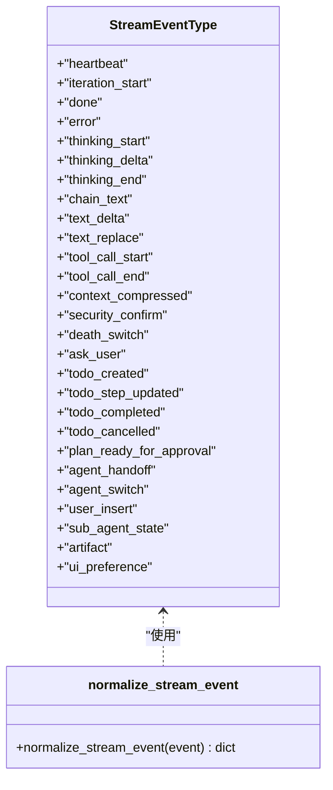

图表来源
- [事件类型定义 events.py:16-64](file://src/synapse/events.py#L16-L64)
- [事件类型定义 events.py:65-119](file://src/synapse/events.py#L65-L119)
- [前端事件类型定义 streamEvents.ts:10-54](file://apps/setup-center/src/streamEvents.ts#L10-L54)

章节来源
- [事件类型定义 events.py:16-119](file://src/synapse/events.py#L16-L119)
- [前端事件类型定义 streamEvents.ts:10-58](file://apps/setup-center/src/streamEvents.ts#L10-L58)

### 流式事件累加器
- 支持 Anthropic 原始事件与 OpenAI 归一化事件
- 即时产出 text_delta/thinking_delta，流结束时构建 Decision 对象
- 对工具调用输入采用字符串拼接并在块结束时解析，避免 O(n^2) 开销
- 提供防御性后处理：从 thinking/text 中提取嵌入工具调用、剥离标签、修正裸工具名

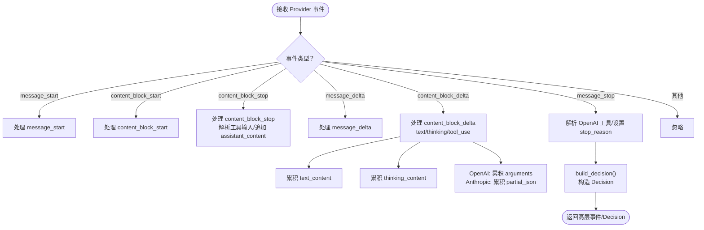

图表来源
- [流式事件累加器 stream_accumulator.py:50-314](file://src/synapse/core/stream_accumulator.py#L50-L314)
- [流式事件累加器 stream_accumulator.py:316-392](file://src/synapse/core/stream_accumulator.py#L316-L392)

章节来源
- [流式事件累加器 stream_accumulator.py:22-392](file://src/synapse/core/stream_accumulator.py#L22-L392)

### 流式呈现器
- 抽象 IM 平台差异，统一 start/update/finalize 生命周期
- 内置节流控制（最小间隔），避免平台限流
- 不支持流式的平台自动降级为占位消息并在完成时替换

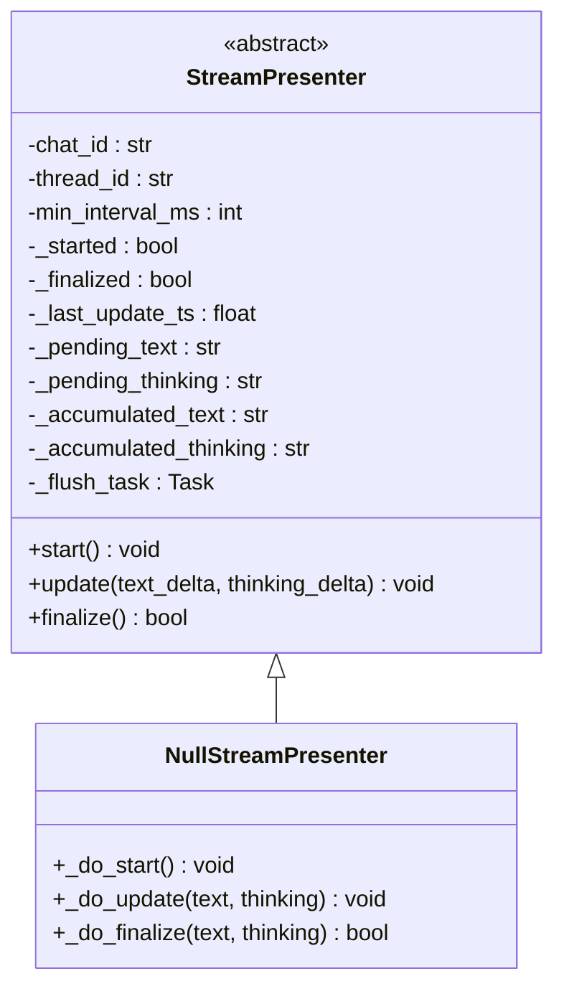

图表来源
- [流式呈现器 stream_presenter.py:26-144](file://src/synapse/channels/stream_presenter.py#L26-L144)
- [流式呈现器 stream_presenter.py:146-177](file://src/synapse/channels/stream_presenter.py#L146-L177)

章节来源
- [流式呈现器 stream_presenter.py:26-177](file://src/synapse/channels/stream_presenter.py#L26-L177)

### 钩子系统（插件与宿主）
- 插件钩子：15 类生命周期钩子，回调独立超时与异常隔离，错误追踪与自动禁用
- 宿主钩子：支持 Python 回调、Shell 脚本、HTTP Webhook，统一执行器与结果记录
- 插件管理器：发现、拓扑排序加载、权限授予、错误追踪与自动禁用

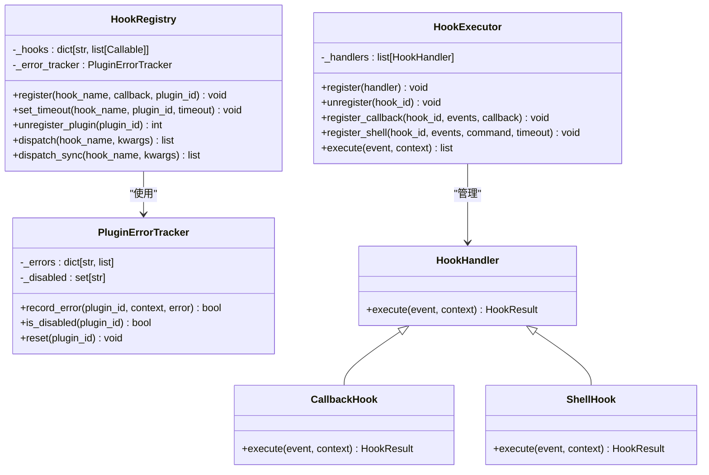

图表来源
- [后端钩子系统 hooks.py:53-224](file://src/synapse/plugins/hooks.py#L53-L224)
- [后端钩子系统 hooks.py:39-50](file://src/synapse/plugins/hooks.py#L39-L50)
- [宿主钩子系统 hooks.py:85-274](file://src/synapse/core/hooks.py#L85-L274)
- [插件管理器 manager.py:44-117](file://src/synapse/plugins/manager.py#L44-L117)

章节来源
- [后端钩子系统 hooks.py:53-224](file://src/synapse/plugins/hooks.py#L53-L224)
- [宿主钩子系统 hooks.py:85-274](file://src/synapse/core/hooks.py#L85-L274)
- [插件管理器 manager.py:44-117](file://src/synapse/plugins/manager.py#L44-L117)

### 事件存储与审计
- 组织级事件存储，按日分文件写入 JSONL，支持查询、审计日志与报告生成
- 提供最近待处理事件查询，用于重启恢复

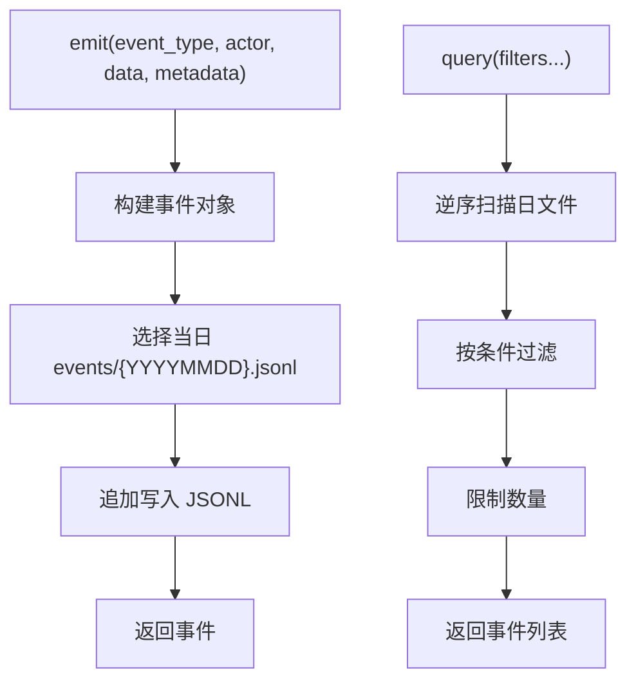

图表来源
- [组织事件存储 event_store.py:42-124](file://src/synapse/orgs/event_store.py#L42-L124)
- [组织事件存储 event_store.py:201-288](file://src/synapse/orgs/event_store.py#L201-L288)

章节来源
- [组织事件存储 event_store.py:21-288](file://src/synapse/orgs/event_store.py#L21-L288)

### 传输与持久化（以 WeCom 为例）
- 分块传输：将 UTF-8 文本切分为不超过阈值的块，避免平台限制
- Keep-Alive：在长时间流中维持连接，防止超时
- 持久化：事件写入本地 JSONL 文件，便于审计与回放

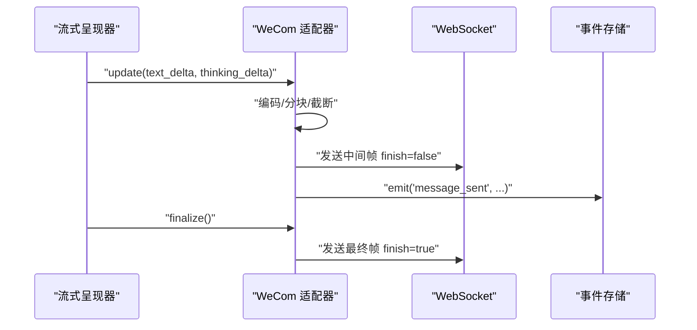

图表来源
- [WeCom 流式适配器 wework_ws.py:1329-1353](file://src/synapse/channels/adapters/wework_ws.py#L1329-L1353)
- [WeCom 流式适配器 wework_ws.py:1805-1836](file://src/synapse/channels/adapters/wework_ws.py#L1805-L1836)
- [组织事件存储 event_store.py:42-68](file://src/synapse/orgs/event_store.py#L42-L68)

章节来源
- [WeCom 流式适配器 wework_ws.py:1329-1353](file://src/synapse/channels/adapters/wework_ws.py#L1329-L1353)
- [WeCom 流式适配器 wework_ws.py:1805-1836](file://src/synapse/channels/adapters/wework_ws.py#L1805-L1836)
- [组织事件存储 event_store.py:42-68](file://src/synapse/orgs/event_store.py#L42-L68)

### 引擎桥接与跨循环流
- 在多事件循环场景下，通过队列泵将引擎循环中的异步迭代器桥接到 API 循环
- 发生异常时以特殊标记通知，确保桥接安全终止

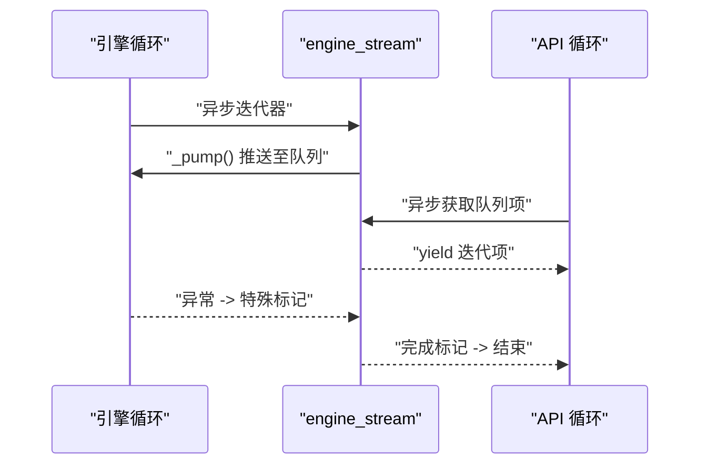

图表来源
- [引擎桥接 engine_bridge.py:122-160](file://src/synapse/core/engine_bridge.py#L122-L160)

章节来源
- [引擎桥接 engine_bridge.py:122-160](file://src/synapse/core/engine_bridge.py#L122-L160)

### 重试与退避策略
- 指数退避 + 抖动，Retry-After 优先
- 区分 429 与 529，连续 529 触发回退模型
- 持久模式下长等待并周期性心跳事件

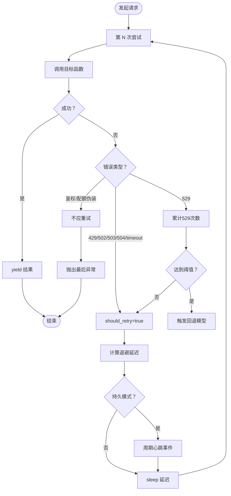

图表来源
- [重试与退避策略 retry.py:201-274](file://src/synapse/llm/retry.py#L201-L274)
- [重试与退避策略 retry.py:106-158](file://src/synapse/llm/retry.py#L106-L158)

章节来源
- [重试与退避策略 retry.py:201-274](file://src/synapse/llm/retry.py#L201-L274)

## 依赖关系分析
- 事件类型与前端保持同步，确保协议一致性
- 流式累加器依赖响应处理器进行后处理
- 钩子系统由插件管理器统一调度，错误追踪贯穿始终
- 适配器依赖事件存储进行持久化
- 引擎桥接为跨循环流提供基础设施

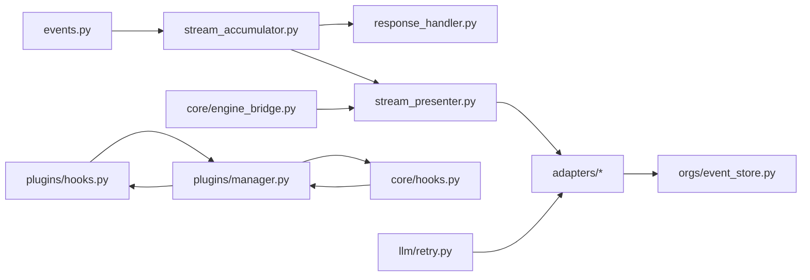

图表来源
- [事件类型定义 events.py:65-119](file://src/synapse/events.py#L65-L119)
- [流式事件累加器 stream_accumulator.py:316-392](file://src/synapse/core/stream_accumulator.py#L316-L392)
- [流式呈现器 stream_presenter.py:26-144](file://src/synapse/channels/stream_presenter.py#L26-L144)
- [组织事件存储 event_store.py:42-68](file://src/synapse/orgs/event_store.py#L42-L68)
- [后端钩子系统 hooks.py:53-224](file://src/synapse/plugins/hooks.py#L53-L224)
- [宿主钩子系统 hooks.py:24-274](file://src/synapse/core/hooks.py#L24-L274)
- [插件管理器 manager.py:44-117](file://src/synapse/plugins/manager.py#L44-L117)
- [引擎桥接 engine_bridge.py:122-160](file://src/synapse/core/engine_bridge.py#L122-L160)
- [重试与退避策略 retry.py:201-274](file://src/synapse/llm/retry.py#L201-L274)

章节来源
- [事件类型定义 events.py:65-119](file://src/synapse/events.py#L65-L119)
- [流式事件累加器 stream_accumulator.py:316-392](file://src/synapse/core/stream_accumulator.py#L316-L392)
- [流式呈现器 stream_presenter.py:26-144](file://src/synapse/channels/stream_presenter.py#L26-L144)
- [组织事件存储 event_store.py:42-68](file://src/synapse/orgs/event_store.py#L42-L68)
- [后端钩子系统 hooks.py:53-224](file://src/synapse/plugins/hooks.py#L53-L224)
- [宿主钩子系统 hooks.py:24-274](file://src/synapse/core/hooks.py#L24-L274)
- [插件管理器 manager.py:44-117](file://src/synapse/plugins/manager.py#L44-L117)
- [引擎桥接 engine_bridge.py:122-160](file://src/synapse/core/engine_bridge.py#L122-L160)
- [重试与退避策略 retry.py:201-274](file://src/synapse/llm/retry.py#L201-L274)

## 性能考量
- 流式累加器采用字符串拼接 + 块结束解析，避免 O(n^2) JSON 解析开销
- 流式呈现器内置节流，减少平台限流风险
- 钩子系统回调隔离与超时，避免单个插件拖垮整体
- 事件存储按日分文件，查询时逆序扫描，结合条件过滤与数量限制
- 引擎桥接使用队列缓冲与线程安全读取，降低跨循环通信成本
- 重试策略指数退避 + 抖动，Retry-After 优先，降低拥塞

[本节为通用性能讨论，不直接分析具体文件]

## 故障排查指南
- 钩子回调超时或异常：检查回调超时设置与错误追踪，确认插件是否被自动禁用
- 事件持久化失败：查看事件存储写入日志与权限
- 流式传输中断：检查适配器分块与 Keep-Alive 逻辑
- 重试无效或过度：核对错误类型识别与 Retry-After 解析

章节来源
- [后端钩子系统 hooks.py:120-156](file://src/synapse/plugins/hooks.py#L120-L156)
- [插件管理器 manager.py:617-647](file://src/synapse/plugins/manager.py#L617-L647)
- [组织事件存储 event_store.py:61-66](file://src/synapse/orgs/event_store.py#L61-L66)
- [WeCom 流式适配器 wework_ws.py:1805-1836](file://src/synapse/channels/adapters/wework_ws.py#L1805-L1836)
- [重试与退避策略 retry.py:201-274](file://src/synapse/llm/retry.py#L201-L274)

## 结论
Synapse 事件流通过“协议归一化 + 流式累加 + 呈现器抽象 + 钩子隔离 + 事件存储 + 传输持久化 + 引擎桥接 + 重试退避”的组合，实现了高可靠、可观测、可扩展的事件驱动架构。该体系既满足前端实时体验，又保障系统稳定性与可维护性，适合大规模系统集成与插件生态扩展。

[本节为总结性内容，不直接分析具体文件]

## 附录

### 事件类型清单（后端）
- 生命周期：heartbeat、iteration_start、done、error
- 思维/推理：thinking_start、thinking_delta、thinking_end、chain_text
- 文本输出：text_delta、text_replace
- 工具执行：tool_call_start、tool_call_end
- 上下文管理：context_compressed
- 安全/交互：security_confirm、death_switch、ask_user
- 待办/计划：todo_created、todo_step_updated、todo_completed、todo_cancelled、plan_ready_for_approval
- 代理编排：agent_handoff、agent_switch、user_insert、sub_agent_state
- UI 增强：artifact、ui_preference

章节来源
- [事件类型定义 events.py:16-64](file://src/synapse/events.py#L16-L64)

### 钩子类型（插件）
- on_init、on_shutdown、on_message_received、on_message_sending、on_retrieve、on_tool_result、on_session_start、on_session_end、on_prompt_build、on_schedule、on_before_tool_use、on_after_tool_use、on_before_llm_call、on_config_change、on_error

章节来源
- [后端钩子系统 hooks.py:15-33](file://src/synapse/plugins/hooks.py#L15-L33)

### 钩子事件（宿主）
- 工具生命周期：pre_tool_use、post_tool_use、post_tool_use_failure
- 会话生命周期：session_start、session_end
- 代理生命周期：stop、stop_failure、sub_agent_start、sub_agent_stop
- 上下文管理：pre_compact、post_compact
- 权限：permission_request、permission_denied
- 通知：notification、user_prompt_submit
- 任务管理：task_created、task_completed
- 配置：config_change
- 文件系统：file_changed、cwd_changed
- 工作树：worktree_create、worktree_remove
- 自定义：custom

章节来源
- [宿主钩子系统 hooks.py:24-71](file://src/synapse/core/hooks.py#L24-L71)