# 工具交互

<cite>
**本文引用的文件**
- [工具系统架构设计](file://docs/tool-system-architecture.md)
- [工具模块入口](file://src/synapse/tools/__init__.py)
- [工具目录](file://src/synapse/tools/catalog.py)
- [MCP 目录](file://src/synapse/tools/mcp_catalog.py)
- [系统工具定义基础](file://src/synapse/tools/definitions/base.py)
- [Shell 工具](file://src/synapse/tools/shell.py)
- [文件工具](file://src/synapse/tools/file.py)
- [MCP 客户端](file://src/synapse/tools/mcp.py)
- [桌面自动化模块入口](file://src/synapse/tools/desktop/__init__.py)
- [工具执行引擎](file://src/synapse/core/tool_executor.py)
- [流式工具执行器](file://src/synapse/core/streaming_tool_executor.py)
- [沙箱](file://src/synapse/core/sandbox.py)
- [组织工具处理器](file://src/synapse/orgs/tool_handler.py)
- [工具分类与角色预设](file://src/synapse/orgs/tool_categories.py)
</cite>

## 目录
1. [简介](#简介)
2. [项目结构](#项目结构)
3. [核心组件](#核心组件)
4. [架构总览](#架构总览)
5. [详细组件分析](#详细组件分析)
6. [依赖分析](#依赖分析)
7. [性能考虑](#性能考虑)
8. [故障排查指南](#故障排查指南)
9. [结论](#结论)
10. [附录](#附录)

## 简介
本文件面向 Synapse 工具交互系统，系统性阐述工具系统的架构设计、执行机制与安全沙箱集成。文档覆盖工具目录的组织结构、工具分类与注册流程，详解九类工具（Shell、文件、浏览器、桌面自动化、MCP、系统、搜索、配置、计划任务）的实现原理与交互方式，并深入分析工具处理器的设计模式、参数验证与结果处理，以及生命周期管理、错误处理与超时控制。最后提供工具开发指南、自定义工具实现与最佳实践。

## 项目结构
Synapse 的工具系统由三大类工具构成：系统工具、Skills 技能与 MCP 外部服务。系统工具采用“渐进式披露”机制，在系统提示中先提供工具清单，再按需加载完整定义；Skills 遵循 Agent Skills 规范同样采用渐进式披露；MCP 工具在系统提示中全量暴露，便于直接调用。

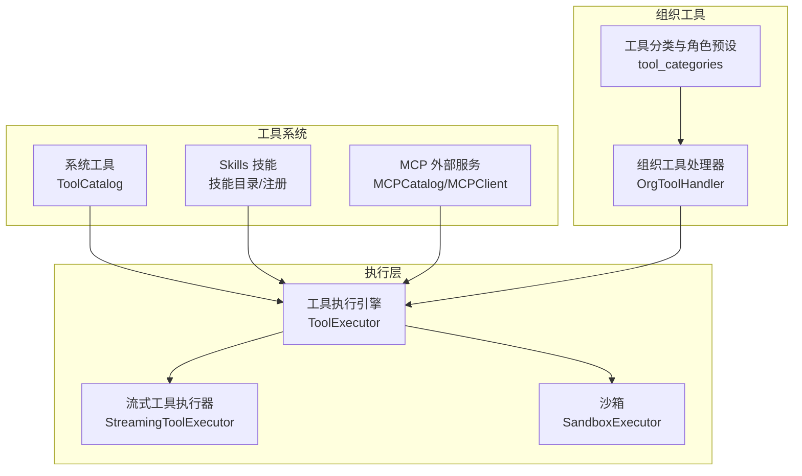

**图表来源**
- [工具系统架构设计:1-313](file://docs/tool-system-architecture.md#L1-L313)
- [工具目录:66-598](file://src/synapse/tools/catalog.py#L66-L598)
- [MCP 目录:151-604](file://src/synapse/tools/mcp_catalog.py#L151-L604)
- [MCP 客户端:244-800](file://src/synapse/tools/mcp.py#L244-L800)
- [工具执行引擎:120-800](file://src/synapse/core/tool_executor.py#L120-L800)
- [流式工具执行器:38-179](file://src/synapse/core/streaming_tool_executor.py#L38-L179)
- [沙箱:186-262](file://src/synapse/core/sandbox.py#L186-L262)
- [组织工具处理器:36-800](file://src/synapse/orgs/tool_handler.py#L36-L800)
- [工具分类与角色预设:10-173](file://src/synapse/orgs/tool_categories.py#L10-L173)

**章节来源**
- [工具系统架构设计:1-313](file://docs/tool-system-architecture.md#L1-L313)

## 核心组件
- 工具目录（ToolCatalog）：负责系统工具的清单生成、分类展示与完整定义查询，支持高频工具直注入与延迟加载。
- MCP 目录（MCPCatalog）：扫描 MCP 配置目录，生成服务器与工具清单，支持按服务器过滤与指令加载。
- 工具执行引擎（ToolExecutor）：统一调度工具执行，支持并行/串行策略、互斥锁管理、权限检查、超时控制与结果截断。
- 流式工具执行器（StreamingToolExecutor）：在模型流式输出过程中即时执行 tool_use，支持并发安全工具并行与错误传播。
- 沙箱（SandboxExecutor）：对命令执行进行策略检查与隔离，限制目录访问、命令黑白名单与网络访问，强制超时终止。
- 组织工具处理器（OrgToolHandler）：处理组织节点相关的工具调用，包含参数规范化、节点引用解析、项目任务桥接与执行日志记录。
- 工具定义基础（definitions/base）：提供工具定义类型、分类推断、描述与详细说明构建器，以及工具验证与合并工具列表等辅助能力。

**章节来源**
- [工具目录:66-598](file://src/synapse/tools/catalog.py#L66-L598)
- [MCP 目录:151-604](file://src/synapse/tools/mcp_catalog.py#L151-L604)
- [工具执行引擎:120-800](file://src/synapse/core/tool_executor.py#L120-L800)
- [流式工具执行器:38-179](file://src/synapse/core/streaming_tool_executor.py#L38-L179)
- [沙箱:186-262](file://src/synapse/core/sandbox.py#L186-L262)
- [组织工具处理器:36-800](file://src/synapse/orgs/tool_handler.py#L36-L800)
- [系统工具定义基础:59-618](file://src/synapse/tools/definitions/base.py#L59-L618)

## 架构总览
工具系统采用“统一架构 + 三类工具”的设计：系统工具与 Skills 采用渐进式披露，MCP 工具全量暴露。系统提示词中包含三类工具清单，调用时按需加载详细定义或直接执行。执行层通过 ToolExecutor 统一调度，结合 StreamingToolExecutor 实现流式工具执行，沙箱保障命令执行安全。

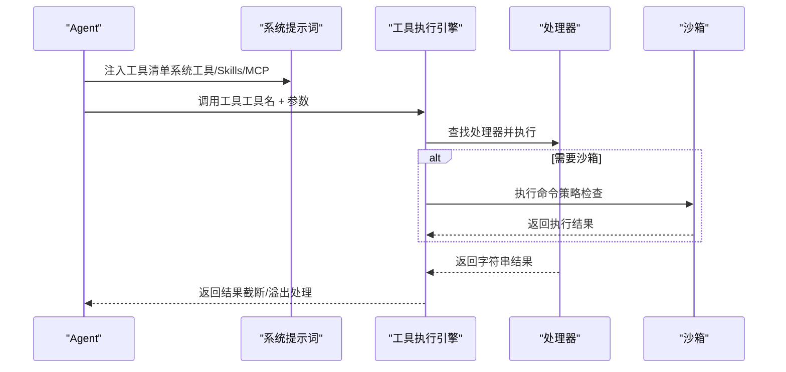

**图表来源**
- [工具系统架构设计:196-237](file://docs/tool-system-architecture.md#L196-L237)
- [工具执行引擎:372-536](file://src/synapse/core/tool_executor.py#L372-L536)
- [沙箱:195-250](file://src/synapse/core/sandbox.py#L195-L250)

## 详细组件分析

### 工具目录（ToolCatalog）
- 清单生成：按分类聚合工具，支持排序与延迟标注（deferred），生成 Level 1 清单。
- 完整定义：通过 get_tool_info 获取 description 与 input_schema，get_tool_info_formatted 输出格式化详情（触发条件、前置条件、参数、示例、相关工具）。
- 高频工具：run_shell、read_file、write_file、list_directory 等高频工具直接注入 LLM tools 参数，跳过渐进式披露。
- 工具组：根据 category 字段自动分组，支持动态新增分类。

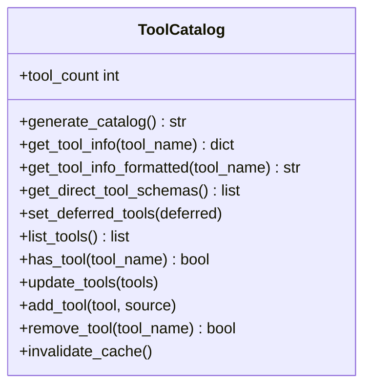

**图表来源**
- [工具目录:66-598](file://src/synapse/tools/catalog.py#L66-L598)

**章节来源**
- [工具目录:183-598](file://src/synapse/tools/catalog.py#L183-L598)

### MCP 目录与客户端（MCPCatalog/MCPClient）
- 目录扫描：扫描 mcps 目录，加载 SERVER_METADATA.json 与 INSTRUCTIONS.md，生成服务器与工具清单。
- 服务器配置：支持 stdio、streamable_http、sse 三种传输协议，支持命令解析、环境变量与工作目录配置。
- 工具发现：连接后通过 list_tools 发现工具，支持按服务器过滤与指令加载。
- 客户端：提供 connect/disconnect、call_tool 等接口，支持超时与错误处理。

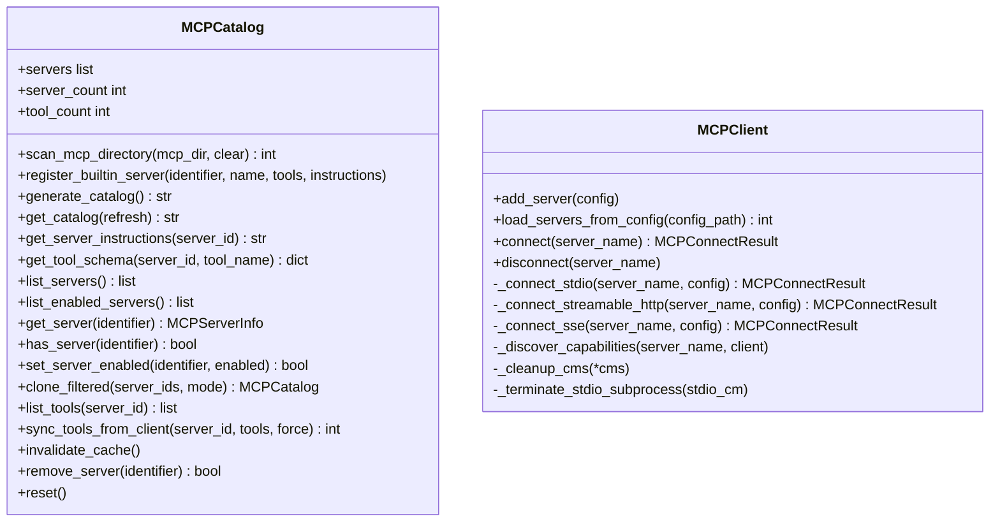

**图表来源**
- [MCP 目录:151-604](file://src/synapse/tools/mcp_catalog.py#L151-L604)
- [MCP 客户端:244-800](file://src/synapse/tools/mcp.py#L244-L800)

**章节来源**
- [MCP 目录:201-593](file://src/synapse/tools/mcp_catalog.py#L201-L593)
- [MCP 客户端:314-800](file://src/synapse/tools/mcp.py#L314-L800)

### 工具执行引擎（ToolExecutor）
- 工具别名与标准化：支持工具名别名与连字符转下划线，提升兼容性。
- 并发分区：将工具调用分为并发安全批次与串行批次，连续并发安全工具合批并行。
- 互斥锁管理：browser/desktop/mcp 处理器默认互斥，避免状态冲突。
- 权限与策略：统一权限检查，支持“确认”模式与沙箱执行钩子。
- 超时与中断：三路竞速（取消/跳过/硬超时），硬超时针对长时间运行工具。
- 结果截断与溢出：通用截断守卫，超过阈值自动截断并保存溢出文件。

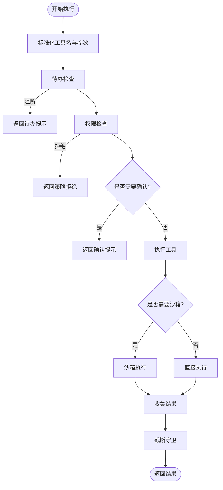

**图表来源**
- [工具执行引擎:372-800](file://src/synapse/core/tool_executor.py#L372-L800)

**章节来源**
- [工具执行引擎:120-800](file://src/synapse/core/tool_executor.py#L120-L800)

### 流式工具执行器（StreamingToolExecutor）
- 流式调度：在模型流式输出过程中，tool_use 块一到达即排队执行。
- 并发策略：并发安全工具可并行，非安全工具串行；支持最大并发安全工具数量。
- 错误传播：bash 错误触发兄弟任务中止，避免连锁失败。
- 结果获取：支持获取已完成结果与等待剩余结果。

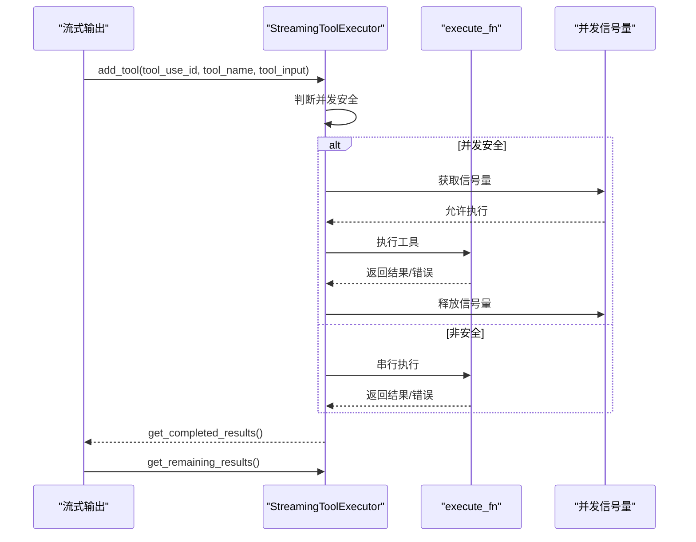

**图表来源**
- [流式工具执行器:38-179](file://src/synapse/core/streaming_tool_executor.py#L38-L179)

**章节来源**
- [流式工具执行器:38-179](file://src/synapse/core/streaming_tool_executor.py#L38-L179)

### 沙箱（SandboxExecutor）
- 策略检查：命令白名单/黑名单、目录访问限制、危险模式匹配、网络访问控制。
- 执行隔离：基于 subprocess 的基础隔离，超时强制终止，返回统一结果结构。
- 全局单例：提供 get_sandbox_executor 获取全局沙箱执行器。

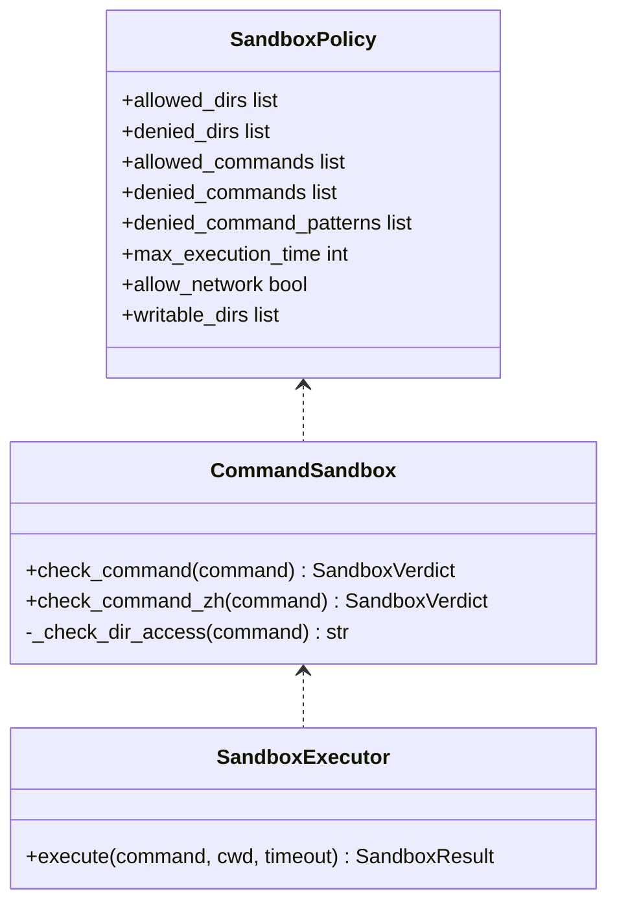

**图表来源**
- [沙箱:27-262](file://src/synapse/core/sandbox.py#L27-L262)

**章节来源**
- [沙箱:72-262](file://src/synapse/core/sandbox.py#L72-L262)

### 组织工具处理器（OrgToolHandler）
- 参数规范化：统一参数别名（to_node/target_node、task/task_description、content/message 等），类型强制与标签解析。
- 节点引用解析：支持角色标题与大小写不敏感 ID，自动解析为标准节点 ID。
- 项目任务桥接：将计划工具结果同步至 ProjectTask，维护进度与执行日志。
- 通信与委派：支持节点间消息发送、回复、任务委派与上报，维护层级深度与亲和性。
- 组织认知：提供组织图、同事查找、节点状态与组织状态查询。

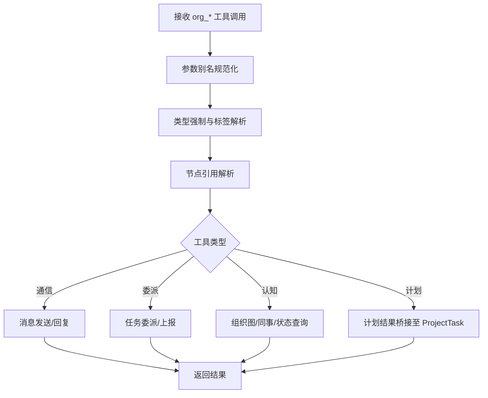

**图表来源**
- [组织工具处理器:383-800](file://src/synapse/orgs/tool_handler.py#L383-L800)

**章节来源**
- [组织工具处理器:36-800](file://src/synapse/orgs/tool_handler.py#L36-L800)

### 工具分类与注册（definitions/base、tool_categories）
- 分类推断：根据工具名称前缀或精确匹配自动推断分类，支持自定义前缀与精确工具名。
- 描述与详细说明：提供构建标准描述与详细说明的工具函数，支持触发条件、前置条件、参数说明与注意事项。
- 角色工具预设：按角色（如 ceo、cto、developer 等）预设工具类别，支持头像映射与关键词匹配。

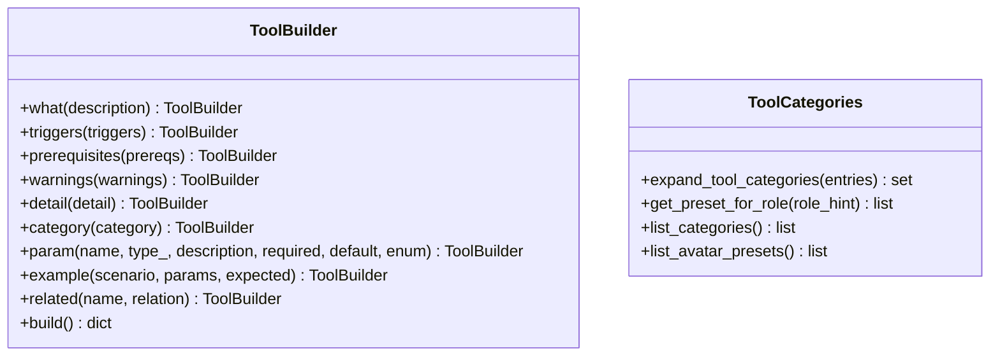

**图表来源**
- [系统工具定义基础:424-570](file://src/synapse/tools/definitions/base.py#L424-L570)
- [工具分类与角色预设:51-173](file://src/synapse/orgs/tool_categories.py#L51-L173)

**章节来源**
- [系统工具定义基础:80-618](file://src/synapse/tools/definitions/base.py#L80-L618)
- [工具分类与角色预设:10-173](file://src/synapse/orgs/tool_categories.py#L10-L173)

### 九类工具实现与交互

#### Shell 工具
- 功能：执行系统命令，支持 Windows PowerShell 编码与路径安全检查，提供交互式执行与包管理工具。
- 安全：UNC 路径检测、命令超时、进程树安全杀死、输出智能解码。
- 适用：系统命令、脚本执行、包安装、Git 操作。

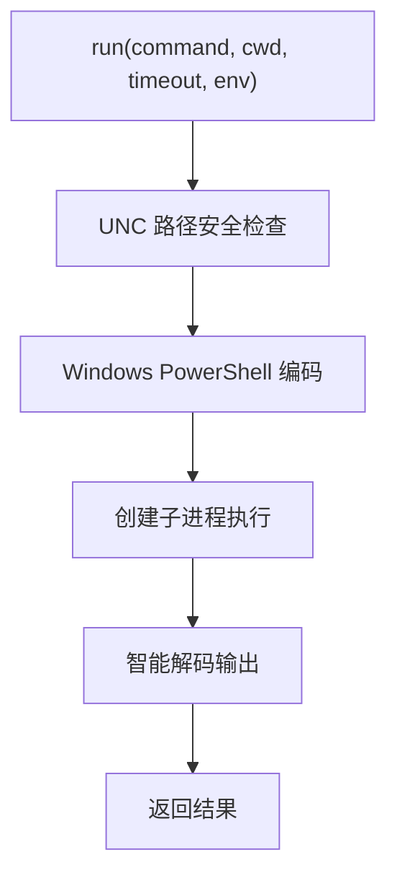

**图表来源**
- [Shell 工具:367-496](file://src/synapse/tools/shell.py#L367-L496)

**章节来源**
- [Shell 工具:121-617](file://src/synapse/tools/shell.py#L121-L617)

#### 文件工具
- 功能：文件读写、编辑、搜索、复制移动、目录遍历与删除。
- 安全：二进制文件识别、忽略目录与隐藏目录过滤、权限与异常处理。
- 适用：代码编辑、日志查看、批量文件操作。

**章节来源**
- [文件工具:37-492](file://src/synapse/tools/file.py#L37-L492)

#### 浏览器工具
- 功能：网页导航、内容获取、截图、标签页管理与表单交互。
- 适用：网页自动化、信息采集、界面测试。

**章节来源**
- [工具模块入口:7-23](file://src/synapse/tools/__init__.py#L7-L23)

#### 桌面自动化工具（Windows）
- 功能：UIAutomation 元素操作、视觉识别、截图、鼠标键盘控制。
- 适用：非浏览器桌面应用操作、窗口管理与混合场景。

**章节来源**
- [桌面自动化模块入口:1-132](file://src/synapse/tools/desktop/__init__.py#L1-L132)

#### MCP 工具
- 功能：连接 MCP 服务器、调用工具、获取资源与提示词。
- 适用：外部服务集成、数据库访问、第三方 API。

**章节来源**
- [MCP 客户端:244-800](file://src/synapse/tools/mcp.py#L244-L800)

#### 系统工具
- 功能：系统控制、日志查看、工具信息查询、图像生成、任务超时设置等。
- 适用：系统运维、调试诊断、能力扩展。

**章节来源**
- [工具目录:384-420](file://src/synapse/tools/catalog.py#L384-L420)

#### 搜索工具
- 功能：网页搜索、新闻搜索、语义搜索、内容检索。
- 适用：信息检索、知识发现、上下文增强。

**章节来源**
- [工具系统架构设计:83-91](file://docs/tool-system-architecture.md#L83-L91)

#### 配置工具
- 功能：系统配置、工作区映射、会话上下文查询。
- 适用：环境配置、上下文感知。

**章节来源**
- [工具系统架构设计:83-91](file://docs/tool-system-architecture.md#L83-L91)

#### 计划任务工具
- 功能：创建计划、更新步骤、完成计划、任务调度与状态跟踪。
- 适用：项目管理、任务编排、进度可视化。

**章节来源**
- [组织工具处理器:305-381](file://src/synapse/orgs/tool_handler.py#L305-L381)

## 依赖分析
- 组件耦合：ToolExecutor 依赖 SystemHandlerRegistry 与工具处理器；StreamingToolExecutor 依赖 ToolExecutor 的执行函数；SandboxExecutor 依赖策略定义；OrgToolHandler 依赖组织模型与项目存储。
- 外部依赖：MCP 客户端依赖 mcp SDK；Shell 工具依赖系统命令与编码库；桌面自动化模块依赖 Windows 特定库。
- 循环依赖：未发现循环依赖，模块职责清晰。

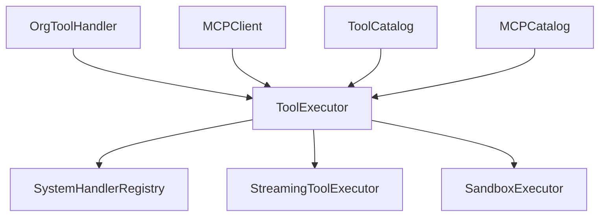

**图表来源**
- [工具执行引擎:141-170](file://src/synapse/core/tool_executor.py#L141-L170)
- [流式工具执行器:55-70](file://src/synapse/core/streaming_tool_executor.py#L55-L70)
- [沙箱:256-262](file://src/synapse/core/sandbox.py#L256-L262)
- [组织工具处理器:39-41](file://src/synapse/orgs/tool_handler.py#L39-L41)
- [MCP 客户端:251-257](file://src/synapse/tools/mcp.py#L251-L257)
- [工具目录:150-164](file://src/synapse/tools/catalog.py#L150-L164)
- [MCP 目录:190-200](file://src/synapse/tools/mcp_catalog.py#L190-L200)

**章节来源**
- [工具执行引擎:120-170](file://src/synapse/core/tool_executor.py#L120-L170)
- [流式工具执行器:55-70](file://src/synapse/core/streaming_tool_executor.py#L55-L70)
- [沙箱:256-262](file://src/synapse/core/sandbox.py#L256-L262)
- [组织工具处理器:39-41](file://src/synapse/orgs/tool_handler.py#L39-L41)
- [MCP 客户端:251-257](file://src/synapse/tools/mcp.py#L251-L257)
- [工具目录:150-164](file://src/synapse/tools/catalog.py#L150-L164)
- [MCP 目录:190-200](file://src/synapse/tools/mcp_catalog.py#L190-L200)

## 性能考虑
- 并行策略：ToolExecutor 将并发安全工具合批并行，非安全工具串行，避免状态冲突；StreamingToolExecutor 限制最大并发安全工具数量，防止资源争用。
- 超时控制：长时工具硬超时与软超时结合，防止阻塞；MCP 连接与调用超时可配置。
- 结果截断：通用截断守卫与溢出文件机制，避免大结果影响性能与稳定性。
- I/O 优化：文件工具使用异步文件操作与忽略目录过滤，减少无效扫描。

[本节为通用指导，无需引用具体文件]

## 故障排查指南
- 工具执行被中断：检查取消/跳过/超时三路竞速，关注日志中的中断原因与工具名。
- 权限拒绝：确认策略引擎返回的拒绝原因与风险等级，必要时使用 ask_user 工具获取用户确认。
- MCP 连接失败：检查传输协议、命令解析、环境变量与工作目录；确认 SDK 安装与版本兼容。
- Shell 执行异常：检查 UNC 路径、命令编码、超时与进程树清理；查看沙箱拒绝原因。
- 组织工具异常：核对节点引用解析、层级深度与亲和性设置；检查项目任务桥接与执行日志。

**章节来源**
- [工具执行引擎:283-371](file://src/synapse/core/tool_executor.py#L283-L371)
- [MCP 客户端:314-372](file://src/synapse/tools/mcp.py#L314-L372)
- [Shell 工具:367-496](file://src/synapse/tools/shell.py#L367-L496)
- [组织工具处理器:473-602](file://src/synapse/orgs/tool_handler.py#L473-L602)

## 结论
Synapse 工具系统通过统一架构与三类工具的渐进式披露，实现了高效、安全与可扩展的工具交互。执行层的并发策略、互斥锁管理与超时控制保障了稳定性；沙箱与策略检查强化了安全；组织工具处理器提供了企业级的任务编排与项目管理能力。开发者可基于工具定义基础与目录机制快速扩展工具，遵循规范与最佳实践即可安全高效地集成新能力。

[本节为总结，无需引用具体文件]

## 附录

### 工具开发指南与最佳实践
- 工具定义：遵循工具定义规范，提供 name、description、input_schema，建议补充 detail、triggers、prerequisites、examples、warnings、related_tools。
- 分类与命名：使用工具定义基础提供的分类推断与验证，确保工具名称符合规范。
- 参数验证：在处理器中进行参数类型与范围验证，必要时使用输入规范化工具。
- 安全与沙箱：对命令执行与文件操作进行最小权限设计，必要时接入沙箱执行。
- 错误处理：统一抛出结构化 ToolError，便于上层捕获与反馈。
- 结果处理：遵循截断守卫与溢出文件机制，避免大结果影响性能。
- 并发与互斥：识别并发安全工具，合理使用互斥锁避免状态冲突。
- 测试与文档：为工具编写单元测试与使用示例，完善工具信息与相关工具说明。

**章节来源**
- [系统工具定义基础:59-618](file://src/synapse/tools/definitions/base.py#L59-L618)
- [工具目录:384-516](file://src/synapse/tools/catalog.py#L384-L516)
- [工具执行引擎:464-480](file://src/synapse/core/tool_executor.py#L464-L480)
- [沙箱:186-250](file://src/synapse/core/sandbox.py#L186-L250)