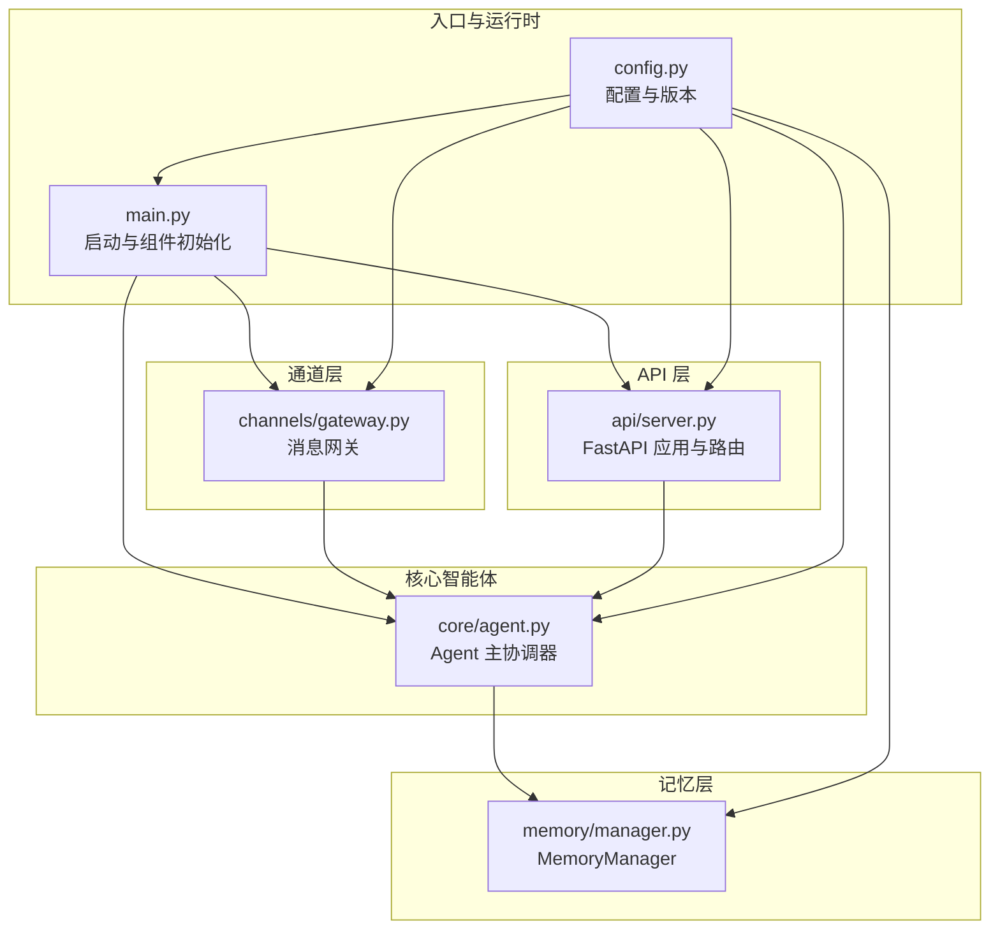
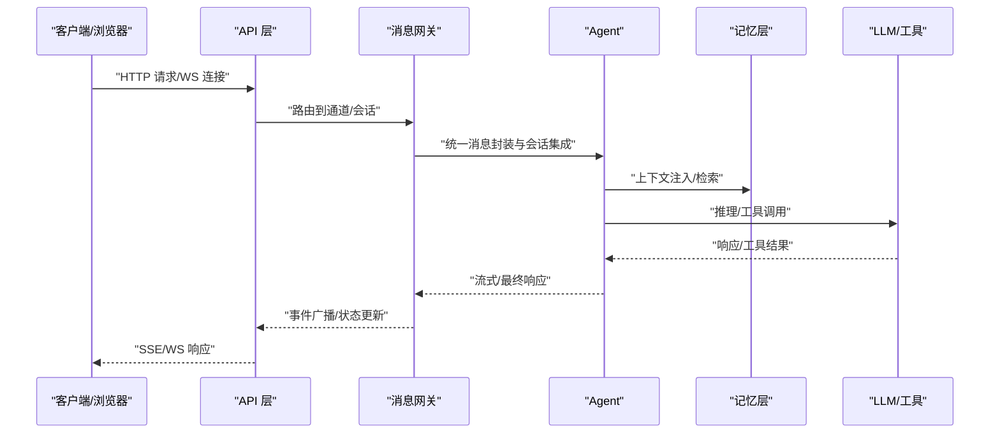
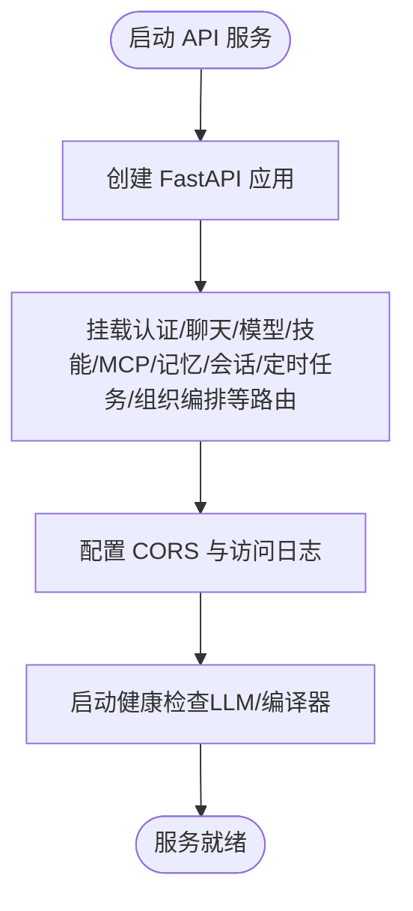
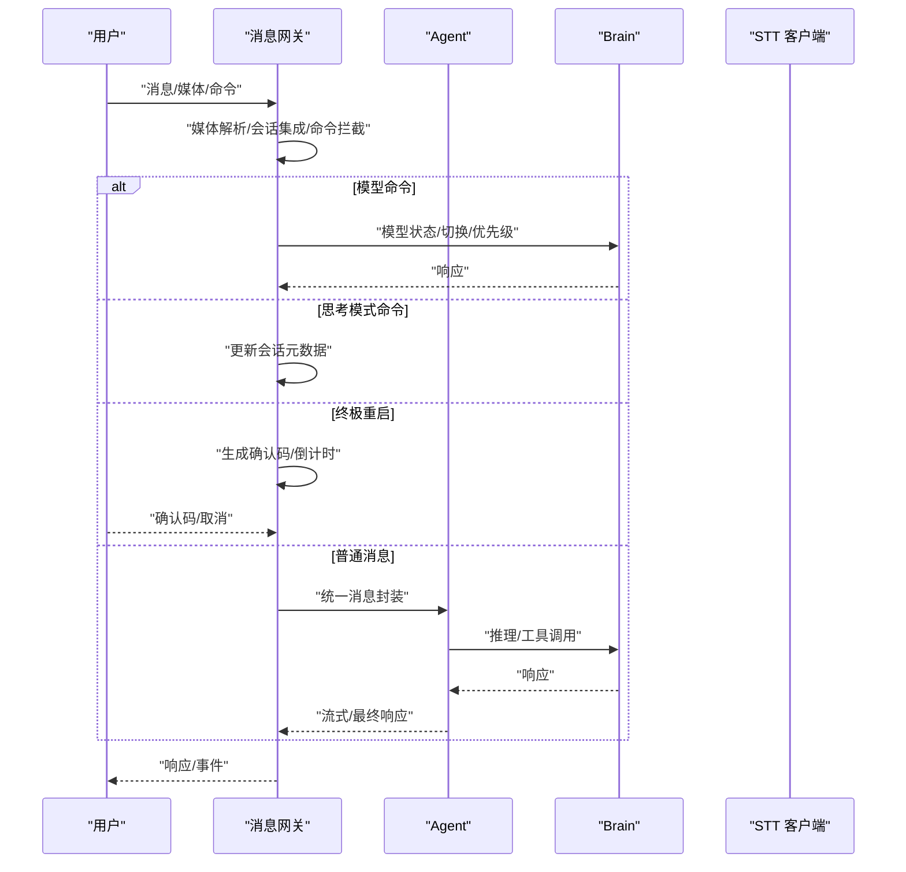
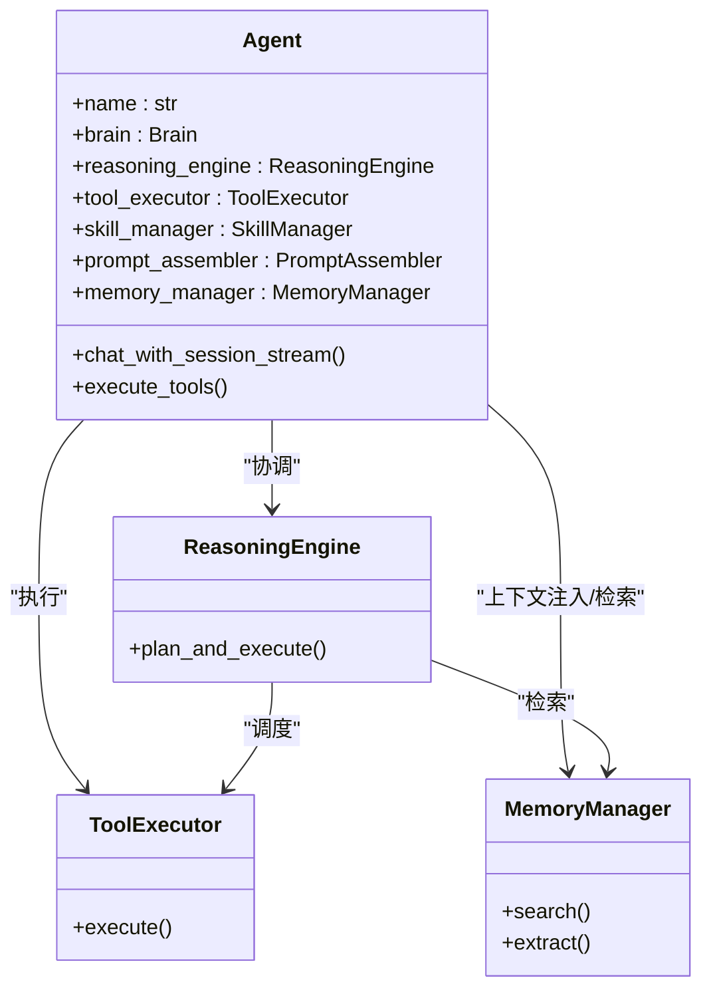
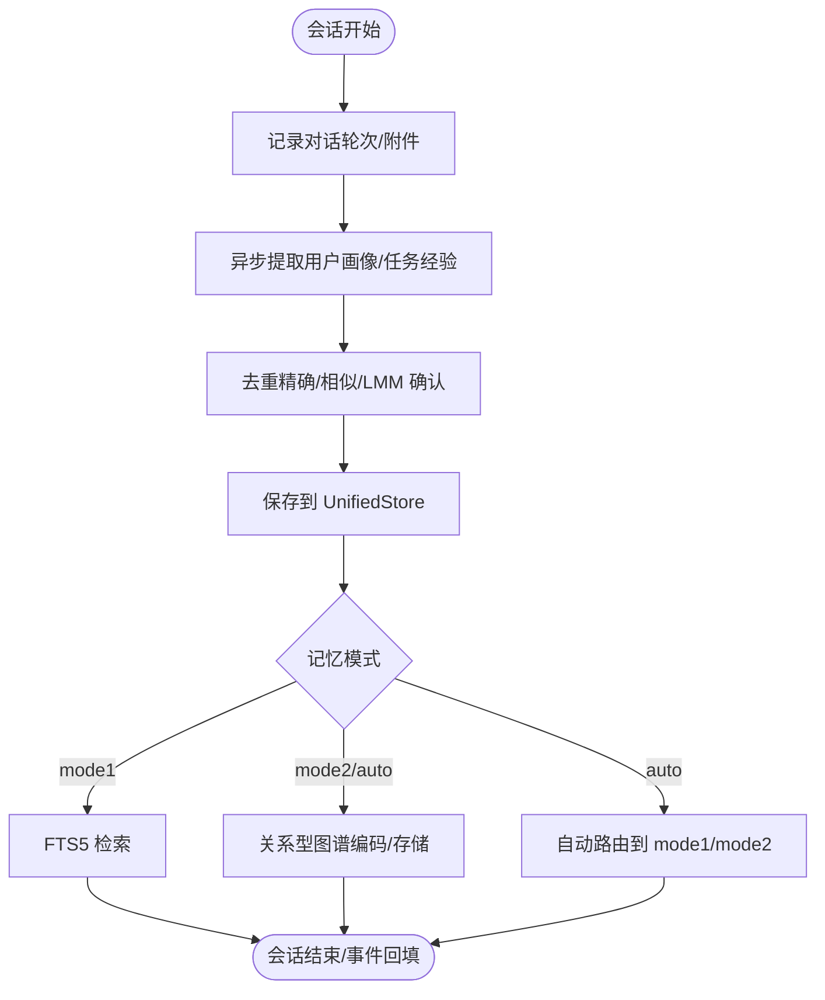
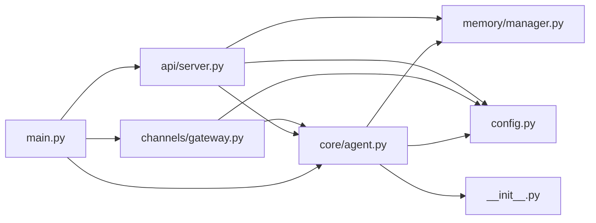

# 组件交互

<cite>
**本文引用的文件**
- [src/synapse/main.py](file://src/synapse/main.py)
- [src/synapse/api/server.py](file://src/synapse/api/server.py)
- [src/synapse/channels/gateway.py](file://src/synapse/channels/gateway.py)
- [src/synapse/core/agent.py](file://src/synapse/core/agent.py)
- [src/synapse/memory/manager.py](file://src/synapse/memory/manager.py)
- [src/synapse/config.py](file://src/synapse/config.py)
- [src/synapse/__init__.py](file://src/synapse/__init__.py)
- [synapse-plugin-sdk/docs/protocols.md](file://synapse-plugin-sdk/docs/protocols.md)
</cite>

## 目录
1. [简介](#简介)
2. [项目结构](#项目结构)
3. [核心组件](#核心组件)
4. [架构总览](#架构总览)
5. [详细组件分析](#详细组件分析)
6. [依赖分析](#依赖分析)
7. [性能考虑](#性能考虑)
8. [故障排查指南](#故障排查指南)
9. [结论](#结论)
10. [附录](#附录)

## 简介
本文件聚焦 Synapse 组件间的交互关系、数据流与通信协议，围绕 API 层、通道层、工具层、记忆层等核心模块，系统阐述它们如何协作完成消息接收、意图解析、工具调用、上下文压缩、记忆抽取与检索、以及状态同步与事件传播。文档提供时序图与数据流图，总结解耦策略、接口设计原则与依赖管理，并给出生命周期管理、错误处理与异常传播的实践建议，面向系统集成与二次开发提供实用指导。

## 项目结构
Synapse 采用分层与模块化设计：
- 入口与运行时：CLI/服务入口负责初始化配置、核心服务与组件池，统一启动 API 与 IM 通道。
- API 层：基于 FastAPI 提供 HTTP 接口，挂载路由并承载会话、聊天、技能、MCP、记忆、定时任务等能力。
- 通道层：消息网关统一接入多 IM 渠道（Telegram、飞书、企业微信、OneBot、QQ、微信等），负责路由、会话集成、媒体预处理、中断与系统命令拦截。
- 核心智能体：Agent 协调 Brain、ReasoningEngine、ToolExecutor、SkillManager、PromptAssembler 等子模块，执行 Ralph 循环与任务监控。
- 记忆层：MemoryManager 作为 v2 协调器，统一存储、检索与抽取，支持模式化记忆与关系型图谱。
- 配置与版本：集中配置与版本解析，贯穿各模块。

图表来源
- [src/synapse/main.py:1-800](file://src/synapse/main.py#L1-L800)
- [src/synapse/api/server.py:1-712](file://src/synapse/api/server.py#L1-L712)
- [src/synapse/channels/gateway.py:1-800](file://src/synapse/channels/gateway.py#L1-L800)
- [src/synapse/core/agent.py:1-800](file://src/synapse/core/agent.py#L1-L800)
- [src/synapse/memory/manager.py:1-800](file://src/synapse/memory/manager.py#L1-L800)
- [src/synapse/config.py:1-800](file://src/synapse/config.py#L1-L800)

章节来源
- [src/synapse/main.py:1-800](file://src/synapse/main.py#L1-L800)
- [src/synapse/config.py:1-800](file://src/synapse/config.py#L1-L800)

## 核心组件
- 入口与运行时
  - main.py：初始化日志、追踪、组件池、消息网关与会话管理，支持 IM 通道自动安装依赖、STT 客户端、多 Agent 协作与热重载。
  - config.py：集中配置与版本解析，提供 Settings 与 RuntimeState，支撑各模块运行参数与持久化。
- API 层
  - api/server.py：创建 FastAPI 应用，挂载认证、聊天、模型、技能、MCP、记忆、会话、定时任务、组织编排等路由，提供健康检查、文档与静态资源。
- 通道层
  - channels/gateway.py：统一消息入口/出口，负责路由、会话集成、媒体预处理、Agent 调用、消息中断机制、系统级命令拦截（模型切换、思考模式、终极重启）。
- 核心智能体
  - core/agent.py：协调 Brain、ReasoningEngine、ToolExecutor、SkillManager、PromptAssembler 等，执行 Ralph 循环、上下文压缩、工具并行与任务监控。
- 记忆层
  - memory/manager.py：v2 协调器，统一存储（UnifiedStore）、检索（RetrievalEngine）、抽取（MemoryExtractor）、整合（Consolidator），支持模式化记忆与关系型图谱。

章节来源
- [src/synapse/main.py:1-800](file://src/synapse/main.py#L1-L800)
- [src/synapse/api/server.py:1-712](file://src/synapse/api/server.py#L1-L712)
- [src/synapse/channels/gateway.py:1-800](file://src/synapse/channels/gateway.py#L1-L800)
- [src/synapse/core/agent.py:1-800](file://src/synapse/core/agent.py#L1-L800)
- [src/synapse/memory/manager.py:1-800](file://src/synapse/memory/manager.py#L1-L800)
- [src/synapse/config.py:1-800](file://src/synapse/config.py#L1-L800)

## 架构总览
Synapse 采用“双循环”事件驱动架构：引擎循环（engine loop）承载 Agent、OrgRuntime、Scheduler、Gateway 等重型异步工作；API 循环（API loop）独立处理 HTTP 请求与 WebSocket I/O，通过桥接实现跨循环调用。消息从通道层进入网关，经会话管理与媒体处理后交由 Agent，Agent 通过 ReasoningEngine 与 ToolExecutor 执行工具调用，记忆层参与上下文注入与检索，API 层提供对外接口与状态暴露。

图表来源
- [src/synapse/api/server.py:559-707](file://src/synapse/api/server.py#L559-L707)
- [src/synapse/channels/gateway.py:1-800](file://src/synapse/channels/gateway.py#L1-L800)
- [src/synapse/core/agent.py:1-800](file://src/synapse/core/agent.py#L1-L800)
- [src/synapse/memory/manager.py:1-800](file://src/synapse/memory/manager.py#L1-L800)

## 详细组件分析

### API 层（FastAPI）
- 职责
  - 提供认证、聊天（SSE）、模型列表、健康检查、技能管理、文件上传、MCP、记忆、会话、定时任务、组织编排等接口。
  - 支持 CORS、访问日志、文档静态资源与用户手册托管。
- 关键点
  - 双循环架构：API loop 与 engine loop 分离，API 仅处理 I/O，保证引擎饱和时的响应性。
  - 路由挂载：按模块组织路由，支持插件路由动态挂载。
  - 启动健康检查：在启动时对 LLM 与编译器端点进行健康检查。
- 交互
  - 通过 app.state 注入 Agent、SessionManager、Gateway、Orchestrator、AgentPool 等宿主引用，实现跨模块协作。

图表来源
- [src/synapse/api/server.py:210-556](file://src/synapse/api/server.py#L210-L556)

章节来源
- [src/synapse/api/server.py:1-712](file://src/synapse/api/server.py#L1-L712)

### 通道层（消息网关）
- 职责
  - 统一消息入口/出口：消息路由、会话管理集成、媒体预处理（图片、语音、视频）、Agent 调用、消息中断机制、系统级命令拦截。
- 关键点
  - 中断优先级与队列：NORMAL/HIGH/URGENT 三档优先级，支持在工具间隙插入新消息。
  - 模型命令处理：/model、/switch、/priority、/restore、/cancel 等系统级命令拦截，确保模型切换与恢复。
  - 思考模式命令：/thinking、/thinking_depth、/chain 等，动态调整思考模式与进度推送。
  - 终极重启命令：/restart → 生成确认码 → 用户回传确认码 → 触发重启，支持倒计时与取消。
- 交互
  - 与 SessionManager 集成，与 Agent 协作执行消息处理，通过 WebSocket 广播 IM 事件。

图表来源
- [src/synapse/channels/gateway.py:58-800](file://src/synapse/channels/gateway.py#L58-L800)

章节来源
- [src/synapse/channels/gateway.py:1-800](file://src/synapse/channels/gateway.py#L1-L800)

### 核心智能体（Agent）
- 职责
  - 协调 Brain、ReasoningEngine、ToolExecutor、SkillManager、PromptAssembler 等，执行 Ralph 循环、上下文压缩、工具并行与任务监控。
- 关键点
  - 工具目录与延迟加载：按上下文窗口与用户配置动态决定工具加载，支持 IM 会话自动包含 IM Channel 类别。
  - 并行执行：通过信号量与互斥锁控制工具并发，避免状态型工具（browser/desktop/mcp）并发冲突。
  - 任务取消与中断：统一使用 TaskState.cancelled 与 agent_state.is_task_cancelled，结合消息中断机制。
- 交互
  - 与 MemoryManager 协作进行上下文注入与检索，与 SessionManager 交互维护会话状态。

图表来源
- [src/synapse/core/agent.py:241-800](file://src/synapse/core/agent.py#L241-L800)

章节来源
- [src/synapse/core/agent.py:1-800](file://src/synapse/core/agent.py#L1-L800)

### 记忆层（MemoryManager）
- 职责
  - v2 协调器：统一存储（UnifiedStore）、检索（RetrievalEngine）、抽取（MemoryExtractor）、整合（Consolidator），支持模式化记忆与关系型图谱。
- 关键点
  - 三层注入：Scratchpad + Core Memory + Dynamic Memories；会话开始/结束时记录对话轮次与附件，异步提取并去重。
  - 模式化记忆：支持 mode1（碎片化）/mode2（关系型图谱）/auto（自动选择），关系型图谱在首次使用时惰性初始化。
  - 双写兼容：SQLite 为主，兼容 legacy JSON，提供回填与双写。
- 交互
  - 与 Agent 协作进行上下文注入与检索，与 SessionManager 集成会话状态。

图表来源
- [src/synapse/memory/manager.py:76-800](file://src/synapse/memory/manager.py#L76-L800)

章节来源
- [src/synapse/memory/manager.py:1-800](file://src/synapse/memory/manager.py#L1-L800)

### 配置与版本（Settings/RuntimeState）
- 职责
  - 统一配置与版本解析，提供 Settings 与 RuntimeState，支撑各模块运行参数与持久化。
- 关键点
  - Settings：涵盖 LLM、Agent、工具并行、上下文压缩、日志、MCP、调度器、记忆系统、通道、会话、UI 偏好、桌面通知、表情包、平台 Hub、追踪、评估等配置。
  - RuntimeState：轻量级运行时状态持久化，保存用户动态修改的设置（角色、活人感开关等）。
  - 版本解析：支持打包模式与开发模式，自动解析版本号与 Git 短哈希。

章节来源
- [src/synapse/config.py:17-800](file://src/synapse/config.py#L17-L800)
- [src/synapse/__init__.py:1-80](file://src/synapse/__init__.py#L1-L80)

### 插件协议与扩展（MemoryBackendProtocol）
- 职责
  - 通过协议扩展记忆系统：可替换或增强内置记忆，支持存储、检索、删除、上下文注入、会话生命周期钩子。
- 关键点
  - 协议定义：MemoryBackendProtocol，支持内存/磁盘/向量/API 等多种后端。
  - 权限与替换：完全替换需系统级权限；可与内置后端共存或替换。

章节来源
- [synapse-plugin-sdk/docs/protocols.md:1-47](file://synapse-plugin-sdk/docs/protocols.md#L1-L47)

## 依赖分析
- 组件耦合与内聚
  - Agent 作为主协调器，内聚度高，与 Brain、ReasoningEngine、ToolExecutor、SkillManager、PromptAssembler、MemoryManager 等形成强内聚弱耦合。
  - 通道层与 API 层通过 app.state 注入的宿主引用松耦合协作，避免直接 import 循环。
  - 记忆层通过 UnifiedStore 与检索引擎抽象，支持多种后端与模式切换。
- 直接与间接依赖
  - main.py 直接依赖 channels、sessions、agents、llm 等模块；API 层依赖 routes 与 auth；通道层依赖 SessionManager 与 ChannelAdapter；Agent 依赖 MemoryManager、SkillManager、ToolExecutor 等。
- 外部依赖与集成点
  - LLM/编译器健康检查、MCP 服务器、IM 渠道适配器、WebSocket 广播、静态资源托管等。
- 接口契约与实现细节
  - API 层通过 app.state 暴露宿主引用，通道层通过回调与事件广播与 API 层互通，Agent 通过 MemoryManager 与工具层解耦。

图表来源
- [src/synapse/main.py:1-800](file://src/synapse/main.py#L1-L800)
- [src/synapse/api/server.py:1-712](file://src/synapse/api/server.py#L1-L712)
- [src/synapse/channels/gateway.py:1-800](file://src/synapse/channels/gateway.py#L1-L800)
- [src/synapse/core/agent.py:1-800](file://src/synapse/core/agent.py#L1-L800)
- [src/synapse/memory/manager.py:1-800](file://src/synapse/memory/manager.py#L1-L800)
- [src/synapse/config.py:1-800](file://src/synapse/config.py#L1-L800)
- [src/synapse/__init__.py:1-80](file://src/synapse/__init__.py#L1-L80)

章节来源
- [src/synapse/main.py:1-800](file://src/synapse/main.py#L1-L800)
- [src/synapse/api/server.py:1-712](file://src/synapse/api/server.py#L1-L712)
- [src/synapse/channels/gateway.py:1-800](file://src/synapse/channels/gateway.py#L1-L800)
- [src/synapse/core/agent.py:1-800](file://src/synapse/core/agent.py#L1-L800)
- [src/synapse/memory/manager.py:1-800](file://src/synapse/memory/manager.py#L1-L800)
- [src/synapse/config.py:1-800](file://src/synapse/config.py#L1-L800)
- [src/synapse/__init__.py:1-80](file://src/synapse/__init__.py#L1-L80)

## 性能考虑
- 双循环架构
  - API loop 与 engine loop 分离，避免 I/O 阻塞引擎，保证在高并发 LLM 调用场景下的响应性。
- 工具并行与互斥
  - 通过信号量与互斥锁控制工具并发，避免状态型工具并发冲突；合理设置 tool_max_parallel 与 allow_parallel_tools_with_interrupt_checks。
- 上下文压缩与窗口管理
  - 基于 ContextManager 的压缩策略与边界压缩，减少 token 使用；针对小上下文窗口模型裁剪工具集。
- 记忆检索与去重
  - UnifiedStore + 检索引擎 + 多层去重（精确/相似/LLM 确认），降低冗余与重复检索成本。
- 会话与媒体处理
  - 会话缓冲与附件记录，异步提取与评分，避免阻塞主线程。

## 故障排查指南
- 启动与依赖
  - IM 通道依赖自动安装：若安装失败，检查镜像源与 Python 运行时，查看安装日志与模块导入失败信息。
  - API 服务端口占用：启动前检测端口可用，必要时等待释放或更换端口。
- 健康检查
  - LLM 与编译器端点健康检查失败时，关注端点状态与错误日志，必要时降级使用主模型。
- 错误传播
  - API 层统一异常处理，将 Pydantic 验证错误扁平化返回；通道层与 Agent 层通过统一错误格式化与用户友好提示。
- 重启与中断
  - 终极重启命令需确认码，支持倒计时与取消；消息中断机制在工具间隙插入新消息，注意优先级与超时控制。

章节来源
- [src/synapse/main.py:558-707](file://src/synapse/main.py#L558-L707)
- [src/synapse/api/server.py:261-274](file://src/synapse/api/server.py#L261-L274)
- [src/synapse/channels/gateway.py:658-800](file://src/synapse/channels/gateway.py#L658-L800)

## 结论
Synapse 通过清晰的分层与模块化设计，实现了 API 层、通道层、工具层与记忆层的高效协同。双循环架构保障了 I/O 与计算的解耦，消息网关提供了强大的中断与系统命令拦截能力，Agent 作为主协调器整合推理、工具与记忆，MemoryManager 支撑多模式记忆与关系型图谱。配置与版本管理贯穿始终，插件协议为扩展提供了标准化接口。整体架构具备良好的可扩展性与可维护性，适合系统集成与二次开发。

## 附录
- 交互示例
  - IM 消息处理：用户在 Telegram/飞书等渠道发送消息，消息网关进行媒体解析与会话集成，交由 Agent 执行推理与工具调用，响应通过网关与 API 层返回。
  - 记忆抽取：会话结束时，MemoryManager 生成 Episode 并进行用户画像与任务经验抽取，异步去重后保存到 UnifiedStore。
- 最佳实践
  - 合理配置工具并行与互斥，避免状态型工具并发冲突。
  - 使用会话元数据控制思考模式与进度推送，减少不必要的消息刷屏。
  - 通过插件协议扩展记忆后端，确保权限与替换策略符合业务需求。
  - 在生产环境中启用健康检查与追踪，便于问题定位与性能优化。