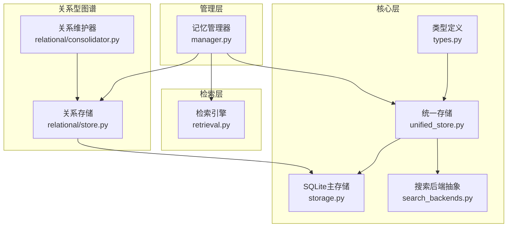
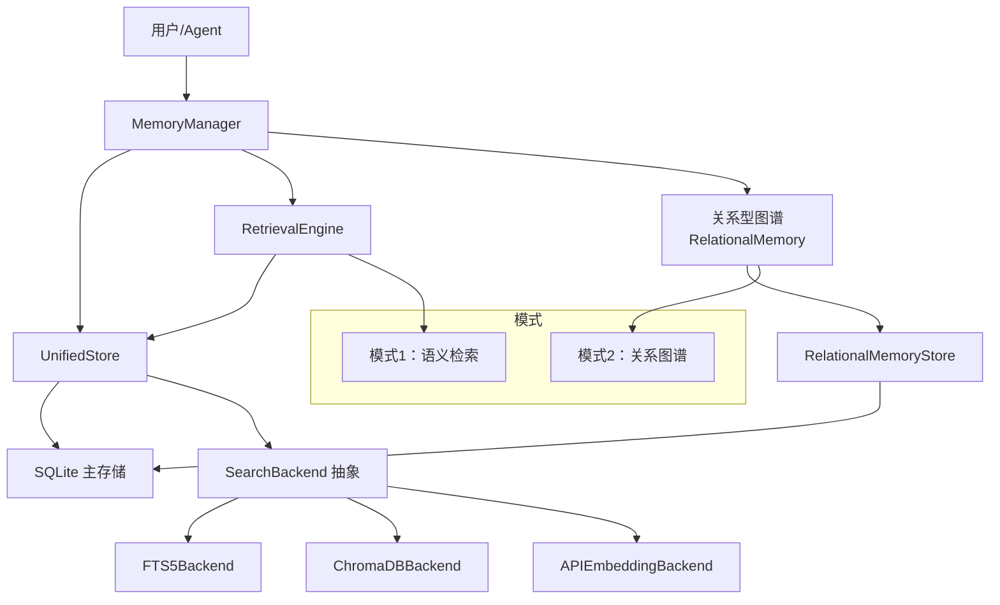
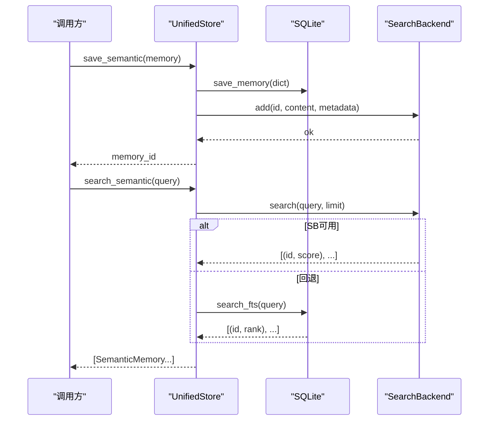
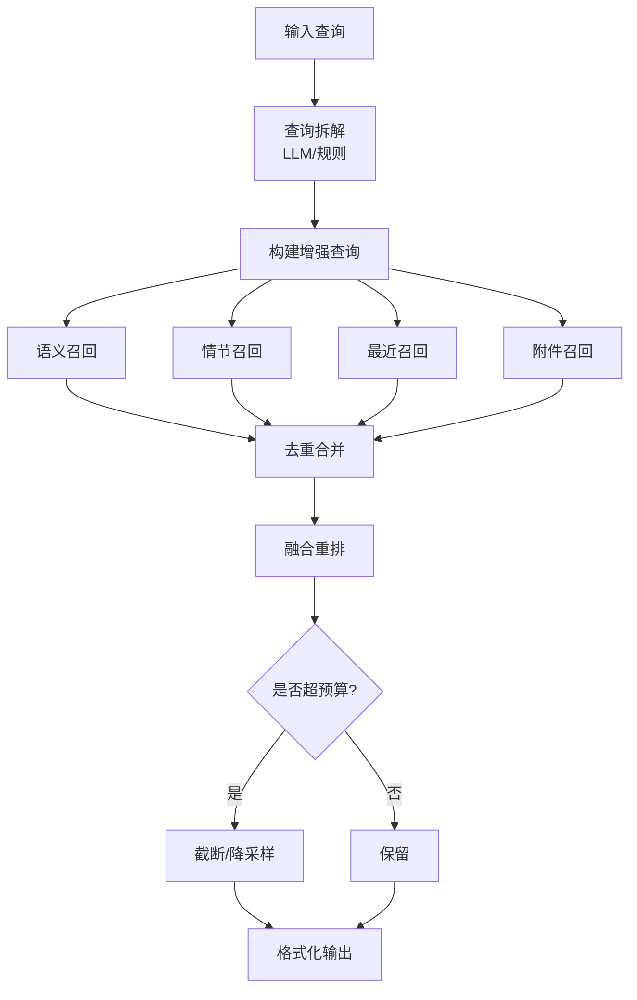
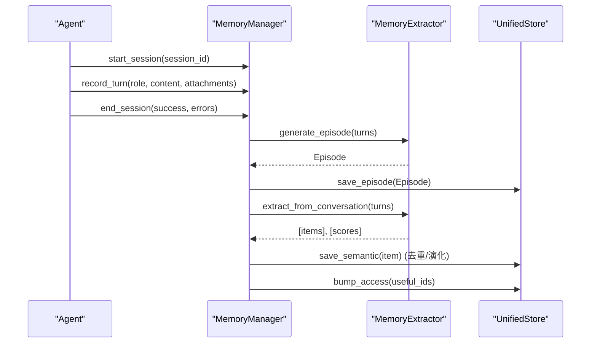
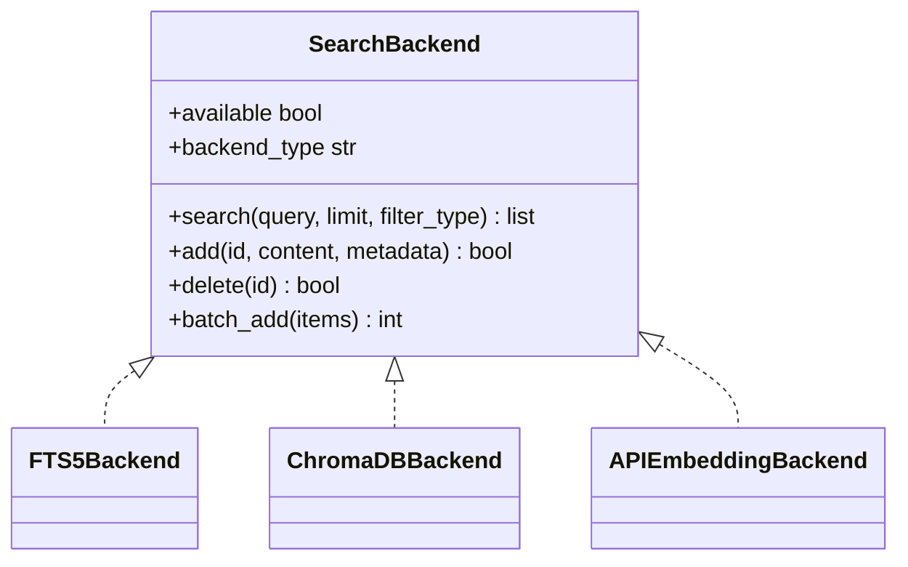
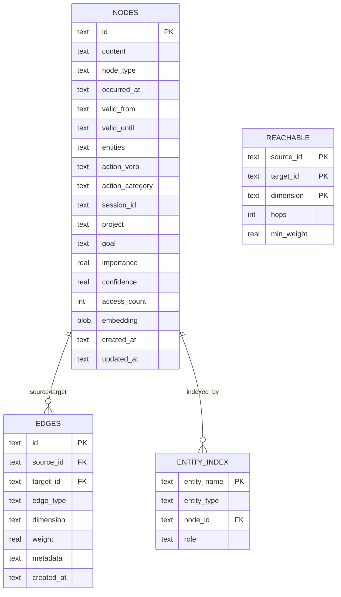
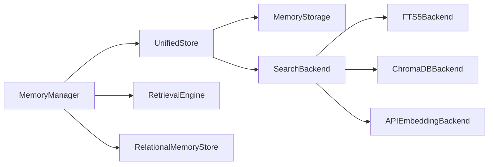

# 记忆交互

<cite>
**本文引用的文件**
- [memory/__init__.py](file://src/synapse/memory/__init__.py)
- [memory/unified_store.py](file://src/synapse/memory/unified_store.py)
- [memory/manager.py](file://src/synapse/memory/manager.py)
- [memory/retrieval.py](file://src/synapse/memory/retrieval.py)
- [memory/types.py](file://src/synapse/memory/types.py)
- [memory/search_backends.py](file://src/synapse/memory/search_backends.py)
- [memory/storage.py](file://src/synapse/memory/storage.py)
- [memory/relational/store.py](file://src/synapse/memory/relational/store.py)
- [memory/relational/consolidator.py](file://src/synapse/memory/relational/consolidator.py)
- [memory/relational/__init__.py](file://src/synapse/memory/relational/__init__.py)
- [memory_architecture.md](file://docs/memory_architecture.md)
- [README.md](file://README.md)
- [test_unified_store.py](file://tests/unit/test_unified_store.py)
- [test_unified_store_extra.py](file://tests/unit/test_unified_store_extra.py)
- [test_search_backends_extra.py](file://tests/unit/test_search_backends_extra.py)
</cite>

## 目录
1. [简介](#简介)
2. [项目结构](#项目结构)
3. [核心组件](#核心组件)
4. [架构总览](#架构总览)
5. [详细组件分析](#详细组件分析)
6. [依赖关系分析](#依赖关系分析)
7. [性能考量](#性能考量)
8. [故障排查指南](#故障排查指南)
9. [结论](#结论)
10. [附录](#附录)

## 简介
本文件面向Synapse记忆交互系统，围绕“双模式架构”与“统一存储”展开，系统阐述：
- 双模式架构：语义检索模式（Mode 1）与关系型图谱模式（Mode 2）的职责边界、协同与智能切换。
- 统一存储：以SQLite为主存储，配合可插拔搜索后端（FTS5/向量/在线Embedding）实现结构化与语义检索一体化。
- 生命周期与一致性：从写入、去重、衰减到过期清理的全链路保障。
- 检索引擎：多路召回、LLM查询拆解、融合重排与Token预算控制。
- 关系型图谱：实体解析、边权维护、可达表与多跳遍历。
- 配置与扩展：后端选择、缓存策略、性能调优与自定义存储后端。

## 项目结构
记忆系统位于src/synapse/memory目录，采用“类型定义 + 存储层 + 检索引擎 + 管理器”的分层设计，并在docs中提供了完整的架构说明与数据流图示。

图表来源
- [memory/__init__.py:1-67](file://src/synapse/memory/__init__.py#L1-L67)
- [memory/unified_store.py:1-389](file://src/synapse/memory/unified_store.py#L1-L389)
- [memory/storage.py:1-800](file://src/synapse/memory/storage.py#L1-L800)
- [memory/search_backends.py:1-396](file://src/synapse/memory/search_backends.py#L1-L396)
- [memory/retrieval.py:1-846](file://src/synapse/memory/retrieval.py#L1-L846)
- [memory/manager.py:1-1361](file://src/synapse/memory/manager.py#L1-L1361)
- [memory/relational/store.py:1-782](file://src/synapse/memory/relational/store.py#L1-L782)
- [memory/relational/consolidator.py:1-47](file://src/synapse/memory/relational/consolidator.py#L1-L47)

章节来源
- [memory_architecture.md:1-310](file://docs/memory_architecture.md#L1-L310)

## 核心组件
- 统一存储层（UnifiedStore）：协调SQLite主存储与可插拔搜索后端，负责写入一致性、重复检测与回退策略。
- 检索引擎（RetrievalEngine）：多路召回（语义/情节/最近/附件）+ LLM查询拆解 + 融合重排 + Token预算控制。
- 记忆管理器（MemoryManager）：生命周期管理、模式切换、主题切换提取、引用评分与批处理。
- 搜索后端（SearchBackend）：FTS5（默认）、ChromaDB（向量）、APIEmbedding（在线）三种实现。
- 关系型图谱（RelationalMemory）：节点/边/实体索引、可达表、实体消歧与周期性维护。
- 类型系统（types）：语义记忆、情节记忆、工作记忆草稿本、附件等数据模型。

章节来源
- [memory/__init__.py:1-67](file://src/synapse/memory/__init__.py#L1-L67)
- [memory/types.py:1-638](file://src/synapse/memory/types.py#L1-L638)

## 架构总览
双模式架构与统一存储的关系如下：

图表来源
- [memory/manager.py:623-800](file://src/synapse/memory/manager.py#L623-L800)
- [memory/retrieval.py:49-800](file://src/synapse/memory/retrieval.py#L49-L800)
- [memory/unified_store.py:29-389](file://src/synapse/memory/unified_store.py#L29-L389)
- [memory/search_backends.py:29-396](file://src/synapse/memory/search_backends.py#L29-L396)
- [memory/relational/store.py:24-782](file://src/synapse/memory/relational/store.py#L24-L782)

章节来源
- [README.md:528-553](file://README.md#L528-L553)
- [memory_architecture.md:1-310](file://docs/memory_architecture.md#L1-L310)

## 详细组件分析

### 统一存储层（UnifiedStore）
- 设计要点
  - 写入：先写SQLite，再同步到SearchBackend索引。
  - 查询：结构化查询走SQLite，语义搜索走SearchBackend；若不可用则回退到FTS5。
  - 去重：基于内容近似与语义相似度的双重去重策略。
- 关键能力
  - 语义记忆CRUD：保存、更新、删除、查询、相似查找。
  - 会话/回合/附件/情节记忆：统一接口，内部路由至SQLite。
  - 访问统计：批量提升访问计数，驱动后续重排与衰减。
  - 统计与关闭：提供存储统计与资源释放。

图表来源
- [memory/unified_store.py:65-224](file://src/synapse/memory/unified_store.py#L65-L224)
- [memory/storage.py:484-752](file://src/synapse/memory/storage.py#L484-L752)
- [memory/search_backends.py:81-108](file://src/synapse/memory/search_backends.py#L81-L108)

章节来源
- [memory/unified_store.py:1-389](file://src/synapse/memory/unified_store.py#L1-L389)
- [test_unified_store.py:1-44](file://tests/unit/test_unified_store.py#L1-L44)
- [test_unified_store_extra.py:1-47](file://tests/unit/test_unified_store_extra.py#L1-L47)

### 检索引擎（RetrievalEngine）
- 多路召回
  - 语义：来自UnifiedStore的语义搜索。
  - 情节：按实体关键词召回Episode。
  - 最近：按重要度与时间阈值召回。
  - 附件：针对媒体/文件关键词的附件检索。
- 查询拆解与增强
  - LLM拆解：抽取关键词与意图（搜索记忆/搜索文件/通用）。
  - 规则降级：正则+停用词过滤，支持文件路径/扩展名识别。
  - 上下文增强：拼接近期对话与拆解关键词。
- 融合重排
  - 综合得分 = relevance×权重 + recency×权重 + importance×权重 + access×权重。
  - 可按Persona与记忆类型进行微调。
- Token预算控制：格式化输出时限制最大Token数。

图表来源
- [memory/retrieval.py:81-150](file://src/synapse/memory/retrieval.py#L81-L150)
- [memory/retrieval.py:230-401](file://src/synapse/memory/retrieval.py#L230-L401)
- [memory/retrieval.py:778-799](file://src/synapse/memory/retrieval.py#L778-L799)

章节来源
- [memory/retrieval.py:1-846](file://src/synapse/memory/retrieval.py#L1-L846)

### 记忆管理器（MemoryManager）
- 生命周期与模式切换
  - 主题切换提取：对累积的对话轮次进行异步提取，应用LLM评分并提升访问频次。
  - 会话管理：记录对话轮次、附件、引用记忆；会话结束生成Episode并回填链接。
  - 模式2（关系型图谱）：按配置在会话结束或自动模式下编码节点/边，周期性维护。
- 去重与演化
  - L1：subject+predicate完全匹配，直接演化已有记忆。
  - L2：内容相似度搜索，必要时调用LLM确认是否重复。
- 缓存与兼容
  - 保留memories.json作为向后兼容的双写目标。
  - 进程级共享存储实例，避免重复连接。

图表来源
- [memory/manager.py:318-800](file://src/synapse/memory/manager.py#L318-L800)

章节来源
- [memory/manager.py:1-1361](file://src/synapse/memory/manager.py#L1-L1361)

### 搜索后端（SearchBackend）
- FTS5Backend（默认）
  - jieba中文分词，BM25排序，零外部依赖，零初始化延迟。
- ChromaDBBackend（可选）
  - 封装VectorStore，适配SearchBackend接口，距离→相似度转换。
- APIEmbeddingBackend（可选）
  - DashScope/OpenAI在线Embedding，支持维度与缓存，缓存表位于SQLite。

图表来源
- [memory/search_backends.py:29-396](file://src/synapse/memory/search_backends.py#L29-L396)

章节来源
- [memory/search_backends.py:1-396](file://src/synapse/memory/search_backends.py#L1-L396)
- [test_search_backends_extra.py:51-86](file://tests/unit/test_search_backends_extra.py#L51-L86)

### 关系型图谱（RelationalMemory）
- 数据模型
  - 节点：事件/事实/决策/目标等，包含实体、动作、时间、重要度、置信度等。
  - 边：关系类型与维度（时间/因果/实体/动作/上下文），带权重与元数据。
  - 实体索引：实体名→节点映射，支持别名表与规范化。
- 存储与维护
  - RelationalMemoryStore：节点/边/实体索引/可达表的CRUD与查询。
  - RelationalConsolidator：重建可达表、边权Hebbian强化、时间衰减、弱边修剪、实体消歧。
- 检索与可视化
  - FTS5（关系专用）：CJK大二分类词，BM25排序。
  - 多跳遍历：基于可达表进行1-2跳路径聚合。

图表来源
- [memory/relational/store.py:35-93](file://src/synapse/memory/relational/store.py#L35-L93)

章节来源
- [memory/relational/store.py:1-782](file://src/synapse/memory/relational/store.py#L1-L782)
- [memory/relational/consolidator.py:1-47](file://src/synapse/memory/relational/consolidator.py#L1-L47)
- [memory/relational/__init__.py:1-1](file://src/synapse/memory/relational/__init__.py#L1-L1)

## 依赖关系分析
- 组件耦合
  - MemoryManager依赖UnifiedStore、RetrievalEngine、RelationalMemory（按需懒加载）。
  - UnifiedStore依赖MemoryStorage与SearchBackend协议，实现“主存储+可插拔索引”。
  - RelationalMemoryStore依赖SQLite连接，独立于主语义存储。
- 外部依赖
  - FTS5：SQLite内建全文索引。
  - ChromaDB：可选，需安装依赖。
  - httpx：在线Embedding API调用。
- 循环依赖
  - 未发现循环导入；RelationalMemory按需初始化，避免不必要的耦合。

图表来源
- [memory/manager.py:76-136](file://src/synapse/memory/manager.py#L76-L136)
- [memory/unified_store.py:29-60](file://src/synapse/memory/unified_store.py#L29-L60)
- [memory/search_backends.py:359-396](file://src/synapse/memory/search_backends.py#L359-L396)

章节来源
- [memory/__init__.py:1-67](file://src/synapse/memory/__init__.py#L1-L67)

## 性能考量
- 写入性能
  - SQLite WAL模式、适度busy_timeout，减少锁竞争。
  - 批量写入：UnifiedStore支持批量保存语义记忆，降低事务开销。
- 检索性能
  - FTS5：内置BM25，中文分词，零外部依赖，适合大规模全文检索。
  - 向量检索：ChromaDBBackend在语义相似度上表现更佳，但需额外依赖与资源。
  - 在线Embedding：带缓存，避免重复请求，建议合理设置维度与缓存表。
- 重排与预算
  - RetrievalEngine融合重排时加入Recency/Importance/Access权重，结合Token预算控制输出长度。
- 关系图谱
  - 可达表（1-2跳）显著降低多跳遍历成本；周期性维护确保权重与连通性准确。

章节来源
- [memory/storage.py:83-101](file://src/synapse/memory/storage.py#L83-L101)
- [memory/unified_store.py:506-524](file://src/synapse/memory/unified_store.py#L506-L524)
- [memory/retrieval.py:778-799](file://src/synapse/memory/retrieval.py#L778-L799)
- [memory/relational/store.py:580-634](file://src/synapse/memory/relational/store.py#L580-L634)

## 故障排查指南
- 写入失败（数据库锁）
  - 现象：OperationalError包含“locked”。
  - 处理：检查并发写入、适当增大busy_timeout、避免长时间持有锁。
- 搜索后端不可用
  - 现象：ChromaDB不可用或API Key缺失。
  - 处理：自动回退到FTS5；检查环境变量与网络；确认API Key与模型配置。
- 去重误判
  - 现象：重复记忆未被识别。
  - 处理：检查L1（subject+predicate）与L2（相似度+LLM）逻辑；调整阈值与提示词。
- 关系图谱异常
  - 现象：可达表为空或权重异常。
  - 处理：触发重建可达表；检查边权衰减与修剪阈值；校验实体别名表。

章节来源
- [memory/storage.py:51-53](file://src/synapse/memory/storage.py#L51-L53)
- [memory/search_backends.py:371-395](file://src/synapse/memory/search_backends.py#L371-L395)
- [memory/manager.py:557-601](file://src/synapse/memory/manager.py#L557-L601)
- [memory/relational/store.py:580-680](file://src/synapse/memory/relational/store.py#L580-L680)

## 结论
Synapse记忆交互系统通过“统一存储 + 双模式检索”的设计，在保证数据一致性的同时，兼顾了语义检索的灵活性与关系图谱的深度推理能力。管理器负责生命周期与模式切换，检索引擎提供稳健的召回与重排策略，关系型图谱则支撑复杂因果/实体/时间等维度的深层连接。通过可插拔的搜索后端与完善的缓存策略，系统在易用性、性能与可扩展性之间取得平衡。

## 附录

### 配置选项与扩展接口
- 搜索后端选择
  - backend_type: "fts5" | "chromadb" | "api_embedding"
  - 向量模型与设备：embedding_model/device/download_source
  - API配置：embedding_api_provider/key/model/dimensions
- 关系型图谱
  - 按需启用，首次使用时懒加载；支持实体别名与可达表维护。
- 扩展接口
  - 实现SearchBackend协议即可接入新的向量/语义后端。
  - 插件可通过RetrievalEngine注册外部检索源与钩子。

章节来源
- [memory/manager.py:79-129](file://src/synapse/memory/manager.py#L79-L129)
- [memory/search_backends.py:359-396](file://src/synapse/memory/search_backends.py#L359-L396)
- [memory/retrieval.py:155-225](file://src/synapse/memory/retrieval.py#L155-L225)