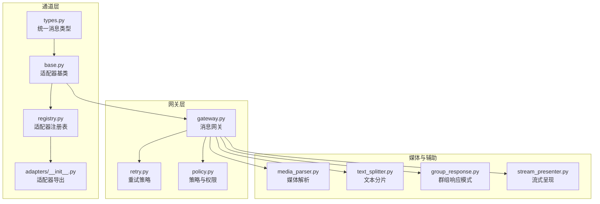
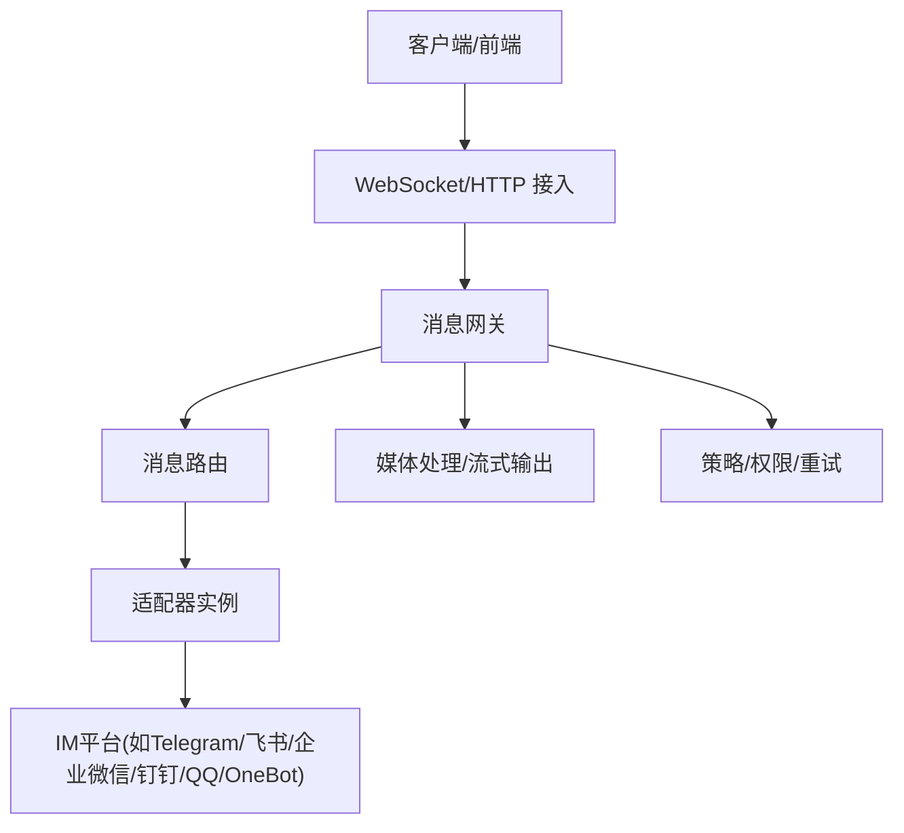
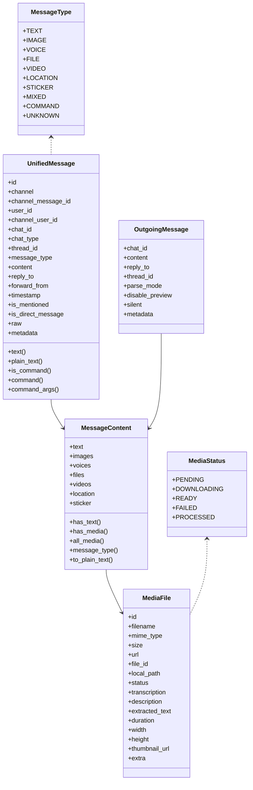
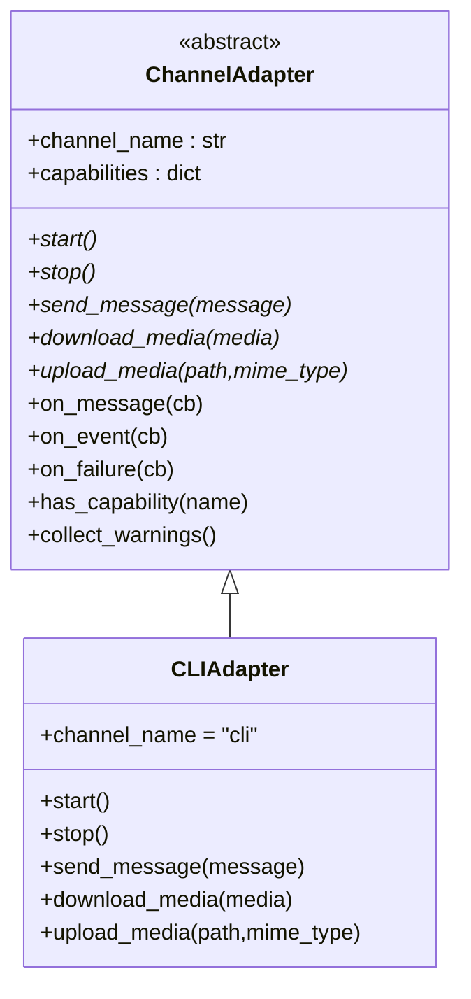
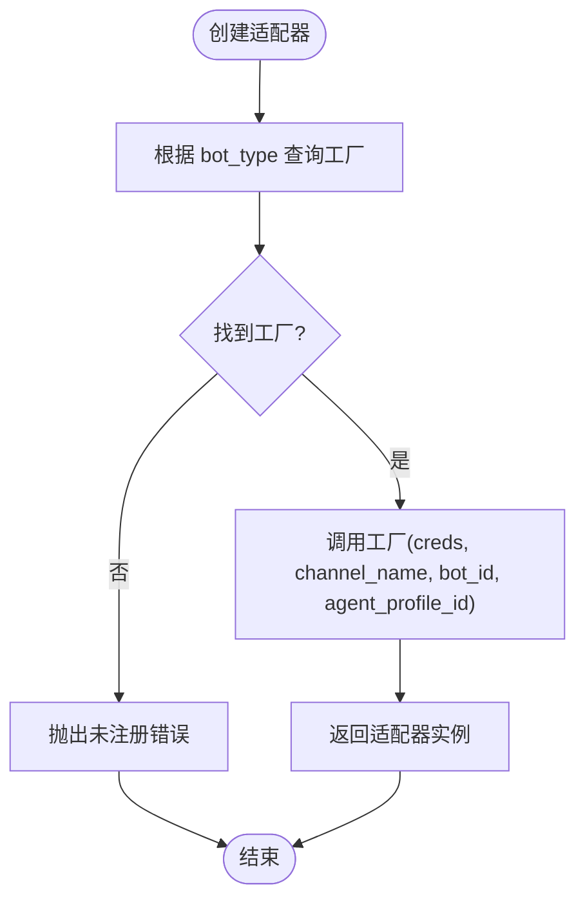
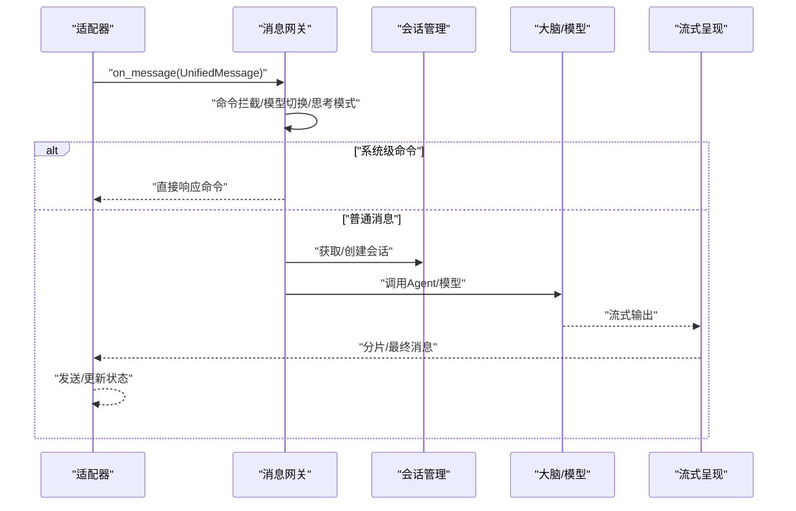
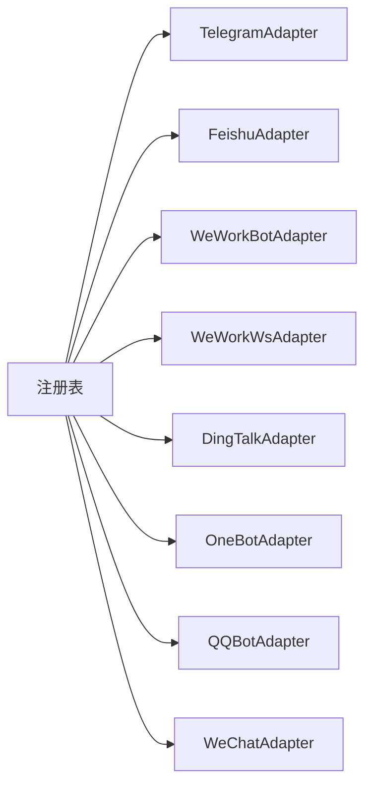
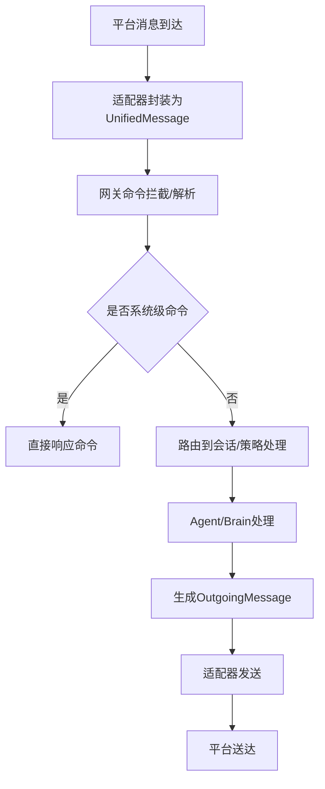
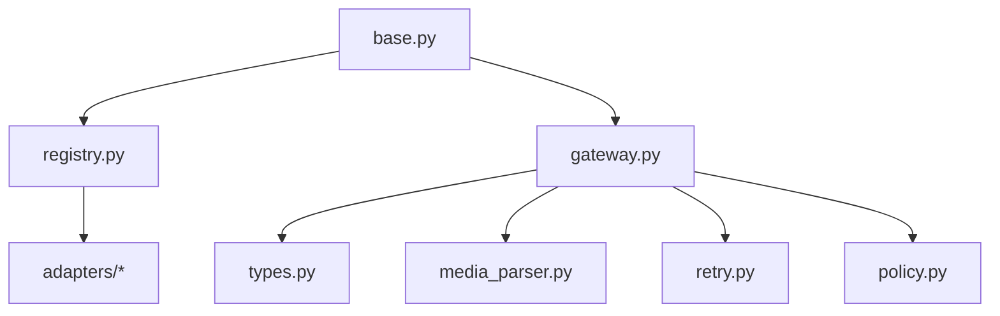

# 通道交互

<cite>
**本文引用的文件**
- [channels/__init__.py](file://src/synapse/channels/__init__.py)
- [channels/base.py](file://src/synapse/channels/base.py)
- [channels/registry.py](file://src/synapse/channels/registry.py)
- [channels/gateway.py](file://src/synapse/channels/gateway.py)
- [channels/types.py](file://src/synapse/channels/types.py)
- [channels/adapters/__init__.py](file://src/synapse/channels/adapters/__init__.py)
- [channels/retry.py](file://src/synapse/channels/retry.py)
- [channels/policy.py](file://src/synapse/channels/policy.py)
- [channels/bot_config.py](file://src/synapse/channels/bot_config.py)
- [channels/dm_pairing.py](file://src/synapse/channels/dm_pairing.py)
- [channels/text_splitter.py](file://src/synapse/channels/text_splitter.py)
- [channels/group_response.py](file://src/synapse/channels/group_response.py)
- [channels/media_parser.py](file://src/synapse/channels/media_parser.py)
- [channels/stream_presenter.py](file://src/synapse/channels/stream_presenter.py)
- [channels/chat_aliases.py](file://src/synapse/channels/chat_aliases.py)
- [channels/slash_commands.py](file://src/synapse/channels/slash_commands.py)
- [channels/deps.py](file://src/synapse/channels/deps.py)
- [channels/types.py](file://src/synapse/channels/types.py)
- [docs/im-channels.md](file://docs/im-channels.md)
- [docs/TELEGRAM_IM_NOTES.md](file://docs/TELEGRAM_IM_NOTES.md)
- [docs/WECHAT_IM_NOTES.md](file://docs/WECHAT_IM_NOTES.md)
- [docs/WEWORK_WS_IM_NOTES.md](file://docs/WEWORK_WS_IM_NOTES.md)
- [docs/DINGTALK_IM_NOTES.md](file://docs/DINGTALK_IM_NOTES.md)
- [docs/ONEBOT_IM_NOTES.md](file://docs/ONEBOT_IM_NOTES.md)
- [scripts/run_telegram_bot.py](file://scripts/run_telegram_bot.py)
- [scripts/test_feishu.py](file://scripts/test_feishu.py)
- [scripts/test_17_changes.py](file://scripts/test_17_changes.py)
- [scripts/test_feishu.py](file://scripts/test_feishu.py)
- [scripts/test_memory_e2e.py](file://scripts/test_memory_e2e.py)
- [scripts/test_memory_e2e_v2.py](file://scripts/test_memory_e2e_v2.py)
- [scripts/test_memory_e2e_v3.py](file://scripts/test_memory_e2e_v3.py)
- [scripts/test_model_switch.py](file://scripts/test_model_switch.py)
- [scripts/test_org_full_task.py](file://scripts/test_org_full_task.py)
- [scripts/tool_parallel_demo.py](file://scripts/tool_parallel_demo.py)
- [scripts/quickstart.sh](file://scripts/quickstart.sh)
- [scripts/quickstart.ps1](file://scripts/quickstart.ps1)
- [examples/plugins/echo-channel/src/main.py](file://examples/plugins/echo-channel/src/main.py)
- [examples/plugins/whatsapp-channel/src/main.py](file://examples/plugins/whatsapp-channel/src/main.py)
</cite>

## 目录
1. [简介](#简介)
2. [项目结构](#项目结构)
3. [核心组件](#核心组件)
4. [架构总览](#架构总览)
5. [详细组件分析](#详细组件分析)
6. [依赖分析](#依赖分析)
7. [性能考虑](#性能考虑)
8. [故障排查指南](#故障排查指南)
9. [结论](#结论)
10. [附录](#附录)

## 简介
本文件面向Synapse通道交互系统，聚焦IM通道的架构设计与消息路由机制，系统性阐述通道注册表、适配器模式、消息网关、媒体处理与流式输出、通道状态与重连策略、错误处理与扫码绑定流程、用户身份验证与权限控制，并提供扩展开发指南与自定义适配器实现参考路径。

## 项目结构
通道交互相关代码主要位于src/synapse/channels目录，围绕“统一消息类型”“适配器基类”“适配器注册表”“消息网关”四大支柱构建，辅以媒体解析、分片展示、群组响应模式、策略与重试等子模块，形成跨平台IM适配的统一框架。

**图表来源**
- [channels/types.py:1-615](file://src/synapse/channels/types.py#L1-L615)
- [channels/base.py:1-458](file://src/synapse/channels/base.py#L1-L458)
- [channels/registry.py:1-227](file://src/synapse/channels/registry.py#L1-L227)
- [channels/adapters/__init__.py:1-34](file://src/synapse/channels/adapters/__init__.py#L1-L34)
- [channels/gateway.py:1-800](file://src/synapse/channels/gateway.py#L1-L800)
- [channels/retry.py](file://src/synapse/channels/retry.py)
- [channels/policy.py](file://src/synapse/channels/policy.py)
- [channels/media_parser.py](file://src/synapse/channels/media_parser.py)
- [channels/text_splitter.py](file://src/synapse/channels/text_splitter.py)
- [channels/group_response.py](file://src/synapse/channels/group_response.py)
- [channels/stream_presenter.py](file://src/synapse/channels/stream_presenter.py)

**章节来源**
- [channels/__init__.py:1-33](file://src/synapse/channels/__init__.py#L1-L33)
- [channels/types.py:1-615](file://src/synapse/channels/types.py#L1-L615)
- [channels/base.py:1-458](file://src/synapse/channels/base.py#L1-L458)
- [channels/registry.py:1-227](file://src/synapse/channels/registry.py#L1-L227)
- [channels/gateway.py:1-800](file://src/synapse/channels/gateway.py#L1-L800)

## 核心组件
- 统一消息类型：定义跨平台一致的消息结构，包括消息体、内容体、媒体文件、消息类型枚举等，支撑多模态内容的统一表达与LLM输入转换。
- 适配器基类：抽象IM通道适配器的生命周期、消息收发、媒体下载/上传、回调注册、可选能力声明与告警检查，确保不同平台实现的一致契约。
- 适配器注册表：集中管理各平台适配器的工厂函数，支持动态注册/注销，屏蔽创建细节，便于扩展与插件化。
- 消息网关：统一消息入口/出口，负责路由、会话集成、媒体预处理、Agent调用、中断机制、系统级命令拦截（模型切换、思考模式、终极重启）、WS广播等。

**章节来源**
- [channels/types.py:18-615](file://src/synapse/channels/types.py#L18-L615)
- [channels/base.py:38-458](file://src/synapse/channels/base.py#L38-L458)
- [channels/registry.py:22-227](file://src/synapse/channels/registry.py#L22-L227)
- [channels/gateway.py:1-800](file://src/synapse/channels/gateway.py#L1-L800)

## 架构总览
通道交互采用“适配器+网关”的分层架构：上层通过网关统一接入，下层通过适配器对接各IM平台；注册表负责实例化与生命周期管理；类型系统保证跨平台一致性；媒体与流式模块提供端到端体验优化。

**图表来源**
- [channels/gateway.py:1-800](file://src/synapse/channels/gateway.py#L1-L800)
- [channels/base.py:38-458](file://src/synapse/channels/base.py#L38-L458)
- [channels/registry.py:22-227](file://src/synapse/channels/registry.py#L22-L227)
- [channels/types.py:18-615](file://src/synapse/channels/types.py#L18-L615)

## 详细组件分析

### 统一消息类型体系
- MessageType：覆盖文本、图片、语音、文件、视频、位置、贴纸、图文混合、命令、未知等类型，便于统一判定与路由。
- MediaFile：封装媒体元数据、状态、转写/描述/提取文本等，支持跨平台媒体的统一建模。
- MessageContent：聚合文本与多类媒体，提供纯文本转换、类型推断、序列化/反序列化。
- UnifiedMessage：接收侧统一消息载体，包含来源通道、用户/聊天标识、引用关系、时间戳、@提及标记、原始数据与元数据。
- OutgoingMessage：发送侧消息载体，支持回复/线程、解析模式、静默发送、元数据传递。

**图表来源**
- [channels/types.py:18-615](file://src/synapse/channels/types.py#L18-L615)

**章节来源**
- [channels/types.py:18-615](file://src/synapse/channels/types.py#L18-L615)

### 适配器基类与生命周期
- 抽象接口：start/stop、send_message、download_media/upload_media、回调注册(on_message/on_event/on_failure)。
- 能力声明：capabilities字典声明平台能力（流式、图片/文件/语音发送、删除/编辑消息、获取聊天/用户信息、Markdown等）。
- 可选能力：get_chat_info/get_user_info/get_chat_members/get_recent_messages/delete_message/edit_message/send_file/send_voice/send_typing/clear_typing等，默认不实现或抛NotImplementedError。
- 健康检查：collect_warnings对凭证占位符、端口范围等进行告警。
- CLIAdapter：演示如何将现有CLI交互封装为适配器。

**图表来源**
- [channels/base.py:38-458](file://src/synapse/channels/base.py#L38-L458)

**章节来源**
- [channels/base.py:38-458](file://src/synapse/channels/base.py#L38-L458)

### 适配器注册表与工厂
- 注册表：ADAPTER_REGISTRY维护bot_type到工厂函数的映射，_ADAPTER_OWNERS记录归属，防止冲突覆盖。
- 工厂函数：针对每种平台（Telegram、飞书、企业微信、钉钉、OneBot、QQ、微信等）提供工厂，读取凭证字典并构造适配器实例。
- 自动注册：内置平台在模块加载时完成注册，新增平台只需新增工厂并调用register_adapter即可。

**图表来源**
- [channels/registry.py:22-227](file://src/synapse/channels/registry.py#L22-L227)

**章节来源**
- [channels/registry.py:22-227](file://src/synapse/channels/registry.py#L22-L227)

### 消息网关：路由、中断与系统级命令
- 统一入口：接收来自各适配器的UnifiedMessage，进行路由、会话集成、媒体预处理、Agent调用。
- 中断机制：支持普通/高优先级/紧急三档优先级，允许在工具调用间隙插入新消息，提升交互响应性。
- 系统级命令拦截：
  - 模型切换命令处理器：/model、/switch、/priority、/restore、/cancel，支持会话状态机与超时控制。
  - 思考模式命令处理器：/thinking、/thinking_depth、/chain，支持会话级元数据持久化。
  - 终极重启命令处理器：/restart生成确认码，用户回传确认码触发重启，支持倒计时与取消。
- 事件广播：IM事件通过WS广播，便于前端状态同步。

**图表来源**
- [channels/gateway.py:1-800](file://src/synapse/channels/gateway.py#L1-L800)

**章节来源**
- [channels/gateway.py:1-800](file://src/synapse/channels/gateway.py#L1-L800)

### 6种IM平台适配器设计与通信协议
- Telegram：支持Webhook/扫码绑定、代理、强制绑定、底部信息开关等；通过TelegramAdapter工厂注入凭证。
- 飞书：支持Webhook、流式、群组响应模式、节流、底部信息开关等；通过FeishuAdapter工厂注入凭证。
- 企业微信：
  - 智能机器人（HTTP回调）：WeWorkBotAdapter，支持回调端口/主机、凭证。
  - 企业微信WebSocket：WeWorkWsAdapter，支持WS地址、Webhook、别名等。
- 钉钉：DingTalkAdapter，支持AppKey/Secret、底部信息开关等。
- OneBot：OneBotAdapter，支持正向/反向WS、访问令牌、模式选择等。
- QQ：QQBotAdapter，支持AppId/AppSecret、沙箱模式、Webhook端口/路径、底部信息开关等。
- 微信个人号：WeChatAdapter，支持Token/BaseURL/CDN、路由标签、底部信息开关等。

**图表来源**
- [channels/registry.py:71-226](file://src/synapse/channels/registry.py#L71-L226)
- [channels/adapters/__init__.py:15-22](file://src/synapse/channels/adapters/__init__.py#L15-L22)

**章节来源**
- [channels/registry.py:71-226](file://src/synapse/channels/registry.py#L71-L226)
- [channels/adapters/__init__.py:1-34](file://src/synapse/channels/adapters/__init__.py#L1-L34)

### 消息接收、解析、路由与转发流程
- 接收：适配器在start后建立连接/监听，收到平台消息后封装为UnifiedMessage。
- 解析：网关解析命令、@提及、线程/回复关系；媒体文件进入媒体解析流程。
- 路由：依据chat_id/线程/群组/私聊等维度路由至对应会话；结合策略与权限控制。
- 转发：将UnifiedMessage交给Agent/Brain处理，生成OutgoingMessage，经适配器发送至平台。

**图表来源**
- [channels/base.py:269-286](file://src/synapse/channels/base.py#L269-L286)
- [channels/gateway.py:1-800](file://src/synapse/channels/gateway.py#L1-L800)
- [channels/types.py:341-466](file://src/synapse/channels/types.py#L341-L466)

**章节来源**
- [channels/base.py:269-286](file://src/synapse/channels/base.py#L269-L286)
- [channels/gateway.py:1-800](file://src/synapse/channels/gateway.py#L1-L800)
- [channels/types.py:341-466](file://src/synapse/channels/types.py#L341-L466)

### 通道状态管理、重连机制与错误处理
- 状态管理：适配器通过on_failure回调向网关报告致命失败，网关通过WS广播事件，前端状态面板实时更新。
- 重连机制：结合重试策略模块，对网络异常、平台限流、认证失效等情况进行指数退避或固定间隔重试。
- 错误处理：统一错误格式化、用户友好提示、日志记录与告警收集，避免单点故障影响整体。

**章节来源**
- [channels/base.py:257-268](file://src/synapse/channels/base.py#L257-L268)
- [channels/gateway.py:35-43](file://src/synapse/channels/gateway.py#L35-L43)
- [channels/retry.py](file://src/synapse/channels/retry.py)

### 扫码绑定流程、用户身份验证与权限控制
- 扫码绑定：Telegram等平台支持扫码绑定流程，需在适配器中配置二维码参数与绑定开关。
- 身份验证：适配器读取凭证（Token/AppId/Secret等），在启动阶段进行认证校验；失败时通过on_failure上报。
- 权限控制：结合策略模块与会话元数据，限制命令使用、模型切换、群组响应模式等。

**章节来源**
- [channels/registry.py:89-112](file://src/synapse/channels/registry.py#L89-L112)
- [channels/base.py:257-268](file://src/synapse/channels/base.py#L257-L268)
- [channels/policy.py](file://src/synapse/channels/policy.py)

### 扩展开发指南与自定义适配器实现
- 新增平台适配器步骤：
  1) 在channels/adapters目录新增适配器实现，继承ChannelAdapter，实现抽象方法。
  2) 在channels/registry.py中新增工厂函数，读取凭证并构造适配器。
  3) 使用register_adapter注册bot_type与工厂，确保唯一归属。
  4) 在channels/types中补充必要的消息/媒体字段（如平台特有能力）。
  5) 在channels/gateway中完善命令拦截与路由逻辑（如需要）。
  6) 编写测试脚本与端到端测试，参考scripts目录中的示例。
- 参考实现路径：
  - 示例Echo通道插件：examples/plugins/echo-channel/src/main.py
  - WhatsApp通道插件：examples/plugins/whatsapp-channel/src/main.py
  - Telegram运行脚本：scripts/run_telegram_bot.py
  - 飞书测试脚本：scripts/test_feishu.py

**章节来源**
- [channels/registry.py:22-51](file://src/synapse/channels/registry.py#L22-L51)
- [channels/adapters/__init__.py:15-22](file://src/synapse/channels/adapters/__init__.py#L15-L22)
- [examples/plugins/echo-channel/src/main.py](file://examples/plugins/echo-channel/src/main.py)
- [examples/plugins/whatsapp-channel/src/main.py](file://examples/plugins/whatsapp-channel/src/main.py)
- [scripts/run_telegram_bot.py](file://scripts/run_telegram_bot.py)
- [scripts/test_feishu.py](file://scripts/test_feishu.py)

## 依赖分析
- 组件耦合：适配器与网关松耦合，通过统一消息类型与回调接口交互；注册表解耦实例化逻辑。
- 外部依赖：各平台SDK/HTTP/WebSocket库；会话管理、大脑/模型、媒体存储等外部服务。
- 潜在风险：平台API变更、限流与认证失效、媒体文件体积与格式差异、流式输出的时序一致性。

**图表来源**
- [channels/base.py:1-458](file://src/synapse/channels/base.py#L1-L458)
- [channels/registry.py:1-227](file://src/synapse/channels/registry.py#L1-L227)
- [channels/gateway.py:1-800](file://src/synapse/channels/gateway.py#L1-L800)
- [channels/types.py:1-615](file://src/synapse/channels/types.py#L1-L615)
- [channels/media_parser.py](file://src/synapse/channels/media_parser.py)
- [channels/retry.py](file://src/synapse/channels/retry.py)
- [channels/policy.py](file://src/synapse/channels/policy.py)

**章节来源**
- [channels/base.py:1-458](file://src/synapse/channels/base.py#L1-L458)
- [channels/registry.py:1-227](file://src/synapse/channels/registry.py#L1-L227)
- [channels/gateway.py:1-800](file://src/synapse/channels/gateway.py#L1-L800)

## 性能考虑
- 流式输出：通过流式呈现与分片发送降低首屏延迟，结合节流参数控制发送速率。
- 媒体处理：异步下载/上传、本地缓存与状态机管理，避免阻塞主线程。
- 会话并发：合理设置群组响应模式与中断优先级，避免高并发下的消息乱序。
- 重试与退避：对瞬时错误采用指数退避，对认证错误快速失败并上报。

## 故障排查指南
- 认证失败：检查凭证是否为空/占位符，确认平台回调端口与权限配置。
- 网络异常：查看重试日志与退避策略，确认代理与防火墙设置。
- 媒体问题：核对MIME类型与文件扩展名，检查下载/上传路径权限。
- 命令无响应：确认命令拦截逻辑与会话状态，检查系统级命令处理器状态机。
- 重启确认：若出现卡死，使用/重启命令生成确认码并回传确认。

**章节来源**
- [channels/base.py:106-138](file://src/synapse/channels/base.py#L106-L138)
- [channels/gateway.py:658-800](file://src/synapse/channels/gateway.py#L658-L800)
- [channels/retry.py](file://src/synapse/channels/retry.py)

## 结论
Synapse通道交互系统通过统一消息类型、适配器基类、注册表与消息网关，实现了对Telegram、飞书、企业微信、钉钉、QQ、OneBot等多平台的统一接入与高效路由。配合媒体处理、流式输出、系统级命令拦截与完善的错误处理/重试策略，系统在复杂IM生态中保持了良好的可扩展性与稳定性。建议在扩展新平台时遵循本文提供的开发指南与参考实现路径，确保与现有架构一致并具备良好可观测性与用户体验。

## 附录
- 平台技术笔记参考：
  - [docs/im-channels.md](file://docs/im-channels.md)
  - [docs/TELEGRAM_IM_NOTES.md](file://docs/TELEGRAM_IM_NOTES.md)
  - [docs/WECHAT_IM_NOTES.md](file://docs/WECHAT_IM_NOTES.md)
  - [docs/WEWORK_WS_IM_NOTES.md](file://docs/WEWORK_WS_IM_NOTES.md)
  - [docs/DINGTALK_IM_NOTES.md](file://docs/DINGTALK_IM_NOTES.md)
  - [docs/ONEBOT_IM_NOTES.md](file://docs/ONEBOT_IM_NOTES.md)
- 快速开始与测试脚本：
  - [scripts/quickstart.sh](file://scripts/quickstart.sh)
  - [scripts/quickstart.ps1](file://scripts/quickstart.ps1)
  - [scripts/run_telegram_bot.py](file://scripts/run_telegram_bot.py)
  - [scripts/test_feishu.py](file://scripts/test_feishu.py)
  - [scripts/test_17_changes.py](file://scripts/test_17_changes.py)
  - [scripts/test_memory_e2e.py](file://scripts/test_memory_e2e.py)
  - [scripts/test_memory_e2e_v2.py](file://scripts/test_memory_e2e_v2.py)
  - [scripts/test_memory_e2e_v3.py](file://scripts/test_memory_e2e_v3.py)
  - [scripts/test_model_switch.py](file://scripts/test_model_switch.py)
  - [scripts/test_org_full_task.py](file://scripts/test_org_full_task.py)
  - [scripts/tool_parallel_demo.py](file://scripts/tool_parallel_demo.py)