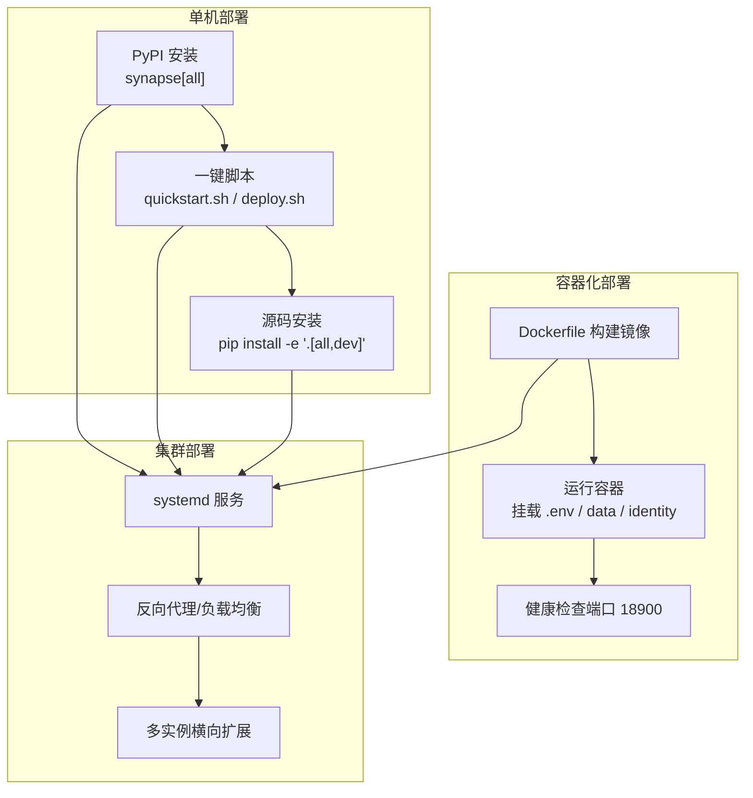
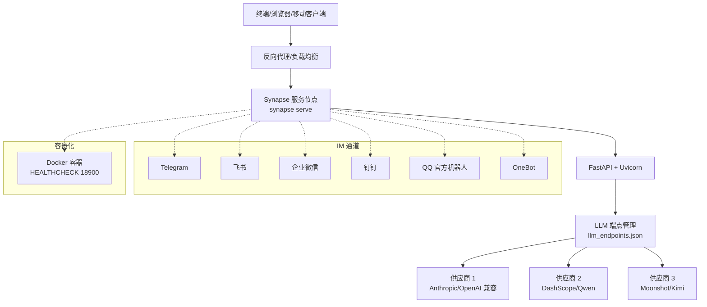
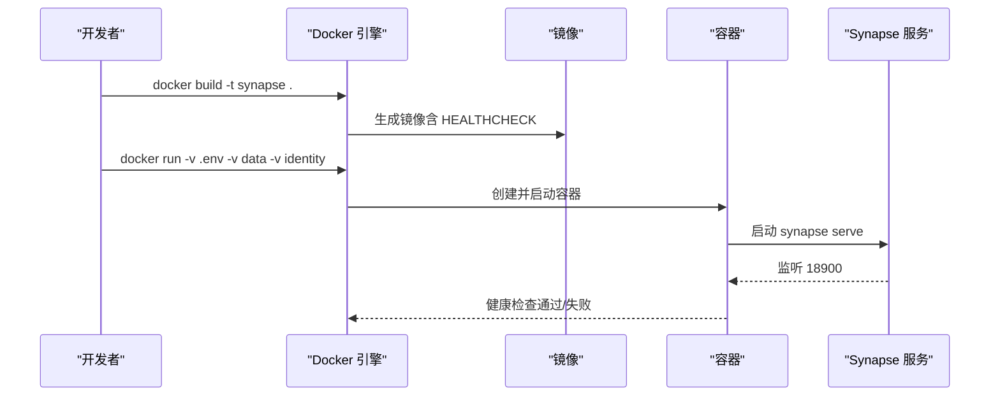
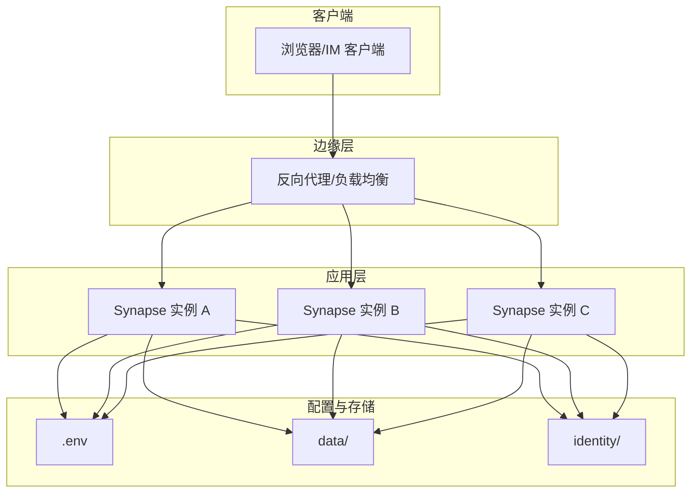
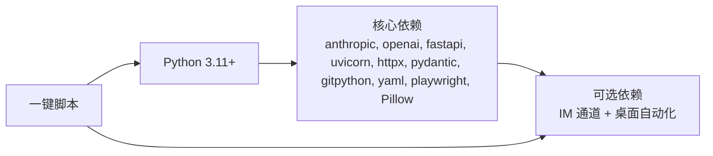

# 部署拓扑

<cite>
**本文引用的文件**
- [README.md](file://README.md)
- [docs/deploy.md](file://docs/deploy.md)
- [docs/deploy_en.md](file://docs/deploy_en.md)
- [Dockerfile](file://Dockerfile)
- [pyproject.toml](file://pyproject.toml)
- [requirements.txt](file://requirements.txt)
- [scripts/quickstart.sh](file://scripts/quickstart.sh)
- [scripts/deploy.sh](file://scripts/deploy.sh)
</cite>

## 目录
1. [简介](#简介)
2. [项目结构](#项目结构)
3. [核心组件](#核心组件)
4. [架构总览](#架构总览)
5. [详细组件分析](#详细组件分析)
6. [依赖关系分析](#依赖关系分析)
7. [性能考量](#性能考量)
8. [故障排查指南](#故障排查指南)
9. [结论](#结论)
10. [附录](#附录)

## 简介
本文件面向运维工程师，系统化阐述 Synapse 的部署拓扑与实施方案，覆盖单机部署、集群部署与容器化部署三大场景，并给出硬件要求、网络配置、存储需求、环境依赖、服务发现与负载均衡策略、高可用与灾备设计、监控告警与日志收集、性能调优等完整运维指导。内容基于仓库中的部署文档、Dockerfile、构建与打包配置以及一键安装/部署脚本进行提炼与整合，确保可落地、可复用、可扩展。

## 项目结构
Synapse 提供多条部署路径与多种运行形态：
- 单机部署：通过 PyPI 安装、一键脚本或源码安装，结合 .env 与 llm_endpoints.json 配置，直接以服务模式运行。
- 容器化部署：使用仓库提供的 Dockerfile 构建镜像，挂载 .env、data、identity 等目录，暴露健康检查端口，支持健康探针。
- 集群部署：通过 systemd 等进程守护，结合反向代理/负载均衡实现横向扩展与高可用。



图表来源
- [Dockerfile:1-54](file://Dockerfile#L1-L54)
- [docs/deploy.md:685-760](file://docs/deploy.md#L685-L760)
- [scripts/quickstart.sh:1-222](file://scripts/quickstart.sh#L1-L222)
- [scripts/deploy.sh:1-781](file://scripts/deploy.sh#L1-L781)

章节来源
- [docs/deploy.md:59-186](file://docs/deploy.md#L59-L186)
- [docs/deploy_en.md:59-186](file://docs/deploy_en.md#L59-L186)
- [Dockerfile:1-54](file://Dockerfile#L1-L54)
- [pyproject.toml:153-154](file://pyproject.toml#L153-L154)

## 核心组件
- 配置体系
  - .env：环境变量（API Key、IM 凭证、代理、功能开关等）
  - data/llm_endpoints.json：多端点、优先级、能力路由、健康检查与自动故障切换
  - identity/：SOUL/AGENT/USER/MEMORY 等身份与记忆模板
- 运行模式
  - 交互模式：synapse（CLI + IM 通道）
  - 服务模式：synapse serve（仅 IM 通道，后台运行）
  - 单次任务：synapse run "<指令>"
- 容器与系统集成
  - Dockerfile：分阶段构建前端与后端，最终运行 synapse serve
  - systemd：Linux 服务托管，自动重启与日志采集
  - 一键脚本：quickstart.sh（PyPI）、deploy.sh（源码）

章节来源
- [docs/deploy.md:190-206](file://docs/deploy.md#L190-L206)
- [docs/deploy.md:208-280](file://docs/deploy.md#L208-L280)
- [docs/deploy.md:281-473](file://docs/deploy.md#L281-L473)
- [docs/deploy.md:565-600](file://docs/deploy.md#L565-L600)
- [docs/deploy.md:602-632](file://docs/deploy.md#L602-L632)
- [Dockerfile:1-54](file://Dockerfile#L1-L54)
- [pyproject.toml:153-154](file://pyproject.toml#L153-L154)

## 架构总览
下图展示从客户端到后端服务、再到多 LLM 供应商的典型请求链路，以及 IM 通道的接入方式与容器化运行形态。



图表来源
- [docs/deploy.md:474-564](file://docs/deploy.md#L474-L564)
- [docs/deploy.md:719-750](file://docs/deploy.md#L719-L750)
- [Dockerfile:49-53](file://Dockerfile#L49-L53)

章节来源
- [docs/deploy.md:474-564](file://docs/deploy.md#L474-L564)
- [docs/deploy.md:719-750](file://docs/deploy.md#L719-L750)
- [Dockerfile:49-53](file://Dockerfile#L49-L53)

## 详细组件分析

### 单机部署方案
- PyPI 安装（推荐）
  - 创建虚拟环境，安装 synapse 与可选 extras（如 feishu、windows），运行 synapse init 后启动 synapse 或 synapse serve。
- 一键脚本（PyPI）
  - quickstart.sh：自动检测/安装 Python 3.11+，创建 venv，安装 synapse 与可选依赖，可选安装 Playwright，生成 wrapper，支持镜像加速与非交互模式。
- 一键脚本（源码）
  - deploy.sh：自动安装 Python/Git，创建 venv，安装依赖（支持国内镜像回退），可选安装 Playwright 与 Whisper，初始化 .env、llm_endpoints.json、identity 与数据目录，可选创建 systemd 服务。
- 源码安装
  - pip install -e ".[all,dev]"，复制配置文件，编辑 .env 与 llm_endpoints.json，运行 synapse init，启动服务。

```mermaid
flowchart TD
Start(["开始"]) --> Choose["选择安装方式"]
Choose --> |PyPI| PyPI["pip 安装 synapse[all]"]
Choose --> |一键脚本(PyPI)| QS["执行 quickstart.sh"]
Choose --> |一键脚本(源码)| DS["执行 deploy.sh"]
Choose --> |源码| SRC["pip install -e '.[all,dev]'"]
PyPI --> Init["synapse init"]
QS --> Init
DS --> Init
SRC --> Init
Init --> Run["synapse 或 synapse serve"]
Run --> End(["完成"])
```

图表来源
- [docs/deploy.md:61-84](file://docs/deploy.md#L61-L84)
- [scripts/quickstart.sh:13-222](file://scripts/quickstart.sh#L13-L222)
- [scripts/deploy.sh:141-150](file://scripts/deploy.sh#L141-L150)
- [docs/deploy.md:152-186](file://docs/deploy.md#L152-L186)

章节来源
- [docs/deploy.md:61-84](file://docs/deploy.md#L61-L84)
- [scripts/quickstart.sh:13-222](file://scripts/quickstart.sh#L13-L222)
- [scripts/deploy.sh:141-150](file://scripts/deploy.sh#L141-L150)
- [docs/deploy.md:152-186](file://docs/deploy.md#L152-L186)

### 容器化部署方案
- Dockerfile 分阶段构建
  - 前端构建：node:20-slim，构建 apps/setup-center 前端产物
  - 后端构建：python:3.11-slim，安装系统依赖与 Python 依赖，复制前端产物
  - 运行阶段：python:3.11-slim，复制依赖与入口，设置 HEALTHCHECK 18900，ENTRYPOINT ["synapse"] CMD ["serve","--host","0.0.0.0","--port","18900"]
- 运行方式
  - docker build -t synapse .
  - docker run -d --name synapse -v $(pwd)/.env:/app/.env -v $(pwd)/data:/app/data -v $(pwd)/identity:/app/identity synapse
- 健康检查
  - HEALTHCHECK 指令对 http://localhost:18900/health 进行探测



图表来源
- [Dockerfile:1-54](file://Dockerfile#L1-L54)

章节来源
- [Dockerfile:1-54](file://Dockerfile#L1-L54)
- [docs/deploy.md:719-750](file://docs/deploy.md#L719-L750)

### 集群部署与高可用
- systemd 服务
  - 在 Linux 上创建服务文件，设置 ExecStart 为 synapse serve，配置 Restart/RestartSec，输出到 journal，便于集中日志采集。
- 负载均衡与服务发现
  - 使用反向代理（如 Nginx/Haproxy/Traefik）对多实例进行轮询/加权/会话亲和
  - 服务发现可通过 DNS 或服务注册中心（Consul/Nacos）实现，动态更新后端节点
- 故障转移与冷却
  - LLM 端点具备自动故障切换与 3 分钟冷静期，避免抖动
- 灾难恢复
  - 通过备份 .env、data、identity 目录，结合容器卷或持久化存储实现快速回滚与恢复



图表来源
- [docs/deploy.md:685-760](file://docs/deploy.md#L685-L760)
- [docs/deploy.md:363-369](file://docs/deploy.md#L363-L369)

章节来源
- [docs/deploy.md:685-760](file://docs/deploy.md#L685-L760)
- [docs/deploy.md:363-369](file://docs/deploy.md#L363-L369)

### 网络与安全配置
- 端口与协议
  - 容器运行端口：18900（HEALTHCHECK /health）
  - IM 通道：Telegram（Bot API）、飞书（WebSocket）、企业微信/钉钉（HTTP API）、QQ 官方机器人（WebSocket/Webhook）、OneBot（WebSocket）
- 代理与网络
  - 支持 HTTP/HTTPS/ALL_PROXY，可强制 IPv4
  - IM 通道可配置专用代理（如 Telegram 中国大陆用户需代理）
- 安全与合规
  - .env 中存放敏感信息（API Key/Token），建议配合密钥管理服务与最小权限原则
  - LLM 端点可配置 base_url 与 extra_params，支持代理/转发服务

章节来源
- [Dockerfile:49-53](file://Dockerfile#L49-L53)
- [docs/deploy.md:474-564](file://docs/deploy.md#L474-L564)
- [docs/deploy.md:248-252](file://docs/deploy.md#L248-L252)
- [docs/deploy.md:458-472](file://docs/deploy.md#L458-L472)

### 存储与数据目录
- 必要目录
  - data/sessions、data/media、data/scheduler、data/temp、data/telegram/pairing、data/sticker
  - identity/（SOUL/AGENT/USER/MEMORY）
  - logs/
- 配置文件
  - .env：环境变量
  - data/llm_endpoints.json：多端点、优先级、能力路由、健康检查与自动故障切换
- 离线与缓存
  - 首次启动会自动下载嵌入模型（约 100MB），可在离线环境提前准备缓存

章节来源
- [docs/deploy.md:592-618](file://docs/deploy.md#L592-L618)
- [docs/deploy.md:586-599](file://docs/deploy.md#L586-L599)
- [docs/deploy.md:281-473](file://docs/deploy.md#L281-L473)

## 依赖关系分析
- Python 版本与核心依赖
  - Python >= 3.11，核心依赖包括 anthropic、openai、fastapi、uvicorn、httpx、pydantic、gitpython、pyyaml、playwright、Pillow 等
- 可选依赖（按需安装）
  - IM 通道：feishu、dingtalk、wework、qqbot、onebot
  - 桌面自动化：windows 平台相关依赖
- 一键脚本与依赖安装
  - quickstart.sh：自动安装 torch（CPU）、可选 Playwright，生成 wrapper
  - deploy.sh：自动安装 Python/Git，创建 venv，安装依赖（失败自动回退到清华镜像），可选安装 Playwright 与 Whisper



图表来源
- [pyproject.toml:21-73](file://pyproject.toml#L21-L73)
- [pyproject.toml:75-141](file://pyproject.toml#L75-L141)
- [requirements.txt:9-57](file://requirements.txt#L9-L57)
- [requirements.txt:63-95](file://requirements.txt#L63-L95)
- [scripts/quickstart.sh:137-165](file://scripts/quickstart.sh#L137-L165)
- [scripts/deploy.sh:250-284](file://scripts/deploy.sh#L250-L284)

章节来源
- [pyproject.toml:21-73](file://pyproject.toml#L21-L73)
- [pyproject.toml:75-141](file://pyproject.toml#L75-L141)
- [requirements.txt:9-57](file://requirements.txt#L9-L57)
- [requirements.txt:63-95](file://requirements.txt#L63-L95)
- [scripts/quickstart.sh:137-165](file://scripts/quickstart.sh#L137-L165)
- [scripts/deploy.sh:250-284](file://scripts/deploy.sh#L250-L284)

## 性能考量
- 端点优先级与能力路由
  - 通过 llm_endpoints.json 的 priority 与 capabilities 字段，实现按能力与优先级的智能路由，减少无效重试
- 冷却与重试
  - 失败端点进入 3 分钟冷静期，避免雪崩效应
- 资源与并发
  - systemd 服务中合理设置 RestartSec，结合反向代理的连接池与超时参数，提升吞吐与稳定性
- 模型与缓存
  - 首次启动自动下载嵌入模型，建议在离线环境提前准备缓存目录，缩短冷启动时间

章节来源
- [docs/deploy.md:363-369](file://docs/deploy.md#L363-L369)
- [docs/deploy.md:586-599](file://docs/deploy.md#L586-L599)

## 故障排查指南
- 常见问题定位
  - Python 版本不符：确保 Python 3.11+，参考 quickstart.sh/deploy.sh 的版本检测逻辑
  - pip 安装失败：使用国内镜像源或配置永久镜像
  - Playwright 安装失败：在 Linux 上安装系统依赖或仅安装 Chromium
  - API 连接超时：检查代理、防火墙与供应商端点可达性
- 日志与状态
  - systemd：journalctl -u synapse -f 查看日志
  - 容器：docker logs -f synapse
  - 健康检查：HEALTHCHECK 对 /health 的响应
- 配置校验
  - synapse init 启动向导
  - synapse status 查看 Agent 状态
  - synapse selfcheck 运行自检

章节来源
- [scripts/quickstart.sh:96-110](file://scripts/quickstart.sh#L96-L110)
- [scripts/deploy.sh:111-127](file://scripts/deploy.sh#L111-L127)
- [docs/deploy_en.md:780-796](file://docs/deploy_en.md#L780-L796)
- [Dockerfile:49-53](file://Dockerfile#L49-L53)
- [docs/deploy.md:602-632](file://docs/deploy.md#L602-L632)

## 结论
Synapse 提供了从单机到容器化再到集群化的完整部署路径。通过 .env 与 llm_endpoints.json 的灵活配置、IM 通道的统一接入、容器健康检查与 systemd 的进程守护，以及多端点的自动故障切换与冷却机制，能够满足不同规模与复杂度的生产环境需求。建议在生产环境中结合反向代理/负载均衡、集中日志与监控告警体系，形成闭环的可观测性与可运维性。

## 附录
- 快速命令参考
  - PyPI 安装：pip install synapse[all]，synapse init，synapse 或 synapse serve
  - 一键脚本：curl ... quickstart.sh | bash，或 ./scripts/deploy.sh
  - Docker：docker build -t synapse . && docker run -v .env -v data -v identity
  - systemd：创建服务文件，systemctl enable/start/status
- 相关文档
  - README 中的架构与功能概览
  - 中文/英文部署文档

章节来源
- [README.md:585-621](file://README.md#L585-L621)
- [docs/deploy.md:61-84](file://docs/deploy.md#L61-L84)
- [docs/deploy_en.md:61-84](file://docs/deploy_en.md#L61-L84)
- [Dockerfile:1-54](file://Dockerfile#L1-L54)
- [docs/deploy.md:685-760](file://docs/deploy.md#L685-L760)