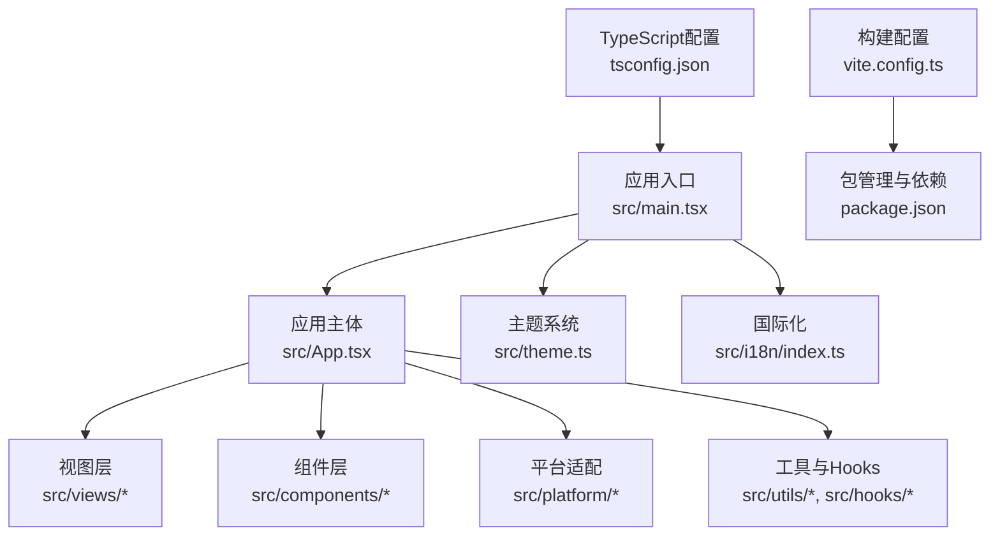
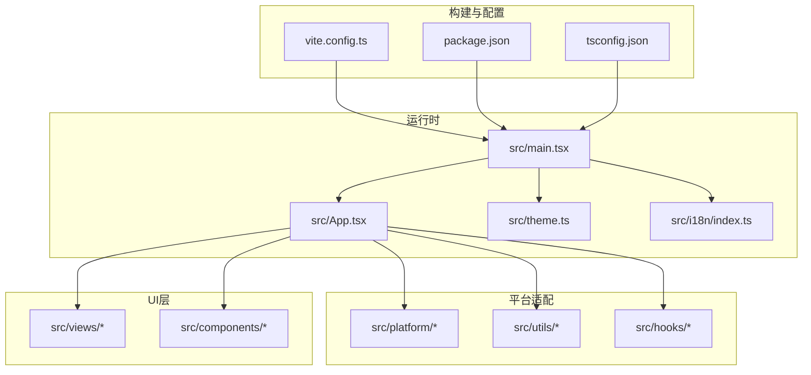
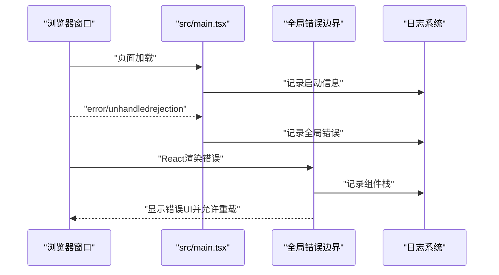
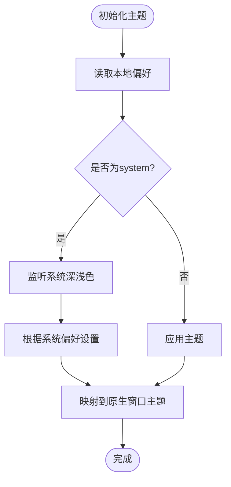
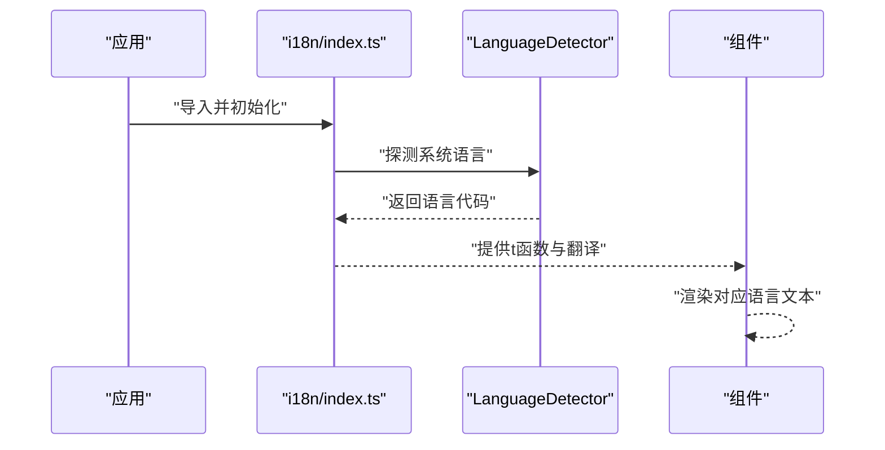
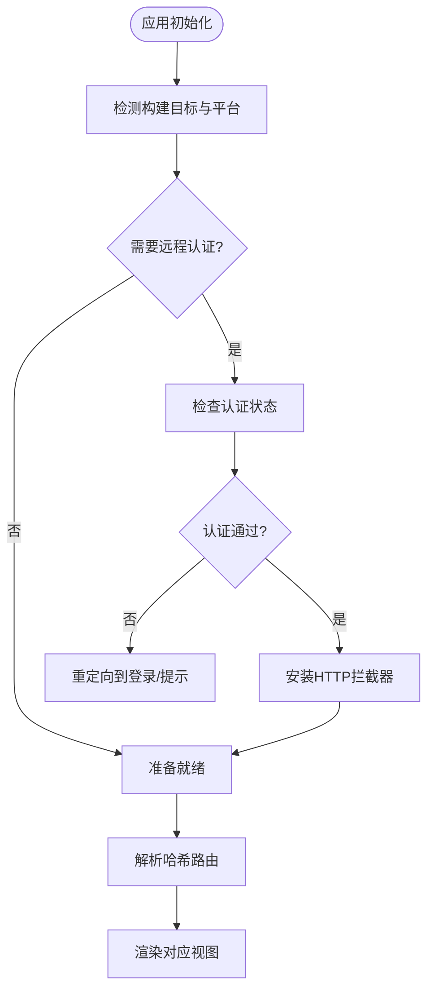
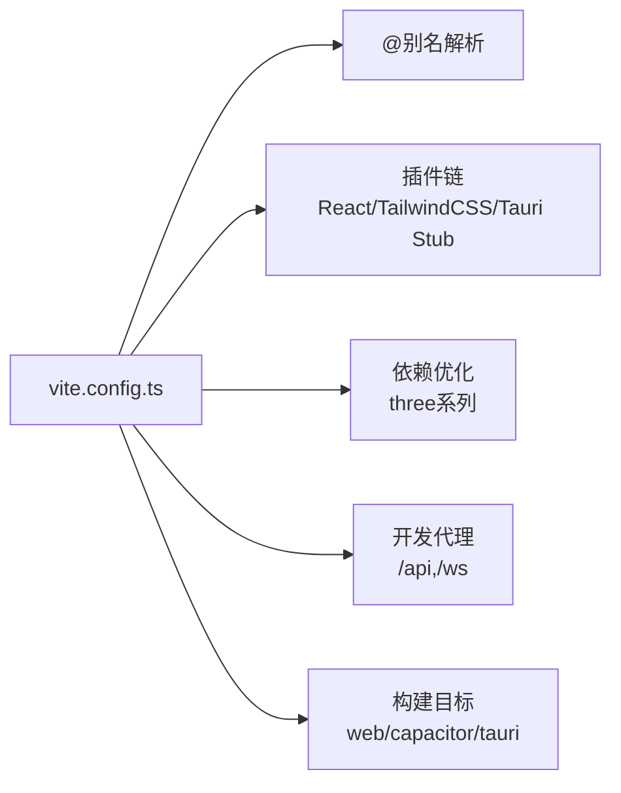
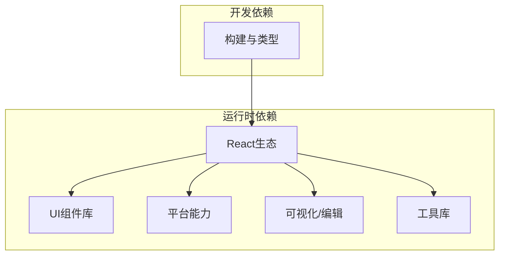

# React前端开发

<cite>
**本文引用的文件**
- [package.json](file://apps/setup-center/package.json)
- [tsconfig.json](file://apps/setup-center/tsconfig.json)
- [vite.config.ts](file://apps/setup-center/vite.config.ts)
- [main.tsx](file://apps/setup-center/src/main.tsx)
- [App.tsx](file://apps/setup-center/src/App.tsx)
- [theme.ts](file://apps/setup-center/src/theme.ts)
- [i18n/index.ts](file://apps/setup-center/src/i18n/index.ts)
</cite>

## 目录
1. [简介](#简介)
2. [项目结构](#项目结构)
3. [核心组件](#核心组件)
4. [架构总览](#架构总览)
5. [详细组件分析](#详细组件分析)
6. [依赖关系分析](#依赖关系分析)
7. [性能考量](#性能考量)
8. [故障排查指南](#故障排查指南)
9. [结论](#结论)
10. [附录](#附录)

## 简介
本技术文档面向React 18 + TypeScript的前端开发，聚焦于apps/setup-center应用的开发环境配置、组件架构设计模式、状态管理策略、UI组件库与主题系统、国际化集成、错误边界与全局异常捕获、性能优化以及组件开发规范与样式管理最佳实践。文档以代码为依据，结合可视化图表帮助读者快速理解系统设计与实现细节。

## 项目结构
该React应用采用Vite作为构建工具，TypeScript进行类型约束，TailwindCSS进行样式管理，并通过多平台构建目标（Tauri桌面、Web、Capacitor移动端）统一入口与配置。核心目录与职责如下：
- apps/setup-center/src：源码根目录，包含入口、应用主体、主题、国际化、平台适配、视图与组件等
- apps/setup-center/public：静态资源与Web Worker脚本
- apps/setup-center/src-tauri：Tauri原生侧配置与能力声明
- 构建与脚本：通过package.json的scripts统一管理不同构建目标

**图表来源**
- [main.tsx:1-377](file://apps/setup-center/src/main.tsx#L1-L377)
- [App.tsx:1-800](file://apps/setup-center/src/App.tsx#L1-L800)
- [vite.config.ts:1-89](file://apps/setup-center/vite.config.ts#L1-L89)
- [package.json:1-86](file://apps/setup-center/package.json#L1-L86)
- [tsconfig.json:1-24](file://apps/setup-center/tsconfig.json#L1-L24)

**章节来源**
- [package.json:1-86](file://apps/setup-center/package.json#L1-L86)
- [tsconfig.json:1-24](file://apps/setup-center/tsconfig.json#L1-L24)
- [vite.config.ts:1-89](file://apps/setup-center/vite.config.ts#L1-L89)
- [main.tsx:1-377](file://apps/setup-center/src/main.tsx#L1-L377)
- [App.tsx:1-800](file://apps/setup-center/src/App.tsx#L1-L800)

## 核心组件
- 应用入口与全局错误捕获
  - 全局错误监听：捕获未处理的JS错误与Promise拒绝，记录日志并提示用户
  - 全局错误边界：捕获React渲染错误，展示可恢复的错误UI
  - 平台适配：根据构建目标（Tauri/WebView/Web/Capacitor）注入本地fetch覆盖、服务端SW注册、自定义标题栏等
- 应用主体App
  - 视图路由：基于URL哈希的视图切换，支持向导与功能视图
  - 认证门控：Web/Capacitor远程认证与Tauri远程登录URL处理
  - 主题偏好：主题选择、系统跟随、预览与持久化
  - 版本与更新：桌面端版本检查、更新下载与重启
  - 环境与配置：环境变量草稿、密钥可见性、健康检查与状态面板
  - 性能与体验：懒加载视图、移动键盘适配、滚动与可视窗口高度同步
- 主题系统
  - 支持light/dark/system/daltonized-light/daltonized-dark/high-contrast
  - 与Tauri原生窗口主题映射，系统变更自动响应
- 国际化
  - i18next + LanguageDetector，支持中英资源与自动语言探测
  - 资源按语言拆分，fallback至中文

**章节来源**
- [main.tsx:35-161](file://apps/setup-center/src/main.tsx#L35-L161)
- [main.tsx:180-377](file://apps/setup-center/src/main.tsx#L180-L377)
- [App.tsx:179-800](file://apps/setup-center/src/App.tsx#L179-L800)
- [theme.ts:1-95](file://apps/setup-center/src/theme.ts#L1-L95)
- [i18n/index.ts:1-26](file://apps/setup-center/src/i18n/index.ts#L1-L26)

## 架构总览
应用采用“入口-主体-平台-视图-组件”的分层架构，配合主题与国际化插件，形成跨平台一致的用户体验。构建阶段通过Vite插件链路与别名解析，确保开发与生产环境的一致性。

**图表来源**
- [vite.config.ts:1-89](file://apps/setup-center/vite.config.ts#L1-L89)
- [package.json:1-86](file://apps/setup-center/package.json#L1-L86)
- [tsconfig.json:1-24](file://apps/setup-center/tsconfig.json#L1-L24)
- [main.tsx:1-377](file://apps/setup-center/src/main.tsx#L1-L377)
- [App.tsx:1-800](file://apps/setup-center/src/App.tsx#L1-L800)

## 详细组件分析

### 错误边界与全局异常捕获
- 全局错误监听：对window.error与unhandledrejection进行监听，记录错误上下文并输出到日志
- 全局错误边界：捕获React渲染错误，生成可复制的错误详情，提供重载应用能力
- 平台安全：桌面端自定义右键菜单、阻止WebView导航离开SPA、外部链接在系统浏览器打开

**图表来源**
- [main.tsx:35-161](file://apps/setup-center/src/main.tsx#L35-L161)

**章节来源**
- [main.tsx:35-161](file://apps/setup-center/src/main.tsx#L35-L161)

### 主题系统与跨平台适配
- 主题解析：system模式根据系统偏好解析为light/dark；扩展主题映射到原生支持的light/dark
- 本地存储：主题偏好持久化，支持预览与取消预览
- 系统联动：当处于system模式且系统切换深浅色时，自动更新data-theme属性

**图表来源**
- [theme.ts:25-65](file://apps/setup-center/src/theme.ts#L25-L65)

**章节来源**
- [theme.ts:1-95](file://apps/setup-center/src/theme.ts#L1-L95)

### 国际化集成
- 初始化：i18next + LanguageDetector，资源包含中英两套
- 语言探测：优先使用navigator语言
- 资源加载：resources对象内按语言拆分翻译

**图表来源**
- [i18n/index.ts:1-26](file://apps/setup-center/src/i18n/index.ts#L1-L26)

**章节来源**
- [i18n/index.ts:1-26](file://apps/setup-center/src/i18n/index.ts#L1-L26)

### 应用主体App：路由、认证与状态
- 路由：基于URL哈希的视图切换，支持向导步骤与功能视图
- 认证：Web/Capacitor远程认证门控，Tauri远程登录URL处理
- 状态：主题偏好、工作区、版本检查、服务状态、环境变量草稿、健康检查等
- 性能：懒加载视图，移动键盘适配，滚动与可视窗口高度同步

**图表来源**
- [App.tsx:179-400](file://apps/setup-center/src/App.tsx#L179-L400)

**章节来源**
- [App.tsx:179-800](file://apps/setup-center/src/App.tsx#L179-L800)

### 构建与开发环境配置
- Vite插件链：React、TailwindCSS、Tauri Stub（远程构建时替换原生模块）
- 别名与路径：@指向src，共享providers.json路径映射
- 依赖优化：预优化three系列库与3D相关依赖
- 代理与端口：开发服务器端口5173，Web构建时代理/api与/ws到后端
- 多目标：通过VITE_BUILD_TARGET区分web/capacitor/tauri，控制输出目录与行为

**图表来源**
- [vite.config.ts:1-89](file://apps/setup-center/vite.config.ts#L1-L89)

**章节来源**
- [vite.config.ts:1-89](file://apps/setup-center/vite.config.ts#L1-L89)
- [package.json:1-86](file://apps/setup-center/package.json#L1-L86)
- [tsconfig.json:1-24](file://apps/setup-center/tsconfig.json#L1-L24)

## 依赖关系分析
- 运行时依赖
  - React 18与生态：react、react-dom、react-i18next、i18next、i18next-browser-languagedetector
  - UI与样式：antd、lucide-react、@radix-ui/react-slider、tailwindcss、@tailwindcss/vite
  - 平台：@tauri-apps/api、@tauri-apps/plugin-*、@capacitor/*
  - 可视化与编辑：@monaco-editor/react、@excalidraw/excalidraw、react-markdown、recharts
  - 动画与工具：motion、clsx、tailwind-merge、highlight.js、html-to-image
- 开发依赖
  - 构建与类型：@vitejs/plugin-react、typescript、@types/react、@types/node、vite
- 构建目标差异
  - 远程构建（web/capacitor）：启用Tauri Stub插件，替换原生API为占位实现
  - 桌面构建（tauri）：保留原生能力，按平台注入本地fetch覆盖与服务端SW注册

**图表来源**
- [package.json:20-84](file://apps/setup-center/package.json#L20-L84)

**章节来源**
- [package.json:1-86](file://apps/setup-center/package.json#L1-L86)

## 性能考量
- 代码分割与懒加载：App中大量视图采用动态导入与Suspense，降低首屏体积
- 移动端体验：监听visualViewport变化，保证输入法弹起时的布局稳定
- 依赖预优化：针对three系列库进行预优化，减少冷启动时间
- 构建目标差异化：远程构建时移除原生依赖，避免不必要的打包与运行时开销
- 状态与副作用：通过useMemo/useEffect合理缓存与清理，避免重复计算与泄漏

[本节为通用性能建议，不直接分析具体文件]

## 故障排查指南
- 全局错误与Promise拒绝
  - 使用全局error与unhandledrejection监听，记录堆栈与上下文
  - 在错误边界中生成可复制的错误文本，便于反馈与复现
- 认证问题
  - Web/Capacitor远程认证失败时，检查后端可达性与令牌有效性
  - Tauri远程模式下，关注AUTH_EXPIRED_EVENT事件并重定向登录
- 主题与系统跟随
  - 若system模式未生效，检查系统深浅色偏好与媒体查询监听
  - 预览主题后可通过取消预览恢复持久化设置
- 构建与代理
  - 远程构建时确认Tauri Stub插件已启用，避免原生API调用报错
  - 开发代理需确保后端地址正确，避免/api与/ws代理失效

**章节来源**
- [main.tsx:35-161](file://apps/setup-center/src/main.tsx#L35-L161)
- [App.tsx:186-234](file://apps/setup-center/src/App.tsx#L186-L234)
- [theme.ts:25-65](file://apps/setup-center/src/theme.ts#L25-L65)
- [vite.config.ts:40-87](file://apps/setup-center/vite.config.ts#L40-L87)

## 结论
本项目以React 18 + TypeScript为基础，结合Vite构建、i18n国际化与主题系统，实现了跨平台（Web、Tauri桌面、Capacitor移动端）的一致体验。通过全局错误捕获与边界、懒加载视图、移动端键盘适配与依赖预优化等策略，兼顾了稳定性与性能。建议在后续迭代中持续完善组件开发规范、样式治理与国际化覆盖，以提升可维护性与用户体验。

## 附录
- 组件开发规范建议
  - 使用受控组件与受控表单，配合环境变量草稿与保存流程
  - 将UI组件与业务逻辑解耦，利用Context传递状态与方法
  - 对外暴露明确的Props接口，使用TypeScript严格约束
- 样式管理最佳实践
  - 优先使用TailwindCSS原子类，必要时在全局样式中集中管理主题变量
  - 通过data-theme与CSS变量实现主题切换，避免硬编码颜色
- 用户体验设计原则
  - 提供清晰的加载状态与错误提示，保持交互反馈即时
  - 移动端优先，确保输入法与手势操作的可用性
  - 为无障碍场景提供色盲友好与高对比度主题选项