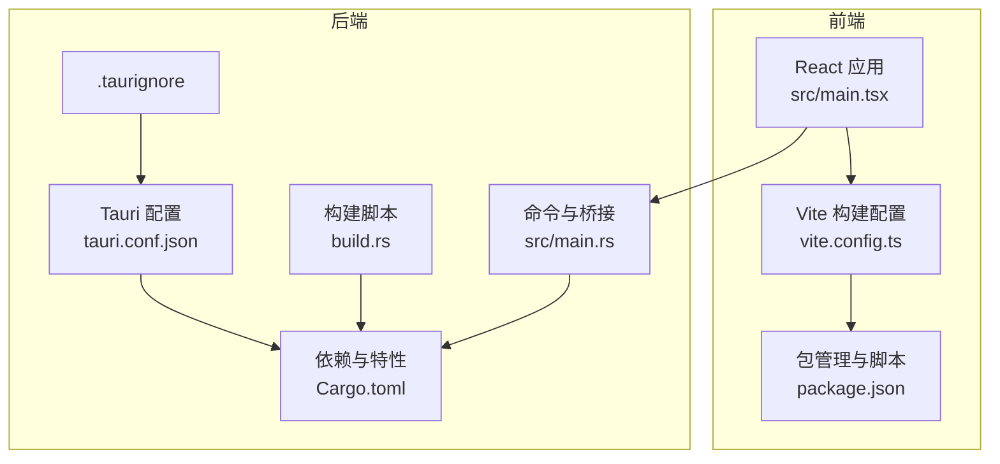
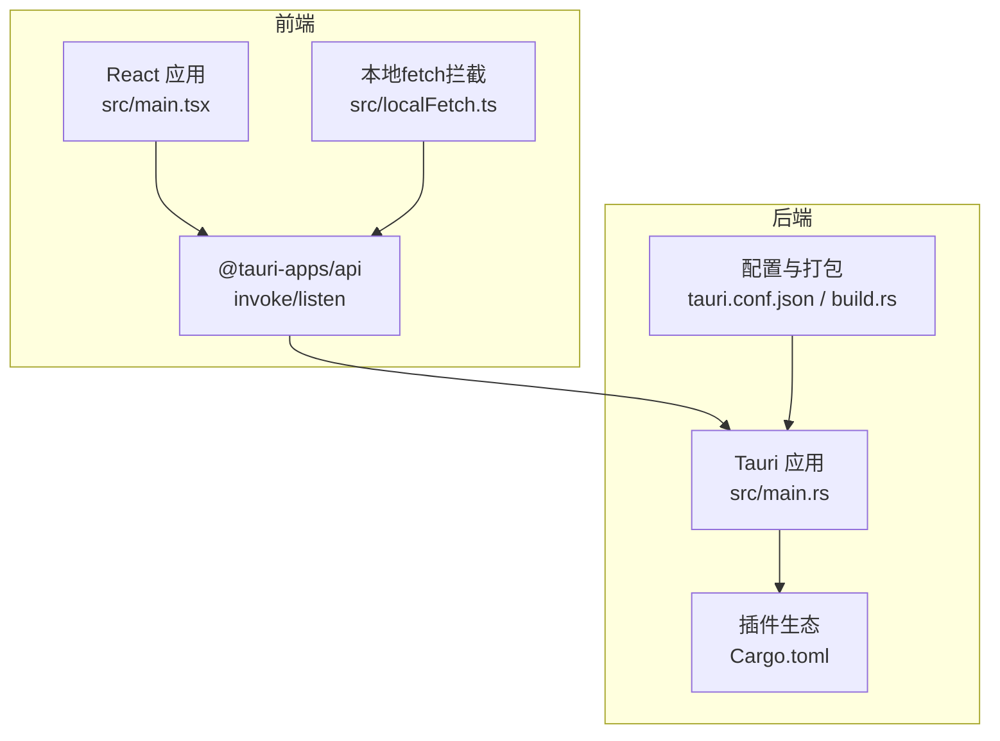
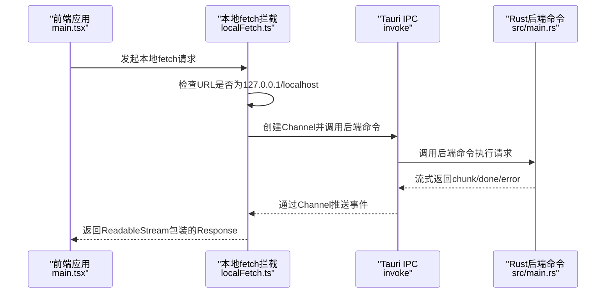
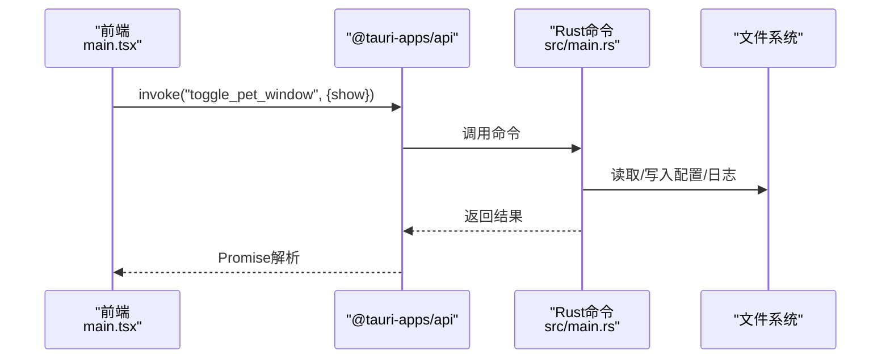
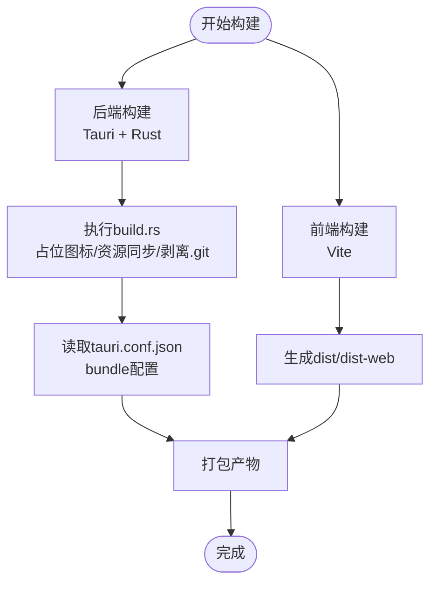
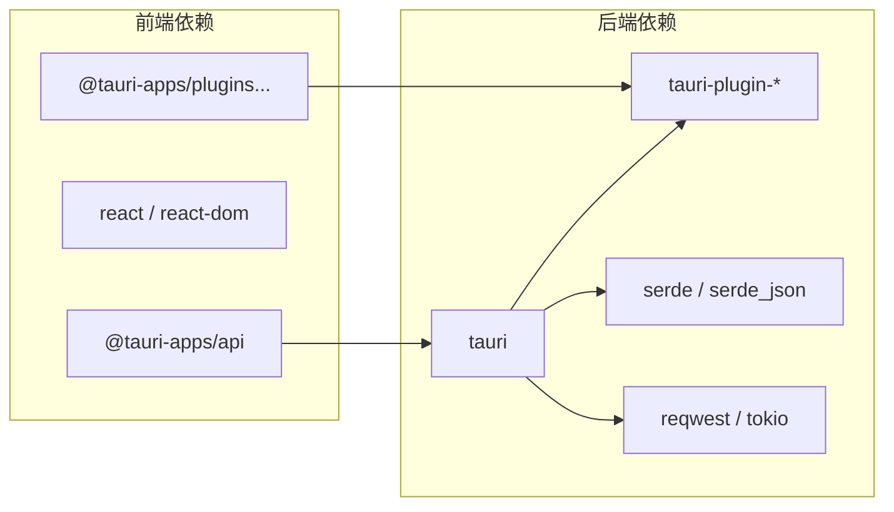

# Tauri应用架构

<cite>
**本文档引用的文件**
- [Cargo.toml](file://apps/setup-center/src-tauri/Cargo.toml)
- [tauri.conf.json](file://apps/setup-center/src-tauri/tauri.conf.json)
- [build.rs](file://apps/setup-center/src-tauri/build.rs)
- [.taurignore](file://apps/setup-center/src-tauri/.taurignore)
- [main.rs](file://apps/setup-center/src-tauri/src/main.rs)
- [package.json](file://apps/setup-center/package.json)
- [vite.config.ts](file://apps/setup-center/vite.config.ts)
- [main.tsx](file://apps/setup-center/src/main.tsx)
- [detect.ts](file://apps/setup-center/src/platform/detect.ts)
- [localFetch.ts](file://apps/setup-center/src/localFetch.ts)
</cite>

## 目录
1. [简介](#简介)
2. [项目结构](#项目结构)
3. [核心组件](#核心组件)
4. [架构总览](#架构总览)
5. [详细组件分析](#详细组件分析)
6. [依赖关系分析](#依赖关系分析)
7. [性能考虑](#性能考虑)
8. [故障排除指南](#故障排除指南)
9. [结论](#结论)
10. [附录](#附录)

## 简介
本文件面向Tauri桌面应用的架构设计与实现，围绕以下主题展开：Tauri框架的核心理念、Rust后端与React前端的桥接机制、安全沙箱与CSP策略、配置文件参数详解、构建流程优化、跨平台兼容性处理、IPC通信机制、系统权限与窗口控制、以及最佳实践与故障排除。本文档基于仓库中的Setup Center桌面应用进行深入分析，并提供可视化图表帮助理解。

## 项目结构
该桌面应用采用“前端React + 后端Tauri(Rust)”的双层架构，前端通过Vite构建，后端通过Tauri CLI集成Rust插件生态。关键目录与文件如下：
- 前端工程：apps/setup-center/src（React应用）、apps/setup-center/vite.config.ts（Vite配置）
- 后端工程：apps/setup-center/src-tauri（Tauri/Rust应用）、apps/setup-center/src-tauri/tauri.conf.json（Tauri配置）、apps/setup-center/src-tauri/build.rs（构建脚本）
- 插件与能力：apps/setup-center/src-tauri/Cargo.toml（依赖声明）、apps/setup-center/src-tauri/.taurignore（打包忽略规则）

**图表来源**
- [main.tsx:1-377](file://apps/setup-center/src/main.tsx#L1-L377)
- [vite.config.ts:1-89](file://apps/setup-center/vite.config.ts#L1-L89)
- [package.json:1-86](file://apps/setup-center/package.json#L1-L86)
- [tauri.conf.json:1-75](file://apps/setup-center/src-tauri/tauri.conf.json#L1-L75)
- [Cargo.toml:1-49](file://apps/setup-center/src-tauri/Cargo.toml#L1-L49)
- [build.rs:1-154](file://apps/setup-center/src-tauri/build.rs#L1-L154)
- [main.rs:1-8001](file://apps/setup-center/src-tauri/src/main.rs#L1-L8001)
- [.taurignore:1-5](file://apps/setup-center/src-tauri/.taurignore#L1-L5)

**章节来源**
- [main.tsx:1-377](file://apps/setup-center/src/main.tsx#L1-L377)
- [vite.config.ts:1-89](file://apps/setup-center/vite.config.ts#L1-L89)
- [package.json:1-86](file://apps/setup-center/package.json#L1-L86)
- [tauri.conf.json:1-75](file://apps/setup-center/src-tauri/tauri.conf.json#L1-L75)
- [Cargo.toml:1-49](file://apps/setup-center/src-tauri/Cargo.toml#L1-L49)
- [build.rs:1-154](file://apps/setup-center/src-tauri/build.rs#L1-L154)
- [main.rs:1-8001](file://apps/setup-center/src-tauri/src/main.rs#L1-L8001)
- [.taurignore:1-5](file://apps/setup-center/src-tauri/.taurignore#L1-L5)

## 核心组件
- 前端桥接与拦截层：通过本地fetch拦截与Tauri IPC通道实现对本地后端的稳定访问，避免系统代理影响。
- 后端命令系统：Rust侧通过#[tauri::command]暴露命令，前端通过@tauri-apps/api调用。
- 构建与打包：Vite负责前端构建，Tauri CLI与Rust构建脚本负责后端打包与资源注入。
- 安全策略：CSP严格限制资源加载来源，配合窗口与权限插件实现最小授权。
- 跨平台适配：针对Windows/Linux/macOS的差异路径与特性进行条件编译与运行时检测。

**章节来源**
- [localFetch.ts:1-159](file://apps/setup-center/src/localFetch.ts#L1-L159)
- [main.rs:57-84](file://apps/setup-center/src-tauri/src/main.rs#L57-L84)
- [tauri.conf.json:58-73](file://apps/setup-center/src-tauri/tauri.conf.json#L58-L73)
- [vite.config.ts:1-89](file://apps/setup-center/vite.config.ts#L1-L89)
- [detect.ts:1-39](file://apps/setup-center/src/platform/detect.ts#L1-L39)

## 架构总览
整体架构采用“前端React + 后端Tauri”的双层设计，前端通过Vite开发与构建，后端通过Tauri CLI与Rust生态提供系统级能力。前端与后端通过IPC通信，后端通过插件扩展功能（文件系统、HTTP、进程、通知等）。

**图表来源**
- [main.tsx:12-14](file://apps/setup-center/src/main.tsx#L12-L14)
- [localFetch.ts:30-159](file://apps/setup-center/src/localFetch.ts#L30-L159)
- [main.rs:19-20](file://apps/setup-center/src-tauri/src/main.rs#L19-L20)
- [Cargo.toml:13-41](file://apps/setup-center/src-tauri/Cargo.toml#L13-L41)
- [tauri.conf.json:1-75](file://apps/setup-center/src-tauri/tauri.conf.json#L1-L75)
- [build.rs:1-24](file://apps/setup-center/src-tauri/build.rs#L1-L24)

## 详细组件分析

### 前端桥接与本地请求拦截
- 本地请求拦截：针对127.0.0.1/localhost的请求，使用Channel与ReadableStream实现响应体流式传输，避免系统代理影响。
- 非本地请求：保持原生fetch行为，确保外部网络访问正常。
- 终端信号：与AbortSignal联动，支持取消请求。
- 构建目标：在非Tauri环境（web/capacitor）下，通过Vite插件提供空实现以保证开发体验。

**图表来源**
- [main.tsx:12-14](file://apps/setup-center/src/main.tsx#L12-L14)
- [localFetch.ts:30-159](file://apps/setup-center/src/localFetch.ts#L30-L159)
- [main.rs:19-20](file://apps/setup-center/src-tauri/src/main.rs#L19-L20)

**章节来源**
- [localFetch.ts:1-159](file://apps/setup-center/src/localFetch.ts#L1-L159)
- [main.tsx:12-14](file://apps/setup-center/src/main.tsx#L12-L14)
- [vite.config.ts:11-37](file://apps/setup-center/vite.config.ts#L11-L37)

### 后端命令与IPC桥接
- 命令注解：#[tauri::command]将Rust函数暴露为IPC命令，前端通过@tauri-apps/api.invoke调用。
- 窗口控制：提供拖拽、显示/隐藏窗口等操作。
- 文件与日志：提供日志写入、前端日志持久化、导出等功能。
- 路径与资源：根据平台动态定位内置资源目录，兼容deb/AppImage等部署形态。

**图表来源**
- [main.tsx:12-14](file://apps/setup-center/src/main.tsx#L12-L14)
- [main.rs:69-78](file://apps/setup-center/src-tauri/src/main.rs#L69-L78)

**章节来源**
- [main.rs:57-84](file://apps/setup-center/src-tauri/src/main.rs#L57-L84)
- [main.rs:225-284](file://apps/setup-center/src-tauri/src/main.rs#L225-L284)

### 构建与打包流程
- 前端构建：Vite负责开发与生产构建；web/capacitor模式下通过插件提供空实现。
- 后端构建：Tauri CLI与Rust构建脚本结合，build.rs中处理占位图标、资源目录、模板剥离.git元数据等。
- 资源注入：tauri.conf.json定义bundle.resources，build.rs确保必要目录存在并同步外部资源。
- 忽略规则：.taurignore控制打包时忽略的文件与目录。

**图表来源**
- [vite.config.ts:40-87](file://apps/setup-center/vite.config.ts#L40-L87)
- [build.rs:1-24](file://apps/setup-center/src-tauri/build.rs#L1-L24)
- [tauri.conf.json:12-26](file://apps/setup-center/src-tauri/tauri.conf.json#L12-L26)
- [.taurignore:1-5](file://apps/setup-center/src-tauri/.taurignore#L1-L5)

**章节来源**
- [vite.config.ts:1-89](file://apps/setup-center/vite.config.ts#L1-L89)
- [build.rs:1-154](file://apps/setup-center/src-tauri/build.rs#L1-L154)
- [tauri.conf.json:1-75](file://apps/setup-center/src-tauri/tauri.conf.json#L1-L75)
- [.taurignore:1-5](file://apps/setup-center/src-tauri/.taurignore#L1-L5)

### 安全与CSP策略
- CSP严格限制：default-src、connect-src、img-src、style-src、font-src、script-src、frame-src、media-src等，确保仅允许受控来源。
- 本地开发：devUrl指向本地Vite服务器，生产环境禁止eval等高风险指令。
- 资源来源：前端静态资源与后端内置资源均需符合CSP白名单。

**章节来源**
- [tauri.conf.json:58-60](file://apps/setup-center/src-tauri/tauri.conf.json#L58-L60)

### 跨平台兼容性
- 平台检测：通过UA与运行时环境判断当前平台（Windows/macOS/Linux/web/capacitor）。
- 路径解析：针对macOS的.app布局与Linux的/usr/lib/布局进行回退查找。
- 插件条件：不同平台启用不同插件（autostart、single-instance、updater、process、shell、global-shortcut、notification）。

**章节来源**
- [detect.ts:1-39](file://apps/setup-center/src/platform/detect.ts#L1-L39)
- [main.rs:515-626](file://apps/setup-center/src-tauri/src/main.rs#L515-L626)
- [main.rs:657-701](file://apps/setup-center/src-tauri/src/main.rs#L657-L701)
- [Cargo.toml:33-41](file://apps/setup-center/src-tauri/Cargo.toml#L33-L41)

## 依赖关系分析

**图表来源**
- [package.json:30-38](file://apps/setup-center/package.json#L30-L38)
- [Cargo.toml:13-41](file://apps/setup-center/src-tauri/Cargo.toml#L13-L41)

**章节来源**
- [package.json:1-86](file://apps/setup-center/package.json#L1-L86)
- [Cargo.toml:1-49](file://apps/setup-center/src-tauri/Cargo.toml#L1-L49)

## 性能考虑
- 本地请求流式传输：通过Channel与ReadableStream减少内存占用，提升大响应体场景的稳定性。
- 构建阶段资源剥离：build.rs在打包前剥离.git元数据，避免Windows上读取pack文件的权限问题与构建失败。
- 前端日志轮转：当日志文件过大时自动截断尾部，降低IO压力。
- 插件按需启用：仅在目标平台启用对应插件，减少运行时开销。

**章节来源**
- [localFetch.ts:83-107](file://apps/setup-center/src/localFetch.ts#L83-L107)
- [build.rs:26-59](file://apps/setup-center/src-tauri/build.rs#L26-L59)
- [main.rs:437-462](file://apps/setup-center/src-tauri/src/main.rs#L437-L462)

## 故障排除指南
- 本地请求被系统代理劫持：确认使用本地fetch拦截，避免通过WKWebView代理转发至外部网络。
- 打包失败或图标缺失：检查build.rs生成占位图标逻辑与tauri.conf.json的icon配置。
- 资源未被打包：核对tauri.conf.json的bundle.resources与.build.rs中的资源同步逻辑。
- Linux路径找不到内置资源：检查deb/AppImage布局与exe所在路径，参考main.rs中的回退策略。
- 权限与窗口异常：确认各平台插件启用情况与CSP策略，避免因权限不足导致功能不可用。

**章节来源**
- [localFetch.ts:1-21](file://apps/setup-center/src/localFetch.ts#L1-L21)
- [build.rs:119-152](file://apps/setup-center/src-tauri/build.rs#L119-L152)
- [tauri.conf.json:13-26](file://apps/setup-center/src-tauri/tauri.conf.json#L13-L26)
- [main.rs:515-626](file://apps/setup-center/src-tauri/src/main.rs#L515-L626)
- [Cargo.toml:33-41](file://apps/setup-center/src-tauri/Cargo.toml#L33-L41)

## 结论
本项目通过清晰的前后端分离与严格的CSP策略，实现了安全、稳定的桌面应用体验。Rust后端通过Tauri插件生态提供系统级能力，前端通过本地fetch拦截与IPC桥接实现高效通信。构建脚本与配置文件共同保障了跨平台的一致性与可维护性。建议在后续迭代中持续完善错误边界与日志体系，进一步优化资源加载与插件启用策略。

## 附录

### Tauri配置参数速览
- 基本信息：productName、version、identifier
- 构建：beforeDevCommand、beforeBuildCommand、devUrl、frontendDist
- 打包：icon、resources、macOS.entitlements/signingIdentity/minimumSystemVersion、windows.nsis.*
- 插件：updater.pubkey、endpoints、windows.installMode
- 安全：app.security.csp
- 窗口：app.windows[*]（标题、尺寸、最小尺寸、可调整/最大化/最小化）

**章节来源**
- [tauri.conf.json:1-75](file://apps/setup-center/src-tauri/tauri.conf.json#L1-L75)

### 最佳实践清单
- 使用本地fetch拦截处理本地后端请求，避免代理影响。
- 在CSP中明确列出所需资源来源，避免动态注入风险。
- 针对不同平台启用相应插件，避免不必要的依赖。
- 构建前清理与校验资源目录，确保打包一致性。
- 对大响应体采用流式传输，避免内存峰值过高。
- 在Linux发行版中验证/usr/lib/布局与回退路径。