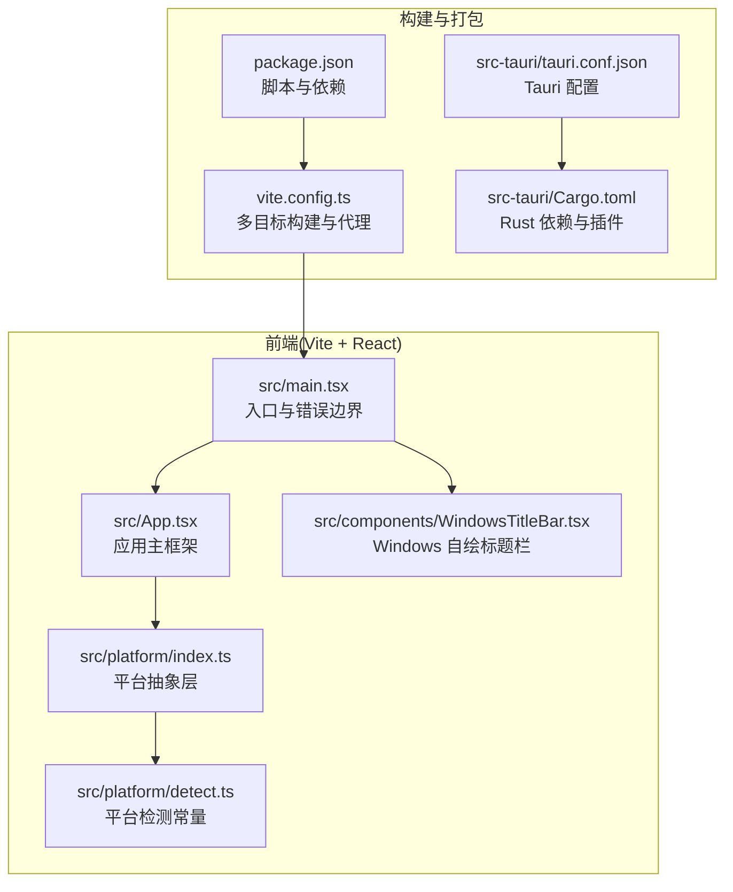
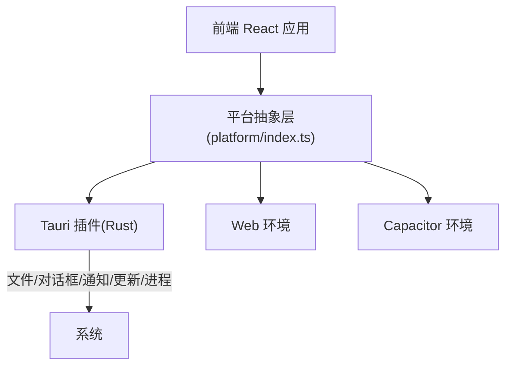
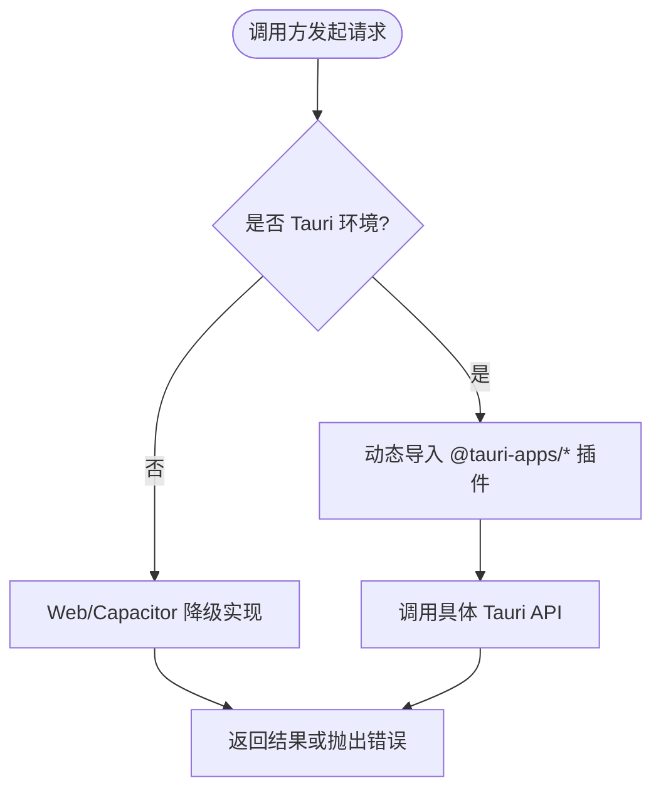
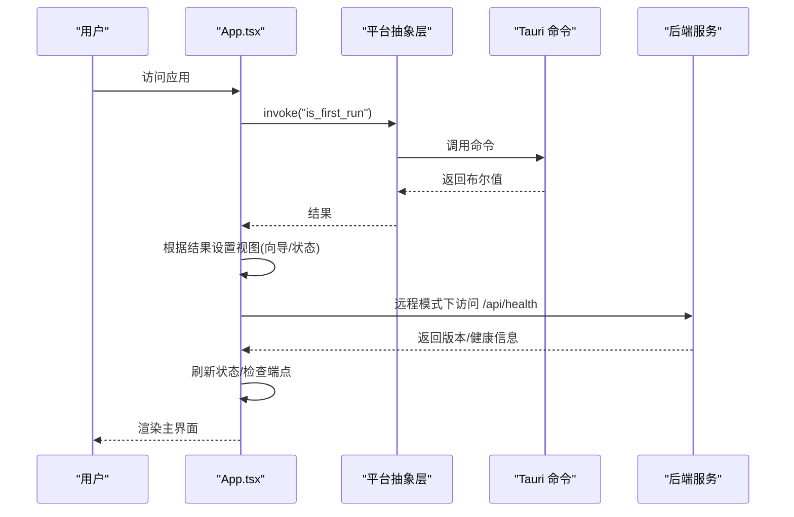
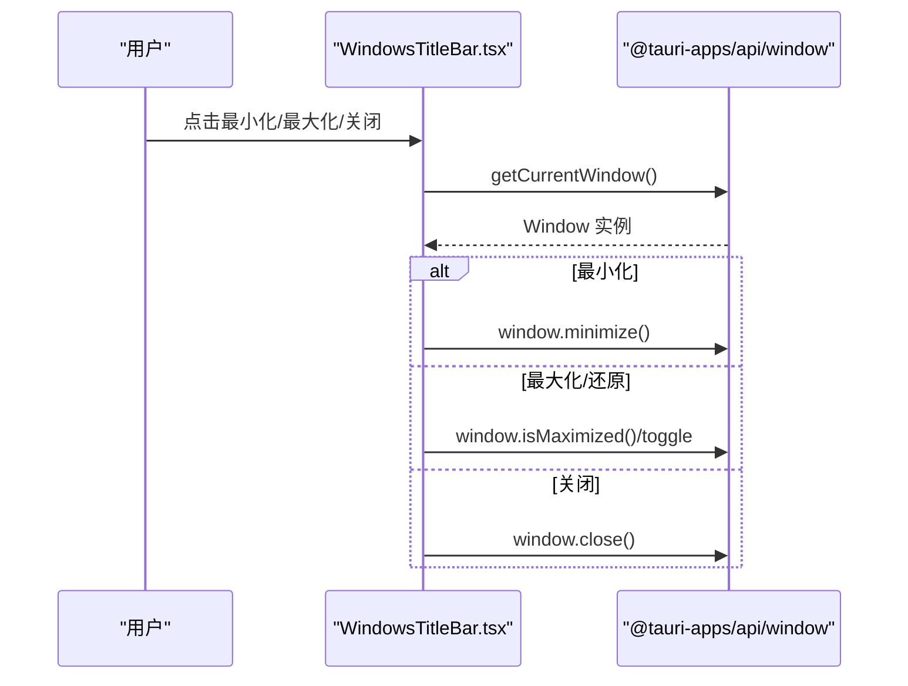
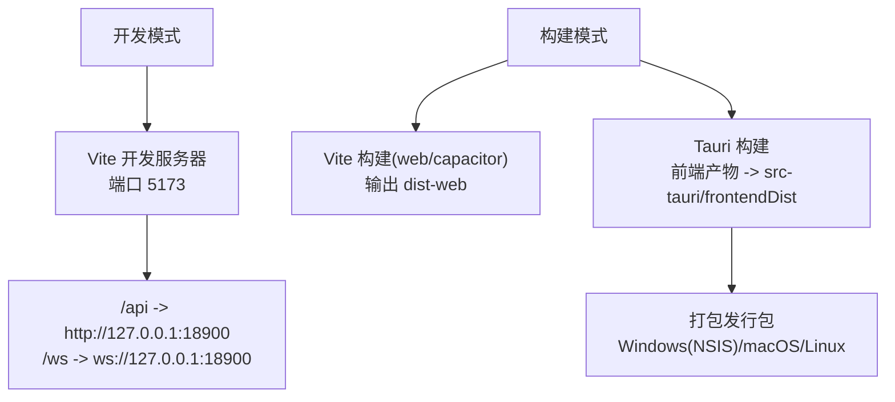
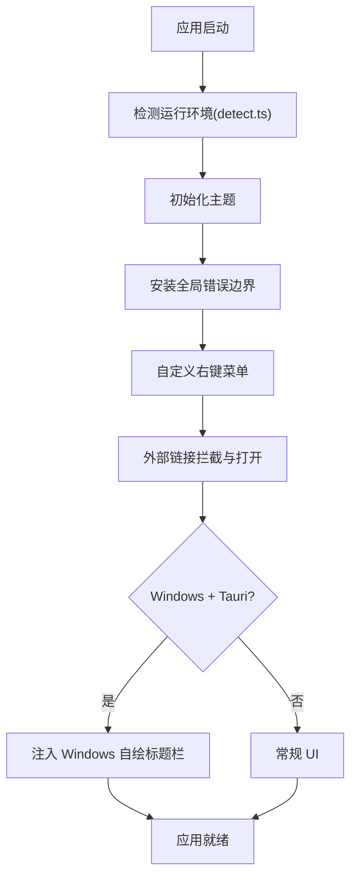
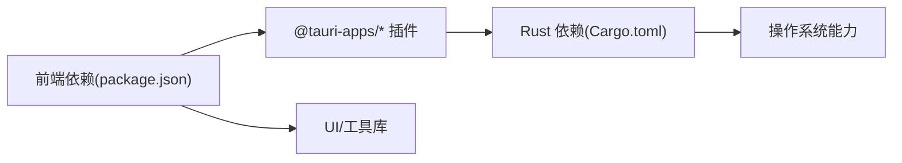

# 桌面应用开发

<cite>
**本文引用的文件**
- [Cargo.toml](file://apps/setup-center/src-tauri/Cargo.toml)
- [tauri.conf.json](file://apps/setup-center/src-tauri/tauri.conf.json)
- [package.json](file://apps/setup-center/package.json)
- [vite.config.ts](file://apps/setup-center/vite.config.ts)
- [main.tsx](file://apps/setup-center/src/main.tsx)
- [App.tsx](file://apps/setup-center/src/App.tsx)
- [detect.ts](file://apps/setup-center/src/platform/detect.ts)
- [WindowsTitleBar.tsx](file://apps/setup-center/src/components/WindowsTitleBar.tsx)
- [platform/index.ts](file://apps/setup-center/src/platform/index.ts)
</cite>

## 目录
1. [引言](#引言)
2. [项目结构](#项目结构)
3. [核心组件](#核心组件)
4. [架构总览](#架构总览)
5. [详细组件分析](#详细组件分析)
6. [依赖分析](#依赖分析)
7. [性能考虑](#性能考虑)
8. [故障排查指南](#故障排查指南)
9. [结论](#结论)
10. [附录](#附录)

## 引言
本文件面向桌面应用开发团队，系统梳理基于 Tauri + React 的桌面应用架构与实现细节，覆盖前端技术栈、桌面集成功能、系统托盘与窗口管理、跨平台打包流程、开发与调试技巧、性能优化策略以及 UI 组件与用户体验设计原则。文档以 apps/setup-center 子项目为核心案例，结合仓库中的配置与源码进行深入解析。

## 项目结构
apps/setup-center 是一个采用 Vite + React 的前端工程，配合 Tauri 提供桌面能力，并通过 Capacitor 支持移动端 Web 化部署。前端通过统一的平台抽象层在不同运行环境（Web、Tauri、Capacitor）之间无缝切换。

**图表来源**
- [main.tsx:1-377](file://apps/setup-center/src/main.tsx#L1-L377)
- [App.tsx:1-800](file://apps/setup-center/src/App.tsx#L1-L800)
- [platform/index.ts:1-507](file://apps/setup-center/src/platform/index.ts#L1-L507)
- [detect.ts:1-39](file://apps/setup-center/src/platform/detect.ts#L1-L39)
- [WindowsTitleBar.tsx:1-121](file://apps/setup-center/src/components/WindowsTitleBar.tsx#L1-L121)
- [package.json:1-86](file://apps/setup-center/package.json#L1-L86)
- [vite.config.ts:1-89](file://apps/setup-center/vite.config.ts#L1-L89)
- [tauri.conf.json:1-75](file://apps/setup-center/src-tauri/tauri.conf.json#L1-L75)
- [Cargo.toml:1-49](file://apps/setup-center/src-tauri/Cargo.toml#L1-L49)

**章节来源**
- [package.json:1-86](file://apps/setup-center/package.json#L1-L86)
- [vite.config.ts:1-89](file://apps/setup-center/vite.config.ts#L1-L89)
- [tauri.conf.json:1-75](file://apps/setup-center/src-tauri/tauri.conf.json#L1-L75)
- [Cargo.toml:1-49](file://apps/setup-center/src-tauri/Cargo.toml#L1-L49)

## 核心组件
- 平台抽象层：封装 Tauri、Web、Capacitor 三类运行环境差异，提供统一的调用接口（如 invoke、listen、openExternalUrl、proxyFetch、registerGlobalShortcut、sendNotification 等），并在 Web 构建时以桩模块替代 Tauri API，避免打包进浏览器。
- 应用主框架：根据哈希路由切换视图，管理首次运行向导、工作区与服务状态、版本更新、通知与错误边界等。
- Windows 自绘标题栏：在 Tauri + Windows 场景下替换系统标题栏，提供拖拽区域与窗口控制按钮。
- 构建与打包：通过 Vite 多目标构建（web/capacitor/tauri），Tauri 配置定义窗口、安全策略、资源与打包参数，Cargo.toml 声明 Rust 插件与系统依赖。

**章节来源**
- [platform/index.ts:1-507](file://apps/setup-center/src/platform/index.ts#L1-L507)
- [App.tsx:1-800](file://apps/setup-center/src/App.tsx#L1-L800)
- [WindowsTitleBar.tsx:1-121](file://apps/setup-center/src/components/WindowsTitleBar.tsx#L1-L121)
- [vite.config.ts:1-89](file://apps/setup-center/vite.config.ts#L1-L89)
- [tauri.conf.json:1-75](file://apps/setup-center/src-tauri/tauri.conf.json#L1-L75)
- [Cargo.toml:1-49](file://apps/setup-center/src-tauri/Cargo.toml#L1-L49)

## 架构总览
应用采用“前端 React + 平台抽象层 + Tauri 插件”的分层架构。前端在不同运行环境下通过动态导入与条件分支实现能力适配；Tauri 负责系统集成（文件系统、对话框、进程、通知、全局快捷键、更新器等）；Vite 负责多目标构建与开发服务器。

**图表来源**
- [platform/index.ts:1-507](file://apps/setup-center/src/platform/index.ts#L1-L507)
- [vite.config.ts:1-89](file://apps/setup-center/vite.config.ts#L1-L89)
- [tauri.conf.json:1-75](file://apps/setup-center/src-tauri/tauri.conf.json#L1-L75)
- [Cargo.toml:1-49](file://apps/setup-center/src-tauri/Cargo.toml#L1-L49)

## 详细组件分析

### 平台抽象层（platform/index.ts）
- 统一 API：提供 invoke、listen、openExternalUrl、proxyFetch、registerGlobalShortcut、sendNotification、openPopupWindow 等，Web 构建时以空实现或降级逻辑替代。
- 文件与下载：downloadFile、showInFolder、openFileWithDefault、readFileBase64、writeTextFile、writeFile、saveAttachment。
- 对话框：openFileDialog、saveFileDialog。
- 更新与进程：checkForUpdate、relaunchApp。
- 全局快捷键与通知：registerGlobalShortcut、sendNotification。
- 代理与拖拽：proxyFetch、onDragDrop。
- 资产协议：getAssetUrl 将本地路径转换为 Tauri 资产协议 URL。

**图表来源**
- [platform/index.ts:38-46](file://apps/setup-center/src/platform/index.ts#L38-L46)
- [platform/index.ts:52-59](file://apps/setup-center/src/platform/index.ts#L52-L59)
- [platform/index.ts:109-126](file://apps/setup-center/src/platform/index.ts#L109-L126)
- [platform/index.ts:206-234](file://apps/setup-center/src/platform/index.ts#L206-L234)

**章节来源**
- [platform/index.ts:1-507](file://apps/setup-center/src/platform/index.ts#L1-L507)

### 应用主框架（App.tsx）
- 视图路由：基于 URL 哈希路由切换视图（如 chat/im/skills/mcp 等），支持嵌入文档 iframe 的 postMessage 导航。
- 首次运行向导：根据 is_first_run 判定进入 onboarding 或直接进入状态页；支持探测本地服务并一键连接。
- 数据模式：本地（Tauri 命令）与远程（HTTP API）双模式，Web/Capacitor 默认远程模式。
- 版本与更新：useVersionCheck 管理桌面版本与后端版本比对、更新检查与下载安装。
- 环境与工作区：useEnvManager 管理环境变量草稿、保存与加载；工作区列表与当前工作区切换。
- 错误与通知：全局错误边界捕获未处理异常；通知与消息提示组件贯穿各功能模块。

**图表来源**
- [App.tsx:563-606](file://apps/setup-center/src/App.tsx#L563-L606)
- [App.tsx:517-528](file://apps/setup-center/src/App.tsx#L517-L528)
- [App.tsx:531-560](file://apps/setup-center/src/App.tsx#L531-L560)
- [platform/index.ts:38-46](file://apps/setup-center/src/platform/index.ts#L38-L46)

**章节来源**
- [App.tsx:1-800](file://apps/setup-center/src/App.tsx#L1-L800)

### Windows 自绘标题栏（WindowsTitleBar.tsx）
- 功能：最小化、最大化/还原、关闭；监听窗口大小变化同步最大化状态；提供拖拽区域。
- 交互：通过 @tauri-apps/api/window 获取当前窗口实例并调用对应方法；按钮具备无障碍标签。

**图表来源**
- [WindowsTitleBar.tsx:56-79](file://apps/setup-center/src/components/WindowsTitleBar.tsx#L56-L79)

**章节来源**
- [WindowsTitleBar.tsx:1-121](file://apps/setup-center/src/components/WindowsTitleBar.tsx#L1-L121)

### 构建与运行（Vite + Tauri）
- 多目标构建：通过环境变量 VITE_BUILD_TARGET 控制构建目标（web/capacitor/tauri），在 web/capacitor 目标下注入 Tauri 桩模块以避免打包 Tauri API。
- 代理与开发：在 web 目标下配置 /api 与 /ws 代理到本地后端，便于前后端联调。
- Tauri 配置：定义窗口尺寸、最小尺寸、CSP、资源与打包参数（包括 NSIS 安装器、图标、签名等），声明插件（updater、dialog、fs、http、process、shell、global-shortcut、notification 等）。

**图表来源**
- [vite.config.ts:64-85](file://apps/setup-center/vite.config.ts#L64-L85)
- [vite.config.ts:11-37](file://apps/setup-center/vite.config.ts#L11-L37)
- [tauri.conf.json:6-11](file://apps/setup-center/src-tauri/tauri.conf.json#L6-L11)
- [tauri.conf.json:12-44](file://apps/setup-center/src-tauri/tauri.conf.json#L12-L44)

**章节来源**
- [vite.config.ts:1-89](file://apps/setup-center/vite.config.ts#L1-L89)
- [tauri.conf.json:1-75](file://apps/setup-center/src-tauri/tauri.conf.json#L1-L75)

### 平台检测与入口（detect.ts、main.tsx）
- 平台检测：IS_TAURI、IS_CAPACITOR、IS_WEB、IS_LOCAL_WEB、IS_MOBILE_BROWSER、IS_WINDOWS 等常量，用于条件分支与 UI 行为适配。
- 应用入口：安装全局错误边界与未处理 Promise 拒绝捕获；在 Tauri 目标下安装本地 fetch 重写；按平台注入自定义右键菜单、外部链接处理、Windows 自绘标题栏等。

**图表来源**
- [detect.ts:1-39](file://apps/setup-center/src/platform/detect.ts#L1-L39)
- [main.tsx:32-52](file://apps/setup-center/src/main.tsx#L32-L52)
- [main.tsx:180-336](file://apps/setup-center/src/main.tsx#L180-L336)
- [main.tsx:344-372](file://apps/setup-center/src/main.tsx#L344-L372)

**章节来源**
- [detect.ts:1-39](file://apps/setup-center/src/platform/detect.ts#L1-L39)
- [main.tsx:1-377](file://apps/setup-center/src/main.tsx#L1-L377)

## 依赖分析
- 前端依赖：React 生态、Ant Design、TailwindCSS、Monaco Editor、Three.js、Recharts、i18n、Sonner 等；Tauri 插件通过 @tauri-apps/* 与各官方插件包引入。
- Tauri 插件：dialog、clipboard-manager、fs、http、process、shell、global-shortcut、notification、updater、autostart 等，分别用于对话框、剪贴板、文件系统、HTTP、进程、全局快捷键、通知、更新与开机自启。
- 平台抽象层：通过动态导入避免将 Tauri API 打包进 Web/Capacitor 构建；在 Tauri 目标下提供 invoke/listen 等能力。

**图表来源**
- [package.json:20-74](file://apps/setup-center/package.json#L20-L74)
- [Cargo.toml:13-42](file://apps/setup-center/src-tauri/Cargo.toml#L13-L42)

**章节来源**
- [package.json:1-86](file://apps/setup-center/package.json#L1-L86)
- [Cargo.toml:1-49](file://apps/setup-center/src-tauri/Cargo.toml#L1-L49)

## 性能考虑
- 代码分割：App.tsx 中大量视图采用懒加载，降低首屏体积与加载时间。
- 依赖预优化：vite.config.ts 对 Three.js 及相关图形库进行 optimizeDeps.include，减少冷启动抖动。
- 构建目标差异化：web/capacitor 目标注入 Tauri 桩模块，避免打包 Tauri API，减小体积。
- 窗口与布局：Windows 自绘标题栏与响应式侧边栏折叠，提升桌面体验与内存占用。
- 网络与缓存：CSP 限制与代理配置，确保资源加载安全与稳定。

**章节来源**
- [App.tsx:10-30](file://apps/setup-center/src/App.tsx#L10-L30)
- [vite.config.ts:55-63](file://apps/setup-center/vite.config.ts#L55-L63)
- [vite.config.ts:41-44](file://apps/setup-center/vite.config.ts#L41-L44)
- [WindowsTitleBar.tsx:1-121](file://apps/setup-center/src/components/WindowsTitleBar.tsx#L1-L121)
- [tauri.conf.json:58-60](file://apps/setup-center/src-tauri/tauri.conf.json#L58-L60)

## 故障排查指南
- 全局错误边界：捕获未处理异常与 Promise 拒绝，记录日志并提供“复制错误信息”与“重新加载”按钮，便于快速定位问题。
- 外部链接处理：阻止 WebView 导航至外部地址，改由系统默认浏览器打开，避免后端不可用时出现空白页。
- 自定义右键菜单：在编辑态与纯文本选择态提供剪切/复制/粘贴/全选等操作，避免浏览器默认菜单冲突。
- 平台差异：通过 detect.ts 常量判断运行环境，针对不同平台启用相应 UI 与行为（如 Windows 自绘标题栏）。
- Tauri 插件可用性：在 Web/Capacitor 目标下，平台抽象层会降级或返回空实现，避免运行时报错。

**章节来源**
- [main.tsx:35-52](file://apps/setup-center/src/main.tsx#L35-L52)
- [main.tsx:316-336](file://apps/setup-center/src/main.tsx#L316-L336)
- [main.tsx:180-314](file://apps/setup-center/src/main.tsx#L180-L314)
- [detect.ts:1-39](file://apps/setup-center/src/platform/detect.ts#L1-L39)
- [platform/index.ts:1-507](file://apps/setup-center/src/platform/index.ts#L1-L507)

## 结论
该桌面应用以 Tauri 为核心，结合 React/Vite 构建体系，实现了跨平台桌面能力与 Web/Capacitor 的灵活部署。平台抽象层有效屏蔽了运行环境差异，使前端逻辑在多目标下保持一致；Windows 自绘标题栏与丰富的 Tauri 插件进一步增强了桌面体验。通过合理的构建策略、性能优化与完善的错误处理机制，项目在易用性、可维护性与扩展性方面均表现良好。

## 附录
- 开发环境搭建建议：安装 Node.js、Rust 工具链与 Tauri CLI；在项目根目录执行安装与启动脚本；开发时使用 Vite 本地服务器与 Tauri 开发命令。
- 调试技巧：利用全局错误边界提供的“复制错误信息”功能；在 Tauri 目标下通过 @tauri-apps/api 打印日志；使用浏览器开发者工具与 Tauri 日志面板联合定位问题。
- 性能优化建议：持续监控首屏加载时间与内存占用；对大型依赖进行按需加载；合理使用缓存与代理；在生产构建中开启压缩与 Tree Shaking。
- UI 组件与用户体验：遵循 Ant Design 设计规范；为关键操作提供无障碍标签；在 Windows 平台提供自绘标题栏；在移动浏览器场景下注意视觉视口与键盘遮挡问题。