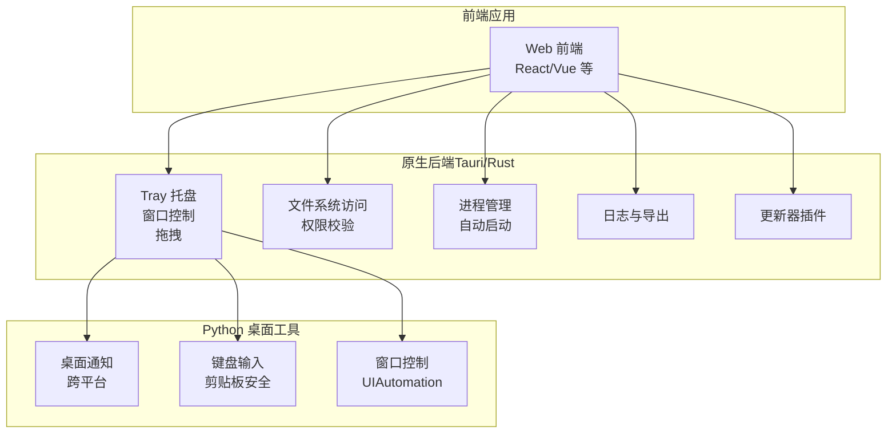
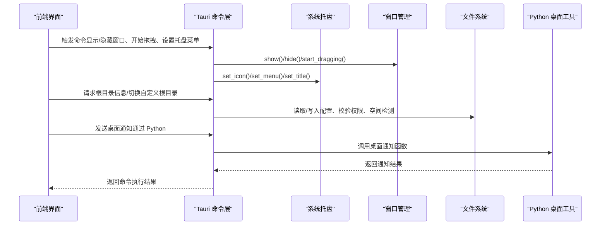
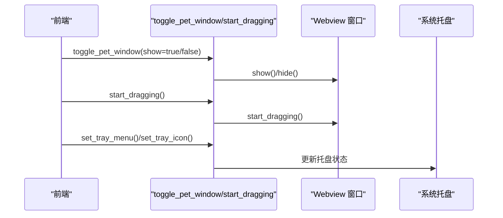
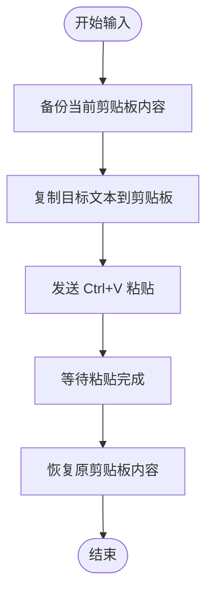
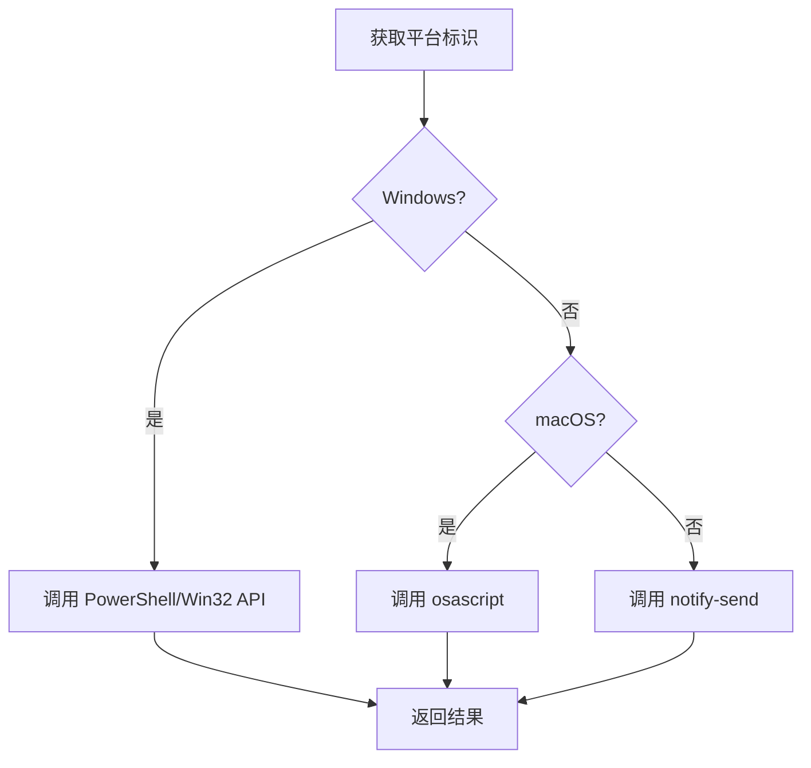
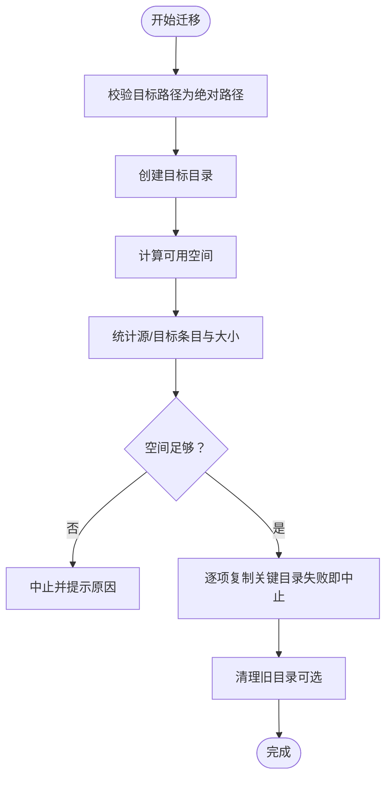
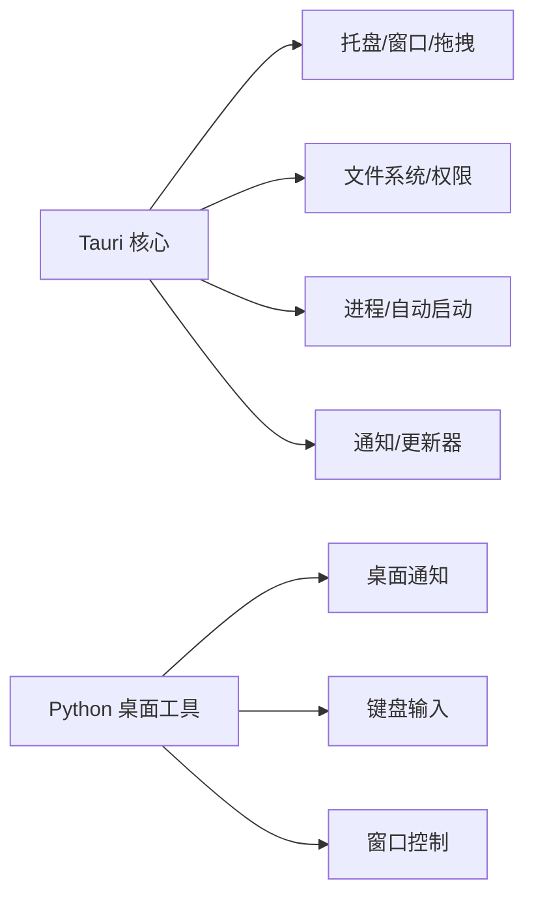

# 桌面系统集成

<cite>
**本文引用的文件**
- [apps/setup-center/src-tauri/src/main.rs](file://apps/setup-center/src-tauri/src/main.rs)
- [apps/setup-center/src-tauri/tauri.conf.json](file://apps/setup-center/src-tauri/tauri.conf.json)
- [apps/setup-center/src-tauri/Cargo.toml](file://apps/setup-center/src-tauri/Cargo.toml)
- [src/synapse/core/desktop_notify.py](file://src/synapse/core/desktop_notify.py)
- [src/synapse/tools/desktop/actions/keyboard.py](file://src/synapse/tools/desktop/actions/keyboard.py)
- [src/synapse/tools/desktop/controller.py](file://src/synapse/tools/desktop/controller.py)
</cite>

## 目录
1. [引言](#引言)
2. [项目结构](#项目结构)
3. [核心组件](#核心组件)
4. [架构总览](#架构总览)
5. [详细组件分析](#详细组件分析)
6. [依赖关系分析](#依赖关系分析)
7. [性能考虑](#性能考虑)
8. [故障排查指南](#故障排查指南)
9. [结论](#结论)
10. [附录](#附录)

## 引言
本技术文档聚焦桌面系统集成能力，围绕系统托盘与窗口管理、剪贴板安全操作、平台检测与原生功能调用、文件系统权限控制、右键菜单定制、拖拽支持与快捷键绑定等主题，结合前端与原生后端（Tauri/Rust/Python）的实际实现进行深入解析，并提供最佳实践与用户体验优化建议。

## 项目结构
桌面系统集成主要分布在以下位置：
- 原生后端（Tauri/Rust）：负责系统托盘、窗口状态控制、拖拽、自动启动、进程管理、文件系统访问、日志与更新等
- Python 桌面通知模块：跨平台系统通知（Windows/macOS/Linux）
- Python 桌面工具链：键盘输入（剪贴板安全策略）、窗口控制（UIAutomation）

图表来源
- [apps/setup-center/src-tauri/src/main.rs](file://apps/setup-center/src-tauri/src/main.rs)
- [apps/setup-center/src-tauri/tauri.conf.json](file://apps/setup-center/src-tauri/tauri.conf.json)
- [apps/setup-center/src-tauri/Cargo.toml](file://apps/setup-center/src-tauri/Cargo.toml)
- [src/synapse/core/desktop_notify.py](file://src/synapse/core/desktop_notify.py)
- [src/synapse/tools/desktop/actions/keyboard.py](file://src/synapse/tools/desktop/actions/keyboard.py)
- [src/synapse/tools/desktop/controller.py](file://src/synapse/tools/desktop/controller.py)

章节来源
- [apps/setup-center/src-tauri/src/main.rs](file://apps/setup-center/src-tauri/src/main.rs)
- [apps/setup-center/src-tauri/tauri.conf.json](file://apps/setup-center/src-tauri/tauri.conf.json)
- [apps/setup-center/src-tauri/Cargo.toml](file://apps/setup-center/src-tauri/Cargo.toml)

## 核心组件
- 系统托盘与窗口管理
  - 托盘图标、菜单、可见性与标题设置
  - 窗口显示/隐藏、拖拽、尺寸与最小/最大/可调整属性
- 剪贴板安全操作
  - 输入前备份/恢复剪贴板，避免污染用户数据
  - Windows 原生剪贴板 API 降级路径
- 平台检测与原生功能
  - Rust 端通过条件编译与系统 API 实现跨平台行为
  - Python 端通过 platform/system 调用系统通知
- 文件系统访问与权限控制
  - 自定义根目录、写入权限校验、空间检测、迁移预检
- 右键菜单定制与拖拽支持
  - 托盘菜单项与窗口拖拽区域
- 快捷键绑定
  - 全局快捷键插件与命令映射

章节来源
- [apps/setup-center/src-tauri/src/main.rs](file://apps/setup-center/src-tauri/src/main.rs)
- [apps/setup-center/src-tauri/Cargo.toml](file://apps/setup-center/src-tauri/Cargo.toml)
- [src/synapse/core/desktop_notify.py](file://src/synapse/core/desktop_notify.py)
- [src/synapse/tools/desktop/actions/keyboard.py](file://src/synapse/tools/desktop/actions/keyboard.py)
- [src/synapse/tools/desktop/controller.py](file://src/synapse/tools/desktop/controller.py)

## 架构总览
桌面系统集成采用“前端驱动 + 原生后端 + Python 工具”的分层架构：
- 前端通过 Tauri 命令与原生后端交互，实现托盘、窗口、文件系统、进程与日志等功能
- Python 桌面工具在需要时被调用，提供跨平台通知与桌面自动化能力
- 配置与资源通过 Tauri 配置与打包清单统一管理

图表来源
- [apps/setup-center/src-tauri/src/main.rs](file://apps/setup-center/src-tauri/src/main.rs)
- [apps/setup-center/src-tauri/Cargo.toml](file://apps/setup-center/src-tauri/Cargo.toml)
- [src/synapse/core/desktop_notify.py](file://src/synapse/core/desktop_notify.py)

## 详细组件分析

### 系统托盘与窗口管理
- 托盘图标与菜单
  - 通过命令设置托盘图标、菜单、标题、可见性与左键点击行为
  - 菜单项与权限由 Tauri 权限文件自动生成与管理
- 窗口状态控制
  - 显示/隐藏特定窗口（如 pet_window）
  - 窗口拖拽：在非客户端区域触发拖拽，提升可用性
  - 窗口尺寸与最小/最大/可调整属性由 Tauri 配置统一约束

图表来源
- [apps/setup-center/src-tauri/src/main.rs](file://apps/setup-center/src-tauri/src/main.rs)

章节来源
- [apps/setup-center/src-tauri/src/main.rs](file://apps/setup-center/src-tauri/src/main.rs)
- [apps/setup-center/src-tauri/tauri.conf.json](file://apps/setup-center/src-tauri/tauri.conf.json)

### 剪贴板安全操作（键盘输入）
- 设计原则
  - 输入前备份当前剪贴板内容，输入完成后恢复，避免污染用户数据
  - 优先使用第三方库；若不可用，回退至平台原生 API
- Windows 原生路径
  - 使用用户32/内核32 API 打开剪贴板、分配/锁定内存、设置 Unicode 文本、关闭剪贴板
- 流程图

图表来源
- [src/synapse/tools/desktop/actions/keyboard.py](file://src/synapse/tools/desktop/actions/keyboard.py)

章节来源
- [src/synapse/tools/desktop/actions/keyboard.py](file://src/synapse/tools/desktop/actions/keyboard.py)

### 平台检测与原生功能调用
- Rust 端
  - 条件编译：针对 Windows/macOS/Linux 的不同实现
  - 系统 API：进程枚举、命令行匹配、磁盘空间查询、进程终止
- Python 端
  - platform.system() 判断平台，分别调用系统通知命令或脚本
  - 超时与兜底：失败时发出终端提示音

图表来源
- [src/synapse/core/desktop_notify.py](file://src/synapse/core/desktop_notify.py)

章节来源
- [apps/setup-center/src-tauri/src/main.rs](file://apps/setup-center/src-tauri/src/main.rs)
- [src/synapse/core/desktop_notify.py](file://src/synapse/core/desktop_notify.py)

### 文件系统访问与权限控制
- 自定义根目录
  - 支持设置绝对路径、写入权限校验、迁移预检与实际迁移
  - 迁移时区分关键目录与可选目录，关键目录失败则中止并回滚
- 空间检测
  - Windows 使用系统 API 查询磁盘剩余空间
  - Unix 使用 statvfs 查询可用空间
- 预检流程

图表来源
- [apps/setup-center/src-tauri/src/main.rs](file://apps/setup-center/src-tauri/src/main.rs)

章节来源
- [apps/setup-center/src-tauri/src/main.rs](file://apps/setup-center/src-tauri/src/main.rs)

### 右键菜单定制与拖拽支持
- 托盘右键菜单
  - 通过命令动态设置菜单项、图标模板、临时目录路径等
  - 菜单项权限由 Tauri 自动生成的权限文件管理
- 窗口拖拽
  - 在非客户端区域启用拖拽，提升窗口移动体验

章节来源
- [apps/setup-center/src-tauri/src/main.rs](file://apps/setup-center/src-tauri/src/main.rs)

### 快捷键绑定
- 全局快捷键插件
  - 使用 Tauri 插件注册全局快捷键，映射到具体命令
  - 前端按键事件与后端命令解耦，便于扩展

章节来源
- [apps/setup-center/src-tauri/Cargo.toml](file://apps/setup-center/src-tauri/Cargo.toml)

## 依赖关系分析
- 原生后端依赖
  - Tauri 核心、对话框、剪贴板管理、文件系统、HTTP、进程、全局快捷键、通知、自动启动、更新器等插件
  - 平台特定依赖：Windows 注册表、Unix libc
- Python 桌面工具依赖
  - 桌面通知：platform、subprocess、winsound/osascript/notify-send
  - 键盘输入：pyperclip、pyautogui、ctypes（Windows）

图表来源
- [apps/setup-center/src-tauri/Cargo.toml](file://apps/setup-center/src-tauri/Cargo.toml)
- [src/synapse/core/desktop_notify.py](file://src/synapse/core/desktop_notify.py)
- [src/synapse/tools/desktop/actions/keyboard.py](file://src/synapse/tools/desktop/actions/keyboard.py)
- [src/synapse/tools/desktop/controller.py](file://src/synapse/tools/desktop/controller.py)

章节来源
- [apps/setup-center/src-tauri/Cargo.toml](file://apps/setup-center/src-tauri/Cargo.toml)

## 性能考虑
- 托盘与窗口操作
  - 尽量减少频繁的菜单重建与图标切换，批量更新状态
  - 拖拽区域尽量靠近标题栏，避免误触
- 剪贴板操作
  - 控制备份/恢复频率，避免高频 IO
  - Windows 原生路径减少中间层调用
- 文件系统
  - 迁移前进行空间与条目预检，避免中途失败
  - 关键目录失败立即中止，降低回滚成本
- 通知
  - 异步发送通知，避免阻塞事件循环
  - 失败时快速兜底，保证用户体验

## 故障排查指南
- 启动崩溃与诊断
  - 启用崩溃日志记录与全局异常捕获，输出到日志文件并提示用户
  - 使用进程扫描与终止功能清理孤儿进程
- 进程管理
  - 通过命令列出/停止所有后端进程，支持精确匹配与兜底扫描
- 日志与导出
  - 前端日志自动轮转，支持导出到用户下载目录
- 平台差异
  - Windows：检查 PowerShell/Win32 API 可用性
  - macOS：检查 osascript 可用性
  - Linux：检查 notify-send 可用性

章节来源
- [.commitmsg_crash](file://.commitmsg_crash)
- [apps/setup-center/src-tauri/src/main.rs](file://apps/setup-center/src-tauri/src/main.rs)
- [src/synapse/core/desktop_notify.py](file://src/synapse/core/desktop_notify.py)

## 结论
本项目通过 Tauri 命令层与 Python 工具层协同，实现了跨平台的系统托盘、窗口管理、剪贴板安全输入、文件系统权限控制与平台适配。配合全局快捷键、右键菜单定制与拖拽支持，提供了稳定且可扩展的桌面系统集成功能。建议在生产环境中持续完善日志与诊断能力，并保持对平台差异的敏感度与兼容性测试。

## 附录
- 最佳实践
  - 托盘菜单项与权限分离，遵循最小权限原则
  - 窗口拖拽与尺寸约束统一管理，避免误操作
  - 剪贴板操作前后必须备份/恢复，确保用户数据安全
  - 文件系统变更前进行预检与回滚策略设计
  - 通知失败兜底，保证用户感知
- 用户体验优化
  - 提供“正在自动启动”状态提示与禁用按钮
  - 拖拽区域与窗口边框视觉反馈
  - 快捷键冲突检测与可配置性
  - 日志导出与崩溃报告收集