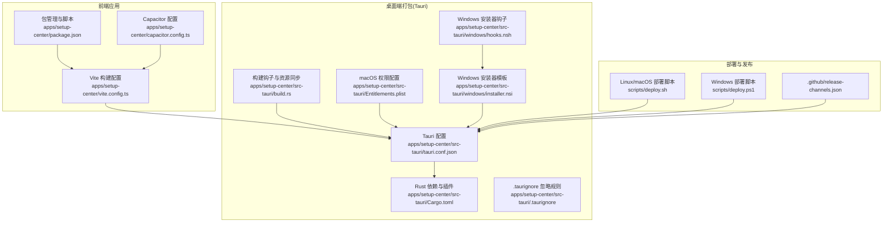
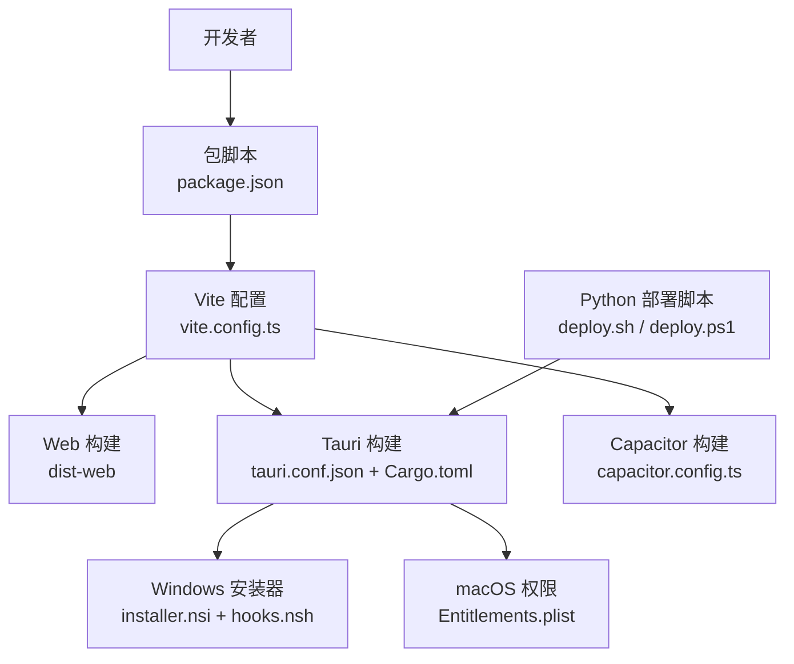
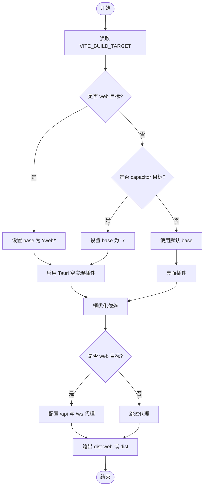
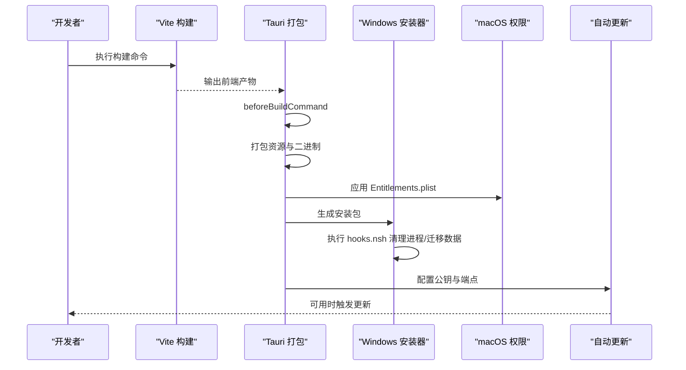
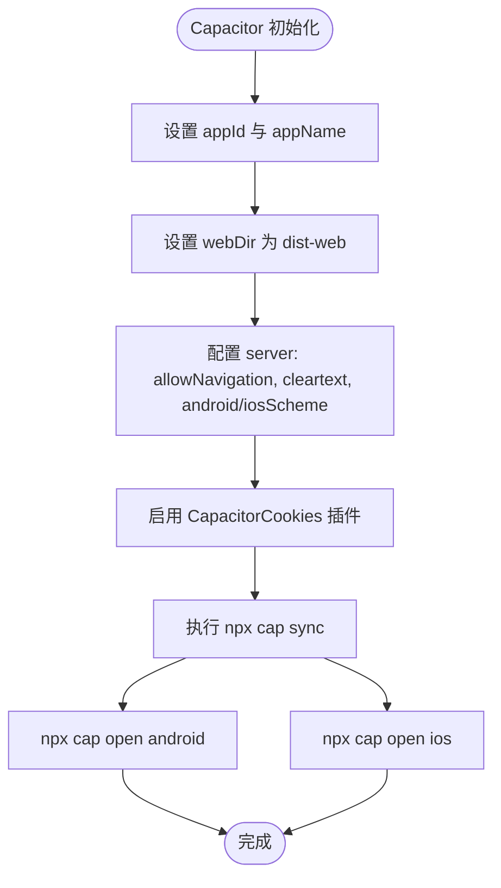
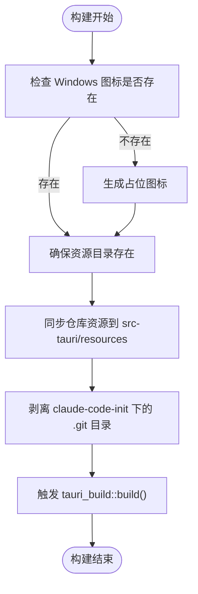
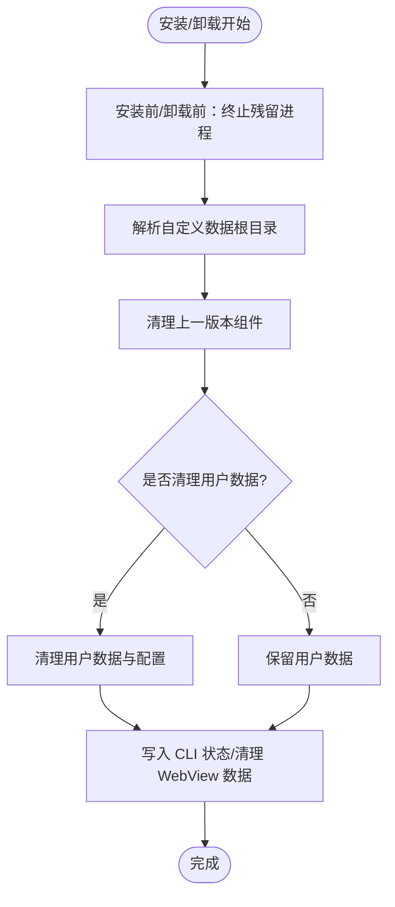
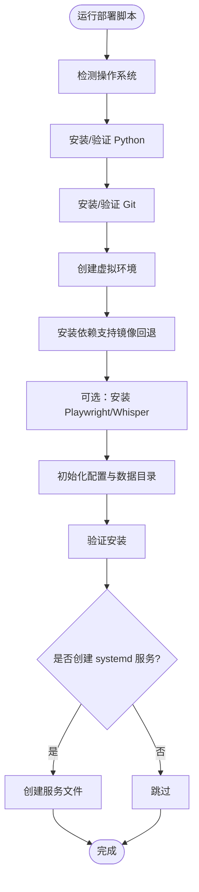
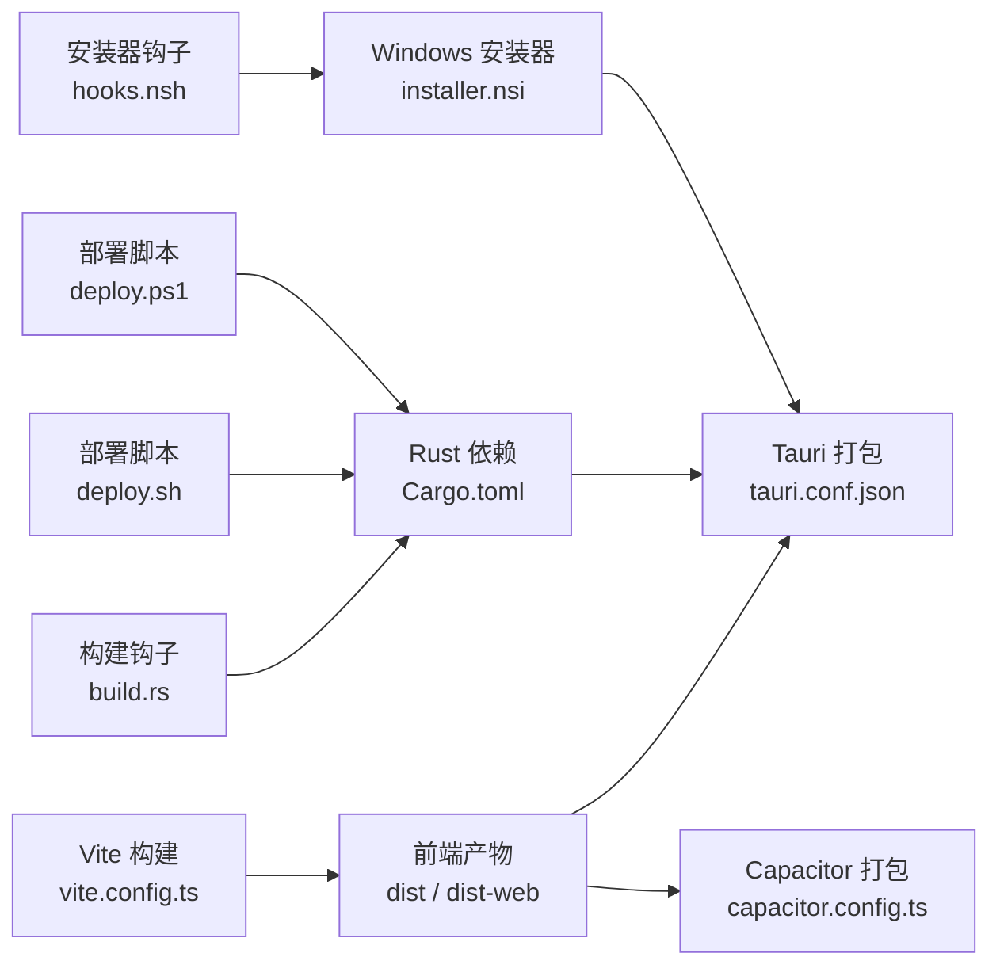

# 跨平台打包部署

<cite>
**本文档引用的文件**
- [vite.config.ts](file://apps/setup-center/vite.config.ts)
- [package.json](file://apps/setup-center/package.json)
- [capacitor.config.ts](file://apps/setup-center/capacitor.config.ts)
- [tauri.conf.json](file://apps/setup-center/src-tauri/tauri.conf.json)
- [Cargo.toml](file://apps/setup-center/src-tauri/Cargo.toml)
- [build.rs](file://apps/setup-center/src-tauri/build.rs)
- [Entitlements.plist](file://apps/setup-center/src-tauri/Entitlements.plist)
- [installer.nsi](file://apps/setup-center/src-tauri/windows/installer.nsi)
- [hooks.nsh](file://apps/setup-center/src-tauri/windows/hooks.nsh)
- [.taurignore](file://apps/setup-center/src-tauri/.taurignore)
- [deploy.sh](file://scripts/deploy.sh)
- [deploy.ps1](file://scripts/deploy.ps1)
- [release-channels.json](file://.github/release-channels.json)
</cite>

## 目录
1. [简介](#简介)
2. [项目结构](#项目结构)
3. [核心组件](#核心组件)
4. [架构总览](#架构总览)
5. [详细组件分析](#详细组件分析)
6. [依赖关系分析](#依赖关系分析)
7. [性能考量](#性能考量)
8. [故障排查指南](#故障排查指南)
9. [结论](#结论)
10. [附录](#附录)

## 简介
本技术文档面向跨平台打包部署场景，围绕 Vite 构建工具配置优化、Tauri 打包流程实现细节、Capacitor 移动端适配方案进行系统化说明。重点涵盖：
- Vite 多目标构建（桌面、Web、移动端）的差异化配置与插件策略
- Tauri 打包与签名、自动更新、资源打包与系统集成
- Capacitor 移动端适配与原生能力桥接
- CI/CD 发布流程与版本管理最佳实践
- 常见问题定位与解决方案

## 项目结构
本项目采用多应用与多平台混合架构：
- 前端应用位于 apps/setup-center，包含 React/Vite 前端与 Capacitor 移动端配置
- 桌面端打包基于 Tauri，配置位于 src-tauri 目录
- 资源与构建脚本位于 scripts 目录，用于部署与环境准备

**图表来源**
- [vite.config.ts:1-89](file://apps/setup-center/vite.config.ts#L1-L89)
- [package.json:1-86](file://apps/setup-center/package.json#L1-L86)
- [capacitor.config.ts:1-25](file://apps/setup-center/capacitor.config.ts#L1-L25)
- [tauri.conf.json:1-75](file://apps/setup-center/src-tauri/tauri.conf.json#L1-L75)
- [Cargo.toml:1-49](file://apps/setup-center/src-tauri/Cargo.toml#L1-L49)
- [build.rs:1-154](file://apps/setup-center/src-tauri/build.rs#L1-L154)
- [Entitlements.plist:1-36](file://apps/setup-center/src-tauri/Entitlements.plist#L1-L36)
- [installer.nsi:1-800](file://apps/setup-center/src-tauri/windows/installer.nsi#L1-L800)
- [hooks.nsh:1-334](file://apps/setup-center/src-tauri/windows/hooks.nsh#L1-L334)
- [.taurignore:1-5](file://apps/setup-center/src-tauri/.taurignore#L1-L5)
- [deploy.sh:1-781](file://scripts/deploy.sh#L1-L781)
- [deploy.ps1:1-751](file://scripts/deploy.ps1#L1-L751)
- [release-channels.json:1-5](file://.github/release-channels.json#L1-L5)

**章节来源**
- [vite.config.ts:1-89](file://apps/setup-center/vite.config.ts#L1-L89)
- [package.json:1-86](file://apps/setup-center/package.json#L1-L86)
- [capacitor.config.ts:1-25](file://apps/setup-center/capacitor.config.ts#L1-L25)
- [tauri.conf.json:1-75](file://apps/setup-center/src-tauri/tauri.conf.json#L1-L75)
- [Cargo.toml:1-49](file://apps/setup-center/src-tauri/Cargo.toml#L1-L49)
- [build.rs:1-154](file://apps/setup-center/src-tauri/build.rs#L1-L154)
- [Entitlements.plist:1-36](file://apps/setup-center/src-tauri/Entitlements.plist#L1-L36)
- [installer.nsi:1-800](file://apps/setup-center/src-tauri/windows/installer.nsi#L1-L800)
- [hooks.nsh:1-334](file://apps/setup-center/src-tauri/windows/hooks.nsh#L1-L334)
- [.taurignore:1-5](file://apps/setup-center/src-tauri/.taurignore#L1-L5)
- [deploy.sh:1-781](file://scripts/deploy.sh#L1-L781)
- [deploy.ps1:1-751](file://scripts/deploy.ps1#L1-L751)
- [release-channels.json:1-5](file://.github/release-channels.json#L1-L5)

## 核心组件
- Vite 构建配置：支持多目标（桌面/网页/移动端），通过环境变量切换构建目标，注入别名与优化依赖，提供代理与开发服务器配置
- Tauri 打包配置：定义产品元信息、构建前后命令、资源打包、平台签名与自动更新端点
- Capacitor 移动端配置：定义移动端应用标识、Web 目录、服务器策略与插件
- Rust 构建钩子：在构建阶段同步资源、生成占位图标、剥离嵌套 .git 目录，确保打包一致性
- Windows 安装器：NSIS 模板与钩子，负责进程清理、数据迁移与卸载策略
- 部署脚本：跨平台一键部署脚本，自动安装 Python、依赖与可选组件

**章节来源**
- [vite.config.ts:11-37](file://apps/setup-center/vite.config.ts#L11-L37)
- [vite.config.ts:40-87](file://apps/setup-center/vite.config.ts#L40-L87)
- [tauri.conf.json:6-11](file://apps/setup-center/src-tauri/tauri.conf.json#L6-L11)
- [tauri.conf.json:12-56](file://apps/setup-center/src-tauri/tauri.conf.json#L12-L56)
- [capacitor.config.ts:3-22](file://apps/setup-center/capacitor.config.ts#L3-L22)
- [build.rs:1-154](file://apps/setup-center/src-tauri/build.rs#L1-L154)
- [installer.nsi:1-800](file://apps/setup-center/src-tauri/windows/installer.nsi#L1-L800)
- [hooks.nsh:1-334](file://apps/setup-center/src-tauri/windows/hooks.nsh#L1-L334)
- [deploy.sh:1-781](file://scripts/deploy.sh#L1-L781)
- [deploy.ps1:1-751](file://scripts/deploy.ps1#L1-L751)

## 架构总览
整体打包部署架构分为三层：
- 前端构建层：Vite 多目标构建，生成桌面/网页/移动端产物
- 桌面打包层：Tauri 将前端产物与 Rust 二进制整合，生成原生安装包
- 移动端适配层：Capacitor 将 Web 产物封装为原生应用容器

**图表来源**
- [vite.config.ts:1-89](file://apps/setup-center/vite.config.ts#L1-L89)
- [package.json:6-18](file://apps/setup-center/package.json#L6-L18)
- [tauri.conf.json:6-11](file://apps/setup-center/src-tauri/tauri.conf.json#L6-L11)
- [capacitor.config.ts:3-6](file://apps/setup-center/capacitor.config.ts#L3-L6)
- [installer.nsi:1-800](file://apps/setup-center/src-tauri/windows/installer.nsi#L1-L800)
- [hooks.nsh:1-334](file://apps/setup-center/src-tauri/windows/hooks.nsh#L1-L334)
- [Entitlements.plist:1-36](file://apps/setup-center/src-tauri/Entitlements.plist#L1-L36)
- [deploy.sh:1-781](file://scripts/deploy.sh#L1-L781)
- [deploy.ps1:1-751](file://scripts/deploy.ps1#L1-L751)

## 详细组件分析

### Vite 构建配置与多目标适配
- 目标切换：通过环境变量 VITE_BUILD_TARGET 切换构建目标（desktop/web/capacitor），分别输出 dist-web 或 dist
- 插件策略：在远程目标（web/capacitor）启用 Tauri 空实现插件，避免在非桌面环境下引入原生 API
- 依赖优化：预优化 three.js 生态与 3D 可视化相关依赖，提升首屏渲染性能
- 代理与开发：在 web 目标下配置 /api 与 /ws 代理至本地后端服务，便于联调
- 资源基址：web 目标设置 base 为 "/web/"，capacitor 目标设置为 "./"

**图表来源**
- [vite.config.ts:6-10](file://apps/setup-center/vite.config.ts#L6-L10)
- [vite.config.ts:40-87](file://apps/setup-center/vite.config.ts#L40-L87)

**章节来源**
- [vite.config.ts:6-10](file://apps/setup-center/vite.config.ts#L6-L10)
- [vite.config.ts:40-87](file://apps/setup-center/vite.config.ts#L40-L87)

### Tauri 打包流程与签名验证
- 构建命令链：devUrl 指向 Vite 开发服务器，beforeDevCommand 与 beforeBuildCommand 分别在开发与构建前执行
- 资源打包：通过 bundle.resources 将本地资源目录打包进安装包，确保运行时可用
- 平台签名：
  - macOS：通过 Entitlements.plist 声明允许加载未签名可执行内存、JIT、禁用库验证等权限
  - Windows：配置 NSIS 安装器模板与钩子，处理进程清理、数据迁移与卸载
- 自动更新：配置 tauri-plugin-updater，指定公钥与更新端点，支持多源回退

**图表来源**
- [tauri.conf.json:6-11](file://apps/setup-center/src-tauri/tauri.conf.json#L6-L11)
- [tauri.conf.json:12-56](file://apps/setup-center/src-tauri/tauri.conf.json#L12-L56)
- [Entitlements.plist:1-36](file://apps/setup-center/src-tauri/Entitlements.plist#L1-L36)
- [installer.nsi:1-800](file://apps/setup-center/src-tauri/windows/installer.nsi#L1-L800)
- [hooks.nsh:1-334](file://apps/setup-center/src-tauri/windows/hooks.nsh#L1-L334)

**章节来源**
- [tauri.conf.json:6-11](file://apps/setup-center/src-tauri/tauri.conf.json#L6-L11)
- [tauri.conf.json:12-56](file://apps/setup-center/src-tauri/tauri.conf.json#L12-L56)
- [Entitlements.plist:1-36](file://apps/setup-center/src-tauri/Entitlements.plist#L1-L36)
- [installer.nsi:1-800](file://apps/setup-center/src-tauri/windows/installer.nsi#L1-L800)
- [hooks.nsh:1-334](file://apps/setup-center/src-tauri/windows/hooks.nsh#L1-L334)

### Capacitor 移动端适配
- 应用标识与名称：appId 与 appName 统一管理
- Web 目录：指向 dist-web，与 Vite 的 web/capacitor 目标一致
- 服务器策略：允许跨域导航，开启明文传输与混合内容，便于调试
- 插件：启用 CapacitorCookies，保证 Cookie 一致性

**图表来源**
- [capacitor.config.ts:3-22](file://apps/setup-center/capacitor.config.ts#L3-L22)

**章节来源**
- [capacitor.config.ts:3-22](file://apps/setup-center/capacitor.config.ts#L3-L22)

### Rust 构建钩子与资源同步
- 占位图标生成：在 Windows 缺少 icon.ico 时自动生成极简占位图标，避免构建失败
- 资源目录与模板同步：在构建时同步仓库中的资源目录到 src-tauri/resources，确保打包包含所需文件
- 嵌套 .git 目录剥离：移除 claude-code-init 下的 .git 目录，避免 Windows 上读取 pack 文件时报错
- 重新嵌入图标：监听图标变化，强制重新嵌入，避免任务栏显示旧图标

**图表来源**
- [build.rs:1-154](file://apps/setup-center/src-tauri/build.rs#L1-L154)

**章节来源**
- [build.rs:1-154](file://apps/setup-center/src-tauri/build.rs#L1-L154)

### Windows 安装器与卸载策略
- 进程清理：在安装前与卸载前强制终止残留进程（包括服务 PID 文件），确保文件锁释放
- 数据迁移：检测用户数据目录，支持在重装/升级时清理或保留用户数据
- CLI 注册：根据用户选择注册命令行工具与 PATH，提供便捷入口
- 卸载清理：在非更新模式下可选择清理用户数据，同时清理默认与自定义数据根目录

**图表来源**
- [hooks.nsh:179-334](file://apps/setup-center/src-tauri/windows/hooks.nsh#L179-L334)

**章节来源**
- [hooks.nsh:179-334](file://apps/setup-center/src-tauri/windows/hooks.nsh#L179-L334)

### 跨平台部署脚本
- Linux/macOS：自动检测系统、安装 Python 与 Git、创建虚拟环境、安装依赖与可选组件（Playwright、Whisper 模型）、初始化配置与数据目录
- Windows：自动安装 Python 与 Git、创建虚拟环境、安装依赖、可选组件与配置，提供交互式向导与完成提示

**图表来源**
- [deploy.sh:71-781](file://scripts/deploy.sh#L71-L781)
- [deploy.ps1:103-751](file://scripts/deploy.ps1#L103-L751)

**章节来源**
- [deploy.sh:71-781](file://scripts/deploy.sh#L71-L781)
- [deploy.ps1:103-751](file://scripts/deploy.ps1#L103-L751)

## 依赖关系分析
- Vite 与 Tauri：Vite 产出 dist-web 或 dist，Tauri 通过 build.frontendDist 指定前端产物目录
- Capacitor 与 Vite：Capacitor 的 webDir 与 Vite 的 dist-web 对齐，确保同步
- Rust 与 Tauri：Cargo.toml 声明插件与系统依赖，build.rs 在构建阶段同步资源
- Windows 安装器与钩子：NSIS 模板与 hooks.nsh 协作，确保进程清理与数据迁移
- 部署脚本与 Python 环境：脚本负责安装 Python、依赖与可选组件，支撑后端服务

**图表来源**
- [vite.config.ts:64-67](file://apps/setup-center/vite.config.ts#L64-L67)
- [tauri.conf.json](file://apps/setup-center/src-tauri/tauri.conf.json#L10)
- [capacitor.config.ts](file://apps/setup-center/capacitor.config.ts#L6)
- [Cargo.toml:13-48](file://apps/setup-center/src-tauri/Cargo.toml#L13-L48)
- [build.rs:1-154](file://apps/setup-center/src-tauri/build.rs#L1-L154)
- [installer.nsi:1-800](file://apps/setup-center/src-tauri/windows/installer.nsi#L1-L800)
- [hooks.nsh:1-334](file://apps/setup-center/src-tauri/windows/hooks.nsh#L1-L334)
- [deploy.sh:1-781](file://scripts/deploy.sh#L1-L781)
- [deploy.ps1:1-751](file://scripts/deploy.ps1#L1-L751)

**章节来源**
- [vite.config.ts:64-67](file://apps/setup-center/vite.config.ts#L64-L67)
- [tauri.conf.json:10](file://apps/setup-center/src-tauri/tauri.conf.json#L10)
- [capacitor.config.ts:6](file://apps/setup-center/capacitor.config.ts#L6)
- [Cargo.toml:13-48](file://apps/setup-center/src-tauri/Cargo.toml#L13-L48)
- [build.rs:1-154](file://apps/setup-center/src-tauri/build.rs#L1-L154)
- [installer.nsi:1-800](file://apps/setup-center/src-tauri/windows/installer.nsi#L1-L800)
- [hooks.nsh:1-334](file://apps/setup-center/src-tauri/windows/hooks.nsh#L1-L334)
- [deploy.sh:1-781](file://scripts/deploy.sh#L1-L781)
- [deploy.ps1:1-751](file://scripts/deploy.ps1#L1-L751)

## 性能考量
- 依赖预优化：通过 optimizeDeps.include 预热 three.js 生态与 3D 可视化相关库，减少冷启动时间
- 资源打包：将运行时必需资源打包进安装包，避免运行时网络拉取带来的延迟
- 进程清理：安装器钩子在安装前清理残留进程，避免文件锁导致的覆盖失败与二次尝试
- 代理与缓存：开发阶段的代理与本地缓存有助于提升联调效率

**章节来源**
- [vite.config.ts:55-63](file://apps/setup-center/vite.config.ts#L55-L63)
- [tauri.conf.json:18-26](file://apps/setup-center/src-tauri/tauri.conf.json#L18-L26)
- [hooks.nsh:179-205](file://apps/setup-center/src-tauri/windows/hooks.nsh#L179-L205)

## 故障排查指南
- Vite 构建目标错误
  - 症状：在非桌面环境出现 Tauri 原生 API 报错
  - 处理：确认 VITE_BUILD_TARGET 设置为 web/capacitor 时，已启用 Tauri 空实现插件
  - 参考：[vite.config.ts:41](file://apps/setup-center/vite.config.ts#L41)
- Windows 安装失败或图标不更新
  - 症状：安装后任务栏仍显示旧图标或安装失败
  - 处理：检查 build.rs 是否生成占位图标，确认监听图标变化触发重新嵌入
  - 参考：[build.rs:119-152](file://apps/setup-center/src-tauri/build.rs#L119-L152)
- macOS 权限不足导致运行异常
  - 症状：无法加载未签名动态库或 JIT 编译失败
  - 处理：确认 Entitlements.plist 中 com.apple.security.cs.allow-unsigned-executable-memory 与 com.apple.security.cs.allow-jit 已启用
  - 参考：[Entitlements.plist:15-21](file://apps/setup-center/src-tauri/Entitlements.plist#L15-L21)
- 卸载后残留进程占用
  - 症状：再次安装失败或文件无法覆盖
  - 处理：使用 hooks.nsh 的进程清理逻辑，确保 PID 文件与安装目录进程被终止
  - 参考：[hooks.nsh:179-196](file://apps/setup-center/src-tauri/windows/hooks.nsh#L179-L196)
- 自动更新失败
  - 症状：更新提示但无法下载或校验失败
  - 处理：检查 tauri.conf.json 中 updater.pubkey 与 endpoints 配置，确保端点可达
  - 参考：[tauri.conf.json:46-55](file://apps/setup-center/src-tauri/tauri.conf.json#L46-L55)
- Capacitor 同步失败
  - 症状：npx cap sync 报错或无法打开原生工程
  - 处理：确认 dist-web 已生成，capacitor.config.ts 的 webDir 指向 dist-web
  - 参考：[capacitor.config.ts:6](file://apps/setup-center/capacitor.config.ts#L6)

**章节来源**
- [vite.config.ts:41](file://apps/setup-center/vite.config.ts#L41)
- [build.rs:119-152](file://apps/setup-center/src-tauri/build.rs#L119-L152)
- [Entitlements.plist:15-21](file://apps/setup-center/src-tauri/Entitlements.plist#L15-L21)
- [hooks.nsh:179-196](file://apps/setup-center/src-tauri/windows/hooks.nsh#L179-L196)
- [tauri.conf.json:46-55](file://apps/setup-center/src-tauri/tauri.conf.json#L46-L55)
- [capacitor.config.ts:6](file://apps/setup-center/capacitor.config.ts#L6)

## 结论
本项目通过 Vite 的多目标构建、Tauri 的原生打包与签名、Capacitor 的移动端适配，以及完善的 Windows 安装器与卸载策略，实现了跨平台的一致体验与高效交付。配合部署脚本与资源同步钩子，进一步提升了开发与运维效率。建议在生产环境中：
- 明确区分构建目标，避免在非桌面环境引入原生 API
- 严格管理 macOS 权限与 Windows 安装器钩子，确保稳定性
- 配置自动更新端点与公钥，保障安全与可维护性
- 使用部署脚本标准化环境准备，降低手工操作风险

## 附录
- 版本管理：release-channels.json 定义了发布与预发布的版本通道，便于发布流程控制
- 资源忽略：.taurignore 控制打包时忽略的文件与目录，避免冗余资源进入安装包

**章节来源**
- [release-channels.json:1-5](file://.github/release-channels.json#L1-L5)
- [.taurignore:1-5](file://apps/setup-center/src-tauri/.taurignore#L1-L5)