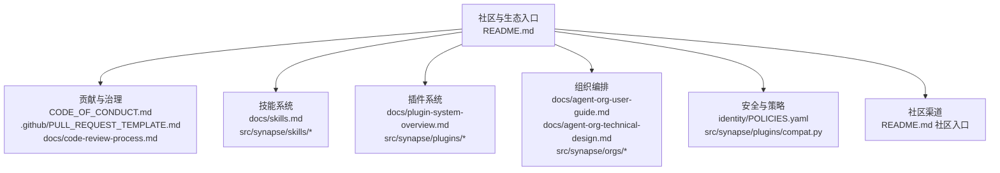
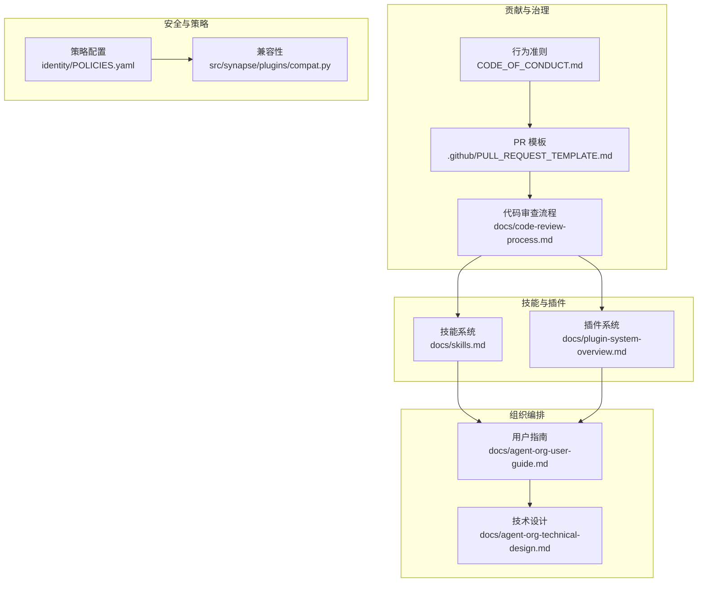
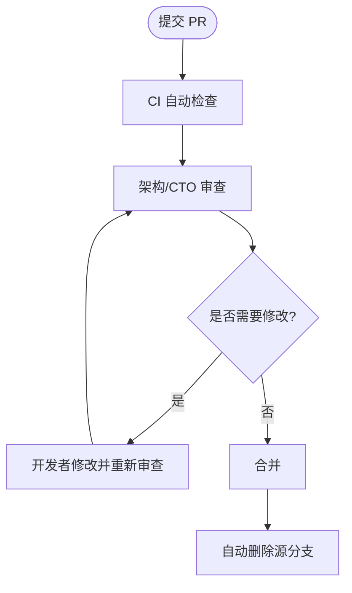
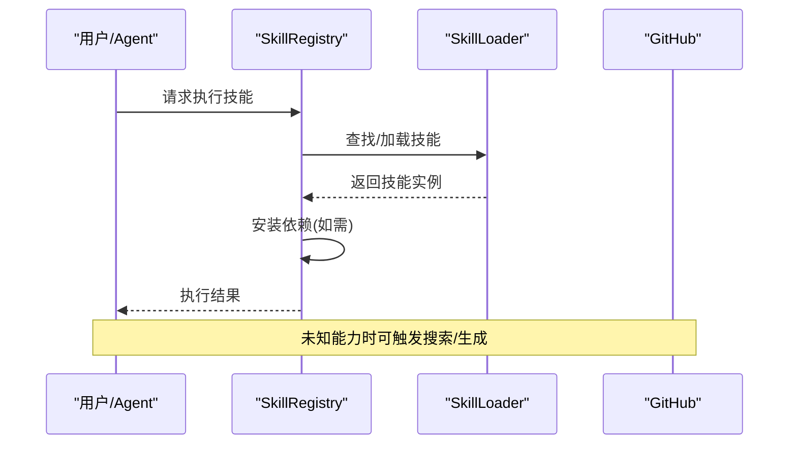
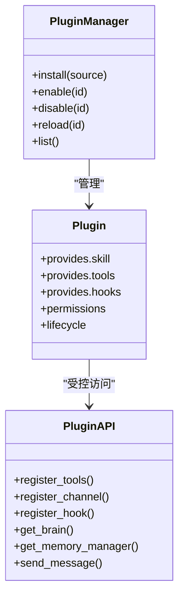
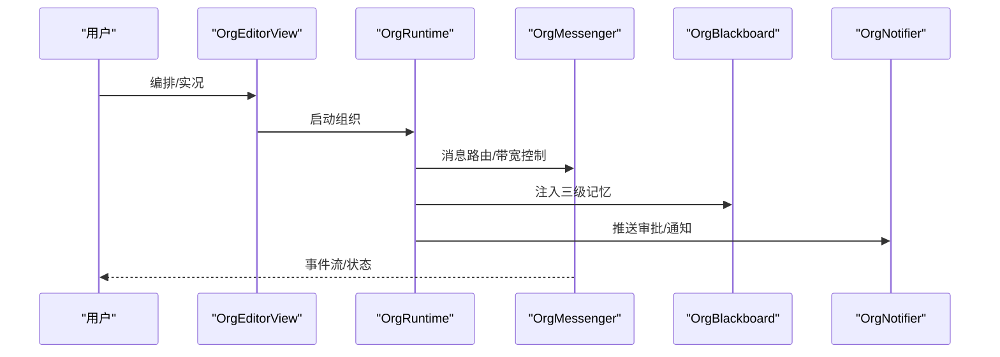
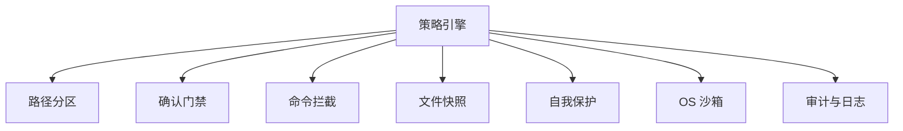
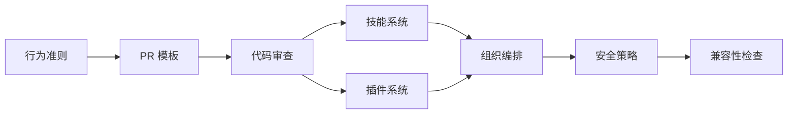

# 社区和生态

<cite>
**本文引用的文件**
- [README.md](file://README.md)
- [CODE_OF_CONDUCT.md](file://CODE_OF_CONDUCT.md)
- [.github/PULL_REQUEST_TEMPLATE.md](file://.github/PULL_REQUEST_TEMPLATE.md)
- [docs/code-review-process.md](file://docs/code-review-process.md)
- [docs/skills.md](file://docs/skills.md)
- [docs/plugin-system-overview.md](file://docs/plugin-system-overview.md)
- [docs/agent-org-user-guide.md](file://docs/agent-org-user-guide.md)
- [docs/agent-org-technical-design.md](file://docs/agent-org-technical-design.md)
- [identity/POLICIES.yaml](file://identity/POLICIES.yaml)
- [src/synapse/plugins/compat.py](file://src/synapse/plugins/compat.py)
- [src/synapse/skills/loader.py](file://src/synapse/skills/loader.py)
- [src/synapse/skills/registry.py](file://src/synapse/skills/registry.py)
- [src/synapse/plugins/manager.py](file://src/synapse/plugins/manager.py)
- [src/synapse/orgs/runtime.py](file://src/synapse/orgs/runtime.py)
- [src/synapse/orgs/models.py](file://src/synapse/orgs/models.py)
- [src/synapse/orgs/tool_handler.py](file://src/synapse/orgs/tool_handler.py)
- [src/synapse/orgs/tool_categories.py](file://src/synapse/orgs/tool_categories.py)
- [src/synapse/orgs/scaler.py](file://src/synapse/orgs/scaler.py)
- [src/synapse/orgs/heartbeat.py](file://src/synapse/orgs/heartbeat.py)
- [src/synapse/orgs/identity.py](file://src/synapse/orgs/identity.py)
- [src/synapse/orgs/templates.py](file://src/synapse/orgs/templates.py)
- [src/synapse/orgs/event_store.py](file://src/synapse/orgs/event_store.py)
- [src/synapse/orgs/notifier.py](file://src/synapse/orgs/notifier.py)
- [src/synapse/orgs/inbox.py](file://src/synapse/orgs/inbox.py)
- [src/synapse/orgs/policies.py](file://src/synapse/orgs/policies.py)
- [src/synapse/orgs/project_store.py](file://src/synapse/orgs/project_store.py)
- [src/synapse/orgs/scheduler.py](file://src/synapse/orgs/scheduler.py)
- [src/synapse/orgs/tools.py](file://src/synapse/orgs/tools.py)
- [src/synapse/orgs/messenger.py](file://src/synapse/orgs/messenger.py)
- [src/synapse/orgs/blackboard.py](file://src/synapse/orgs/blackboard.py)
- [src/synapse/orgs/manager.py](file://src/synapse/orgs/manager.py)
- [src/synapse/orgs/runtime.py](file://src/synapse/orgs/runtime.py)
- [src/synapse/orgs/runtimes.py](file://src/synapse/orgs/runtimes.py)
- [src/synapse/orgs/manager.py](file://src/synapse/orgs/manager.py)
- [src/synapse/orgs/manager.py](file://src/synapse/orgs/manager.py)
</cite>

## 目录
1. [简介](#简介)
2. [项目结构](#项目结构)
3. [核心组件](#核心组件)
4. [架构总览](#架构总览)
5. [详细组件分析](#详细组件分析)
6. [依赖分析](#依赖分析)
7. [性能考虑](#性能考虑)
8. [故障排查指南](#故障排查指南)
9. [结论](#结论)
10. [附录](#附录)

## 简介
本文件面向社区与生态建设，系统阐述如何参与贡献、如何使用技能商店与插件市场、如何获取开发者资源与技术支持、如何成为合作伙伴，以及行为准则与知识产权政策。内容结合仓库中的官方文档与源码实现，帮助不同角色（用户、开发者、渠道伙伴、合作伙伴）快速上手并高效协作。

## 项目结构
- 社区入口与生态对外展示：README.md 提供功能全景、下载与社区入口
- 贡献与治理：CODE_OF_CONDUCT.md、.github/PULL_REQUEST_TEMPLATE.md、docs/code-review-process.md
- 技能系统：docs/skills.md 与 src/synapse/skills/* 提供技能发现、安装、加载与生命周期
- 插件系统：docs/plugin-system-overview.md 与 src/synapse/plugins/* 提供插件类型、权限、生命周期与兼容性
- 组织编排：docs/agent-org-user-guide.md、docs/agent-org-technical-design.md 与 src/synapse/orgs/* 提供组织模式的使用与技术实现
- 安全与策略：identity/POLICIES.yaml 与 src/synapse/plugins/compat.py
- 社区渠道：README.md 中的社区入口与联系方式

**章节来源**
- [README.md: 643-681:643-681](file://README.md#L643-L681)

## 核心组件
- 贡献与治理：行为准则、PR 模板、代码审查流程与合并策略
- 技能商店：技能发现、安装、加载、配置与发布
- 插件市场：插件类型、权限模型、生命周期与兼容性
- 组织编排：可视化组织架构、黑板共享记忆、心跳与动态扩编
- 安全与策略：6 层沙箱、路径分区、命令拦截与自我保护

**章节来源**
- [CODE_OF_CONDUCT.md: 1-75:1-75](file://CODE_OF_CONDUCT.md#L1-L75)
- [.github/PULL_REQUEST_TEMPLATE.md: 1-60:1-60](file://.github/PULL_REQUEST_TEMPLATE.md#L1-L60)
- [docs/code-review-process.md: 1-149:1-149](file://docs/code-review-process.md#L1-L149)
- [docs/skills.md: 1-289:1-289](file://docs/skills.md#L1-L289)
- [docs/plugin-system-overview.md: 1-431:1-431](file://docs/plugin-system-overview.md#L1-L431)
- [docs/agent-org-user-guide.md: 1-254:1-254](file://docs/agent-org-user-guide.md#L1-L254)
- [docs/agent-org-technical-design.md: 1-615:1-615](file://docs/agent-org-technical-design.md#L1-L615)
- [identity/POLICIES.yaml: 1-81:1-81](file://identity/POLICIES.yaml#L1-L81)

## 架构总览
社区与生态围绕“贡献—使用—反馈—演进”闭环构建，贡献者通过行为准则与审查流程保障质量；使用者通过技能商店与插件市场扩展能力；组织编排提供企业级协作范式；安全策略贯穿系统运行。

**图表来源**
- [CODE_OF_CONDUCT.md: 1-75:1-75](file://CODE_OF_CONDUCT.md#L1-L75)
- [.github/PULL_REQUEST_TEMPLATE.md: 1-60:1-60](file://.github/PULL_REQUEST_TEMPLATE.md#L1-L60)
- [docs/code-review-process.md: 1-149:1-149](file://docs/code-review-process.md#L1-L149)
- [docs/skills.md: 1-289:1-289](file://docs/skills.md#L1-L289)
- [docs/plugin-system-overview.md: 1-431:1-431](file://docs/plugin-system-overview.md#L1-L431)
- [docs/agent-org-user-guide.md: 1-254:1-254](file://docs/agent-org-user-guide.md#L1-L254)
- [docs/agent-org-technical-design.md: 1-615:1-615](file://docs/agent-org-technical-design.md#L1-L615)
- [identity/POLICIES.yaml: 1-81:1-81](file://identity/POLICIES.yaml#L1-L81)
- [src/synapse/plugins/compat.py](file://src/synapse/plugins/compat.py)

**章节来源**
- [README.md: 643-681:643-681](file://README.md#L643-L681)

## 详细组件分析

### 贡献与治理
- 行为准则：明确积极行为与不可接受行为，提供举报渠道与处置流程
- PR 模板：规范变更描述、类型、测试清单、自审与附加说明
- 代码审查：明确审查角色、时效、自动化检查与人工清单，规范审查意见与合并策略

**图表来源**
- [.github/PULL_REQUEST_TEMPLATE.md: 1-60:1-60](file://.github/PULL_REQUEST_TEMPLATE.md#L1-L60)
- [docs/code-review-process.md: 1-149:1-149](file://docs/code-review-process.md#L1-L149)

**章节来源**
- [CODE_OF_CONDUCT.md: 1-75:1-75](file://CODE_OF_CONDUCT.md#L1-L75)
- [.github/PULL_REQUEST_TEMPLATE.md: 1-60:1-60](file://.github/PULL_REQUEST_TEMPLATE.md#L1-L60)
- [docs/code-review-process.md: 1-149:1-149](file://docs/code-review-process.md#L1-L149)

### 技能商店使用与贡献
- 使用方式：CLI 列表、直接运行、从 GitHub 安装
- 发现机制：自动搜索未知能力时，系统可搜索 GitHub 或生成技能
- 生命周期：发现 → 安装 → 加载 → 依赖安装 → 执行
- 发布规范：仓库结构、README、版本标记、依赖清单

**图表来源**
- [docs/skills.md: 62-93:62-93](file://docs/skills.md#L62-L93)
- [docs/skills.md: 173-193:173-193](file://docs/skills.md#L173-L193)
- [src/synapse/skills/registry.py](file://src/synapse/skills/registry.py)
- [src/synapse/skills/loader.py](file://src/synapse/skills/loader.py)

**章节来源**
- [docs/skills.md: 1-289:1-289](file://docs/skills.md#L1-L289)

### 插件市场与插件系统
- 三类扩展机制：Skill（文本引导）、MCP（进程隔离工具）、Plugin（全能力）
- 插件类型：工具、通道、RAG、记忆、LLM、钩子、Skill、MCP
- 权限模型：Basic/Advanced/System 三级，安装时确认
- 生命周期：on_load → on_init → 运行 → on_shutdown，支持 enable/disable/install/uninstall
- 兼容性：三层版本（System/Plugin API/Sdk），严格校验与检查规则

**图表来源**
- [docs/plugin-system-overview.md: 33-44:33-44](file://docs/plugin-system-overview.md#L33-L44)
- [docs/plugin-system-overview.md: 71-133:71-133](file://docs/plugin-system-overview.md#L71-L133)
- [src/synapse/plugins/manager.py](file://src/synapse/plugins/manager.py)
- [src/synapse/plugins/compat.py](file://src/synapse/plugins/compat.py)

**章节来源**
- [docs/plugin-system-overview.md: 1-431:1-431](file://docs/plugin-system-overview.md#L1-L431)
- [src/synapse/plugins/compat.py](file://src/synapse/plugins/compat.py)

### 组织编排（AI 公司）
- 功能特性：可视化编排、三级共享记忆、心跳/晨会、动态扩编、统一消息中心、IM 推送
- 技术实现：组织运行时、消息路由、黑板、身份继承、制度管理、事件溯源
- 使用方式：模板创建、启动运行、命令与广播、审批管理、跨平台支持

**图表来源**
- [docs/agent-org-user-guide.md: 131-163:131-163](file://docs/agent-org-user-guide.md#L131-L163)
- [docs/agent-org-technical-design.md: 24-71:24-71](file://docs/agent-org-technical-design.md#L24-L71)
- [src/synapse/orgs/runtime.py](file://src/synapse/orgs/runtime.py)
- [src/synapse/orgs/messenger.py](file://src/synapse/orgs/messenger.py)
- [src/synapse/orgs/blackboard.py](file://src/synapse/orgs/blackboard.py)
- [src/synapse/orgs/notifier.py](file://src/synapse/orgs/notifier.py)

**章节来源**
- [docs/agent-org-user-guide.md: 1-254:1-254](file://docs/agent-org-user-guide.md#L1-L254)
- [docs/agent-org-technical-design.md: 1-615:1-615](file://docs/agent-org-technical-design.md#L1-L615)

### 安全与策略
- 6 层安全：路径分区、确认门禁、命令拦截、文件快照、自我保护、操作系统沙箱
- 策略配置：路径区划、危险命令黑名单、确认超时、快照与审计、沙箱网络策略
- 兼容性：插件系统版本要求与检查规则

**图表来源**
- [identity/POLICIES.yaml: 1-81:1-81](file://identity/POLICIES.yaml#L1-L81)
- [docs/plugin-system-overview.md: 357-388:357-388](file://docs/plugin-system-overview.md#L357-L388)

**章节来源**
- [identity/POLICIES.yaml: 1-81:1-81](file://identity/POLICIES.yaml#L1-L81)
- [docs/plugin-system-overview.md: 357-388:357-388](file://docs/plugin-system-overview.md#L357-L388)

## 依赖分析
- 贡献流程依赖：行为准则提供基调，PR 模板与审查流程保证质量
- 技能系统依赖：技能注册表与加载器协同，依赖安装与执行解耦
- 插件系统依赖：插件管理器与 API，权限与生命周期钩子
- 组织编排依赖：运行时、消息路由、黑板、身份与制度
- 安全策略依赖：策略配置与插件兼容性检查

**图表来源**
- [CODE_OF_CONDUCT.md: 1-75:1-75](file://CODE_OF_CONDUCT.md#L1-L75)
- [.github/PULL_REQUEST_TEMPLATE.md: 1-60:1-60](file://.github/PULL_REQUEST_TEMPLATE.md#L1-L60)
- [docs/code-review-process.md: 1-149:1-149](file://docs/code-review-process.md#L1-L149)
- [docs/skills.md: 1-289:1-289](file://docs/skills.md#L1-L289)
- [docs/plugin-system-overview.md: 1-431:1-431](file://docs/plugin-system-overview.md#L1-L431)
- [docs/agent-org-user-guide.md: 1-254:1-254](file://docs/agent-org-user-guide.md#L1-L254)
- [identity/POLICIES.yaml: 1-81:1-81](file://identity/POLICIES.yaml#L1-L81)
- [src/synapse/plugins/compat.py](file://src/synapse/plugins/compat.py)

**章节来源**
- [README.md: 643-681:643-681](file://README.md#L643-L681)

## 性能考虑
- 插件系统：插件生命周期与权限控制降低耦合，减少不必要的宿主访问
- 技能系统：依赖安装与隔离执行，避免全局污染
- 组织编排：节点按需激活与 LRU 缓存，降低资源占用
- 安全策略：沙箱与快照在高风险操作上提供隔离与回滚能力

[本节为通用指导，不直接分析具体文件]

## 故障排查指南
- 技能加载失败：检查语法与依赖安装
- 技能执行失败：启用调试日志、隔离运行
- 插件安装/权限：确认权限级别与安装来源
- 组织编排异常：检查心跳/死锁检测、定时任务与审批流

**章节来源**
- [docs/skills.md: 268-289:268-289](file://docs/skills.md#L268-L289)
- [docs/plugin-system-overview.md: 335-354:335-354](file://docs/plugin-system-overview.md#L335-L354)
- [docs/agent-org-technical-design.md: 214-228:214-228](file://docs/agent-org-technical-design.md#L214-L228)

## 结论
通过行为准则与审查流程保障贡献质量，借助技能商店与插件市场扩展能力，利用组织编排实现企业级协作，配合安全策略与兼容性机制确保系统稳定演进。社区成员可据此高效参与贡献、使用与推广。

[本节为总结性内容，不直接分析具体文件]

## 附录

### 社区参与与贡献指南
- 行为准则与举报渠道
- PR 模板与审查清单
- 代码审查流程与时效要求
- 合并策略与分支保护

**章节来源**
- [CODE_OF_CONDUCT.md: 1-75:1-75](file://CODE_OF_CONDUCT.md#L1-L75)
- [.github/PULL_REQUEST_TEMPLATE.md: 1-60:1-60](file://.github/PULL_REQUEST_TEMPLATE.md#L1-L60)
- [docs/code-review-process.md: 1-149:1-149](file://docs/code-review-process.md#L1-L149)

### 技能商店使用方法
- CLI 使用：列出、运行、从 GitHub 安装
- 对话中使用：直接调用技能
- 发现与生成：未知能力时自动搜索或生成
- 发布规范：仓库结构、README、版本与依赖

**章节来源**
- [docs/skills.md: 62-93:62-93](file://docs/skills.md#L62-L93)
- [docs/skills.md: 173-193:173-193](file://docs/skills.md#L173-L193)
- [docs/skills.md: 245-266:245-266](file://docs/skills.md#L245-L266)

### 插件市场运作机制
- 三类扩展：Skill、MCP、Plugin
- 权限模型：Basic/Advanced/System
- 生命周期：安装/启用/禁用/重载/卸载
- 兼容性：System/Plugin API/Sdk 三层版本

**章节来源**
- [docs/plugin-system-overview.md: 7-68:7-68](file://docs/plugin-system-overview.md#L7-L68)
- [docs/plugin-system-overview.md: 71-133:71-133](file://docs/plugin-system-overview.md#L71-L133)
- [docs/plugin-system-overview.md: 357-388:357-388](file://docs/plugin-system-overview.md#L357-L388)

### 组织编排使用方法
- 快速开始：模板创建、启动、实况观察
- 下达命令：聊天窗口、指定节点、部门广播
- 查看进展：实况模式、消息侧边栏、IM 推送
- 审批管理：内联审批与 IM 回复

**章节来源**
- [docs/agent-org-user-guide.md: 131-163:131-163](file://docs/agent-org-user-guide.md#L131-L163)
- [docs/agent-org-user-guide.md: 165-222:165-222](file://docs/agent-org-user-guide.md#L165-L222)

### 开发者资源与技术支持
- 官方文档与教程：README 中的文档链接
- 社区渠道：Discord、WeChat、QQ 群等
- 问题与讨论：GitHub Issues/Discussions

**章节来源**
- [README.md: 624-681:624-681](file://README.md#L624-L681)

### 合作伙伴加入流程
- 渠道对接：IM 通道（WeChat/Feishu/WeCom/Telegram/QQ/OneBot）
- 扫码绑定：30 秒内完成绑定
- 推广与支持：通过社区与文档获取支持

**章节来源**
- [README.md: 384-404:384-404](file://README.md#L384-L404)
- [README.md: 643-681:643-681](file://README.md#L643-L681)

### 知识产权政策
- 许可证：Apache 2.0
- 第三方许可：THIRD_PARTY_NOTICES.md
- 行为准则：贡献者需遵守社区行为规范

**章节来源**
- [README.md: 697-701:697-701](file://README.md#L697-L701)
- [CODE_OF_CONDUCT.md: 1-75:1-75](file://CODE_OF_CONDUCT.md#L1-L75)