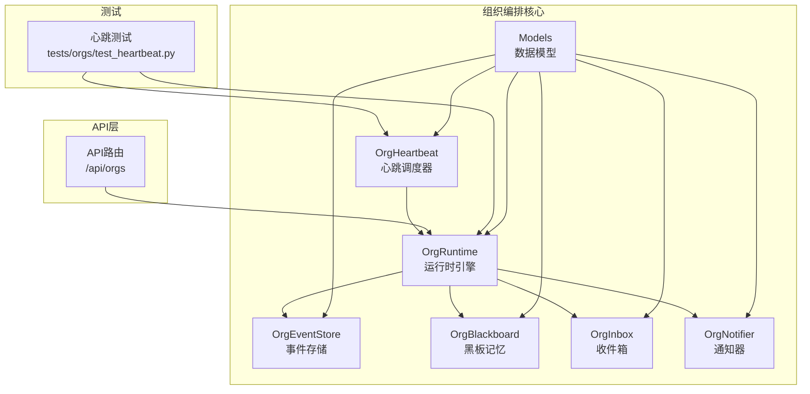
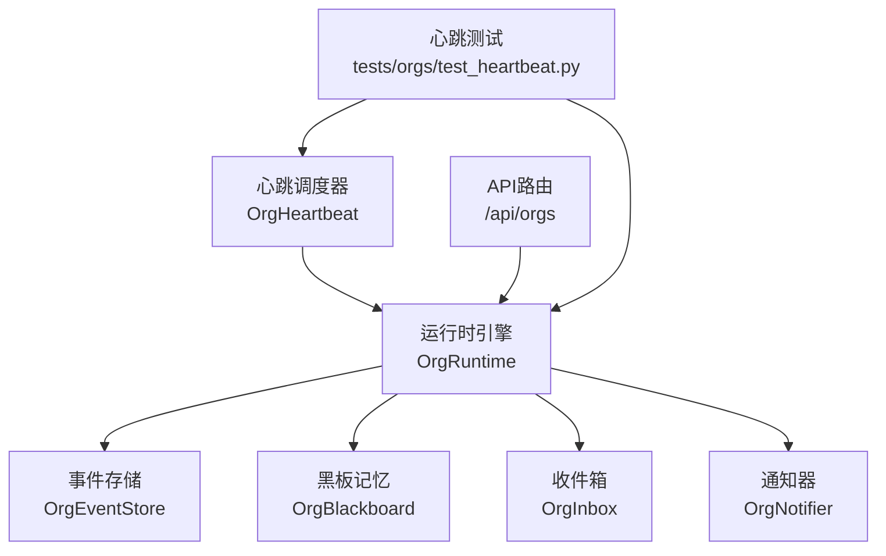
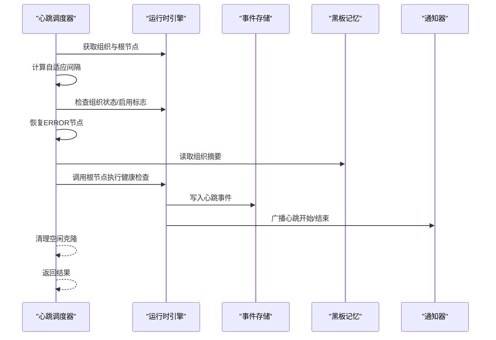
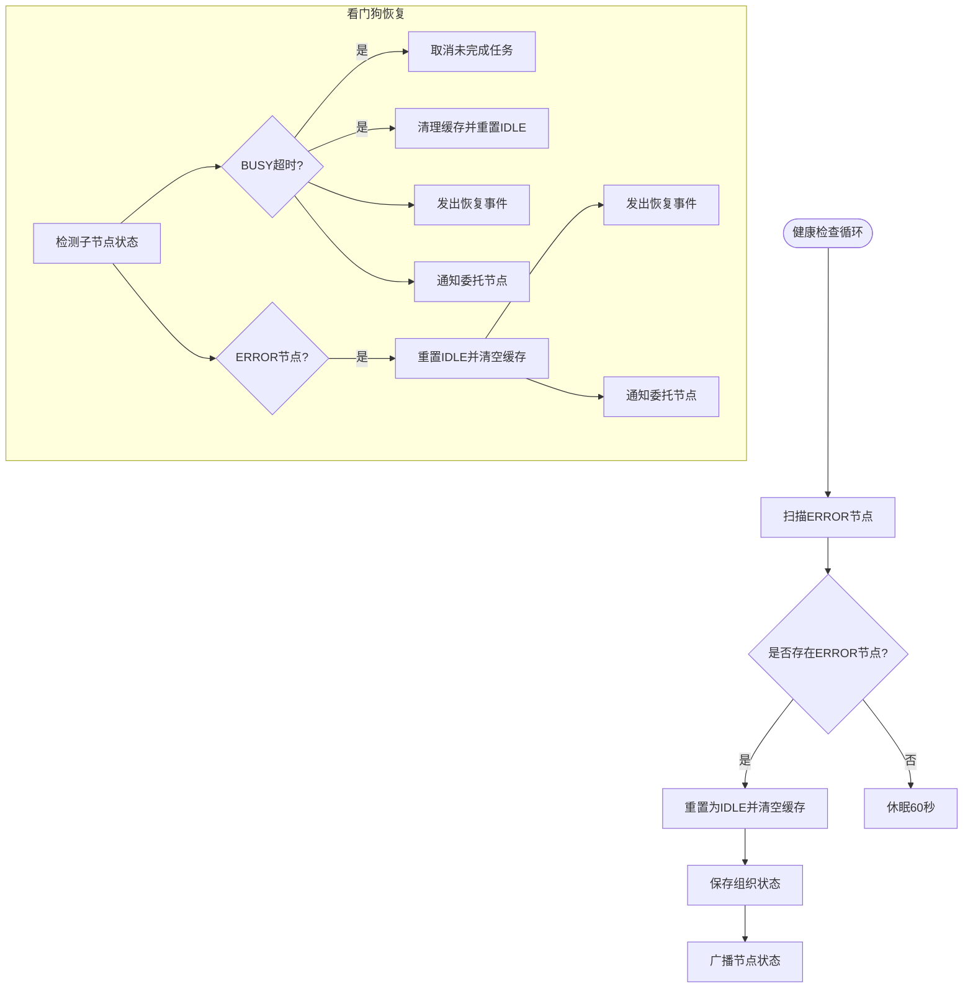
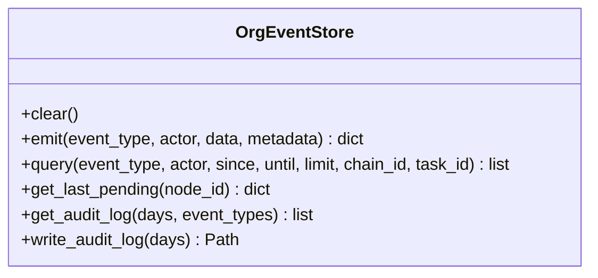
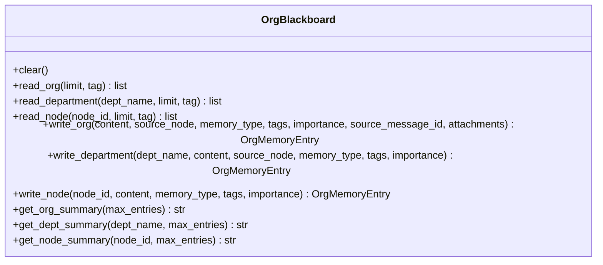
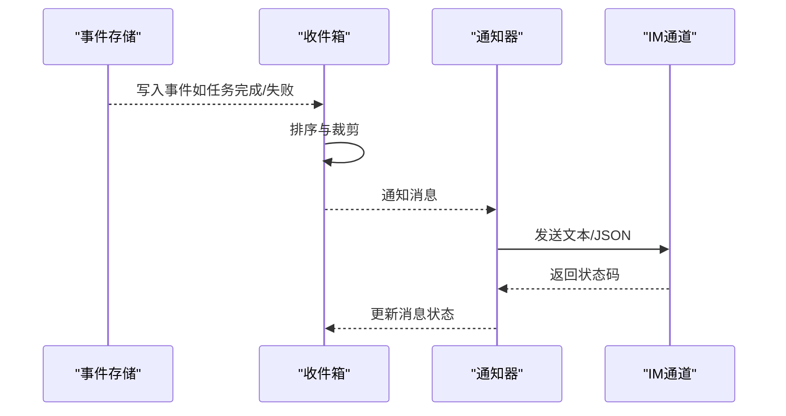
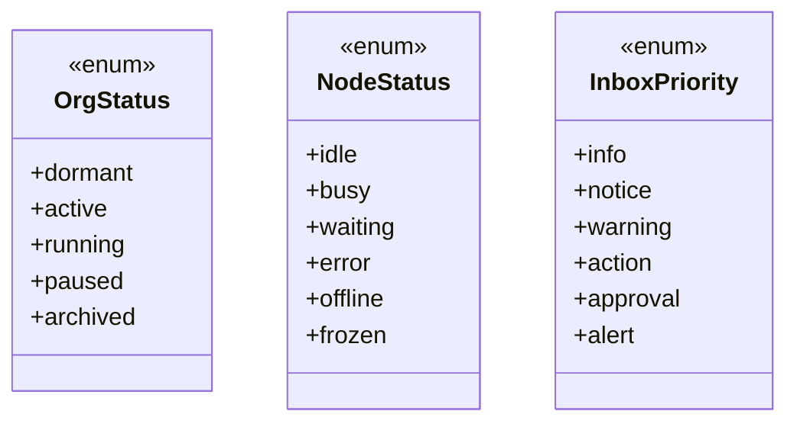
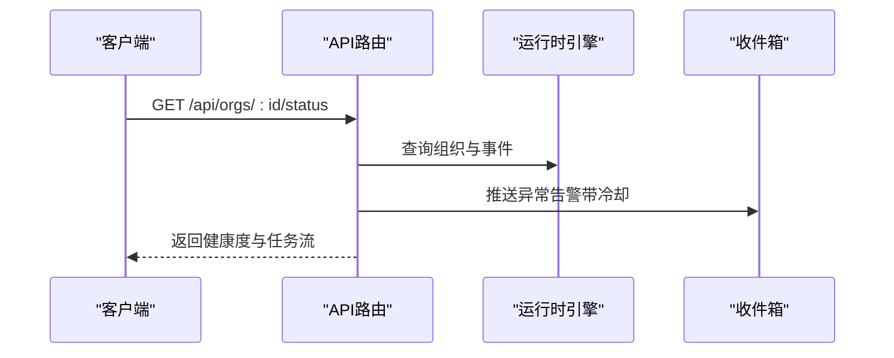
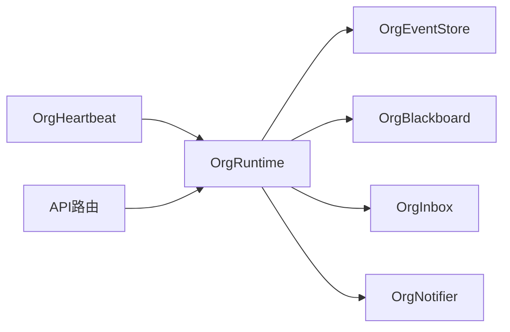

# 心跳监控系统

<cite>
**本文档引用的文件**
- [src/synapse/orgs/heartbeat.py](file://src/synapse/orgs/heartbeat.py)
- [src/synapse/orgs/runtime.py](file://src/synapse/orgs/runtime.py)
- [src/synapse/orgs/notifier.py](file://src/synapse/orgs/notifier.py)
- [src/synapse/orgs/inbox.py](file://src/synapse/orgs/inbox.py)
- [src/synapse/orgs/event_store.py](file://src/synapse/orgs/event_store.py)
- [src/synapse/orgs/blackboard.py](file://src/synapse/orgs/blackboard.py)
- [src/synapse/orgs/models.py](file://src/synapse/orgs/models.py)
- [src/synapse/api/routes/orgs.py](file://src/synapse/api/routes/orgs.py)
- [tests/orgs/test_heartbeat.py](file://tests/orgs/test_heartbeat.py)
</cite>

## 目录
1. [简介](#简介)
2. [项目结构](#项目结构)
3. [核心组件](#核心组件)
4. [架构总览](#架构总览)
5. [详细组件分析](#详细组件分析)
6. [依赖分析](#依赖分析)
7. [性能考虑](#性能考虑)
8. [故障排查指南](#故障排查指南)
9. [结论](#结论)
10. [附录](#附录)

## 简介
本文件为“心跳监控系统”的技术文档，聚焦于组织级心跳调度、异常检测与恢复、健康状态评估、故障自动隔离与通知机制。系统通过周期性的心跳检查驱动顶层节点对组织状态进行审视，结合事件溯源、黑板记忆与收件箱通知，形成完整的监控闭环。文档涵盖心跳检测机制、超时阈值与自适应间隔、异常检测算法、节点健康评估、故障隔离与恢复、通知渠道管理、监控指标采集与告警规则、API 使用示例、自定义检测器开发、监控仪表板集成、数据存储与历史趋势分析、性能基线建立与故障诊断流程。

## 项目结构
心跳监控系统位于组织编排模块中，核心文件包括心跳调度器、运行时引擎、事件存储、黑板记忆、收件箱与通知器等。API 路由提供对外接口，测试用例验证心跳触发与异常场景。

图表来源
- [src/synapse/orgs/heartbeat.py:1-455](file://src/synapse/orgs/heartbeat.py#L1-L455)
- [src/synapse/orgs/runtime.py:1-2400](file://src/synapse/orgs/runtime.py#L1-L2400)
- [src/synapse/orgs/event_store.py:1-288](file://src/synapse/orgs/event_store.py#L1-L288)
- [src/synapse/orgs/blackboard.py:1-379](file://src/synapse/orgs/blackboard.py#L1-L379)
- [src/synapse/orgs/inbox.py:1-313](file://src/synapse/orgs/inbox.py#L1-L313)
- [src/synapse/orgs/notifier.py:1-201](file://src/synapse/orgs/notifier.py#L1-L201)
- [src/synapse/orgs/models.py:1-836](file://src/synapse/orgs/models.py#L1-L836)
- [src/synapse/api/routes/orgs.py:1-2279](file://src/synapse/api/routes/orgs.py#L1-L2279)
- [tests/orgs/test_heartbeat.py:1-200](file://tests/orgs/test_heartbeat.py#L1-L200)

章节来源
- [src/synapse/orgs/heartbeat.py:1-455](file://src/synapse/orgs/heartbeat.py#L1-L455)
- [src/synapse/orgs/runtime.py:1-2400](file://src/synapse/orgs/runtime.py#L1-L2400)
- [src/synapse/orgs/event_store.py:1-288](file://src/synapse/orgs/event_store.py#L1-L288)
- [src/synapse/orgs/blackboard.py:1-379](file://src/synapse/orgs/blackboard.py#L1-L379)
- [src/synapse/orgs/inbox.py:1-313](file://src/synapse/orgs/inbox.py#L1-L313)
- [src/synapse/orgs/notifier.py:1-201](file://src/synapse/orgs/notifier.py#L1-L201)
- [src/synapse/orgs/models.py:1-836](file://src/synapse/orgs/models.py#L1-L836)
- [src/synapse/api/routes/orgs.py:1-2279](file://src/synapse/api/routes/orgs.py#L1-L2279)
- [tests/orgs/test_heartbeat.py:1-200](file://tests/orgs/test_heartbeat.py#L1-L200)

## 核心组件
- 心跳调度器（OrgHeartbeat）：负责组织心跳与晨会的调度与执行，支持自适应心跳间隔、手动触发、错误节点恢复。
- 运行时引擎（OrgRuntime）：组织生命周期管理、节点状态维护、任务调度、事件广播、健康检查循环、看门狗恢复。
- 事件存储（OrgEventStore）：不可变事件流记录，支持查询、审计日志生成与报告。
- 黑板记忆（OrgBlackboard）：组织/部门/节点三级共享记忆，用于注入上下文与生成摘要。
- 收件箱（OrgInbox）：统一消息聚合与实时订阅，支持优先级排序与审批。
- 通知器（OrgNotifier）：多渠道通知适配（飞书/钉钉/企业微信/Webhook），支持自然语言审批解析。
- 数据模型（Models）：组织、节点、状态枚举、消息优先级等核心数据结构。
- API 路由（/api/orgs）：组织编排相关接口，包含心跳触发、异常告警推送、任务流聚合等。

章节来源
- [src/synapse/orgs/heartbeat.py:24-455](file://src/synapse/orgs/heartbeat.py#L24-L455)
- [src/synapse/orgs/runtime.py:81-2400](file://src/synapse/orgs/runtime.py#L81-L2400)
- [src/synapse/orgs/event_store.py:21-288](file://src/synapse/orgs/event_store.py#L21-L288)
- [src/synapse/orgs/blackboard.py:32-379](file://src/synapse/orgs/blackboard.py#L32-L379)
- [src/synapse/orgs/inbox.py:23-313](file://src/synapse/orgs/inbox.py#L23-L313)
- [src/synapse/orgs/notifier.py:31-201](file://src/synapse/orgs/notifier.py#L31-L201)
- [src/synapse/orgs/models.py:21-200](file://src/synapse/orgs/models.py#L21-L200)
- [src/synapse/api/routes/orgs.py:1-2279](file://src/synapse/api/routes/orgs.py#L1-L2279)

## 架构总览
心跳监控系统围绕“组织”为中心，通过心跳调度器周期性触发顶层节点进行健康检查与复盘，运行时引擎负责状态维护与事件广播，事件存储与黑板记忆提供上下文与审计能力，收件箱与通知器负责异常告警与审批闭环，API 路由提供对外访问入口。

图表来源
- [src/synapse/orgs/heartbeat.py:120-279](file://src/synapse/orgs/heartbeat.py#L120-L279)
- [src/synapse/orgs/runtime.py:153-200](file://src/synapse/orgs/runtime.py#L153-L200)
- [src/synapse/api/routes/orgs.py:1675-1747](file://src/synapse/api/routes/orgs.py#L1675-L1747)
- [tests/orgs/test_heartbeat.py:47-68](file://tests/orgs/test_heartbeat.py#L47-L68)

## 详细组件分析

### 心跳调度器（OrgHeartbeat）
- 角色与职责
  - 维护心跳与晨会任务，支持启停与手动触发。
  - 记录组织活动，计算自适应心跳间隔，避免空闲时高频轮询。
  - 执行单次心跳：检查根节点状态、恢复 ERROR 节点、汇总节点与黑板摘要、调用顶层节点进行健康检查/复盘、清理克隆实例。
- 关键算法
  - 自适应心跳间隔：根据最近活动时间动态调整，空闲越久心跳越慢，最长不超过 1 小时。
  - 异常恢复：遍历 ERROR 节点，重置为 IDLE 并清空代理缓存，确保可重新激活。
- 执行流程
  - 心跳循环 → 计算间隔 → 检查组织状态与启用标志 → 执行心跳 → 记录事件与广播 → 清理克隆 → 返回结果。

图表来源
- [src/synapse/orgs/heartbeat.py:120-279](file://src/synapse/orgs/heartbeat.py#L120-L279)
- [src/synapse/orgs/runtime.py:1960-2097](file://src/synapse/orgs/runtime.py#L1960-L2097)

章节来源
- [src/synapse/orgs/heartbeat.py:74-101](file://src/synapse/orgs/heartbeat.py#L74-L101)
- [src/synapse/orgs/heartbeat.py:120-143](file://src/synapse/orgs/heartbeat.py#L120-L143)
- [src/synapse/orgs/heartbeat.py:144-279](file://src/synapse/orgs/heartbeat.py#L144-L279)
- [src/synapse/orgs/heartbeat.py:39-56](file://src/synapse/orgs/heartbeat.py#L39-L56)
- [src/synapse/orgs/heartbeat.py:57-72](file://src/synapse/orgs/heartbeat.py#L57-L72)

### 运行时引擎（OrgRuntime）
- 角色与职责
  - 组织生命周期管理、节点状态维护、并发控制、任务调度与看门狗恢复。
  - 健康检查循环：定期扫描 ERROR 节点并恢复为 IDLE，清理代理缓存，广播状态变化。
  - 看门狗恢复：对 BUSY 超时或 ERROR 的子节点进行恢复，记录事件并通知委托节点。
  - 故障隔离：连续失败达到阈值时冻结节点，避免级联故障。
- 关键流程
  - 健康检查循环：每分钟扫描一次，恢复 ERROR 节点并广播。
  - 看门狗恢复：检测 BUSY 超时或 ERROR，取消任务、清理缓存、重置状态、广播恢复事件。
  - 故障隔离：统计连续失败次数，超过阈值冻结节点，记录事件并广播。

图表来源
- [src/synapse/orgs/runtime.py:1960-1988](file://src/synapse/orgs/runtime.py#L1960-L1988)
- [src/synapse/orgs/runtime.py:2052-2082](file://src/synapse/orgs/runtime.py#L2052-L2082)
- [src/synapse/orgs/runtime.py:823-846](file://src/synapse/orgs/runtime.py#L823-L846)

章节来源
- [src/synapse/orgs/runtime.py:153-200](file://src/synapse/orgs/runtime.py#L153-L200)
- [src/synapse/orgs/runtime.py:1960-1988](file://src/synapse/orgs/runtime.py#L1960-L1988)
- [src/synapse/orgs/runtime.py:2052-2082](file://src/synapse/orgs/runtime.py#L2052-L2082)
- [src/synapse/orgs/runtime.py:823-846](file://src/synapse/orgs/runtime.py#L823-L846)

### 事件存储（OrgEventStore）
- 角色与职责
  - 不可变事件流记录，按天分文件存储，支持查询、审计日志生成与报告。
  - 提供审计日志筛选与导出，支持心跳、任务完成/失败、节点冻结/解冻等关键事件。
- 关键能力
  - emit：追加事件到当日文件。
  - query：按类型/演员/时间范围/链路/任务过滤查询。
  - get_audit_log/write_audit_log：生成审计日志。

图表来源
- [src/synapse/orgs/event_store.py:21-288](file://src/synapse/orgs/event_store.py#L21-L288)

章节来源
- [src/synapse/orgs/event_store.py:42-68](file://src/synapse/orgs/event_store.py#L42-L68)
- [src/synapse/orgs/event_store.py:70-124](file://src/synapse/orgs/event_store.py#L70-L124)
- [src/synapse/orgs/event_store.py:148-195](file://src/synapse/orgs/event_store.py#L148-L195)

### 黑板记忆（OrgBlackboard）
- 角色与职责
  - 三级共享记忆：组织级、部门级、节点私有，支持读写、容量管理与自动淘汰。
  - 为心跳与复盘提供上下文摘要，注入到顶层节点提示词中。
- 关键能力
  - read_*：读取组织/部门/节点记忆。
  - write_*：写入记忆并限制容量。
  - get_*_summary：生成摘要字符串供提示词注入。

图表来源
- [src/synapse/orgs/blackboard.py:32-379](file://src/synapse/orgs/blackboard.py#L32-L379)

章节来源
- [src/synapse/orgs/blackboard.py:55-108](file://src/synapse/orgs/blackboard.py#L55-L108)
- [src/synapse/orgs/blackboard.py:172-198](file://src/synapse/orgs/blackboard.py#L172-L198)

### 收件箱与通知器（OrgInbox/OrgNotifier）
- 角色与职责
  - 收件箱：聚合组织内各类事件（任务完成、进度变更、审批请求等），支持优先级排序与内联审批。
  - 通知器：多渠道通知适配（飞书/钉钉/企业微信/Webhook），支持自然语言审批解析。
- 关键能力
  - push：推入消息，支持审批编号生成与优先级排序。
  - notify：按配置通道发送通知。
  - parse_approval_reply：解析自然语言审批回复。

图表来源
- [src/synapse/orgs/inbox.py:39-96](file://src/synapse/orgs/inbox.py#L39-L96)
- [src/synapse/orgs/notifier.py:37-69](file://src/synapse/orgs/notifier.py#L37-L69)
- [src/synapse/orgs/notifier.py:184-200](file://src/synapse/orgs/notifier.py#L184-L200)

章节来源
- [src/synapse/orgs/inbox.py:39-96](file://src/synapse/orgs/inbox.py#L39-L96)
- [src/synapse/orgs/inbox.py:149-184](file://src/synapse/orgs/inbox.py#L149-L184)
- [src/synapse/orgs/notifier.py:37-69](file://src/synapse/orgs/notifier.py#L37-L69)
- [src/synapse/orgs/notifier.py:71-121](file://src/synapse/orgs/notifier.py#L71-L121)

### 数据模型（Models）
- 角色与职责
  - 定义组织、节点、边、消息、内存条目、任务状态、消息优先级等核心数据结构与枚举。
- 关键枚举
  - OrgStatus：组织状态（dormant/active/running/paused/archived）。
  - NodeStatus：节点状态（idle/busy/waiting/error/offline/frozen）。
  - InboxPriority：消息优先级（info/notice/warning/action/approval/alert）。

图表来源
- [src/synapse/orgs/models.py:21-112](file://src/synapse/orgs/models.py#L21-L112)

章节来源
- [src/synapse/orgs/models.py:21-112](file://src/synapse/orgs/models.py#L21-L112)

### API 路由与监控指标
- 角色与职责
  - 提供组织编排相关接口，包含心跳触发、异常告警推送、任务流聚合与健康度计算。
- 关键逻辑
  - 异常告警推送：去重冷却、优先级映射、写入收件箱。
  - 健康度计算：综合 error/stuck/anomaly 类型判定健康等级。
  - 任务流聚合：从事件存储读取近期任务事件，过滤并聚合展示。

图表来源
- [src/synapse/api/routes/orgs.py:1675-1747](file://src/synapse/api/routes/orgs.py#L1675-L1747)

章节来源
- [src/synapse/api/routes/orgs.py:1675-1747](file://src/synapse/api/routes/orgs.py#L1675-L1747)

## 依赖分析
- 组件耦合
  - OrgHeartbeat 依赖 OrgRuntime 进行组织状态查询与命令下发。
  - OrgRuntime 依赖事件存储、黑板记忆、收件箱、通知器进行状态维护与通知。
  - API 路由依赖运行时引擎与事件存储进行监控数据聚合。
- 外部依赖
  - httpx 用于异步 HTTP 请求（通知器 Webhook）。
  - 文件系统用于事件与黑板数据持久化。
- 潜在循环依赖
  - 心跳调度器与运行时引擎双向交互，但通过方法调用与事件广播避免直接循环。

图表来源
- [src/synapse/orgs/heartbeat.py:27-32](file://src/synapse/orgs/heartbeat.py#L27-L32)
- [src/synapse/orgs/runtime.py:93-106](file://src/synapse/orgs/runtime.py#L93-L106)
- [src/synapse/api/routes/orgs.py:56-60](file://src/synapse/api/routes/orgs.py#L56-L60)

章节来源
- [src/synapse/orgs/heartbeat.py:27-32](file://src/synapse/orgs/heartbeat.py#L27-L32)
- [src/synapse/orgs/runtime.py:93-106](file://src/synapse/orgs/runtime.py#L93-L106)
- [src/synapse/api/routes/orgs.py:56-60](file://src/synapse/api/routes/orgs.py#L56-L60)

## 性能考虑
- 心跳自适应间隔：空闲越久心跳越慢，最长不超过 1 小时，降低系统负载。
- 事件存储按天分文件：减少单文件过大带来的 IO 压力。
- 收件箱容量限制与排序：避免内存膨胀，优先处理待审批消息。
- 通知器异步 HTTP 请求：超时控制，避免阻塞主流程。
- 看门狗恢复与故障隔离：及时取消未完成任务、冻结高风险节点，防止级联故障。

## 故障排查指南
- 心跳无法触发
  - 检查组织状态与启用标志；确认根节点非 BUSY 且无运行中的任务。
  - 查看事件存储中心跳事件是否正确写入。
- 节点长期处于 ERROR
  - 运行时健康检查循环会将其恢复为 IDLE；若未恢复，检查事件存储与广播状态。
- 通知未送达
  - 检查通知器配置（通道与 Webhook URL）与返回状态码。
  - 查看收件箱消息状态与优先级。
- 异常告警重复
  - 检查冷却时间与去重逻辑，确认同一类型告警在冷却期内不会重复推送。

章节来源
- [src/synapse/orgs/heartbeat.py:120-143](file://src/synapse/orgs/heartbeat.py#L120-L143)
- [src/synapse/orgs/runtime.py:1960-1988](file://src/synapse/orgs/runtime.py#L1960-L1988)
- [src/synapse/orgs/notifier.py:37-69](file://src/synapse/orgs/notifier.py#L37-L69)
- [src/synapse/api/routes/orgs.py:1675-1689](file://src/synapse/api/routes/orgs.py#L1675-L1689)

## 结论
心跳监控系统通过心跳调度器、运行时引擎、事件存储、黑板记忆、收件箱与通知器的协同，实现了组织级健康检查、异常检测与恢复、故障隔离与通知的完整闭环。系统具备自适应心跳、看门狗恢复、故障冻结等机制，配合事件溯源与审计日志，能够有效支撑监控指标采集、历史趋势分析与故障诊断。

## 附录

### 心跳API使用示例
- 手动触发心跳
  - 方法：POST /api/orgs/:id/heartbeat/trigger
  - 行为：立即执行一次心跳，返回顶层节点的健康检查结果。
- 手动触发晨会
  - 方法：POST /api/orgs/:id/standup/trigger
  - 行为：立即生成一次晨会纪要，写入组织报告目录。
- 查询组织状态与健康度
  - 方法：GET /api/orgs/:id/status
  - 行为：聚合异常、任务流与健康度，推送异常告警至收件箱。

章节来源
- [src/synapse/orgs/heartbeat.py:102-114](file://src/synapse/orgs/heartbeat.py#L102-L114)
- [src/synapse/orgs/heartbeat.py:366-454](file://src/synapse/orgs/heartbeat.py#L366-L454)
- [src/synapse/api/routes/orgs.py:1675-1747](file://src/synapse/api/routes/orgs.py#L1675-L1747)

### 自定义检测器开发
- 基于事件存储
  - 使用 query 过滤特定事件类型（如 task_failed、node_frozen），结合时间窗口与演员过滤构建自定义检测规则。
- 基于黑板摘要
  - 读取 get_org_summary/get_dept_summary/get_node_summary，注入到自定义 LLM 检测器进行语义分析。
- 基于收件箱
  - 监听订阅队列，对特定类别的消息（如 warning/approval）进行自动化处理。

章节来源
- [src/synapse/orgs/event_store.py:70-124](file://src/synapse/orgs/event_store.py#L70-L124)
- [src/synapse/orgs/blackboard.py:172-198](file://src/synapse/orgs/blackboard.py#L172-L198)
- [src/synapse/orgs/inbox.py:298-312](file://src/synapse/orgs/inbox.py#L298-L312)

### 监控仪表板集成
- 指标采集
  - 事件存储：任务完成/失败、心跳决策、节点状态变化。
  - 收件箱：消息总数、待审批数、优先级分布。
  - 健康度：基于异常类型与严重程度计算。
- 可视化建议
  - 节点状态热力图、异常趋势折线图、任务流甘特图、通知渠道成功率柱状图。

章节来源
- [src/synapse/orgs/event_store.py:148-195](file://src/synapse/orgs/event_store.py#L148-L195)
- [src/synapse/orgs/inbox.py:149-184](file://src/synapse/orgs/inbox.py#L149-L184)
- [src/synapse/api/routes/orgs.py:1711-1747](file://src/synapse/api/routes/orgs.py#L1711-L1747)

### 存储策略与历史趋势
- 事件存储
  - 按天分文件，支持指定日期范围查询与审计日志生成。
- 黑板记忆
  - 三级容量限制，自动淘汰旧条目，保证关键信息留存。
- 历史趋势
  - 通过事件查询与聚合，生成周/月趋势报告，辅助性能基线建立。

章节来源
- [src/synapse/orgs/event_store.py:24-68](file://src/synapse/orgs/event_store.py#L24-L68)
- [src/synapse/orgs/blackboard.py:27-29](file://src/synapse/orgs/blackboard.py#L27-L29)

### 告警规则配置与通知渠道管理
- 告警规则
  - 异常类型：error/stuck/anomaly；冷却时间：默认去重冷却；优先级：根据类型映射。
- 通知渠道
  - 飞书/钉钉/企业微信/Webhook；支持通用 JSON 结构与平台特定字段。
- 审批解析
  - 自然语言模式匹配，支持“#A 序号 批准/拒绝”。

章节来源
- [src/synapse/api/routes/orgs.py:1675-1689](file://src/synapse/api/routes/orgs.py#L1675-L1689)
- [src/synapse/orgs/notifier.py:56-66](file://src/synapse/orgs/notifier.py#L56-L66)
- [src/synapse/orgs/notifier.py:71-94](file://src/synapse/orgs/notifier.py#L71-L94)

### 超时阈值与异常检测算法
- 超时阈值
  - 看门狗 BUSY 超时：取消未完成任务并恢复为 IDLE。
  - 连续失败冻结：超过阈值自动冻结节点，避免级联故障。
- 异常检测
  - ERROR 节点恢复：心跳与健康检查循环定期恢复为 IDLE。
  - 异常告警：基于事件类型与严重程度，去重推送至收件箱。

章节来源
- [src/synapse/orgs/runtime.py:2052-2082](file://src/synapse/orgs/runtime.py#L2052-L2082)
- [src/synapse/orgs/runtime.py:823-846](file://src/synapse/orgs/runtime.py#L823-L846)
- [src/synapse/orgs/heartbeat.py:39-56](file://src/synapse/orgs/heartbeat.py#L39-L56)

### 测试用例参考
- 心跳触发与异常场景
  - 测试不存在组织、无根节点、成功触发等场景。
  - 验证心跳循环与手动触发行为。

章节来源
- [tests/orgs/test_heartbeat.py:47-68](file://tests/orgs/test_heartbeat.py#L47-L68)