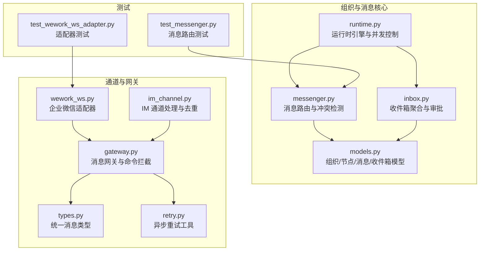
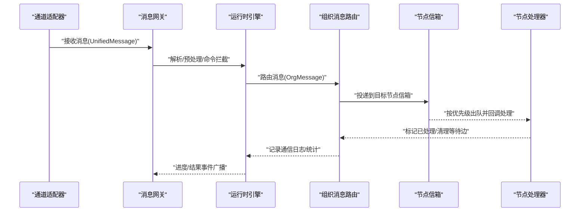
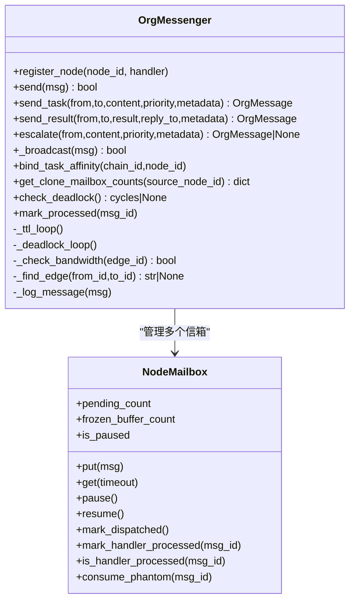
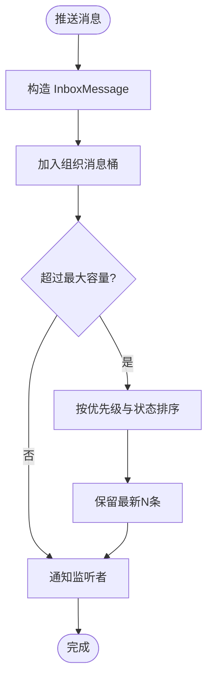
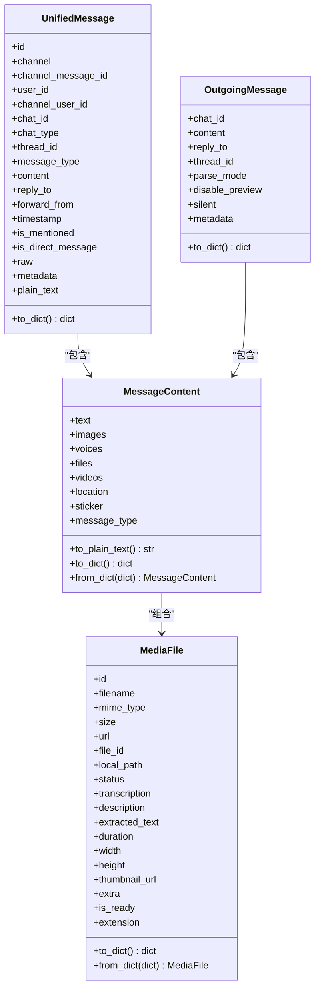
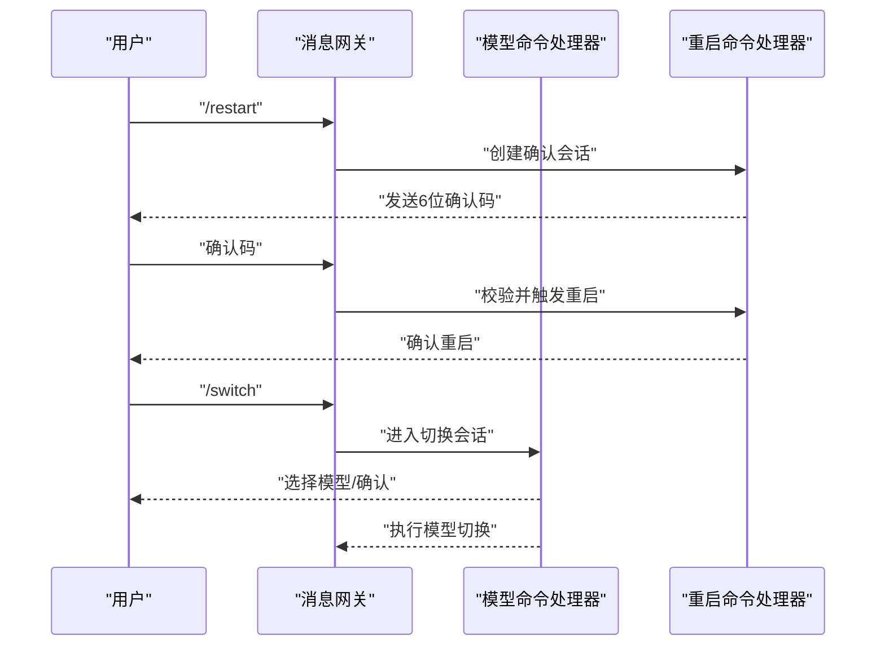
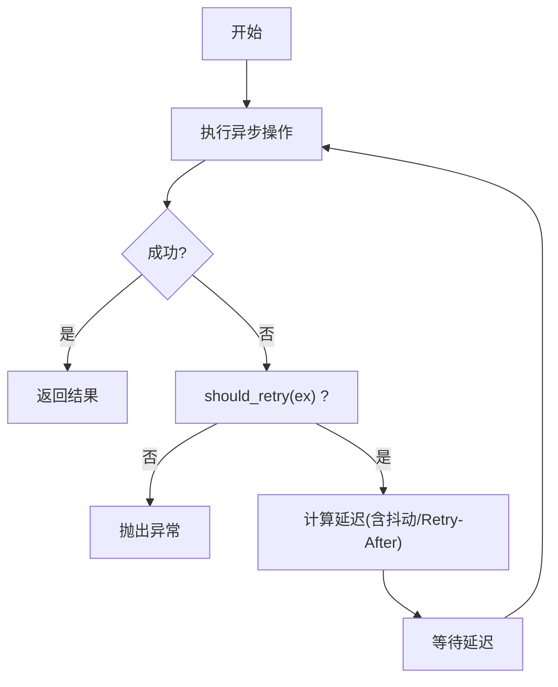
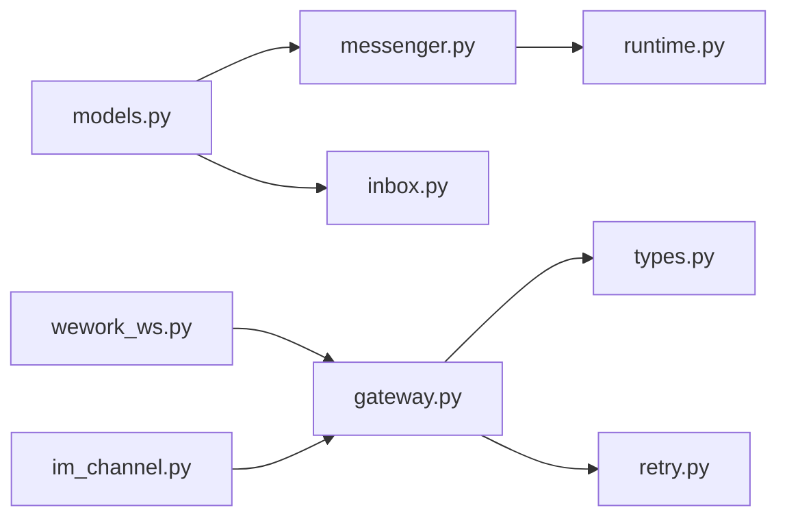

# 消息路由系统

<cite>
**本文引用的文件**
- [messenger.py](file://src/synapse/orgs/messenger.py)
- [inbox.py](file://src/synapse/orgs/inbox.py)
- [models.py](file://src/synapse/orgs/models.py)
- [runtime.py](file://src/synapse/orgs/runtime.py)
- [gateway.py](file://src/synapse/channels/gateway.py)
- [types.py](file://src/synapse/channels/types.py)
- [retry.py](file://src/synapse/channels/retry.py)
- [wework_ws.py](file://src/synapse/channels/adapters/wework_ws.py)
- [im_channel.py](file://src/synapse/tools/handlers/im_channel.py)
- [test_messenger.py](file://tests/orgs/test_messenger.py)
- [test_wework_ws_adapter.py](file://tests/unit/test_wework_ws_adapter.py)
</cite>

## 目录
1. [简介](#简介)
2. [项目结构](#项目结构)
3. [核心组件](#核心组件)
4. [架构总览](#架构总览)
5. [详细组件分析](#详细组件分析)
6. [依赖分析](#依赖分析)
7. [性能考虑](#性能考虑)
8. [故障排查指南](#故障排查指南)
9. [结论](#结论)
10. [附录](#附录)

## 简介
本技术文档围绕消息路由系统展开，系统覆盖组织内节点间消息路由、优先级与负载均衡、收件箱管理、消息过滤与确认、消息格式标准化与编码解码、传输安全机制、API 使用示例、批量发送、消息追踪、重试与死信处理、性能调优与监控指标等方面。文档基于仓库中的实际代码实现，提供从高层架构到代码级细节的全面说明，并辅以可视化图表帮助理解。

## 项目结构
消息路由系统主要分布在以下模块：
- 组织与消息核心：orgs 子系统负责组织模型、消息模型、消息路由与冲突检测、收件箱等。
- 通道与网关：channels 子系统负责消息网关、统一消息类型、适配器、重试机制等。
- 运行时引擎：runtime 负责组织生命周期、并发控制、任务调度与事件广播。
- 测试与验证：tests 提供消息路由、带宽限制、冻结/解冻、TTL 过期等行为测试。

**图表来源**
- [messenger.py:1-606](file://src/synapse/orgs/messenger.py#L1-L606)
- [inbox.py:1-313](file://src/synapse/orgs/inbox.py#L1-L313)
- [models.py:1-836](file://src/synapse/orgs/models.py#L1-L836)
- [runtime.py:1-800](file://src/synapse/orgs/runtime.py#L1-L800)
- [gateway.py:1-800](file://src/synapse/channels/gateway.py#L1-L800)
- [types.py:1-615](file://src/synapse/channels/types.py#L1-L615)
- [retry.py:1-113](file://src/synapse/channels/retry.py#L1-L113)
- [wework_ws.py:1274-1291](file://src/synapse/channels/adapters/wework_ws.py#L1274-L1291)
- [im_channel.py:687-720](file://src/synapse/tools/handlers/im_channel.py#L687-L720)
- [test_messenger.py:145-218](file://tests/orgs/test_messenger.py#L145-L218)
- [test_wework_ws_adapter.py:732-771](file://tests/unit/test_wework_ws_adapter.py#L732-L771)

**章节来源**
- [messenger.py:1-606](file://src/synapse/orgs/messenger.py#L1-L606)
- [inbox.py:1-313](file://src/synapse/orgs/inbox.py#L1-L313)
- [models.py:1-836](file://src/synapse/orgs/models.py#L1-L836)
- [runtime.py:1-800](file://src/synapse/orgs/runtime.py#L1-L800)
- [gateway.py:1-800](file://src/synapse/channels/gateway.py#L1-L800)
- [types.py:1-615](file://src/synapse/channels/types.py#L1-L615)
- [retry.py:1-113](file://src/synapse/channels/retry.py#L1-L113)
- [wework_ws.py:1274-1291](file://src/synapse/channels/adapters/wework_ws.py#L1274-L1291)
- [im_channel.py:687-720](file://src/synapse/tools/handlers/im_channel.py#L687-L720)
- [test_messenger.py:145-218](file://tests/orgs/test_messenger.py#L145-L218)
- [test_wework_ws_adapter.py:732-771](file://tests/unit/test_wework_ws_adapter.py#L732-L771)

## 核心组件
- 组织消息模型与路由：OrgMessage、MsgType、NodeMailbox、OrgMessenger 提供优先级队列、等待图、死锁检测、TTL 过期、带宽限制、任务亲和绑定等能力。
- 收件箱与审批：OrgInbox 聚合组织内各类事件，支持优先级排序、内联审批、监听订阅、审批副作用执行。
- 通道与网关：UnifiedMessage/OutgoingMessage 标准化消息格式，Gateway 提供命令拦截、中断优先级、模型切换、重启确认等能力。
- 运行时与并发：OrgRuntime 提供组织生命周期、节点并发信号量、任务取消、状态广播、健康检查与看门狗。
- 传输与安全：适配器层支持加密传输、文件解密、重试与退避、媒体预处理与去重。

**章节来源**
- [models.py:45-112](file://src/synapse/orgs/models.py#L45-L112)
- [messenger.py:37-133](file://src/synapse/orgs/messenger.py#L37-L133)
- [inbox.py:23-96](file://src/synapse/orgs/inbox.py#L23-L96)
- [types.py:18-340](file://src/synapse/channels/types.py#L18-L340)
- [gateway.py:58-800](file://src/synapse/channels/gateway.py#L58-L800)
- [runtime.py:81-226](file://src/synapse/orgs/runtime.py#L81-L226)

## 架构总览
消息从通道网关进入，统一为 UnifiedMessage，再经运行时引擎与消息路由系统投递至目标节点的 NodeMailbox，节点处理器或广播路径触发相应动作，同时支持 TTL 过期、死锁检测、带宽限制与任务亲和绑定。收件箱负责组织级事件聚合与审批闭环。

**图表来源**
- [gateway.py:1-800](file://src/synapse/channels/gateway.py#L1-L800)
- [runtime.py:518-799](file://src/synapse/orgs/runtime.py#L518-L799)
- [messenger.py:301-406](file://src/synapse/orgs/messenger.py#L301-L406)
- [types.py:341-466](file://src/synapse/channels/types.py#L341-L466)

## 详细组件分析

### 组件A：消息路由与冲突检测（OrgMessenger）
- 优先级队列：NodeMailbox 使用优先队列，优先级由消息优先级与创建时间决定，支持暂停/恢复与“幽灵消息”处理。
- 死锁检测：维护等待图，周期性 DFS/BFS 检测环路，必要时移除回边以打破循环。
- TTL 过期：后台任务定期扫描待处理消息，按任务消息类型与元数据 TTL 清理过期消息。
- 带宽限制：按边缘 60 秒窗口统计消息数量，超过带宽阈值拒绝发送。
- 任务亲和：为任务链绑定节点亲和，确保后续消息沿同一路径流转。
- 广播与结果：支持部门/全组织广播，任务结果发送后清理等待边。

**图表来源**
- [messenger.py:37-133](file://src/synapse/orgs/messenger.py#L37-L133)
- [messenger.py:135-606](file://src/synapse/orgs/messenger.py#L135-L606)

**章节来源**
- [messenger.py:37-133](file://src/synapse/orgs/messenger.py#L37-L133)
- [messenger.py:135-606](file://src/synapse/orgs/messenger.py#L135-L606)
- [test_messenger.py:145-218](file://tests/orgs/test_messenger.py#L145-L218)

### 组件B：收件箱与审批（OrgInbox）
- 聚合与查询：按组织聚合消息，支持未读、分类、待审批筛选，按优先级与状态排序。
- 审批闭环：支持审批选项、审批 ID、审批副作用（如写入策略文件、创建定时任务）。
- 实时订阅：支持按组织订阅消息变更队列，便于前端/外部系统实时推送。

**图表来源**
- [inbox.py:39-96](file://src/synapse/orgs/inbox.py#L39-L96)
- [inbox.py:149-184](file://src/synapse/orgs/inbox.py#L149-L184)

**章节来源**
- [inbox.py:23-313](file://src/synapse/orgs/inbox.py#L23-L313)

### 组件C：消息格式标准化与编码解码（UnifiedMessage/OutgoingMessage）
- 统一消息类型：定义 MessageType、MediaFile、MessageContent、UnifiedMessage、OutgoingMessage，覆盖文本、图片、语音、文件、视频、位置、表情等。
- 编码解码：提供 to_dict/from_dict 序列化/反序列化，支持 MIME 推断、媒体状态管理、纯文本转换。
- 通道适配：适配器将平台消息转换为 UnifiedMessage，再由网关统一处理。

**图表来源**
- [types.py:18-340](file://src/synapse/channels/types.py#L18-L340)
- [types.py:341-615](file://src/synapse/channels/types.py#L341-L615)

**章节来源**
- [types.py:1-615](file://src/synapse/channels/types.py#L1-L615)

### 组件D：消息网关与命令拦截（MessageGateway）
- 中断优先级：定义 NORMAL/HIGH/URGENT 三档优先级，支持在工具调用间隙插入消息。
- 模型切换命令：/model、/switch、/priority、/restore、/cancel 等命令拦截与交互会话管理。
- 终极重启：/restart 二次确认机制，超时自动取消，防止误操作。
- 思考模式命令：/thinking、/thinking_depth、/chain 控制思考模式与进度推送。

**图表来源**
- [gateway.py:58-800](file://src/synapse/channels/gateway.py#L58-L800)

**章节来源**
- [gateway.py:1-800](file://src/synapse/channels/gateway.py#L1-L800)

### 组件E：传输安全与重试机制
- 重试工具：async_with_retry 提供指数退避、抖动、Retry-After 处理、HTTP 429/5xx 与连接错误重试。
- 适配器安全：测试覆盖 AES-256-CBC 加密/解密流程，保障文件传输安全。
- 去重与幂等：IM 通道处理中基于 dedupe_key 去重，避免重复投递。

**图表来源**
- [retry.py:57-113](file://src/synapse/channels/retry.py#L57-L113)
- [test_wework_ws_adapter.py:766-771](file://tests/unit/test_wework_ws_adapter.py#L766-L771)
- [im_channel.py:687-720](file://src/synapse/tools/handlers/im_channel.py#L687-L720)

**章节来源**
- [retry.py:1-113](file://src/synapse/channels/retry.py#L1-L113)
- [test_wework_ws_adapter.py:766-771](file://tests/unit/test_wework_ws_adapter.py#L766-L771)
- [im_channel.py:687-720](file://src/synapse/tools/handlers/im_channel.py#L687-L720)

## 依赖分析
- 模块耦合：OrgMessenger 依赖 OrgMessage/OrgNode/OrgEdge 模型；OrgRuntime 协调 OrgMessenger 与组织生命周期；Gateway 依赖 types 与 retry；适配器依赖 Gateway。
- 外部依赖：HTTP 客户端（httpx）、WebSocket 广播、文件系统与媒体处理。
- 循环依赖：未发现直接循环导入；消息路由与运行时通过接口与事件解耦。

**图表来源**
- [models.py:1-836](file://src/synapse/orgs/models.py#L1-L836)
- [messenger.py:1-606](file://src/synapse/orgs/messenger.py#L1-L606)
- [inbox.py:1-313](file://src/synapse/orgs/inbox.py#L1-L313)
- [runtime.py:1-800](file://src/synapse/orgs/runtime.py#L1-L800)
- [gateway.py:1-800](file://src/synapse/channels/gateway.py#L1-L800)
- [types.py:1-615](file://src/synapse/channels/types.py#L1-L615)
- [retry.py:1-113](file://src/synapse/channels/retry.py#L1-L113)
- [wework_ws.py:1274-1291](file://src/synapse/channels/adapters/wework_ws.py#L1274-L1291)
- [im_channel.py:687-720](file://src/synapse/tools/handlers/im_channel.py#L687-L720)

**章节来源**
- [messenger.py:1-606](file://src/synapse/orgs/messenger.py#L1-L606)
- [runtime.py:1-800](file://src/synapse/orgs/runtime.py#L1-L800)
- [gateway.py:1-800](file://src/synapse/channels/gateway.py#L1-L800)
- [types.py:1-615](file://src/synapse/channels/types.py#L1-L615)
- [retry.py:1-113](file://src/synapse/channels/retry.py#L1-L113)
- [wework_ws.py:1274-1291](file://src/synapse/channels/adapters/wework_ws.py#L1274-L1291)
- [im_channel.py:687-720](file://src/synapse/tools/handlers/im_channel.py#L687-L720)

## 性能考虑
- 优先级与队列：NodeMailbox 使用优先队列，确保高优先级消息优先处理；phantom 消息与 dispatch 计数避免重复处理与计数偏差。
- 死锁检测：周期性检测等待图，及时移除回边，避免系统停滞。
- TTL 过期：后台任务按分钟轮询，清理过期消息，降低内存占用。
- 带宽限制：边缘 60 秒滑动窗口计数，防止拥塞；任务消息类型采用较长 TTL。
- 并发控制：运行时对组织与节点设置并发信号量，避免资源争用。
- 压力测试建议：结合测试用例模拟冻结/解冻、带宽上限、死锁场景，评估系统稳定性与恢复能力。

[本节为通用指导，无需特定文件引用]

## 故障排查指南
- 冻结/解冻信箱：冻结时消息进入缓冲区，解冻后恢复投递；检查冻结标志与缓冲区长度。
- 带宽限制：当边缘消息数达到阈值时发送会被拒绝；检查边缘带宽配置与窗口计数。
- 死锁检测：若出现停滞，启用死锁检测日志，定位环路并确认回边移除。
- TTL 过期：长时间无响应的任务消息可能被标记为过期；检查消息创建时间与元数据 TTL。
- 重试失败：关注指数退避与 Retry-After 处理；对 429/5xx 与连接错误自动重试。
- 文件解密：确保密钥与算法一致，验证 round-trip 加解密流程。

**章节来源**
- [test_messenger.py:145-218](file://tests/orgs/test_messenger.py#L145-L218)
- [messenger.py:243-271](file://src/synapse/orgs/messenger.py#L243-L271)
- [retry.py:57-113](file://src/synapse/channels/retry.py#L57-L113)
- [test_wework_ws_adapter.py:766-771](file://tests/unit/test_wework_ws_adapter.py#L766-L771)

## 结论
消息路由系统通过优先级队列、等待图与死锁检测、TTL 过期与带宽限制、任务亲和绑定等机制，实现了高可靠、可扩展的组织内消息传递。配合统一消息格式、命令拦截、重试与安全机制，以及收件箱审批闭环，满足复杂组织场景下的消息编排需求。建议在生产环境中结合监控指标与压测结果持续优化并发与带宽参数。

[本节为总结，无需特定文件引用]

## 附录

### API 使用示例与最佳实践
- 发送任务消息：使用 send_task(from_node, to_node, content, priority, metadata)，自动绑定任务亲和与结果发送清理等待边。
- 发送广播消息：使用 _broadcast，支持部门广播与全组织广播，可触发处理器回调。
- 冻结/解冻信箱：freeze_mailbox/unfreeze_mailbox，用于维护期间暂存消息。
- 审批消息：push_approval_request 构造审批消息，resolve_approval/resolve_by_approval_id 完成审批闭环。

**章节来源**
- [messenger.py:364-406](file://src/synapse/orgs/messenger.py#L364-L406)
- [messenger.py:432-467](file://src/synapse/orgs/messenger.py#L432-L467)
- [messenger.py:480-488](file://src/synapse/orgs/messenger.py#L480-L488)
- [inbox.py:109-125](file://src/synapse/orgs/inbox.py#L109-L125)
- [inbox.py:226-249](file://src/synapse/orgs/inbox.py#L226-L249)
- [inbox.py:286-292](file://src/synapse/orgs/inbox.py#L286-L292)

### 批量发送与消息追踪
- 批量发送：通过循环调用 send/send_task，注意带宽限制与 TTL 设置，避免触发限流。
- 消息追踪：启用通信日志记录，结合消息 ID 与状态字段定位流转路径；使用收件箱订阅实时事件。

**章节来源**
- [messenger.py:600-606](file://src/synapse/orgs/messenger.py#L600-L606)
- [inbox.py:298-313](file://src/synapse/orgs/inbox.py#L298-L313)

### 重试机制与死信队列
- 重试策略：指数退避 + 抖动，自动提取 Retry-After；对 429/5xx 与连接错误重试。
- 死信处理：TTL 过期消息自动清理；建议在业务侧增加失败回调与补偿逻辑。

**章节来源**
- [retry.py:57-113](file://src/synapse/channels/retry.py#L57-L113)
- [messenger.py:243-271](file://src/synapse/orgs/messenger.py#L243-L271)

### 性能调优参数与监控指标
- 调优参数：消息 TTL（任务消息较长）、边缘带宽阈值、节点并发信号量、组织并发上限。
- 监控指标：消息投递延迟、队列长度、冻结缓冲区大小、带宽使用率、TTL 过期率、死锁检测次数、重试次数与成功率。

[本节为通用指导，无需特定文件引用]