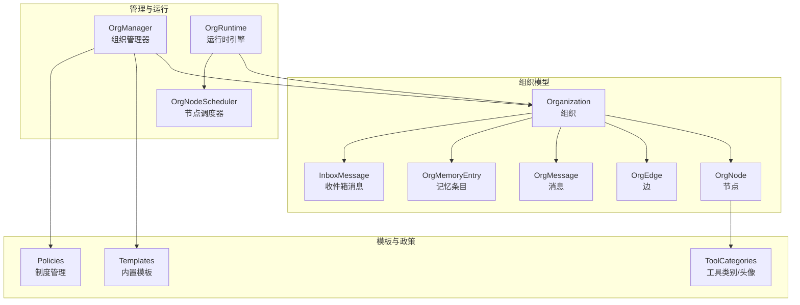
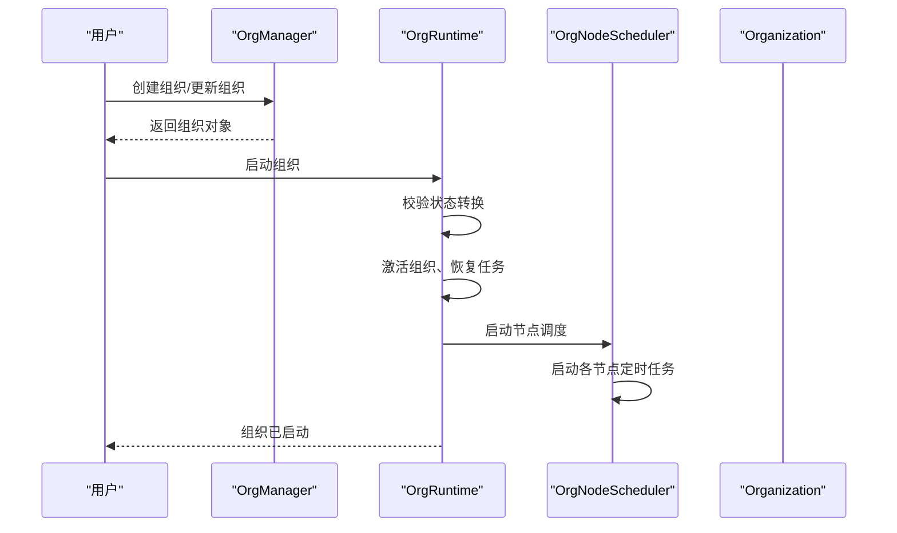
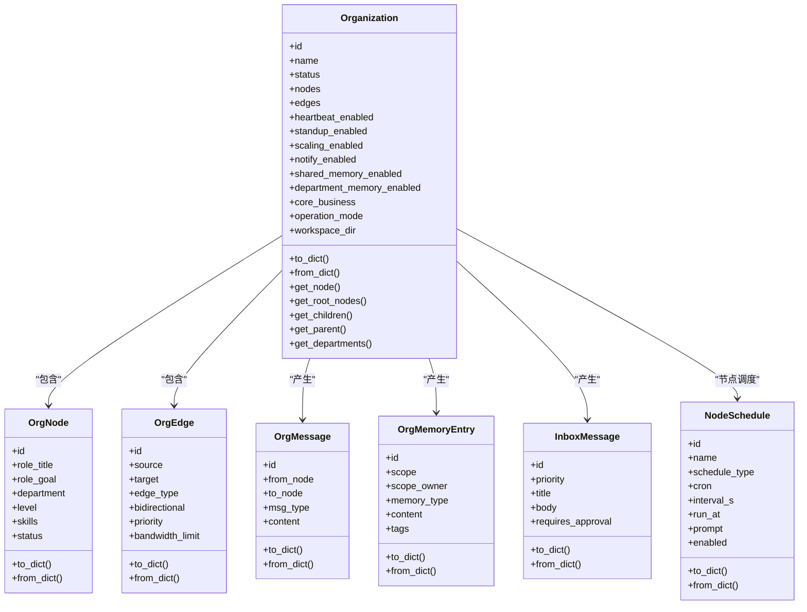
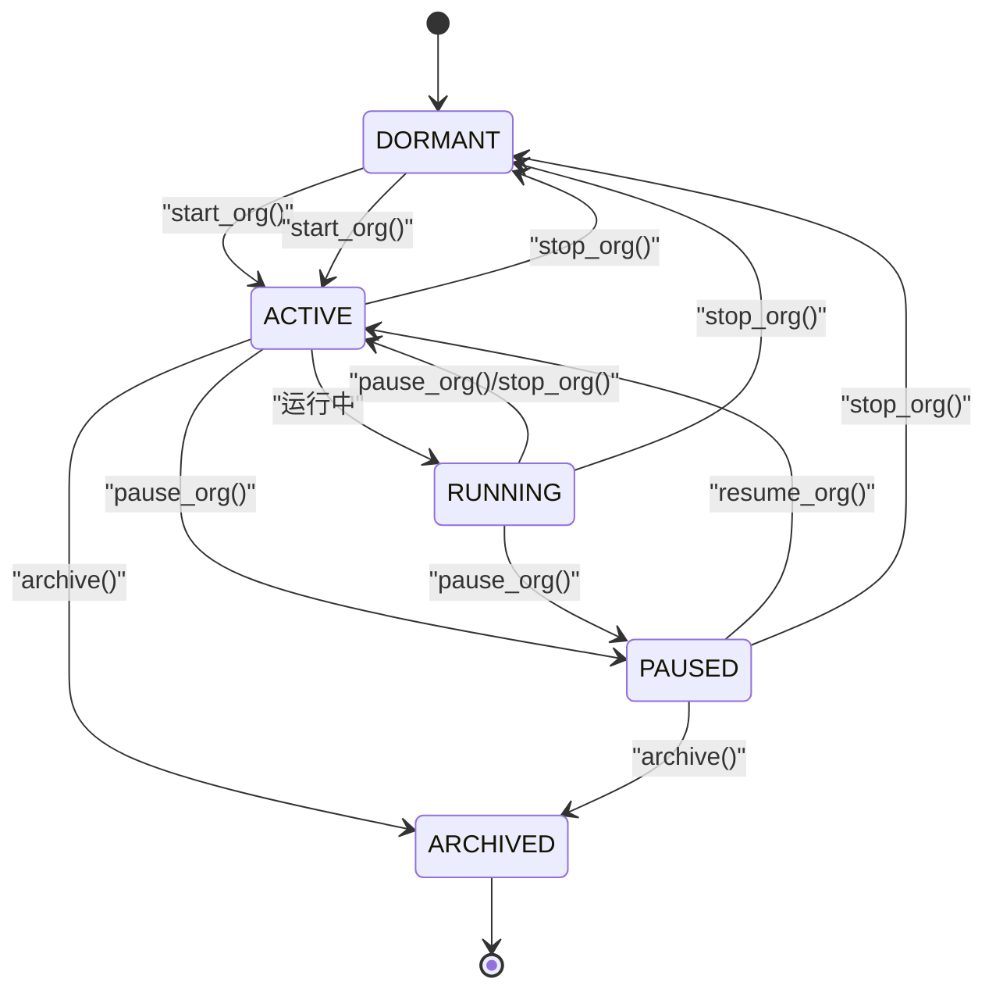
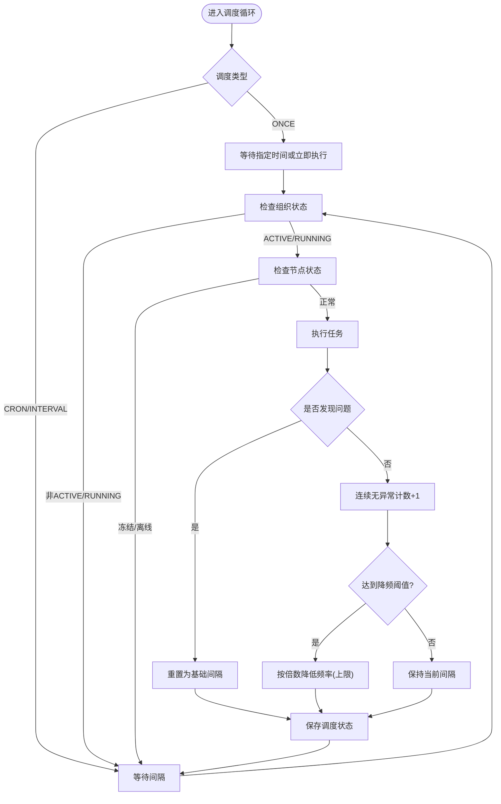
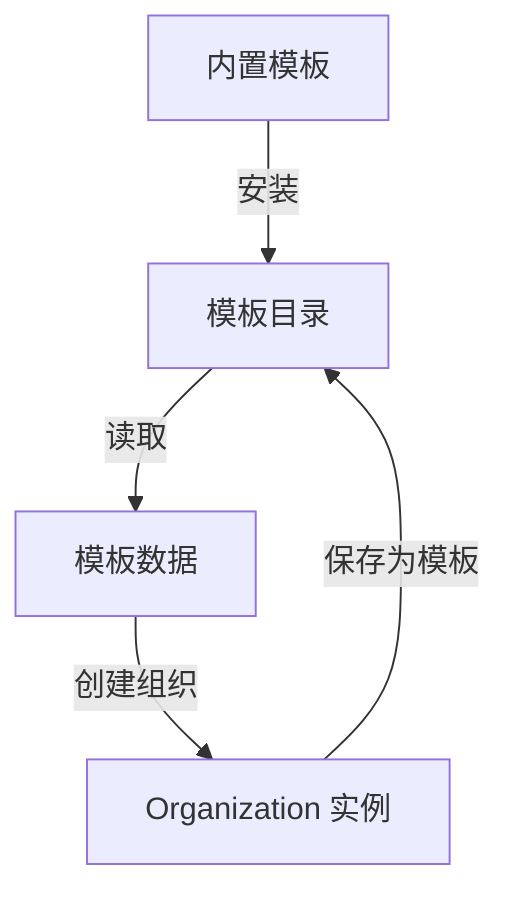
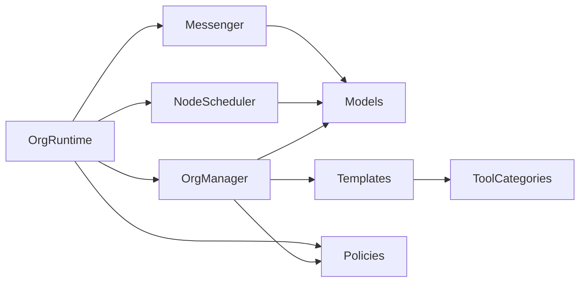

# 组织架构设计

<cite>
**本文引用的文件列表**
- [models.py](file://src/synapse/orgs/models.py)
- [manager.py](file://src/synapse/orgs/manager.py)
- [templates.py](file://src/synapse/orgs/templates.py)
- [node_scheduler.py](file://src/synapse/orgs/node_scheduler.py)
- [runtime.py](file://src/synapse/orgs/runtime.py)
- [policies.py](file://src/synapse/orgs/policies.py)
- [tool_categories.py](file://src/synapse/orgs/tool_categories.py)
- [messenger.py](file://src/synapse/orgs/messenger.py)
- [test_models.py](file://tests/orgs/test_models.py)
- [test_manager.py](file://tests/orgs/test_manager.py)
</cite>

## 目录
1. [简介](#简介)
2. [项目结构](#项目结构)
3. [核心组件](#核心组件)
4. [架构总览](#架构总览)
5. [详细组件分析](#详细组件分析)
6. [依赖关系分析](#依赖关系分析)
7. [性能考量](#性能考量)
8. [故障排查指南](#故障排查指南)
9. [结论](#结论)
10. [附录](#附录)

## 简介
本技术文档围绕组织架构设计进行系统化阐述，覆盖数据模型、节点与边的建模、组织状态管理、节点调度机制、部门层级结构、模板系统、配置示例、约束与验证规则及最佳实践。文档以代码为依据，结合测试用例与运行时组件，帮助读者快速理解并落地组织编排能力。

## 项目结构
组织架构相关的核心代码位于 src/synapse/orgs 目录，主要模块包括：
- 数据模型：组织、节点、边、消息、内存条目、收件箱消息、项目/任务等
- 管理器：组织的持久化、模板管理、节点定时任务管理
- 运行时：组织生命周期、节点激活、消息分发、心跳、通知、扩编等
- 模板：内置模板与模板安装流程
- 工具与头像：工具类别、角色工具预设、节点头像映射
- 政策：制度文件管理与索引生成
- 通讯：消息发送与带宽控制

图表来源
- [models.py:322-480](file://src/synapse/orgs/models.py#L322-L480)
- [manager.py:29-434](file://src/synapse/orgs/manager.py#L29-L434)
- [runtime.py:81-140](file://src/synapse/orgs/runtime.py#L81-L140)
- [node_scheduler.py:35-107](file://src/synapse/orgs/node_scheduler.py#L35-L107)
- [templates.py:19-731](file://src/synapse/orgs/templates.py#L19-L731)
- [policies.py:15-167](file://src/synapse/orgs/policies.py#L15-L167)
- [tool_categories.py:10-173](file://src/synapse/orgs/tool_categories.py#L10-L173)

章节来源
- [models.py:1-836](file://src/synapse/orgs/models.py#L1-L836)
- [manager.py:1-434](file://src/synapse/orgs/manager.py#L1-L434)
- [runtime.py:1-800](file://src/synapse/orgs/runtime.py#L1-L800)

## 核心组件
- 组织模型：包含组织、节点、边、消息、记忆、收件箱、项目/任务等数据结构，提供序列化/反序列化与常用查询方法（根节点、父子关系、部门集合）
- 组织管理器：负责组织的创建/读取/更新/删除、持久化目录结构初始化、节点定时任务的增删改查、模板保存与加载
- 运行时引擎：组织生命周期管理、节点按需激活、任务调度、消息分发、心跳、通知、扩编、收件箱、制度管理等
- 节点调度器：基于 cron/间隔/一次性 的节点定时任务，具备智能调频（连续无异常降频、异常时恢复）
- 模板系统：内置三套模板（创业公司、软件团队、内容运营），支持模板安装、保存与从模板创建组织
- 工具与头像：工具类别与角色预设、头像映射，用于节点工具集与可视化头像
- 政策管理：制度文件的增删改查、关键词搜索、索引重建

章节来源
- [models.py:131-800](file://src/synapse/orgs/models.py#L131-L800)
- [manager.py:29-434](file://src/synapse/orgs/manager.py#L29-L434)
- [runtime.py:81-226](file://src/synapse/orgs/runtime.py#L81-L226)
- [node_scheduler.py:35-216](file://src/synapse/orgs/node_scheduler.py#L35-L216)
- [templates.py:19-731](file://src/synapse/orgs/templates.py#L19-L731)
- [tool_categories.py:10-173](file://src/synapse/orgs/tool_categories.py#L10-L173)
- [policies.py:15-332](file://src/synapse/orgs/policies.py#L15-L332)

## 架构总览
组织架构采用“模型-管理-运行时-调度-模板/政策”的分层设计：
- 模型层：以数据类为核心，保证结构清晰、序列化稳健
- 管理层：负责持久化与模板管理，隔离运行时逻辑
- 运行时层：组织生命周期、并发控制、消息与任务处理
- 调度层：节点级定时任务，支持智能调频
- 模板/政策层：提供可复用的组织结构与制度框架

图表来源
- [runtime.py:251-307](file://src/synapse/orgs/runtime.py#L251-L307)
- [node_scheduler.py:42-88](file://src/synapse/orgs/node_scheduler.py#L42-L88)
- [manager.py:101-158](file://src/synapse/orgs/manager.py#L101-L158)

## 详细组件分析

### 数据模型与枚举
- 组织状态：DORMANT、ACTIVE、RUNNING、PAUSED、ARCHIVED；节点状态：IDLE、BUSY、WAITING、ERROR、OFFLINE、FROZEN
- 边类型：HIERARCHY（层级）、COLLABORATE（协作）、ESCALATE（升级）、CONSULT（咨询）
- 消息类型：任务分配、结果、汇报、问题、答案、升级、广播、部门广播、反馈、握手等
- 记忆作用域与类型：组织/部门/节点、事实/决策/规则/进度/经验/资源
- 调度类型：CRON、INTERVAL、ONCE
- 收件箱优先级：INFO、NOTICE、WARNING、ACTION、APPROVAL、ALERT
- 项目/任务状态：PLANNING、ACTIVE、PAUSED、COMPLETED、ARCHIVED；TODO、IN_PROGRESS、DELIVERED、ACCEPTED、REJECTED、BLOCKED、CANCELLED

图表来源
- [models.py:131-800](file://src/synapse/orgs/models.py#L131-L800)

章节来源
- [models.py:21-112](file://src/synapse/orgs/models.py#L21-L112)
- [models.py:131-800](file://src/synapse/orgs/models.py#L131-L800)
- [test_models.py:59-97](file://tests/orgs/test_models.py#L59-L97)

### 组织状态管理与生命周期
- 状态机：DORMANT → ACTIVE → {RUNNING, PAUSED, DORMANT, ARCHIVED}；PAUSED → {ACTIVE, DORMANT, ARCHIVED}
- 生命周期操作：启动、暂停、恢复、停止、删除、重置、归档/解档
- 并发控制：组织级并发信号量限制同时激活的节点数量
- 节点状态：冻结/离线/错误等状态下的保护与恢复逻辑

图表来源
- [runtime.py:231-246](file://src/synapse/orgs/runtime.py#L231-L246)
- [runtime.py:251-307](file://src/synapse/orgs/runtime.py#L251-L307)
- [runtime.py:338-373](file://src/synapse/orgs/runtime.py#L338-L373)
- [runtime.py:482-512](file://src/synapse/orgs/runtime.py#L482-L512)

章节来源
- [runtime.py:231-246](file://src/synapse/orgs/runtime.py#L231-L246)
- [runtime.py:251-307](file://src/synapse/orgs/runtime.py#L251-L307)
- [runtime.py:338-373](file://src/synapse/orgs/runtime.py#L338-L373)
- [runtime.py:482-512](file://src/synapse/orgs/runtime.py#L482-L512)

### 节点调度机制
- 调度类型：CRON、INTERVAL、ONCE
- 智能调频：连续无异常时按倍数降低频率，出现异常立即恢复；阈值与最大倍率可配置
- 触发与执行：支持手动触发一次执行，执行后记录结果摘要与时间
- 生命周期：随组织启动/停止/重载；支持单节点重新加载

图表来源
- [node_scheduler.py:108-168](file://src/synapse/orgs/node_scheduler.py#L108-L168)
- [node_scheduler.py:169-206](file://src/synapse/orgs/node_scheduler.py#L169-L206)

章节来源
- [node_scheduler.py:35-216](file://src/synapse/orgs/node_scheduler.py#L35-L216)
- [test_manager.py:118-151](file://tests/orgs/test_manager.py#L118-L151)

### 部门层级结构
- 层级查询：根节点、父子关系、部门集合
- 边类型：HIERARCHY 表示层级关系，COLLABORATE/ESCALATE/CONSULT 表示协作、升级、咨询关系
- 带宽限制：边上的带宽限制字段用于消息发送控制（见消息模块）

章节来源
- [models.py:512-532](file://src/synapse/orgs/models.py#L512-L532)
- [models.py:260-291](file://src/synapse/orgs/models.py#L260-L291)
- [messenger.py:572-575](file://src/synapse/orgs/messenger.py#L572-L575)

### 组织模板系统
- 内置模板：创业公司、软件工程团队、内容运营团队
- 模板字段：名称、描述、图标、标签、用户身份、核心业务、心跳/站会配置、策略参数、节点与边定义
- 模板安装：自动填充策略模板与头像；未存在的模板文件自动安装
- 模板使用：保存为模板、从模板创建组织、列出模板

图表来源
- [templates.py:19-731](file://src/synapse/orgs/templates.py#L19-L731)
- [manager.py:282-333](file://src/synapse/orgs/manager.py#L282-L333)

章节来源
- [templates.py:19-731](file://src/synapse/orgs/templates.py#L19-L731)
- [manager.py:282-333](file://src/synapse/orgs/manager.py#L282-L333)
- [test_manager.py:153-174](file://tests/orgs/test_manager.py#L153-L174)

### 工具类别与节点属性
- 工具类别：研究、规划、文件系统、记忆、MCP、浏览器、通信、技能等
- 角色工具预设：基于角色关键字匹配，自动填充节点 external_tools
- 头像映射：角色到头像 ID 的映射，用于前端展示
- 节点属性：位置、层级、部门、代理源、技能、并发限制、超时、委托/升级/扩编权限、克隆策略、冻结信息、状态等

章节来源
- [tool_categories.py:10-173](file://src/synapse/orgs/tool_categories.py#L10-L173)
- [models.py:131-211](file://src/synapse/orgs/models.py#L131-L211)

### 政策与制度管理
- 制度文件：Markdown 文档，支持组织级与部门级
- 索引生成：自动维护 README 索引文件
- 搜索：关键词检索，返回匹配行与计数
- 默认模板：提供通用制度模板与特定模板（软件团队、内容运营）

章节来源
- [policies.py:15-332](file://src/synapse/orgs/policies.py#L15-L332)

### 消息与带宽控制
- 消息类型与优先级：支持多种消息类型与收件箱优先级
- 带宽控制：边级别的带宽限制，防止过载
- 等待图检测：检测环路等待，避免死锁

章节来源
- [models.py:535-702](file://src/synapse/orgs/models.py#L535-L702)
- [messenger.py:539-575](file://src/synapse/orgs/messenger.py#L539-L575)

## 依赖关系分析
- 模块耦合
  - OrgManager 依赖模型与工具类别，负责持久化与模板
  - OrgRuntime 依赖 Manager、NodeScheduler、Messenger、Policies 等子系统
  - NodeScheduler 依赖模型中的 NodeSchedule 与运行时上下文
  - Templates 依赖工具类别进行头像自动填充
- 外部依赖
  - JSON 序列化/反序列化
  - 异步任务与并发控制（asyncio/Semaphore）
  - 文件系统（路径操作、目录创建）

图表来源
- [manager.py:17-24](file://src/synapse/orgs/manager.py#L17-L24)
- [runtime.py:84-106](file://src/synapse/orgs/runtime.py#L84-L106)
- [node_scheduler.py:18-25](file://src/synapse/orgs/node_scheduler.py#L18-L25)
- [templates.py:711-731](file://src/synapse/orgs/templates.py#L711-L731)
- [messenger.py:1-20](file://src/synapse/orgs/messenger.py#L1-L20)

章节来源
- [manager.py:17-24](file://src/synapse/orgs/manager.py#L17-L24)
- [runtime.py:84-106](file://src/synapse/orgs/runtime.py#L84-L106)
- [node_scheduler.py:18-25](file://src/synapse/orgs/node_scheduler.py#L18-L25)
- [templates.py:711-731](file://src/synapse/orgs/templates.py#L711-L731)
- [messenger.py:1-20](file://src/synapse/orgs/messenger.py#L1-L20)

## 性能考量
- 并发控制：组织级并发信号量限制同时激活的节点数，避免资源争用
- 缓存：Agent 缓存与 TTL，减少重复初始化开销
- 调度降频：在稳定状态下降低调度频率，减少系统负载
- I/O 优化：批量写入、原子替换写文件，避免脏读
- 事件与日志：限制事件/WS/日志长度，避免内存膨胀

章节来源
- [runtime.py:141-147](file://src/synapse/orgs/runtime.py#L141-L147)
- [runtime.py:64-79](file://src/synapse/orgs/runtime.py#L64-L79)
- [node_scheduler.py:29-33](file://src/synapse/orgs/node_scheduler.py#L29-L33)

## 故障排查指南
- 组织状态异常
  - 检查状态转换是否符合状态机
  - 查看运行时日志与事件存储
- 节点调度不生效
  - 确认调度类型与参数（CRON/INTERVAL/ONCE）
  - 检查组织/节点状态（ACTIVE/RUNNING、FROZEN/OFFLINE）
  - 观察智能调频日志与保存状态
- 模板安装失败
  - 检查模板目录权限与磁盘空间
  - 确认模板 JSON 格式与字段完整性
- 政策搜索无结果
  - 确认文件编码与标题提取
  - 重建索引后重试
- 消息阻塞
  - 检查边带宽限制与等待图环路
  - 关注收件箱优先级与处理流程

章节来源
- [runtime.py:239-246](file://src/synapse/orgs/runtime.py#L239-L246)
- [node_scheduler.py:108-168](file://src/synapse/orgs/node_scheduler.py#L108-L168)
- [templates.py:720-731](file://src/synapse/orgs/templates.py#L720-L731)
- [policies.py:130-149](file://src/synapse/orgs/policies.py#L130-L149)
- [messenger.py:539-575](file://src/synapse/orgs/messenger.py#L539-L575)

## 结论
该组织架构设计以数据模型为中心，配合管理器与运行时引擎，实现了从结构定义到生命周期管理、从调度到模板与政策的完整闭环。通过智能调度、并发控制与带宽限制，系统在复杂场景下仍能保持稳定与高效。内置模板与工具类别为快速搭建组织提供了即插即用的能力。

## 附录

### 组织配置示例（字段说明）
- 基础信息：名称、描述、图标、标签、核心业务、操作模式、工作区目录
- 状态与策略：心跳启用/间隔/提示、站会启用/Cron/议程、跨级策略、最大委派深度、冲突解决策略
- 扩编与通知：扩编启用/最大节点数/自动扩编/每心跳扩编上限/审批方式、通知启用/渠道/Webhook/IM通道/Bot/推送级别/静默时段/审批开关
- 内存：共享记忆/部门记忆启用
- 用户身份：负责人身份（头衔/显示名/描述）
- 统计与元数据：任务完成数、消息交换数、Token 使用量、创建/更新时间、是否模板、标签

章节来源
- [models.py:322-456](file://src/synapse/orgs/models.py#L322-L456)

### 节点属性定义
- 基本属性：角色头衔、目标、背景、代理来源、头像、位置
- 组织属性：层级、部门、技能、技能模式、偏好端点、最大并发任务、超时
- 权限与行为：委托/升级/扩编权限、自动克隆开关/阈值/上限、克隆来源/是否克隆
- 生命周期：冻结信息（冻结人/原因/时间）、状态
- 运行时：外部工具列表

章节来源
- [models.py:131-211](file://src/synapse/orgs/models.py#L131-L211)

### 边权重与带宽计算规则
- 边类型：层级、协作、升级、咨询
- 带宽限制：整数字段，用于消息发送控制
- 优先级：整数字段，用于消息排序与处理顺序
- 双向性：布尔字段，表示边是否双向

章节来源
- [models.py:260-291](file://src/synapse/orgs/models.py#L260-L291)
- [messenger.py:572-575](file://src/synapse/orgs/messenger.py#L572-L575)

### 组织模板分类与用途
- 创业公司：包含技术、产品、市场、行政四大部门的标准架构
- 软件工程团队：前后端分组，含QA、DevOps、技术文档
- 内容运营团队：主编领衔的内容创作与运营团队

章节来源
- [templates.py:19-731](file://src/synapse/orgs/templates.py#L19-L731)

### 自定义模板创建流程
- 从现有组织保存为模板
- 列出模板、读取模板、从模板创建新组织
- 模板安装：自动填充策略模板与头像

章节来源
- [manager.py:318-333](file://src/synapse/orgs/manager.py#L318-L333)
- [manager.py:282-317](file://src/synapse/orgs/manager.py#L282-L317)
- [templates.py:720-731](file://src/synapse/orgs/templates.py#L720-L731)

### 约束与验证规则
- 组织/节点/边/消息/记忆/收件箱等均提供 to_dict/from_dict，忽略未知字段
- 边不允许自连（source==target 会被过滤）
- 状态转换严格遵循状态机
- 节点调度类型字符串解析失败时回退到默认类型
- 模板安装时自动补全策略模板与头像

章节来源
- [models.py:466-479](file://src/synapse/orgs/models.py#L466-L479)
- [models.py:473-476](file://src/synapse/orgs/models.py#L473-L476)
- [runtime.py:239-246](file://src/synapse/orgs/runtime.py#L239-L246)
- [node_scheduler.py:249-256](file://src/synapse/orgs/node_scheduler.py#L249-L256)
- [templates.py:720-731](file://src/synapse/orgs/templates.py#L720-L731)

### 最佳实践
- 使用内置模板作为起点，再按需定制节点与边
- 明确层级与协作关系，避免过度复杂的边网络
- 合理设置节点并发与超时，避免资源争用
- 利用智能调度降频策略，减少系统负载
- 通过政策模板统一制度，定期重建索引
- 使用冻结/离线状态管理异常节点，避免影响整体运行

章节来源
- [templates.py:19-731](file://src/synapse/orgs/templates.py#L19-L731)
- [node_scheduler.py:29-33](file://src/synapse/orgs/node_scheduler.py#L29-L33)
- [policies.py:130-149](file://src/synapse/orgs/policies.py#L130-L149)
- [runtime.py:141-147](file://src/synapse/orgs/runtime.py#L141-L147)