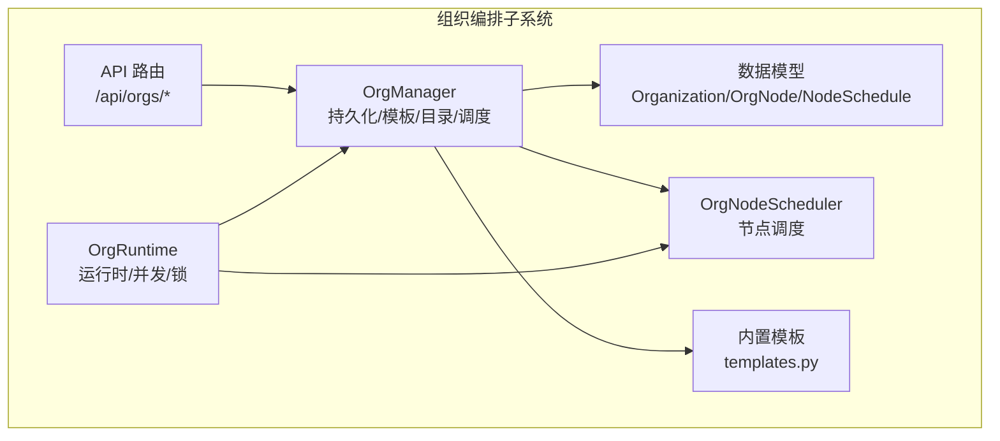
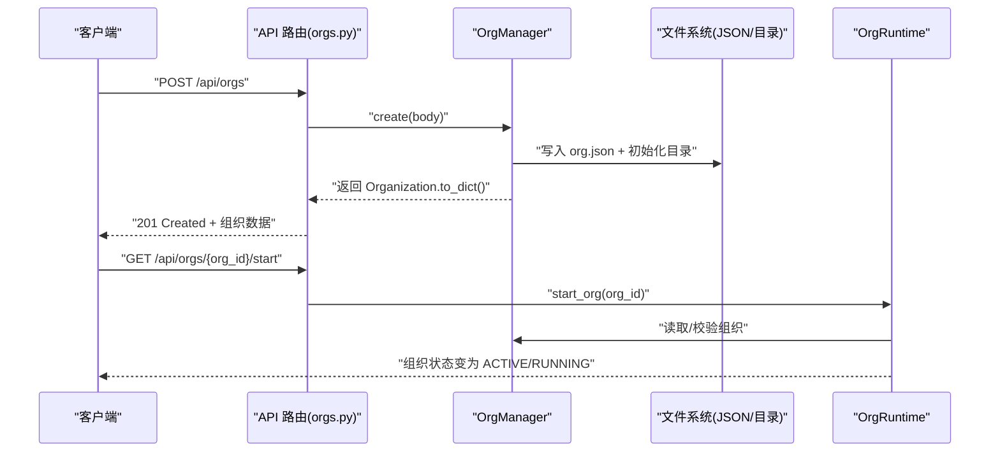
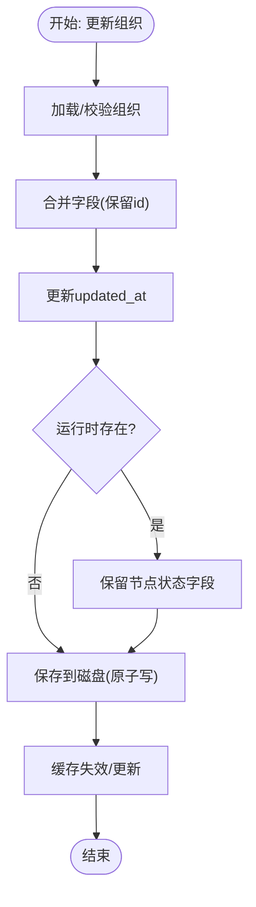
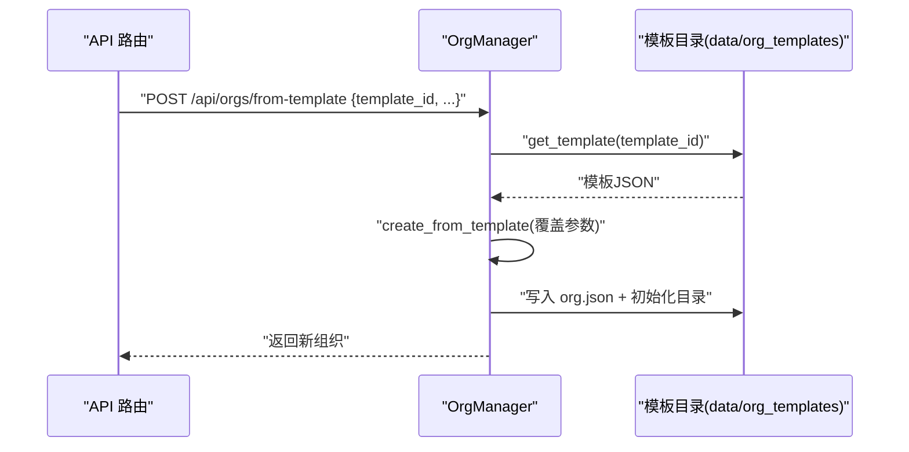
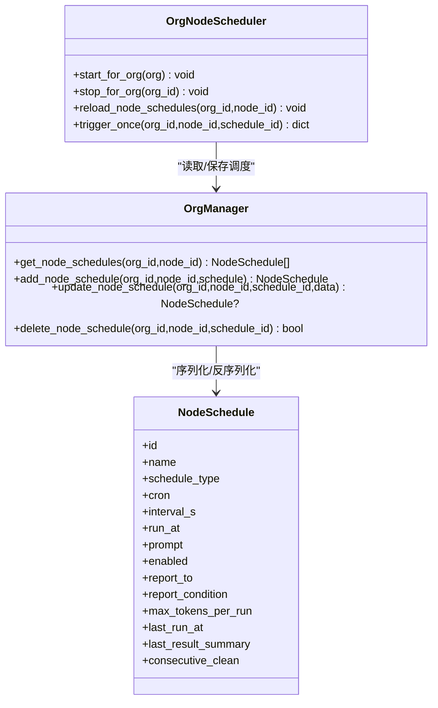
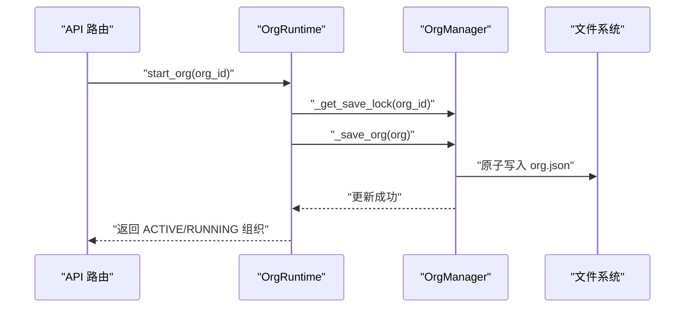
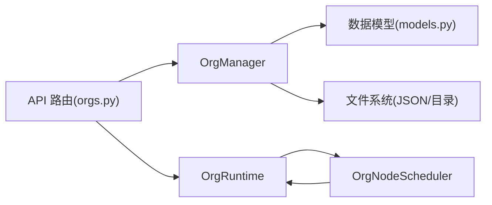

# 组织管理器

<cite>
**本文引用的文件**
- [manager.py](file://src/synapse/orgs/manager.py)
- [models.py](file://src/synapse/orgs/models.py)
- [node_scheduler.py](file://src/synapse/orgs/node_scheduler.py)
- [templates.py](file://src/synapse/orgs/templates.py)
- [runtime.py](file://src/synapse/orgs/runtime.py)
- [orgs.py](file://src/synapse/api/routes/orgs.py)
- [test_manager.py](file://tests/orgs/test_manager.py)
- [test_api.py](file://tests/orgs/test_api.py)
- [test_models.py](file://tests/orgs/test_models.py)
</cite>

## 目录
1. [简介](#简介)
2. [项目结构](#项目结构)
3. [核心组件](#核心组件)
4. [架构总览](#架构总览)
5. [详细组件分析](#详细组件分析)
6. [依赖分析](#依赖分析)
7. [性能考虑](#性能考虑)
8. [故障排查指南](#故障排查指南)
9. [结论](#结论)
10. [附录](#附录)

## 简介
本文件面向“组织管理器”的技术文档，围绕组织的创建、读取、更新、删除（CRUD）、持久化、目录结构管理、组织模板的创建/保存/加载、节点调度的增删改查、状态变更的事务处理与并发控制、缓存机制、API 使用示例、批量操作方法、数据迁移工具、错误处理策略、日志记录机制、性能优化技巧与最佳实践进行系统化阐述。文档以代码为依据，结合测试用例与接口定义，帮助开发者快速理解并正确使用该模块。

## 项目结构
组织管理器位于 synapse 组织编排子系统中，主要文件分布如下：
- 持久化与管理：manager.py
- 数据模型：models.py
- 调度器：node_scheduler.py
- 内置模板：templates.py
- 运行时引擎：runtime.py
- API 路由：orgs.py
- 测试用例：test_manager.py、test_api.py、test_models.py

图表来源
- [manager.py:29-434](file://src/synapse/orgs/manager.py#L29-L434)
- [models.py:131-532](file://src/synapse/orgs/models.py#L131-L532)
- [node_scheduler.py:35-216](file://src/synapse/orgs/node_scheduler.py#L35-L216)
- [templates.py:19-731](file://src/synapse/orgs/templates.py#L19-L731)
- [runtime.py:81-200](file://src/synapse/orgs/runtime.py#L81-L200)
- [orgs.py:66-800](file://src/synapse/api/routes/orgs.py#L66-L800)

章节来源
- [manager.py:29-434](file://src/synapse/orgs/manager.py#L29-L434)
- [models.py:131-532](file://src/synapse/orgs/models.py#L131-L532)
- [node_scheduler.py:35-216](file://src/synapse/orgs/node_scheduler.py#L35-L216)
- [templates.py:19-731](file://src/synapse/orgs/templates.py#L19-L731)
- [runtime.py:81-200](file://src/synapse/orgs/runtime.py#L81-L200)
- [orgs.py:66-800](file://src/synapse/api/routes/orgs.py#L66-L800)

## 核心组件
- 组织管理器（OrgManager）
  - 负责组织的 CRUD、持久化目录树初始化、模板列表/保存/加载、节点调度的增删改查、运行时状态保存/加载、缓存失效等。
  - 关键方法：create、get、update、delete、archive/unarchive、duplicate、list_orgs、save_as_template、list_templates、create_from_template、get_template、get_node_schedules/save_node_schedules/add_node_schedule/update_node_schedule/delete_node_schedule、save_state/load_state/invalidate_cache。
- 数据模型（Organization/OrgNode/NodeSchedule 等）
  - 定义组织、节点、边、消息、内存条目、项目任务、调度等数据结构及序列化/反序列化。
- 节点调度器（OrgNodeScheduler）
  - 管理每个节点的独立定时任务，支持 cron、固定间隔、一次性三种模式；具备智能调频与异常检测。
- 内置模板（templates.py）
  - 提供三套预置组织模板（创业公司、软件团队、内容运营），可安装至模板目录。
- 运行时引擎（OrgRuntime）
  - 负责组织生命周期管理、并发控制、保存锁、节点缓存、心跳/调度/扩编/收件箱/通知/报告等子系统集成。
- API 路由（/api/orgs/*）
  - 提供组织 CRUD、模板、节点调度、节点身份、MCP 配置、生命周期、命令、导出/导入、头像上传等接口。

章节来源
- [manager.py:29-434](file://src/synapse/orgs/manager.py#L29-L434)
- [models.py:131-532](file://src/synapse/orgs/models.py#L131-L532)
- [node_scheduler.py:35-216](file://src/synapse/orgs/node_scheduler.py#L35-L216)
- [templates.py:19-731](file://src/synapse/orgs/templates.py#L19-L731)
- [runtime.py:81-200](file://src/synapse/orgs/runtime.py#L81-L200)
- [orgs.py:66-800](file://src/synapse/api/routes/orgs.py#L66-L800)

## 架构总览
组织管理器通过 API 路由接收请求，交由 OrgManager 执行业务逻辑；持久化采用 JSON 文件与目录结构，调度器与运行时引擎协同管理节点任务与组织状态。

图表来源
- [orgs.py:66-536](file://src/synapse/api/routes/orgs.py#L66-L536)
- [manager.py:29-434](file://src/synapse/orgs/manager.py#L29-L434)
- [runtime.py:153-200](file://src/synapse/orgs/runtime.py#L153-L200)

## 详细组件分析

### 组织 CRUD 与持久化
- 创建/读取/更新/删除/归档/解档/复制
  - create：生成唯一 org_id，初始化目录树与默认文件，写入 org.json。
  - get：从缓存或磁盘加载，不存在抛错。
  - update：合并字段，保留 id，更新 updated_at，必要时同步运行时节点状态。
  - delete：返回布尔值，不存在返回 False。
  - archive/unarchive：切换状态为 ARCHIVED/DORMANT。
  - duplicate：复制组织，生成新 id，状态为 DORMANT。
- 目录结构初始化
  - 自动创建 nodes/policies/departments/memory/logs/reports/artifacts 等子目录，并写入默认文件。
  - 为每个节点创建 identity/mcp_config.json/schedules.json 及部门目录。
- 缓存与并发
  - 写入采用临时文件 + 原子替换，配合写锁保证一致性。
  - 内存缓存按 org_id 存储 Organization 实例，提供 invalidate_cache 清理。
- 状态持久化
  - save_state/load_state 支持运行时状态（如活跃节点）的读写。

图表来源
- [manager.py:356-434](file://src/synapse/orgs/manager.py#L356-L434)
- [orgs.py:223-258](file://src/synapse/api/routes/orgs.py#L223-L258)

章节来源
- [manager.py:29-434](file://src/synapse/orgs/manager.py#L29-L434)
- [orgs.py:66-299](file://src/synapse/api/routes/orgs.py#L66-L299)
- [test_manager.py:45-101](file://tests/orgs/test_manager.py#L45-L101)

### 组织模板：创建/保存/加载
- 保存为模板
  - save_as_template：将现有组织导出为模板 id，写入 data/org_templates/{id}.json。
- 列表与详情
  - list_templates：扫描模板目录，解析模板元信息（名称、描述、图标、节点数量、标签）。
  - get_template：按 id 读取模板 JSON。
- 从模板创建组织
  - create_from_template：读取模板，移除 is_template 字段，设置新 id 与 DORMANT 状态，应用覆盖参数，再走 create 流程。
- 内置模板
  - templates.py 提供 startup-company/software-team/content-ops 三套模板，首次安装时写入模板目录。

图表来源
- [orgs.py:142-153](file://src/synapse/api/routes/orgs.py#L142-L153)
- [manager.py:282-316](file://src/synapse/orgs/manager.py#L282-L316)
- [templates.py:720-731](file://src/synapse/orgs/templates.py#L720-L731)

章节来源
- [orgs.py:127-153](file://src/synapse/api/routes/orgs.py#L127-L153)
- [manager.py:282-316](file://src/synapse/orgs/manager.py#L282-L316)
- [templates.py:19-731](file://src/synapse/orgs/templates.py#L19-L731)
- [test_manager.py:153-174](file://tests/orgs/test_manager.py#L153-L174)

### 节点调度：增删改查
- 查询
  - get_node_schedules：读取节点的 schedules.json，返回 NodeSchedule 列表。
- 新增
  - add_node_schedule：追加一条 NodeSchedule 并保存。
- 更新
  - update_node_schedule：按 schedule_id 查找并更新字段，支持字符串转枚举类型（如 schedule_type）。
- 删除
  - delete_node_schedule：过滤掉指定 id 的调度项并保存。
- 调度器集成
  - OrgNodeScheduler 启动/停止/重载节点调度，触发一次执行，内部循环根据类型（once/cron/interval）执行任务，具备异常检测与智能调频。

图表来源
- [manager.py:225-276](file://src/synapse/orgs/manager.py#L225-L276)
- [node_scheduler.py:35-216](file://src/synapse/orgs/node_scheduler.py#L35-L216)
- [models.py:213-256](file://src/synapse/orgs/models.py#L213-L256)

章节来源
- [manager.py:225-276](file://src/synapse/orgs/manager.py#L225-L276)
- [node_scheduler.py:35-216](file://src/synapse/orgs/node_scheduler.py#L35-L216)
- [test_manager.py:130-151](file://tests/orgs/test_manager.py#L130-L151)

### 组织状态变更与事务处理
- 状态变更
  - start/stop/pause/resume/reset：通过 OrgRuntime 控制组织生命周期，返回新的组织对象。
- 事务与并发
  - 写入采用临时文件 + 原子替换，避免部分写入导致的数据损坏。
  - 写锁保护 _save 流程，防止并发写冲突。
  - 运行时使用 asyncio.Lock 按 org_id 分离保存锁，避免竞态。
- 缓存失效
  - 更新/删除后主动清理缓存，确保后续读取一致性。

图表来源
- [orgs.py:488-536](file://src/synapse/api/routes/orgs.py#L488-L536)
- [runtime.py:1644-1667](file://src/synapse/orgs/runtime.py#L1644-L1667)
- [manager.py:367-376](file://src/synapse/orgs/manager.py#L367-L376)

章节来源
- [orgs.py:488-536](file://src/synapse/api/routes/orgs.py#L488-L536)
- [runtime.py:1644-1667](file://src/synapse/orgs/runtime.py#L1644-L1667)
- [manager.py:367-376](file://src/synapse/orgs/manager.py#L367-L376)

### 并发访问控制与缓存机制
- 组织级并发
  - 运行时使用 asyncio.Semaphore 限制每个组织同时激活的节点数，默认 5。
- 保存锁
  - 按 org_id 分配 asyncio.Lock，确保同一组织的保存操作串行化。
- Agent 缓存
  - 运行时维护节点 Agent 的 LRU 缓存，带 TTL，减少重复初始化开销。
- 写入一致性
  - 临时文件 + os.replace 原子替换，写锁保护，避免竞态。

章节来源
- [runtime.py:141-147](file://src/synapse/orgs/runtime.py#L141-L147)
- [runtime.py:1644-1649](file://src/synapse/orgs/runtime.py#L1644-L1649)
- [manager.py:373-375](file://src/synapse/orgs/manager.py#L373-L375)

### API 使用示例与批量操作
- 组织 CRUD
  - GET /api/orgs：列出组织（可选包含归档）。
  - POST /api/orgs：创建组织。
  - GET /api/orgs/{org_id}：获取组织。
  - PUT /api/orgs/{org_id}：更新组织（支持覆盖节点状态字段）。
  - DELETE /api/orgs/{org_id}：删除组织。
  - POST /api/orgs/{org_id}/duplicate：复制组织。
  - POST /api/orgs/{org_id}/archive：归档。
  - POST /api/orgs/{org_id}/unarchive：解档。
- 模板
  - GET /api/orgs/templates：模板列表。
  - GET /api/orgs/templates/{template_id}：模板详情。
  - POST /api/orgs/from-template：从模板创建组织。
  - POST /api/orgs/{org_id}/save-as-template：保存为模板。
- 节点调度
  - GET /api/orgs/{org_id}/nodes/{node_id}/schedules：列出调度。
  - POST /api/orgs/{org_id}/nodes/{node_id}/schedules：新增调度。
  - PUT /api/orgs/{org_id}/nodes/{node_id}/schedules/{schedule_id}：更新调度。
  - DELETE /api/orgs/{org_id}/nodes/{node_id}/schedules/{schedule_id}：删除调度。
- 节点身份与 MCP 配置
  - GET/PUT /api/orgs/{org_id}/nodes/{node_id}/identity：读取/更新节点身份文件。
  - GET/PUT /api/orgs/{org_id}/nodes/{node_id}/mcp：读取/更新节点 MCP 配置。
- 生命周期
  - POST /api/orgs/{org_id}/start/stop/pause/resume/reset：启动/停止/暂停/恢复/重置。
- 命令与广播
  - POST /api/orgs/{org_id}/command：提交异步命令，返回 command_id。
  - GET /api/orgs/{org_id}/commands/{command_id}：轮询命令状态。
  - POST /api/orgs/{org_id}/broadcast：组织广播。
- 导出/导入/头像
  - POST /api/orgs/import：从文件导入组织。
  - POST /api/orgs/{org_id}/export：导出组织（可写入指定路径）。
  - GET /api/orgs/avatar-presets：头像预设。
  - POST /api/orgs/avatars/upload：上传自定义头像。

章节来源
- [orgs.py:66-800](file://src/synapse/api/routes/orgs.py#L66-L800)
- [test_api.py:45-79](file://tests/orgs/test_api.py#L45-L79)

### 数据迁移与批量操作
- 导入/导出
  - 导入：支持 .json/.akita-org 文件，自动去重名称，导入组织与相关文件。
  - 导出：导出组织结构与关键目录下的文本文件，支持输出到指定路径。
- 复制组织
  - duplicate：复制组织结构与节点，生成新 id，状态为 DORMANT。
- 模板批量安装
  - ensure_builtin_templates：首次运行时安装内置模板至模板目录。

章节来源
- [orgs.py:156-211](file://src/synapse/api/routes/orgs.py#L156-L211)
- [orgs.py:311-356](file://src/synapse/api/routes/orgs.py#L311-L356)
- [manager.py:82-90](file://src/synapse/orgs/manager.py#L82-L90)
- [templates.py:720-731](file://src/synapse/orgs/templates.py#L720-L731)

### 错误处理策略与日志记录
- API 层
  - 对缺失资源返回 404，非法参数返回 400，未初始化返回 503。
  - 命令异步执行失败会持久化错误消息并通过 WebSocket 广播。
- 管理层
  - 文件不存在/模板不存在抛出 FileNotFoundError/HTTP 404。
  - 更新时对字段类型/枚举进行转换与容错。
- 运行时
  - 保存组织时捕获文件消失等竞态异常，记录警告并从活动组织表移除。
- 日志
  - 使用标准 logging，关键路径（调度、保存、命令）记录详细信息与异常。

章节来源
- [orgs.py:142-153](file://src/synapse/api/routes/orgs.py#L142-L153)
- [orgs.py:262-269](file://src/synapse/api/routes/orgs.py#L262-L269)
- [orgs.py:608-710](file://src/synapse/api/routes/orgs.py#L608-L710)
- [runtime.py:1651-1667](file://src/synapse/orgs/runtime.py#L1651-L1667)

## 依赖分析
- 组件耦合
  - API 路由依赖 OrgManager 与 OrgRuntime。
  - OrgManager 依赖 models 数据结构与文件系统。
  - OrgNodeScheduler 依赖 OrgRuntime 获取事件存储与发送命令。
  - OrgRuntime 依赖多个子系统（心跳、调度、扩编、收件箱、通知、报告）。
- 外部依赖
  - FastAPI 路由装饰器与响应类型。
  - asyncio 异步并发与锁。
  - 标准库 json/pathlib/os。

图表来源
- [orgs.py:66-800](file://src/synapse/api/routes/orgs.py#L66-L800)
- [manager.py:29-434](file://src/synapse/orgs/manager.py#L29-L434)
- [node_scheduler.py:35-216](file://src/synapse/orgs/node_scheduler.py#L35-L216)
- [runtime.py:81-200](file://src/synapse/orgs/runtime.py#L81-L200)

章节来源
- [orgs.py:66-800](file://src/synapse/api/routes/orgs.py#L66-L800)
- [manager.py:29-434](file://src/synapse/orgs/manager.py#L29-L434)
- [node_scheduler.py:35-216](file://src/synapse/orgs/node_scheduler.py#L35-L216)
- [runtime.py:81-200](file://src/synapse/orgs/runtime.py#L81-L200)

## 性能考虑
- I/O 优化
  - 原子写入（临时文件 + replace）降低损坏风险，适合高并发场景。
  - 目录结构预创建，避免运行时多次 mkdir。
- 并发控制
  - 组织级信号量限制并发节点激活数量，避免资源争用。
  - 保存锁按 org_id 分离，减少全局锁竞争。
- 缓存策略
  - 内存缓存 Organization，减少重复解析 JSON。
  - Agent 缓存带 TTL，平衡内存占用与初始化开销。
- 调度效率
  - 调度器支持智能调频：连续无异常自动降频，异常时恢复高频并二次执行，减少无效负载。

章节来源
- [manager.py:367-376](file://src/synapse/orgs/manager.py#L367-L376)
- [runtime.py:141-147](file://src/synapse/orgs/runtime.py#L141-L147)
- [runtime.py:1644-1649](file://src/synapse/orgs/runtime.py#L1644-L1649)
- [node_scheduler.py:108-168](file://src/synapse/orgs/node_scheduler.py#L108-L168)

## 故障排查指南
- 常见问题
  - 组织不存在：API 返回 404；检查 org_id 是否正确。
  - 模板不存在：create_from_template 抛出 FileNotFoundError；确认模板 id。
  - 更新字段非法：API 返回 400；检查字段类型与枚举值。
  - 命令执行失败：查看命令轮询结果与会话日志。
- 排查步骤
  - 检查 org.json 是否存在且可解析。
  - 查看 logs 与 events 目录中的通信与事件日志。
  - 使用 GET /api/orgs/{org_id}/nodes/{node_id}/thinking 获取节点近期思考过程。
  - 清理缓存后重试：invalidate_cache 或重启服务。
- 监控指标
  - 命令队列长度、节点待处理消息数、调度执行耗时与异常次数。

章节来源
- [orgs.py:214-220](file://src/synapse/api/routes/orgs.py#L214-L220)
- [orgs.py:697-709](file://src/synapse/api/routes/orgs.py#L697-L709)
- [orgs.py:756-794](file://src/synapse/api/routes/orgs.py#L756-L794)
- [test_api.py:67-70](file://tests/orgs/test_api.py#L67-L70)

## 结论
组织管理器通过清晰的职责划分与稳健的持久化策略，提供了完整的组织生命周期管理能力。其 API 设计直观，支持模板化与批量操作，调度与运行时系统协同保障了高可用性与可观测性。遵循本文的最佳实践与排障建议，可在复杂场景下保持系统的稳定性与性能。

## 附录
- 数据模型要点
  - Organization：组织主实体，包含状态、策略、通知、内存、标签、统计等字段。
  - OrgNode：节点角色、位置、部门、技能、MCP 服务器、克隆配置等。
  - NodeSchedule：节点定时任务，支持 cron/interval/once 三种类型。
- 测试参考
  - CRUD 与目录结构：test_manager.py
  - API 行为：test_api.py
  - 模型序列化/反序列化：test_models.py

章节来源
- [models.py:323-532](file://src/synapse/orgs/models.py#L323-L532)
- [test_manager.py:96-101](file://tests/orgs/test_manager.py#L96-L101)
- [test_api.py:45-79](file://tests/orgs/test_api.py#L45-L79)
- [test_models.py:185-221](file://tests/orgs/test_models.py#L185-L221)